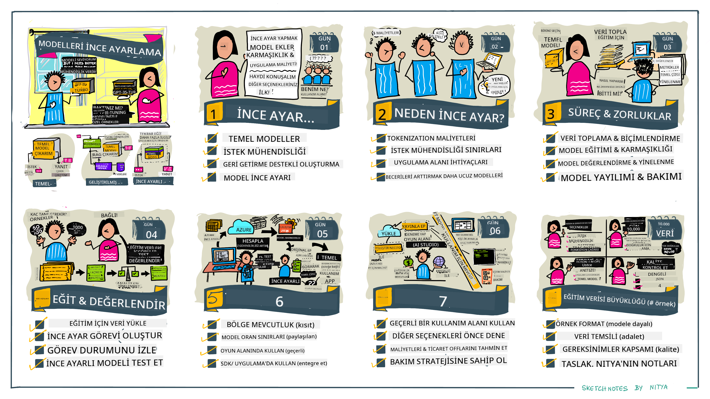

<!--
CO_OP_TRANSLATOR_METADATA:
{
  "original_hash": "68664f7e754a892ae1d8d5e2b7bd2081",
  "translation_date": "2025-07-09T17:42:43+00:00",
  "source_file": "18-fine-tuning/README.md",
  "language_code": "tr"
}
-->

# LLM’inizi İnce Ayarlama

Büyük dil modellerini kullanarak üretken yapay zeka uygulamaları geliştirmek yeni zorlukları beraberinde getirir. Temel sorunlardan biri, modelin belirli bir kullanıcı isteği için oluşturduğu içeriğin yanıt kalitesini (doğruluk ve alaka) sağlamaktır. Önceki derslerde, mevcut modele _girdi istemini değiştirerek_ bu sorunu çözmeye çalışan prompt mühendisliği ve retrieval-augmented generation gibi teknikleri ele aldık.

Bugünkü derste, bu zorluğu _modelin kendisini ek verilerle yeniden eğiterek_ çözmeyi amaçlayan üçüncü bir teknik olan **ince ayarlama**yı tartışacağız. Detaylara geçelim.

## Öğrenme Hedefleri

Bu ders, önceden eğitilmiş dil modelleri için ince ayarlama kavramını tanıtır, bu yaklaşımın faydalarını ve zorluklarını inceler ve üretken yapay zeka modellerinizin performansını artırmak için ince ayarlamanın ne zaman ve nasıl kullanılacağına dair rehberlik sağlar.

Dersin sonunda aşağıdaki soruları yanıtlayabilmelisiniz:

- Dil modelleri için ince ayarlama nedir?
- İnce ayarlama ne zaman ve neden faydalıdır?
- Önceden eğitilmiş bir modeli nasıl ince ayarlayabilirim?
- İnce ayarlamanın sınırlamaları nelerdir?

Hazır mısınız? Başlayalım.

## Görselleştirilmiş Rehber

İçeriğe dalmadan önce genel resmi görmek ister misiniz? Bu dersin öğrenme yolculuğunu anlatan görselleştirilmiş rehbere göz atın — ince ayarlamanın temel kavramları ve motivasyonundan başlayarak, ince ayarlama sürecini ve en iyi uygulamaları anlamaya kadar. Bu keşif için büyüleyici bir konu, bu yüzden kendi kendinize öğrenme yolculuğunuzu destekleyecek ek bağlantılar için [Kaynaklar](./RESOURCES.md?WT.mc_id=academic-105485-koreyst) sayfasını unutmayın!

## Dil Modelleri için İnce Ayarlama Nedir?

Tanım olarak, büyük dil modelleri internet dahil çeşitli kaynaklardan toplanan büyük miktarda metin üzerinde _önceden eğitilmiştir_. Önceki derslerde öğrendiğimiz gibi, modelin kullanıcı sorularına ("promptlara") verdiği yanıtların kalitesini artırmak için _prompt mühendisliği_ ve _retrieval-augmented generation_ gibi tekniklere ihtiyacımız var.

Popüler bir prompt mühendisliği tekniği, modele yanıtında ne beklendiğine dair daha fazla rehberlik vermektir; bu ya _talimatlar_ (açık rehberlik) vererek ya da _birkaç örnek sunarak_ (örtük rehberlik) yapılır. Buna _few-shot learning_ denir ancak iki sınırlaması vardır:

- Modelin token sınırları, verebileceğiniz örnek sayısını kısıtlayabilir ve etkinliği azaltabilir.
- Model token maliyetleri, her prompta örnek eklemeyi pahalı hale getirebilir ve esnekliği sınırlar.

İnce ayarlama, önceden eğitilmiş bir modeli alıp belirli bir görevde performansını artırmak için yeni verilerle yeniden eğitme uygulamasıdır. Dil modelleri bağlamında, önceden eğitilmiş modeli _belirli bir görev veya uygulama alanı için özenle seçilmiş örneklerle_ ince ayarlayarak, o görev veya alan için daha doğru ve alakalı olabilecek **özel bir model** oluşturabiliriz. İnce ayarlamanın yan faydalarından biri, few-shot learning için gereken örnek sayısını azaltarak token kullanımını ve ilgili maliyetleri düşürmesidir.

## Ne Zaman ve Neden Modelleri İnce Ayarlamalıyız?

_Bu_ bağlamda ince ayarlamadan bahsederken, orijinal eğitim veri setinde olmayan **yeni veriler ekleyerek** yapılan **denetimli** ince ayarlamadan söz ediyoruz. Bu, modelin orijinal veriler üzerinde farklı hiperparametrelerle yeniden eğitildiği denetimsiz ince ayarlamadan farklıdır.

Unutulmaması gereken önemli nokta, ince ayarlamanın istenen sonuçları elde etmek için belirli bir uzmanlık gerektiren gelişmiş bir teknik olduğudur. Yanlış yapıldığında beklenen iyileştirmeleri sağlamayabilir, hatta hedeflenen alan için model performansını düşürebilir.

Bu yüzden "dil modellerini nasıl ince ayarlayacağınızı" öğrenmeden önce, "neden" bu yolu seçmeniz gerektiğini ve "ne zaman" ince ayarlama sürecine başlamanız gerektiğini bilmelisiniz. Kendinize şu soruları sorun:

- **Kullanım Durumu**: İnce ayarlama için kullanım durumunuz nedir? Mevcut önceden eğitilmiş modelin hangi yönünü geliştirmek istiyorsunuz?
- **Alternatifler**: İstenen sonuçları elde etmek için _başka teknikler_ denediniz mi? Bunları karşılaştırma için temel olarak kullanın.
  - Prompt mühendisliği: İlgili prompt yanıtları örnekleriyle few-shot prompting gibi teknikleri deneyin. Yanıtların kalitesini değerlendirin.
  - Retrieval Augmented Generation: Verilerinizi arayarak elde edilen sorgu sonuçlarıyla promptları zenginleştirmeyi deneyin. Yanıtların kalitesini değerlendirin.
- **Maliyetler**: İnce ayarlama maliyetlerini belirlediniz mi?
  - İncelenebilirlik - önceden eğitilmiş model ince ayarlamaya uygun mu?
  - Çaba - eğitim verisi hazırlama, modeli değerlendirme ve iyileştirme için gereken emek
  - Hesaplama - ince ayarlama işlemlerini çalıştırma ve ince ayarlanmış modeli dağıtma için gereken kaynaklar
  - Veri - ince ayarlama etkisi için yeterli kalitede örneklere erişim
- **Faydalar**: İnce ayarlamanın faydalarını doğruladınız mı?
  - Kalite - ince ayarlanmış model temel modeli geride bıraktı mı?
  - Maliyet - promptları basitleştirerek token kullanımını azaltıyor mu?
  - Genişletilebilirlik - temel modeli yeni alanlar için yeniden kullanabilir misiniz?

Bu soruları yanıtlayarak, ince ayarlamanın kullanım durumunuz için doğru yaklaşım olup olmadığına karar verebilirsiniz. İdeal olarak, faydalar maliyetlerden fazla olmalıdır. Devam etmeye karar verdiğinizde, önceden eğitilmiş modeli _nasıl_ ince ayarlayabileceğinizi düşünmenin zamanı gelmiştir.

Karar verme süreci hakkında daha fazla bilgi edinmek ister misiniz? [To fine-tune or not to fine-tune](https://www.youtube.com/watch?v=0Jo-z-MFxJs) videosunu izleyin.

## Önceden Eğitilmiş Bir Model Nasıl İnce Ayarlanır?

Önceden eğitilmiş bir modeli ince ayarlamak için şunlara ihtiyacınız vardır:

- ince ayar yapılacak önceden eğitilmiş model
- ince ayarlama için kullanılacak veri seti
- ince ayarlama işlemini çalıştıracak eğitim ortamı
- ince ayarlanmış modeli dağıtmak için barındırma ortamı

## İnce Ayarlama Uygulaması

Aşağıdaki kaynaklar, seçilmiş bir model ve özenle hazırlanmış bir veri seti kullanarak gerçek bir örnek üzerinden adım adım rehberlik sağlar. Bu eğitimleri uygulamak için ilgili sağlayıcıda bir hesabınızın olması ve ilgili model ile veri setlerine erişiminizin bulunması gerekir.

| Sağlayıcı    | Eğitim                                                                                                                                                                       | Açıklama                                                                                                                                                                                                                                                                                                                                                                                                                         |
| ------------ | ---------------------------------------------------------------------------------------------------------------------------------------------------------------------------- | -------------------------------------------------------------------------------------------------------------------------------------------------------------------------------------------------------------------------------------------------------------------------------------------------------------------------------------------------------------------------------------------------------------------------------- |
| OpenAI       | [Chat modellerini nasıl ince ayarlarsınız](https://github.com/openai/openai-cookbook/blob/main/examples/How_to_finetune_chat_models.ipynb?WT.mc_id=academic-105485-koreyst) | `gpt-35-turbo` modelini belirli bir alan ("tarif asistanı") için nasıl ince ayarlayacağınızı öğrenin; eğitim verisi hazırlama, ince ayarlama işlemini çalıştırma ve ince ayarlanmış modeli çıkarım için kullanma adımlarını içerir.                                                                                                                                                                                             |
| Azure OpenAI | [GPT 3.5 Turbo ince ayarlama eğitimi](https://learn.microsoft.com/azure/ai-services/openai/tutorials/fine-tune?tabs=python-new%2Ccommand-line?WT.mc_id=academic-105485-koreyst) | `gpt-35-turbo-0613` modelini **Azure üzerinde** nasıl ince ayarlayacağınızı öğrenin; eğitim verisi oluşturma ve yükleme, ince ayarlama işlemini çalıştırma, yeni modeli dağıtma ve kullanma adımlarını içerir.                                                                                                                                                                                                                      |
| Hugging Face | [Hugging Face ile LLM ince ayarlama](https://www.philschmid.de/fine-tune-llms-in-2024-with-trl?WT.mc_id=academic-105485-koreyst)                                             | Bu blog yazısı, [transformers](https://huggingface.co/docs/transformers/index?WT.mc_id=academic-105485-koreyst) kütüphanesi ve [Transformer Reinforcement Learning (TRL)](https://huggingface.co/docs/trl/index?WT.mc_id=academic-105485-koreyst) kullanarak açık bir LLM’yi (örneğin `CodeLlama 7B`) nasıl ince ayarlayacağınızı anlatır. Ayrıca Hugging Face üzerindeki açık [veri setleri](https://huggingface.co/docs/datasets/index?WT.mc_id=academic-105485-koreyst) kullanılır. |
|              |                                                                                                                                                                              |                                                                                                                                                                                                                                                                                                                                                                                                                                  |
| 🤗 AutoTrain | [AutoTrain ile LLM ince ayarlama](https://github.com/huggingface/autotrain-advanced/?WT.mc_id=academic-105485-koreyst)                                                       | AutoTrain (veya AutoTrain Advanced), Hugging Face tarafından geliştirilen ve birçok farklı görev için, LLM ince ayarlama dahil, ince ayarlama yapmanızı sağlayan bir Python kütüphanesidir. AutoTrain, kod yazmadan kullanılabilen bir çözümdür ve ince ayarlama işlemi kendi bulutunuzda, Hugging Face Spaces üzerinde veya yerel olarak yapılabilir. Web tabanlı GUI, CLI ve yaml konfigürasyon dosyaları ile eğitim desteği sunar.                                   |
|              |                                                                                                                                                                              |                                                                                                                                                                                                                                                                                                                                                                                                                                  |

## Ödev

Yukarıdaki eğitimlerden birini seçin ve adım adım uygulayın. _Bu eğitimlerin bir versiyonunu referans amaçlı olarak bu repoda Jupyter Notebook’larda çoğaltabiliriz. En güncel sürümler için lütfen orijinal kaynakları doğrudan kullanın_.

## Harika İş! Öğrenmeye Devam Edin.

Bu dersi tamamladıktan sonra, üretken yapay zeka bilginizi geliştirmeye devam etmek için [Generative AI Learning koleksiyonumuza](https://aka.ms/genai-collection?WT.mc_id=academic-105485-koreyst) göz atın!

Tebrikler!! Bu kursun v2 serisindeki son dersi tamamladınız! Öğrenmeyi ve geliştirmeyi bırakmayın. \*\*Sadece bu konu için ek öneriler içeren listeyi görmek için [KAYNAKLAR](RESOURCES.md?WT.mc_id=academic-105485-koreyst) sayfasını inceleyin.

v1 ders serimiz de daha fazla ödev ve kavramla güncellendi. Bilginizi tazelemek için bir dakikanızı ayırın ve lütfen [sorularınızı ve geri bildirimlerinizi paylaşın](https://github.com/microsoft/generative-ai-for-beginners/issues?WT.mc_id=academic-105485-koreyst) — böylece bu dersleri topluluk için daha iyi hale getirebiliriz.

**Feragatname**:  
Bu belge, AI çeviri servisi [Co-op Translator](https://github.com/Azure/co-op-translator) kullanılarak çevrilmiştir. Doğruluk için çaba göstersek de, otomatik çevirilerin hatalar veya yanlışlıklar içerebileceğini lütfen unutmayın. Orijinal belge, kendi dilinde yetkili kaynak olarak kabul edilmelidir. Kritik bilgiler için profesyonel insan çevirisi önerilir. Bu çevirinin kullanımı sonucu ortaya çıkabilecek yanlış anlamalar veya yorum hatalarından sorumlu değiliz.