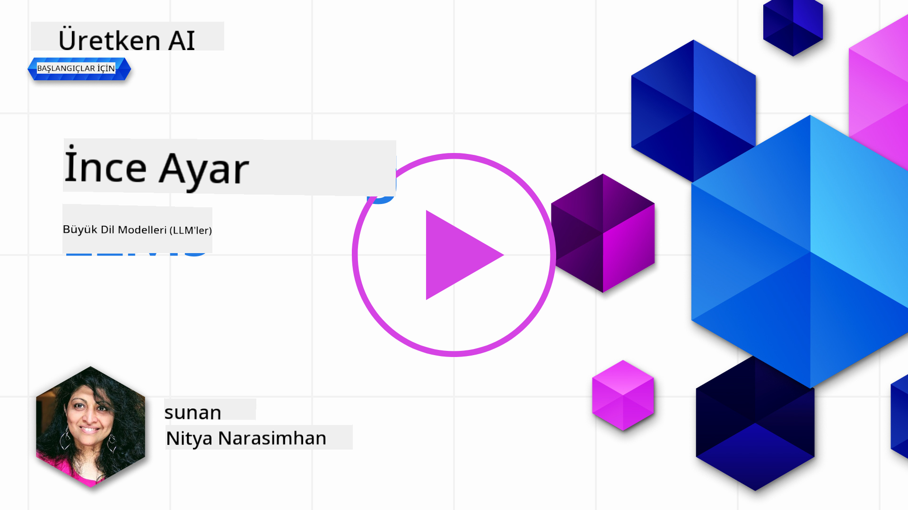

<!--
CO_OP_TRANSLATOR_METADATA:
{
  "original_hash": "68664f7e754a892ae1d8d5e2b7bd2081",
  "translation_date": "2025-05-20T07:47:29+00:00",
  "source_file": "18-fine-tuning/README.md",
  "language_code": "tr"
}
-->

# LLM'inizi İnce Ayarlama

Büyük dil modellerini kullanarak üretken yapay zeka uygulamaları geliştirmek yeni zorlukları beraberinde getirir. Ana sorun, model tarafından belirli bir kullanıcı isteği için üretilen içeriğin yanıt kalitesini (doğruluk ve alaka düzeyi) sağlamaktır. Önceki derslerde, mevcut modele verilen istem girdisini _değiştirerek_ sorunu çözmeye çalışan istem mühendisliği ve alma-ile zenginleştirilmiş üretim gibi teknikleri tartıştık.

Bugünkü derste, _modeli kendisini_ ek verilerle yeniden eğiterek zorluğun üstesinden gelmeye çalışan üçüncü bir teknik olan **ince ayarlamayı** tartışıyoruz. Detaylara dalalım.

## Öğrenme Hedefleri

Bu ders, önceden eğitilmiş dil modelleri için ince ayarlama kavramını tanıtıyor, bu yaklaşımın faydalarını ve zorluklarını araştırıyor ve üretken yapay zeka modellerinizin performansını artırmak için ince ayarlamayı ne zaman ve nasıl kullanacağınız konusunda rehberlik sunuyor.

Bu dersin sonunda aşağıdaki soruları cevaplayabilmelisiniz:

- Dil modelleri için ince ayarlama nedir?
- İnce ayarlama ne zaman ve neden faydalıdır?
- Önceden eğitilmiş bir modeli nasıl ince ayarlayabilirim?
- İnce ayarlamanın sınırlamaları nelerdir?

Hazır mısınız? Başlayalım.

## Resimli Kılavuz

Detaylara dalmadan önce neyi ele alacağımızı genel olarak görmek ister misiniz? Bu ders için öğrenme yolculuğunu tanımlayan resimli kılavuzu inceleyin - ince ayarlama için temel kavramları ve motivasyonu öğrenmekten, ince ayarlama görevini yürütme sürecini ve en iyi uygulamaları anlamaya kadar. Bu keşif için büyüleyici bir konu, bu yüzden kendi kendine öğrenme yolculuğunuzu desteklemek için ek bağlantılar içeren [Kaynaklar](./RESOURCES.md?WT.mc_id=academic-105485-koreyst) sayfasını incelemeyi unutmayın!

## Dil modelleri için ince ayarlama nedir?

Tanım gereği, büyük dil modelleri internet dahil çeşitli kaynaklardan elde edilen büyük miktarda metin üzerinde _önceden eğitilmiştir_. Önceki derslerde öğrendiğimiz gibi, kullanıcının sorularına ("istemler") modelin yanıtlarının kalitesini artırmak için _istem mühendisliği_ ve _alma-ile zenginleştirilmiş üretim_ gibi tekniklere ihtiyacımız var.

Popüler bir istem mühendisliği tekniği, modelin yanıtında beklenen şey hakkında daha fazla rehberlik sağlamak için ya _talimatlar_ (açık rehberlik) sağlayarak ya da _birkaç örnek vererek_ (örtük rehberlik) modelin yanıtına rehberlik etmeyi içerir. Bu, _az örnekli öğrenme_ olarak adlandırılır, ancak iki sınırlaması vardır:

- Model token sınırları verebileceğiniz örnek sayısını sınırlayabilir ve etkinliği sınırlayabilir.
- Model token maliyetleri, her isteme örnek eklemeyi pahalı hale getirebilir ve esnekliği sınırlayabilir.

İnce ayarlama, önceden eğitilmiş bir modeli alıp belirli bir görevde performansını artırmak için yeni verilerle yeniden eğittiğimiz makine öğrenme sistemlerinde yaygın bir uygulamadır. Dil modelleri bağlamında, önceden eğitilmiş modeli _belirli bir görev veya uygulama alanı için özenle seçilmiş bir örnek setiyle_ ince ayarlayarak, belirli görev veya alan için daha doğru ve ilgili olabilecek **özel bir model** oluşturabiliriz. İnce ayarlamanın yan faydası, az örnekli öğrenme için gereken örnek sayısını azaltarak token kullanımını ve ilgili maliyetleri azaltabilmesidir.

## Modelleri ne zaman ve neden ince ayarlamalıyız?

_Bu_ bağlamda, ince ayarlamadan bahsettiğimizde, yeniden eğitimin **orijinal eğitim veri setinin bir parçası olmayan yeni veriler eklenerek** yapıldığı **denetimli** ince ayarlamayı kastediyoruz. Bu, modelin orijinal veriler üzerinde farklı hiperparametrelerle yeniden eğitildiği denetimsiz ince ayarlama yaklaşımından farklıdır.

Hatırlanması gereken önemli şey, ince ayarlamanın istenen sonuçları elde etmek için belirli bir uzmanlık düzeyi gerektiren ileri bir teknik olduğudur. Yanlış yapıldığında, beklenen iyileştirmeleri sağlamayabilir ve hedeflediğiniz alan için modelin performansını bile düşürebilir.

Bu yüzden dil modellerini nasıl ince ayarlayacağınızı öğrenmeden önce, neden bu yolu seçmeniz gerektiğini ve ince ayarlama sürecine ne zaman başlamanız gerektiğini bilmelisiniz. Kendinize şu soruları sormaya başlayın:

- **Kullanım Durumu**: İnce ayarlama için _kullanım durumunuz_ nedir? Mevcut önceden eğitilmiş modelin hangi yönünü geliştirmek istiyorsunuz?
- **Alternatifler**: İstenen sonuçları elde etmek için _diğer teknikleri_ denediniz mi? Karşılaştırma için bir temel oluşturmak için onları kullanın.
  - İstem mühendisliği: İlgili istem yanıtları örnekleriyle az örnekli istemleme gibi teknikleri deneyin. Yanıtların kalitesini değerlendirin.
  - Alma-ile Zenginleştirilmiş Üretim: Verilerinizi arayarak elde edilen sorgu sonuçlarıyla istemleri zenginleştirmeyi deneyin. Yanıtların kalitesini değerlendirin.
- **Maliyetler**: İnce ayarlama için maliyetleri belirlediniz mi?
  - Ayarlanabilirlik - önceden eğitilmiş model ince ayarlama için uygun mu?
  - Çaba - eğitim verilerini hazırlama, modeli değerlendirme ve iyileştirme için.
  - Hesaplama - ince ayarlama işleri yürütmek ve ince ayarlanmış modeli dağıtmak için.
  - Veri - ince ayarlama etkisi için yeterli kaliteli örneklere erişim
- **Faydalar**: İnce ayarlama için faydaları doğruladınız mı?
  - Kalite - ince ayarlanmış model temel performansı aştı mı?
  - Maliyet - istemleri basitleştirerek token kullanımını azaltıyor mu?
  - Genişletilebilirlik - temel modeli yeni alanlar için yeniden kullanabilir misiniz?

Bu soruları yanıtlayarak ince ayarlamanın kullanım durumunuz için doğru yaklaşım olup olmadığını belirleyebilirsiniz. İdeal olarak, yaklaşım yalnızca faydalar maliyetlerden ağır basarsa geçerlidir. Devam etmeye karar verdiğinizde, önceden eğitilmiş modeli _nasıl_ ince ayarlayabileceğinizi düşünmenin zamanı gelmiştir.

Karar verme süreci hakkında daha fazla bilgi mi almak istiyorsunuz? [İnce ayarlamak mı yoksa ince ayarlamamak mı](https://www.youtube.com/watch?v=0Jo-z-MFxJs) izleyin.

## Önceden eğitilmiş bir modeli nasıl ince ayarlayabiliriz?

Önceden eğitilmiş bir modeli ince ayarlamak için ihtiyacınız olanlar:

- ince ayarlamak için önceden eğitilmiş bir model
- ince ayarlama için kullanılacak bir veri seti
- ince ayarlama işini yürütmek için bir eğitim ortamı
- ince ayarlanmış modeli dağıtmak için bir barındırma ortamı

## İnce Ayarlama Eylemde

Aşağıdaki kaynaklar, seçilmiş bir model ve özenle seçilmiş bir veri seti kullanarak gerçek bir örneği adım adım öğretici ile yürütmeniz için rehberlik sağlar. Bu öğreticilerde çalışmak için belirli sağlayıcıda bir hesaba ve ilgili model ve veri setlerine erişime ihtiyacınız vardır.

| Sağlayıcı    | Öğretici                                                                                                                                                                       | Açıklama                                                                                                                                                                                                                                                                                                                                                                                                                        |
| ------------ | ------------------------------------------------------------------------------------------------------------------------------------------------------------------------------ | ---------------------------------------------------------------------------------------------------------------------------------------------------------------------------------------------------------------------------------------------------------------------------------------------------------------------------------------------------------------------------------------------------------------------------------- |
| OpenAI       | [Sohbet modellerini nasıl ince ayarlayabilirsiniz](https://github.com/openai/openai-cookbook/blob/main/examples/How_to_finetune_chat_models.ipynb?WT.mc_id=academic-105485-koreyst)                | Eğitim verilerini hazırlayarak, ince ayarlama işini yürüterek ve ince ayarlanmış modeli çıkarım için kullanarak belirli bir alan ("tarif asistanı") için `gpt-35-turbo` ince ayarlamayı öğrenin.                                                                                                                                                                                                                                              |
| Azure OpenAI | [GPT 3.5 Turbo ince ayarlama öğretici](https://learn.microsoft.com/azure/ai-services/openai/tutorials/fine-tune?tabs=python-new%2Ccommand-line?WT.mc_id=academic-105485-koreyst) | Eğitim verilerini oluşturma ve yükleme adımlarını atarak ince ayarlama işini yürütme, yeni modeli dağıtma ve kullanma adımlarını **Azure üzerinde** `gpt-35-turbo-0613` modelini ince ayarlamayı öğrenin.                                                                                                                                                                                                                                                                 |
| Hugging Face | [Hugging Face ile LLM'leri ince ayarlama](https://www.philschmid.de/fine-tune-llms-in-2024-with-trl?WT.mc_id=academic-105485-koreyst)                                               | Bu blog yazısı, [transformers](https://huggingface.co/docs/transformers/index?WT.mc_id=academic-105485-koreyst) kütüphanesi ve [Transformer Reinforcement Learning (TRL)](https://huggingface.co/docs/trl/index?WT.mc_id=academic-105485-koreyst]) ile açık [veri setleri](https://huggingface.co/docs/datasets/index?WT.mc_id=academic-105485-koreyst) kullanarak _açık LLM_ (ör: `CodeLlama 7B`) ince ayarlamayı size adım adım anlatır. |
|              |                                                                                                                                                                                |                                                                                                                                                                                                                                                                                                                                                                                                                                    |
| 🤗 AutoTrain | [AutoTrain ile LLM'leri ince ayarlama](https://github.com/huggingface/autotrain-advanced/?WT.mc_id=academic-105485-koreyst)                                                         | AutoTrain (veya AutoTrain Advanced), Hugging Face tarafından geliştirilen ve LLM ince ayarlama dahil birçok farklı görev için ince ayarlamayı sağlayan bir python kütüphanesidir. AutoTrain kodsuz bir çözüm olup, ince ayarlama kendi bulutunuzda, Hugging Face Spaces üzerinde veya yerel olarak yapılabilir. Hem web tabanlı bir GUI, CLI ve yaml yapılandırma dosyaları aracılığıyla eğitim destekler.                                                                               |
|              |                                                                                                                                                                                |                                                                                                                                                                                                                                                                                                                                                                                                                                    |

## Ödev

Yukarıdaki öğreticilerden birini seçin ve adım adım ilerleyin. _Bu öğreticilerin bir versiyonunu referans için yalnızca bu depoda Jupyter Notebooks'ta çoğaltabiliriz. En son versiyonları almak için lütfen doğrudan orijinal kaynakları kullanın_.

## Harika İş! Öğrenmeye Devam Edin.

Bu dersi tamamladıktan sonra, Üretken Yapay Zeka bilginizi artırmak için [Üretken Yapay Zeka Öğrenme koleksiyonumuzu](https://aka.ms/genai-collection?WT.mc_id=academic-105485-koreyst) inceleyin!

Tebrikler!! Bu kurs için v2 serisinin son dersini tamamladınız! Öğrenmeyi ve inşa etmeyi bırakmayın. \*\*Sadece bu konu için ek öneriler listesi içeren [KAYNAKLAR](RESOURCES.md?WT.mc_id=academic-105485-koreyst) sayfasını inceleyin.

Derslerin v1 serisi de daha fazla ödev ve kavramlarla güncellendi. Bilginizi tazelemek için bir dakikanızı ayırın - ve lütfen bu dersleri topluluk için geliştirmemize yardımcı olmak için [sorularınızı ve geri bildirimlerinizi paylaşın](https://github.com/microsoft/generative-ai-for-beginners/issues?WT.mc_id=academic-105485-koreyst).

**Feragatname**:  
Bu belge, [Co-op Translator](https://github.com/Azure/co-op-translator) adlı yapay zeka çeviri hizmeti kullanılarak çevrilmiştir. Doğruluk için çaba göstersek de, otomatik çevirilerin hata veya yanlışlıklar içerebileceğini lütfen unutmayın. Belgenin orijinal dili, yetkili kaynak olarak kabul edilmelidir. Kritik bilgiler için profesyonel insan çevirisi önerilir. Bu çevirinin kullanımından kaynaklanan yanlış anlamalar veya yanlış yorumlamalardan sorumlu değiliz.