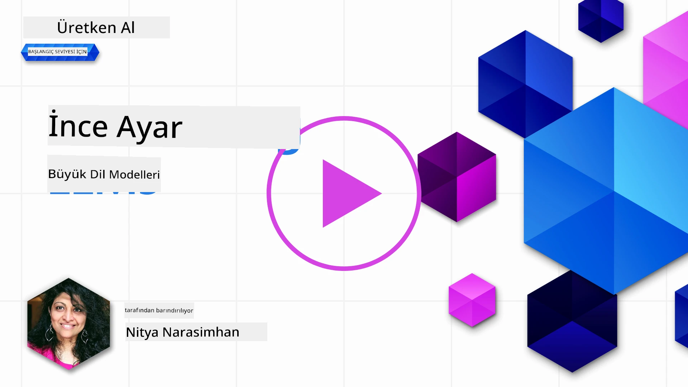
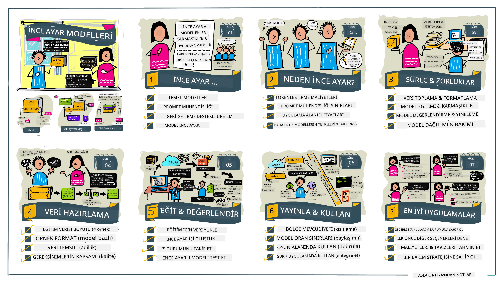

# LLM'inizi İnce Ayarlama

Büyük dil modellerini kullanarak üretici yapay zeka uygulamaları oluşturmak yeni zorluklar getirir. Önemli bir konu, modele verilen bir kullanıcı talebi için üretilen içeriğin yanıt kalitesini (doğruluk ve alaka) sağlamaktır. Önceki derslerde, mevcut modele _girdi istemini değiştirerek_ problemi çözmeye çalışan istem mühendisliği ve geri alma destekli üretim gibi tekniklerden bahsettik.

Bugünkü derste, modeli ek veriyle _yeniden eğiterek_ bu zorluğun üstesinden gelmeye çalışan üçüncü bir teknik olan **ince ayar (fine-tuning)** konusunu tartışacağız. Detaylara dalalım.

## Öğrenme Hedefleri

Bu ders, önceden eğitilmiş dil modelleri için ince ayar kavramını tanıtır, bu yaklaşımın faydalarını ve zorluklarını inceler ve üretici yapay zeka modellerinizin performansını artırmak için ince ayarın ne zaman ve nasıl yapılacağı konusunda rehberlik sağlar.

Dersin sonunda aşağıdaki soruları yanıtlayabilecek duruma gelmelisiniz:

- Dil modelleri için ince ayar nedir?
- İnce ayar ne zaman ve neden faydalıdır?
- Önceden eğitilmiş bir modeli nasıl ince ayar yapabilirim?
- İnce ayarın sınırlamaları nelerdir?

Hazır mısınız? Başlayalım.

## Görselleştirilmiş Rehber

Derse başlamadan önce ele alacağımız genel resmi görmek ister misiniz? Bu görselleştirilmiş rehber, ince ayarın temel kavramlarını ve motivasyonunu öğrenmekten ince ayar sürecini ve en iyi uygulamaları anlamaya kadar öğrenme yolculuğunu açıklar. Bu keşfetmesi büyüleyici bir konu, bu yüzden kendi kendinize öğrenme yolculuğunuzu destekleyecek ek bağlantılar için [Kaynaklar](./RESOURCES.md?WT.mc_id=academic-105485-koreyst) sayfasını da unutmayın!

## Dil modelleri için ince ayar nedir?

Tanım olarak, büyük dil modelleri internet dahil çeşitli kaynaklardan büyük miktarda metinle _önceden eğitilmiş_tir. Önceki derslerde öğrendiğimiz gibi, modelin kullanıcı sorularına ("istemlere") verdiği yanıtların kalitesini artırmak için _istem mühendisliği_ ve _geri alma destekli üretim_ gibi tekniklere ihtiyacımız var.

Popüler bir istem mühendisliği tekniği, modele yanıtın ne olması gerektiği konusunda daha fazla rehberlik vermektir; bu ya _talimatlar_ (açık rehberlik) sunarak ya da _birkaç örnek vererek_ (örtük rehberlik). Buna _az örnekle öğrenme (few-shot learning)_ denir ancak iki kısıtlaması vardır:

- Model token sınırları, verebileceğiniz örnek sayısını kısıtlar ve etkinliği sınırlar.
- Model token maliyetleri, her isteme örnek eklemeyi pahalılaştırabilir ve esnekliği sınırlar.

İnce ayar, makine öğrenmesi sistemlerinde yaygın bir uygulamadır; önceden eğitilmiş bir modeli alır ve belirli bir görevde performansını artırmak için yeni verilerle yeniden eğitiriz. Dil modelleri bağlamında, önceden eğitilmiş modeli _belirli bir görev veya uygulama alanı için titizlikle seçilmiş örneklerle_ ince ayar yaparak o belirli görev veya alan için daha doğru ve alakalı olabilecek **özel bir model** oluşturabiliriz. İnce ayarın yan faydası, az örnekle öğrenme için gereken örnek sayısını azaltarak token kullanımını ve maliyetleri düşürebilmesidir.

## Modelleri ne zaman ve neden ince ayar yapmalıyız?

_Bu_ bağlamda, ince ayardan bahsederken, yeniden eğitimin orijinal eğitim veri kümesinde olmayan **yeni veriler ekleyerek** yapıldığı **denetimli** ince ayardan bahsediyoruz. Bu, modelin orijinal veriler üzerinde farklı hiperparametrelerle tekrar eğitildiği denetimsiz ince ayardan farklıdır.

Hatırlanması gereken önemli nokta, ince ayarın gelişmiş bir teknik olduğudur ve istenen sonuçları almak için belirli bir uzmanlık gerektirir. Yanlış yapılırsa beklenen iyileştirmeleri sağlamayabilir ve hatta modelin hedeflenen alan için performansını kötüleştirebilir.

Bu yüzden "dil modellerini nasıl ince ayar yapabilirim" öğrenmeden önce, "neden" bu yolu seçmelisiniz ve ince ayar sürecine "ne zaman" başlamalısınız bilmelisiniz. İlk olarak kendinize şu soruları sorun:

- **Kullanım Durumu**: İnce ayar için kullanım durumunuz nedir? Mevcut önceden eğitilmiş modelin hangi yönünü geliştirmek istiyorsunuz?
- **Alternatifler**: İstenen sonuçları elde etmek için _başka teknikler_ denediniz mi? Bunları karşılaştırma için temel olarak kullanın.
  - İstem mühendisliği: İlgili istem yanıtlarıyla az örnekli isteme yöntemlerini deneyin. Yanıt kalitesini değerlendirin.
  - Geri Alma Destekli Üretim: İstemleri verilerinizi sorgulayarak elde edilen sonuçlarla zenginleştirin. Yanıt kalitesini değerlendirin.
- **Maliyetler**: İnce ayarın maliyetlerini belirlediniz mi?
  - İncelenebilirlik - Önceden eğitilmiş model ince ayar için uygun mu?
  - Çaba - Eğitim verilerinin hazırlanması, modelin değerlendirilmesi ve iyileştirilmesi için gereken çaba
  - Hesaplama - İnce ayar işleri çalıştırma ve ince ayarlı modeli dağıtma için gereken hesaplama gücü
  - Veri - İnce ayarın etkili olması için yeterli kaliteli örnek erişimi
- **Faydalar**: İnce ayarın faydalarını doğruladınız mı?
  - Kalite - İnce ayarlı model temel modeli geride bıraktı mı?
  - Maliyet - İstemleri basitleştirerek token kullanımını azalttı mı?
  - Genişletilebilirlik - Temel modeli yeni alanlarda kullanabilir misiniz?

Bu soruları yanıtlayarak, ince ayarın kullanım durumunuz için uygun olup olmadığına karar verebilirsiniz. İdeal olarak, yaklaşım yalnızca faydalar maliyetlerden fazla ise geçerlidir. Devam etmeye karar verdiğinizde, önceden eğitilmiş modeli _nasıl_ ince ayar yapabileceğinizi düşünmenin zamanı gelmiştir.

Karar verme süreci hakkında daha fazla bilgi almak ister misiniz? [İnce ayar yapmalı mı yapmamalı mı?](https://www.youtube.com/watch?v=0Jo-z-MFxJs) videosunu izleyin.

## Önceden eğitilmiş bir modeli nasıl ince ayar yapabiliriz?

Önceden eğitilmiş bir modeli ince ayar yapmak için gerekir:

- ince ayar yapmak için önceden eğitilmiş bir model
- ince ayar için kullanılacak bir veri seti
- ince ayar işini çalıştırmak için bir eğitim ortamı
- ince ayarlı modeli dağıtmak için bir barındırma ortamı

## İnce Ayar Uygulamada

Aşağıdaki kaynaklar, seçilmiş bir modeli ve seçilmiş bir veri setini kullanarak gerçek bir örnek üzerinde adım adım rehberlik sağlar. Bu dersleri çalışmak için ilgili sağlayıcıda bir hesabınız, model ve veri setlerine erişiminiz olmalıdır.

| Sağlayıcı    | Eğitim                                                                                                                                                                        | Açıklama                                                                                                                                                                                                                                                                                                                                                                                                                      |
| ------------ | ----------------------------------------------------------------------------------------------------------------------------------------------------------------------------- | ---------------------------------------------------------------------------------------------------------------------------------------------------------------------------------------------------------------------------------------------------------------------------------------------------------------------------------------------------------------------------------------------------------------------------- |
| OpenAI       | [Chat modellerini nasıl ince ayar yaparım](https://github.com/openai/openai-cookbook/blob/main/examples/How_to_finetune_chat_models.ipynb?WT.mc_id=academic-105485-koreyst)    | Belirli bir alan ("tarif asistanı") için `gpt-35-turbo` modelini ince ayar yapmak; eğitim verilerini hazırlama, ince ayar işini çalıştırma ve ince ayarlı modeli çıkarım için kullanmayı öğrenin.                                                                                                                                                                                                                            |
| Azure OpenAI | [GPT 3.5 Turbo ince ayar eğitimi](https://learn.microsoft.com/azure/ai-services/openai/tutorials/fine-tune?tabs=python-new%2Ccommand-line&WT.mc_id=academic-105485-koreyst)    | Azure'da `gpt-35-turbo-0613` modeli için ince ayar yapmayı öğrenin; eğitim verisi oluşturup yükleme, ince ayar işini çalıştırma, yeni modeli dağıtma ve kullanma adımlarını takip edin.                                                                                                                                                                                                                                       |
| Hugging Face | [Hugging Face ile LLM'leri ince ayar yapma](https://www.philschmid.de/fine-tune-llms-in-2024-with-trl?WT.mc_id=academic-105485-koreyst)                                    | Bu blog yazısı, Hugging Face üzerinde açık bir LLM (ör: `CodeLlama 7B`) modelini [transformers](https://huggingface.co/docs/transformers/index?WT.mc_id=academic-105485-koreyst) kütüphanesi ve [Transformer Pekiştirmeli Öğrenimi (TRL)](https://huggingface.co/docs/trl/index?WT.mc_id=academic-105485-koreyst) ile açık [veri setleri](https://huggingface.co/docs/datasets/index?WT.mc_id=academic-105485-koreyst) kullanarak ince ayar yapmayı anlatır. |
|              |                                                                                                                                                                               |                                                                                                                                                                                                                                                                                                                                                                                                                              |
| 🤗 AutoTrain | [AutoTrain ile LLM'leri ince ayar yapma](https://github.com/huggingface/autotrain-advanced/?WT.mc_id=academic-105485-koreyst)                                              | AutoTrain (veya AutoTrain Advanced), Hugging Face tarafından geliştirilmiş bir python kütüphanesidir ve LLM ince ayarı dahil olmak üzere birçok farklı görev için ince ayar yapmaya olanak tanır. AutoTrain, kod yazmadan çözüm sunar ve ince ayar işlemleri kendi bulutunuzda, Hugging Face Spaces üzerinde veya yerel ortamda yapılabilir. Web tabanlı GUI, CLI ve yaml yapılandırma dosyaları ile eğitim destekler.                                      |
|              |                                                                                                                                                                               |                                                                                                                                                                                                                                                                                                                                                                                                                              |
| 🦥 Unsloth   | [Unsloth ile LLM'leri ince ayar yapma](https://github.com/unslothai/unsloth)                                                                                                | Unsloth, LLM ince ayarı ve pekiştirmeli öğrenmeyi destekleyen açık kaynaklı bir çerçevedir. Unsloth, kullanıma hazır [notebooklar](https://github.com/unslothai/notebooks) ile yerel eğitim, değerlendirme ve dağıtımı kolaylaştırır. Ayrıca metinden sese (TTS), BERT ve çok modlu modelleri destekler. Başlamak için adım adım [LLM İnce Ayar Kılavuzu](https://docs.unsloth.ai/get-started/fine-tuning-llms-guide) okuyabilirsiniz.                                |
|              |                                                                                                                                                                               |                                                                                                                                                                                                                                                                                                                                                                                                                              |
## Ödev

Yukarıdaki eğitimlerden birini seçin ve adım adım ilerleyin. _Bu derslerde referans amaçlı Jupyter Notebook sürümlerini bu depoda çoğaltabiliriz. En güncel sürümler için lütfen orijinal kaynakları kullanın_.

## Harika İş! Öğrenmeye Devam Et.

Bu dersi tamamladıktan sonra, üretici yapay zeka bilgilerinizi geliştirmeye devam etmek için [Üretici Yapay Zeka Öğrenme koleksiyonumuza](https://aka.ms/genai-collection?WT.mc_id=academic-105485-koreyst) göz atın!

Tebrikler!! Bu kursun v2 serisindeki son dersi tamamladınız! Öğrenmeye ve geliştirmeye devam edin. Bu konu için ek öneriler listesini görmek için lütfen [KAYNAKLAR](RESOURCES.md?WT.mc_id=academic-105485-koreyst) sayfasına bakın.

v1 serisi derslerimiz de daha fazla ödev ve kavramlarla güncellendi. Bilgilerinizi tazelemek için bir dakikanızı ayırın ve lütfen [soru ve geri bildirimlerinizi paylaşın](https://github.com/microsoft/generative-ai-for-beginners/issues?WT.mc_id=academic-105485-koreyst), topluluk için bu dersleri geliştirmemize yardımcı olun.

---

<!-- CO-OP TRANSLATOR DISCLAIMER START -->
**Feragatname**:
Bu belge, yapay zeka çeviri servisi [Co-op Translator](https://github.com/Azure/co-op-translator) kullanılarak çevrilmiştir. Doğruluk için çaba gösterilse de, otomatik çevirilerin hatalar veya yanlışlıklar içerebileceğini lütfen unutmayınız. Orijinal belge, kendi dilinde yetkili kaynak olarak kabul edilmelidir. Kritik bilgiler için profesyonel insan çevirisi önerilmektedir. Bu çevirinin kullanımı sonucu ortaya çıkabilecek herhangi bir yanlış anlama veya yanlış yorumdan sorumlu değiliz.
<!-- CO-OP TRANSLATOR DISCLAIMER END -->