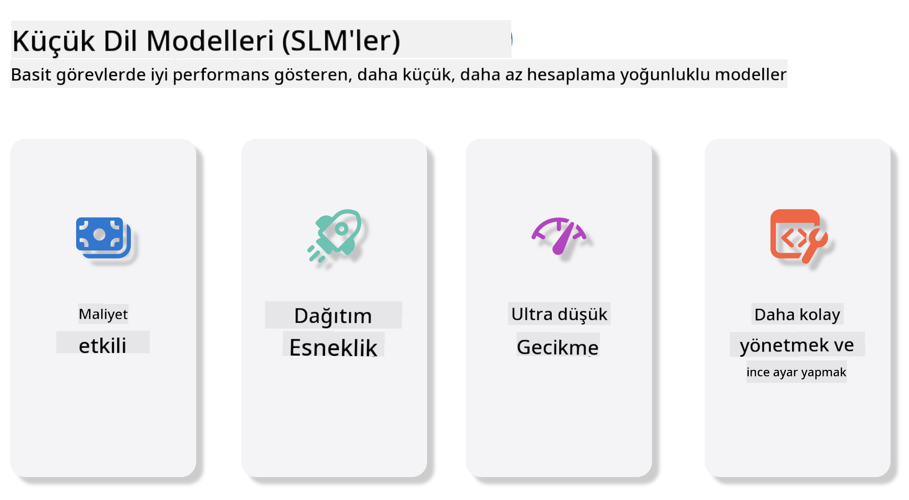
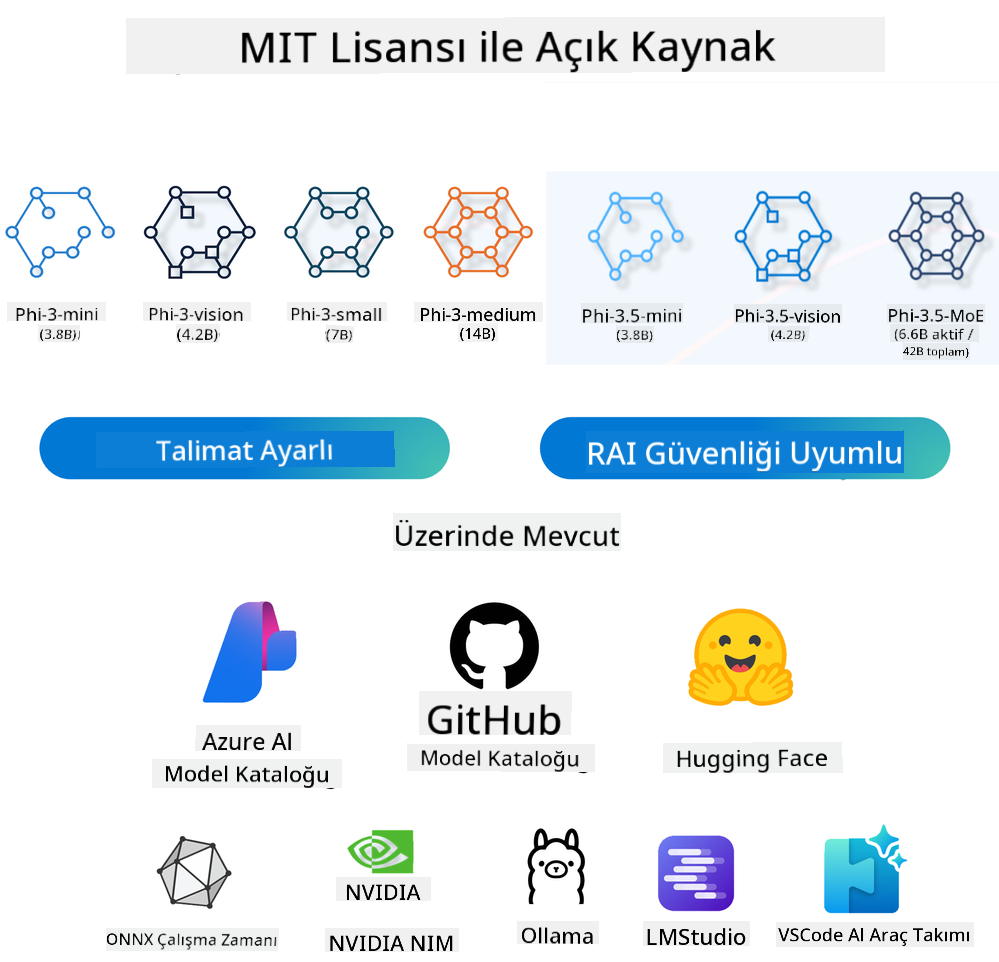
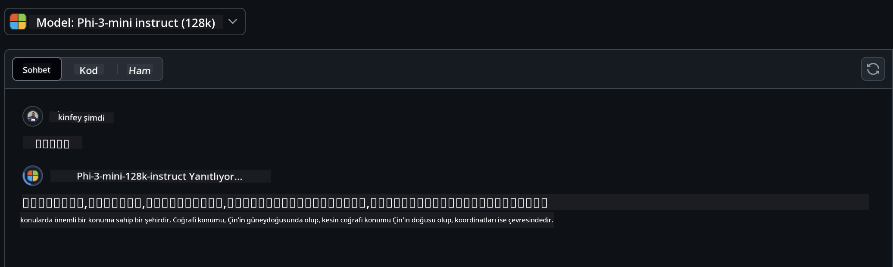
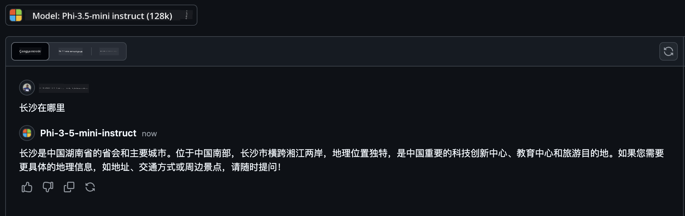

<!--
CO_OP_TRANSLATOR_METADATA:
{
  "original_hash": "124ad36cfe96f74038811b6e2bb93e9d",
  "translation_date": "2025-05-20T09:50:03+00:00",
  "source_file": "19-slm/README.md",
  "language_code": "tr"
}
-->
# Başlangıç Seviyesi için Üretici Yapay Zeka için Küçük Dil Modellerine Giriş Üretici yapay zeka, yeni içerik oluşturabilen sistemler yaratmaya odaklanan büyüleyici bir yapay zeka alanıdır. Bu içerik, metin ve görüntülerden müzik ve hatta tüm sanal ortamlara kadar çeşitlilik gösterebilir. Üretici yapay zekanın en heyecan verici uygulamalarından biri, dil modelleri alanındadır. ## Küçük Dil Modelleri Nedir? Küçük Dil Modeli (SLM), büyük bir dil modelinin (LLM) küçültülmüş bir varyantını temsil eder ve LLM'lerin birçok mimari ilkesini ve tekniğini kullanırken, önemli ölçüde azaltılmış bir hesaplama ayak izi sergiler. SLM'ler, insan benzeri metinler oluşturmak için tasarlanmış dil modellerinin bir alt kümesidir. GPT-4 gibi daha büyük emsallerinin aksine, SLM'ler daha kompakt ve verimlidir, bu da onları hesaplama kaynaklarının sınırlı olduğu uygulamalar için ideal hale getirir. Daha küçük boyutlarına rağmen, çeşitli görevleri yerine getirebilirler. Genellikle, SLM'ler, LLM'leri sıkıştırarak veya damıtarak oluşturulur ve orijinal modelin işlevselliğinin ve dil yeteneklerinin önemli bir kısmını korumayı amaçlar. Model boyutundaki bu azalma, genel karmaşıklığı azaltır, bu da SLM'leri hem bellek kullanımı hem de hesaplama gereksinimleri açısından daha verimli hale getirir. Bu optimizasyonlara rağmen, SLM'ler geniş bir doğal dil işleme (NLP) görevini yerine getirebilir: - Metin Oluşturma: Tutarlı ve bağlamsal olarak uygun cümleler veya paragraflar oluşturma. - Metin Tamamlama: Verilen bir uyarana dayalı olarak cümleleri tahmin etme ve tamamlama. - Çeviri: Metni bir dilden başka bir dile çevirme. - Özetleme: Uzun metin parçalarını daha kısa, daha sindirilebilir özetlere yoğunlaştırma. Ancak, daha büyük emsallerine kıyasla performans veya anlama derinliğinde bazı ödünleşmelerle. ## Küçük Dil Modelleri Nasıl Çalışır? SLM'ler, geniş miktarda metin verisi üzerinde eğitilir. Eğitim sırasında, dilin kalıplarını ve yapısını öğrenirler, bu da onların hem dilbilgisi açısından doğru hem de bağlamsal olarak uygun metinler oluşturmalarını sağlar. Eğitim süreci şunları içerir: - Veri Toplama: Çeşitli kaynaklardan büyük metin veri setleri toplama. - Ön İşleme: Verileri temizleme ve eğitime uygun hale getirme. - Eğitim: Makine öğrenme algoritmalarını kullanarak modelin metni anlama ve oluşturmayı öğrenmesi. - İnce Ayar: Modelin belirli görevlerdeki performansını artırmak için ayarlama. SLM'lerin geliştirilmesi, mobil cihazlar veya uç bilgi işlem platformları gibi kaynakların sınırlı olduğu ortamlarda dağıtılabilecek modellere olan artan ihtiyaçla uyumludur, burada tam ölçekli LLM'ler ağır kaynak talepleri nedeniyle pratik olmayabilir. Verimliliğe odaklanarak, SLM'ler performansı erişilebilirlikle dengeleyerek, çeşitli alanlarda daha geniş uygulama imkanı sağlar.  ## Öğrenme Hedefleri Bu derste, SLM bilgilerini tanıtmayı ve Microsoft Phi-3 ile metin içeriği, görsel ve MoE gibi farklı senaryoları öğrenmeyi umuyoruz. Bu dersin sonunda, şu soruları yanıtlayabilecek durumda olmalısınız: - SLM nedir - SLM ve LLM arasındaki fark nedir - Microsoft Phi-3/3.5 Ailesi nedir - Microsoft Phi-3/3.5 Ailesi nasıl çıkarılır Hazır mısınız? Başlayalım. ## Büyük Dil Modelleri (LLM'ler) ve Küçük Dil Modelleri (SLM'ler) Arasındaki Farklılıklar Hem LLM'ler hem de SLM'ler, olasılıksal makine öğrenmesinin temel ilkeleri üzerine inşa edilmiştir ve mimari tasarım, eğitim metodolojileri, veri üretim süreçleri ve model değerlendirme tekniklerinde benzer yaklaşımları takip ederler. Ancak, bu iki model türünü farklı kılan birkaç önemli faktör vardır. ## Küçük Dil Modellerinin Uygulamaları SLM'ler, geniş bir uygulama yelpazesine sahiptir, bunlar arasında: - Chatbotlar: Müşteri desteği sağlama ve kullanıcılarla sohbet şeklinde etkileşim kurma. - İçerik Oluşturma: Yazarların fikir oluşturmasına veya tüm makaleleri taslak halinde hazırlamasına yardımcı olma. - Eğitim: Öğrencilere yazma ödevlerinde veya yeni diller öğrenmede yardımcı olma. - Erişilebilirlik: Engelli bireyler için metinden konuşmaya sistemleri gibi araçlar oluşturma. **Boyut** LLM'ler ve SLM'ler arasındaki temel bir fark, modellerin ölçeğinde yatmaktadır. ChatGPT (GPT-4) gibi LLM'ler, tahmini 1.76 trilyon parametreden oluşabilirken, Mistral 7B gibi açık kaynaklı SLM'ler yaklaşık 7 milyar parametreyle tasarlanmıştır. Bu fark, öncelikle model mimarisi ve eğitim süreçlerindeki farklılıklardan kaynaklanmaktadır. Örneğin, ChatGPT, bir kodlayıcı-çözücü çerçevesi içinde bir kendine dikkat mekanizması kullanırken, Mistral 7B, yalnızca bir çözücü modelinde daha verimli eğitim sağlayan kaydırma pencere dikkatini kullanır. Bu mimari varyans, bu modellerin karmaşıklığı ve performansı üzerinde derin etkiler yaratır. **Anlayış** SLM'ler, genellikle belirli alanlarda performans için optimize edilmiştir, bu da onları son derece uzmanlaşmış hale getirir ancak birden fazla bilgi alanında geniş bağlamsal anlayış sağlama yeteneklerini potansiyel olarak sınırlı kılar. Buna karşılık, LLM'ler, daha kapsamlı bir düzeyde insan benzeri zekayı simüle etmeyi amaçlar. Geniş, çeşitli veri setleri üzerinde eğitilen LLM'ler, çeşitli alanlarda iyi performans göstermek için tasarlanmıştır ve daha fazla çok yönlülük ve uyarlanabilirlik sunar. Sonuç olarak, LLM'ler, doğal dil işleme ve programlama gibi daha geniş bir aşağı akış görevleri yelpazesi için daha uygundur. **Bilgi İşlem** LLM'lerin eğitimi ve dağıtımı, genellikle büyük ölçekli GPU kümeleri dahil olmak üzere önemli hesaplama altyapısı gerektiren kaynak yoğun süreçlerdir. Örneğin, ChatGPT gibi bir modeli sıfırdan eğitmek, binlerce GPU'yu uzun süreler boyunca gerektirebilir. Buna karşılık, daha küçük parametre sayılarıyla SLM'ler, hesaplama kaynakları açısından daha erişilebilirdir. Mistral 7B gibi modeller, orta düzey GPU yeteneklerine sahip yerel makinelerde eğitilebilir ve çalıştırılabilir, ancak eğitim hala birden fazla GPU üzerinde birkaç saat gerektirir. **Önyargı** Önyargı, öncelikle eğitim verilerinin doğası nedeniyle LLM'lerde bilinen bir sorundur. Bu modeller, genellikle belirli grupları yetersiz temsil eden veya yanlış temsil eden, yanlış etiketleme tanıtan veya lehçe, coğrafi varyasyonlar ve dilbilgisi kurallarından etkilenmiş dil önyargılarını yansıtan, internetten açıkça erişilebilir verilere dayanır. Ayrıca, LLM mimarilerinin karmaşıklığı, dikkatli ince ayar yapılmadan fark edilmeden kalabilecek önyargıyı istemeden artırabilir. Öte yandan, daha sınırlı, alan özel veri setleri üzerinde eğitilen SLM'ler, bu tür önyargılara karşı doğası gereği daha az duyarlıdır, ancak bunlara karşı bağışık değildir. **Çıkarım** SLM'lerin azaltılmış boyutu, çıkarım hızında önemli bir avantaj sağlar ve yerel donanımda geniş paralel işlemeye gerek kalmadan verimli bir şekilde çıktılar üretmelerine olanak tanır. Buna karşılık, LLM'ler, boyutları ve karmaşıklıkları nedeniyle, kabul edilebilir çıkarım süreleri elde etmek için genellikle önemli paralel hesaplama kaynakları gerektirir. Birden fazla eşzamanlı kullanıcının varlığı, özellikle ölçeklendirilmiş olarak dağıtıldığında, LLM'lerin yanıt sürelerini daha da yavaşlatır. Özetle, hem LLM'ler hem de SLM'ler makine öğrenmesinde temel bir temeli paylaşsalar da, model boyutu, kaynak gereksinimleri, bağlamsal anlayış, önyargıya duyarlılık ve çıkarım hızı açısından önemli ölçüde farklılık gösterirler. Bu farklılıklar, farklı kullanım durumları için uygunluklarını yansıtır, LLM'ler daha çok yönlü ancak kaynak ağırlıklı olurken, SLM'ler azaltılmış hesaplama talepleriyle daha alan özel verimlilik sunar. ***Not: Bu bölümde, Microsoft Phi-3 / 3.5'i bir örnek olarak kullanarak SLM'yi tanıtacağız.*** ## Phi-3 / Phi-3.5 Ailesini Tanıtma Phi-3 / 3.5 Ailesi, esas olarak metin, görsel ve Ajan (MoE) uygulama senaryolarını hedefler: ### Phi-3 / 3.5 İnstruct Esas olarak metin oluşturma, sohbet tamamlama ve içerik bilgisi çıkarma vb. için. **Phi-3-mini** 3.8B dil modeli, Microsoft Azure AI Studio, Hugging Face ve Ollama'da mevcuttur. Phi-3 modelleri, eşit ve daha büyük boyutlardaki dil modellerini önemli ölçüde aşar (aşağıdaki karşılaştırma numaralarına bakın, daha yüksek sayılar daha iyidir). Phi-3-mini, kendi boyutunun iki katı büyüklüğündeki modelleri aşarken, Phi-3-küçük ve Phi-3-orta, GPT-3.5 dahil olmak üzere daha büyük modelleri aşar. **Phi-3-küçük ve orta** Sadece 7B parametre ile Phi-3-küçük, çeşitli dil, akıl yürütme, kodlama ve matematik karşılaştırmalarında GPT-3.5T'yi geride bırakır. 14B parametreli Phi-3-orta, bu eğilimi sürdürür ve Gemini 1.0 Pro'yu aşar. **Phi-3.5-mini** Bunu Phi-3-mini'nin bir yükseltmesi olarak düşünebiliriz. Parametreler değişmeden kalırken, çoklu dil desteğini geliştirmiştir (20+ dil desteklenir: Arapça, Çince, Çekçe, Danca, Felemenkçe, İngilizce, Fince, Fransızca, Almanca, İbranice, Macarca, İtalyanca, Japonca, Korece, Norveççe, Lehçe, Portekizce, Rusça, İspanyolca, İsveççe, Tayca, Türkçe, Ukraynaca) ve uzun bağlam için daha güçlü destek ekler. 3.8B parametreli Phi-3.5-mini, aynı boyuttaki dil modellerini aşar ve iki katı büyüklüğündeki modellerle eşdeğerdir. ### Phi-3 / 3.5 Görsel Phi-3/3.5'in İnstruct modelini Phi'nin anlama yeteneği olarak düşünebiliriz ve Görsel, Phi'ye dünyayı anlama yeteneği kazandırır. **Phi-3-Görsel** Sadece 4.2B parametreli Phi-3-görsel, genel görsel akıl yürütme görevlerinde, OCR ve tablo ve diyagram anlama görevlerinde Claude-3 Haiku ve Gemini 1.0 Pro V gibi daha büyük modelleri aşar. **Phi-3.5-Görsel** Phi-3.5-Görsel, Phi-3-Görsel'in bir yükseltmesidir ve çoklu görüntü desteği ekler. Bunu bir görme iyileştirmesi olarak düşünebilirsiniz, sadece resimleri görmekle kalmaz, aynı zamanda videoları da görebilir. Phi-3.5-görsel, OCR, tablo ve grafik anlama görevlerinde Claude-3.5 Sonnet ve Gemini 1.5 Flash gibi daha büyük modelleri aşar ve genel görsel bilgi akıl yürütme görevlerinde eşdeğerdir. Çoklu çerçeve girişi destekler, yani birden fazla giriş görüntüsünde akıl yürütme yapar. ### Phi-3.5-MoE ***Uzmanlar Karışımı (MoE)*** modellerin çok daha az hesaplama ile önceden eğitilmesine olanak tanır, bu da yoğun bir modelle aynı hesaplama bütçesiyle modeli veya veri seti boyutunu önemli ölçüde artırabileceğiniz anlamına gelir. Özellikle, bir MoE modeli, yoğun karşılığıyla aynı kaliteyi önceden eğitme sırasında çok daha hızlı bir şekilde elde etmelidir. Phi-3.5-MoE, 16x3.8B uzman modüllerinden oluşur. Sadece 6.6B aktif parametre ile Phi-3.5-MoE, çok daha büyük modellerle benzer bir akıl yürütme, dil anlama ve matematik seviyesi elde eder. Phi-3/3.5 Ailesi modelini farklı senaryolara dayalı olarak kullanabiliriz. LLM'den farklı olarak, Phi-3/3.5-mini veya Phi-3/3.5-Görsel'i uç cihazlarda dağıtabilirsiniz. ## Phi-3/3.5 Ailesi modelleri nasıl kullanılır Farklı senaryolarda Phi-3/3.5 kullanmayı umuyoruz. Sonraki adımda, farklı senaryolara dayalı olarak Phi-3/3.5 kullanacağız.  ### Çıkarım farkı Bulut'un API'si **GitHub Modelleri** GitHub
Modeller en doğrudan yoldur. Phi-3/3.5-Instruct modeline GitHub Modelleri üzerinden hızlıca erişebilirsiniz. Azure AI Inference SDK / OpenAI SDK ile birleştirildiğinde, Phi-3/3.5-Instruct çağrısını tamamlamak için API'ye kod aracılığıyla erişebilirsiniz. Ayrıca Playground üzerinden farklı etkileri test edebilirsiniz. - Demo: Çin senaryolarında Phi-3-mini ve Phi-3.5-mini etkilerinin karşılaştırılması   **Azure AI Studio** Veya vizyon ve MoE modellerini kullanmak istiyorsak, çağrıyı tamamlamak için Azure AI Studio'yu kullanabilirsiniz. İlginizi çekiyorsa, Phi-3/3.5 Instruct, Vision, MoE'yi Azure AI Studio üzerinden nasıl çağıracağınızı öğrenmek için Phi-3 Cookbook'u okuyabilirsiniz [Bu bağlantıya tıklayın](https://github.com/microsoft/Phi-3CookBook/blob/main/md/02.QuickStart/AzureAIStudio_QuickStart.md?WT.mc_id=academic-105485-koreyst) **NVIDIA NIM** Azure ve GitHub tarafından sağlanan bulut tabanlı Model Catalog çözümlerine ek olarak, [Nivida NIM](https://developer.nvidia.com/nim?WT.mc_id=academic-105485-koreyst) kullanarak ilgili çağrıları tamamlayabilirsiniz. Phi-3/3.5 Ailesi'nin API çağrılarını tamamlamak için NIVIDA NIM'i ziyaret edebilirsiniz. NVIDIA NIM (NVIDIA Inference Microservices), geliştiricilerin AI modellerini bulutlar, veri merkezleri ve iş istasyonları gibi çeşitli ortamlarda verimli bir şekilde dağıtmalarına yardımcı olmak için tasarlanmış hızlandırılmış tahmin mikro hizmetleri setidir. NVIDIA NIM'in bazı önemli özellikleri şunlardır: - **Kolay Dağıtım:** NIM, AI modellerinin tek bir komutla dağıtılmasına izin verir, bu da mevcut iş akışlarına entegrasyonu basit hale getirir. - **Optimizasyon Performansı:** Düşük gecikme süresi ve yüksek verim sağlamak için NVIDIA'nın önceden optimize edilmiş tahmin motorları, TensorRT ve TensorRT-LLM gibi, kullanır. - **Ölçeklenebilirlik:** NIM, Kubernetes üzerinde otomatik ölçeklendirmeyi destekler, değişen iş yüklerini etkili bir şekilde yönetmesini sağlar. - **Güvenlik ve Kontrol:** Kuruluşlar, NIM mikro hizmetlerini kendi yönetilen altyapılarında barındırarak veri ve uygulamaları üzerinde kontrol sahibi olabilirler. - **Standart API'ler:** NIM, endüstri standartlarında API'ler sağlar, bu da sohbet botları, AI asistanları ve daha fazlası gibi AI uygulamaları oluşturmayı ve entegre etmeyi kolaylaştırır. NIM, NVIDIA AI Enterprise'ın bir parçasıdır ve AI modellerinin dağıtımını ve işletilmesini basitleştirmeyi amaçlar, bu modellerin NVIDIA GPU'larında verimli çalışmasını sağlar. - Demo: Nividia NIM kullanarak Phi-3.5-Vision-API çağrısı [[Bu bağlantıya tıklayın](../../../19-slm/python/Phi-3-Vision-Nividia-NIM.ipynb)] ### Yerel ortamda Phi-3/3.5 tahmini Phi-3 veya GPT-3 gibi herhangi bir dil modeli ile ilgili tahmin, aldığı girdiye dayalı olarak yanıtlar veya tahminler oluşturma sürecini ifade eder. Phi-3'e bir istem veya soru verdiğinizde, eğitildiği verilerdeki desenleri ve ilişkileri analiz ederek en olası ve ilgili yanıtı çıkarmak için eğitilmiş sinir ağını kullanır. **Hugging Face Transformer** Hugging Face Transformers, doğal dil işleme (NLP) ve diğer makine öğrenimi görevleri için tasarlanmış güçlü bir kütüphanedir. İşte bazı önemli noktalar: 1. **Önceden Eğitilmiş Modeller**: Metin sınıflandırma, adlandırılmış varlık tanıma, soru yanıtlama, özetleme, çeviri ve metin üretimi gibi çeşitli görevler için kullanılabilecek binlerce önceden eğitilmiş model sağlar. 2. **Çerçeve Uyumluluğu**: Kütüphane, PyTorch, TensorFlow ve JAX gibi birden fazla derin öğrenme çerçevesini destekler. Bu, bir çerçevede model eğitmenizi ve başka bir çerçevede kullanmanızı sağlar. 3. **Çok Modlu Yetkinlikler**: NLP dışında, Hugging Face Transformers, bilgisayar vizyonu (örneğin, görüntü sınıflandırma, nesne algılama) ve ses işleme (örneğin, konuşma tanıma, ses sınıflandırma) görevlerini de destekler. 4. **Kullanım Kolaylığı**: Kütüphane, modelleri kolayca indirip ince ayar yapmayı sağlayan API'ler ve araçlar sunar, hem yeni başlayanlar hem de uzmanlar için erişilebilir hale getirir. 5. **Topluluk ve Kaynaklar**: Hugging Face, kullanıcıların başlamasına ve kütüphaneden en iyi şekilde yararlanmasına yardımcı olacak canlı bir topluluk ve kapsamlı belgeler, öğreticiler ve kılavuzlara sahiptir. [resmi belgeler](https://huggingface.co/docs/transformers/index?WT.mc_id=academic-105485-koreyst) veya [GitHub deposu](https://github.com/huggingface/transformers?WT.mc_id=academic-105485-koreyst). Bu en yaygın kullanılan yöntemdir, ancak aynı zamanda GPU hızlandırması gerektirir. Sonuçta, Vision ve MoE gibi sahneler birçok hesaplama gerektirir, eğer kuantize edilmezlerse CPU'da çok sınırlı olacaktır. - Demo: Transformer kullanarak Phi-3.5-Instruct çağrısı [Bu bağlantıya tıklayın](../../../19-slm/python/phi35-instruct-demo.ipynb) - Demo: Transformer kullanarak Phi-3.5-Vision çağrısı [Bu bağlantıya tıklayın](../../../19-slm/python/phi35-vision-demo.ipynb) - Demo: Transformer kullanarak Phi-3.5-MoE çağrısı [Bu bağlantıya tıklayın](../../../19-slm/python/phi35_moe_demo.ipynb) **Ollama** [Ollama](https://ollama.com/?WT.mc_id=academic-105485-koreyst), büyük dil modellerini (LLM'ler) yerel olarak makinenizde çalıştırmayı kolaylaştırmak için tasarlanmış bir platformdur. Llama 3.1, Phi 3, Mistral ve Gemma 2 gibi çeşitli modelleri destekler. Platform, model ağırlıklarını, yapılandırmayı ve verileri tek bir pakette birleştirerek kullanıcıların kendi modellerini özelleştirmesini ve oluşturmasını daha erişilebilir hale getirir. Ollama, macOS, Linux ve Windows için kullanılabilir. Bulut hizmetlerine güvenmeden LLM'lerle denemeler yapmak veya dağıtım yapmak istiyorsanız harika bir araçtır. Ollama en doğrudan yoldur, sadece aşağıdaki ifadeyi yürütmeniz gerekir. ```bash

ollama run phi3.5

``` **ONNX Runtime for GenAI** [ONNX Runtime](https://github.com/microsoft/onnxruntime-genai?WT.mc_id=academic-105485-koreyst), platformlar arası tahmin ve eğitim makine öğrenimi hızlandırıcısıdır. ONNX Runtime for Generative AI (GENAI), çeşitli platformlarda üretken AI modellerini verimli bir şekilde çalıştırmanıza yardımcı olan güçlü bir araçtır. ## ONNX Runtime nedir? ONNX Runtime, makine öğrenimi modellerinin yüksek performanslı tahminini sağlayan açık kaynaklı bir projedir. Makine öğrenimi modellerini temsil etmek için bir standart olan Open Neural Network Exchange (ONNX) formatındaki modelleri destekler.ONNX Runtime tahmini, PyTorch ve TensorFlow/Keras gibi derin öğrenme çerçevelerinin yanı sıra scikit-learn, LightGBM, XGBoost gibi klasik makine öğrenimi kütüphanelerinden modelleri destekleyerek daha hızlı müşteri deneyimleri ve daha düşük maliyetler sağlayabilir. ONNX Runtime, farklı donanımlar, sürücüler ve işletim sistemleri ile uyumludur ve donanım hızlandırıcılarını uygun olduğu yerlerde kullanarak grafik optimizasyonları ve dönüşümlerle optimal performans sağlar. ## Üretken AI nedir? Üretken AI, üzerinde eğitildiği verilere dayalı olarak yeni içerik, metin, görüntü veya müzik gibi, üretebilen AI sistemlerini ifade eder. Örnekler arasında GPT-3 gibi dil modelleri ve Stable Diffusion gibi görüntü üretim modelleri bulunur. ONNX Runtime for GenAI kütüphanesi, ONNX modelleri için üretken AI döngüsünü sağlar, ONNX Runtime ile tahmin, logit işleme, arama ve örnekleme ve KV önbellek yönetimi dahil. ## GENAI için ONNX Runtime ONNX Runtime for GENAI, ONNX Runtime'ın yeteneklerini üretken AI modellerini desteklemek için genişletir. İşte bazı önemli özellikler: - **Geniş Platform Desteği:** Windows, Linux, macOS, Android ve iOS dahil olmak üzere çeşitli platformlarda çalışır. - **Model Desteği:** LLaMA, GPT-Neo, BLOOM ve daha fazlası gibi birçok popüler üretken AI modelini destekler. - **Performans Optimizasyonu:** NVIDIA GPU'lar, AMD GPU'lar ve daha fazlası gibi farklı donanım hızlandırıcıları için optimizasyonlar içerir. - **Kullanım Kolaylığı:** Metin, görüntü ve diğer içerikleri minimum kodla üretmenize olanak tanıyan API'ler sağlar, uygulamalara kolay entegrasyon sağlar - Kullanıcılar, yüksek seviyeli bir generate() yöntemi çağırabilir veya modelin her yinelemesini bir döngüde çalıştırarak, bir seferde bir token üreterek ve döngü içinde üretim parametrelerini isteğe bağlı olarak güncelleyebilir. - ONNX runtime ayrıca token dizilerini oluşturmak için açgözlü/beam arama ve TopP, TopK örnekleme ve tekrar cezaları gibi yerleşik logit işlemeyi destekler. Ayrıca kolayca özel puanlama ekleyebilirsiniz. ## Başlarken GENAI için ONNX Runtime ile başlamak için şu adımları takip edebilirsiniz: ### ONNX Runtime'ı Yükleyin: ```Python
pip install onnxruntime
``` ### Üretken AI Uzantılarını Yükleyin: ```Python
pip install onnxruntime-genai
``` ### Bir Model Çalıştırın: İşte Python'da basit bir örnek: ```Python
import onnxruntime_genai as og

model = og.Model('path_to_your_model.onnx')

tokenizer = og.Tokenizer(model)

input_text = "Hello, how are you?"

input_tokens = tokenizer.encode(input_text)

output_tokens = model.generate(input_tokens)

output_text = tokenizer.decode(output_tokens)

print(output_text) 
``` ### Demo: ONNX Runtime GenAI kullanarak Phi-3.5-Vision çağrısı ```python

import onnxruntime_genai as og

model_path = './Your Phi-3.5-vision-instruct ONNX Path'

img_path = './Your Image Path'

model = og.Model(model_path)

processor = model.create_multimodal_processor()

tokenizer_stream = processor.create_stream()

text = "Your Prompt"

prompt = "<|user|>\n"

prompt += "<|image_1|>\n"

prompt += f"{text}<|end|>\n"

prompt += "<|assistant|>\n"

image = og.Images.open(img_path)

inputs = processor(prompt, images=image)

params = og.GeneratorParams(model)

params.set_inputs(inputs)

params.set_search_options(max_length=3072)

generator = og.Generator(model, params)

while not generator.is_done():

    generator.compute_logits()
    
    generator.generate_next_token()

    new_token = generator.get_next_tokens()[0]
    
    code += tokenizer_stream.decode(new_token)
    
    print(tokenizer_stream.decode(new_token), end='', flush=True)

``` **Diğerleri** ONNX Runtime ve Ollama referans yöntemlerine ek olarak, farklı üreticiler tarafından sağlanan model referans yöntemlerine dayalı olarak nicel modellerin referansını tamamlayabiliriz. Apple Metal ile Apple MLX çerçevesi, Qualcomm QNN ile NPU, Intel OpenVINO ile CPU/GPU gibi. [Phi-3 Cookbook](https://github.com/microsoft/phi-3cookbook?WT.mc_id=academic-105485-koreyst) adresinden daha fazla içerik elde edebilirsiniz. ## Daha Fazlası Phi-3/3.5 Ailesinin temellerini öğrendik, ancak SLM hakkında daha fazla bilgi edinmek için daha fazla bilgiye ihtiyacımız var. Cevapları Phi-3 Cookbook'ta bulabilirsiniz. Daha fazla bilgi edinmek istiyorsanız, lütfen [Phi-3 Cookbook](https://github.com/microsoft/phi-3cookbook?WT.mc_id=academic-105485-koreyst) adresini ziyaret edin.

**Feragatname**: 
Bu belge, AI çeviri hizmeti [Co-op Translator](https://github.com/Azure/co-op-translator) kullanılarak çevrilmiştir. Doğruluğu sağlamak için çaba göstersek de, otomatik çevirilerin hata veya yanlışlıklar içerebileceğini lütfen unutmayın. Belgenin orijinal dili, yetkili kaynak olarak kabul edilmelidir. Kritik bilgiler için profesyonel insan çevirisi önerilir. Bu çevirinin kullanımından kaynaklanan yanlış anlamalar veya yanlış yorumlamalar için sorumlu değiliz.