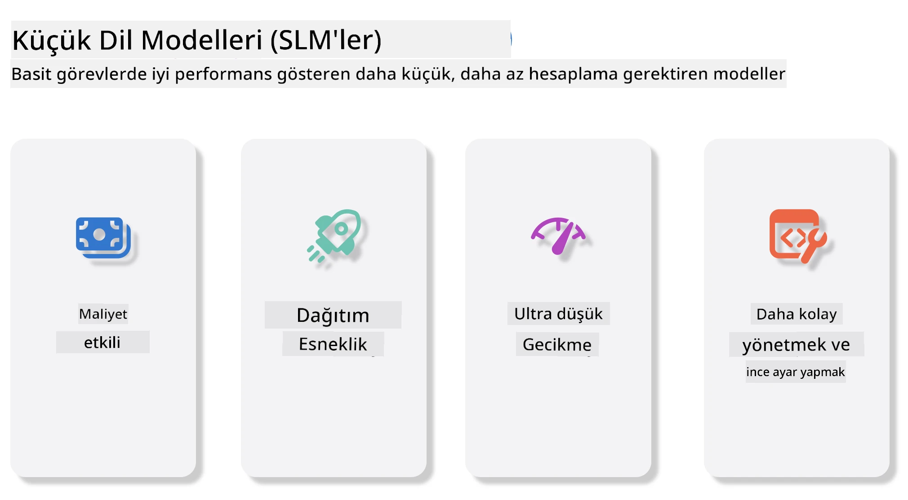
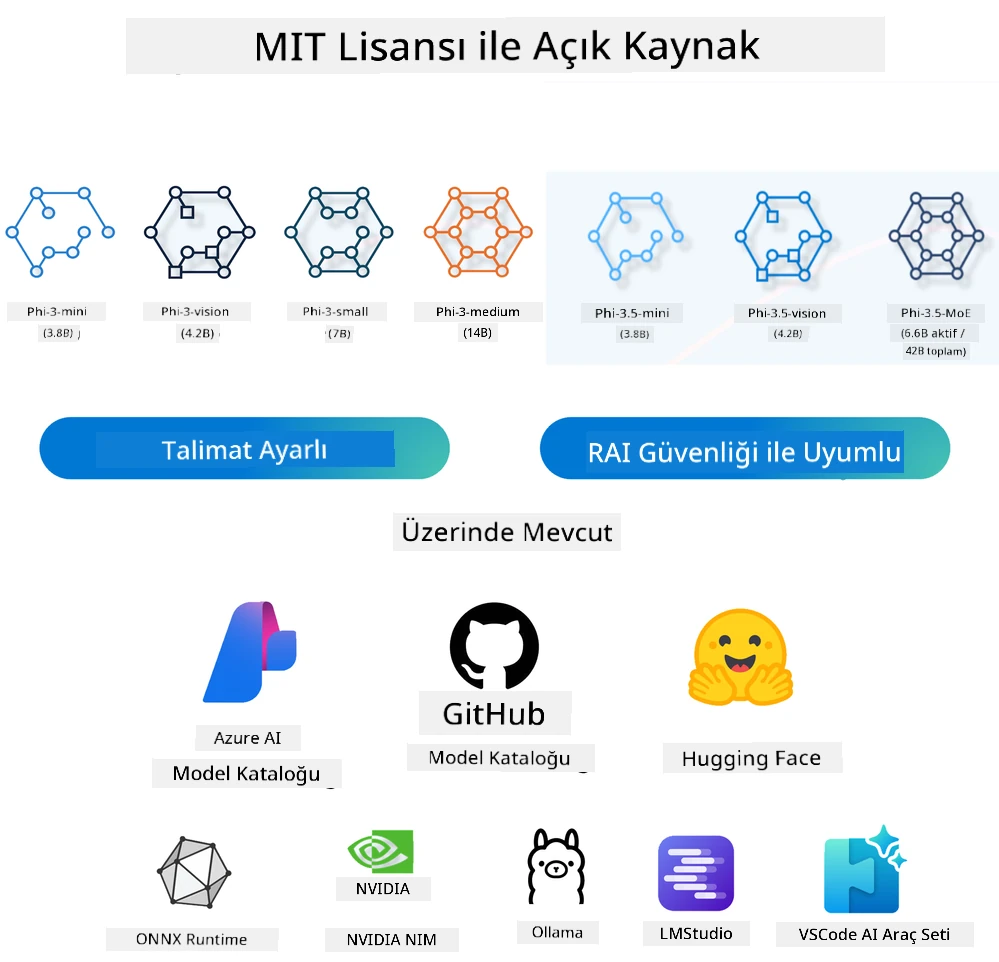
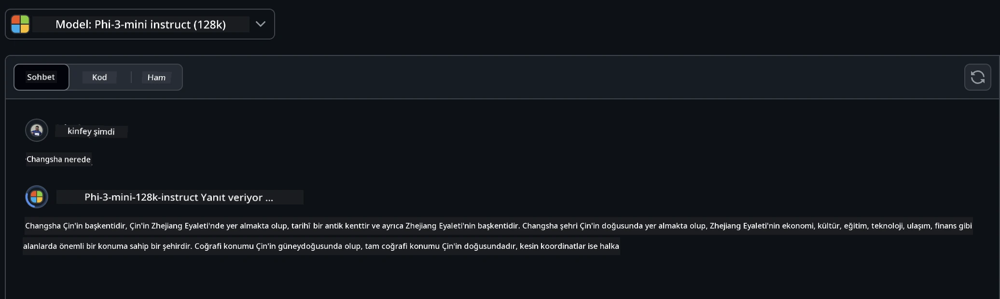
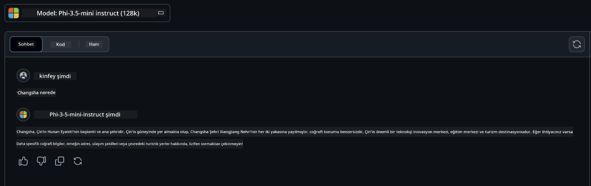

# Üretken AI için Küçük Dil Modellerine Giriş - Yeni Başlayanlar İçin  
Üretken AI, yeni içerik oluşturabilen sistemlerin geliştirilmesine odaklanan yapay zekanın büyüleyici bir alanıdır. Bu içerik metin ve görüntülerden müziğe ve hatta tamamen sanal ortamlara kadar çeşitlilik gösterebilir. Üretken AI'nin en heyecan verici uygulamalarından biri dil modelleri alanındadır.

## Küçük Dil Modelleri Nedir?

Küçük Dil Modeli (KDM), büyük bir dil modelinin (BDM) ölçeklenmiş bir versiyonunu temsil eder; BDM'lerin birçok mimari prensibini ve tekniğini kullanırken, önemli ölçüde azaltılmış bir hesaplama izi gösterir.

KDM'ler, insan benzeri metin oluşturmak için tasarlanmış dil modellerinin bir alt kümesidir. GPT-4 gibi büyük modellerin aksine, KDM'ler daha kompakt ve verimlidir; bu da sınırlı hesaplama kaynaklarının bulunduğu uygulamalar için ideal olmalarını sağlar. Daha küçük olmalarına rağmen, çeşitli görevleri gerçekleştirebilirler. Genellikle, KDM'ler BDM'lerin sıkıştırılması veya damıtılması yoluyla oluşturulur; temel amaç orijinal modelin işlevselliğinin ve dil yeteneklerinin önemli bir kısmını korumaktır. Model boyutundaki bu küçülme, genel karmaşıklığı azaltır; böylece KDM'ler hem bellek kullanımı hem de hesaplama gereksinimleri açısından daha verimli olur. Bu optimizasyonlara rağmen, KDM'ler hala geniş bir doğal dil işleme (NLP) görevlerini gerçekleştirebilir:

- Metin Üretimi: Anlamlı ve bağlam ile uyumlu cümleler veya paragraflar oluşturma.
- Metin Tamamlama: Verilen bir başlangıç metnine dayanarak cümleleri tahmin edip tamamlama.
- Çeviri: Bir dilden başka bir dile metin dönüştürme.
- Özetleme: Uzun metinleri daha kısa ve sindirilebilir özetlere dönüştürme.

Bunlar, daha büyük muadillerine kıyasla performans veya anlama derinliği açısından bazı ödünler vererek gerçekleştirilir.

## Küçük Dil Modelleri Nasıl Çalışır?  
KDM'ler çok büyük miktarda metin verisi üzerinde eğitilir. Eğitim sırasında dilin kalıplarını ve yapısını öğrenirler; bu sayede dilbilgisi açısından doğru ve bağlama uygun metinler üretebilirler. Eğitim süreci şu adımları içerir:

- Veri Toplama: Çeşitli kaynaklardan büyük metin veri setleri toplama.
- Ön İşleme: Verileri temizleyip düzenleyerek eğitime uygun hale getirme.
- Eğitim: Makine öğrenimi algoritmaları kullanarak modelin metni anlamasını ve üretmesini sağlama.
- İnce Ayar: Modeli belirli görevlerde performansını artırmak için ayarlama.

KDM geliştirilmesi, mobil cihazlar veya uç bilişim platformları gibi kaynak kısıtlı ortamlarda kullanılabilecek modeller ihtiyacıyla paralel ilerler; çünkü tam ölçekli BDM'ler ağır kaynak gereksinimleri nedeniyle bu tür ortamlarda pratik olmayabilir. Verimliliğe odaklanarak, KDM'ler performans ile erişilebilirliği dengeler ve farklı alanlarda daha geniş uygulama imkanı sağlar.



## Öğrenme Hedefleri  

Bu ders kapsamında, KDM bilgisini tanıtmayı ve bunu Microsoft Phi-3 ile birleştirerek metin içeriği, görsel ve MoE (Uzman Karışımı) gibi farklı senaryoları öğrenmeyi amaçlıyoruz.

Ders sonunda şu soruları cevaplayabilecek seviyeye gelmelisiniz:

- KDM nedir?
- KDM ile BDM arasındaki fark nedir?
- Microsoft Phi-3/3.5 Ailesi nedir?
- Microsoft Phi-3/3.5 Ailesi ile çıkarım (inference) nasıl yapılır?

Hazırsanız, başlayalım.

## Büyük Dil Modelleri (BDM) ile Küçük Dil Modelleri (KDM) Arasındaki Farklar  

BDM ve KDM her ikisi de olasılıksal makine öğreniminin temel prensipleri üzerine kuruludur; mimari tasarım, eğitim metodolojileri, veri üretim süreçleri ve model değerlendirme tekniklerinde benzer yaklaşımlar izlerler. Ancak, bu iki model türünü ayıran birkaç önemli faktör vardır.

## Küçük Dil Modellerinin Uygulamaları

KDM'lerin geniş bir uygulama yelpazesi bulunmaktadır, bunlar arasında:

- Sohbet Botları: Müşteri desteği sağlama ve kullanıcılarla sohbet etme.
- İçerik Oluşturma: Yazarlara fikir üretme veya tüm makaleler taslağı hazırlama konusunda yardımcı olma.
- Eğitim: Öğrencilere yazı görevlerinde veya yeni dil öğrenirken destek olma.
- Erişilebilirlik: Metni sese dönüştürme sistemleri gibi engelli kişiler için araçlar oluşturma.

**Boyut**  

BDM ve KDM arasındaki temel farklardan biri model ölçeğidir. ChatGPT (GPT-4) gibi BDM modeller yaklaşık 1.76 trilyon parametreye sahipken, açık kaynaklı KDM modelleri olan Mistral 7B gibi modeller yaklaşık 7 milyar parametre ile tasarlanmıştır. Bu farkın temel nedeni model mimarisi ve eğitim süreçlerindeki farklılıklardır. Örneğin, ChatGPT kodlayıcı-çözücü (encoder-decoder) çerçevesi içinde kendi kendine dikkat mekanizması (self-attention) kullanırken, Mistral 7B sadece çözücü (decoder-only) model içerisinde kayan pencere dikkati (sliding window attention) kullanmakta; bu da daha verimli eğitime olanak tanır. Bu mimari fark modellerin karmaşıklığı ve performansı üzerinde derin etkiler yaratır.

**Anlama**  

KDM'ler genellikle belirli alanlarda yüksek performans için optimize edilir; bu onları oldukça uzmanlaştırır ancak geniş bilgi alanlarında kapsamlı bağlamsal anlayış sağlamada sınırlı kılar. Oysa BDM'ler insan benzeri zekayı daha kapsamlı düzeyde simüle etmeyi amaçlarlar. Çok çeşitli ve büyük veri kümelerinde eğitilen BDM'ler, farklı alanlarda iyi performans gösterir; böylece daha geniş uyarlanabilirlik ve çok yönlülük sağlarlar. Bu nedenle, BDM'ler doğal dil işleme, programlama gibi daha geniş bir görev yelpazesi için uygundur.

**Hesaplama**  

BDM'lerin eğitimi ve devreye alınması (deployment) büyük kaynak gerektirir ve genellikle büyük GPU kümeleri gibi güçlü hesaplama altyapıları talep eder. Örneğin, ChatGPT gibi bir modelin sıfırdan eğitimi binlerce GPU'yu uzun süre kullanmayı gerektirebilir. Buna karşın KDM'ler, daha küçük parametre sayıları sayesinde hesaplama kaynakları açısından daha erişilebilirdir. Mistral 7B gibi modeller, orta düzey GPU donanımlı yerel makinelerde eğitilip çalıştırılabilir; ancak eğitim yine birkaç saat ve çoklu GPU kullanımı gerektirir.

**Önyargı**  

Önyargı, BDM'lerde eğitim verilerinin doğası gereği bilinen bir sorundur. Bu modeller genellikle internetten açıkça elde edilen ham verilerle eğitilmekte; bu veriler bazı grupları yetersiz veya yanlış temsil edebilir, hatalı etiketlendirme içerebilir veya lehçeler, coğrafi farklılıklar ve gramer kuralları kaynaklı dilsel önyargılar yansıtabilir. Ayrıca, BDM'lerin karmaşık mimarileri önyargıyı istemeden şiddetlendirebilir; bu durum ince ayar yapılmadan fark edilmeyebilir. Öte yandan, KDM'ler daha kısıtlı, alan spesifik veri kümeleri üzerinde eğitildiklerinden, bu tür önyargılara karşı doğrudan daha az hassastırlar; ancak tamamen bağışık değildirler.

**Çıkarım (Inference)**  

KDM’lerin küçültülmüş boyutu, çıkarım hızında büyük avantaj sağlar; böylece geniş paralel işlem gerekmeden yerel donanımda verimli çıktı üretebilirler. BDM'ler ise boyut ve karmaşıklık nedeniyle kabul edilebilir çıkarım süreleri için önemli paralel hesaplama kaynakları ister. Aynı anda birden fazla kullanıcının bulunması, BDM'lerin cevap sürelerini özellikle büyük ölçekli dağıtımlarda yavaşlatır.

Özetle, BDM ve KDM her ikisi de makine öğreniminin temel prensiplerine dayanmakla birlikte, model boyutu, kaynak gereksinimleri, bağlamsal anlama, önyargı hassasiyeti ve çıkarım hızı açısından önemli farklılıklar gösterir. Bu farklılıklar, kullanım alanları açısından BDM'leri daha çok yönlü fakat kaynak yoğun; KDM'leri ise daha alan odaklı ve hesaplama açısından daha hafif modeller olarak öne çıkarır.

***Not: Bu derste, örnek olarak Microsoft Phi-3 / 3.5 kullanarak KDM tanıtımı yapacağız.***

## Phi-3 / Phi-3.5 Ailesini Tanıtma  

Phi-3 / 3.5 Ailesi esas olarak metin, görsel ve Agent (MoE) uygulama senaryolarını hedefler:

### Phi-3 / 3.5 Instruct  

Özellikle metin üretimi, sohbet tamamlama ve içerik bilgi çıkarımı gibi alanlarda kullanılır.

**Phi-3-mini**  

3.8 milyar parametreli dil modeli Microsoft Azure AI Studio, Hugging Face ve Ollama’da mevcuttur. Phi-3 modelleri, eşit ve daha büyük boyutlu dil modellerine kıyasla önemli ölçüde daha iyi anahtar gösterge performansı sergiler (aşağıdaki benchmark numaralarına bakınız, rakamlar ne kadar yüksekse o kadar iyidir). Phi-3-mini, kendi boyutunun iki katında olan modelleri geride bırakırken, Phi-3-small ve Phi-3-medium, GPT-3.5 de dahil olmak üzere daha büyük modelleri geçer.

**Phi-3-small & medium**  

Yalnızca 7 milyar parametreye sahip Phi-3-small, çeşitli dil, muhakeme, kodlama ve matematik benchmarklarında GPT-3.5T'yi geçer.

14 milyar parametreli Phi-3-medium, bu trendi devam ettirir ve Gemini 1.0 Pro'yu geçer.

**Phi-3.5-mini**  

Bunu Phi-3-mini'nin bir gelişimi olarak düşünebiliriz. Parametre sayısı değişmese de, çoklu dili destekleme kapasitesini geliştirir (20’den fazla dil desteği: Arapça, Çince, Çekçe, Danca, Flemenkçe, İngilizce, Fince, Fransızca, Almanca, İbranice, Macarca, İtalyanca, Japonca, Korece, Norveççe, Lehçe, Portekizce, Rusça, İspanyolca, İsveççe, Tayca, Türkçe, Ukraynaca) ve uzun bağlama daha güçlü destek ekler.

3.8 milyar parametreli Phi-3.5-mini, aynı boyuttaki dil modellerini geride bırakır ve kendi boyutunun iki katı büyüklüğündeki modellerle eşdeğerdir.

### Phi-3 / 3.5 Vision  

Phi-3/3.5'in Instruct modeli Phi'nin anlama gücü olarak düşünülebilir; Vision ise Phi'ye dünyayı anlaması için gözler verir.

**Phi-3-Vision**  

Sadece 4.2 milyar parametreye sahip Phi-3-vision, bu eğilimi sürdürerek Claude-3 Haiku ve Gemini 1.0 Pro V gibi daha büyük modelleri genel görsel muhakeme, OCR, tablo ve diyagram anlama görevlerinde geçer.

**Phi-3.5-Vision**  

Phi-3.5-Vision, Phi-3-Vision'ın geliştirilmiş versiyonudur; çoklu görüntü desteği ekler. Yani sadece resimleri değil, videoları da görebilir.  
Phi-3.5-vision, OCR, tablo ve grafik anlama görevlerinde Claude-3.5 Sonnet ve Gemini 1.5 Flash gibi daha büyük modelleri geçerken, genel görsel bilgi muhakemesi görevlerinde onlarla eşit performans gösterir. Çoklu kare girişi destekler yani birden fazla girdi resmi üzerinde muhakeme yapabilir.

### Phi-3.5-MoE  

***Uzman Karışımı (Mixture of Experts - MoE)***, modellerin çok daha az hesaplama gücüyle önceden eğitilmesini sağlar; bu, aynı hesaplama bütçesiyle modeli veya veri setini dramatik şekilde büyütme anlamına gelir. Özellikle, bir MoE modeli, ön eğitim sırasında yoğun model muadilinden çok daha hızlı aynı kaliteyi yakalamalıdır.

Phi-3.5-MoE, 16x 3.8 milyar parametreli uzman modülünden oluşur. Yalnızca 6.6 milyar aktif parametreye sahip Phi-3.5-MoE, çok daha büyük modellerle benzer düzeyde muhakeme, dil anlama ve matematik performansı gösterir.

Phi-3/3.5 Ailesi modellerini farklı senaryolara göre kullanabiliriz. LLM’den farklı olarak, Phi-3/3.5-mini veya Phi-3/3.5-Vision uç cihazlarda da dağıtılabilir.

## Phi-3/3.5 Ailesi Modelleri Nasıl Kullanılır?  

Phi-3/3.5'i farklı senaryolarda kullanmayı amaçlıyoruz. Sonraki aşamada, Phi-3/3.5'i farklı senaryolara göre kullanacağız.



### Bulut API'leri Üzerinden Çıkarım

**GitHub Modelleri**

GitHub Modelleri en doğrudan yöntemdir. Phi-3/3.5-Instruct modeline hızlıca GitHub Modelleri üzerinden erişebilirsiniz. Azure AI Inference SDK / OpenAI SDK ile kombine ederek kod üzerinden API çağrıları yapıp Phi-3/3.5-Instruct çağrısını tamamlayabilirsiniz. Ayrıca Playground üzerinden farklı etkileri test edebilirsiniz.

- Demo: Çince senaryolarda Phi-3-mini ve Phi-3.5-mini etkilerinin karşılaştırması






**Azure AI Studio**

Veya eğer görsel ve MoE modellerini kullanmak istiyorsanız, Azure AI Studio üzerinden çağrı yapabilirsiniz. İlgileniyorsanız, Phi-3 Cookbook kılavuzunu okuyarak Azure AI Studio üzerinden Phi-3/3.5 Instruct, Vision, MoE çağrılarının nasıl yapıldığını öğrenebilirsiniz. [Bu linke tıklayın](https://github.com/microsoft/Phi-3CookBook/blob/main/md/02.QuickStart/AzureAIStudio_QuickStart.md?WT.mc_id=academic-105485-koreyst)


**NVIDIA NIM**

Azure ve GitHub’un bulut tabanlı Model Kataloğu çözümlerine ek olarak, ilgili çağrıları tamamlamak için [NVIDIA NIM](https://developer.nvidia.com/nim?WT.mc_id=academic-105485-koreyst) kullanabilirsiniz. Phi-3/3.5 Ailesinin API çağrılarını NVIDIA NIM üzerinden gerçekleştirebilirsiniz. NVIDIA NIM (NVIDIA Inference Microservices), geliştiricilerin AI modellerini bulutlar, veri merkezleri ve iş istasyonları dahil çeşitli ortamlarda etkin şekilde dağıtmasına yardımcı olmak üzere hızlandırılmış çıkarım mikroservislerinden oluşan bir settir.

İşte NVIDIA NIM'in bazı önemli özellikleri:
- **Kolay Dağıtım:** NIM, yapay zeka modellerinin tek komutla dağıtılmasına olanak tanır, bu da mevcut iş akışlarına entegrasyonunu basit hale getirir.  
- **Optimize Edilmiş Performans:** Düşük gecikme ve yüksek verimlilik sağlamak için TensorRT ve TensorRT-LLM gibi NVIDIA’nın önceden optimize edilmiş çıkarım motorlarını kullanır.  
- **Ölçeklenebilirlik:** NIM, Kubernetes üzerinde otomatik ölçeklendirmeyi destekleyerek değişken iş yüklerini etkili bir şekilde yönetebilir.  
- **Güvenlik ve Kontrol:** Kuruluşlar, NIM mikroservislerini kendi yönetilen altyapılarında barındırarak verileri ve uygulamaları üzerinde kontrol sahibi olabilirler.  
- **Standart API’ler:** NIM, sohbet botları, yapay zeka asistanları ve daha fazlası gibi yapay zeka uygulamalarını geliştirmek ve entegre etmek için endüstri standartlarında API’ler sunar.

NIM, NVIDIA AI Enterprise’in bir parçasıdır ve yapay zeka modellerinin dağıtımını ve işletimini kolaylaştırmayı, NVIDIA GPU’larda verimli çalışmasını sağlamayı hedefler.

- Demo: NVIDIA NIM kullanarak Phi-3.5-Vision-API’yi çağırma [[Bu bağlantıya tıklayın](./python/Phi-3-Vision-Nividia-NIM.ipynb?WT.mc_id=academic-105485-koreyst)]

### Phi-3/3.5 Yerel Çalıştırma
Phi-3 veya GPT-3 gibi herhangi bir dil modeli bağlamında çıkarım, aldığı girdiye dayanarak yanıtlar veya tahminler oluşturma işlemidir. Phi-3’e bir istek veya soru verdiğinizde, eğitim verilerindeki desenleri ve ilişkileri analiz ederek en olası ve ilgili yanıtı çıkarmak için eğitilmiş sinir ağını kullanır.

**Hugging Face Transformer**  
Hugging Face Transformers, doğal dil işleme (NLP) ve diğer makine öğrenimi görevleri için tasarlanmış güçlü bir kütüphanedir. İşte bazı önemli noktalar:

1. **Önceden Eğitilmiş Modeller:** Metin sınıflandırması, isimlendirilmiş varlık tanıma, soru-cevap, özetleme, çeviri ve metin üretimi gibi çeşitli görevler için kullanılabilecek binlerce önceden eğitilmiş modeli sunar.

2. **Framework Uyumluluğu:** Kütüphane, PyTorch, TensorFlow ve JAX gibi birçok derin öğrenme framework’ünü destekler. Böylece bir modeli bir framework’te eğitip diğerinde kullanabilirsiniz.

3. **Multimodal Yetenekler:** NLP dışında, Hugging Face Transformers aynı zamanda bilgisayarla görme (örneğin, görüntü sınıflandırması, nesne tespiti) ve ses işleme (örneğin, konuşma tanıma, ses sınıflandırması) görevlerini de destekler.

4. **Kullanım Kolaylığı:** Kütüphane, modelleri kolayca indirip ince ayar yapmayı sağlayan API’ler ve araçlar sunarak hem yeni başlayanlar hem de uzmanlar için erişilebilir kılar.

5. **Topluluk ve Kaynaklar:** Hugging Face canlı bir topluluğa ve kullanıcılara başlamaları ve kütüphaneyi en etkin şekilde kullanmaları için kapsamlı dokümantasyon, eğitimler ve rehberler sunar.  
[resmi dokümantasyon](https://huggingface.co/docs/transformers/index?WT.mc_id=academic-105485-koreyst) veya [GitHub deposu](https://github.com/huggingface/transformers?WT.mc_id=academic-105485-koreyst).

Bu en yaygın kullanılan yöntemdir ancak GPU hızlandırması gerektirir. Sonuçta, Vision ve MoE gibi senaryolar çok sayıda hesaplama gerektirir ve kuantize edilmezse CPU üzerindeyken çok yavaş olur.

- Demo: Transformer kullanarak Phi-3.5-Instruct çağırma [Bu bağlantıya tıklayın](./python/phi35-instruct-demo.ipynb?WT.mc_id=academic-105485-koreyst)

- Demo: Transformer kullanarak Phi-3.5-Vision çağırma [Bu bağlantıya tıklayın](./python/phi35-vision-demo.ipynb?WT.mc_id=academic-105485-koreyst)

- Demo: Transformer kullanarak Phi-3.5-MoE çağırma [Bu bağlantıya tıklayın](./python/phi35_moe_demo.ipynb?WT.mc_id=academic-105485-koreyst)

**Ollama**  
[Ollama](https://ollama.com/?WT.mc_id=academic-105485-koreyst), büyük dil modellerini (LLM) yerel makinenizde çalıştırmayı kolaylaştırmak için tasarlanmış bir platformdur. Llama 3.1, Phi 3, Mistral ve Gemma 2 gibi çeşitli modelleri destekler. Platform, model ağırlıklarını, yapılandırmalarını ve verileri tek bir paket halinde sunarak kullanıcıların kendi modellerini özelleştirmesini ve oluşturmasını kolaylaştırır. Ollama macOS, Linux ve Windows için mevcuttur. Bulut servislerine bağımlı kalmadan LLM’ler ile denemeler yapmak veya dağıtmak isteyenler için mükemmel bir araçtır. Ollama en doğrudan yoldur; sadece aşağıdaki komutu çalıştırmanız gerekir.

```bash

ollama run phi3.5

```


**GenAI için ONNX Runtime**  

[ONNX Runtime](https://github.com/microsoft/onnxruntime-genai?WT.mc_id=academic-105485-koreyst), çapraz platform çıkarım ve eğitim makineli öğrenimi hızlandırıcısıdır. Generative AI (GENAI) için ONNX Runtime, çeşitli platformlarda üretken yapay zeka modellerini verimli şekilde çalıştırmanıza yardımcı olan güçlü bir araçtır.

## ONNX Runtime Nedir?  
ONNX Runtime, yüksek performanslı makine öğrenimi modelleri çıkarımını mümkün kılan açık kaynak bir projedir. Makine öğrenimi modellerinin standart temsili olan Open Neural Network Exchange (ONNX) formatındaki modelleri destekler. ONNX Runtime çıkarımı, PyTorch ve TensorFlow/Keras gibi derin öğrenme framework’leri ile scikit-learn, LightGBM, XGBoost gibi klasik makine öğrenimi kütüphaneleri modellerini destekleyerek daha hızlı müşteri deneyimleri ve daha düşük maliyetler sağlar. ONNX Runtime, farklı donanımlar, sürücüler ve işletim sistemleri ile uyumludur ve uygun donanım hızlandırıcılarını kullanarak, grafik optimizasyonları ve dönüşümlerle optimal performans sunar.

## Generative AI Nedir?  
Generative AI, eğitim verileri temelinde yeni içerik (metin, resim, müzik vb.) oluşturabilen yapay zeka sistemlerini ifade eder. Örnekler arasında GPT-3 gibi dil modelleri ve Stable Diffusion gibi görüntü oluşturma modelleri bulunur. ONNX Runtime for GenAI kütüphanesi, ONNX modelleri için üretken yapay zeka döngüsünü sağlar; ONNX Runtime ile çıkarım, olasılık işleme, arama ve örnekleme, KV önbellek yönetimi gibi işlemleri kapsar.

## ONNX Runtime for GENAI  
ONNX Runtime for GENAI, ONNX Runtime’ın üretken yapay zeka modellerini destekleyecek şekilde genişletilmiş halidir. Bazı önemli özellikleri:

- **Geniş Platform Desteği:** Windows, Linux, macOS, Android ve iOS dahil çeşitli platformlarda çalışır.  
- **Model Desteği:** LLaMA, GPT-Neo, BLOOM gibi birçok popüler generatif AI modelini destekler.  
- **Performans Optimizasyonu:** NVIDIA GPU’lar, AMD GPU’lar ve diğer donanım hızlandırıcıları için optimizasyonlar içerir.  
- **Kullanım Kolaylığı:** Uygulamalara kolay entegrasyon sağlayan API’ler sunar; az kod ile metin, resim ve diğer içerikleri oluşturabilirsiniz.  
- Kullanıcılar yüksek seviyeli generate() metodunu çağırabilir veya modeli döngü içinde çalıştırıp her seferinde bir token üretebilir, döngü içinde üretim parametrelerini güncelleyebilir.  
- ONNX runtime ayrıca tükenici/ışın araması ve TopP, TopK örneklemesini destekler. Tek token dizileri oluşturmak için dahili olasılık işleme (tekrar cezaları gibi) içerir. Özel puanlama da kolayca eklenebilir.

## Başlarken  
ONNX Runtime for GENAI ile başlamak için şu adımları takip edebilirsiniz:

### ONNX Runtime Kurulumu:  
```Python
pip install onnxruntime
```
  
### Generative AI Eklentilerini Kurun:  
```Python
pip install onnxruntime-genai
```
  
### Bir Model Çalıştırma: İşte Python’da basit bir örnek:  
```Python
import onnxruntime_genai as og

model = og.Model('path_to_your_model.onnx')

tokenizer = og.Tokenizer(model)

input_text = "Hello, how are you?"

input_tokens = tokenizer.encode(input_text)

output_tokens = model.generate(input_tokens)

output_text = tokenizer.decode(output_tokens)

print(output_text) 
```
  
### Demo: ONNX Runtime GenAI kullanarak Phi-3.5-Vision çağırma  
```python

import onnxruntime_genai as og

model_path = './Your Phi-3.5-vision-instruct ONNX Path'

img_path = './Your Image Path'

model = og.Model(model_path)

processor = model.create_multimodal_processor()

tokenizer_stream = processor.create_stream()

text = "Your Prompt"

prompt = "<|user|>\n"

prompt += "<|image_1|>\n"

prompt += f"{text}<|end|>\n"

prompt += "<|assistant|>\n"

image = og.Images.open(img_path)

inputs = processor(prompt, images=image)

params = og.GeneratorParams(model)

params.set_inputs(inputs)

params.set_search_options(max_length=3072)

generator = og.Generator(model, params)

while not generator.is_done():

    generator.compute_logits()
    
    generator.generate_next_token()

    new_token = generator.get_next_tokens()[0]
    
    output = tokenizer_stream.decode(new_token)
    
    print(tokenizer_stream.decode(new_token), end='', flush=True)

```


**Diğerleri**

ONNX Runtime ve Ollama referans yöntemlerine ek olarak, farklı üreticilerin sağladığı model referans yöntemlerine dayanan kuantitatif modellerin referanslarını da tamamlayabiliriz. Örneğin; Apple Metal ile Apple MLX framework, Qualcomm QNN ile NPU, Intel OpenVINO ile CPU/GPU gibi. Daha fazla içeriği [Phi-3 Cookbook](https://github.com/microsoft/phi-3cookbook?WT.mc_id=academic-105485-koreyst) üzerinden edinebilirsiniz.

## Daha Fazlası

Phi-3/3.5 Ailesinin temellerini öğrendik, ancak SLM hakkında daha fazla bilgi edinmek için daha fazla bilgiye ihtiyacımız var. Yanıtları Phi-3 Cookbook’ta bulabilirsiniz. Daha fazla bilgi edinmek isterseniz, lütfen [Phi-3 Cookbook](https://github.com/microsoft/phi-3cookbook?WT.mc_id=academic-105485-koreyst) sayfasını ziyaret edin.

---

<!-- CO-OP TRANSLATOR DISCLAIMER START -->
**Feragatname**:  
Bu belge, AI çeviri servisi [Co-op Translator](https://github.com/Azure/co-op-translator) kullanılarak çevrilmiştir. Doğruluk için çaba sarf etsek de, otomatik çevirilerin hatalar veya doğruluk sorunları içerebileceğini lütfen unutmayınız. Orijinal belge, kendi dilinde yetkili kaynak olarak kabul edilmelidir. Kritik bilgiler için profesyonel insan çevirisi önerilir. Bu çevirinin kullanımı sonucu oluşabilecek yanlış anlamalar veya yorum farklılıklarından dolayı sorumluluk kabul edilmemektedir.
<!-- CO-OP TRANSLATOR DISCLAIMER END -->