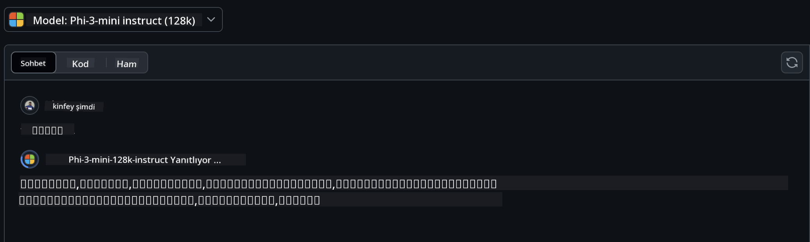
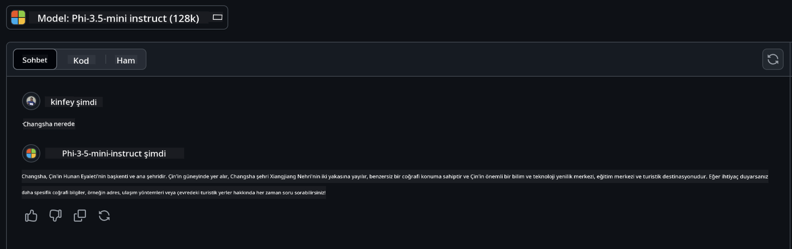

<!--
CO_OP_TRANSLATOR_METADATA:
{
  "original_hash": "124ad36cfe96f74038811b6e2bb93e9d",
  "translation_date": "2025-06-26T02:14:11+00:00",
  "source_file": "19-slm/README.md",
  "language_code": "tr"
}
-->

Modeller en doğrudan yoldur. GitHub Modeller aracılığıyla Phi-3/3.5-Instruct modeline hızlıca erişebilirsiniz. Azure AI Inference SDK / OpenAI SDK ile birleştirildiğinde, Phi-3/3.5-Instruct çağrısını tamamlamak için API'ye kod aracılığıyla erişebilirsiniz. Ayrıca Playground aracılığıyla farklı etkileri test edebilirsiniz. - Demo: Çin senaryolarında Phi-3-mini ve Phi-3.5-mini etkilerinin karşılaştırılması   **Azure AI Studio** Vizyon ve MoE modellerini kullanmak istiyorsak, Azure AI Studio'yu kullanarak çağrıyı tamamlayabilirsiniz. İlginizi çekiyorsa, Azure AI Studio üzerinden Phi-3/3.5 Instruct, Vision, MoE çağırmayı öğrenmek için Phi-3 Cookbook'u okuyabilirsiniz [Bu bağlantıya tıklayın](https://github.com/microsoft/Phi-3CookBook/blob/main/md/02.QuickStart/AzureAIStudio_QuickStart.md?WT.mc_id=academic-105485-koreyst) **NVIDIA NIM** Azure ve GitHub tarafından sağlanan bulut tabanlı Model Kataloğu çözümlerinin yanı sıra, ilgili çağrıları tamamlamak için [Nivida NIM](https://developer.nvidia.com/nim?WT.mc_id=academic-105485-koreyst) kullanabilirsiniz. Phi-3/3.5 Family API çağrılarını tamamlamak için NIVIDA NIM'i ziyaret edebilirsiniz. NVIDIA NIM (NVIDIA Inference Microservices), geliştiricilerin AI modellerini bulutlar, veri merkezleri ve iş istasyonları gibi çeşitli ortamlarda verimli bir şekilde dağıtmalarına yardımcı olmak için tasarlanmış bir dizi hızlandırılmış çıkarım mikro hizmetidir. NVIDIA NIM'in bazı ana özellikleri şunlardır: - **Kolay Dağıtım:** NIM, AI modellerinin tek bir komutla dağıtılmasına olanak tanır, bu da mevcut iş akışlarına entegrasyonu kolaylaştırır. - **Optimize Performans:** Düşük gecikme süresi ve yüksek verim sağlamak için TensorRT ve TensorRT-LLM gibi NVIDIA'nın önceden optimize edilmiş çıkarım motorlarını kullanır. - **Ölçeklenebilirlik:** NIM, Kubernetes üzerinde otomatik ölçeklendirmeyi destekler, bu da değişen iş yüklerini etkili bir şekilde yönetmesini sağlar. - **Güvenlik ve Kontrol:** Kuruluşlar, kendi yönetilen altyapılarında NIM mikro hizmetlerini barındırarak veri ve uygulamalar üzerinde kontrol sağlayabilirler. - **Standart API'ler:** NIM, chatbotlar, AI asistanları ve daha fazlası gibi AI uygulamaları oluşturmayı ve entegre etmeyi kolaylaştıran endüstri standardı API'ler sağlar. NIM, AI modellerinin dağıtımını ve operasyonunu basitleştirmeyi amaçlayan NVIDIA AI Enterprise'ın bir parçasıdır, böylece NVIDIA GPU'larında verimli bir şekilde çalışırlar. - Demo: Phi-3.5-Vision-API çağrısını yapmak için Nividia NIM kullanma [[Bu bağlantıya tıklayın](../../../19-slm/python/Phi-3-Vision-Nividia-NIM.ipynb)] ### Yerel ortamda Phi-3/3.5 çıkarımı Phi-3 veya GPT-3 gibi herhangi bir dil modeli ile ilgili çıkarım, aldığı girdiye dayalı olarak yanıtlar veya tahminler oluşturma sürecini ifade eder. Phi-3'e bir komut veya soru verdiğinizde, eğitim aldığı verilerdeki desenleri ve ilişkileri analiz ederek en olası ve ilgili yanıtı çıkarmak için eğitilmiş sinir ağını kullanır. **Hugging Face Transformer** Hugging Face Transformers, doğal dil işleme (NLP) ve diğer makine öğrenme görevleri için tasarlanmış güçlü bir kütüphanedir. İşte bununla ilgili bazı önemli noktalar: 1. **Önceden Eğitilmiş Modeller**: Metin sınıflandırma, adlandırılmış varlık tanıma, soru yanıtlama, özetleme, çeviri ve metin üretimi gibi çeşitli görevler için kullanılabilecek binlerce önceden eğitilmiş model sağlar. 2. **Çerçeve Uyumluluğu**: Kütüphane, PyTorch, TensorFlow ve JAX gibi birden fazla derin öğrenme çerçevesini destekler. Bu, bir çerçevede bir model eğitmenize ve başka bir çerçevede kullanmanıza olanak tanır. 3. **Multimodal Yetenekler**: NLP'nin yanı sıra, Hugging Face Transformers bilgisayarla görme (örneğin, görüntü sınıflandırma, nesne algılama) ve ses işleme (örneğin, konuşma tanıma, ses sınıflandırma) görevlerini de destekler. 4. **Kullanım Kolaylığı**: Kütüphane, modelleri kolayca indirip ince ayar yapmak için API'ler ve araçlar sunar, bu da hem yeni başlayanlar hem de uzmanlar için erişilebilir olmasını sağlar. 5. **Topluluk ve Kaynaklar**: Hugging Face'in canlı bir topluluğu ve kullanıcıların başlamasına ve kütüphaneden en iyi şekilde yararlanmasına yardımcı olacak kapsamlı belgeleri, eğitimleri ve kılavuzları vardır. [resmi belgeler](https://huggingface.co/docs/transformers/index?WT.mc_id=academic-105485-koreyst) veya [GitHub deposu](https://github.com/huggingface/transformers?WT.mc_id=academic-105485-koreyst). Bu en yaygın kullanılan yöntemdir, ancak GPU hızlandırması gerektirir. Sonuçta, Vision ve MoE gibi sahneler çok fazla hesaplama gerektirir ve kuantize edilmezse CPU'da çok sınırlı olacaktır. - Demo: Phi-3.5-Instuct çağrısını yapmak için Transformer kullanma [Bu bağlantıya tıklayın](../../../19-slm/python/phi35-instruct-demo.ipynb) - Demo: Phi-3.5-Vision çağrısını yapmak için Transformer kullanma [Bu bağlantıya tıklayın](../../../19-slm/python/phi35-vision-demo.ipynb) - Demo: Phi-3.5-MoE çağrısını yapmak için Transformer kullanma [Bu bağlantıya tıklayın](../../../19-slm/python/phi35_moe_demo.ipynb) **Ollama** [Ollama](https://ollama.com/?WT.mc_id=academic-105485-koreyst), büyük dil modellerini (LLM'ler) yerel olarak bilgisayarınızda çalıştırmayı kolaylaştırmak için tasarlanmış bir platformdur. Llama 3.1, Phi 3, Mistral ve Gemma 2 gibi çeşitli modelleri destekler. Platform, model ağırlıklarını, yapılandırmasını ve verileri tek bir pakette birleştirerek kullanıcıların kendi modellerini özelleştirmelerini ve oluşturmalarını daha erişilebilir hale getirir. Ollama, macOS, Linux ve Windows için mevcuttur. Bulut hizmetlerine güvenmeden LLM'lerle deney yapmak veya dağıtmak istiyorsanız harika bir araçtır. Ollama en doğrudan yol, sadece aşağıdaki ifadeyi yürütmeniz gerekiyor. ```bash

ollama run phi3.5

``` **GenAI için ONNX Runtime** [ONNX Runtime](https://github.com/microsoft/onnxruntime-genai?WT.mc_id=academic-105485-koreyst), platformlar arası çıkarım ve eğitim makine öğrenimi hızlandırıcısıdır. Generative AI (GENAI) için ONNX Runtime, çeşitli platformlarda generative AI modellerini verimli bir şekilde çalıştırmanıza yardımcı olan güçlü bir araçtır. ## ONNX Runtime nedir? ONNX Runtime, makine öğrenimi modellerinin yüksek performanslı çıkarımını sağlayan açık kaynaklı bir projedir. Makine öğrenimi modellerini temsil etmek için bir standart olan Open Neural Network Exchange (ONNX) formatındaki modelleri destekler.ONNX Runtime çıkarımı, PyTorch ve TensorFlow/Keras gibi derin öğrenme çerçevelerinden ve scikit-learn, LightGBM, XGBoost gibi klasik makine öğrenimi kütüphanelerinden modelleri destekleyerek daha hızlı müşteri deneyimleri ve daha düşük maliyetler sağlayabilir. ONNX Runtime, farklı donanımlar, sürücüler ve işletim sistemleri ile uyumludur ve uygun olduğunda donanım hızlandırıcılarını kullanarak grafik optimizasyonları ve dönüşümleri ile optimal performans sağlar ## Generative AI nedir? Generative AI, eğitim aldığı verilerle metin, görüntü veya müzik gibi yeni içerikler üretebilen AI sistemlerini ifade eder. Örnekler arasında GPT-3 gibi dil modelleri ve Stable Diffusion gibi görüntü oluşturma modelleri bulunur. ONNX Runtime for GenAI kütüphanesi, ONNX modelleri için generative AI döngüsünü sağlar, ONNX Runtime ile çıkarım, logits işleme, arama ve örnekleme ve KV önbellek yönetimi dahil. ## GENAI için ONNX Runtime GENAI için ONNX Runtime, ONNX Runtime'ın yeteneklerini generative AI modellerini desteklemek için genişletir. İşte bazı ana özellikler: - **Geniş Platform Desteği:** Windows, Linux, macOS, Android ve iOS gibi çeşitli platformlarda çalışır. - **Model Desteği:** LLaMA, GPT-Neo, BLOOM ve daha fazlası gibi birçok popüler generative AI modelini destekler. - **Performans Optimizasyonu:** NVIDIA GPU'lar, AMD GPU'lar ve daha fazlası gibi farklı donanım hızlandırıcıları için optimizasyonlar içerir. - **Kullanım Kolaylığı:** Metin, görüntü ve diğer içerikleri minimum kodla üretmenizi sağlayan uygulamalara kolay entegrasyon için API'ler sağlar - Kullanıcılar yüksek seviyede generate() metodunu çağırabilir veya modelin her iterasyonunu bir döngüde çalıştırabilir, bir seferde bir token üreterek döngü içinde üretim parametrelerini isteğe bağlı olarak güncelleyebilirler. - ONNX runtime ayrıca token dizileri üretmek için açgözlü/ışın arama ve TopP, TopK örnekleme desteğine ve tekrar cezası gibi yerleşik logits işlemeye sahiptir. Ayrıca kolayca özel puanlama ekleyebilirsiniz. ## Başlangıç GENAI için ONNX Runtime ile başlamak için şu adımları takip edebilirsiniz: ### ONNX Runtime'ı Yükleyin: ```Python
pip install onnxruntime
``` ### Generative AI Uzantılarını Yükleyin: ```Python
pip install onnxruntime-genai
``` ### Bir Model Çalıştırın: İşte Python'da basit bir örnek: ```Python
import onnxruntime_genai as og

model = og.Model('path_to_your_model.onnx')

tokenizer = og.Tokenizer(model)

input_text = "Hello, how are you?"

input_tokens = tokenizer.encode(input_text)

output_tokens = model.generate(input_tokens)

output_text = tokenizer.decode(output_tokens)

print(output_text) 
``` ### Demo: ONNX Runtime GenAI kullanarak Phi-3.5-Vision çağrısını yapma ```python

import onnxruntime_genai as og

model_path = './Your Phi-3.5-vision-instruct ONNX Path'

img_path = './Your Image Path'

model = og.Model(model_path)

processor = model.create_multimodal_processor()

tokenizer_stream = processor.create_stream()

text = "Your Prompt"

prompt = "<|user|>\n"

prompt += "<|image_1|>\n"

prompt += f"{text}<|end|>\n"

prompt += "<|assistant|>\n"

image = og.Images.open(img_path)

inputs = processor(prompt, images=image)

params = og.GeneratorParams(model)

params.set_inputs(inputs)

params.set_search_options(max_length=3072)

generator = og.Generator(model, params)

while not generator.is_done():

    generator.compute_logits()
    
    generator.generate_next_token()

    new_token = generator.get_next_tokens()[0]
    
    code += tokenizer_stream.decode(new_token)
    
    print(tokenizer_stream.decode(new_token), end='', flush=True)

``` **Diğerleri** ONNX Runtime ve Ollama referans yöntemlerinin yanı sıra, farklı üreticiler tarafından sağlanan model referans yöntemlerine dayalı kuantize modellerin referansını da tamamlayabiliriz. Apple Metal ile Apple MLX çerçevesi, NPU ile Qualcomm QNN, CPU/GPU ile Intel OpenVINO gibi. [Phi-3 Cookbook](https://github.com/microsoft/phi-3cookbook?WT.mc_id=academic-105485-koreyst) adresinden daha fazla içerik de alabilirsiniz ## Daha Fazlası Phi-3/3.5 Family'nin temellerini öğrendik, ancak SLM hakkında daha fazla bilgi edinmek için daha fazla bilgiye ihtiyacımız var. Phi-3 Cookbook'ta cevapları bulabilirsiniz. Daha fazla bilgi edinmek istiyorsanız, lütfen [Phi-3 Cookbook](https://github.com/microsoft/phi-3cookbook?WT.mc_id=academic-105485-koreyst) adresini ziyaret edin.

**Feragatname**: 
Bu belge, AI çeviri hizmeti [Co-op Translator](https://github.com/Azure/co-op-translator) kullanılarak çevrilmiştir. Doğruluk için çaba göstersek de, otomatik çevirilerin hata veya yanlışlık içerebileceğini lütfen unutmayın. Belgenin orijinal dilindeki hali, yetkili kaynak olarak kabul edilmelidir. Kritik bilgiler için, profesyonel insan çevirisi önerilir. Bu çevirinin kullanımından doğabilecek yanlış anlamalar veya yanlış yorumlamalardan dolayı sorumluluk kabul etmiyoruz.