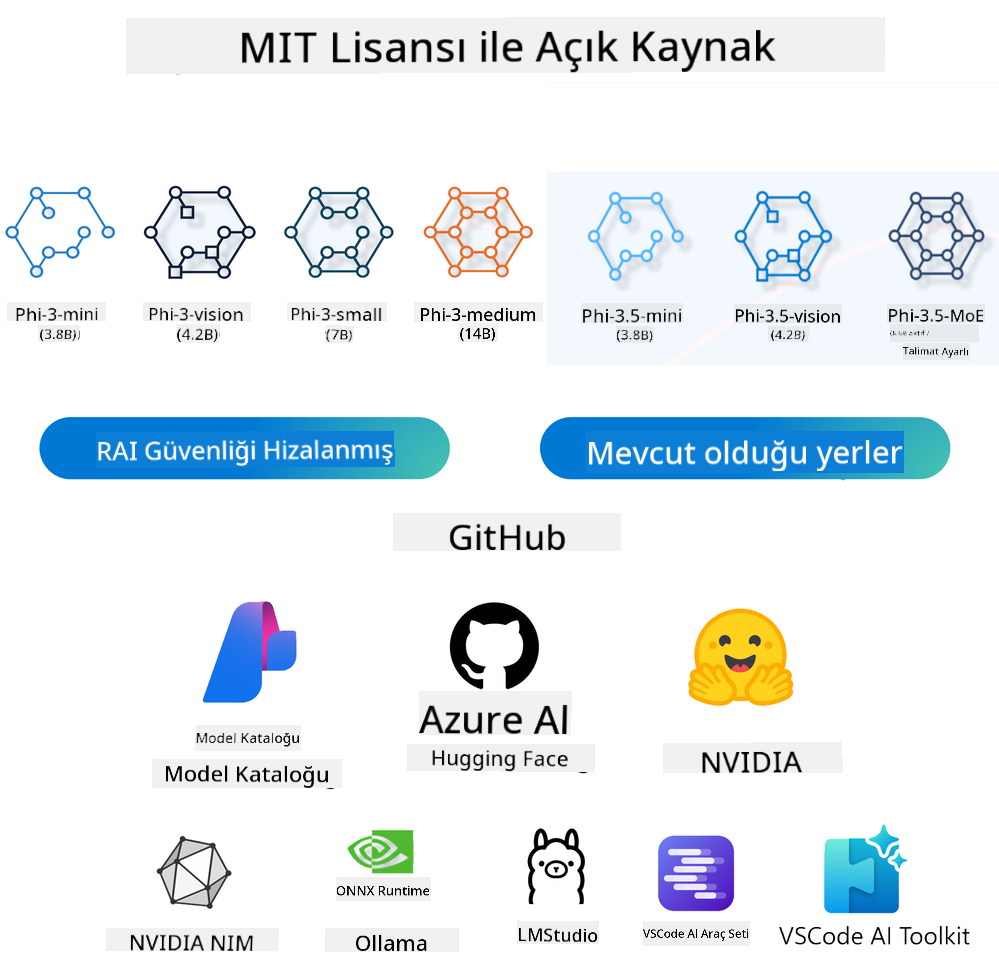

<!--
CO_OP_TRANSLATOR_METADATA:
{
  "original_hash": "124ad36cfe96f74038811b6e2bb93e9d",
  "translation_date": "2025-07-09T18:33:05+00:00",
  "source_file": "19-slm/README.md",
  "language_code": "tr"
}
-->
# Başlangıç Seviyesi için Üretken Yapay Zeka İçin Küçük Dil Modellerine Giriş  
Üretken Yapay Zeka, yeni içerik oluşturabilen sistemler geliştirmeye odaklanan büyüleyici bir yapay zeka alanıdır. Bu içerikler metin ve görsellerden müziğe ve hatta tamamen sanal ortamlara kadar çeşitlilik gösterebilir. Üretken yapay zekanın en heyecan verici uygulamalarından biri dil modelleri alanındadır.

## Küçük Dil Modelleri Nedir?  

Küçük Dil Modeli (SLM), büyük dil modellerinin (LLM) mimari prensiplerini ve tekniklerini kullanan, ancak hesaplama açısından çok daha az kaynak gerektiren ölçeklendirilmiş bir versiyonudur.  

SLM’ler, insan benzeri metin üretmek üzere tasarlanmış dil modellerinin bir alt kümesidir. GPT-4 gibi daha büyük modellerin aksine, SLM’ler daha kompakt ve verimlidir, bu da onları sınırlı hesaplama kaynaklarının olduğu uygulamalar için ideal kılar. Küçük olmalarına rağmen çeşitli görevleri yerine getirebilirler. Genellikle SLM’ler, LLM’lerin sıkıştırılması veya damıtılması yoluyla oluşturulur; amaç, orijinal modelin işlevselliğinin ve dil yeteneklerinin büyük bir kısmını korumaktır. Model boyutundaki bu küçülme, genel karmaşıklığı azaltır ve SLM’leri hem bellek kullanımı hem de hesaplama gereksinimleri açısından daha verimli hale getirir. Bu optimizasyonlara rağmen, SLM’ler hâlâ çeşitli doğal dil işleme (NLP) görevlerini gerçekleştirebilir:  

- Metin Üretimi: Tutarlı ve bağlama uygun cümleler veya paragraflar oluşturma.  
- Metin Tamamlama: Verilen bir başlangıca dayanarak cümleleri tahmin etme ve tamamlama.  
- Çeviri: Metni bir dilden başka bir dile dönüştürme.  
- Özetleme: Uzun metinleri daha kısa ve anlaşılır özetlere dönüştürme.  

Bunlar, daha büyük modellere kıyasla performans veya anlama derinliği açısından bazı ödünler verilerek yapılır.  

## Küçük Dil Modelleri Nasıl Çalışır?  
SLM’ler, çok büyük miktarda metin verisi üzerinde eğitilir. Eğitim sırasında dilin kalıplarını ve yapısını öğrenirler, böylece hem dilbilgisi açısından doğru hem de bağlama uygun metinler üretebilirler. Eğitim süreci şunları içerir:  

- Veri Toplama: Çeşitli kaynaklardan büyük metin veri setleri toplanır.  
- Ön İşleme: Veriler temizlenir ve eğitime uygun hale getirilir.  
- Eğitim: Makine öğrenimi algoritmaları kullanılarak modelin metni anlama ve üretme yeteneği geliştirilir.  
- İnce Ayar: Modelin belirli görevlerdeki performansını artırmak için ayarlamalar yapılır.  

SLM’lerin geliştirilmesi, tam ölçekli LLM’lerin ağır kaynak gereksinimleri nedeniyle pratik olmadığı mobil cihazlar veya uç bilişim platformları gibi kaynak kısıtlı ortamlarda kullanılabilecek modeller ihtiyacına paraleldir. Verimliliğe odaklanarak, SLM’ler performans ile erişilebilirlik arasında bir denge kurar ve çeşitli alanlarda daha geniş uygulama imkanı sağlar.  

  

## Öğrenme Hedefleri  

Bu derste, SLM bilgisi tanıtılacak ve Microsoft Phi-3 ile birleştirilerek metin içeriği, görsel ve MoE alanlarında farklı senaryolar öğrenilecektir.  

Dersin sonunda aşağıdaki soruları yanıtlayabilecek duruma gelmelisiniz:  

- SLM nedir?  
- SLM ile LLM arasındaki farklar nelerdir?  
- Microsoft Phi-3/3.5 Ailesi nedir?  
- Microsoft Phi-3/3.5 Ailesi nasıl çıkarım yapılır?  

Hazır mısınız? Başlayalım.  

## Büyük Dil Modelleri (LLM) ile Küçük Dil Modelleri (SLM) Arasındaki Farklar  

Hem LLM’ler hem de SLM’ler, olasılıksal makine öğrenimi temel prensiplerine dayanır ve mimari tasarım, eğitim yöntemleri, veri üretim süreçleri ve model değerlendirme teknikleri açısından benzer yaklaşımlar izler. Ancak, bu iki model türünü ayıran birkaç önemli faktör vardır.  

## Küçük Dil Modellerinin Uygulamaları  

SLM’ler geniş bir uygulama yelpazesine sahiptir, örneğin:  

- Sohbet Botları: Müşteri desteği sağlama ve kullanıcılarla sohbet etme.  
- İçerik Oluşturma: Yazarların fikir üretmesine veya makale taslakları hazırlamasına yardımcı olma.  
- Eğitim: Öğrencilere yazı ödevlerinde veya yeni diller öğrenmede destek olma.  
- Erişilebilirlik: Metni sese dönüştürme gibi engelli bireyler için araçlar geliştirme.  

**Boyut**  

LLM’ler ile SLM’ler arasındaki temel farklardan biri model ölçeğidir. ChatGPT (GPT-4) gibi LLM’ler yaklaşık 1.76 trilyon parametreye sahip olabilirken, açık kaynaklı SLM’ler, örneğin Mistral 7B, yaklaşık 7 milyar parametre ile çok daha küçük boyutlardadır. Bu fark, model mimarisi ve eğitim süreçlerindeki farklılıklardan kaynaklanır. Örneğin, ChatGPT, kodlayıcı-çözücü (encoder-decoder) yapısında kendi kendine dikkat (self-attention) mekanizması kullanırken, Mistral 7B yalnızca çözücü (decoder) modelinde kayan pencere dikkat (sliding window attention) mekanizması kullanır; bu da daha verimli eğitim sağlar. Bu mimari farklılıklar, modellerin karmaşıklığı ve performansı üzerinde önemli etkiler yaratır.  

**Anlama Yeteneği**  

SLM’ler genellikle belirli alanlarda yüksek performans gösterecek şekilde optimize edilir, bu da onları oldukça uzmanlaştırılmış ancak çok çeşitli bilgi alanlarında geniş bağlamsal anlayış sunma konusunda sınırlı kılar. Buna karşılık, LLM’ler insan benzeri zekayı daha kapsamlı bir düzeyde simüle etmeyi amaçlar. Çok çeşitli ve büyük veri setleri üzerinde eğitilen LLM’ler, farklı alanlarda iyi performans gösterir ve daha fazla esneklik ve uyarlanabilirlik sunar. Bu nedenle, LLM’ler doğal dil işleme ve programlama gibi daha geniş kapsamlı görevler için daha uygundur.  

**Hesaplama Gereksinimleri**  

LLM’lerin eğitimi ve kullanımı yüksek kaynak gerektirir; genellikle büyük GPU kümeleri gibi kapsamlı hesaplama altyapısı gerekir. Örneğin, ChatGPT gibi bir modeli sıfırdan eğitmek, binlerce GPU’nun uzun süre çalışmasını gerektirebilir. Buna karşılık, SLM’ler daha az parametreye sahip oldukları için hesaplama kaynakları açısından daha erişilebilirdir. Mistral 7B gibi modeller, orta düzey GPU donanımı olan yerel makinelerde eğitilebilir ve çalıştırılabilir, ancak eğitim yine de birkaç GPU üzerinde saatler sürebilir.  

**Önyargı**  

Önyargı, LLM’lerde bilinen bir sorundur ve büyük ölçüde eğitim verilerinin doğasından kaynaklanır. Bu modeller genellikle internetten toplanan ham ve açık verilere dayanır; bu veriler bazı grupları yeterince temsil etmeyebilir, yanlış etiketlenmiş olabilir veya lehçe, coğrafi farklılıklar ve dilbilgisi kuralları gibi dilsel önyargılar içerebilir. Ayrıca, LLM’lerin karmaşık mimarileri önyargıyı fark edilmeden artırabilir ve bu durum dikkatli ince ayar yapılmadığında sorun yaratabilir. Öte yandan, SLM’ler daha sınırlı ve alan odaklı veri setleriyle eğitildiği için bu tür önyargılara karşı daha az hassastır, ancak tamamen bağışık değildir.  

**Çıkarım (Inference)**  

SLM’lerin küçük boyutu, çıkarım hızında önemli bir avantaj sağlar; yerel donanımda geniş paralel işlem gerektirmeden hızlı çıktı üretebilirler. Buna karşılık, LLM’ler boyutları ve karmaşıklıkları nedeniyle kabul edilebilir çıkarım süreleri için genellikle büyük paralel hesaplama kaynaklarına ihtiyaç duyar. Çok sayıda eşzamanlı kullanıcı olduğunda, LLM’lerin yanıt süreleri özellikle ölçeklendirme durumlarında yavaşlayabilir.  

Özetle, LLM’ler ve SLM’ler makine öğrenimi temellerini paylaşsa da, model boyutu, kaynak gereksinimleri, bağlamsal anlama, önyargıya yatkınlık ve çıkarım hızı açısından önemli farklılıklar gösterirler. Bu farklar, LLM’lerin daha çok yönlü ancak kaynak yoğun, SLM’lerin ise daha alan odaklı ve hesaplama açısından daha verimli olduğunu ortaya koyar.  

***Not: Bu bölümde SLM, Microsoft Phi-3 / 3.5 örneği üzerinden tanıtılacaktır.***  

## Phi-3 / Phi-3.5 Ailesine Giriş  

Phi-3 / 3.5 Ailesi, ağırlıklı olarak metin, görsel ve Agent (MoE) uygulama senaryolarına yöneliktir:  

### Phi-3 / 3.5 Instruct  

Başlıca metin üretimi, sohbet tamamlama ve içerik bilgi çıkarımı gibi görevler için kullanılır.  

**Phi-3-mini**  

3.8 milyar parametreli dil modeli Microsoft Azure AI Studio, Hugging Face ve Ollama’da mevcuttur. Phi-3 modelleri, eşit veya daha büyük boyuttaki dil modellerine kıyasla önemli ölçüde daha iyi performans gösterir (aşağıdaki kıyaslama rakamlarına bakınız, yüksek rakamlar daha iyidir). Phi-3-mini, kendi boyutunun iki katı büyüklüğündeki modelleri geride bırakırken, Phi-3-small ve Phi-3-medium, GPT-3.5 dahil daha büyük modelleri geride bırakır.  

**Phi-3-small & medium**  

Sadece 7 milyar parametreye sahip Phi-3-small, çeşitli dil, mantık, kodlama ve matematik kıyaslamalarında GPT-3.5T’yi geçer.  

14 milyar parametreli Phi-3-medium bu trendi sürdürür ve Gemini 1.0 Pro’dan daha iyi performans gösterir.  

**Phi-3.5-mini**  

Phi-3-mini’nin bir yükseltmesi olarak düşünülebilir. Parametre sayısı değişmemekle birlikte, çoklu dil desteği geliştirilmiştir (20+ dil desteklenir: Arapça, Çince, Çekçe, Danca, Hollandaca, İngilizce, Fince, Fransızca, Almanca, İbranice, Macarca, İtalyanca, Japonca, Korece, Norveççe, Lehçe, Portekizce, Rusça, İspanyolca, İsveççe, Tayca, Türkçe, Ukraynaca) ve uzun bağlam desteği güçlendirilmiştir.  

3.8 milyar parametreli Phi-3.5-mini, aynı boyuttaki dil modellerini geride bırakır ve iki katı büyüklüğündeki modellerle eşdeğerdir.  

### Phi-3 / 3.5 Vision  

Phi-3/3.5 Instruct modeli Phi’nin anlama yeteneği olarak düşünülebilir, Vision ise Phi’ye dünyayı görme yeteneği kazandırır.  

**Phi-3-Vision**  

Sadece 4.2 milyar parametreye sahip Phi-3-vision, genel görsel mantık, OCR ve tablo ile diyagram anlama görevlerinde Claude-3 Haiku ve Gemini 1.0 Pro gibi daha büyük modelleri geride bırakır.  

**Phi-3.5-Vision**  

Phi-3-Vision’un bir yükseltmesidir ve çoklu görüntü desteği ekler. Yani sadece resimleri değil, videoları da görebilir.  

Phi-3.5-vision, OCR, tablo ve grafik anlama görevlerinde Claude-3.5 Sonnet ve Gemini 1.5 Flash gibi daha büyük modelleri geride bırakır ve genel görsel bilgi mantığı görevlerinde eşdeğerdir. Çoklu kare girişi destekler, yani birden fazla görüntü üzerinde çıkarım yapabilir.  

### Phi-3.5-MoE  

***Mixture of Experts (MoE)***, modellerin çok daha az hesaplama ile önceden eğitilmesini sağlar; bu da aynı hesaplama bütçesiyle model veya veri seti boyutunun dramatik şekilde artırılabileceği anlamına gelir. Özellikle, bir MoE modeli, yoğun (dense) muadiliyle aynı kaliteyi ön eğitim sırasında çok daha hızlı yakalayabilir.  

Phi-3.5-MoE, 16 adet 3.8 milyar parametreli uzman modülünden oluşur. Sadece 6.6 milyar aktif parametreye sahip Phi-3.5-MoE, çok daha büyük modellerle benzer seviyede mantık yürütme, dil anlama ve matematik yeteneklerine sahiptir.  

Phi-3/3.5 Ailesi modellerini farklı senaryolara göre kullanabiliriz. LLM’lerin aksine, Phi-3/3.5-mini veya Phi-3/3.5-Vision modellerini uç cihazlarda dağıtabilirsiniz.  

## Phi-3/3.5 Ailesi Modelleri Nasıl Kullanılır  

Phi-3/3.5’i farklı senaryolarda kullanmayı hedefliyoruz. Şimdi, farklı senaryolara göre Phi-3/3.5 kullanacağız.  

  

### Bulut API’si ile Çıkarım Farkı  

**GitHub Modelleri**  

GitHub Modelleri en doğrudan yoldur. Phi-3/3.5-Instruct modeline GitHub Modelleri üzerinden hızlıca erişebilirsiniz. Azure AI Inference SDK / OpenAI SDK ile birleştirerek, kod yoluyla API çağrısı yapabilir ve Phi-3/3.5-Instruct çağrısını tamamlayabilirsiniz. Ayrıca Playground üzerinden farklı sonuçları test edebilirsiniz.  

- Demo: Çince senaryolarda Phi-3-mini ve Phi-3.5-mini etkilerinin karşılaştırılması  

  

  

**Azure AI Studio**  

Veya görsel ve MoE modellerini kullanmak istiyorsanız, Azure AI Studio üzerinden çağrı yapabilirsiniz. İlgileniyorsanız, Phi-3 Cookbook’u okuyarak Azure AI Studio üzerinden Phi-3/3.5 Instruct, Vision, MoE çağrılarının nasıl yapılacağını öğrenebilirsiniz [Bu bağlantıya tıklayın](https://github.com/microsoft/Phi-3CookBook/blob/main/md/02.QuickStart/AzureAIStudio_QuickStart.md?WT.mc_id=academic-105485-koreyst)  

**NVIDIA NIM**  

Azure ve GitHub tarafından sunulan bulut tabanlı Model Kataloğu çözümlerine ek olarak, [NVIDIA NIM](https://developer.nvidia.com/nim?WT.mc_id=academic-105485-koreyst) kullanarak da ilgili çağrıları yapabilirsiniz. NVIDIA NIM (NVIDIA Inference Microservices), geliştiricilerin AI modellerini bulutlar, veri merkezleri ve iş istasyonları dahil çeşitli ortamlarda verimli şekilde dağıtmasına yardımcı olmak için tasarlanmış hızlandırılmış çıkarım mikroservisleri setidir.  

NVIDIA NIM’in bazı temel özellikleri şunlardır:  

- **Kolay Dağıtım:** NIM, AI modellerinin tek komutla dağıtılmasını sağlar ve mevcut iş akışlarına kolayca entegre edilir.  
- **Optimize Edilmiş Performans:** TensorRT ve TensorRT-LLM gibi NVIDIA’nın önceden optimize edilmiş çıkarım motorlarını kullanarak düşük gecikme ve yüksek verimlilik sağlar.  
- **Ölçeklenebilirlik:** Kubernetes üzerinde otomatik ölçeklendirmeyi destekler, böylece değişken iş yüklerini etkili şekilde yönetebilir.
- **Güvenlik ve Kontrol:** Kuruluşlar, NIM mikroservislerini kendi yönetilen altyapılarında barındırarak verileri ve uygulamaları üzerinde kontrolü sürdürebilirler.  
- **Standart API’ler:** NIM, chatbotlar, yapay zeka asistanları ve daha fazlası gibi AI uygulamalarını kolayca oluşturup entegre etmeyi sağlayan sektör standardı API’ler sunar.

NIM, NVIDIA AI Enterprise’ın bir parçasıdır ve AI modellerinin dağıtımını ve işletilmesini basitleştirerek NVIDIA GPU’larda verimli çalışmasını sağlar.

- Demo: Nividia NIM kullanarak Phi-3.5-Vision-API çağırma [[Bu bağlantıya tıklayın](python/Phi-3-Vision-Nividia-NIM.ipynb)]


### Yerel ortamda Phi-3/3.5 çıkarımı  
Phi-3 veya GPT-3 gibi herhangi bir dil modeliyle ilgili çıkarım, verilen girdiye dayanarak yanıtlar veya tahminler üretme sürecidir. Phi-3’e bir komut veya soru verdiğinizde, eğitildiği verilerdeki desenleri ve ilişkileri analiz ederek en olası ve ilgili yanıtı tahmin etmek için eğitilmiş sinir ağını kullanır.

**Hugging Face Transformer**  
Hugging Face Transformers, doğal dil işleme (NLP) ve diğer makine öğrenimi görevleri için tasarlanmış güçlü bir kütüphanedir. İşte bazı önemli noktalar:

1. **Önceden Eğitilmiş Modeller:** Metin sınıflandırma, isimlendirilmiş varlık tanıma, soru yanıtlama, özetleme, çeviri ve metin üretimi gibi çeşitli görevler için kullanılabilecek binlerce önceden eğitilmiş model sunar.

2. **Çerçeve Uyumluluğu:** Kütüphane, PyTorch, TensorFlow ve JAX gibi birden fazla derin öğrenme çerçevesini destekler. Bu sayede bir model bir çerçevede eğitilip diğerinde kullanılabilir.

3. **Multimodal Yetkinlikler:** NLP’nin yanı sıra Hugging Face Transformers, bilgisayarla görme (örneğin, görüntü sınıflandırma, nesne tespiti) ve ses işleme (örneğin, konuşma tanıma, ses sınıflandırma) görevlerini de destekler.

4. **Kullanım Kolaylığı:** Kütüphane, modelleri kolayca indirip ince ayar yapmayı sağlayan API’ler ve araçlar sunar; hem yeni başlayanlar hem de uzmanlar için erişilebilirdir.

5. **Topluluk ve Kaynaklar:** Hugging Face, canlı bir topluluğa ve kapsamlı dokümantasyon, eğitimler ve rehberlere sahiptir; kullanıcıların başlamasına ve kütüphaneden en iyi şekilde yararlanmasına yardımcı olur.  
[resmi dokümantasyon](https://huggingface.co/docs/transformers/index?WT.mc_id=academic-105485-koreyst) veya [GitHub deposu](https://github.com/huggingface/transformers?WT.mc_id=academic-105485-koreyst).

Bu en yaygın kullanılan yöntemdir, ancak GPU hızlandırması gerektirir. Sonuçta, Vision ve MoE gibi sahneler çok fazla hesaplama gerektirir ve kuantize edilmezlerse CPU’da çok sınırlı kalır.

- Demo: Transformer kullanarak Phi-3.5-Instuct çağırma [Bu bağlantıya tıklayın](python/phi35-instruct-demo.ipynb)

- Demo: Transformer kullanarak Phi-3.5-Vision çağırma [Bu bağlantıya tıklayın](python/phi35-vision-demo.ipynb)

- Demo: Transformer kullanarak Phi-3.5-MoE çağırma [Bu bağlantıya tıklayın](python/phi35_moe_demo.ipynb)

**Ollama**  
[Ollama](https://ollama.com/?WT.mc_id=academic-105485-koreyst), büyük dil modellerini (LLM) yerel olarak makinenizde çalıştırmayı kolaylaştırmak için tasarlanmış bir platformdur. Llama 3.1, Phi 3, Mistral ve Gemma 2 gibi çeşitli modelleri destekler. Platform, model ağırlıklarını, yapılandırmasını ve verileri tek bir paket halinde sunarak kullanıcıların kendi modellerini özelleştirmesini ve oluşturmasını kolaylaştırır. Ollama, macOS, Linux ve Windows için mevcuttur. Bulut hizmetlerine bağlı kalmadan LLM’lerle denemeler yapmak veya dağıtım yapmak isteyenler için harika bir araçtır. Ollama en doğrudan yoldur, sadece aşağıdaki ifadeyi çalıştırmanız yeterlidir.

```bash

ollama run phi3.5

```


**ONNX Runtime for GenAI**

[ONNX Runtime](https://github.com/microsoft/onnxruntime-genai?WT.mc_id=academic-105485-koreyst), platformlar arası çıkarım ve eğitim için bir makine öğrenimi hızlandırıcısıdır. ONNX Runtime for Generative AI (GENAI), generatif AI modellerini çeşitli platformlarda verimli şekilde çalıştırmanıza yardımcı olan güçlü bir araçtır.

## ONNX Runtime nedir?  
ONNX Runtime, makine öğrenimi modellerinin yüksek performanslı çıkarımını sağlayan açık kaynaklı bir projedir. Open Neural Network Exchange (ONNX) formatındaki modelleri destekler; bu format makine öğrenimi modellerini temsil etmek için bir standarttır. ONNX Runtime çıkarımı, PyTorch ve TensorFlow/Keras gibi derin öğrenme çerçevelerinin yanı sıra scikit-learn, LightGBM, XGBoost gibi klasik makine öğrenimi kütüphanelerinden modelleri destekleyerek daha hızlı müşteri deneyimleri ve daha düşük maliyetler sağlar. ONNX Runtime, farklı donanımlar, sürücüler ve işletim sistemleriyle uyumludur ve donanım hızlandırıcıları ile grafik optimizasyonları ve dönüşümlerinden yararlanarak en iyi performansı sunar.

## Generative AI nedir?  
Generative AI, eğitildiği verilere dayanarak metin, görüntü veya müzik gibi yeni içerikler üretebilen yapay zeka sistemlerini ifade eder. Örnekler arasında GPT-3 gibi dil modelleri ve Stable Diffusion gibi görüntü üretim modelleri bulunur. ONNX Runtime for GenAI kütüphanesi, ONNX modelleri için generatif AI döngüsünü sağlar; buna ONNX Runtime ile çıkarım, logits işleme, arama ve örnekleme ile KV önbellek yönetimi dahildir.

## ONNX Runtime for GENAI  
ONNX Runtime for GENAI, ONNX Runtime’ın yeteneklerini generatif AI modellerini destekleyecek şekilde genişletir. Bazı önemli özellikler:

- **Geniş Platform Desteği:** Windows, Linux, macOS, Android ve iOS dahil olmak üzere çeşitli platformlarda çalışır.  
- **Model Desteği:** LLaMA, GPT-Neo, BLOOM ve daha fazlası gibi popüler generatif AI modellerini destekler.  
- **Performans Optimizasyonu:** NVIDIA GPU’lar, AMD GPU’lar ve diğer donanım hızlandırıcıları için optimizasyonlar içerir.  
- **Kullanım Kolaylığı:** Uygulamalara kolay entegrasyon için API’ler sunar; metin, görüntü ve diğer içerikleri minimum kodla oluşturmanızı sağlar.  
- Kullanıcılar yüksek seviyeli generate() metodunu çağırabilir veya modeli döngü içinde her seferinde bir token üretecek şekilde çalıştırabilir, isteğe bağlı olarak döngü içinde üretim parametrelerini güncelleyebilir.  
- ONNX runtime, token dizileri oluşturmak için greedy/beam search ve TopP, TopK örneklemesini destekler ve tekrar cezaları gibi yerleşik logits işlemleri sunar. Ayrıca kolayca özel puanlama ekleyebilirsiniz.

## Başlarken  
ONNX Runtime for GENAI ile başlamak için şu adımları izleyebilirsiniz:

### ONNX Runtime’ı yükleyin:  
```Python
pip install onnxruntime
```  
### Generative AI Eklentilerini yükleyin:  
```Python
pip install onnxruntime-genai
```

### Bir Model Çalıştırın: İşte Python’da basit bir örnek:  
```Python
import onnxruntime_genai as og

model = og.Model('path_to_your_model.onnx')

tokenizer = og.Tokenizer(model)

input_text = "Hello, how are you?"

input_tokens = tokenizer.encode(input_text)

output_tokens = model.generate(input_tokens)

output_text = tokenizer.decode(output_tokens)

print(output_text) 
```  
### Demo: ONNX Runtime GenAI kullanarak Phi-3.5-Vision çağırma  


```python

import onnxruntime_genai as og

model_path = './Your Phi-3.5-vision-instruct ONNX Path'

img_path = './Your Image Path'

model = og.Model(model_path)

processor = model.create_multimodal_processor()

tokenizer_stream = processor.create_stream()

text = "Your Prompt"

prompt = "<|user|>\n"

prompt += "<|image_1|>\n"

prompt += f"{text}<|end|>\n"

prompt += "<|assistant|>\n"

image = og.Images.open(img_path)

inputs = processor(prompt, images=image)

params = og.GeneratorParams(model)

params.set_inputs(inputs)

params.set_search_options(max_length=3072)

generator = og.Generator(model, params)

while not generator.is_done():

    generator.compute_logits()
    
    generator.generate_next_token()

    new_token = generator.get_next_tokens()[0]
    
    code += tokenizer_stream.decode(new_token)
    
    print(tokenizer_stream.decode(new_token), end='', flush=True)

```


**Diğerleri**

ONNX Runtime ve Ollama referans yöntemlerine ek olarak, farklı üreticilerin sağladığı model referans yöntemlerine dayalı kantitatif modellerin referanslarını da tamamlayabiliriz. Örneğin Apple Metal ile Apple MLX çerçevesi, Qualcomm QNN ile NPU, Intel OpenVINO ile CPU/GPU gibi. Daha fazla içeriğe [Phi-3 Cookbook](https://github.com/microsoft/phi-3cookbook?WT.mc_id=academic-105485-koreyst) üzerinden ulaşabilirsiniz.


## Daha Fazlası

Phi-3/3.5 Ailesinin temellerini öğrendik, ancak SLM hakkında daha fazla bilgi edinmek için daha fazla bilgiye ihtiyacımız var. Cevapları Phi-3 Cookbook’ta bulabilirsiniz. Daha fazla öğrenmek isterseniz, lütfen [Phi-3 Cookbook](https://github.com/microsoft/phi-3cookbook?WT.mc_id=academic-105485-koreyst) sayfasını ziyaret edin.

**Feragatname**:  
Bu belge, AI çeviri servisi [Co-op Translator](https://github.com/Azure/co-op-translator) kullanılarak çevrilmiştir. Doğruluk için çaba göstersek de, otomatik çevirilerin hatalar veya yanlışlıklar içerebileceğini lütfen unutmayınız. Orijinal belge, kendi dilinde yetkili kaynak olarak kabul edilmelidir. Kritik bilgiler için profesyonel insan çevirisi önerilir. Bu çevirinin kullanımı sonucu ortaya çıkabilecek yanlış anlamalar veya yorum hatalarından sorumlu değiliz.