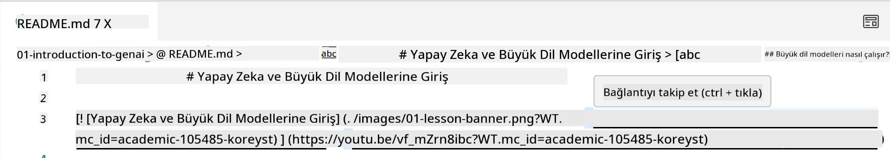
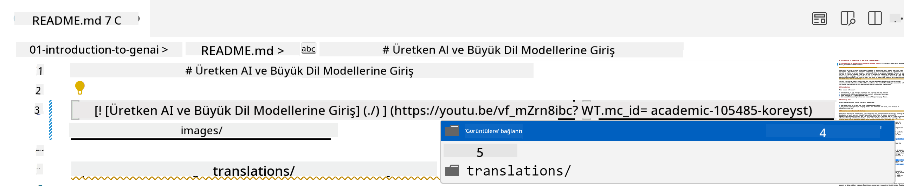
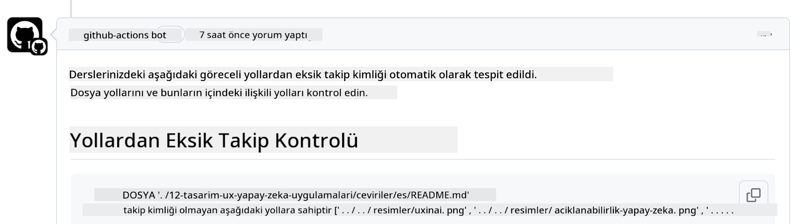
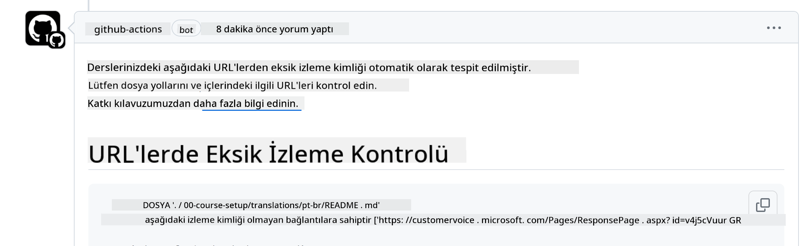
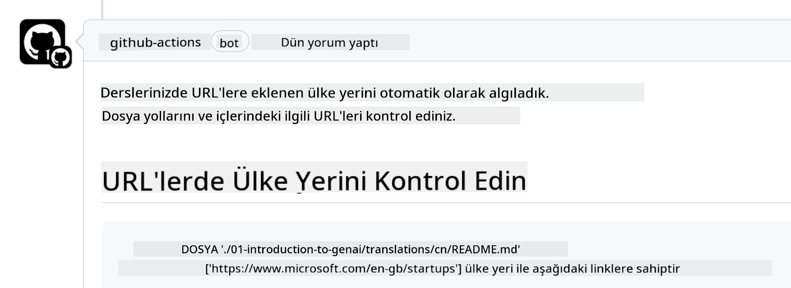

<!--
CO_OP_TRANSLATOR_METADATA:
{
  "original_hash": "57c41f2af71001a2cff9d8eb797cb843",
  "translation_date": "2025-05-19T11:15:40+00:00",
  "source_file": "CONTRIBUTING.md",
  "language_code": "tr"
}
-->
# Katkıda Bulunma

Bu proje katkıları ve önerileri memnuniyetle karşılıyor. Çoğu katkı, size bir Katılımcı Lisans Anlaşması (CLA) imzalamanızı gerektirir. Bu anlaşma, katkınızın kullanım hakkını bize vermek için gerekli haklara sahip olduğunuzu ve bunu gerçekten yaptığınızı beyan eder. Ayrıntılar için <https://cla.microsoft.com> adresini ziyaret edin.

> Önemli: Bu depodaki metinleri çevirirken, lütfen makine çevirisi kullanmayın. Çevirileri topluluk aracılığıyla doğrulayacağız, bu yüzden yalnızca yetkin olduğunuz dillerde çeviri için gönüllü olun.

Bir pull request gönderdiğinizde, bir CLA-bot otomatik olarak bir CLA sağlamanız gerekip gerekmediğini belirleyecek ve PR'yi uygun şekilde işaretleyecektir (örneğin, etiket, yorum). Bot tarafından sağlanan talimatları takip edin. Tüm depolarımızı kullandığınızda bunu yalnızca bir kez yapmanız gerekecek.

## Davranış Kuralları

Bu proje, [Microsoft Açık Kaynak Davranış Kuralları](https://opensource.microsoft.com/codeofconduct/?WT.mc_id=academic-105485-koreyst)'nı benimsemiştir. Daha fazla bilgi için [Davranış Kuralları SSS](https://opensource.microsoft.com/codeofconduct/faq/?WT.mc_id=academic-105485-koreyst)'yi okuyun veya ek sorularınız veya yorumlarınız için [opencode@microsoft.com](mailto:opencode@microsoft.com) adresiyle iletişime geçin.

## Soru veya Sorun mu Var?

Genel destek soruları için GitHub sorunları açmayın çünkü GitHub listesi özellik istekleri ve hata raporları için kullanılmalıdır. Bu şekilde gerçek sorunları veya kod hatalarını daha kolay takip edebiliriz ve genel tartışmaları gerçek koddan ayrı tutabiliriz.

## Yazım Hataları, Sorunlar, Hatalar ve Katkılar

Başlangıç Seviyesi Üretken Yapay Zeka deposuna herhangi bir değişiklik gönderdiğinizde, lütfen bu önerileri takip edin.

* Her zaman değişikliklerinizi yapmadan önce depoyu kendi hesabınıza çatallayın
* Birden fazla değişikliği tek bir pull request'e birleştirmeyin. Örneğin, herhangi bir hata düzeltmesini ve belge güncellemelerini ayrı PR'ler kullanarak gönderin
* Pull request'iniz birleştirme çatışmaları gösteriyorsa, değişikliklerinizi yapmadan önce yerel ana dalınızı ana depodakiyle aynalamaya güncellediğinizden emin olun
* Bir çeviri gönderiyorsanız, tüm çevrilen dosyalar için tek bir PR oluşturun çünkü içeriğin kısmi çevirilerini kabul etmiyoruz
* Yazım hatası veya belge düzeltmesi gönderiyorsanız, uygun olduğu yerlerde değişiklikleri tek bir PR'a birleştirebilirsiniz

## Yazım İçin Genel Rehberlik

- Tüm URL'lerinizin köşeli parantez içine alınmış ve etrafında veya içinde ekstra boşluk olmadan parantezle takip edildiğinden emin olun ``.
- Herhangi bir göreceli bağlantının (yani depodaki diğer dosya ve klasörlere bağlantılar) geçerli çalışma dizininde bulunan bir dosya veya klasöre atıfta bulunan `./` veya üst çalışma dizininde bulunan bir dosya veya klasöre atıfta bulunan `../` ile başlamasını sağlayın.
- Herhangi bir göreceli bağlantının (yani depodaki diğer dosya ve klasörlere bağlantılar) sonunda bir izleme kimliği (yani `?` veya `&` ardından `wt.mc_id=` veya `WT.mc_id=`) olduğundan emin olun.
- _github.com, microsoft.com, visualstudio.com, aka.ms ve azure.com_ gibi alan adlarından gelen herhangi bir URL'nin sonunda bir izleme kimliği (yani `?` veya `&` ardından `wt.mc_id=` veya `WT.mc_id=`) olduğundan emin olun.
- Bağlantılarınızın içinde ülkeye özgü bir yerel ayar bulunmadığından emin olun (yani `/en-us/` veya `/en/`).
- Tüm görüntülerin `./images` klasöründe saklandığından emin olun.
- Görüntülerin İngilizce karakterler, sayılar ve çizgiler kullanarak açıklayıcı adlara sahip olduğundan emin olun.

## GitHub İş Akışları

Bir pull request gönderdiğinizde, önceki kuralları doğrulamak için dört farklı iş akışı tetiklenecektir.
İş akışı kontrollerini geçmek için burada listelenen talimatları takip edin.

- [Kırık Göreceli Yolları Kontrol Et](../..)
- [Yolların İzlemeye Sahip Olduğunu Kontrol Et](../..)
- [URL'lerin İzlemeye Sahip Olduğunu Kontrol Et](../..)
- [URL'lerin Yerel Ayara Sahip Olmadığını Kontrol Et](../..)

### Kırık Göreceli Yolları Kontrol Et

Bu iş akışı, dosyalarınızdaki herhangi bir göreceli yolun çalıştığını kontrol eder.
Bu depo GitHub sayfalarına dağıtıldığı için, her şeyi bir arada tutan bağlantıları yazarken kimseyi yanlış yere yönlendirmemek için çok dikkatli olmalısınız.

Bağlantılarınızın doğru çalıştığından emin olmak için basitçe VS kodunu kullanarak kontrol edin.

Örneğin, dosyalarınızdaki herhangi bir bağlantının üzerine geldiğinizde, **ctrl + tıklama** yaparak bağlantıyı takip etmeniz istenecektir.

Bir bağlantıya tıkladığınızda ve yerel olarak çalışmıyorsa, kesinlikle iş akışını tetikleyecek ve GitHub'da çalışmayacaktır.

Bu sorunu düzeltmek için, bağlantıyı VS kodunun yardımıyla yazmayı deneyin.

`./` veya `../` yazdığınızda, VS kodu yazdığınıza göre mevcut seçeneklerden birini seçmenizi ister.

İstediğiniz dosya veya klasöre tıklayarak yolu takip edin ve yolunuzun kırık olmadığından emin olun.

Doğru göreceli yolu ekledikten sonra değişikliklerinizi kaydedin ve gönderin, iş akışı değişikliklerinizi doğrulamak için tekrar tetiklenecektir.
Kontrolü geçerseniz, devam edebilirsiniz.

### Yolların İzlemeye Sahip Olduğunu Kontrol Et

Bu iş akışı, herhangi bir göreceli yolun izlemeye sahip olduğunu kontrol eder.
Bu depo GitHub sayfalarına dağıtıldığı için, farklı dosyalar ve klasörler arasındaki hareketi izlememiz gerekiyor.

Göreceli yollarınızın izlemeye sahip olduğundan emin olmak için, basitçe yolun sonunda `?wt.mc_id=` metnini kontrol edin.
Yollarınıza eklenmişse, bu kontrolü geçersiniz.

Değilse, aşağıdaki hatayı alabilirsiniz.

Bu sorunu düzeltmek için, iş akışının vurguladığı dosya yolunu açmayı ve göreceli yolların sonuna izleme kimliğini eklemeyi deneyin.

İzleme kimliğini ekledikten sonra değişikliklerinizi kaydedin ve gönderin, iş akışı değişikliklerinizi doğrulamak için tekrar tetiklenecektir.
Kontrolü geçerseniz, devam edebilirsiniz.

### URL'lerin İzlemeye Sahip Olduğunu Kontrol Et

Bu iş akışı, herhangi bir web URL'sinin izlemeye sahip olduğunu kontrol eder.
Bu depo herkese açık olduğundan, erişimi izlemek ve trafiğin nereden geldiğini bilmek için izleme eklemeniz gerekiyor.

URL'lerinizin izlemeye sahip olduğundan emin olmak için, basitçe URL'nin sonunda `?wt.mc_id=` metnini kontrol edin.
URL'lerinize eklenmişse, bu kontrolü geçersiniz.

Değilse, aşağıdaki hatayı alabilirsiniz.

Bu sorunu düzeltmek için, iş akışının vurguladığı dosya yolunu açmayı ve URL'lerin sonuna izleme kimliğini eklemeyi deneyin.

İzleme kimliğini ekledikten sonra değişikliklerinizi kaydedin ve gönderin, iş akışı değişikliklerinizi doğrulamak için tekrar tetiklenecektir.
Kontrolü geçerseniz, devam edebilirsiniz.

### URL'lerin Yerel Ayara Sahip Olmadığını Kontrol Et

Bu iş akışı, herhangi bir web URL'sinin ülkeye özgü yerel ayara sahip olmadığını kontrol eder.
Bu depo dünya genelinde herkese açık olduğundan, URL'lerde ülkenizin yerel ayarını eklememeye dikkat etmelisiniz.

URL'lerinizin içinde ülke yerel ayarı bulunmadığından emin olmak için, basitçe URL'nin herhangi bir yerinde `/en-us/` veya `/en/` veya başka bir dil yerel ayarı olup olmadığını kontrol edin.
URL'lerinizde yoksa, bu kontrolü geçersiniz.

Değilse, aşağıdaki hatayı alabilirsiniz.

Bu sorunu düzeltmek için, iş akışının vurguladığı dosya yolunu açmayı ve URL'lerden ülke yerel ayarını kaldırmayı deneyin.

Ülke yerel ayarını kaldırdıktan sonra değişikliklerinizi kaydedin ve gönderin, iş akışı değişikliklerinizi doğrulamak için tekrar tetiklenecektir.
Kontrolü geçerseniz, devam edebilirsiniz.

Tebrikler! Katkınızla ilgili geri bildirimlerle en kısa sürede size geri döneceğiz.

**Feragatname**:  
Bu belge, AI çeviri hizmeti [Co-op Translator](https://github.com/Azure/co-op-translator) kullanılarak çevrilmiştir. Doğruluk için çaba göstersek de, otomatik çevirilerin hata veya yanlışlıklar içerebileceğini lütfen unutmayın. Orijinal belge, kendi dilinde yetkili kaynak olarak kabul edilmelidir. Kritik bilgiler için profesyonel insan çevirisi önerilir. Bu çevirinin kullanılmasından kaynaklanan yanlış anlama veya yanlış yorumlamalardan dolayı sorumluluk kabul etmiyoruz.