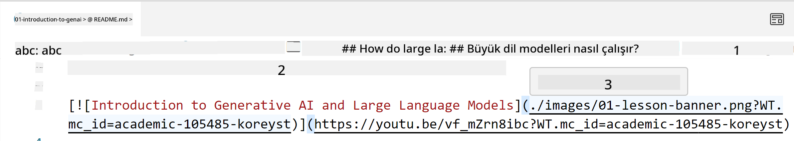
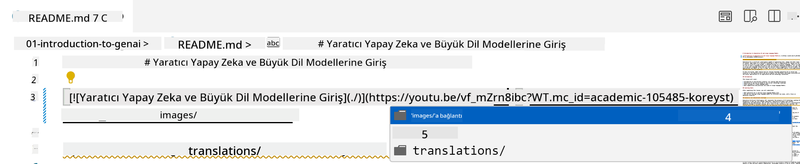
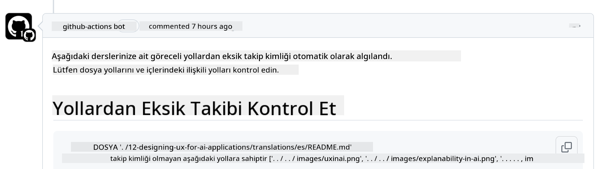
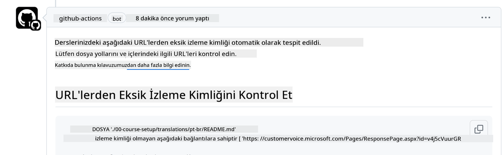
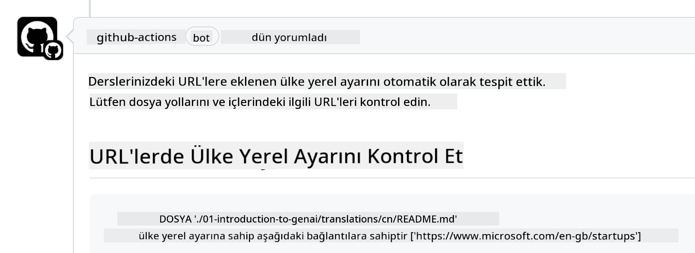

<!--
CO_OP_TRANSLATOR_METADATA:
{
  "original_hash": "57c41f2af71001a2cff9d8eb797cb843",
  "translation_date": "2025-06-25T07:10:07+00:00",
  "source_file": "CONTRIBUTING.md",
  "language_code": "tr"
}
-->
# Katkıda Bulunma

Bu proje katkıları ve önerileri memnuniyetle karşılar. Çoğu katkının, Katkıda Bulunucu Lisans Anlaşması'nı (CLA) kabul etmenizi gerektirir. Bu anlaşma, katkınızı kullanma haklarına sahip olduğunuzu ve bu hakları bize devrettiğinizi beyan eder. Detaylar için <https://cla.microsoft.com> adresini ziyaret edin.

> Önemli: Bu depodaki metinleri çevirirken, makine çevirisi kullanmadığınızdan emin olun. Çevirileri topluluk aracılığıyla doğrulayacağız, bu yüzden yalnızca yetkin olduğunuz dillerde çeviri yapmayı gönüllü olarak üstlenin.

Bir çekme isteği gönderdiğinizde, bir CLA-bot otomatik olarak bir CLA sağlamanız gerekip gerekmediğini belirleyecek ve PR'yi uygun şekilde süsleyecektir (örneğin, etiket, yorum). Botun sağladığı talimatları takip edin. Bunu, CLA kullanan tüm depolar için yalnızca bir kez yapmanız gerekecek.

## Davranış Kuralları

Bu proje [Microsoft Açık Kaynak Davranış Kuralları](https://opensource.microsoft.com/codeofconduct/?WT.mc_id=academic-105485-koreyst)'nı benimsemiştir. Daha fazla bilgi için [Davranış Kuralları SSS](https://opensource.microsoft.com/codeofconduct/faq/?WT.mc_id=academic-105485-koreyst)'yi okuyun veya ek sorular ya da yorumlar için [opencode@microsoft.com](mailto:opencode@microsoft.com) ile iletişime geçin.

## Soru veya Sorun?

Lütfen genel destek soruları için GitHub sorunları açmayın, çünkü GitHub listesi özellik istekleri ve hata raporları için kullanılmalıdır. Bu şekilde, koddan kaynaklanan gerçek sorunları veya hataları daha kolay takip edebiliriz ve genel tartışmayı koddan ayırabiliriz.

## Yazım Hataları, Sorunlar, Hatalar ve Katkılar

Başlangıç seviyesindeki Generative AI deposuna herhangi bir değişiklik gönderirken lütfen şu önerilere uyun.

* Değişikliklerinizi yapmadan önce her zaman depoyu kendi hesabınıza çatallayın
* Birden fazla değişikliği tek bir çekme isteğinde birleştirmeyin. Örneğin, herhangi bir hata düzeltmesini ve belge güncellemelerini ayrı PR'ler kullanarak gönderin
* Çekme isteğiniz birleştirme çatışmaları gösteriyorsa, değişikliklerinizi yapmadan önce yerel ana deponuzu ana depodakiyle aynalanacak şekilde güncellediğinizden emin olun
* Bir çeviri gönderiyorsanız, tüm çevrilmiş dosyalar için bir PR oluşturun çünkü içerik için kısmi çevirileri kabul etmiyoruz
* Yazım hatası veya belge düzeltmesi gönderiyorsanız, uygun olduğunda değişiklikleri tek bir PR'de birleştirebilirsiniz

## Yazma İçin Genel Rehberlik

- Tüm URL'lerinizi, etraflarında veya içinde fazladan boşluk olmadan, köşeli parantezlerle ve ardından parantez içinde sarılı olduğundan emin olun ``.
- Herhangi bir göreli bağlantının (yani depodaki diğer dosya ve klasörlere bağlantılar) geçerli çalışma dizininde bulunan bir dosya veya klasöre atıfta bulunarak `./` ile veya bir üst çalışma dizininde bulunan bir dosya veya klasöre atıfta bulunarak `../` ile başladığından emin olun.
- Herhangi bir göreli bağlantının (yani depodaki diğer dosya ve klasörlere bağlantılar) sonunda bir izleme kimliği (yani `?` veya `&` ardından `wt.mc_id=` veya `WT.mc_id=`) olduğundan emin olun.
- _github.com, microsoft.com, visualstudio.com, aka.ms ve azure.com_ alan adlarından herhangi bir URL'nin sonunda bir izleme kimliği (yani `?` veya `&` ardından `wt.mc_id=` veya `WT.mc_id=`) olduğundan emin olun.
- Bağlantılarınızın içinde ülkeye özgü yerel ayar olmadığından emin olun (yani `/en-us/` veya `/en/`).
- Tüm resimlerin `./images` klasöründe saklandığından emin olun.
- Resimlerin, İngilizce karakterler, sayılar ve tireler kullanılarak açıklayıcı adlara sahip olduğundan emin olun.

## GitHub İş Akışları

Bir çekme isteği gönderdiğinizde, önceki kuralları doğrulamak için dört farklı iş akışı tetiklenecektir. İş akışı kontrollerini geçmek için burada listelenen talimatları takip edin.

- [Bozuk Göreli Yolları Kontrol Et](../..)
- [Yolların İzlemeye Sahip Olduğunu Kontrol Et](../..)
- [URL'lerin İzlemeye Sahip Olduğunu Kontrol Et](../..)
- [URL'lerin Yerel Ayara Sahip Olmadığını Kontrol Et](../..)

### Bozuk Göreli Yolları Kontrol Et

Bu iş akışı, dosyalarınızdaki herhangi bir göreli yolun çalıştığını garanti eder. Bu depo, GitHub sayfalarına dağıtılır, bu yüzden her şeyi bir araya getiren bağlantıları yazarken çok dikkatli olmanız ve kimseyi yanlış yere yönlendirmemeniz gerekir.

Bağlantılarınızın doğru çalıştığından emin olmak için basitçe VS kodunu kullanarak kontrol edin.

Örneğin, dosyalarınızdaki herhangi bir bağlantının üzerine geldiğinizde, **ctrl + tıklama** yaparak bağlantıyı takip etmeniz istenir.

Bir bağlantıya tıkladığınızda ve yerel olarak çalışmıyorsa, kesinlikle iş akışını tetikleyecek ve GitHub'da çalışmayacaktır.

Bu sorunu çözmek için, VS kodunun yardımıyla bağlantıyı yazmayı deneyin.

`./` veya `../` yazdığınızda, VS kodu, yazdığınıza göre mevcut seçeneklerden birini seçmenizi isteyecektir.

İstediğiniz dosya veya klasöre tıklayarak yolu takip edin ve yolunuzun bozulmadığından emin olun.

Doğru göreli yolu ekledikten sonra, değişikliklerinizi kaydedin ve itin, iş akışı değişikliklerinizi doğrulamak için tekrar tetiklenecektir. Kontrolü geçerseniz, devam edebilirsiniz.

### Yolların İzlemeye Sahip Olduğunu Kontrol Et

Bu iş akışı, herhangi bir göreli yolun izleme içerdiğini garanti eder. Bu depo, GitHub sayfalarına dağıtılır, bu yüzden farklı dosya ve klasörler arasında hareketi izlememiz gerekir.

Göreli yollarınızın izleme içerdiğinden emin olmak için, yolun sonunda `?wt.mc_id=` metnini kontrol edin. Eğer göreli yollarınıza eklenmişse, bu kontrolü geçersiniz.

Değilse, aşağıdaki hatayı alabilirsiniz.

Bu sorunu çözmek için, iş akışının vurguladığı dosya yolunu açmayı deneyin ve göreli yolların sonuna izleme kimliğini ekleyin.

İzleme kimliğini ekledikten sonra, değişikliklerinizi kaydedin ve itin, iş akışı değişikliklerinizi doğrulamak için tekrar tetiklenecektir. Kontrolü geçerseniz, devam edebilirsiniz.

### URL'lerin İzlemeye Sahip Olduğunu Kontrol Et

Bu iş akışı, herhangi bir web URL'sinin izleme içerdiğini garanti eder. Bu depo, herkese açıktır, bu yüzden trafiğin nereden geldiğini bilmek için erişimi izlememiz gerekir.

URL'lerinizin izleme içerdiğinden emin olmak için, URL'nin sonunda `?wt.mc_id=` metnini kontrol edin. Eğer URL'lerinize eklenmişse, bu kontrolü geçersiniz.

Değilse, aşağıdaki hatayı alabilirsiniz.

Bu sorunu çözmek için, iş akışının vurguladığı dosya yolunu açmayı deneyin ve URL'lerin sonuna izleme kimliğini ekleyin.

İzleme kimliğini ekledikten sonra, değişikliklerinizi kaydedin ve itin, iş akışı değişikliklerinizi doğrulamak için tekrar tetiklenecektir. Kontrolü geçerseniz, devam edebilirsiniz.

### URL'lerin Yerel Ayara Sahip Olmadığını Kontrol Et

Bu iş akışı, herhangi bir web URL'sinin ülkeye özgü yerel ayar içermediğini garanti eder. Bu depo, dünyanın her yerinden erişilebilir, bu yüzden URL'lerde ülkenizin yerel ayarını içermemeye dikkat etmelisiniz.

URL'lerinizin içinde ülke yerel ayarı olmadığından emin olmak için, URL'nin herhangi bir yerinde `/en-us/` veya `/en/` veya başka bir dil yerel ayarını kontrol edin. Eğer URL'lerinizde mevcut değilse, bu kontrolü geçersiniz.

Değilse, aşağıdaki hatayı alabilirsiniz.

Bu sorunu çözmek için, iş akışının vurguladığı dosya yolunu açmayı deneyin ve URL'lerden ülke yerel ayarını kaldırın.

Ülke yerel ayarını kaldırdıktan sonra, değişikliklerinizi kaydedin ve itin, iş akışı değişikliklerinizi doğrulamak için tekrar tetiklenecektir. Kontrolü geçerseniz, devam edebilirsiniz.

Tebrikler! Katkınız hakkında geri bildirim ile en kısa sürede size geri döneceğiz.

**Feragatname**:  
Bu belge, AI çeviri hizmeti [Co-op Translator](https://github.com/Azure/co-op-translator) kullanılarak çevrilmiştir. Doğruluk için çaba göstersek de, otomatik çevirilerin hata veya yanlışlıklar içerebileceğini lütfen unutmayın. Orijinal belge, kendi dilinde yetkili kaynak olarak kabul edilmelidir. Kritik bilgiler için, profesyonel insan çevirisi önerilir. Bu çevirinin kullanımından kaynaklanan yanlış anlama veya yanlış yorumlamalardan sorumlu değiliz.