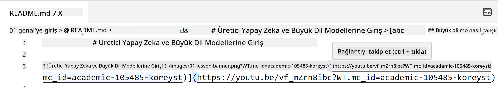
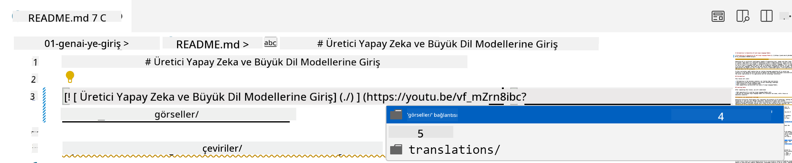
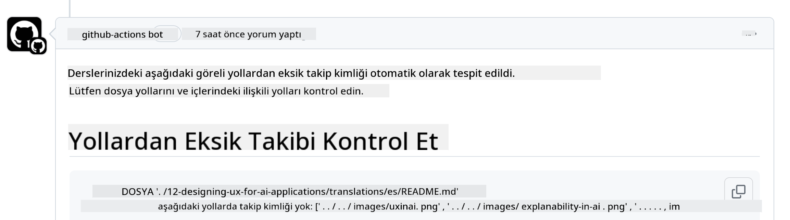
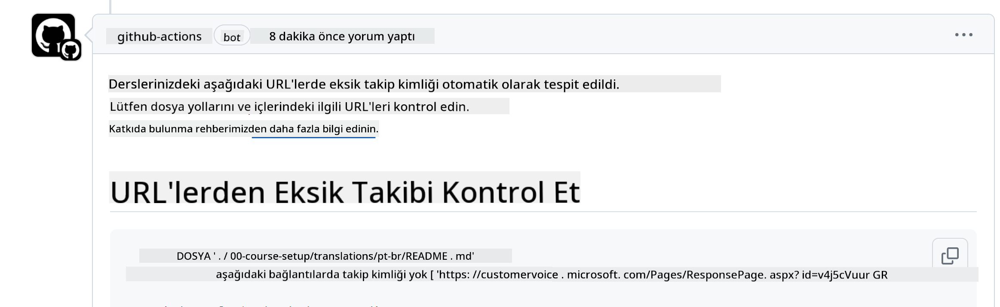
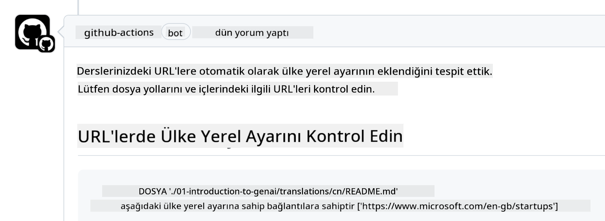

<!--
CO_OP_TRANSLATOR_METADATA:
{
  "original_hash": "57c41f2af71001a2cff9d8eb797cb843",
  "translation_date": "2025-07-09T06:06:38+00:00",
  "source_file": "CONTRIBUTING.md",
  "language_code": "tr"
}
-->
# Katkıda Bulunma

Bu proje katkılara ve önerilere açıktır. Çoğu katkı için, katkınızı kullanma haklarını bize verdiğinizi beyan eden bir Katkıda Bulunan Lisans Sözleşmesi'ni (CLA) kabul etmeniz gerekir. Detaylar için <https://cla.microsoft.com> adresini ziyaret edin.

> Önemli: Bu depodaki metinleri çevirirken lütfen makine çevirisi kullanmayın. Çeviriler topluluk tarafından doğrulanacaktır, bu yüzden yalnızca iyi bildiğiniz dillerde çeviri yapmayı gönüllü olun.

Bir pull request gönderdiğinizde, CLA-bot otomatik olarak CLA sağlamanız gerekip gerekmediğini belirleyecek ve PR'ı uygun şekilde işaretleyecektir (örneğin, etiket, yorum). Botun verdiği talimatları takip etmeniz yeterlidir. CLA kullanan tüm depolarda bunu yalnızca bir kez yapmanız gerekir.

## Davranış Kuralları

Bu proje [Microsoft Açık Kaynak Davranış Kuralları](https://opensource.microsoft.com/codeofconduct/?WT.mc_id=academic-105485-koreyst) kurallarını benimsemiştir.  
Daha fazla bilgi için [Davranış Kuralları SSS](https://opensource.microsoft.com/codeofconduct/faq/?WT.mc_id=academic-105485-koreyst) sayfasını okuyabilir veya ek sorularınız ya da yorumlarınız için [opencode@microsoft.com](mailto:opencode@microsoft.com) adresiyle iletişime geçebilirsiniz.

## Soru veya Sorun?

Lütfen genel destek soruları için GitHub issue açmayın; GitHub listesi özellik talepleri ve hata raporları için kullanılmalıdır. Böylece gerçek kod sorunlarını veya hatalarını daha kolay takip edebilir ve genel tartışmayı koddan ayrı tutabiliriz.

## Yazım Hataları, Sorunlar, Hatalar ve Katkılar

Generative AI for Beginners deposuna herhangi bir değişiklik gönderirken lütfen aşağıdaki önerilere uyun.

* Değişiklik yapmadan önce her zaman depoyu kendi hesabınıza fork edin  
* Birden fazla değişikliği tek bir pull request'te birleştirmeyin. Örneğin, hata düzeltmeleri ve dokümantasyon güncellemelerini ayrı PR'lar olarak gönderin  
* Pull request'inizde birleştirme çatışmaları varsa, değişiklik yapmadan önce yerel main dalınızı ana depodaki main ile senkronize edin  
* Çeviri gönderiyorsanız, tüm çevrilen dosyalar için tek bir PR oluşturun; içerik için kısmi çevirileri kabul etmiyoruz  
* Yazım hatası veya dokümantasyon düzeltmesi gönderiyorsanız, uygun olduğunda değişiklikleri tek bir PR'de birleştirebilirsiniz  

## Yazım İçin Genel Rehber

- Tüm URL'lerinizin köşeli parantez içinde ve ardından parantezle `` sarılı olduğundan emin olun, aralarında veya içinde ekstra boşluk olmasın.  
- Göreli bağlantılar (yani depodaki diğer dosya ve klasörlere bağlantılar) `./` ile başlamalıdır; bu, geçerli çalışma dizinindeki bir dosya veya klasöre işaret eder ya da `../` ile başlamalıdır; bu, üst dizindeki bir dosya veya klasöre işaret eder.  
- Göreli bağlantıların sonunda bir takip kimliği (örneğin `?` veya `&` ardından `wt.mc_id=` veya `WT.mc_id=`) olduğundan emin olun.  
- _github.com, microsoft.com, visualstudio.com, aka.ms ve azure.com_ alan adlarından gelen URL'lerin sonunda takip kimliği olduğundan emin olun.  
- Bağlantılarınızda ülkeye özgü yerel dil kodu (örneğin `/en-us/` veya `/en/`) bulunmadığından emin olun.  
- Tüm resimler `./images` klasöründe saklanmalıdır.  
- Resim dosyalarının isimleri İngilizce karakterler, rakamlar ve tireler kullanılarak açıklayıcı olmalıdır.  

## GitHub İş Akışları

Bir pull request gönderdiğinizde, önceki kuralları doğrulamak için dört farklı iş akışı tetiklenir.  
İş akışı kontrollerini geçmek için buradaki talimatları takip edin.

- [Kırık Göreli Yolları Kontrol Et](../..)  
- [Yolların Takip İçermesini Kontrol Et](../..)  
- [URL'lerin Takip İçermesini Kontrol Et](../..)  
- [URL'lerin Yerel Dil Kodu İçermemesini Kontrol Et](../..)  

### Kırık Göreli Yolları Kontrol Et

Bu iş akışı, dosyalarınızdaki göreli yolların çalıştığını doğrular.  
Bu depo GitHub sayfalarına dağıtıldığı için, bağlantıları yazarken çok dikkatli olmalısınız; yanlış yere yönlendirmemelisiniz.

Bağlantılarınızın düzgün çalıştığından emin olmak için VS Code kullanabilirsiniz.

Örneğin, dosyalarınızdaki herhangi bir bağlantının üzerine geldiğinizde, **ctrl + tıklama** ile bağlantıyı takip etmeniz istenir.

Bir bağlantıya tıkladığınızda yerelde çalışmıyorsa, iş akışı da hata verecek ve GitHub'da çalışmayacaktır.

Bu sorunu düzeltmek için bağlantıyı VS Code yardımıyla yazmayı deneyin.

`./` veya `../` yazdığınızda, VS Code size yazdığınıza göre mevcut seçenekleri sunar.

İstediğiniz dosya veya klasöre tıklayarak yolu takip edin, böylece yolunuzun kırık olmadığından emin olursunuz.

Doğru göreli yolu ekleyip kaydedip değişikliklerinizi gönderdiğinizde iş akışı tekrar tetiklenir ve değişiklikleriniz doğrulanır.  
Kontrolü geçerseniz, devam edebilirsiniz.

### Yolların Takip İçermesini Kontrol Et

Bu iş akışı, göreli yolların takip bilgisi içerdiğini doğrular.  
Bu depo GitHub sayfalarına dağıtıldığı için, farklı dosya ve klasörler arasındaki hareketi takip etmemiz gerekir.

Göreli yollarınızda takip bilgisi olup olmadığını kontrol etmek için yolun sonunda `?wt.mc_id=` metninin olup olmadığına bakın.  
Eğer varsa, bu kontrolü geçersiniz.

Yoksa aşağıdaki hatayı alabilirsiniz.

Bu sorunu düzeltmek için iş akışının işaretlediği dosya yolunu açın ve göreli yolların sonuna takip kimliğini ekleyin.

Takip kimliğini ekleyip kaydedip değişikliklerinizi gönderdiğinizde iş akışı tekrar tetiklenir ve değişiklikleriniz doğrulanır.  
Kontrolü geçerseniz, devam edebilirsiniz.

### URL'lerin Takip İçermesini Kontrol Et

Bu iş akışı, web URL'lerinin takip bilgisi içerdiğini doğrular.  
Bu depo herkesin erişimine açık olduğu için, trafiğin nereden geldiğini takip etmeniz gerekir.

URL'lerinizde takip bilgisi olup olmadığını kontrol etmek için URL'nin sonunda `?wt.mc_id=` metninin olup olmadığına bakın.  
Eğer varsa, bu kontrolü geçersiniz.

Yoksa aşağıdaki hatayı alabilirsiniz.

Bu sorunu düzeltmek için iş akışının işaretlediği dosya yolunu açın ve URL'lerin sonuna takip kimliğini ekleyin.

Takip kimliğini ekleyip kaydedip değişikliklerinizi gönderdiğinizde iş akışı tekrar tetiklenir ve değişiklikleriniz doğrulanır.  
Kontrolü geçerseniz, devam edebilirsiniz.

### URL'lerin Yerel Dil Kodu İçermemesini Kontrol Et

Bu iş akışı, web URL'lerinde ülkeye özgü yerel dil kodu olmadığını doğrular.  
Bu depo dünya çapında erişime açık olduğu için, URL'lerde kendi ülkenizin yerel dil kodunu kullanmamanız gerekir.

URL'lerinizde `/en-us/`, `/en/` veya başka herhangi bir dil yerel kodunun olup olmadığını kontrol edin.  
Eğer yoksa, bu kontrolü geçersiniz.

Yoksa aşağıdaki hatayı alabilirsiniz.

Bu sorunu düzeltmek için iş akışının işaretlediği dosya yolunu açın ve URL'lerden ülke yerel kodunu kaldırın.

Yerel kodu kaldırıp kaydedip değişikliklerinizi gönderdiğinizde iş akışı tekrar tetiklenir ve değişiklikleriniz doğrulanır.  
Kontrolü geçerseniz, devam edebilirsiniz.

Tebrikler! Katkınızla ilgili geri bildirim için en kısa sürede sizinle iletişime geçeceğiz.

**Feragatname**:  
Bu belge, AI çeviri servisi [Co-op Translator](https://github.com/Azure/co-op-translator) kullanılarak çevrilmiştir. Doğruluk için çaba göstersek de, otomatik çevirilerin hatalar veya yanlışlıklar içerebileceğini lütfen unutmayın. Orijinal belge, kendi dilinde yetkili kaynak olarak kabul edilmelidir. Kritik bilgiler için profesyonel insan çevirisi önerilir. Bu çevirinin kullanımı sonucu ortaya çıkabilecek yanlış anlamalar veya yorum hatalarından sorumlu değiliz.