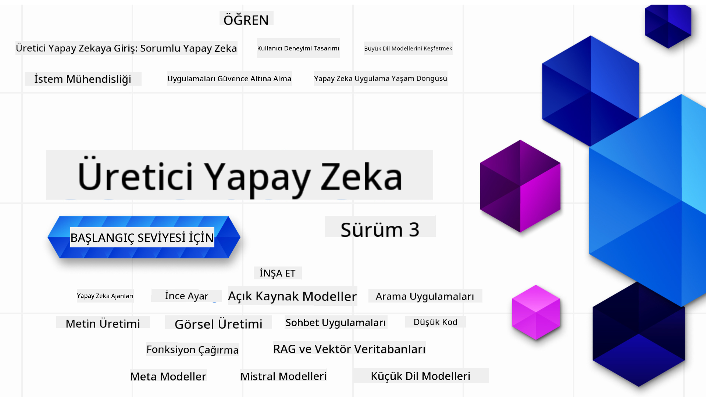

<!--
CO_OP_TRANSLATOR_METADATA:
{
  "original_hash": "c2ee25895ebbfa1a52868bb6eab686fc",
  "translation_date": "2025-05-19T11:42:26+00:00",
  "source_file": "README.md",
  "language_code": "tr"
}
-->

### Üretken Yapay Zeka uygulamaları geliştirmeye başlamak için bilmeniz gereken her şeyi öğreten 21 Ders

### 🌐 Çok Dilli Destek

#### GitHub Action aracılığıyla desteklenmektedir (Otomatik ve Her Zaman Güncel)
[Fransızca](../fr/README.md) | [İspanyolca](../es/README.md) | [Almanca](../de/README.md) | [Rusça](../ru/README.md) | [Arapça](../ar/README.md) | [Farsça](../fa/README.md) | [Urduca](../ur/README.md) | [Çince (Basitleştirilmiş)](../zh/README.md) | [Çince (Geleneksel, Makao)](../mo/README.md) | [Çince (Geleneksel, Hong Kong)](../hk/README.md) | [Çince (Geleneksel, Tayvan)](../tw/README.md) | [Japonca](../ja/README.md) | [Korece](../ko/README.md) | [Hintçe](../hi/README.md) | [Bengalce](../bn/README.md) | [Marathi](../mr/README.md) | [Nepalce](../ne/README.md) | [Pencapça (Gurmukhi)](../pa/README.md) | [Portekizce (Portekiz)](../pt/README.md) | [Portekizce (Brezilya)](../br/README.md) | [İtalyanca](../it/README.md) | [Lehçe](../pl/README.md) | [Türkçe](./README.md) | [Yunanca](../el/README.md) | [Tayca](../th/README.md) | [İsveççe](../sv/README.md) | [Danca](../da/README.md) | [Norveççe](../no/README.md) | [Fince](../fi/README.md) | [Felemenkçe](../nl/README.md) | [İbranice](../he/README.md) | [Vietnamca](../vi/README.md) | [Endonezce](../id/README.md) | [Malayca](../ms/README.md) | [Tagalog (Filipince)](../tl/README.md) | [Svahili](../sw/README.md) | [Macarca](../hu/README.md) | [Çekçe](../cs/README.md) | [Slovakça](../sk/README.md) | [Romence](../ro/README.md) | [Bulgarca](../bg/README.md) | [Sırpça (Kiril)](../sr/README.md) | [Hırvatça](../hr/README.md) | [Slovence](../sl/README.md)
# Başlangıç Seviyesi için Üretken AI (Sürüm 3) - Bir Kurs

Microsoft Cloud Advocates tarafından hazırlanan 21 derslik kapsamlı kursumuzla Üretken AI uygulamaları oluşturmanın temellerini öğrenin.

## 🌱 Başlarken

Bu kursta 21 ders bulunmaktadır. Her ders kendi konusunu ele alır, bu yüzden istediğiniz yerden başlayabilirsiniz!

Dersler ya bir Üretken AI kavramını açıklayan "Öğren" dersleri ya da bir kavramı ve mümkün olduğunda hem **Python** hem de **TypeScript** ile kod örneklerini açıklayan "İnşa Et" dersleri olarak etiketlenmiştir.

.NET Geliştiricileri için [Başlangıç Seviyesi için Üretken AI (.NET Sürümü)](https://github.com/microsoft/Generative-AI-for-beginners-dotnet?WT.mc_id=academic-105485-koreyst)'e göz atın!

Her ders ayrıca ek öğrenme araçları içeren bir "Öğrenmeye Devam Et" bölümü içerir.

## İhtiyacınız Olanlar
### Bu kursun kodunu çalıştırmak için şunları kullanabilirsiniz:
 - [Azure OpenAI Hizmeti](https://aka.ms/genai-beginners/azure-open-ai?WT.mc_id=academic-105485-koreyst) - **Dersler:** "aoai-assignment"
 - [GitHub Marketplace Model Kataloğu](https://aka.ms/genai-beginners/gh-models?WT.mc_id=academic-105485-koreyst) - **Dersler:** "githubmodels"
 - [OpenAI API](https://aka.ms/genai-beginners/open-ai?WT.mc_id=academic-105485-koreyst) - **Dersler:** "oai-assignment"
   
- Temel Python veya TypeScript bilgisi faydalıdır - \*Tamamen yeni başlayanlar için bu [Python](https://aka.ms/genai-beginners/python?WT.mc_id=academic-105485-koreyst) ve [TypeScript](https://aka.ms/genai-beginners/typescript?WT.mc_id=academic-105485-koreyst) kurslarına göz atın
- Kendi GitHub hesabınıza [bu tüm depoyu çatallamak](https://aka.ms/genai-beginners/github?WT.mc_id=academic-105485-koreyst) için bir GitHub hesabı

Geliştirme ortamınızı kurmanıza yardımcı olmak için bir **[Kurs Kurulumu](./00-course-setup/README.md?WT.mc_id=academic-105485-koreyst)** dersi oluşturduk.

Daha sonra daha kolay bulmak için [bu depoya yıldız (🌟) eklemeyi](https://docs.github.com/en/get-started/exploring-projects-on-github/saving-repositories-with-stars?WT.mc_id=academic-105485-koreyst) unutmayın.

## 🧠 Dağıtıma Hazır mısınız?

Daha gelişmiş kod örnekleri arıyorsanız, **Python** ve **TypeScript**'teki [Üretken AI Kod Örnekleri koleksiyonumuza](https://aka.ms/genai-beg-code?WT.mc_id=academic-105485-koreyst) göz atın.

## 🗣️ Diğer Öğrencilerle Tanışın, Destek Alın

Bu kursu alan diğer öğrencilerle tanışmak ve ağ kurmak için [resmi Azure AI Foundry Discord sunucumuza](https://aka.ms/genai-discord?WT.mc_id=academic-105485-koreyst) katılın ve destek alın.

Sorular sorun veya ürün geri bildirimlerinizi [Azure AI Foundry Geliştirici Forumumuzda](https://aka.ms/azureaifoundry/forum) paylaşın.

## 🚀 Bir Startup mı Kuruyorsunuz?

**Ücretsiz OpenAI kredileri** ve **Azure OpenAI Hizmetleri aracılığıyla OpenAI modellerine erişim için 150 bin dolara kadar Azure kredisi** almak için [Microsoft for Startups Founders Hub](https://aka.ms/genai-foundershub?WT.mc_id=academic-105485-koreyst)'a kaydolun.

## 🙏 Yardım Etmek İster misiniz?

Önerileriniz var mı ya da yazım veya kod hataları mı buldunuz? [Bir sorun bildirin](https://github.com/microsoft/generative-ai-for-beginners/issues?WT.mc_id=academic-105485-koreyst) veya [Bir çekme isteği oluşturun](https://github.com/microsoft/generative-ai-for-beginners/pulls?WT.mc_id=academic-105485-koreyst)

## 📂 Her Ders Şunları İçerir:

- Konuya kısa bir video tanıtımı
- README'de bulunan yazılı bir ders
- Azure OpenAI ve OpenAI API'yi destekleyen Python ve TypeScript kod örnekleri
- Öğrenmeye devam etmek için ek kaynak bağlantıları

## 🗃️ Dersler

| #   | **Ders Bağlantısı**                                                                                                                          | **Açıklama**                                                                                     | **Video**                                                                   | **Ekstra Öğrenme**                                                             |
| --- | -------------------------------------------------------------------------------------------------------------------------------------------- | ----------------------------------------------------------------------------------------------- | --------------------------------------------------------------------------- | ------------------------------------------------------------------------------ |
| 00  | [Kurs Kurulumu](./00-course-setup/README.md?WT.mc_id=academic-105485-koreyst)                                                                | **Öğren:** Geliştirme Ortamınızı Nasıl Kurarsınız                                               | Video Yakında Gelecek                                                      | [Daha Fazla Öğren](https://aka.ms/genai-collection?WT.mc_id=academic-105485-koreyst) |
| 01  | [Üretken AI ve LLM'lere Giriş](./01-introduction-to-genai/README.md?WT.mc_id=academic-105485-koreyst)                                        | **Öğren:** Üretken AI'nin ne olduğunu ve Büyük Dil Modellerinin (LLM'ler) nasıl çalıştığını anlama | [Video](https://aka.ms/gen-ai-lesson-1-gh?WT.mc_id=academic-105485-koreyst) | [Daha Fazla Öğren](https://aka.ms/genai-collection?WT.mc_id=academic-105485-koreyst) |
| 02  | [Farklı LLM'leri Keşfetmek ve Karşılaştırmak](./02-exploring-and-comparing-different-llms/README.md?WT.mc_id=academic-105485-koreyst)         | **Öğren:** Kullanım durumunuz için doğru modeli nasıl seçeceğiniz                               | [Video](https://aka.ms/gen-ai-lesson2-gh?WT.mc_id=academic-105485-koreyst)  | [Daha Fazla Öğren](https://aka.ms/genai-collection?WT.mc_id=academic-105485-koreyst) |
| 03  | [Üretken AI'yı Sorumlu Şekilde Kullanmak](./03-using-generative-ai-responsibly/README.md?WT.mc_id=academic-105485-koreyst)                   | **Öğren:** Sorumlu bir şekilde Üretken AI Uygulamaları nasıl oluşturulur                         | [Video](https://aka.ms/gen-ai-lesson3-gh?WT.mc_id=academic-105485-koreyst)  | [Daha Fazla Öğren](https://aka.ms/genai-collection?WT.mc_id=academic-105485-koreyst) |
| 04  | [Prompt Mühendisliği Temellerini Anlamak](./04-prompt-engineering-fundamentals/README.md?WT.mc_id=academic-105485-koreyst)                   | **Öğren:** Uygulamalı Prompt Mühendisliği En İyi Uygulamaları                                   | [Video](https://aka.ms/gen-ai-lesson4-gh?WT.mc_id=academic-105485-koreyst)  | [Daha Fazla Öğren](https://aka.ms/genai-collection?WT.mc_id=academic-105485-koreyst) |
| 05  | [Gelişmiş İstemler Oluşturma](./05-advanced-prompts/README.md?WT.mc_id=academic-105485-koreyst)                                                | **Öğren:** İstemlerinizin sonucunu iyileştiren istem mühendisliği tekniklerini nasıl uygulayacağınızı öğrenin. | [Video](https://aka.ms/gen-ai-lesson5-gh?WT.mc_id=academic-105485-koreyst)  | [Daha Fazla Bilgi](https://aka.ms/genai-collection?WT.mc_id=academic-105485-koreyst) |
| 06  | [Metin Üretim Uygulamaları Oluşturma](./06-text-generation-apps/README.md?WT.mc_id=academic-105485-koreyst)                                | **Oluştur:** Azure OpenAI / OpenAI API kullanarak bir metin üretim uygulaması oluşturun                                | [Video](https://aka.ms/gen-ai-lesson6-gh?WT.mc_id=academic-105485-koreyst)  | [Daha Fazla Bilgi](https://aka.ms/genai-collection?WT.mc_id=academic-105485-koreyst) |
| 07  | [Sohbet Uygulamaları Oluşturma](./07-building-chat-applications/README.md?WT.mc_id=academic-105485-koreyst)                                     | **Oluştur:** Sohbet uygulamalarını verimli bir şekilde oluşturma ve entegre etme teknikleri.               | [Video](https://aka.ms/gen-ai-lessons7-gh?WT.mc_id=academic-105485-koreyst) | [Daha Fazla Bilgi](https://aka.ms/genai-collection?WT.mc_id=academic-105485-koreyst) |
| 08  | [Arama Uygulamaları ve Vektör Veritabanları Oluşturma](./08-building-search-applications/README.md?WT.mc_id=academic-105485-koreyst)                        | **Oluştur:** Verileri aramak için Gömüleri kullanan bir arama uygulaması oluşturun.                        | [Video](https://aka.ms/gen-ai-lesson8-gh?WT.mc_id=academic-105485-koreyst)  | [Daha Fazla Bilgi](https://aka.ms/genai-collection?WT.mc_id=academic-105485-koreyst) |
| 09  | [Görüntü Üretim Uygulamaları Oluşturma](./09-building-image-applications/README.md?WT.mc_id=academic-105485-koreyst)                        | **Oluştur:** Bir görüntü üretim uygulaması                                                       | [Video](https://aka.ms/gen-ai-lesson9-gh?WT.mc_id=academic-105485-koreyst)  | [Daha Fazla Bilgi](https://aka.ms/genai-collection?WT.mc_id=academic-105485-koreyst) |
| 10  | [Düşük Kodlu Yapay Zeka Uygulamaları Oluşturma](./10-building-low-code-ai-applications/README.md?WT.mc_id=academic-105485-koreyst)                       | **Oluştur:** Düşük Kod araçları kullanarak bir Üretken Yapay Zeka uygulaması                                     | [Video](https://aka.ms/gen-ai-lesson10-gh?WT.mc_id=academic-105485-koreyst) | [Daha Fazla Bilgi](https://aka.ms/genai-collection?WT.mc_id=academic-105485-koreyst) |
| 11  | [Dış Uygulamaları Fonksiyon Çağrısı ile Entegre Etme](./11-integrating-with-function-calling/README.md?WT.mc_id=academic-105485-koreyst) | **Oluştur:** Fonksiyon çağrısının ne olduğu ve uygulamalar için kullanım durumları                          | [Video](https://aka.ms/gen-ai-lesson11-gh?WT.mc_id=academic-105485-koreyst) | [Daha Fazla Bilgi](https://aka.ms/genai-collection?WT.mc_id=academic-105485-koreyst) |
| 12  | [Yapay Zeka Uygulamaları için UX Tasarlama](./12-designing-ux-for-ai-applications/README.md?WT.mc_id=academic-105485-koreyst)                         | **Öğren:** Üretken Yapay Zeka Uygulamaları geliştirirken UX tasarım ilkelerini nasıl uygulayacağınızı öğrenin         | [Video](https://aka.ms/gen-ai-lesson12-gh?WT.mc_id=academic-105485-koreyst) | [Daha Fazla Bilgi](https://aka.ms/genai-collection?WT.mc_id=academic-105485-koreyst) |
| 13  | [Üretken Yapay Zeka Uygulamalarınızı Güvenceye Alma](./13-securing-ai-applications/README.md?WT.mc_id=academic-105485-koreyst)                         | **Öğren:** Yapay zeka sistemlerine yönelik tehditler ve riskler ile bu sistemleri güvenceye alma yöntemleri.             | [Video](https://aka.ms/gen-ai-lesson13-gh?WT.mc_id=academic-105485-koreyst) | [Daha Fazla Bilgi](https://aka.ms/genai-collection?WT.mc_id=academic-105485-koreyst) |
| 14  | [Üretken Yapay Zeka Uygulama Yaşam Döngüsü](./14-the-generative-ai-application-lifecycle/README.md?WT.mc_id=academic-105485-koreyst)           | **Öğren:** LLM Yaşam Döngüsü ve LLMOps'u yönetmek için araçlar ve metrikler                         | [Video](https://aka.ms/gen-ai-lesson14-gh?WT.mc_id=academic-105485-koreyst) | [Daha Fazla Bilgi](https://aka.ms/genai-collection?WT.mc_id=academic-105485-koreyst) |
| 15  | [Bilgi Getirme ile Zenginleştirilmiş Üretim (RAG) ve Vektör Veritabanları](./15-rag-and-vector-databases/README.md?WT.mc_id=academic-105485-koreyst)        | **Uygula:** Vektör Veritabanlarından gömüleri almak için bir RAG Çerçevesi kullanarak bir uygulama oluşturun  | [Video](https://aka.ms/gen-ai-lesson15-gh?WT.mc_id=academic-105485-koreyst) | [Daha Fazla Bilgi Edinin](https://aka.ms/genai-collection?WT.mc_id=academic-105485-koreyst) |
| 16  | [Açık Kaynak Modeller ve Hugging Face](./16-open-source-models/README.md?WT.mc_id=academic-105485-koreyst)                                    | **Uygula:** Hugging Face'de bulunan açık kaynak modelleri kullanarak bir uygulama oluşturun                    | [Video](https://aka.ms/gen-ai-lesson16-gh?WT.mc_id=academic-105485-koreyst) | [Daha Fazla Bilgi Edinin](https://aka.ms/genai-collection?WT.mc_id=academic-105485-koreyst) |
| 17  | [AI Ajanları](./17-ai-agents/README.md?WT.mc_id=academic-105485-koreyst)                                                                       | **Uygula:** Bir AI Ajan Çerçevesi kullanarak bir uygulama oluşturun                                           | [Video](https://aka.ms/gen-ai-lesson17-gh?WT.mc_id=academic-105485-koreyst) | [Daha Fazla Bilgi Edinin](https://aka.ms/genai-collection?WT.mc_id=academic-105485-koreyst) |
| 18  | [LLM'leri İnce Ayarlama](./18-fine-tuning/README.md?WT.mc_id=academic-105485-koreyst)                                                              | **Öğren:** LLM'leri ince ayarlamanın ne olduğu, neden ve nasıl yapılacağı                                            | [Video](https://aka.ms/gen-ai-lesson18-gh?WT.mc_id=academic-105485-koreyst) | [Daha Fazla Bilgi Edinin](https://aka.ms/genai-collection?WT.mc_id=academic-105485-koreyst) |
| 19  | [SLM'lerle İnşa Etme](./19-slm/README.md?WT.mc_id=academic-105485-koreyst)                                                              | **Öğren:** Küçük Dil Modelleri ile inşa etmenin faydaları                                            | Video Çok Yakında | [Daha Fazla Bilgi Edinin](https://aka.ms/genai-collection?WT.mc_id=academic-105485-koreyst) |
| 20  | [Mistral Modelleri ile İnşa Etme](./20-mistral/README.md?WT.mc_id=academic-105485-koreyst)                                                              | **Öğren:** Mistral Ailesi Modellerinin özellikleri ve farklılıkları                                           | Video Çok Yakında | [Daha Fazla Bilgi Edinin](https://aka.ms/genai-collection?WT.mc_id=academic-105485-koreyst) |
| 21  | [Meta Modelleri ile İnşa Etme](./21-meta/README.md?WT.mc_id=academic-105485-koreyst)                                                              | **Öğren:** Meta Ailesi Modellerinin özellikleri ve farklılıkları                                           | Video Çok Yakında | [Daha Fazla Bilgi Edinin](https://aka.ms/genai-collection?WT.mc_id=academic-105485-koreyst) |

### 🌟 Özel teşekkürler

Tüm GitHub Eylemleri ve iş akışlarını oluşturduğu için [**John Aziz**](https://www.linkedin.com/in/john0isaac/)'e özel teşekkürler

Her ders için öğrenme ve kod deneyimini geliştirmek adına önemli katkılarda bulunan [**Bernhard Merkle**](https://www.linkedin.com/in/bernhard-merkle-738b73/) 

## 🎒 Diğer Kurslar

Ekibimiz başka kurslar da üretiyor! Göz atın:

- [**YENİ** Başlangıç Seviyesi için AI Ajanları](https://github.com/microsoft/ai-agents-for-beginners?WT.mc_id=academic-105485-koreyst)
- [**YENİ** .NET kullanarak Başlangıç Seviyesi için Üretici Yapay Zeka](https://github.com/microsoft/Generative-AI-for-beginners-dotnet?WT.mc_id=academic-105485-koreyst)
- [**YENİ** JavaScript kullanarak Başlangıç Seviyesi için Üretici Yapay Zeka](https://aka.ms/genai-js-course?WT.mc_id=academic-105485-koreyst)
- [Başlangıç Seviyesi için ML](https://aka.ms/ml-beginners?WT.mc_id=academic-105485-koreyst)
- [Başlangıç Seviyesi için Veri Bilimi](https://aka.ms/datascience-beginners?WT.mc_id=academic-105485-koreyst)
- [Başlangıç Seviyesi için Yapay Zeka](https://aka.ms/ai-beginners?WT.mc_id=academic-105485-koreyst)
- [Başlangıç Seviyesi için Siber Güvenlik](https://github.com/microsoft/Security-101??WT.mc_id=academic-96948-sayoung)
- [Başlangıç Seviyesi için Web Geliştirme](https://aka.ms/webdev-beginners?WT.mc_id=academic-105485-koreyst)
- [Başlangıç Seviyesi için IoT](https://aka.ms/iot-beginners?WT.mc_id=academic-105485-koreyst)
- [Başlangıç Seviyesi için XR Geliştirme](https://github.com/microsoft/xr-development-for-beginners?WT.mc_id=academic-105485-koreyst)
- [AI Eşli Programlama için GitHub Copilot'u Ustalaştırma](https://aka.ms/GitHubCopilotAI?WT.mc_id=academic-105485-koreyst)
- [C#/.NET Geliştiricileri için GitHub Copilot'u Ustalaştırma](https://github.com/microsoft/mastering-github-copilot-for-dotnet-csharp-developers?WT.mc_id=academic-105485-koreyst)
- [Kendi Copilot Maceranı Seç](https://github.com/microsoft/CopilotAdventures?WT.mc_id=academic-105485-koreyst)

**Feragatname**:  
Bu belge, AI çeviri hizmeti [Co-op Translator](https://github.com/Azure/co-op-translator) kullanılarak çevrilmiştir. Doğruluk için çaba sarf etsek de, otomatik çevirilerin hata veya yanlışlıklar içerebileceğini lütfen unutmayın. Orijinal belgenin kendi dilindeki hali yetkili kaynak olarak kabul edilmelidir. Kritik bilgiler için profesyonel insan çevirisi önerilir. Bu çevirinin kullanılmasından doğabilecek yanlış anlaşılma veya yanlış yorumlamalardan sorumlu değiliz.