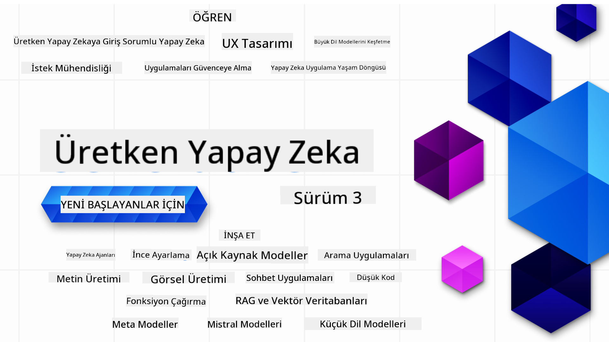

<!--
CO_OP_TRANSLATOR_METADATA:
{
  "original_hash": "ca2afa136ed9aca0634f39f51239746e",
  "translation_date": "2025-08-27T08:33:47+00:00",
  "source_file": "README.md",
  "language_code": "tr"
}
-->

### Üretken Yapay Zeka uygulamaları geliştirmeye başlamak için bilmeniz gereken her şeyi öğreten 21 Ders

  
  
  
  
  

  
  
  

### 🌐 Çok Dilli Destek

#### GitHub Action ile Destekleniyor (Otomatik ve Her Zaman Güncel)

[Fransızca](../fr/README.md) | [İspanyolca](../es/README.md) | [Almanca](../de/README.md) | [Rusça](../ru/README.md) | [Arapça](../ar/README.md) | [Farsça](../fa/README.md) | [Urduca](../ur/README.md) | [Çince (Basitleştirilmiş)](../zh/README.md) | [Çince (Geleneksel, Macau)](../mo/README.md) | [Çince (Geleneksel, Hong Kong)](../hk/README.md) | [Çince (Geleneksel, Tayvan)](../tw/README.md) | [Japonca](../ja/README.md) | [Korece](../ko/README.md) | [Hintçe](../hi/README.md) | [Bengalce](../bn/README.md) | [Marathi](../mr/README.md) | [Nepalce](../ne/README.md) | [Pencapça (Gurmukhi)](../pa/README.md) | [Portekizce (Portekiz)](../pt/README.md) | [Portekizce (Brezilya)](../br/README.md) | [İtalyanca](../it/README.md) | [Litvanca](../lt/README.md) | [Lehçe](../pl/README.md) | [Türkçe](./README.md) | [Yunanca](../el/README.md) | [Tayca](../th/README.md) | [İsveççe](../sv/README.md) | [Danca](../da/README.md) | [Norveççe](../no/README.md) | [Fince](../fi/README.md) | [Felemenkçe](../nl/README.md) | [İbranice](../he/README.md) | [Vietnamca](../vi/README.md) | [Endonezce](../id/README.md) | [Malayca](../ms/README.md) | [Tagalog (Filipince)](../tl/README.md) | [Swahili](../sw/README.md) | [Macarca](../hu/README.md) | [Çekçe](../cs/README.md) | [Slovakça](../sk/README.md) | [Romence](../ro/README.md) | [Bulgarca](../bg/README.md) | [Sırpça (Kiril)](../sr/README.md) | [Hırvatça](../hr/README.md) | [Slovence](../sl/README.md) | [Ukraynaca](../uk/README.md) | [Burmaca (Myanmar)](../my/README.md)

# Başlangıç Seviyesi için Üretken Yapay Zeka (Sürüm 3) - Bir Kurs

Microsoft Cloud Advocates tarafından hazırlanan 21 derslik kapsamlı kursumuzla Üretken Yapay Zeka uygulamaları geliştirme temellerini öğrenin.

## 🌱 Başlangıç

Bu kurs 21 dersten oluşmaktadır. Her ders kendi konusunu ele alır, bu yüzden istediğiniz yerden başlayabilirsiniz!

Dersler, Üretken Yapay Zeka kavramını açıklayan "Öğren" dersleri veya bir kavramı ve **Python** ve mümkün olduğunda **TypeScript** kod örneklerini açıklayan "Geliştir" dersleri olarak etiketlenmiştir.

.NET geliştiricileri için [Başlangıç Seviyesi için Üretken Yapay Zeka (.NET Sürümü)](https://github.com/microsoft/Generative-AI-for-beginners-dotnet?WT.mc_id=academic-105485-koreyst) kursuna göz atın!

Her ders ayrıca öğrenmeye devam etmeniz için ek araçlar içeren bir "Öğrenmeye Devam Et" bölümü içerir.

## İhtiyacınız Olanlar
### Bu kursun kodunu çalıştırmak için aşağıdakilerden birini kullanabilirsiniz: 
 - [Azure OpenAI Hizmeti](https://aka.ms/genai-beginners/azure-open-ai?WT.mc_id=academic-105485-koreyst) - **Dersler:** "aoai-assignment"  
 - [GitHub Marketplace Model Catalog](https://aka.ms/genai-beginners/gh-models?WT.mc_id=academic-105485-koreyst) - **Dersler:** "githubmodels"  
 - [OpenAI API](https://aka.ms/genai-beginners/open-ai?WT.mc_id=academic-105485-koreyst) - **Dersler:** "oai-assignment"  

- Python veya TypeScript hakkında temel bilgi faydalı olacaktır - \*Tamamen yeni başlayanlar için [Python](https://aka.ms/genai-beginners/python?WT.mc_id=academic-105485-koreyst) ve [TypeScript](https://aka.ms/genai-beginners/typescript?WT.mc_id=academic-105485-koreyst) kurslarına göz atın  
- Bu depoyu kendi GitHub hesabınıza [forklamak](https://aka.ms/genai-beginners/github?WT.mc_id=academic-105485-koreyst) için bir GitHub hesabı  

Geliştirme ortamınızı kurmanıza yardımcı olmak için bir **[Kurs Kurulumu](./00-course-setup/README.md?WT.mc_id=academic-105485-koreyst)** dersi oluşturduk.

Bu depoyu daha sonra kolayca bulabilmek için [yıldız (🌟) eklemeyi](https://docs.github.com/en/get-started/exploring-projects-on-github/saving-repositories-with-stars?WT.mc_id=academic-105485-koreyst) unutmayın.

## 🧠 Dağıtıma Hazır mısınız?

Daha gelişmiş kod örnekleri arıyorsanız, hem **Python** hem de **TypeScript** için [Üretken Yapay Zeka Kod Örnekleri koleksiyonumuza](https://aka.ms/genai-beg-code?WT.mc_id=academic-105485-koreyst) göz atın.

## 🗣️ Diğer Öğrencilerle Tanışın, Destek Alın

Bu kursu alan diğer öğrencilerle tanışmak ve ağ kurmak için [resmi Azure AI Foundry Discord sunucumuza](https://aka.ms/genai-discord?WT.mc_id=academic-105485-koreyst) katılın ve destek alın.

Sorular sorun veya ürün geri bildirimlerinizi [Azure AI Foundry Geliştirici Forumu](https://aka.ms/azureaifoundry/forum) üzerinden Github'da paylaşın.

## 🚀 Bir Startup mı Kuruyorsunuz?

Bugün Azure kredileriyle nasıl başlayacağınızı öğrenmek için [Microsoft for Startups](https://www.microsoft.com/startups) adresini ziyaret edin.

## 🙏 Yardımcı olmak ister misiniz?

Önerileriniz mi var veya yazım ya da kod hataları mı buldunuz? [Bir sorun bildirin](https://github.com/microsoft/generative-ai-for-beginners/issues?WT.mc_id=academic-105485-koreyst) veya [Bir çekme talebi oluşturun](https://github.com/microsoft/generative-ai-for-beginners/pulls?WT.mc_id=academic-105485-koreyst).

## 📂 Her ders şunları içerir:

- Konuya kısa bir video tanıtımı  
- README'de yer alan yazılı bir ders  
- Azure OpenAI ve OpenAI API'yi destekleyen Python ve TypeScript kod örnekleri  
- Öğrenmeye devam etmeniz için ekstra kaynaklara bağlantılar  

## 🗃️ Dersler

| #   | **Ders Bağlantısı**                                                                                                                          | **Açıklama**                                                                                     | **Video**                                                                   | **Ekstra Öğrenme**                                                             |
| --- | -------------------------------------------------------------------------------------------------------------------------------------------- | ----------------------------------------------------------------------------------------------- | --------------------------------------------------------------------------- | ------------------------------------------------------------------------------ |
| 00  | [Kurs Kurulumu](./00-course-setup/README.md?WT.mc_id=academic-105485-koreyst)                                                                 | **Öğren:** Geliştirme Ortamınızı Nasıl Kurarsınız                                                | Video Yakında                                                                 | [Daha Fazla Öğren](https://aka.ms/genai-collection?WT.mc_id=academic-105485-koreyst) |
| 01  | [Üretken Yapay Zeka ve LLM'lere Giriş](./01-introduction-to-genai/README.md?WT.mc_id=academic-105485-koreyst)                                 | **Öğren:** Üretken Yapay Zeka'nın ne olduğunu ve Büyük Dil Modellerinin (LLM'ler) nasıl çalıştığını anlayın. | [Video](https://aka.ms/gen-ai-lesson-1-gh?WT.mc_id=academic-105485-koreyst) | [Daha Fazla Öğren](https://aka.ms/genai-collection?WT.mc_id=academic-105485-koreyst) |
| 02  | [Farklı LLM'leri Keşfetmek ve Karşılaştırmak](./02-exploring-and-comparing-different-llms/README.md?WT.mc_id=academic-105485-koreyst)         | **Öğren:** Kullanım durumunuz için doğru modeli nasıl seçersiniz                                 | [Video](https://aka.ms/gen-ai-lesson2-gh?WT.mc_id=academic-105485-koreyst)  | [Daha Fazla Öğren](https://aka.ms/genai-collection?WT.mc_id=academic-105485-koreyst) |
| 03  | [Üretken Yapay Zeka'yı Sorumlu Şekilde Kullanmak](./03-using-generative-ai-responsibly/README.md?WT.mc_id=academic-105485-koreyst)            | **Öğren:** Üretken Yapay Zeka Uygulamalarını sorumlu bir şekilde nasıl oluşturursunuz            | [Video](https://aka.ms/gen-ai-lesson3-gh?WT.mc_id=academic-105485-koreyst)  | [Daha Fazla Öğren](https://aka.ms/genai-collection?WT.mc_id=academic-105485-koreyst) |
| 04  | [Prompt Mühendisliği Temellerini Anlamak](./04-prompt-engineering-fundamentals/README.md?WT.mc_id=academic-105485-koreyst)                   | **Öğren:** Uygulamalı Prompt Mühendisliği En İyi Uygulamaları                                   | [Video](https://aka.ms/gen-ai-lesson4-gh?WT.mc_id=academic-105485-koreyst)  | [Daha Fazla Öğren](https://aka.ms/genai-collection?WT.mc_id=academic-105485-koreyst) |
| 05  | [Gelişmiş Prompts Oluşturmak](./05-advanced-prompts/README.md?WT.mc_id=academic-105485-koreyst)                                               | **Öğren:** Prompts'lerinizin sonucunu iyileştiren prompt mühendisliği tekniklerini nasıl uygularsınız. | [Video](https://aka.ms/gen-ai-lesson5-gh?WT.mc_id=academic-105485-koreyst)  | [Daha Fazla Öğren](https://aka.ms/genai-collection?WT.mc_id=academic-105485-koreyst) |
| 06  | [Metin Üretim Uygulamaları Oluşturma](./06-text-generation-apps/README.md?WT.mc_id=academic-105485-koreyst)                                | **Oluştur:** Azure OpenAI / OpenAI API kullanarak bir metin üretim uygulaması oluşturun                                | [Video](https://aka.ms/gen-ai-lesson6-gh?WT.mc_id=academic-105485-koreyst)  | [Daha Fazla Bilgi](https://aka.ms/genai-collection?WT.mc_id=academic-105485-koreyst) |
| 07  | [Sohbet Uygulamaları Oluşturma](./07-building-chat-applications/README.md?WT.mc_id=academic-105485-koreyst)                                     | **Oluştur:** Sohbet uygulamalarını verimli bir şekilde oluşturma ve entegre etme teknikleri.               | [Video](https://aka.ms/gen-ai-lessons7-gh?WT.mc_id=academic-105485-koreyst) | [Daha Fazla Bilgi](https://aka.ms/genai-collection?WT.mc_id=academic-105485-koreyst) |
| 08  | [Arama Uygulamaları ve Vektör Veritabanları Oluşturma](./08-building-search-applications/README.md?WT.mc_id=academic-105485-koreyst)                        | **Oluştur:** Verileri aramak için Embeddings kullanan bir arama uygulaması.                        | [Video](https://aka.ms/gen-ai-lesson8-gh?WT.mc_id=academic-105485-koreyst)  | [Daha Fazla Bilgi](https://aka.ms/genai-collection?WT.mc_id=academic-105485-koreyst) |
| 09  | [Görüntü Üretim Uygulamaları Oluşturma](./09-building-image-applications/README.md?WT.mc_id=academic-105485-koreyst)                        | **Oluştur:** Bir görüntü üretim uygulaması                                                       | [Video](https://aka.ms/gen-ai-lesson9-gh?WT.mc_id=academic-105485-koreyst)  | [Daha Fazla Bilgi](https://aka.ms/genai-collection?WT.mc_id=academic-105485-koreyst) |
| 10  | [Düşük Kodlu Yapay Zeka Uygulamaları Oluşturma](./10-building-low-code-ai-applications/README.md?WT.mc_id=academic-105485-koreyst)                       | **Oluştur:** Düşük Kod araçlarını kullanarak bir Üretken Yapay Zeka uygulaması                                     | [Video](https://aka.ms/gen-ai-lesson10-gh?WT.mc_id=academic-105485-koreyst) | [Daha Fazla Bilgi](https://aka.ms/genai-collection?WT.mc_id=academic-105485-koreyst) |
| 11  | [Harici Uygulamaları Fonksiyon Çağrımı ile Entegre Etme](./11-integrating-with-function-calling/README.md?WT.mc_id=academic-105485-koreyst) | **Oluştur:** Fonksiyon çağrımının ne olduğunu ve uygulamalar için kullanım alanlarını öğrenin                          | [Video](https://aka.ms/gen-ai-lesson11-gh?WT.mc_id=academic-105485-koreyst) | [Daha Fazla Bilgi](https://aka.ms/genai-collection?WT.mc_id=academic-105485-koreyst) |
| 12  | [Yapay Zeka Uygulamaları için UX Tasarımı](./12-designing-ux-for-ai-applications/README.md?WT.mc_id=academic-105485-koreyst)                         | **Öğrenin:** Üretken Yapay Zeka Uygulamaları geliştirirken UX tasarım prensiplerini nasıl uygulayacağınızı öğrenin         | [Video](https://aka.ms/gen-ai-lesson12-gh?WT.mc_id=academic-105485-koreyst) | [Daha Fazla Bilgi](https://aka.ms/genai-collection?WT.mc_id=academic-105485-koreyst) |
| 13  | [Üretken Yapay Zeka Uygulamalarınızı Güvenceye Almak](./13-securing-ai-applications/README.md?WT.mc_id=academic-105485-koreyst)                         | **Öğrenin:** Yapay zeka sistemlerine yönelik tehditler ve riskler ile bu sistemleri güvenceye alma yöntemlerini öğrenin.             | [Video](https://aka.ms/gen-ai-lesson13-gh?WT.mc_id=academic-105485-koreyst) | [Daha Fazla Bilgi](https://aka.ms/genai-collection?WT.mc_id=academic-105485-koreyst) |
| 14  | [Üretken Yapay Zeka Uygulama Yaşam Döngüsü](./14-the-generative-ai-application-lifecycle/README.md?WT.mc_id=academic-105485-koreyst)           | **Öğrenin:** LLM Yaşam Döngüsünü ve LLMOps'u yönetmek için kullanılan araçlar ve metrikler                         | [Video](https://aka.ms/gen-ai-lesson14-gh?WT.mc_id=academic-105485-koreyst) | [Daha Fazla Bilgi](https://aka.ms/genai-collection?WT.mc_id=academic-105485-koreyst) |
| 15  | [Retrieval Augmented Generation (RAG) ve Vektör Veritabanları](./15-rag-and-vector-databases/README.md?WT.mc_id=academic-105485-koreyst)        | **Oluştur:** RAG Çerçevesini kullanarak bir uygulama oluşturun ve Vektör Veritabanlarından embeddings alın.  | [Video](https://aka.ms/gen-ai-lesson15-gh?WT.mc_id=academic-105485-koreyst) | [Daha Fazla Bilgi](https://aka.ms/genai-collection?WT.mc_id=academic-105485-koreyst) |
| 16  | [Açık Kaynak Modeller ve Hugging Face](./16-open-source-models/README.md?WT.mc_id=academic-105485-koreyst)                                    | **Oluştur:** Hugging Face üzerinde bulunan açık kaynak modelleri kullanarak bir uygulama oluşturun                    | [Video](https://aka.ms/gen-ai-lesson16-gh?WT.mc_id=academic-105485-koreyst) | [Daha Fazla Bilgi](https://aka.ms/genai-collection?WT.mc_id=academic-105485-koreyst) |
| 17  | [Yapay Zeka Ajanları](./17-ai-agents/README.md?WT.mc_id=academic-105485-koreyst)                                                                       | **Oluştur:** Bir Yapay Zeka Ajanı Çerçevesi kullanarak bir uygulama oluşturun                                           | [Video](https://aka.ms/gen-ai-lesson17-gh?WT.mc_id=academic-105485-koreyst) | [Daha Fazla Bilgi](https://aka.ms/genai-collection?WT.mc_id=academic-105485-koreyst) |
| 18  | [LLM'leri İnce Ayarlama](./18-fine-tuning/README.md?WT.mc_id=academic-105485-koreyst)                                                              | **Öğrenin:** LLM'leri ince ayarlamanın ne olduğunu, neden gerekli olduğunu ve nasıl yapılacağını öğrenin                                            | [Video](https://aka.ms/gen-ai-lesson18-gh?WT.mc_id=academic-105485-koreyst) | [Daha Fazla Bilgi](https://aka.ms/genai-collection?WT.mc_id=academic-105485-koreyst) |
| 19  | [SLM'lerle Uygulama Geliştirme](./19-slm/README.md?WT.mc_id=academic-105485-koreyst)                                                              | **Öğrenin:** Küçük Dil Modelleri ile uygulama geliştirmenin avantajlarını öğrenin                                            | Video Yakında | [Daha Fazla Bilgi](https://aka.ms/genai-collection?WT.mc_id=academic-105485-koreyst) |
| 20  | [Mistral Modelleri ile Uygulama Geliştirme](./20-mistral/README.md?WT.mc_id=academic-105485-koreyst)                                                              | **Öğrenin:** Mistral Aile Modellerinin özelliklerini ve farklılıklarını öğrenin                                           | Video Yakında | [Daha Fazla Bilgi](https://aka.ms/genai-collection?WT.mc_id=academic-105485-koreyst) |
| 21  | [Meta Modelleri ile Uygulama Geliştirme](./21-meta/README.md?WT.mc_id=academic-105485-koreyst)                                                              | **Öğrenin:** Meta Aile Modellerinin özelliklerini ve farklılıklarını öğrenin                                           | Video Yakında | [Daha Fazla Bilgi](https://aka.ms/genai-collection?WT.mc_id=academic-105485-koreyst) |

### 🌟 Özel Teşekkürler

GitHub Actions ve iş akışlarını oluşturan [**John Aziz**](https://www.linkedin.com/in/john0isaac/) için özel teşekkürler.

Her dersin öğrenme ve kod deneyimini geliştirmek için önemli katkılarda bulunan [**Bernhard Merkle**](https://www.linkedin.com/in/bernhard-merkle-738b73/) için özel teşekkürler.

## 🎒 Diğer Kurslar

Ekibimiz başka kurslar da üretiyor! Şunlara göz atın:

- [**YENİ** Model Context Protocol for Beginners](https://github.com/microsoft/mcp-for-beginners)
- [AI Agents for Beginners](https://github.com/microsoft/ai-agents-for-beginners)
- [Generative AI for Beginners using .NET](https://github.com/microsoft/Generative-AI-for-beginners-dotnet)
- [Generative AI for Beginners using JavaScript](https://aka.ms/genai-js-course)
- [Generative AI for Beginners using Java](https://aka.ms/genaijava)
- [ML for Beginners](https://aka.ms/ml-beginners)
- [Data Science for Beginners](https://aka.ms/datascience-beginners)
- [AI for Beginners](https://aka.ms/ai-beginners)
- [Cybersecurity for Beginners](https://github.com/microsoft/Security-101)
- [Web Dev for Beginners](https://aka.ms/webdev-beginners)
- [IoT for Beginners](https://aka.ms/iot-beginners)
- [XR Development for Beginners](https://github.com/microsoft/xr-development-for-beginners)
- [Mastering GitHub Copilot for AI Paired Programming](https://aka.ms/GitHubCopilotAI)
- [Mastering GitHub Copilot for C#/.NET Developers](https://github.com/microsoft/mastering-github-copilot-for-dotnet-csharp-developers)
- [Choose Your Own Copilot Adventure](https://github.com/microsoft/CopilotAdventures)

---

**Feragatname**:  
Bu belge, [Co-op Translator](https://github.com/Azure/co-op-translator) adlı yapay zeka çeviri hizmeti kullanılarak çevrilmiştir. Doğruluk için çaba göstersek de, otomatik çevirilerin hata veya yanlışlıklar içerebileceğini lütfen unutmayın. Belgenin orijinal dili, yetkili kaynak olarak kabul edilmelidir. Kritik bilgiler için profesyonel insan çevirisi önerilir. Bu çevirinin kullanımından kaynaklanan yanlış anlamalar veya yanlış yorumlamalardan sorumlu değiliz.