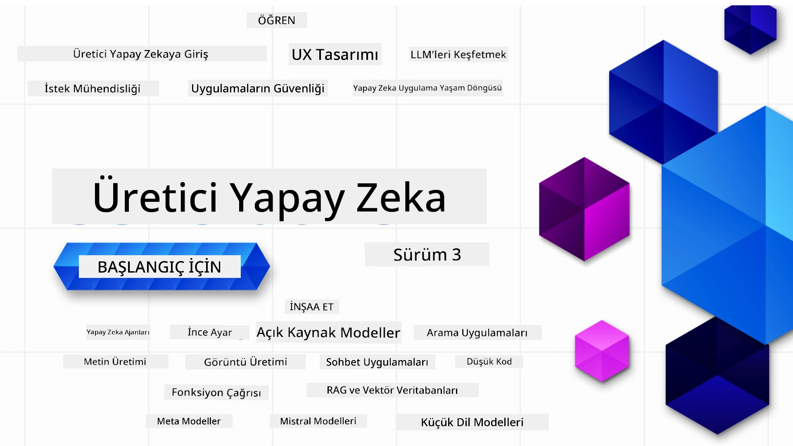

### Üretken Yapay Zeka uygulamaları geliştirmeye başlamak için bilmeniz gereken her şeyi öğreten 21 Ders

[](https://github.com/microsoft/Generative-AI-For-Beginners/blob/master/LICENSE?WT.mc_id=academic-105485-koreyst)
[](https://GitHub.com/microsoft/Generative-AI-For-Beginners/graphs/contributors/?WT.mc_id=academic-105485-koreyst)
[](https://GitHub.com/microsoft/Generative-AI-For-Beginners/issues/?WT.mc_id=academic-105485-koreyst)
[](https://GitHub.com/microsoft/Generative-AI-For-Beginners/pulls/?WT.mc_id=academic-105485-koreyst)
[](http://makeapullrequest.com?WT.mc_id=academic-105485-koreyst)

[](https://GitHub.com/microsoft/Generative-AI-For-Beginners/watchers/?WT.mc_id=academic-105485-koreyst)
[](https://GitHub.com/microsoft/Generative-AI-For-Beginners/network/?WT.mc_id=academic-105485-koreyst)
[](https://GitHub.com/microsoft/Generative-AI-For-Beginners/stargazers/?WT.mc_id=academic-105485-koreyst)

[](https://discord.gg/nTYy5BXMWG)

### 🌐 Çok Dilli Destek

#### GitHub Action aracılığıyla desteklenmektedir (Otomatik ve Her Zaman Güncel)

<!-- CO-OP TRANSLATOR LANGUAGES TABLE START -->
[Arapça](../ar/README.md) | [Bengalce](../bn/README.md) | [Bulgarca](../bg/README.md) | [Birmanca (Myanmar)](../my/README.md) | [Çince (Basitleştirilmiş)](../zh-CN/README.md) | [Çince (Geleneksel, Hong Kong)](../zh-HK/README.md) | [Çince (Geleneksel, Makao)](../zh-MO/README.md) | [Çince (Geleneksel, Tayvan)](../zh-TW/README.md) | [Hırvatça](../hr/README.md) | [Çekçe](../cs/README.md) | [Danca](../da/README.md) | [Flemenkçe](../nl/README.md) | [Estonca](../et/README.md) | [Fince](../fi/README.md) | [Fransızca](../fr/README.md) | [Almanca](../de/README.md) | [Yunanca](../el/README.md) | [İbranice](../he/README.md) | [Hintçe](../hi/README.md) | [Macarca](../hu/README.md) | [Endonezyaca](../id/README.md) | [İtalyanca](../it/README.md) | [Japonca](../ja/README.md) | [Kannada](../kn/README.md) | [Khmer](../km/README.md) | [Korece](../ko/README.md) | [Litvanca](../lt/README.md) | [Malayca](../ms/README.md) | [Malayalamca](../ml/README.md) | [Marathi](../mr/README.md) | [Nepalce](../ne/README.md) | [Nijerya Pidgin](../pcm/README.md) | [Norveççe](../no/README.md) | [Farsça (Persian)](../fa/README.md) | [Lehçe](../pl/README.md) | [Portekizce (Brezilya)](../pt-BR/README.md) | [Portekizce (Portekiz)](../pt-PT/README.md) | [Pencapça (Gurmukhi)](../pa/README.md) | [Rumence](../ro/README.md) | [Rusça](../ru/README.md) | [Sırpça (Kiril)](../sr/README.md) | [Slovakça](../sk/README.md) | [Slovence](../sl/README.md) | [İspanyolca](../es/README.md) | [Svahili](../sw/README.md) | [İsveççe](../sv/README.md) | [Tagalog (Filipinler)](../tl/README.md) | [Tamilce](../ta/README.md) | [Telugu](../te/README.md) | [Tayca](../th/README.md) | [Türkçe](./README.md) | [Ukraynaca](../uk/README.md) | [Urduca](../ur/README.md) | [Vietnamca](../vi/README.md)

> **Yerel Olarak Klonlamayı Tercih Ediyor musunuz?**
>
> Bu depo 50'den fazla dil çevirisi içerir ve bu, indirme boyutunu önemli ölçüde artırır. Çeviriler olmadan klonlamak için "sparse checkout" kullanabilirsiniz:
>
> **Bash / macOS / Linux:**
> ```bash
> git clone --filter=blob:none --sparse https://github.com/microsoft/generative-ai-for-beginners.git
> cd generative-ai-for-beginners
> git sparse-checkout set --no-cone '/*' '!translations' '!translated_images'
> ```
>
> **CMD (Windows):**
> ```cmd
> git clone --filter=blob:none --sparse https://github.com/microsoft/generative-ai-for-beginners.git
> cd generative-ai-for-beginners
> git sparse-checkout set --no-cone "/*" "!translations" "!translated_images"
> ```
>
> Bu, kursu tamamlamak için ihtiyacınız olan her şeyi daha hızlı indirme ile sağlar.
<!-- CO-OP TRANSLATOR LANGUAGES TABLE END -->

# Başlayanlar için Üretken Yapay Zeka (Sürüm 3) - Bir Kurs

Microsoft Cloud Advocates tarafından hazırlanmış, Üretken Yapay Zeka uygulamaları geliştirme temellerini öğreten 21 derslik kapsamlı kursumuz ile öğrenin.

## 🌱 Başlarken

Bu kursta 21 ders bulunmaktadır. Her ders kendi konusunu kapsar, istediğiniz yerden başlayabilirsiniz!

Dersler ya bir Üretken Yapay Zeka kavramını açıklayan "Öğren" ya da kavramı ve mümkünse **Python** ve **TypeScript** dillerinde kod örnekleri veren "Oluştur" dersleri olarak etiketlenmiştir.

.NET geliştiricileri için [Başlayanlar için Üretken Yapay Zeka (.NET Sürümü)](https://github.com/microsoft/Generative-AI-for-beginners-dotnet?WT.mc_id=academic-105485-koreyst) bağlantısını kontrol edin!

Her ders ayrıca ek öğrenim araçları içeren "Öğrenmeye Devam Et" bölümü içerir.

## Gerekenler
### Bu kursun kodlarını çalıştırmak için aşağıdakilerden birini kullanabilirsiniz: 
 - [Azure OpenAI Service](https://aka.ms/genai-beginners/azure-open-ai?WT.mc_id=academic-105485-koreyst) - **Dersler:** "aoai-assignment"
 - [GitHub Marketplace Model Catalog](https://aka.ms/genai-beginners/gh-models?WT.mc_id=academic-105485-koreyst) - **Dersler:** "githubmodels"
 - [OpenAI API](https://aka.ms/genai-beginners/open-ai?WT.mc_id=academic-105485-koreyst) - **Dersler:** "oai-assignment" 
   
- Python veya TypeScript temel bilgisi faydalıdır - \*Yeni başlayanlar için bu [Python](https://aka.ms/genai-beginners/python?WT.mc_id=academic-105485-koreyst) ve [TypeScript](https://aka.ms/genai-beginners/typescript?WT.mc_id=academic-105485-koreyst) kurslarını inceleyin
- Bu deposunu GitHub hesabınıza [fork etmek için bir GitHub hesabı](https://aka.ms/genai-beginners/github?WT.mc_id=academic-105485-koreyst)

Geliştirme ortamınızı hazırlamanıza yardımcı olmak için bir **[Kurs Kurulumu](./00-course-setup/README.md?WT.mc_id=academic-105485-koreyst)** dersi oluşturduk.

Daha sonra kolay bulabilmek için bu depoya [yıldız (🌟) vermeyi](https://docs.github.com/en/get-started/exploring-projects-on-github/saving-repositories-with-stars?WT.mc_id=academic-105485-koreyst) unutmayın.

## 🧠 Dağıtıma Hazır mısınız?

Daha gelişmiş kod örnekleri arıyorsanız, hem **Python** hem de **TypeScript** dillerinde [Üretken AI Kod Örnekleri koleksiyonumuza](https://aka.ms/genai-beg-code?WT.mc_id=academic-105485-koreyst) göz atın.

## 🗣️ Diğer Öğrenenlerle Tanışın, Destek Alın

Bu kursu alan diğer öğrenenlerle tanışmak ve destek almak için [resmi Azure AI Foundry Discord sunucumuza](https://aka.ms/genai-discord?WT.mc_id=academic-105485-koreyst) katılın.

Sorularınızı sorun veya ürün geri bildiriminizi GitHub'daki [Azure AI Foundry Geliştirici Forumu](https://aka.ms/azureaifoundry/forum) üzerinden paylaşın.

## 🚀 Bir Startup mı Kuruyorsunuz?

Bugün Azure kredileriyle nasıl başlayacağınızı öğrenmek için [Microsoft for Startups](https://www.microsoft.com/startups) sitesini ziyaret edin.

## 🙏 Yardımcı olmak ister misiniz?

Önerileriniz veya yazım ya da kod hataları bulduysanız [Konuyu açın](https://github.com/microsoft/generative-ai-for-beginners/issues?WT.mc_id=academic-105485-koreyst) ya da [Çekme isteği oluşturun](https://github.com/microsoft/generative-ai-for-beginners/pulls?WT.mc_id=academic-105485-koreyst)

## 📂 Her ders şunları içerir:

- Konuya kısa video giriş
- README'de yazılı ders
- Azure OpenAI ve OpenAI API destekleyen Python ve TypeScript kod örnekleri
- Öğrenmeye devam etmek için ekstra kaynak bağlantıları

## 🗃️ Dersler

| #   | **Ders Bağlantısı**                                                                                                                              | **Açıklama**                                                                                 | **Video**                                                                   | **Ekstra Öğrenme**                                                             |
| --- | -------------------------------------------------------------------------------------------------------------------------------------------- | ----------------------------------------------------------------------------------------------- | --------------------------------------------------------------------------- | ------------------------------------------------------------------------------ |
| 00  | [Kurs Kurulumu](./00-course-setup/README.md?WT.mc_id=academic-105485-koreyst)                                                                 | **Öğren:** Geliştirme Ortamınızı Nasıl Kurarsınız                                            | Video Yakında                                                                 | [Daha Fazla Öğren](https://aka.ms/genai-collection?WT.mc_id=academic-105485-koreyst) |
| 01  | [Üretken AI ve Büyük Dil Modellerine Giriş](./01-introduction-to-genai/README.md?WT.mc_id=academic-105485-koreyst)                              | **Öğren:** Üretken AI'nin ne olduğunu ve Büyük Dil Modellerinin (LLM) nasıl çalıştığını anlamak       | [Video](https://aka.ms/gen-ai-lesson-1-gh?WT.mc_id=academic-105485-koreyst) | [Daha Fazla Öğren](https://aka.ms/genai-collection?WT.mc_id=academic-105485-koreyst) |
| 02  | [Farklı LLM'leri Keşfetmek ve Karşılaştırmak](./02-exploring-and-comparing-different-llms/README.md?WT.mc_id=academic-105485-koreyst)             | **Öğren:** Kullanım durumunuz için doğru modeli nasıl seçersiniz                                | [Video](https://aka.ms/gen-ai-lesson2-gh?WT.mc_id=academic-105485-koreyst)  | [Daha Fazla Öğren](https://aka.ms/genai-collection?WT.mc_id=academic-105485-koreyst) |
| 03  | [Üretken AI'yi Sorumlu Bir Şekilde Kullanmak](./03-using-generative-ai-responsibly/README.md?WT.mc_id=academic-105485-koreyst)                           | **Öğren:** Üretken AI Uygulamaları nasıl sorumlu bir şekilde geliştirilir                         | [Video](https://aka.ms/gen-ai-lesson3-gh?WT.mc_id=academic-105485-koreyst)  | [Daha Fazla Öğren](https://aka.ms/genai-collection?WT.mc_id=academic-105485-koreyst) |
| 04  | [Prompt Mühendisliği Temellerini Anlama](./04-prompt-engineering-fundamentals/README.md?WT.mc_id=academic-105485-koreyst)             | **Öğren:** Uygulamalı Prompt Mühendisliği En İyi Uygulamaları                                           | [Video](https://aka.ms/gen-ai-lesson4-gh?WT.mc_id=academic-105485-koreyst)  | [Daha Fazla Bilgi](https://aka.ms/genai-collection?WT.mc_id=academic-105485-koreyst) |
| 05  | [Gelişmiş Promtlar Oluşturma](./05-advanced-prompts/README.md?WT.mc_id=academic-105485-koreyst)                                                | **Öğren:** Promtlarınızın sonucunu iyileştiren prompt mühendisliği tekniklerinin nasıl uygulanacağı. | [Video](https://aka.ms/gen-ai-lesson5-gh?WT.mc_id=academic-105485-koreyst)  | [Daha Fazla Bilgi](https://aka.ms/genai-collection?WT.mc_id=academic-105485-koreyst) |
| 06  | [Metin Üretimi Uygulamaları Oluşturma](./06-text-generation-apps/README.md?WT.mc_id=academic-105485-koreyst)                                | **Oluştur:** Azure OpenAI / OpenAI API kullanarak bir metin üretim uygulaması                                | [Video](https://aka.ms/gen-ai-lesson6-gh?WT.mc_id=academic-105485-koreyst)  | [Daha Fazla Bilgi](https://aka.ms/genai-collection?WT.mc_id=academic-105485-koreyst) |
| 07  | [Sohbet Uygulamaları Oluşturma](./07-building-chat-applications/README.md?WT.mc_id=academic-105485-koreyst)                                     | **Oluştur:** Sohbet uygulamalarını verimli bir şekilde oluşturma ve entegre etme teknikleri.               | [Video](https://aka.ms/gen-ai-lessons7-gh?WT.mc_id=academic-105485-koreyst) | [Daha Fazla Bilgi](https://aka.ms/genai-collection?WT.mc_id=academic-105485-koreyst) |
| 08  | [Arama Uygulamaları ve Vektör Veritabanları Oluşturma](./08-building-search-applications/README.md?WT.mc_id=academic-105485-koreyst)                        | **Oluştur:** Gömülü temsilleri kullanarak veri araması yapan bir arama uygulaması.                        | [Video](https://aka.ms/gen-ai-lesson8-gh?WT.mc_id=academic-105485-koreyst)  | [Daha Fazla Bilgi](https://aka.ms/genai-collection?WT.mc_id=academic-105485-koreyst) |
| 09  | [Görüntü Üretimi Uygulamaları Oluşturma](./09-building-image-applications/README.md?WT.mc_id=academic-105485-koreyst)                        | **Oluştur:** Bir görüntü üretim uygulaması                                                       | [Video](https://aka.ms/gen-ai-lesson9-gh?WT.mc_id=academic-105485-koreyst)  | [Daha Fazla Bilgi](https://aka.ms/genai-collection?WT.mc_id=academic-105485-koreyst) |
| 10  | [Düşük Kodlu AI Uygulamaları Oluşturma](./10-building-low-code-ai-applications/README.md?WT.mc_id=academic-105485-koreyst)                       | **Oluştur:** Düşük Kod araçları kullanarak Jeneratif AI uygulaması                                     | [Video](https://aka.ms/gen-ai-lesson10-gh?WT.mc_id=academic-105485-koreyst) | [Daha Fazla Bilgi](https://aka.ms/genai-collection?WT.mc_id=academic-105485-koreyst) |
| 11  | [Fonksiyon Çağırma ile Dış Uygulamaların Entegrasyonu](./11-integrating-with-function-calling/README.md?WT.mc_id=academic-105485-koreyst) | **Oluştur:** Fonksiyon çağırma nedir ve uygulamalar için kullanım alanları                          | [Video](https://aka.ms/gen-ai-lesson11-gh?WT.mc_id=academic-105485-koreyst) | [Daha Fazla Bilgi](https://aka.ms/genai-collection?WT.mc_id=academic-105485-koreyst) |
| 12  | [AI Uygulamaları için UX Tasarımı](./12-designing-ux-for-ai-applications/README.md?WT.mc_id=academic-105485-koreyst)                         | **Öğren:** Jeneratif AI Uygulamaları geliştirirken UX tasarım ilkelerinin nasıl uygulanacağı         | [Video](https://aka.ms/gen-ai-lesson12-gh?WT.mc_id=academic-105485-koreyst) | [Daha Fazla Bilgi](https://aka.ms/genai-collection?WT.mc_id=academic-105485-koreyst) |
| 13  | [Jeneratif AI Uygulamalarınızı Güvence Altına Alma](./13-securing-ai-applications/README.md?WT.mc_id=academic-105485-koreyst)                         | **Öğren:** AI sistemlerine yönelik tehditler ve riskler ile bu sistemlerin güvence altına alma yöntemleri.             | [Video](https://aka.ms/gen-ai-lesson13-gh?WT.mc_id=academic-105485-koreyst) | [Daha Fazla Bilgi](https://aka.ms/genai-collection?WT.mc_id=academic-105485-koreyst) |
| 14  | [Jeneratif AI Uygulama Yaşam Döngüsü](./14-the-generative-ai-application-lifecycle/README.md?WT.mc_id=academic-105485-koreyst)           | **Öğren:** LLM Yaşam Döngüsü ve LLMOps yönetmek için araçlar ve ölçütler                         | [Video](https://aka.ms/gen-ai-lesson14-gh?WT.mc_id=academic-105485-koreyst) | [Daha Fazla Bilgi](https://aka.ms/genai-collection?WT.mc_id=academic-105485-koreyst) |
| 15  | [Alma Artırılmış Jenerasyon (RAG) ve Vektör Veritabanları](./15-rag-and-vector-databases/README.md?WT.mc_id=academic-105485-koreyst)        | **Oluştur:** Vektör Veritabanlarından gömülüleri geri almak için RAG Çerçevesi kullanan bir uygulama  | [Video](https://aka.ms/gen-ai-lesson15-gh?WT.mc_id=academic-105485-koreyst) | [Daha Fazla Bilgi](https://aka.ms/genai-collection?WT.mc_id=academic-105485-koreyst) |
| 16  | [Açık Kaynak Modeller ve Hugging Face](./16-open-source-models/README.md?WT.mc_id=academic-105485-koreyst)                                    | **Oluştur:** Hugging Face'te bulunan açık kaynak modelleri kullanan bir uygulama                    | [Video](https://aka.ms/gen-ai-lesson16-gh?WT.mc_id=academic-105485-koreyst) | [Daha Fazla Bilgi](https://aka.ms/genai-collection?WT.mc_id=academic-105485-koreyst) |
| 17  | [AI Ajanları](./17-ai-agents/README.md?WT.mc_id=academic-105485-koreyst)                                                                       | **Oluştur:** Bir AI Ajanı Çerçevesi kullanan bir uygulama                                           | [Video](https://aka.ms/gen-ai-lesson17-gh?WT.mc_id=academic-105485-koreyst) | [Daha Fazla Bilgi](https://aka.ms/genai-collection?WT.mc_id=academic-105485-koreyst) |
| 18  | [LLM'leri İnce Ayar Yapma](./18-fine-tuning/README.md?WT.mc_id=academic-105485-koreyst)                                                              | **Öğren:** LLM'leri ince ayar yapmanın ne olduğu, neden ve nasıl yapıldığı                                            | [Video](https://aka.ms/gen-ai-lesson18-gh?WT.mc_id=academic-105485-koreyst) | [Daha Fazla Bilgi](https://aka.ms/genai-collection?WT.mc_id=academic-105485-koreyst) |
| 19  | [SLM'lerle Oluşturma](./19-slm/README.md?WT.mc_id=academic-105485-koreyst)                                                              | **Öğren:** Küçük Dil Modelleri ile oluşturmanın faydaları                                            | Video Yakında | [Daha Fazla Bilgi](https://aka.ms/genai-collection?WT.mc_id=academic-105485-koreyst) |
| 20  | [Mistral Modelleri ile Oluşturma](./20-mistral/README.md?WT.mc_id=academic-105485-koreyst)                                                              | **Öğren:** Mistral Aile Modellerinin özellikleri ve farklılıkları                                           | Video Yakında | [Daha Fazla Bilgi](https://aka.ms/genai-collection?WT.mc_id=academic-105485-koreyst) |
| 21  | [Meta Modelleri ile Oluşturma](./21-meta/README.md?WT.mc_id=academic-105485-koreyst)                                                              | **Öğren:** Meta Aile Modellerinin özellikleri ve farklılıkları                                           | Video Yakında | [Daha Fazla Bilgi](https://aka.ms/genai-collection?WT.mc_id=academic-105485-koreyst) |

### 🌟 Özel teşekkürler

Tüm GitHub Actions ve iş akışlarını oluşturduğu için [**John Aziz**](https://www.linkedin.com/in/john0isaac/)'e özel teşekkürler

Her ders için öğrenme ve kod deneyimini geliştiren önemli katkılar sağlayan [**Bernhard Merkle**](https://www.linkedin.com/in/bernhard-merkle-738b73/)'ye teşekkürler.

## 🎒 Diğer Kurslar

Ekibimiz başka kurslar da üretiyor! Göz atın:

<!-- CO-OP TRANSLATOR OTHER COURSES START -->
### LangChain
[](https://aka.ms/langchain4j-for-beginners)
[](https://aka.ms/langchainjs-for-beginners?WT.mc_id=m365-94501-dwahlin)
[](https://github.com/microsoft/langchain-for-beginners?WT.mc_id=m365-94501-dwahlin)
---

### Azure / Edge / MCP / Agents
[](https://github.com/microsoft/AZD-for-beginners?WT.mc_id=academic-105485-koreyst)
[](https://github.com/microsoft/edgeai-for-beginners?WT.mc_id=academic-105485-koreyst)
[](https://github.com/microsoft/mcp-for-beginners?WT.mc_id=academic-105485-koreyst)
[](https://github.com/microsoft/ai-agents-for-beginners?WT.mc_id=academic-105485-koreyst)

---
 
### Jeneratif AI Serisi
[](https://github.com/microsoft/generative-ai-for-beginners?WT.mc_id=academic-105485-koreyst)
[-9333EA?style=for-the-badge&labelColor=E5E7EB&color=9333EA)](https://github.com/microsoft/Generative-AI-for-beginners-dotnet?WT.mc_id=academic-105485-koreyst)
[-C084FC?style=for-the-badge&labelColor=E5E7EB&color=C084FC)](https://github.com/microsoft/generative-ai-for-beginners-java?WT.mc_id=academic-105485-koreyst)
[-E879F9?style=for-the-badge&labelColor=E5E7EB&color=E879F9)](https://github.com/microsoft/generative-ai-with-javascript?WT.mc_id=academic-105485-koreyst)

---
 
### Temel Öğrenme
[](https://aka.ms/ml-beginners?WT.mc_id=academic-105485-koreyst)
[](https://aka.ms/datascience-beginners?WT.mc_id=academic-105485-koreyst)
[](https://aka.ms/ai-beginners?WT.mc_id=academic-105485-koreyst)
[](https://github.com/microsoft/Security-101?WT.mc_id=academic-96948-sayoung)
[](https://aka.ms/webdev-beginners?WT.mc_id=academic-105485-koreyst)
[](https://aka.ms/iot-beginners?WT.mc_id=academic-105485-koreyst)
[](https://github.com/microsoft/xr-development-for-beginners?WT.mc_id=academic-105485-koreyst)

---
 
### Copilot Serisi
[](https://aka.ms/GitHubCopilotAI?WT.mc_id=academic-105485-koreyst)
[](https://github.com/microsoft/mastering-github-copilot-for-dotnet-csharp-developers?WT.mc_id=academic-105485-koreyst)
[](https://github.com/microsoft/CopilotAdventures?WT.mc_id=academic-105485-koreyst)
<!-- CO-OP TRANSLATOR OTHER COURSES END -->

## Yardım Almak

Yapay zeka uygulamaları geliştirirken takılırsanız veya herhangi bir sorunuz olursa. MCP hakkında tartışmalara katılmak için diğer öğrenenler ve deneyimli geliştiricilerle buluşun. Soruların hoş karşılandığı ve bilginin özgürce paylaşıldığı destekleyici bir topluluktur.

[](https://discord.gg/nTYy5BXMWG)

Ürün geribildirimi veya hata ile karşılaşırsanız lütfen ziyaret edin:

[](https://aka.ms/foundry/forum)

---

<!-- CO-OP TRANSLATOR DISCLAIMER START -->
**Feragatname**:  
Bu belge, AI çeviri hizmeti [Co-op Translator](https://github.com/Azure/co-op-translator) kullanılarak çevrilmiştir. Doğruluk için çaba göstermemize rağmen, otomatik çevirilerin hatalar veya yanlışlıklar içerebileceğini lütfen unutmayın. Orijinal belge, kendi ana dilinde yetkili kaynak olarak kabul edilmelidir. Kritik bilgiler için profesyonel insan çevirisi önerilir. Bu çevirinin kullanımı sonucunda ortaya çıkabilecek yanlış anlamalar veya yanlış yorumlamalar için sorumluluk kabul edilmemektedir.
<!-- CO-OP TRANSLATOR DISCLAIMER END -->