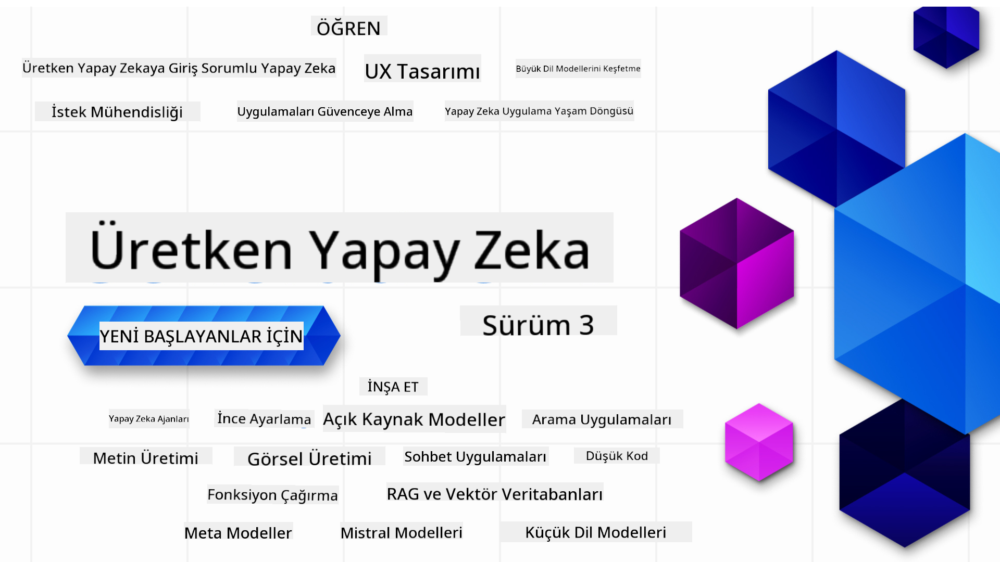

<!--
CO_OP_TRANSLATOR_METADATA:
{
  "original_hash": "6e3f4c8a4f323b8eab1cf11ded304b0f",
  "translation_date": "2025-06-25T07:56:04+00:00",
  "source_file": "README.md",
  "language_code": "tr"
}
-->

### Üretici Yapay Zeka uygulamaları oluşturmaya başlamak için bilmeniz gereken her şeyi öğreten 21 Ders

### 🌐 Çok Dilli Destek

#### GitHub Action ile Desteklenir (Otomatik ve Her Zaman Güncel)

# Başlangıç Seviyesi için Üretken Yapay Zeka (Sürüm 3) - Bir Kurs

Microsoft Cloud Advocates tarafından hazırlanan 21 derslik kapsamlı kursumuzla Üretken Yapay Zeka uygulamaları geliştirmeyi öğrenin.

## 🌱 Başlarken

Bu kurs 21 ders içerir. Her ders kendi konusunu ele alır, bu yüzden istediğiniz yerden başlayabilirsiniz!

Dersler, Üretken Yapay Zeka kavramını açıklayan "Öğren" dersleri veya mümkün olduğunda hem **Python** hem de **TypeScript** dilinde kavram ve kod örneklerini açıklayan "İnşa Et" dersleri olarak etiketlenmiştir.

.NET geliştiricileri için [Başlangıç Seviyesi için Üretken Yapay Zeka (.NET Sürümü)](https://github.com/microsoft/Generative-AI-for-beginners-dotnet?WT.mc_id=academic-105485-koreyst) göz atın!

Her ders ayrıca ek öğrenme araçları içeren bir "Öğrenmeye Devam Et" bölümü içerir.

## İhtiyacınız Olanlar
### Bu kursun kodunu çalıştırmak için aşağıdakilerden birini kullanabilirsiniz:
 - [Azure OpenAI Hizmeti](https://aka.ms/genai-beginners/azure-open-ai?WT.mc_id=academic-105485-koreyst) - **Dersler:** "aoai-assignment"
 - [GitHub Marketplace Model Kataloğu](https://aka.ms/genai-beginners/gh-models?WT.mc_id=academic-105485-koreyst) - **Dersler:** "githubmodels"
 - [OpenAI API](https://aka.ms/genai-beginners/open-ai?WT.mc_id=academic-105485-koreyst) - **Dersler:** "oai-assignment" 

- Python veya TypeScript hakkında temel bilgi faydalıdır - \*Tamamen yeni başlayanlar için bu [Python](https://aka.ms/genai-beginners/python?WT.mc_id=academic-105485-koreyst) ve [TypeScript](https://aka.ms/genai-beginners/typescript?WT.mc_id=academic-105485-koreyst) kurslarına göz atın
- Kendi GitHub hesabınıza [bu tüm depo](https://aka.ms/genai-beginners/github?WT.mc_id=academic-105485-koreyst) çatallanmak için bir GitHub hesabı

Geliştirme ortamınızı kurmanıza yardımcı olmak için bir **[Kurs Kurulumu](./00-course-setup/README.md?WT.mc_id=academic-105485-koreyst)** dersi oluşturduk.

Bu depoyu daha sonra kolayca bulmak için [bu depoyu yıldız (🌟) eklemeyi](https://docs.github.com/en/get-started/exploring-projects-on-github/saving-repositories-with-stars?WT.mc_id=academic-105485-koreyst) unutmayın.

## 🧠 Dağıtıma Hazır mısınız?

Daha gelişmiş kod örnekleri arıyorsanız, hem **Python** hem de **TypeScript** dilinde [Üretken Yapay Zeka Kod Örnekleri koleksiyonumuza](https://aka.ms/genai-beg-code?WT.mc_id=academic-105485-koreyst) göz atın.

## 🗣️ Diğer Öğrencilerle Tanışın, Destek Alın

Bu kursu alan diğer öğrencilerle tanışmak ve ağ kurmak için [resmi Azure AI Foundry Discord sunucumuza](https://aka.ms/genai-discord?WT.mc_id=academic-105485-koreyst) katılın ve destek alın.

Sorular sorun veya Github'daki [Azure AI Foundry Developer Forum](https://aka.ms/azureaifoundry/forum) üzerinden ürün geri bildirimlerinizi paylaşın.

## 🚀 Bir Girişim mi Kuruyorsunuz?

Azure OpenAI Hizmetleri aracılığıyla OpenAI modellerine erişim için **ücretsiz OpenAI kredileri** ve **Azure kredilerine kadar $150k** almak için [Microsoft for Startups Founders Hub](https://aka.ms/genai-foundershub?WT.mc_id=academic-105485-koreyst) kaydolun.

## 🙏 Yardım Etmek İster misiniz?

Önerileriniz var mı veya yazım ya da kod hataları mı buldunuz? [Bir sorun bildirin](https://github.com/microsoft/generative-ai-for-beginners/issues?WT.mc_id=academic-105485-koreyst) veya [Bir pull request oluşturun](https://github.com/microsoft/generative-ai-for-beginners/pulls?WT.mc_id=academic-105485-koreyst)

## 📂 Her ders şunları içerir:

- Konuya kısa bir video tanıtımı
- README dosyasında yer alan yazılı bir ders
- Azure OpenAI ve OpenAI API'yi destekleyen Python ve TypeScript kod örnekleri
- Öğrenmeye devam etmek için ekstra kaynaklara bağlantılar

## 🗃️ Dersler

| #   | **Ders Bağlantısı**                                                                                                                              | **Açıklama**                                                                                 | **Video**                                                                   | **Ekstra Öğrenme**                                                             |
| --- | -------------------------------------------------------------------------------------------------------------------------------------------- | ----------------------------------------------------------------------------------------------- | --------------------------------------------------------------------------- | ------------------------------------------------------------------------------ |
| 00  | [Kurs Kurulumu](./00-course-setup/README.md?WT.mc_id=academic-105485-koreyst)                                                                 | **Öğren:** Geliştirme Ortamınızı Nasıl Kuracağınızı Öğrenin                                            | Video Yakında                                                                 | [Daha Fazla Öğren](https://aka.ms/genai-collection?WT.mc_id=academic-105485-koreyst) |
| 01  | [Üretken Yapay Zeka ve LLM'lere Giriş](./01-introduction-to-genai/README.md?WT.mc_id=academic-105485-koreyst)                              | **Öğren:** Üretken Yapay Zeka'nın ne olduğunu ve Büyük Dil Modellerinin (LLM'ler) nasıl çalıştığını anlayın.       | [Video](https://aka.ms/gen-ai-lesson-1-gh?WT.mc_id=academic-105485-koreyst) | [Daha Fazla Öğren](https://aka.ms/genai-collection?WT.mc_id=academic-105485-koreyst) |
| 02  | [Farklı LLM'leri Keşfetme ve Karşılaştırma](./02-exploring-and-comparing-different-llms/README.md?WT.mc_id=academic-105485-koreyst)             | **Öğren:** Kullanım senaryonuz için doğru modeli nasıl seçeceğinizi öğrenin                                      | [Video](https://aka.ms/gen-ai-lesson2-gh?WT.mc_id=academic-105485-koreyst)  | [Daha Fazla Öğren](https://aka.ms/genai-collection?WT.mc_id=academic-105485-koreyst) |
| 03  | [Üretken Yapay Zeka'yı Sorumlu Bir Şekilde Kullanma](./03-using-generative-ai-responsibly/README.md?WT.mc_id=academic-105485-koreyst)                           | **Öğren:** Üretken Yapay Zeka Uygulamalarını sorumlu bir şekilde nasıl geliştireceğinizi öğrenin                                  | [Video](https://aka.ms/gen-ai-lesson3-gh?WT.mc_id=academic-105485-koreyst)  | [Daha Fazla Öğren](https://aka.ms/genai-collection?WT.mc_id=academic-105485-koreyst) |
| 04  | [Prompt Mühendisliği Temellerini Anlamak](./04-prompt-engineering-fundamentals/README.md?WT.mc_id=academic-105485-koreyst)             | **Öğren:** Uygulamalı Prompt Mühendisliği En İyi Uygulamaları                                           | [Video](https://aka.ms/gen-ai-lesson4-gh?WT.mc_id=academic-105485-koreyst)  | [Daha Fazla Öğren](https://aka.ms/genai-collection?WT.mc_id=academic-105485-koreyst) |
| 05  | [Gelişmiş İstemler Oluşturma](./05-advanced-prompts/README.md?WT.mc_id=academic-105485-koreyst)                                                | **Öğren:** İstemlerinizin sonucunu iyileştiren istem mühendisliği tekniklerini nasıl uygulayacağınızı öğrenin. | [Video](https://aka.ms/gen-ai-lesson5-gh?WT.mc_id=academic-105485-koreyst)  | [Daha Fazla Bilgi](https://aka.ms/genai-collection?WT.mc_id=academic-105485-koreyst) |
| 06  | [Metin Üretim Uygulamaları Oluşturma](./06-text-generation-apps/README.md?WT.mc_id=academic-105485-koreyst)                                | **Geliştir:** Azure OpenAI / OpenAI API kullanarak bir metin üretim uygulaması oluşturun                                | [Video](https://aka.ms/gen-ai-lesson6-gh?WT.mc_id=academic-105485-koreyst)  | [Daha Fazla Bilgi](https://aka.ms/genai-collection?WT.mc_id=academic-105485-koreyst) |
| 07  | [Sohbet Uygulamaları Oluşturma](./07-building-chat-applications/README.md?WT.mc_id=academic-105485-koreyst)                                     | **Geliştir:** Sohbet uygulamalarını verimli bir şekilde oluşturma ve entegre etme teknikleri.               | [Video](https://aka.ms/gen-ai-lessons7-gh?WT.mc_id=academic-105485-koreyst) | [Daha Fazla Bilgi](https://aka.ms/genai-collection?WT.mc_id=academic-105485-koreyst) |
| 08  | [Arama Uygulamaları Oluşturma Vektör Veritabanları](./08-building-search-applications/README.md?WT.mc_id=academic-105485-koreyst)                        | **Geliştir:** Verileri aramak için Gömülemeler kullanan bir arama uygulaması                        | [Video](https://aka.ms/gen-ai-lesson8-gh?WT.mc_id=academic-105485-koreyst)  | [Daha Fazla Bilgi](https://aka.ms/genai-collection?WT.mc_id=academic-105485-koreyst) |
| 09  | [Görüntü Üretim Uygulamaları Oluşturma](./09-building-image-applications/README.md?WT.mc_id=academic-105485-koreyst)                        | **Geliştir:** Bir görüntü üretim uygulaması                                                       | [Video](https://aka.ms/gen-ai-lesson9-gh?WT.mc_id=academic-105485-koreyst)  | [Daha Fazla Bilgi](https://aka.ms/genai-collection?WT.mc_id=academic-105485-koreyst) |
| 10  | [Düşük Kodlu AI Uygulamaları Oluşturma](./10-building-low-code-ai-applications/README.md?WT.mc_id=academic-105485-koreyst)                       | **Geliştir:** Düşük Kod araçları kullanarak bir Üretici AI uygulaması                                     | [Video](https://aka.ms/gen-ai-lesson10-gh?WT.mc_id=academic-105485-koreyst) | [Daha Fazla Bilgi](https://aka.ms/genai-collection?WT.mc_id=academic-105485-koreyst) |
| 11  | [Harici Uygulamaları İşlev Çağrısı ile Entegre Etme](./11-integrating-with-function-calling/README.md?WT.mc_id=academic-105485-koreyst) | **Geliştir:** İşlev çağrısının ne olduğu ve uygulamalar için kullanım durumları                          | [Video](https://aka.ms/gen-ai-lesson11-gh?WT.mc_id=academic-105485-koreyst) | [Daha Fazla Bilgi](https://aka.ms/genai-collection?WT.mc_id=academic-105485-koreyst) |
| 12  | [AI Uygulamaları için UX Tasarımı](./12-designing-ux-for-ai-applications/README.md?WT.mc_id=academic-105485-koreyst)                         | **Öğren:** Üretici AI Uygulamaları geliştirirken UX tasarım ilkelerini nasıl uygulayacağınızı öğrenin         | [Video](https://aka.ms/gen-ai-lesson12-gh?WT.mc_id=academic-105485-koreyst) | [Daha Fazla Bilgi](https://aka.ms/genai-collection?WT.mc_id=academic-105485-koreyst) |
| 13  | [Üretici AI Uygulamalarınızı Güvenceye Alma](./13-securing-ai-applications/README.md?WT.mc_id=academic-105485-koreyst)                         | **Öğren:** AI sistemlerine yönelik tehditler ve riskler ile bu sistemleri güvence altına alma yöntemleri.             | [Video](https://aka.ms/gen-ai-lesson13-gh?WT.mc_id=academic-105485-koreyst) | [Daha Fazla Bilgi](https://aka.ms/genai-collection?WT.mc_id=academic-105485-koreyst) |
| 14  | [Üretici AI Uygulama Yaşam Döngüsü](./14-the-generative-ai-application-lifecycle/README.md?WT.mc_id=academic-105485-koreyst)           | **Öğren:** LLM Yaşam Döngüsünü ve LLMOps'u yönetmek için araçlar ve metrikler                         | [Video](https://aka.ms/gen-ai-lesson14-gh?WT.mc_id=academic-105485-koreyst) | [Daha Fazla Bilgi](https://aka.ms/genai-collection?WT.mc_id=academic-105485-koreyst) |
| 15  | [Retrieval Augmented Generation (RAG) ve Vektör Veritabanları](./15-rag-and-vector-databases/README.md?WT.mc_id=academic-105485-koreyst)        | **İnşa Et:** Vektör Veritabanlarından gömüleri almak için bir RAG Çerçevesi kullanarak bir uygulama geliştirin  | [Video](https://aka.ms/gen-ai-lesson15-gh?WT.mc_id=academic-105485-koreyst) | [Daha Fazla Bilgi](https://aka.ms/genai-collection?WT.mc_id=academic-105485-koreyst) |
| 16  | [Açık Kaynak Modeller ve Hugging Face](./16-open-source-models/README.md?WT.mc_id=academic-105485-koreyst)                                    | **İnşa Et:** Hugging Face'de mevcut olan açık kaynak modeller kullanarak bir uygulama geliştirin                    | [Video](https://aka.ms/gen-ai-lesson16-gh?WT.mc_id=academic-105485-koreyst) | [Daha Fazla Bilgi](https://aka.ms/genai-collection?WT.mc_id=academic-105485-koreyst) |
| 17  | [AI Ajanları](./17-ai-agents/README.md?WT.mc_id=academic-105485-koreyst)                                                                       | **İnşa Et:** Bir AI Ajan Çerçevesi kullanarak bir uygulama geliştirin                                           | [Video](https://aka.ms/gen-ai-lesson17-gh?WT.mc_id=academic-105485-koreyst) | [Daha Fazla Bilgi](https://aka.ms/genai-collection?WT.mc_id=academic-105485-koreyst) |
| 18  | [LLM'leri İnce Ayarlama](./18-fine-tuning/README.md?WT.mc_id=academic-105485-koreyst)                                                              | **Öğren:** LLM'leri ince ayarlamanın ne olduğu, neden ve nasıl yapılacağı                                            | [Video](https://aka.ms/gen-ai-lesson18-gh?WT.mc_id=academic-105485-koreyst) | [Daha Fazla Bilgi](https://aka.ms/genai-collection?WT.mc_id=academic-105485-koreyst) |
| 19  | [Küçük Dil Modelleri ile İnşa Etme](./19-slm/README.md?WT.mc_id=academic-105485-koreyst)                                                              | **Öğren:** Küçük Dil Modelleri ile inşa etmenin faydaları                                            | Video Yakında | [Daha Fazla Bilgi](https://aka.ms/genai-collection?WT.mc_id=academic-105485-koreyst) |
| 20  | [Mistral Modelleri ile İnşa Etme](./20-mistral/README.md?WT.mc_id=academic-105485-koreyst)                                                              | **Öğren:** Mistral Ailesi Modellerinin özellikleri ve farklılıkları                                           | Video Yakında | [Daha Fazla Bilgi](https://aka.ms/genai-collection?WT.mc_id=academic-105485-koreyst) |
| 21  | [Meta Modelleri ile İnşa Etme](./21-meta/README.md?WT.mc_id=academic-105485-koreyst)                                                              | **Öğren:** Meta Ailesi Modellerinin özellikleri ve farklılıkları                                           | Video Yakında | [Daha Fazla Bilgi](https://aka.ms/genai-collection?WT.mc_id=academic-105485-koreyst) |

### 🌟 Özel teşekkürler

GitHub Actions ve iş akışlarının tümünü oluşturan [**John Aziz**](https://www.linkedin.com/in/john0isaac/) için özel teşekkürler

Her dersin öğrenci ve kod deneyimini geliştirmek için önemli katkılarda bulunan [**Bernhard Merkle**](https://www.linkedin.com/in/bernhard-merkle-738b73/) için teşekkürler. 

## 🎒 Diğer Kurslar

Ekibimiz başka kurslar da üretiyor! İnceleyin:

- [**YENİ** Başlangıç Seviyesi için Model Bağlam Protokolü](https://github.com/microsoft/mcp-for-beginners?WT.mc_id=academic-105485-koreyst)
- [Başlangıç Seviyesi için AI Ajanları](https://github.com/microsoft/ai-agents-for-beginners?WT.mc_id=academic-105485-koreyst)
- [.NET kullanarak Başlangıç Seviyesi için Üretken AI](https://github.com/microsoft/Generative-AI-for-beginners-dotnet?WT.mc_id=academic-105485-koreyst)
- [JavaScript kullanarak Başlangıç Seviyesi için Üretken AI](https://aka.ms/genai-js-course?WT.mc_id=academic-105485-koreyst)
- [Başlangıç Seviyesi için ML](https://aka.ms/ml-beginners?WT.mc_id=academic-105485-koreyst)
- [Başlangıç Seviyesi için Veri Bilimi](https://aka.ms/datascience-beginners?WT.mc_id=academic-105485-koreyst)
- [Başlangıç Seviyesi için AI](https://aka.ms/ai-beginners?WT.mc_id=academic-105485-koreyst)
- [Başlangıç Seviyesi için Siber Güvenlik](https://github.com/microsoft/Security-101??WT.mc_id=academic-96948-sayoung)
- [Başlangıç Seviyesi için Web Geliştirme](https://aka.ms/webdev-beginners?WT.mc_id=academic-105485-koreyst)
- [Başlangıç Seviyesi için IoT](https://aka.ms/iot-beginners?WT.mc_id=academic-105485-koreyst)
- [Yeni Başlayanlar için XR Geliştirme](https://github.com/microsoft/xr-development-for-beginners?WT.mc_id=academic-105485-koreyst)
- [AI Eşli Programlama için GitHub Copilot'u Ustalaşmak](https://aka.ms/GitHubCopilotAI?WT.mc_id=academic-105485-koreyst)
- [C#/.NET Geliştiricileri için GitHub Copilot'u Ustalaşmak](https://github.com/microsoft/mastering-github-copilot-for-dotnet-csharp-developers?WT.mc_id=academic-105485-koreyst)
- [Kendi Copilot Maceranı Seç](https://github.com/microsoft/CopilotAdventures?WT.mc_id=academic-105485-koreyst)

**Feragatname**: 
Bu belge, AI çeviri hizmeti [Co-op Translator](https://github.com/Azure/co-op-translator) kullanılarak çevrilmiştir. Doğruluk için çaba göstersek de, otomatik çevirilerin hata veya yanlışlık içerebileceğini lütfen unutmayın. Orijinal belge, kendi dilinde yetkili kaynak olarak kabul edilmelidir. Kritik bilgiler için, profesyonel insan çevirisi önerilir. Bu çevirinin kullanımından doğabilecek yanlış anlama veya yanlış yorumlamalardan sorumlu değiliz.