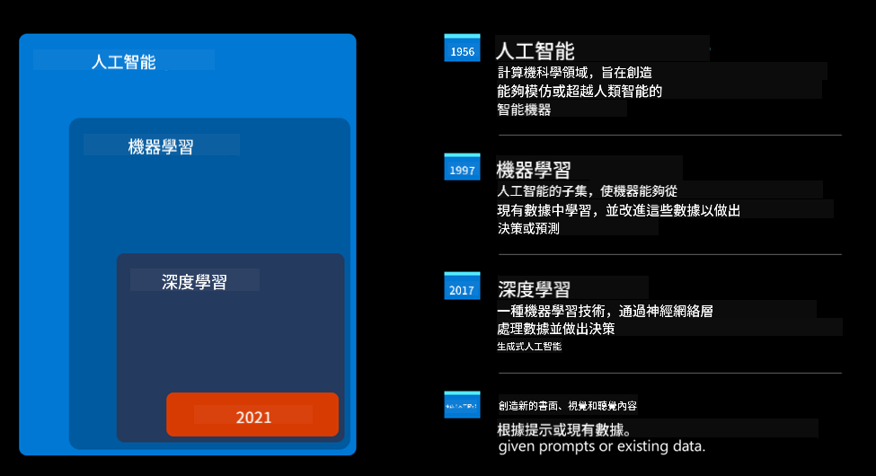
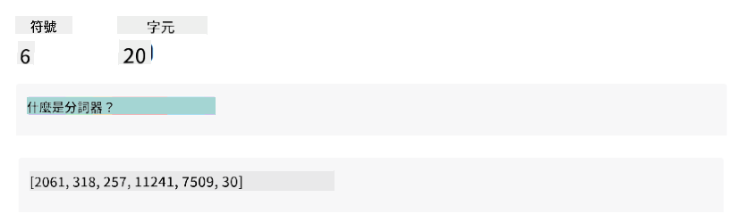
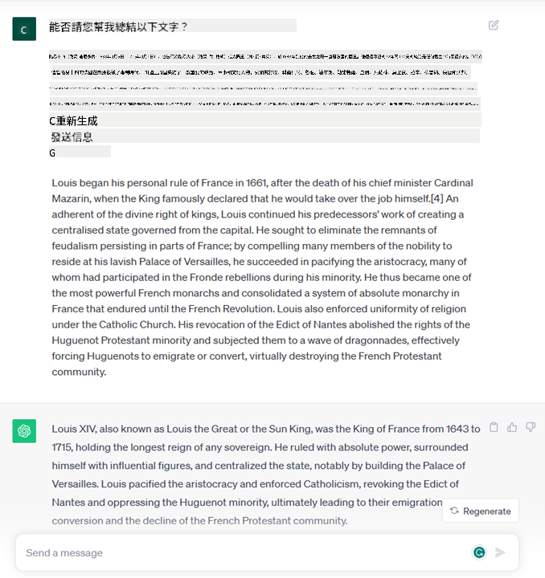
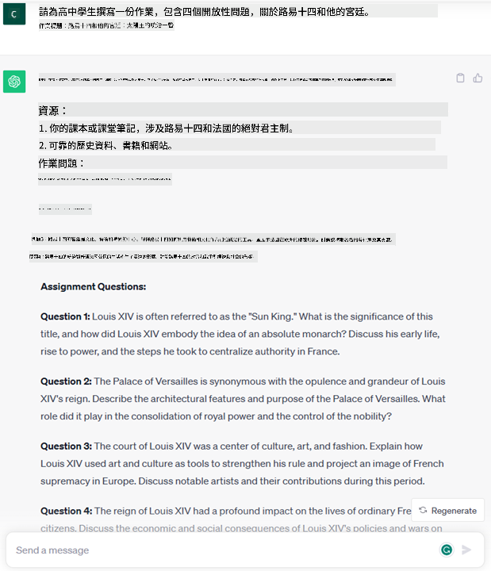
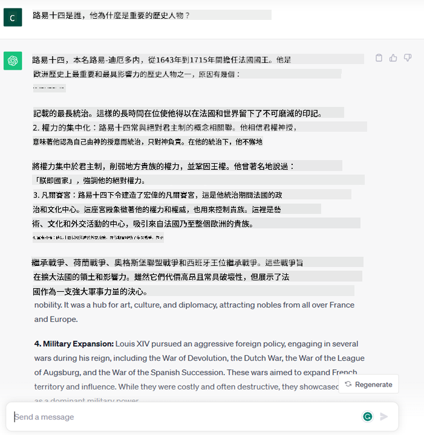
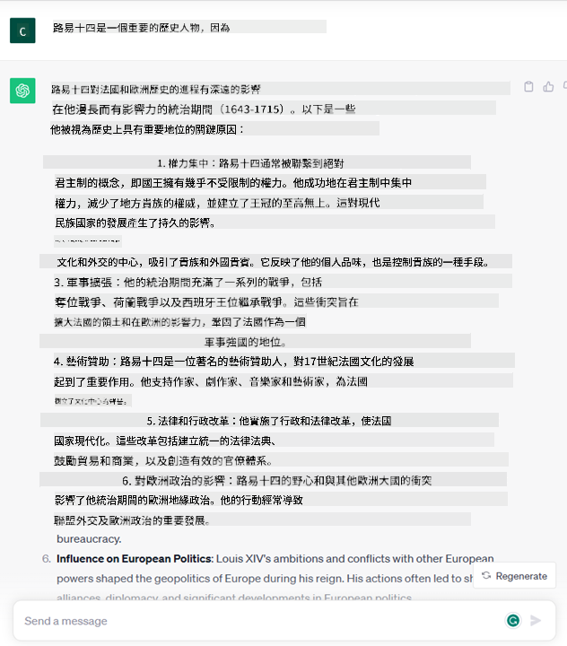
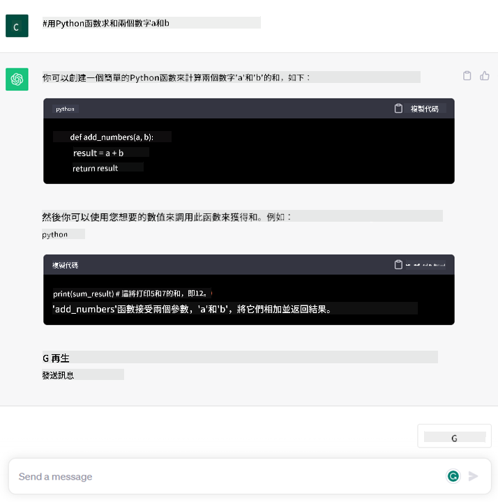

<!--
CO_OP_TRANSLATOR_METADATA:
{
  "original_hash": "f53ba0fa49164f9323043f1c6b11f2b1",
  "translation_date": "2025-05-19T09:12:12+00:00",
  "source_file": "01-introduction-to-genai/README.md",
  "language_code": "tw"
}
-->
# 生成式 AI 和大型语言模型简介

_(点击上面的图片查看本课的视频)_

生成式 AI 是一种能够生成文本、图像和其他类型内容的人工智能。它的奇妙之处在于它让 AI 变得大众化，任何人只需一个文本提示，一个自然语言的句子，就可以使用它。你不需要学习像 Java 或 SQL 这样的语言来完成有价值的事情，只需使用你的语言，说明你想要什么，AI 模型就会给出建议。其应用和影响巨大，你可以在几秒钟内撰写或理解报告、编写应用程序等等。

在本课程中，我们将探讨我们的初创公司如何利用生成式 AI 解锁教育领域的新场景，以及我们如何应对其应用带来的社会影响和技术限制的不可避免的挑战。

## 简介

本课将涵盖：

- 商业场景介绍：我们的初创公司理念和使命。
- 生成式 AI 及我们如何进入当前的技术环境。
- 大型语言模型的内部工作原理。
- 大型语言模型的主要功能和实际应用案例。

## 学习目标

完成本课后，你将了解：

- 什么是生成式 AI，以及大型语言模型如何工作。
- 如何利用大型语言模型进行不同的应用，特别是教育场景。

## 场景：我们的教育初创公司

生成式人工智能 (AI) 代表了 AI 技术的顶峰，突破了曾被认为不可能的界限。生成式 AI 模型有多种功能和应用，但在本课程中我们将探讨它如何通过一个虚构的初创公司革新教育。我们将把这个初创公司称为 _我们的初创公司_。我们的初创公司在教育领域工作，其雄心勃勃的使命宣言是

> _在全球范围内改善学习的可及性，确保公平的教育机会，并根据每位学习者的需求提供个性化学习体验_。

我们的初创团队意识到，如果不利用现代最强大的工具之一——大型语言模型 (LLM)，我们将无法实现这一目标。

生成式 AI 预计将改变我们今天的学习和教学方式，学生可以随时获得虚拟教师提供的大量信息和示例，而教师可以利用创新工具评估学生并给予反馈。

首先，让我们定义一些我们将在整个课程中使用的基本概念和术语。

## 我们如何获得生成式 AI？

尽管最近生成式 AI 模型的宣布引起了极大的 _炒作_，但这项技术已经有数十年的发展历史，最早的研究努力可以追溯到60年代。我们现在处于一个 AI 具有类似人类认知能力的阶段，比如通过 [OpenAI ChatGPT](https://openai.com/chatgpt) 或 [Bing Chat](https://www.microsoft.com/edge/features/bing-chat?WT.mc_id=academic-105485-koreyst) 展示的对话能力，它们也使用了 GPT 模型进行 Bing 搜索对话。

稍微回顾一下，最早的 AI 原型由打字聊天机器人组成，依赖于从一组专家中提取的知识库并在计算机中表示。知识库中的答案通过输入文本中出现的关键字触发。
然而，很快就发现这种使用打字聊天机器人的方法无法很好地扩展。

### AI 的统计方法：机器学习

90年代是一个转折点，应用统计方法进行文本分析。这导致了新算法的发展——称为机器学习——能够从数据中学习模式，而无需明确编程。这种方法使机器能够模拟人类语言理解：一个统计模型在文本-标签配对上进行训练，使模型能够用预定义的标签对未知输入文本进行分类，该标签代表消息的意图。

### 神经网络和现代虚拟助手

近年来，硬件的技术演进能够处理更大数据量和更复杂的计算，鼓励了 AI 领域的研究，导致了先进机器学习算法的发展，称为神经网络或深度学习算法。

神经网络（特别是递归神经网络 – RNNs）显著增强了自然语言处理，能够以更有意义的方式表示文本的含义，重视句子中单词的上下文。

这就是在新世纪第一个十年诞生的虚拟助手的技术，它们非常擅长解释人类语言，识别需求并执行满足需求的行动——比如用预定义的脚本回答或使用第三方服务。

### 现今，生成式 AI

这就是我们今天如何到达生成式 AI 的过程，它可以被视为深度学习的一个子集。

经过几十年的 AI 领域研究，一种新的模型架构——称为 _Transformer_——克服了 RNN 的限制，能够接收更长的文本序列作为输入。Transformer 基于注意力机制，使模型能够对其接收到的输入赋予不同的权重，“更加关注”最相关信息集中的地方，无论它们在文本序列中的顺序如何。

大多数最近的生成式 AI 模型——也称为大型语言模型 (LLM)，因为它们处理文本输入和输出——确实基于这种架构。这些模型的有趣之处在于它们经过训练，能够适应多种任务，并生成语法正确且具有创造性倾向的文本。因此，它们不仅极大地增强了机器“理解”输入文本的能力，还使其能够生成以人类语言进行的原创回应。

## 大型语言模型如何工作？

在下一章中，我们将探讨不同类型的生成式 AI 模型，但现在让我们看看大型语言模型如何工作，重点是 OpenAI GPT（生成预训练 Transformer）模型。

- **分词器，将文本转换为数字**：大型语言模型接收文本作为输入并生成文本作为输出。然而，作为统计模型，它们处理数字比文本序列更好。这就是为什么每个输入在被核心模型使用之前都会经过分词器处理。一个 token 是一个文本块——由可变数量的字符组成，因此分词器的主要任务是将输入拆分为 token 数组。然后，每个 token 都映射为一个 token 索引，这是原始文本块的整数编码。

- **预测输出 token**：给定 n 个 token 作为输入（最大 n 因模型而异），模型能够预测一个 token 作为输出。这个 token 然后被纳入下一次迭代的输入中，以扩展窗口模式，使用户体验更好，得到一个（或多个）句子作为答案。这解释了为什么如果你曾玩过 ChatGPT，你可能注意到它有时看起来像在句子中间停止。

- **选择过程，概率分布**：模型根据在当前文本序列之后出现的概率选择输出 token。这是因为模型预测了所有可能“下一个 token”的概率分布，基于其训练进行计算。然而，输出中不总是选择概率最高的 token。这个选择中加入了一定程度的随机性，使模型以非确定性方式行动——我们不会为同一输入得到完全相同的输出。这个随机性的程度是为了模拟创造性思维过程，可以通过称为温度的模型参数进行调整。

## 我们的初创公司如何利用大型语言模型？

现在我们对大型语言模型的内部工作原理有了更好的理解，让我们看看一些它们可以很好地执行的最常见任务的实际例子，关注我们的业务场景。
我们说过大型语言模型的主要功能是 _从头开始生成文本，从自然语言书写的文本输入开始_。

但是什么样的文本输入和输出？
大型语言模型的输入称为提示，而输出称为完成，指的是模型生成下一个 token 以完成当前输入的机制。我们将深入探讨什么是提示以及如何设计它以充分利用我们的模型。但现在，让我们简单说一下提示可能包括：

- 一个 **指令**，指定我们期望从模型中获得的输出类型。这个指令有时可能包含一些示例或额外数据。

  1. 文章、书籍、产品评论等的总结，以及从非结构化数据中提取洞察。
    
    
  
  2. 文章、论文、作业等的创造性构思和设计。
      
     

- 一个 **问题**，以与代理进行对话的形式提出。
  
  

- 一个需要 **完成的文本块**，这隐含地是一个写作辅助请求。
  
  

- 一段 **代码**，同时请求解释和记录，或一个评论请求生成执行特定任务的代码。
  
  

以上示例相对简单，并不是为了全面展示大型语言模型的功能。它们旨在展示使用生成式 AI 的潜力，特别是但不限于教育环境。

此外，生成式 AI 模型的输出并不完美，有时模型的创造力可能会对其不利，导致输出是人类用户可以解释为对现实的误解或可能是冒犯的词语组合。生成式 AI 并不智能——至少在更全面的智能定义中，包括批判性和创造性推理或情感智能；它不是确定性的，也不值得信赖，因为可能会将错误引用、内容和陈述与正确的信息结合在一起，并以一种令人信服和自信的方式呈现。在接下来的课程中，我们将处理所有这些限制，并看看我们可以做些什么来减轻它们。

## 作业

你的作业是进一步阅读有关[生成式 AI](https://en.wikipedia.org/wiki/Generative_artificial_intelligence?WT.mc_id=academic-105485-koreyst)的资料，并尝试识别一个你今天想添加生成式 AI 的领域，而该领域目前还没有它。与“旧方法”相比，影响会有什么不同，你是否能做一些以前无法做到的事情，或者是否更快？写一篇300字的总结，描述你的梦想 AI 初创公司会是什么样子，并包含标题如“问题”、“我会如何使用 AI”、“影响”和可选的商业计划。

如果你完成了这项任务，你甚至可能准备好申请微软的孵化器，[Microsoft for Startups Founders Hub](https://www.microsoft.com/startups?WT.mc_id=academic-105485-koreyst)，我们提供 Azure、OpenAI 的积分、指导等等，去看看吧！

## 知识检查

关于大型语言模型，哪些是正确的？

1. 每次都得到完全相同的响应。
1. 它做得完美，非常擅长加数字、生成可用代码等。
1. 尽管使用相同的提示，响应可能会有所不同。它也非常擅长为你提供某些东西的初稿，无论是文本还是代码。但你需要改进结果。

A: 3，LLM 是非确定性的，响应会有所不同，不过你可以通过温度设置来控制其变化程度。你也不应该期望它做得完美，它是为你做繁重工作，通常意味着你得到的是一个良好的初步尝试，需要逐步改进。

## 很棒的工作！继续学习之旅

完成本课后，查看我们的[生成式 AI 学习合集](https://aka.ms/genai-collection?WT.mc_id=academic-105485-koreyst)以继续提升你的生成式 AI 知识！

前往第2课，我们将探讨如何[探索和比较不同的 LLM 类型](../02-exploring-and-comparing-different-llms/README.md?WT.mc_id=academic-105485-koreyst)！

**免責聲明**：
本文件已使用 AI 翻譯服務 [Co-op Translator](https://github.com/Azure/co-op-translator) 進行翻譯。我們努力確保準確性，但請注意，自動翻譯可能包含錯誤或不精確之處。應以原始語言的文件作為權威來源。對於重要信息，建議使用專業人工翻譯。因使用本翻譯而引起的任何誤解或誤釋，我們不承擔責任。