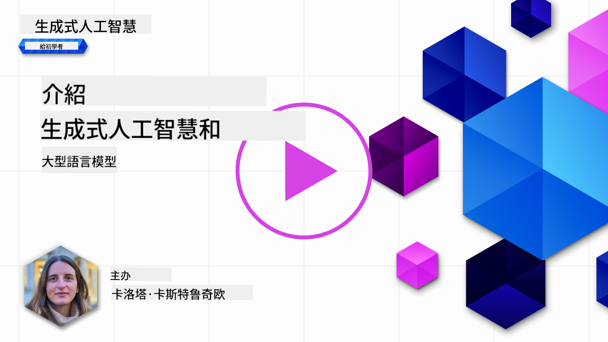
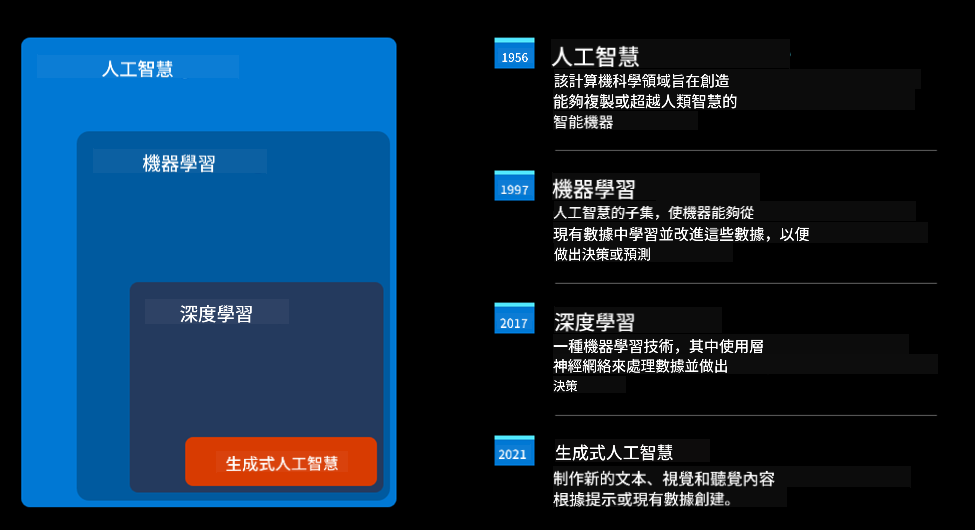
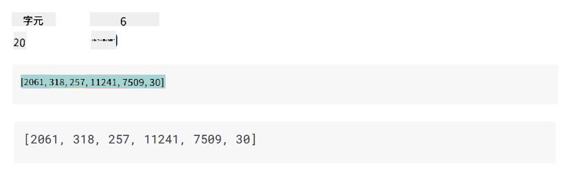
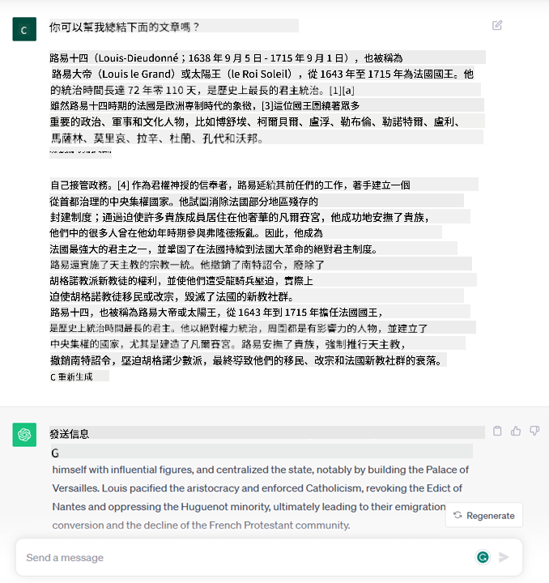
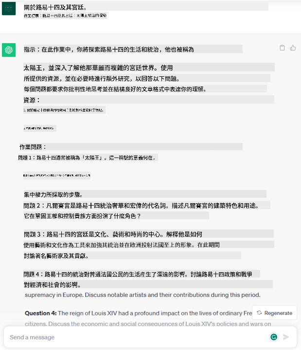
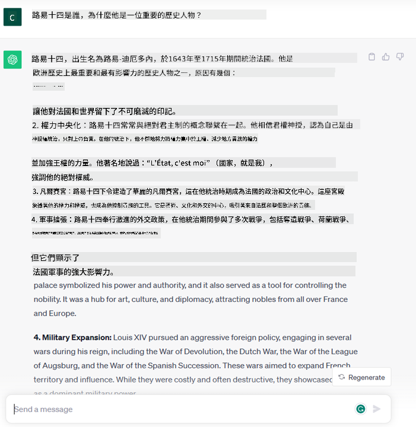
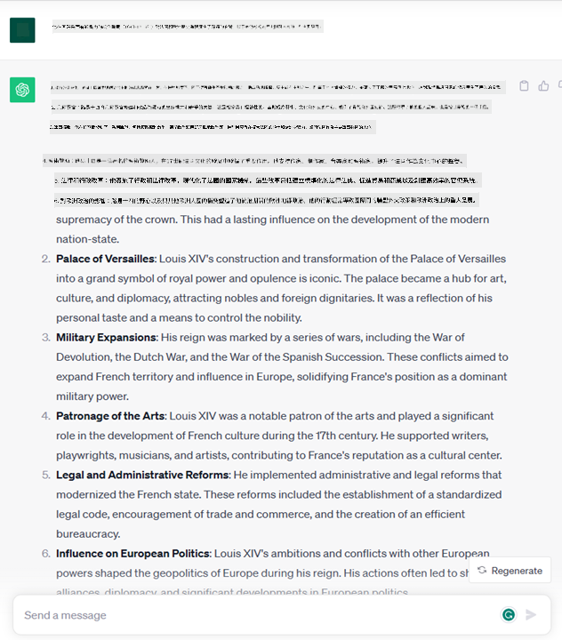
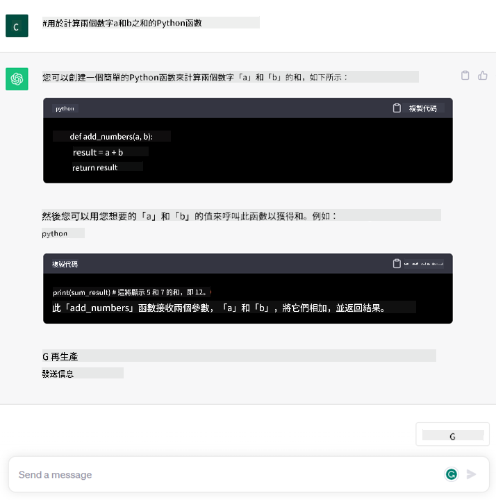

<!--
CO_OP_TRANSLATOR_METADATA:
{
  "original_hash": "f53ba0fa49164f9323043f1c6b11f2b1",
  "translation_date": "2025-06-25T09:41:44+00:00",
  "source_file": "01-introduction-to-genai/README.md",
  "language_code": "tw"
}
-->
# 生成式人工智慧與大型語言模型介紹

_（點擊上方圖片觀看本課程影片）_

生成式人工智慧是一種能夠生成文本、圖像及其他內容類型的人工智慧技術。其令人驚嘆之處在於它將人工智慧民主化，任何人只需一段自然語言的文本提示就能使用它。您不需要學習像 Java 或 SQL 這樣的語言來完成有意義的事情，只需使用您的語言，說出您的需求，AI 模型便會給出建議。這技術的應用範圍和影響巨大，您可以在幾秒鐘內撰寫或理解報告、撰寫應用程式等等。

在這份課程中，我們將探討我們的初創公司如何利用生成式人工智慧在教育領域開創新局面，以及我們如何應對其應用的社會影響和技術限制所帶來的不可避免的挑戰。

## 介紹

本課程將涵蓋：

- 商業場景介紹：我們的初創公司理念和使命。
- 生成式人工智慧及我們如何進入當前技術環境。
- 大型語言模型的內部運作。
- 大型語言模型的主要能力和實際應用案例。

## 學習目標

完成本課程後，您將了解：

- 什麼是生成式人工智慧以及大型語言模型如何運作。
- 您如何利用大型語言模型應用於不同的場景，特別是教育場景。

## 場景：我們的教育初創公司

生成式人工智慧代表了人工智慧技術的頂峰，突破了曾經被認為不可能的界限。生成式人工智慧模型擁有多種能力和應用，但在這份課程中，我們將探討它如何通過虛構的初創公司革新教育。我們將此初創公司稱為 _我們的初創公司_。我們的初創公司在教育領域工作，擁有雄心勃勃的使命宣言：

> _在全球範圍內改善學習的可及性，確保公平的教育機會，並根據每位學習者的需求提供個性化的學習體驗_。

我們的初創公司團隊知道，如果不利用現代最強大的工具之一——大型語言模型（LLMs），我們將無法實現這一目標。

生成式人工智慧預計將徹底改變我們今天的學習和教學方式，學生可以隨時獲得虛擬教師提供的大量資訊和範例，而教師可以利用創新的工具來評估學生並提供反饋。

首先，讓我們定義一些我們在整個課程中將使用的基本概念和術語。

## 我們是如何獲得生成式人工智慧的？

儘管最近生成式人工智慧模型的宣佈引起了極大的 _熱潮_，但這項技術已經經過數十年的發展，最早的研究工作可以追溯到 60 年代。我們現在已經達到了一個人工智慧擁有類似人類認知能力的階段，比如對話，這在例如 [OpenAI ChatGPT](https://openai.com/chatgpt) 或 [Bing Chat](https://www.microsoft.com/edge/features/bing-chat?WT.mc_id=academic-105485-koreyst) 中已經得到了展示，後者也使用 GPT 模型進行網路搜索的 Bing 對話。

回顧一下，最早的人工智慧原型是打字聊天機器人，依賴於從一組專家提取的知識庫並轉化為計算機中的知識。知識庫中的答案由輸入文本中出現的關鍵詞觸發。然而，很快就清楚這種使用打字聊天機器人的方法並不具備良好的可擴展性。

### 人工智慧的統計方法：機器學習

90 年代出現了一個轉折點，即將統計方法應用於文本分析。這導致了新算法的開發——稱為機器學習——能夠從數據中學習模式而無需明確編程。這種方法允許機器模擬人類語言理解：統計模型在文本-標籤配對上進行訓練，使模型能夠將未知的輸入文本分類為代表消息意圖的預定義標籤。

### 神經網絡和現代虛擬助手

近年來，硬件技術的演變，能夠處理更大數據量和更複雜的計算，促進了人工智慧研究，導致了被稱為神經網絡或深度學習算法的高級機器學習算法的發展。

神經網絡（特別是循環神經網絡 - RNNs）顯著增強了自然語言處理，能夠更有意義地表示文本的意義，重視句子中單詞的上下文。

這就是技術在新世紀的第一個十年誕生的虛擬助手的動力來源，這些助手非常擅長解釋人類語言，識別需求並執行動作來滿足它——例如使用預定義的腳本回答或消耗第三方服務。

### 現今的生成式人工智慧

這就是我們今天如何來到生成式人工智慧，它可以被視為深度學習的子集。

經過數十年的人工智慧研究，一種新的模型架構——稱為 _Transformer_——克服了 RNN 的限制，能夠接受更長的文本序列作為輸入。Transformers 基於注意力機制，讓模型能夠對接收到的輸入給予不同的權重，‘更關注’於最相關信息集中的地方，而不考慮它們在文本序列中的順序。

大多數最近的生成式人工智慧模型——也稱為大型語言模型（LLMs），因為它們處理文本輸入和輸出——確實基於這種架構。這些模型的有趣之處在於——它們在來自多種來源的大量未標記數據上進行訓練，如書籍、文章和網站——它們可以適應各種任務並生成語法正確且具有創意的文本。因此，它們不僅極大地增強了機器‘理解’輸入文本的能力，還使其能夠生成以人類語言表達的原創回應。

## 大型語言模型如何運作？

在下一章中，我們將探討不同類型的生成式人工智慧模型，但現在讓我們看看大型語言模型如何運作，重點放在 OpenAI GPT（生成預訓練 Transformer）模型上。

- **分詞器，文本轉數字**：大型語言模型接收文本作為輸入並生成文本作為輸出。然而，作為統計模型，它們處理數字比文本序列更好。這就是為什麼每個輸入在被核心模型使用之前都要經過分詞器處理。Token 是一段文本——由可變數量的字符組成，因此分詞器的主要任務是將輸入拆分為一個 token 陣列。然後，每個 token 都映射到一個 token 索引，即原始文本塊的整數編碼。

- **預測輸出 token**：給定 n 個 token 作為輸入（最大 n 在不同模型間有所不同），模型能夠預測一個 token 作為輸出。這個 token 然後被納入下一次迭代的輸入中，以擴展窗口模式，提供更好的用戶體驗，得到一個（或多個）句子作為答案。這解釋了為什麼，如果您曾經玩過 ChatGPT，您可能會注意到它有時看起來在句子中途停止。

- **選擇過程，概率分佈**：輸出 token 是根據其在當前文本序列後出現的概率由模型選擇的。這是因為模型預測所有可能‘下一個 token’的概率分佈，根據其訓練進行計算。然而，並不總是從結果分佈中選擇概率最高的 token。這個選擇中加入了一定程度的隨機性，讓模型以非確定性方式行事——對於相同的輸入，我們不會得到完全相同的輸出。這個隨機性的程度是為了模擬創造性思維的過程，可以使用一個稱為溫度的模型參數進行調整。

## 我們的初創公司如何利用大型語言模型？

現在我們對大型語言模型的內部運作有了更好的理解，讓我們看看一些它們可以很好地執行的常見任務的實際例子，並關注我們的業務場景。我們說大型語言模型的主要能力是 _從零開始生成文本，從自然語言撰寫的文本輸入開始_。

但什麼樣的文本輸入和輸出？
大型語言模型的輸入被稱為提示，而輸出被稱為完成，這指的是模型生成下一個 token 以完成當前輸入的機制。我們將深入探討什麼是提示以及如何設計它以充分發揮我們模型的潛力。但現在，我們只需說明提示可能包括：

- **指令**：指定我們期望模型生成的輸出類型。這個指令有時可能包含一些例子或一些額外數據。

  1. 文章、書籍、產品評論等的摘要，以及從非結構化數據中提取見解。
    
    
  
  2. 創意構思和設計文章、論文、作業或更多。
      
     

- **問題**：以與代理對話的形式提出。
  
  

- **文本完成**：隱含要求寫作協助的文本塊。
  
  

- **代碼塊**：要求解釋和記錄代碼，或請求生成執行特定任務的代碼片段的評論。
  
  

上述例子相對簡單，並不旨在全面展示大型語言模型的能力。它們旨在展示使用生成式人工智慧的潛力，特別是在教育環境中，但不限於此。

此外，生成式人工智慧模型的輸出並不完美，有時模型的創造性可能會反過來對它不利，導致輸出是人類用戶可以解釋為現實扭曲或冒犯性的詞語組合。生成式人工智慧並不智能——至少在更全面的智能定義中，包括批判性和創造性推理或情感智能；它不是確定性的，也不值得信賴，因為虛構的內容，如錯誤的引用、內容和聲明，可能與正確的信息結合在一起，以令人信服和自信的方式呈現。在接下來的課程中，我們將處理所有這些限制，並看看我們可以做些什麼來減輕它們。

## 作業

您的作業是進一步閱讀有關[生成式人工智慧](https://en.wikipedia.org/wiki/Generative_artificial_intelligence?WT.mc_id=academic-105485-koreyst)的資料，並嘗試識別一個您希望今天能加入生成式人工智慧但尚未擁有的領域。與以“舊方式”相比，影響會有何不同，您能否做到以前無法做到的事情，或者速度更快？撰寫一篇 300 字的摘要，描述您夢想中的人工智慧初創公司的樣子，並包括“問題”、“我將如何使用人工智慧”、“影響”以及選擇性地商業計畫等標題。

如果您完成了這項任務，您甚至可能已經準備好申請微軟的孵化器，[Microsoft for Startups Founders Hub](https://www.microsoft.com/startups?WT.mc_id=academic-105485-koreyst) 我們提供 Azure、OpenAI 的點數、指導等等，快來看看！

## 知識檢查

關於大型語言模型，什麼是正確的？

1. 每次都會得到完全相同的回應。
1. 它做得完美，擅長加法，產生可運行的代碼等。
1. 儘管使用相同的提示，回應可能會有所不同。它也擅長給您一個初稿，不論是文本還是代碼。但您需要改進結果。

A: 3，大型語言模型是非確定性的，回應會有所不同，然而，您可以通過調整溫度設置來控制其變異性。您也不應期望它完美無缺，它是為您做繁重工作的，這通常意味著您得到一個不錯的初次嘗試，需要逐步改進。

## 很棒的工作！繼續旅程

完成本課程後，查看我們的[生成式人工智慧學習系列](https://aka.ms/genai-collection?WT.mc_id=academic-105485-koreyst)以繼續提升您的生成式人工智慧知識！

前往第 2 課，我們將探討如何[探索和比較不同的 LLM 類型](../02-exploring-and-comparing-different-llms/README.md?WT.mc_id=academic-105485-koreyst)！

**免責聲明**：
本文檔已使用 AI 翻譯服務 [Co-op Translator](https://github.com/Azure/co-op-translator) 進行翻譯。儘管我們努力追求準確性，但請注意，自動翻譯可能包含錯誤或不準確之處。原始語言的文檔應被視為權威來源。對於關鍵信息，建議尋求專業人工翻譯。我們不對使用此翻譯而引起的任何誤解或誤釋承擔責任。