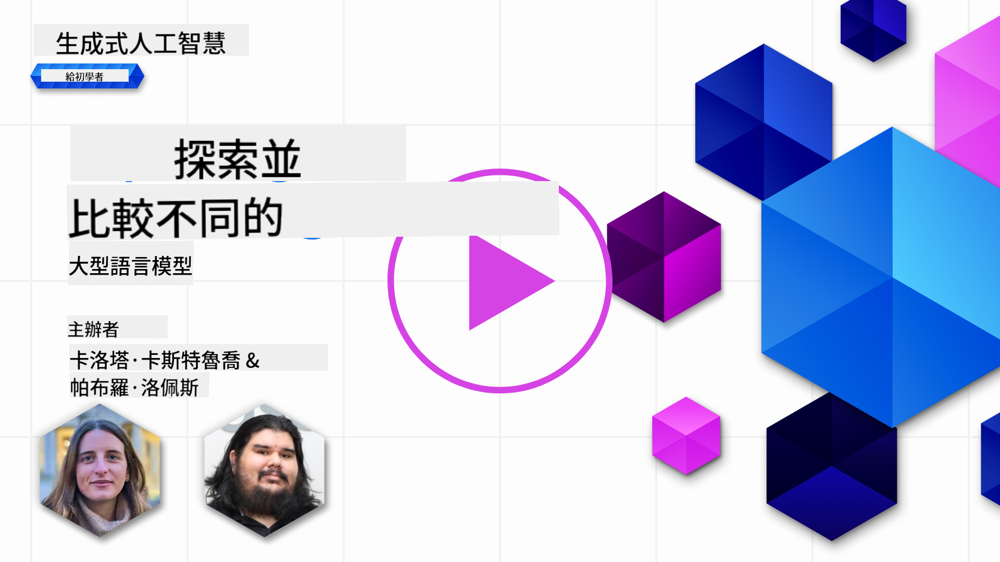
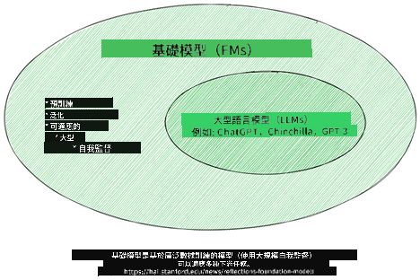
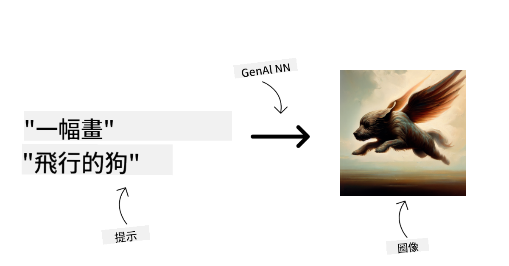
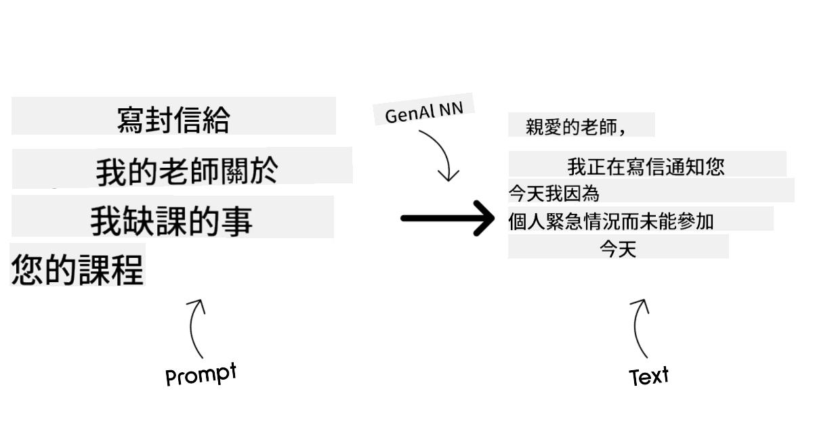
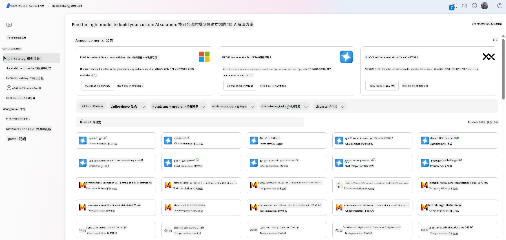
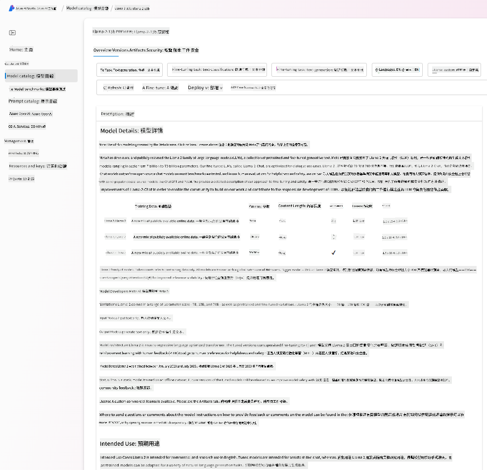
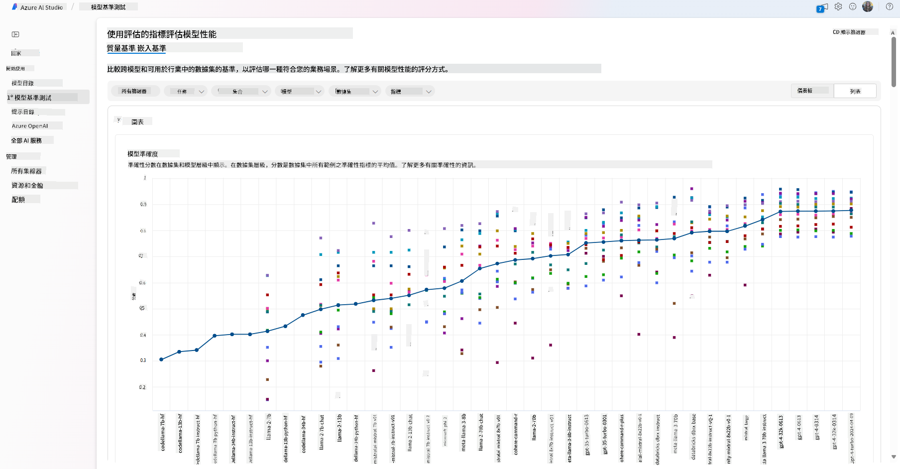
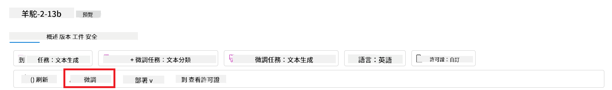
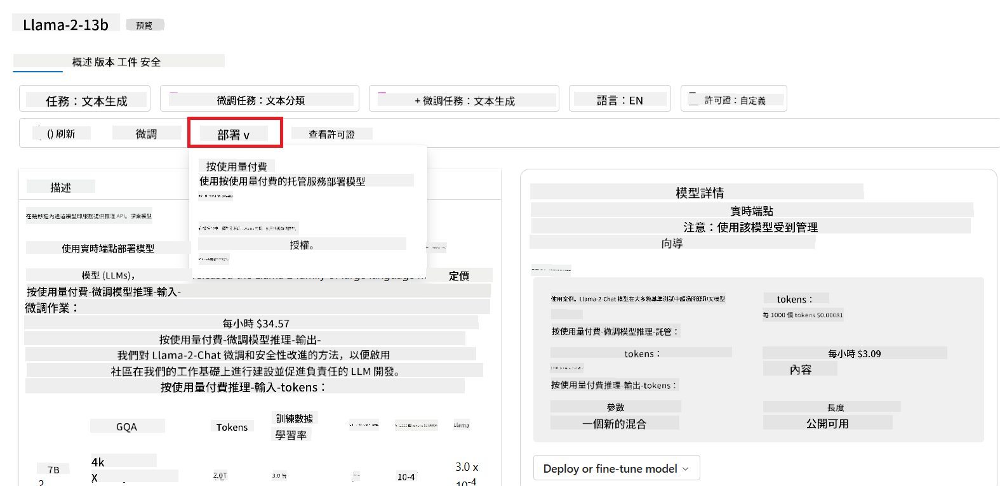
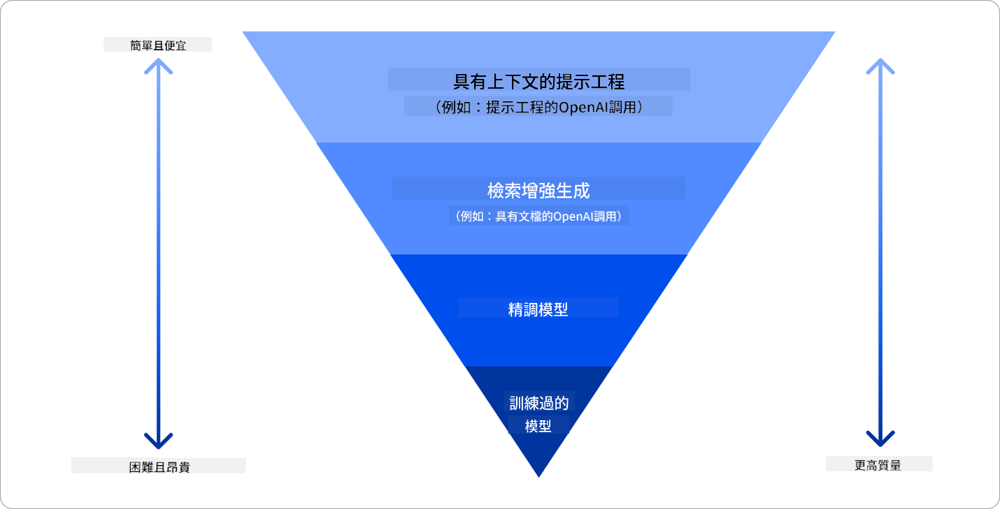

<!--
CO_OP_TRANSLATOR_METADATA:
{
  "original_hash": "e2f686f2eb794941761252ac5e8e090b",
  "translation_date": "2025-05-19T09:21:24+00:00",
  "source_file": "02-exploring-and-comparing-different-llms/README.md",
  "language_code": "tw"
}
-->
# 探索和比较不同的LLM

> _点击上面的图片观看本课的视频_

在上一课中，我们看到了生成式AI如何改变技术格局，了解了大型语言模型（LLM）如何运作，以及像我们的初创企业如何将它们应用到实际案例中并实现增长！在本章中，我们将比较和对比不同类型的大型语言模型（LLM），以了解它们的优缺点。

我们初创企业的下一步是探索当前LLM的格局，并了解哪些适合我们的使用场景。

## 介绍

本课将涵盖：

- 当前格局中的不同类型的LLM。
- 在Azure中测试、迭代和比较不同模型以适合您的使用场景。
- 如何部署一个LLM。

## 学习目标

完成本课后，您将能够：

- 为您的使用场景选择合适的模型。
- 了解如何测试、迭代并提升模型的性能。
- 知道企业如何部署模型。

## 了解不同类型的LLM

LLM可以根据其架构、训练数据和使用场景进行多种分类。了解这些差异将帮助我们的初创企业选择适合场景的模型，并了解如何测试、迭代和提升性能。

有许多不同类型的LLM模型，您的选择取决于您打算如何使用它们、您的数据、您愿意支付的费用等等。

根据您是否打算使用模型进行文本、音频、视频、图像生成等，您可能会选择不同类型的模型。

- **音频和语音识别**。对于此目的，Whisper类型的模型是一个不错的选择，因为它们是通用的并针对语音识别进行优化。它们经过多样化音频训练，能够进行多语言语音识别。了解更多关于[Whisper类型模型的信息](https://platform.openai.com/docs/models/whisper?WT.mc_id=academic-105485-koreyst)。

- **图像生成**。对于图像生成，DALL-E和Midjourney是两个非常知名的选择。DALL-E由Azure OpenAI提供。[阅读更多关于DALL-E的信息](https://platform.openai.com/docs/models/dall-e?WT.mc_id=academic-105485-koreyst)，以及本课程第9章。

- **文本生成**。大多数模型都是针对文本生成进行训练的，您有很多选择，从GPT-3.5到GPT-4。它们的成本各不相同，其中GPT-4是最昂贵的。值得查看[Azure OpenAI playground](https://oai.azure.com/portal/playground?WT.mc_id=academic-105485-koreyst)，以评估哪些模型在能力和成本方面最符合您的需求。

- **多模态**。如果您希望处理输入和输出中的多种类型数据，您可能需要查看像[gpt-4 turbo with vision或gpt-4o](https://learn.microsoft.com/azure/ai-services/openai/concepts/models#gpt-4-and-gpt-4-turbo-models?WT.mc_id=academic-105485-koreyst)这样的模型——最新发布的OpenAI模型——它们能够将自然语言处理与视觉理解结合起来，实现通过多模态接口进行互动。

选择一个模型意味着您获得了一些基本能力，但可能还不够。通常您有公司特定的数据，需要以某种方式告诉LLM。关于如何处理这一问题的更多信息将在后续章节中介绍。

### 基础模型与LLM

“基础模型”这一术语由[斯坦福研究人员提出](https://arxiv.org/abs/2108.07258?WT.mc_id=academic-105485-koreyst)，并定义为符合某些标准的AI模型，例如：

- **它们使用无监督学习或自监督学习进行训练**，这意味着它们是在未标记的多模态数据上进行训练的，不需要人工标注或标记数据来进行训练。
- **它们是非常大的模型**，基于训练了数十亿参数的非常深的神经网络。
- **它们通常旨在作为其他模型的“基础”**，意味着它们可以作为其他模型的起点，通过微调来进行构建。

图片来源：[基础模型和大型语言模型的必备指南 | Babar M Bhatti | Medium](https://thebabar.medium.com/essential-guide-to-foundation-models-and-large-language-models-27dab58f7404)

为了进一步澄清这一区别，让我们以ChatGPT为例。为了构建ChatGPT的第一个版本，一个称为GPT-3.5的模型作为基础模型。这意味着OpenAI使用了一些聊天特定的数据创建了一个GPT-3.5的调整版本，专门在对话场景中表现良好，如聊天机器人。

图片来源：[2108.07258.pdf (arxiv.org)](https://arxiv.org/pdf/2108.07258.pdf?WT.mc_id=academic-105485-koreyst)

### 开源模型与专有模型

另一种分类LLM的方法是它们是开源的还是专有的。

开源模型是向公众开放的模型，任何人都可以使用。它们通常由创建它们的公司或研究社区提供。这些模型可以被检查、修改，并根据LLM的各种使用场景进行定制。然而，它们不一定针对生产用途进行优化，可能没有专有模型那么高效。此外，开源模型的资金可能有限，可能不会长期维护或更新最新研究。流行的开源模型包括[Alpaca](https://crfm.stanford.edu/2023/03/13/alpaca.html?WT.mc_id=academic-105485-koreyst)、[Bloom](https://huggingface.co/bigscience/bloom)和[LLaMA](https://llama.meta.com)。

专有模型是由公司拥有的模型，不向公众开放。这些模型通常针对生产用途进行优化。然而，它们不允许被检查、修改或定制用于不同的使用场景。此外，它们不一定免费提供，可能需要订阅或支付使用费用。此外，用户无法控制用于训练模型的数据，这意味着他们应该信任模型所有者确保数据隐私和负责任的AI使用。流行的专有模型包括[OpenAI模型](https://platform.openai.com/docs/models/overview?WT.mc_id=academic-105485-koreyst)、[Google Bard](https://sapling.ai/llm/bard?WT.mc_id=academic-105485-koreyst)或[Claude 2](https://www.anthropic.com/index/claude-2?WT.mc_id=academic-105485-koreyst)。

### 嵌入与图像生成与文本和代码生成

LLM也可以根据它们生成的输出进行分类。

嵌入是一组可以将文本转换为数值形式的模型，称为嵌入，它是输入文本的数值表示。嵌入使机器更容易理解词语或句子之间的关系，并可以作为输入被其他模型使用，如分类模型或在数值数据上表现更好的聚类模型。嵌入模型通常用于迁移学习，其中一个模型是为一个有大量数据的替代任务构建的，然后模型权重（嵌入）被重新用于其他下游任务。这一类别的一个例子是[OpenAI嵌入](https://platform.openai.com/docs/models/embeddings?WT.mc_id=academic-105485-koreyst)。

图像生成模型是生成图像的模型。这些模型通常用于图像编辑、图像合成和图像翻译。图像生成模型通常在大型图像数据集上进行训练，如[LAION-5B](https://laion.ai/blog/laion-5b/?WT.mc_id=academic-105485-koreyst)，可以用于生成新图像或编辑现有图像，使用修复、超分辨率和上色技术。例子包括[DALL-E-3](https://openai.com/dall-e-3?WT.mc_id=academic-105485-koreyst)和[稳定扩散模型](https://github.com/Stability-AI/StableDiffusion?WT.mc_id=academic-105485-koreyst)。

文本和代码生成模型是生成文本或代码的模型。这些模型通常用于文本摘要、翻译和问题回答。文本生成模型通常在大型文本数据集上进行训练，如[BookCorpus](https://www.cv-foundation.org/openaccess/content_iccv_2015/html/Zhu_Aligning_Books_and_ICCV_2015_paper.html?WT.mc_id=academic-105485-koreyst)，可以用于生成新文本或回答问题。代码生成模型，如[CodeParrot](https://huggingface.co/codeparrot?WT.mc_id=academic-105485-koreyst)，通常在大型代码数据集上进行训练，如GitHub，可以用于生成新代码或修复现有代码中的错误。

### 编码器-解码器与仅解码器

为了讨论LLM的不同架构类型，让我们用一个比喻来说明。

想象您的经理给您一个任务，为学生编写一个测验。您有两个同事，一个负责创建内容，另一个负责审核。

内容创建者就像一个仅解码器模型，他们可以查看主题并看到您已经写了什么，然后根据这些写一个课程。他们非常擅长编写引人入胜和信息丰富的内容，但他们不太擅长理解主题和学习目标。解码器模型的一些例子是GPT系列模型，如GPT-3。

审核者就像一个仅编码器模型，他们查看写好的课程和答案，注意它们之间的关系并理解上下文，但他们不擅长生成内容。仅编码器模型的一个例子是BERT。

想象我们也可以有一个既能创建又能审核测验的人，这就是编码器-解码器模型。一些例子是BART和T5。

### 服务与模型

现在，让我们谈谈服务和模型之间的区别。服务是云服务提供商提供的产品，通常是模型、数据和其他组件的组合。模型是服务的核心组件，通常是基础模型，如LLM。

服务通常针对生产用途进行优化，并且比模型更容易使用，通过图形用户界面。然而，服务不一定免费提供，可能需要订阅或支付使用费用，以换取利用服务所有者的设备和资源，优化费用并轻松扩展。服务的一个例子是[Azure OpenAI Service](https://learn.microsoft.com/azure/ai-services/openai/overview?WT.mc_id=academic-105485-koreyst)，提供按需计费计划，意味着用户根据使用量收费。此外，Azure OpenAI Service在模型能力的基础上提供企业级安全和负责任的AI框架。

模型只是神经网络，包含参数、权重等。允许公司在本地运行，但需要购买设备、构建结构以扩展，并购买许可证或使用开源模型。像LLaMA这样的模型可以使用，需要计算能力来运行模型。

## 如何在Azure上测试和迭代不同模型以了解性能

一旦我们的团队探索了当前的LLM格局，并为他们的场景确定了一些好的候选者，下一步就是在他们的数据和工作负载上测试这些模型。这是一个迭代过程，通过实验和测量来完成。
我们在前面段落中提到的大多数模型（OpenAI模型、开源模型如Llama2和Hugging Face transformers）都可以在[Azure AI Studio](https://ai.azure.com/?WT.mc_id=academic-105485-koreyst)的[模型目录](https://learn.microsoft.com/azure/ai-studio/how-to/model-catalog-overview?WT.mc_id=academic-105485-koreyst)中找到。

[Azure AI Studio](https://learn.microsoft.com/azure/ai-studio/what-is-ai-studio?WT.mc_id=academic-105485-koreyst)是一个云平台，专为开发者构建生成式AI应用程序并管理整个开发生命周期而设计——从实验到评估——通过将所有Azure AI服务结合到一个便捷的GUI中。Azure AI Studio中的模型目录使用户能够：

- 在目录中找到感兴趣的基础模型——无论是专有还是开源的，通过任务、许可证或名称进行筛选。为了提高可搜索性，模型被组织成集合，如Azure OpenAI集合、Hugging Face集合等。

- 查看模型卡，包括详细的使用意图和训练数据描述、代码示例以及内部评估库中的评估结果。

- 比較行業中可用的模型和數據集的基準，以評估哪一個符合業務場景，通過 [Model Benchmarks](https://learn.microsoft.com/azure/ai-studio/how-to/model-benchmarks?WT.mc_id=academic-105485-koreyst) 窗格。

- 使用自定義訓練數據微調模型，以提高模型在特定工作負載中的性能，利用 Azure AI Studio 的實驗和跟踪功能。

- 部署原始預訓練模型或微調版本到遠程實時推理 - 管理計算 - 或無伺服器 API 端點 - [按需付費](https://learn.microsoft.com/azure/ai-studio/how-to/model-catalog-overview#model-deployment-managed-compute-and-serverless-api-pay-as-you-go?WT.mc_id=academic-105485-koreyst) - 以便應用程序可以使用它。

> [!NOTE]
> 目錄中的所有模型目前並不都支持微調和/或按需付費部署。請查看模型卡以了解模型的能力和限制。

## 改善 LLM 結果

我們已經和初創團隊一起探索了不同種類的 LLM 和一個雲平台（Azure Machine Learning），使我們能夠比較不同的模型，在測試數據上評估它們，改善性能並在推理端點上部署它們。

但何時應考慮微調模型而不是使用預訓練模型？是否有其他方法可以改善模型在特定工作負載上的性能？

企業可以使用多種方法從 LLM 中獲得所需的結果。當在生產中部署 LLM 時，您可以選擇不同類型的模型，具有不同程度的訓練，並且具有不同的複雜性、成本和質量。以下是一些不同的方法：

- **帶上下文的提示工程**。想法是提供足夠的上下文，以確保您獲得所需的響應。

- **檢索增強生成，RAG**。例如，您的數據可能存在於數據庫或網絡端點中，以確保在提示時包含此數據或其子集，您可以提取相關數據並將其作為用戶提示的一部分。

- **微調模型**。在這裡，您進一步使用自己的數據訓練模型，這使得模型更加精確和響應您的需求，但可能會有成本。

圖片來源：[四種企業部署 LLM 的方式 | Fiddler AI Blog](https://www.fiddler.ai/blog/four-ways-that-enterprises-deploy-llms?WT.mc_id=academic-105485-koreyst)

### 帶上下文的提示工程

預訓練的 LLM 在通用自然語言任務上表現非常好，即使只用一個簡短的提示，例如要完成的句子或問題——所謂的“零樣本”學習。

然而，用戶越能框定自己的查詢，提供詳細的請求和示例——上下文——答案就會越準確且越接近用戶的期望。在這種情況下，如果提示僅包含一個示例，我們稱之為“一樣本”學習；如果包含多個示例，則稱為“少樣本”學習。帶上下文的提示工程是最具成本效益的啟動方法。

### 檢索增強生成 (RAG)

LLM 的限制是它們只能使用訓練過程中使用的數據來生成答案。這意味著它們不知道訓練過程之後發生的事實，並且無法訪問非公開信息（例如公司數據）。
這可以通過 RAG 克服，這是一種技術，可以在提示中增加外部數據，形成文檔片段，考慮提示長度限制。這由向量數據庫工具（如 [Azure Vector Search](https://learn.microsoft.com/azure/search/vector-search-overview?WT.mc_id=academic-105485-koreyst)）支持，這些工具從各種預定義數據源中檢索有用的片段並將其添加到提示上下文中。

當企業沒有足夠的數據、時間或資源來微調 LLM，但仍希望在特定工作負載上提高性能並減少虛構（即，現實的神秘化或有害內容）的風險時，這種技術非常有幫助。

### 微調模型

微調是一個利用遷移學習將模型“適應”下游任務或解決特定問題的過程。不同於少樣本學習和 RAG，它會生成一個新模型，具有更新的權重和偏差。它需要一組訓練示例，包括單個輸入（提示）及其相關的輸出（完成）。
如果以下情況，這將是首選方法：

- **使用微調模型**。企業希望使用微調的能力較低的模型（如嵌入模型）而不是高性能模型，從而獲得更具成本效益和快速的解決方案。

- **考慮延遲**。延遲對於特定用例非常重要，因此不能使用非常長的提示或模型應學習的示例數量不符合提示長度限制。

- **保持最新**。企業擁有大量高質量數據和真實標籤，以及維持這些數據隨時間更新所需的資源。

### 訓練模型

從零開始訓練 LLM 無疑是最困難和最複雜的方法，需要大量數據、熟練的資源和適當的計算能力。只有在企業有特定領域的用例和大量領域集中數據的情況下，才應考慮此選項。

## 知識檢查

改善 LLM 完成結果的好方法是什麼？

1. 帶上下文的提示工程
1. RAG
1. 微調模型

A:3，如果您有時間、資源和高質量數據，微調是保持最新的更好選擇。然而，如果您希望改善並缺乏時間，值得先考慮 RAG。

## 🚀 挑戰

了解更多如何為您的企業 [使用 RAG](https://learn.microsoft.com/azure/search/retrieval-augmented-generation-overview?WT.mc_id=academic-105485-koreyst)。

## 出色的工作，繼續學習

完成本課程後，查看我們的 [生成式 AI 學習合集](https://aka.ms/genai-collection?WT.mc_id=academic-105485-koreyst)，繼續提升您的生成式 AI 知識！

前往第 3 課，我們將探討如何 [負責任地使用生成式 AI](../03-using-generative-ai-responsibly/README.md?WT.mc_id=academic-105485-koreyst)！

**免責聲明**：

本文件已使用 AI 翻譯服務 [Co-op Translator](https://github.com/Azure/co-op-translator) 進行翻譯。我們努力追求準確性，但請注意，自動翻譯可能會包含錯誤或不準確之處。應以原語言的原始文件為權威來源。對於關鍵信息，建議尋求專業人工翻譯。我們對因使用此翻譯而產生的任何誤解或誤讀不承擔責任。