<!--
CO_OP_TRANSLATOR_METADATA:
{
  "original_hash": "e2f686f2eb794941761252ac5e8e090b",
  "translation_date": "2025-07-09T08:14:48+00:00",
  "source_file": "02-exploring-and-comparing-different-llms/README.md",
  "language_code": "tw"
}
-->
# 探索與比較不同的 LLMs

[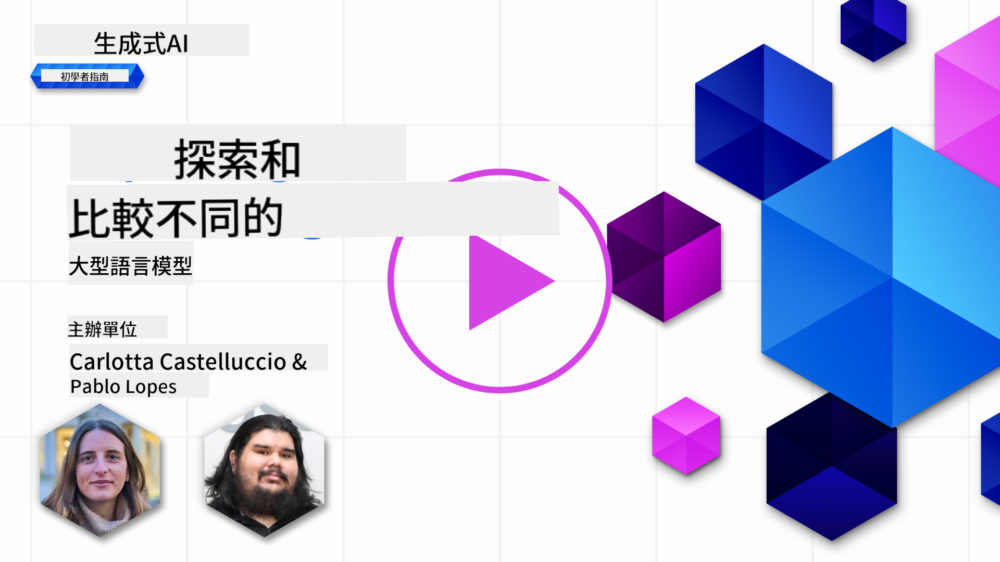](https://aka.ms/gen-ai-lesson2-gh?WT.mc_id=academic-105485-koreyst)

> _點擊上方圖片觀看本課程影片_

在上一課中，我們了解了生成式 AI 如何改變科技領域，了解大型語言模型（LLMs）的運作原理，以及像我們的新創公司如何將它們應用於實際案例並促進成長！本章節將比較不同類型的大型語言模型（LLMs），以了解它們的優缺點。

我們新創公司的下一步是探索目前 LLMs 的生態，並了解哪些模型適合我們的使用場景。

## 介紹

本課程將涵蓋：

- 目前生態中不同類型的 LLMs。
- 在 Azure 上測試、迭代及比較不同模型以符合您的使用需求。
- 如何部署 LLM。

## 學習目標

完成本課程後，您將能夠：

- 選擇適合您使用場景的模型。
- 了解如何測試、迭代並提升模型效能。
- 知道企業如何部署模型。

## 了解不同類型的 LLMs

LLMs 可依架構、訓練資料及使用場景有多種分類。理解這些差異能幫助我們的新創公司挑選合適的模型，並了解如何測試、迭代及提升效能。

LLM 模型種類繁多，您選擇的模型取決於使用目的、資料、預算等因素。

根據您想用模型處理文字、音訊、影片、影像生成等不同需求，可能會選擇不同類型的模型。

- **音訊與語音辨識**。Whisper 類型模型是很好的選擇，因為它們是通用型且專注於語音辨識。Whisper 訓練於多元音訊資料，能進行多語言語音辨識。詳情請參考[Whisper 類型模型](https://platform.openai.com/docs/models/whisper?WT.mc_id=academic-105485-koreyst)。

- **影像生成**。影像生成方面，DALL-E 與 Midjourney 是兩個非常知名的選擇。DALL-E 由 Azure OpenAI 提供。[在此閱讀更多關於 DALL-E](https://platform.openai.com/docs/models/dall-e?WT.mc_id=academic-105485-koreyst)，也可參考本課程第九章。

- **文字生成**。大多數模型都是針對文字生成訓練，您可以從 GPT-3.5 到 GPT-4 中選擇多種模型。它們的價格不一，GPT-4 是較昂貴的選擇。建議您使用[Azure OpenAI playground](https://oai.azure.com/portal/playground?WT.mc_id=academic-105485-koreyst)評估哪個模型在能力與成本上最符合需求。

- **多模態**。若您想處理多種輸入與輸出資料類型，可以考慮像是[gpt-4 turbo with vision 或 gpt-4o](https://learn.microsoft.com/azure/ai-services/openai/concepts/models#gpt-4-and-gpt-4-turbo-models?WT.mc_id=academic-105485-koreyst)這類最新的 OpenAI 模型，它們能結合自然語言處理與視覺理解，支援多模態介面互動。

選擇模型意味著您獲得基本能力，但這可能還不夠。通常您會有公司特定的資料需要告訴 LLM。針對這點有幾種不同的做法，後續章節會詳細說明。

### 基礎模型與 LLMs 的差異

「基礎模型」一詞由[史丹佛研究人員提出](https://arxiv.org/abs/2108.07258?WT.mc_id=academic-105485-koreyst)，定義為符合以下條件的 AI 模型：

- **使用無監督學習或自我監督學習訓練**，意即訓練資料為未標註的多模態資料，不需人工標註。
- **模型規模龐大**，基於深度神經網路，擁有數十億參數。
- **通常作為其他模型的「基礎」**，可作為其他模型的起點，透過微調來打造專屬模型。

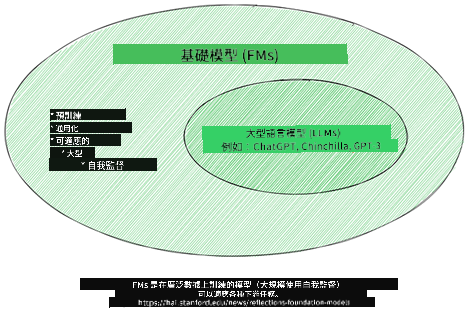

圖片來源：[Essential Guide to Foundation Models and Large Language Models | by Babar M Bhatti | Medium](https://thebabar.medium.com/essential-guide-to-foundation-models-and-large-language-models-27dab58f7404)

為了更清楚說明這個區別，我們以 ChatGPT 為例。ChatGPT 第一版是以 GPT-3.5 作為基礎模型，OpenAI 利用特定的聊天資料微調 GPT-3.5，打造出專門用於對話場景（如聊天機器人）的版本。

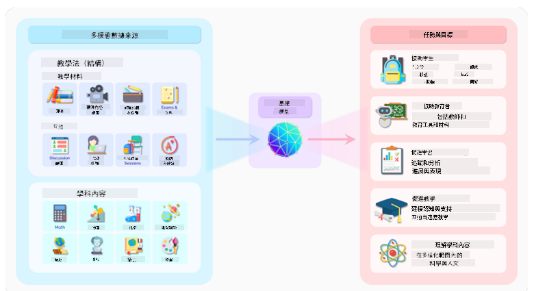

圖片來源：[2108.07258.pdf (arxiv.org)](https://arxiv.org/pdf/2108.07258.pdf?WT.mc_id=academic-105485-koreyst)

### 開源模型與專有模型

另一種分類方式是依模型是否開源。

開源模型是公開提供給大眾使用的模型，通常由開發公司或研究社群釋出。這些模型允許檢視、修改及客製化，適用於多種 LLMs 使用場景。但它們不一定適合生產環境，效能可能不及專有模型。此外，開源模型的資金有限，可能無法長期維護或更新最新研究成果。知名開源模型範例包括[Alpaca](https://crfm.stanford.edu/2023/03/13/alpaca.html?WT.mc_id=academic-105485-koreyst)、[Bloom](https://huggingface.co/bigscience/bloom)與[LLaMA](https://llama.meta.com)。

專有模型則由公司擁有，未公開提供給大眾。這些模型通常針對生產環境優化，但不允許檢視、修改或客製化。使用時可能需付費或訂閱，且用戶無法掌控訓練資料，需信任模型擁有者在資料隱私與 AI 負責任使用上的承諾。知名專有模型範例包括[OpenAI 模型](https://platform.openai.com/docs/models/overview?WT.mc_id=academic-105485-koreyst)、[Google Bard](https://sapling.ai/llm/bard?WT.mc_id=academic-105485-koreyst)與[Claude 2](https://www.anthropic.com/index/claude-2?WT.mc_id=academic-105485-koreyst)。

### Embedding、影像生成與文字及程式碼生成

LLMs 也可依輸出類型分類。

Embedding 模型能將文字轉換成數值形式（embedding），這是輸入文字的數值表示。Embedding 讓機器更容易理解詞語或句子間的關係，並可作為其他模型（如分類模型、分群模型）的輸入，提升數值資料的效能。Embedding 模型常用於遷移學習，先在大量資料的代理任務上訓練，再將模型權重（embedding）用於下游任務。此類模型範例為[OpenAI embeddings](https://platform.openai.com/docs/models/embeddings?WT.mc_id=academic-105485-koreyst)。

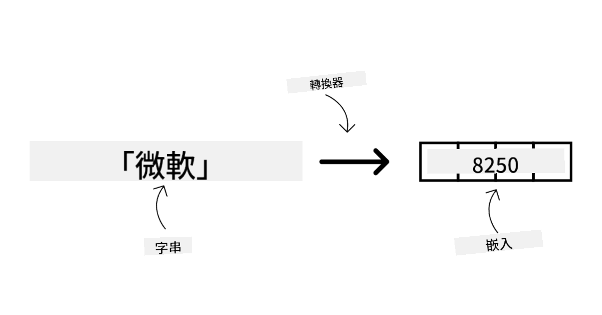

影像生成模型則用於產生影像，常用於影像編輯、合成與轉換。這類模型通常在大型影像資料集（如[LAION-5B](https://laion.ai/blog/laion-5b/?WT.mc_id=academic-105485-koreyst)）上訓練，可用於生成新影像或透過修補、超解析度、上色等技術編輯現有影像。範例包括[DALL-E-3](https://openai.com/dall-e-3?WT.mc_id=academic-105485-koreyst)與[Stable Diffusion 模型](https://github.com/Stability-AI/StableDiffusion?WT.mc_id=academic-105485-koreyst)。

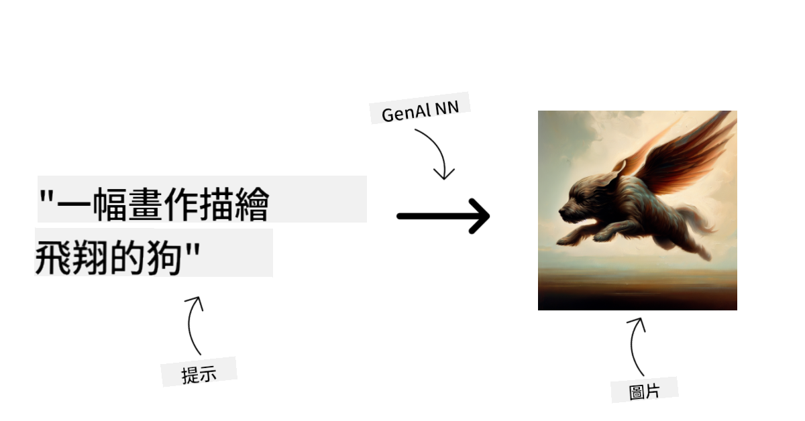

文字與程式碼生成模型則用於產生文字或程式碼，常見應用有文字摘要、翻譯與問答。文字生成模型通常在大型文字資料集（如[BookCorpus](https://www.cv-foundation.org/openaccess/content_iccv_2015/html/Zhu_Aligning_Books_and_ICCV_2015_paper.html?WT.mc_id=academic-105485-koreyst)）上訓練，可用於生成新文字或回答問題。程式碼生成模型，如[CodeParrot](https://huggingface.co/codeparrot?WT.mc_id=academic-105485-koreyst)，則在大型程式碼資料集（如 GitHub）上訓練，可用於生成新程式碼或修正現有程式碼錯誤。

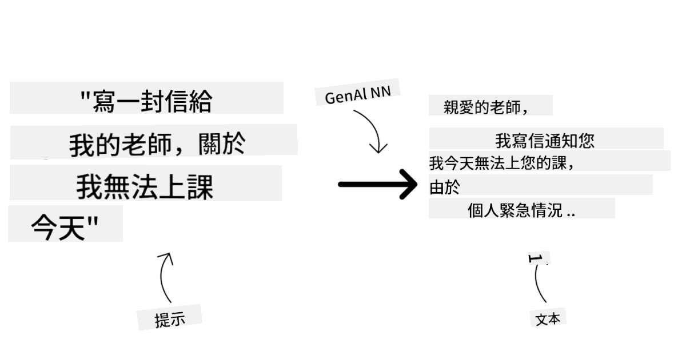

### 編碼器-解碼器架構與僅解碼器架構

談到 LLMs 的不同架構，我們用一個比喻來說明。

想像您的主管交代您設計一份學生測驗題目。您有兩位同事，一位負責出題內容，另一位負責審核。

出題者就像僅解碼器（Decoder-only）模型，他們會根據主題和已寫的內容來撰寫課程。他們擅長撰寫吸引人且具資訊性的內容，但不太擅長理解主題與學習目標。GPT 系列模型（如 GPT-3）就是此類解碼器模型的例子。

審核者則像僅編碼器（Encoder-only）模型，他們會檢視課程與答案，理解兩者間的關係與上下文，但不擅長產生內容。BERT 是典型的編碼器模型。

如果有人同時能出題與審核，這就是編碼器-解碼器（Encoder-Decoder）模型。BART 與 T5 是此類模型的例子。

### 服務與模型的差異

接著談談服務與模型的差異。服務是由雲端服務提供商推出的產品，通常結合多個模型、資料及其他元件。模型則是服務的核心元件，通常是基礎模型，如 LLM。

服務通常針對生產環境優化，且透過圖形介面更易使用。但服務不一定免費，可能需訂閱或付費，換取使用服務提供者的設備與資源，達到成本優化與彈性擴展。舉例來說，[Azure OpenAI Service](https://learn.microsoft.com/azure/ai-services/openai/overview?WT.mc_id=academic-105485-koreyst) 提供按使用量付費方案，並在模型能力基礎上提供企業級安全與負責任的 AI 框架。

模型本身是神經網路，包含參數與權重。企業若要本地運行模型，需購買設備、建立擴展架構，並取得授權或使用開源模型。像 LLaMA 這類模型可供使用，但需要相當的運算資源。

## 如何在 Azure 上測試與迭代不同模型以了解效能

當團隊探索完目前 LLMs 生態並挑選出適合的候選模型後，下一步是用自己的資料與工作負載進行測試。這是一個透過實驗與測量反覆進行的迭代過程。
我們在前面章節提到的大多數模型（OpenAI 模型、像 Llama2 這樣的開源模型，以及 Hugging Face transformers）都可以在 [Azure AI Studio](https://ai.azure.com/?WT.mc_id=academic-105485-koreyst) 的 [Model Catalog](https://learn.microsoft.com/azure/ai-studio/how-to/model-catalog-overview?WT.mc_id=academic-105485-koreyst) 中找到。

[Azure AI Studio](https://learn.microsoft.com/azure/ai-studio/what-is-ai-studio?WT.mc_id=academic-105485-koreyst) 是一個為開發者設計的雲端平台，讓他們能夠建立生成式 AI 應用程式並管理整個開發生命週期——從實驗到評估——將所有 Azure AI 服務整合到一個方便操作的 GUI 中。Azure AI Studio 中的 Model Catalog 讓使用者能夠：

- 在目錄中找到感興趣的基礎模型——無論是專有還是開源，並可依任務、授權或名稱篩選。為了提升搜尋效率，模型被組織成多個集合，如 Azure OpenAI 集合、Hugging Face 集合等。

- 查看模型卡，包括詳細的預期用途說明、訓練資料、程式碼範例以及內部評估庫中的評測結果。

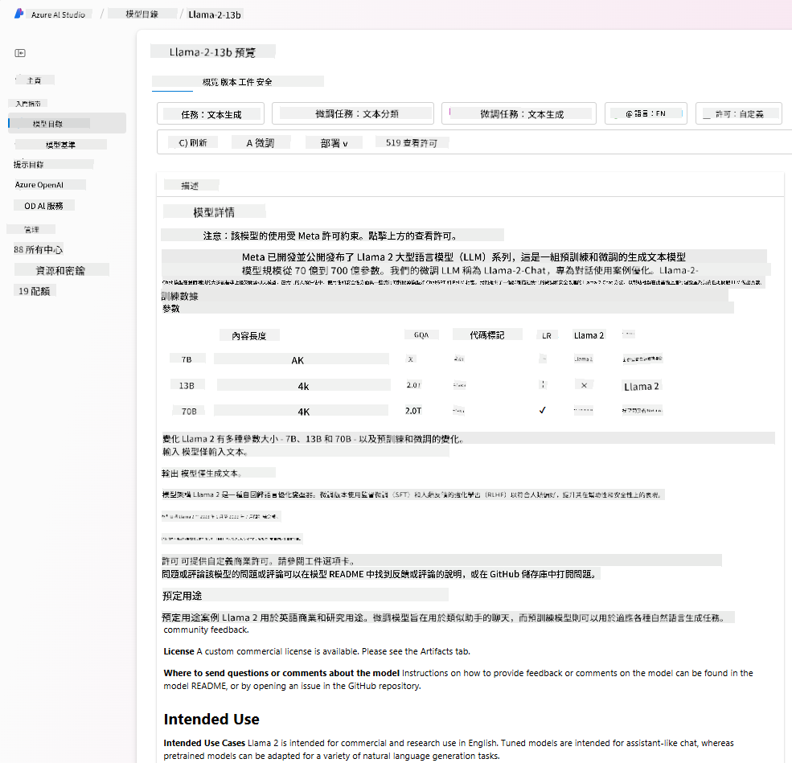

- 透過 [Model Benchmarks](https://learn.microsoft.com/azure/ai-studio/how-to/model-benchmarks?WT.mc_id=academic-105485-koreyst) 面板，比較業界中不同模型和資料集的基準測試，評估哪個最符合商業場景需求。

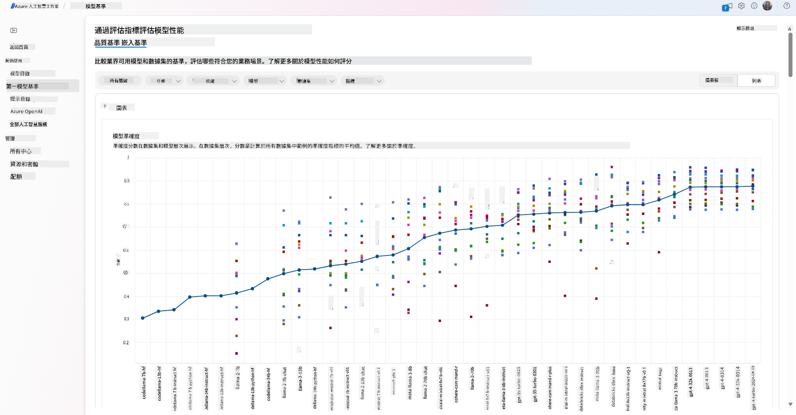

- 利用 Azure AI Studio 的實驗與追蹤功能，針對自訂訓練資料微調模型，以提升特定工作負載的模型效能。

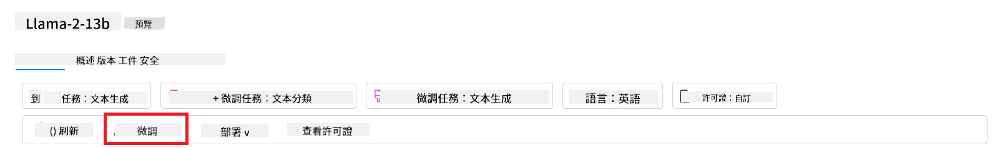

- 部署原始的預訓練模型或微調後的版本到遠端即時推論環境——管理型運算資源或無伺服器 API 端點——[按使用量付費](https://learn.microsoft.com/azure/ai-studio/how-to/model-catalog-overview#model-deployment-managed-compute-and-serverless-api-pay-as-you-go?WT.mc_id=academic-105485-koreyst)，讓應用程式能夠使用模型。

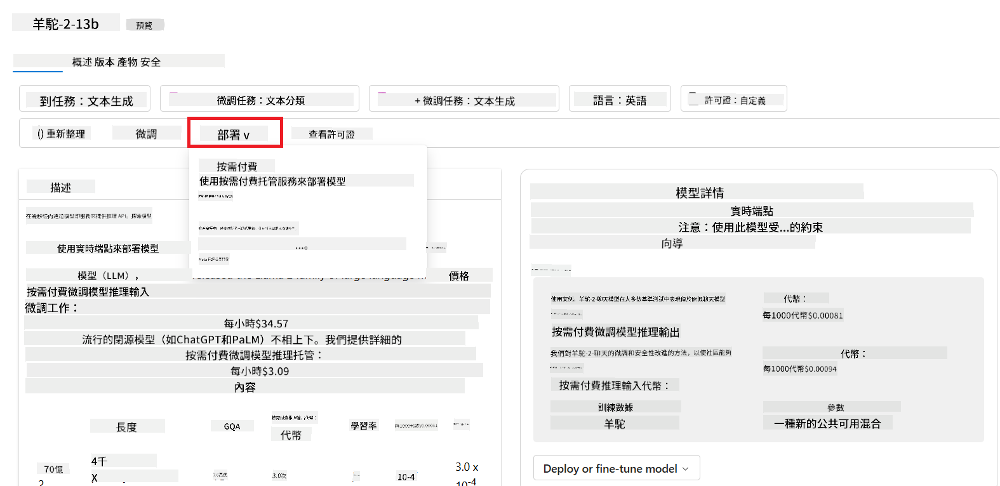

> [!NOTE]
> 目錄中的所有模型目前並非都支援微調和/或按使用量付費部署。請查看模型卡以了解該模型的功能與限制。

## 改善大型語言模型（LLM）結果

我們與新創團隊一起探索了不同類型的 LLM 以及一個雲端平台（Azure Machine Learning），讓我們能比較不同模型、在測試資料上評估、提升效能，並部署到推論端點。

但什麼時候應該考慮微調模型，而非直接使用預訓練模型？還有其他方法可以提升模型在特定工作負載上的表現嗎？

企業可以採用多種方法來獲得所需的 LLM 結果。部署 LLM 時，可以選擇不同訓練程度的模型，這些模型在複雜度、成本和品質上各有差異。以下是幾種不同的做法：

- **帶有上下文的提示工程**。核心想法是提供足夠的上下文，確保回應符合需求。

- **檢索增強生成（RAG）**。例如，您的資料可能存在資料庫或網路端點，為了確保在提示時包含這些資料或其子集，可以先擷取相關資料，並將其納入使用者的提示中。

- **微調模型**。在此情況下，您會用自己的資料進一步訓練模型，使其更精確且更符合需求，但成本可能較高。

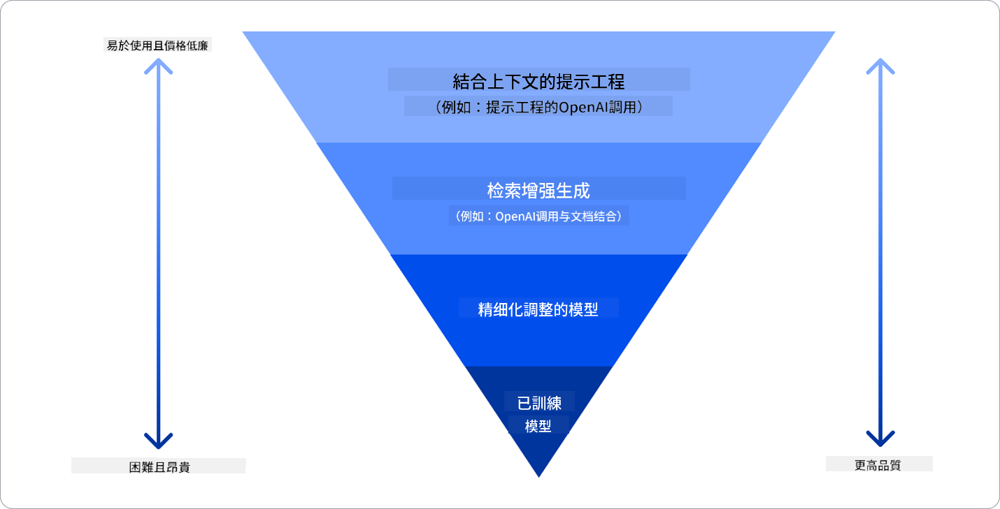

圖片來源：[Four Ways that Enterprises Deploy LLMs | Fiddler AI Blog](https://www.fiddler.ai/blog/four-ways-that-enterprises-deploy-llms?WT.mc_id=academic-105485-koreyst)

### 帶有上下文的提示工程

預訓練的 LLM 在一般自然語言任務上表現良好，即使只用簡短的提示（例如一句話完成或一個問題）——所謂的「零次學習（zero-shot）」。

然而，使用者越能用詳細的請求和範例來框定查詢——也就是上下文——答案就越準確且符合期待。如果提示中只包含一個範例，稱為「一次學習（one-shot）」，若包含多個範例，則稱為「少次學習（few-shot）」。帶有上下文的提示工程是最具成本效益的入門方法。

### 檢索增強生成（RAG）

LLM 有個限制，就是只能使用訓練時所用的資料來生成答案。這表示它們不會知道訓練後發生的事實，也無法存取非公開資訊（例如公司資料）。

這個問題可以透過 RAG 技術解決，該技術會將外部資料（以文件片段形式）加入提示中，並考慮提示長度限制。這由向量資料庫工具（如 [Azure Vector Search](https://learn.microsoft.com/azure/search/vector-search-overview?WT.mc_id=academic-105485-koreyst)）支援，能從多種預先定義的資料來源擷取有用片段，並加入提示上下文。

當企業沒有足夠資料、時間或資源微調 LLM，但仍想提升特定工作負載的效能並降低虛構內容（如誤導性資訊或有害內容）風險時，這項技術非常有用。

### 微調模型

微調是利用遷移學習，將模型「調整」以適應下游任務或解決特定問題。與少次學習和 RAG 不同，微調會產生一個新的模型，更新權重和偏差。它需要一組訓練範例，每個範例包含一個輸入（提示）及其對應輸出（完成）。

如果符合以下條件，微調會是首選：

- **使用微調模型**。企業希望使用微調過的較低能力模型（如嵌入模型），而非高性能模型，以達成更具成本效益且快速的解決方案。

- **考慮延遲**。某些使用案例對延遲要求高，無法使用過長的提示，或模型需學習的範例數量不符提示長度限制。

- **保持資料更新**。企業擁有大量高品質資料和真實標籤，且有資源持續維護資料的時效性。

### 從頭訓練模型

從零開始訓練 LLM 無疑是最困難且最複雜的方式，需要龐大資料量、專業人力和充足運算資源。這種選項只適用於企業擁有特定領域使用案例及大量領域專屬資料的情況。

## 知識檢測

什麼方法適合用來提升 LLM 的完成結果？

1. 帶有上下文的提示工程  
2. RAG  
3. 微調模型

答：3，如果你有時間、資源和高品質資料，微調是保持最新狀態的最佳選擇。但如果想快速改善且時間有限，建議先考慮 RAG。

## 🚀 挑戰

深入了解如何為您的企業[使用 RAG](https://learn.microsoft.com/azure/search/retrieval-augmented-generation-overview?WT.mc_id=academic-105485-koreyst)。

## 做得好，繼續學習

完成本課程後，請查看我們的[生成式 AI 學習集合](https://aka.ms/genai-collection?WT.mc_id=academic-105485-koreyst)，持續提升您的生成式 AI 知識！

接著前往第 3 課，我們將探討如何[負責任地使用生成式 AI](../03-using-generative-ai-responsibly/README.md?WT.mc_id=academic-105485-koreyst)！

**免責聲明**：  
本文件係使用 AI 翻譯服務 [Co-op Translator](https://github.com/Azure/co-op-translator) 進行翻譯。雖然我們致力於確保翻譯的準確性，但請注意，自動翻譯可能包含錯誤或不準確之處。原始文件的母語版本應視為權威來源。對於重要資訊，建議採用專業人工翻譯。我們不對因使用本翻譯而產生的任何誤解或誤釋負責。