<!--
CO_OP_TRANSLATOR_METADATA:
{
  "original_hash": "e2f686f2eb794941761252ac5e8e090b",
  "translation_date": "2025-06-25T10:22:25+00:00",
  "source_file": "02-exploring-and-comparing-different-llms/README.md",
  "language_code": "tw"
}
-->
# 探索和比較不同的 LLM

[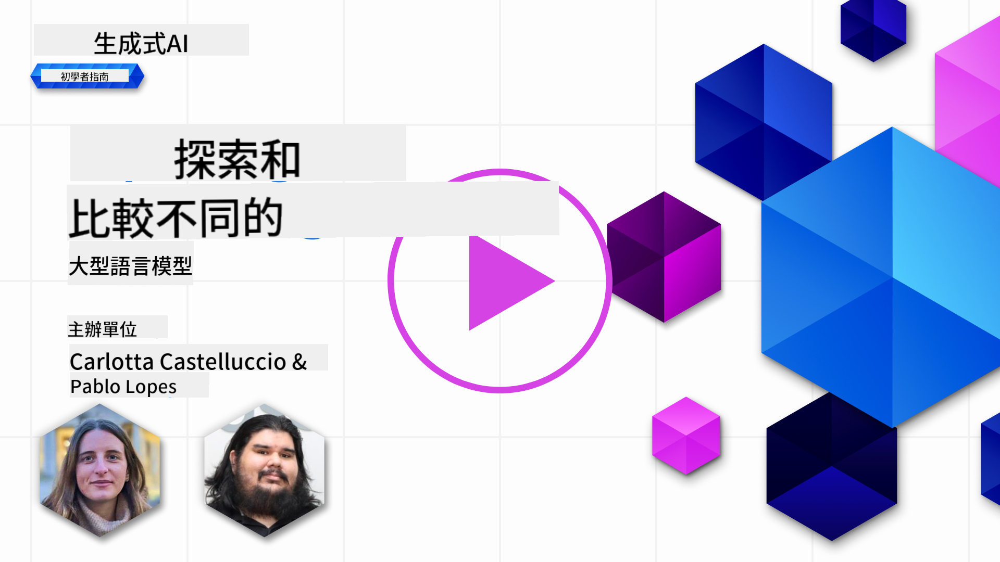](https://aka.ms/gen-ai-lesson2-gh?WT.mc_id=academic-105485-koreyst)

> _點擊上方圖片觀看本課程影片_

在上一節課中，我們已經看到生成式 AI 如何改變科技領域，了解大型語言模型 (LLM) 的運作方式，以及像我們的初創公司如何將它們應用於業務場景並實現增長！在本章中，我們將比較和對比不同類型的大型語言模型 (LLM)，以了解它們的優缺點。

我們的初創公司下一步的旅程是探索當前 LLM 的現狀，並了解哪些適合我們的使用案例。

## 介紹

本課程將涵蓋：

- 當前環境中的不同類型的 LLM。
- 在 Azure 中測試、迭代和比較不同模型以適應您的使用案例。
- 如何部署 LLM。

## 學習目標

完成本課程後，您將能夠：

- 為您的使用案例選擇合適的模型。
- 了解如何測試、迭代和提高模型的性能。
- 知道企業如何部署模型。

## 了解不同類型的 LLM

LLM 可以根據其架構、訓練數據和使用案例進行多種分類。了解這些差異將幫助我們的初創公司選擇合適的模型，並了解如何測試、迭代和提高性能。

有許多不同類型的 LLM 模型，您的選擇取決於您打算如何使用它們，您的數據，以及您願意支付多少費用等等。

根據您打算將模型用於文本、音頻、視頻、圖像生成等用途，您可能會選擇不同類型的模型。

- **音頻和語音識別**。為此目的，Whisper 類型的模型是個不錯的選擇，因為它們是通用的，旨在進行語音識別。它們訓練於多樣化的音頻，能夠進行多語種語音識別。了解更多關於 [Whisper 類型模型](https://platform.openai.com/docs/models/whisper?WT.mc_id=academic-105485-koreyst) 的信息。

- **圖像生成**。對於圖像生成，DALL-E 和 Midjourney 是兩個非常知名的選擇。DALL-E 由 Azure OpenAI 提供。[在這裡閱讀更多關於 DALL-E](https://platform.openai.com/docs/models/dall-e?WT.mc_id=academic-105485-koreyst) 的信息，還有本課程的第 9 章。

- **文本生成**。大多數模型都訓練於文本生成，您有多種選擇，從 GPT-3.5 到 GPT-4。它們的成本不同，其中 GPT-4 最貴。值得在 [Azure OpenAI playground](https://oai.azure.com/portal/playground?WT.mc_id=academic-105485-koreyst) 中查看哪些模型在能力和成本方面最適合您的需求。

- **多模態**。如果您希望處理多種類型的輸入和輸出數據，您可能需要考慮像 [gpt-4 turbo with vision or gpt-4o](https://learn.microsoft.com/azure/ai-services/openai/concepts/models#gpt-4-and-gpt-4-turbo-models?WT.mc_id=academic-105485-koreyst) 這樣的模型——這是 OpenAI 模型的最新版本，能夠結合自然語言處理和視覺理解，支持通過多模態界面進行互動。

選擇模型意味著您獲得了一些基本能力，但這可能還不夠。通常您有公司特定的數據，需要以某種方式告訴 LLM。關於如何處理這一點，有幾種不同的選擇，更多內容將在後續部分介紹。

### 基礎模型與 LLM

基礎模型這個術語是由 [斯坦福研究人員提出的](https://arxiv.org/abs/2108.07258?WT.mc_id=academic-105485-koreyst)，並定義為滿足某些標準的 AI 模型，例如：

- **它們是通過無監督學習或自我監督學習訓練的**，這意味著它們是在未標記的多模態數據上訓練的，不需要人工標註或標記數據來進行訓練。
- **它們是非常大的模型**，基於非常深的神經網絡，訓練於數十億的參數。
- **它們通常旨在作為其他模型的“基礎”**，這意味著可以作為其他模型的起點，這可以通過微調來完成。

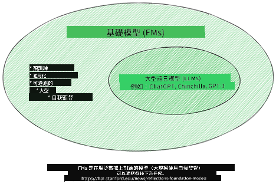

圖片來源：[基礎模型和大型語言模型的基本指南 | Babar M Bhatti | Medium](https://thebabar.medium.com/essential-guide-to-foundation-models-and-large-language-models-27dab58f7404)

為了進一步闡明這一區別，讓我們以 ChatGPT 為例。為了構建 ChatGPT 的第一個版本，一個名為 GPT-3.5 的模型作為基礎模型。這意味著 OpenAI 使用一些聊天特定的數據創建了一個 GPT-3.5 的調整版本，專門在對話場景中表現良好，例如聊天機器人。

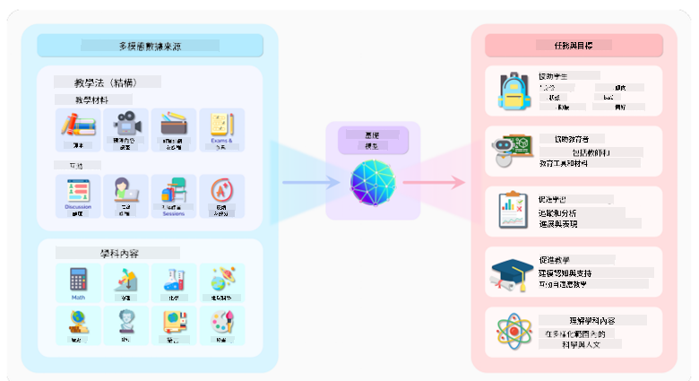

圖片來源：[2108.07258.pdf (arxiv.org)](https://arxiv.org/pdf/2108.07258.pdf?WT.mc_id=academic-105485-koreyst)

### 開源模型與專有模型

另一種對 LLM 進行分類的方法是看它們是開源還是專有。

開源模型是公開提供給公眾的模型，任何人都可以使用。它們通常由創建它們的公司或研究社區提供。這些模型允許被檢查、修改和定制以適應 LLM 的各種使用案例。然而，它們不總是為生產使用而優化，性能可能不如專有模型。此外，開源模型的資金可能有限，可能不會長期維護或更新最新研究。流行的開源模型例子包括 [Alpaca](https://crfm.stanford.edu/2023/03/13/alpaca.html?WT.mc_id=academic-105485-koreyst)、[Bloom](https://huggingface.co/bigscience/bloom) 和 [LLaMA](https://llama.meta.com)。

專有模型是由公司擁有的模型，未公開提供給公眾。這些模型通常為生產使用而優化。然而，它們不允許被檢查、修改或定制以適應不同的使用案例。此外，它們不總是免費提供，可能需要訂閱或支付使用費用。此外，使用者無法控制用於訓練模型的數據，這意味著他們應該信任模型擁有者確保對數據隱私和 AI 負責任使用的承諾。流行的專有模型例子包括 [OpenAI 模型](https://platform.openai.com/docs/models/overview?WT.mc_id=academic-105485-koreyst)、[Google Bard](https://sapling.ai/llm/bard?WT.mc_id=academic-105485-koreyst) 或 [Claude 2](https://www.anthropic.com/index/claude-2?WT.mc_id=academic-105485-koreyst)。

### 嵌入式生成與圖像生成與文本和代碼生成

LLM 還可以根據它們生成的輸出進行分類。

嵌入式模型是一組可以將文本轉換為數字形式的模型，稱為嵌入，這是輸入文本的數字表示。嵌入使機器更容易理解單詞或句子之間的關係，並可以作為其他模型的輸入，例如分類模型或在數據上表現更好的聚類模型。嵌入模型通常用於遷移學習，其中一個模型是為數據豐富的代理任務構建的，然後將模型權重（嵌入）重新用於其他下游任務。此類的例子是 [OpenAI 嵌入](https://platform.openai.com/docs/models/embeddings?WT.mc_id=academic-105485-koreyst)。

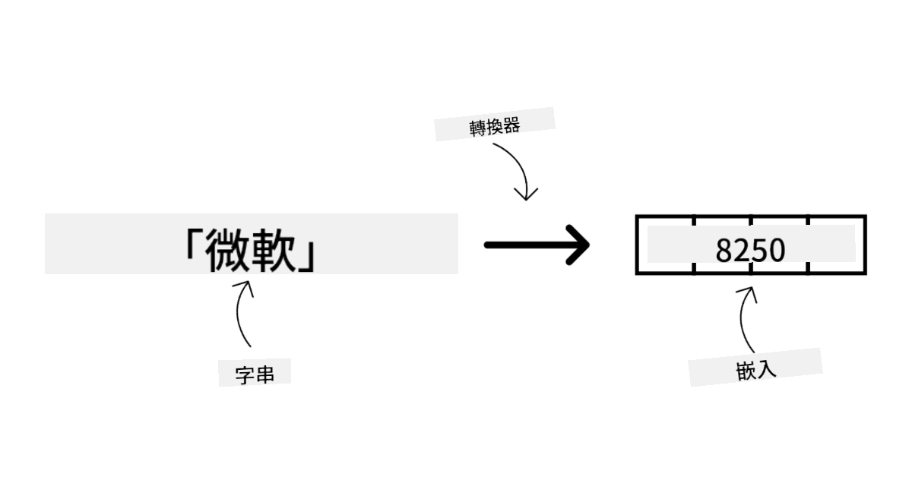

圖像生成模型是生成圖像的模型。這些模型通常用於圖像編輯、圖像合成和圖像翻譯。圖像生成模型通常在大型圖像數據集上訓練，例如 [LAION-5B](https://laion.ai/blog/laion-5b/?WT.mc_id=academic-105485-koreyst)，可以用來生成新圖像或使用修補、超分辨率和上色技術編輯現有圖像。例子包括 [DALL-E-3](https://openai.com/dall-e-3?WT.mc_id=academic-105485-koreyst) 和 [Stable Diffusion 模型](https://github.com/Stability-AI/StableDiffusion?WT.mc_id=academic-105485-koreyst)。

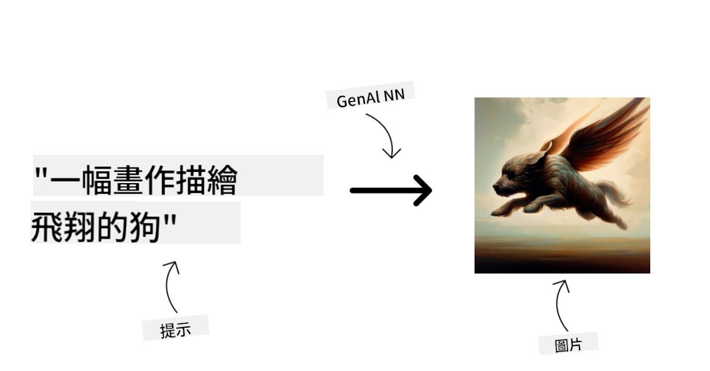

文本和代碼生成模型是生成文本或代碼的模型。這些模型通常用於文本摘要、翻譯和問答。文本生成模型通常在大型文本數據集上訓練，例如 [BookCorpus](https://www.cv-foundation.org/openaccess/content_iccv_2015/html/Zhu_Aligning_Books_and_ICCV_2015_paper.html?WT.mc_id=academic-105485-koreyst)，可以用來生成新文本或回答問題。代碼生成模型，如 [CodeParrot](https://huggingface.co/codeparrot?WT.mc_id=academic-105485-koreyst)，通常在大型代碼數據集上訓練，例如 GitHub，可以用來生成新代碼或修復現有代碼中的錯誤。

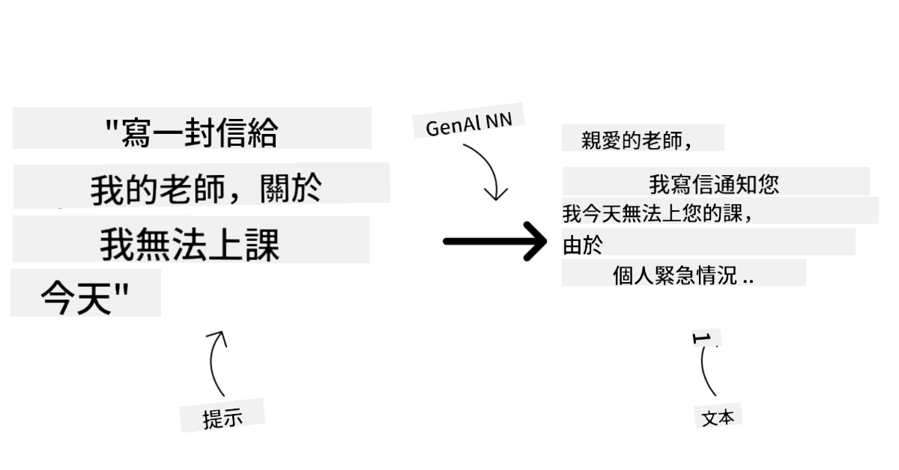

### 編碼器-解碼器與僅解碼器

為了討論 LLM 的不同架構類型，我們來用一個類比。

想像一下，您的經理給您一個為學生編寫測驗的任務。您有兩位同事，一位負責創建內容，另一位負責審核。

內容創建者就像一個僅解碼器模型，他們可以查看主題和您已經寫的內容，然後根據這些寫出課程。他們非常擅長編寫引人入勝和信息豐富的內容，但不太擅長理解主題和學習目標。解碼器模型的一些例子是 GPT 系列模型，如 GPT-3。

審核者就像一個僅編碼器模型，他們查看已寫的課程和答案，注意它們之間的關係並理解上下文，但不擅長生成內容。僅編碼器模型的一個例子是 BERT。

想像一下，我們還可以有一個人可以創建和審核測驗，這就是編碼器-解碼器模型。BART 和 T5 是一些例子。

### 服務與模型

現在，讓我們談談服務和模型之間的區別。服務是由雲服務提供商提供的產品，通常是模型、數據和其他組件的組合。模型是服務的核心組件，通常是基礎模型，例如 LLM。

服務通常為生產使用而優化，並且通常比模型更易於使用，通過圖形用戶界面。然而，服務不總是免費提供，可能需要訂閱或支付使用費用，以換取利用服務擁有者的設備和資源，優化支出並輕鬆擴展。一個服務的例子是 [Azure OpenAI 服務](https://learn.microsoft.com/azure/ai-services/openai/overview?WT.mc_id=academic-105485-koreyst)，它提供按需付費計劃，這意味著用戶根據使用服務的多少按比例收費。此外，Azure OpenAI 服務在模型的能力之上提供企業級安全和負責任的 AI 框架。

模型只是神經網絡，具有參數、權重等。允許公司在本地運行，但需要購買設備、建立擴展結構並購買許可證或使用開源模型。像 LLaMA 這樣的模型可以使用，但需要計算能力來運行模型。

## 如何在 Azure 上測試和迭代不同模型以了解性能

一旦我們的團隊探索了當前 LLM 的現狀並確定了一些適合他們場景的好候選模型，下一步就是在他們的數據和工作負載上測試它們。這是一個迭代過程，通過實驗和測量來完成。
我們在前面段落中提到的大多數模型（OpenAI 模型、開源模型如 Llama2 和 Hugging Face 變換器）都可以在 [Azure AI Studio](https://ai.azure.com/?WT.mc_id=academic-105485-koreyst) 的 [模型目錄](https://learn.microsoft.com/azure/ai-studio/how-to/model-catalog-overview?WT.mc_id=academic-105485-koreyst) 中找到。

[Azure AI Studio](https://learn.microsoft.com/azure/ai-studio/what-is-ai-studio?WT.mc_id=academic-105485-koreyst) 是一個為開發者設計的雲平台，用於構建生成式 AI 應用程序並管理整個開發生命周期——從實驗到評估——通過將所有 Azure AI 服務結合到一個具有方便 GUI 的單一中心。Azure AI Studio 中的模型目錄使用戶能夠：

- 在目錄中找到感興趣的基礎模型——無論是專有的還是開源的，按任務、許可證或名稱進行篩選。為了提高搜索性，模型被組織成集合，如 Azure OpenAI 集合、Hugging Face 集合等。

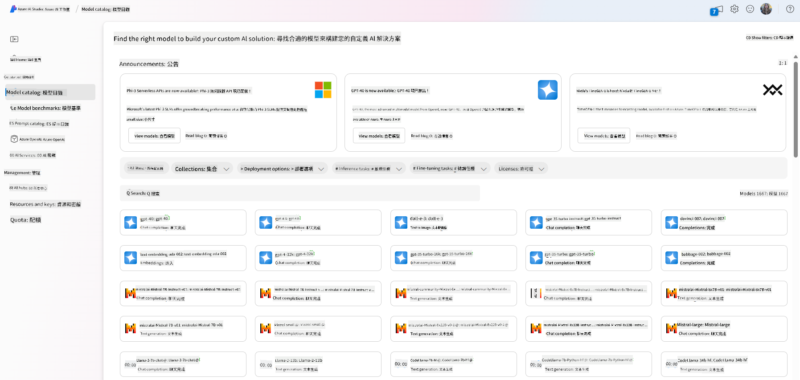

- 查看模型卡，包括預期用途和訓練數據的詳細描述、代碼範例和內部評估庫的評估結果。

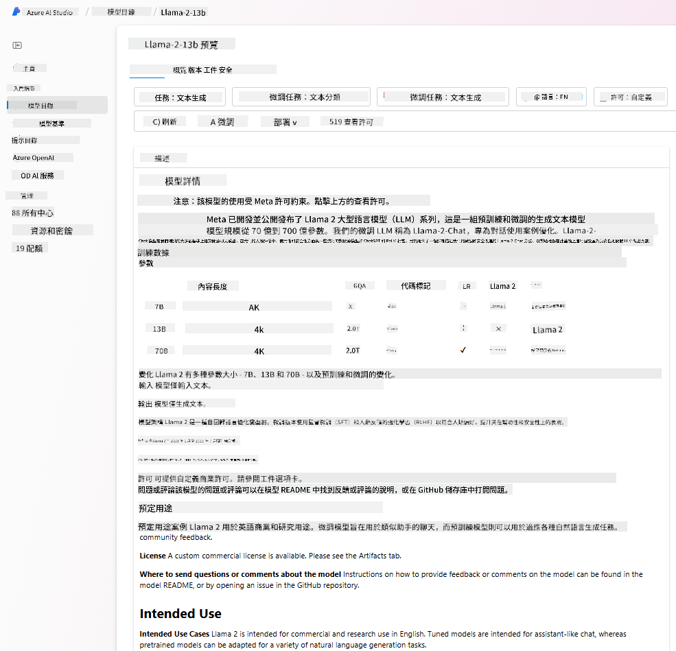
- 比較行業中可用的模型和數據集的基準，以評估哪一個符合商業場景，通過[模型基準](https://learn.microsoft.com/azure/ai-studio/how-to/model-benchmarks?WT.mc_id=academic-105485-koreyst)面板進行。

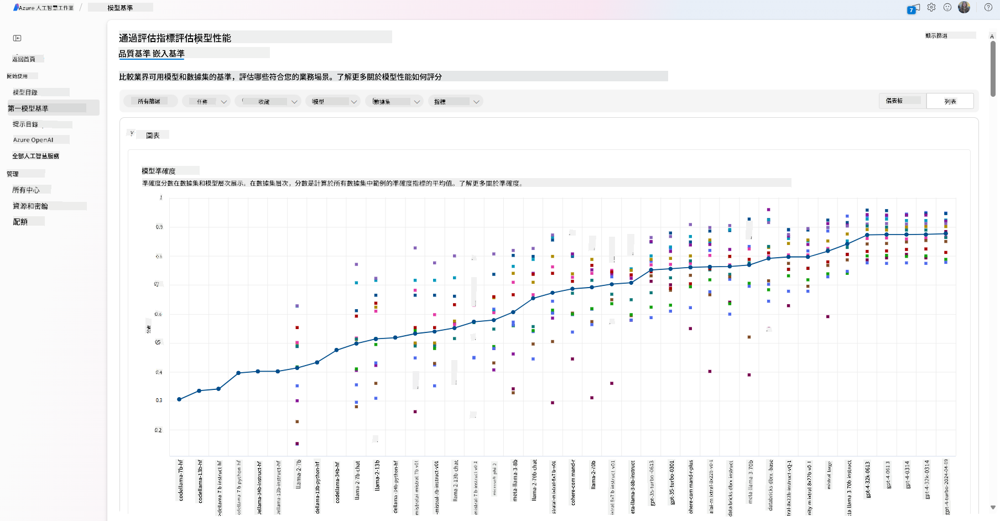

- 在自定義訓練數據上微調模型，以改善模型在特定工作負載中的性能，利用 Azure AI Studio 的實驗和跟踪能力。

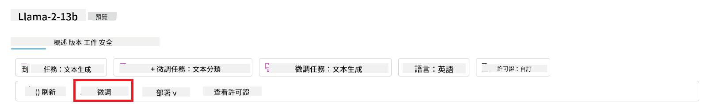

- 部署原始預訓練模型或微調版本到遠程實時推理 - 管理計算 - 或無伺服器 API 端點 - [按需付費](https://learn.microsoft.com/azure/ai-studio/how-to/model-catalog-overview#model-deployment-managed-compute-and-serverless-api-pay-as-you-go?WT.mc_id=academic-105485-koreyst) - 以便應用程序可以使用它。

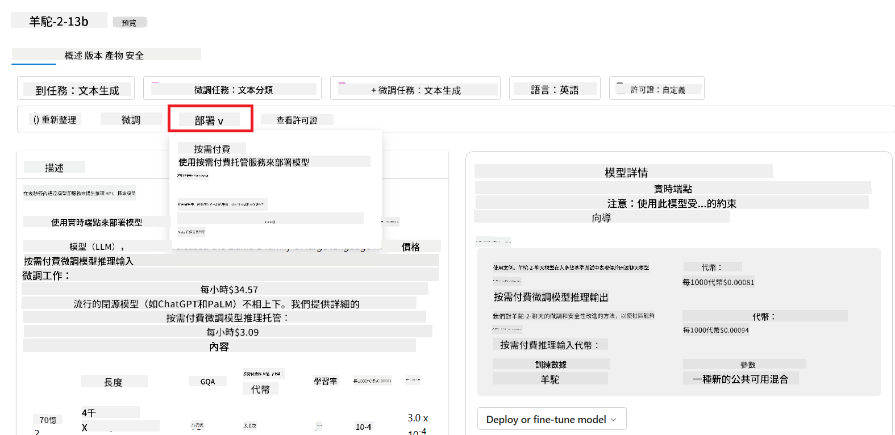

> [!NOTE]
> 目前並非所有目錄中的模型都可以進行微調和/或按需付費部署。請查看模型卡片以了解模型的功能和限制。

## 改善 LLM 結果

我們與創業團隊一起探索了不同種類的 LLM 和一個雲平台（Azure Machine Learning），使我們能夠比較不同的模型，評估它們在測試數據上的表現，改善性能並在推理端點上部署它們。

但何時應考慮微調模型而不是使用預訓練模型？是否有其他方法可以改善模型在特定工作負載上的性能？

企業可以使用多種方法從 LLM 獲得所需結果。您可以在生產中部署 LLM 時選擇不同類型的模型，具有不同程度的訓練，並且具有不同的複雜性、成本和質量。以下是一些不同的方法：

- **使用上下文的提示工程**。這個想法是在提示時提供足夠的上下文，以確保獲得所需的回應。

- **檢索增強生成，RAG**。例如，您的數據可能存在於數據庫或網絡端點中，為了確保在提示時包含這些數據或其子集，您可以提取相關數據並將其作為用戶提示的一部分。

- **微調模型**。在這裡，您進一步在自己的數據上訓練模型，使其更準確且響應您的需求，但可能成本較高。

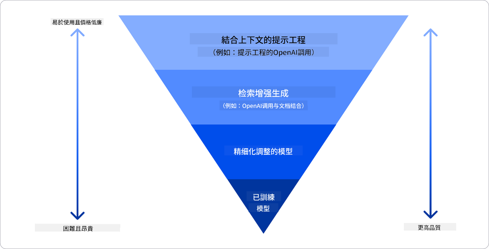

圖片來源：[企業部署 LLM 的四種方式 | Fiddler AI Blog](https://www.fiddler.ai/blog/four-ways-that-enterprises-deploy-llms?WT.mc_id=academic-105485-koreyst)

### 使用上下文的提示工程

預訓練的 LLM 在一般化的自然語言任務中表現非常好，即使只用一個簡短的提示來調用它們，比如要完成的句子或問題——所謂的“零次學習”。

然而，越是用戶能夠構建其查詢，並提供詳細的請求和示例——上下文——答案就越準確，越符合用戶的期望。在這種情況下，如果提示僅包含一個示例，我們稱之為“一次學習”，如果包含多個示例，則稱為“少次學習”。使用上下文的提示工程是啟動的最具成本效益的方法。

### 檢索增強生成 (RAG)

LLM 的限制在於它們只能使用在訓練期間使用的數據來生成答案。這意味著它們對訓練過程後發生的事實一無所知，並且不能訪問非公共信息（如公司數據）。
這可以通過 RAG 克服，這是一種技術，通過文檔塊形式的外部數據來增強提示，考慮提示長度限制。這由向量數據庫工具支持（如 [Azure Vector Search](https://learn.microsoft.com/azure/search/vector-search-overview?WT.mc_id=academic-105485-koreyst)）從各種預定義數據源中檢索有用的數據塊並將它們添加到提示上下文中。

當企業沒有足夠的數據、時間或資源來微調 LLM，但仍希望改善特定工作負載的性能並降低虛構風險（即現實或有害內容的神秘化）時，這種技術非常有幫助。

### 微調模型

微調是一個利用遷移學習的過程，用於“適應”模型到下游任務或解決特定問題。與少次學習和 RAG 不同，它生成了一個新模型，並更新了權重和偏差。它需要一組訓練示例，包含單個輸入（提示）及其相關輸出（完成）。
如果符合以下情況，這將是首選方法：

- **使用微調模型**。企業希望使用微調的能力較弱的模型（如嵌入模型）而不是高性能模型，從而實現更具成本效益和快速的解決方案。

- **考慮延遲**。延遲對於特定用例很重要，因此不能使用非常長的提示或模型應學習的示例數量不符合提示長度限制。

- **保持最新**。企業擁有大量高質量數據和真實標籤，以及保持這些數據隨時間更新所需的資源。

### 訓練模型

從零開始訓練 LLM無疑是最困難且最複雜的方法，需要大量數據、熟練的資源和適當的計算能力。只有在企業擁有特定領域的用例和大量領域中心數據的情況下，才應考慮此選項。

## 知識檢查

改善 LLM 完成結果的好方法是什麼？

1. 使用上下文的提示工程
1. RAG
1. 微調模型

A:3，如果您有時間和資源以及高質量數據，微調是保持最新的更好選擇。然而，如果您想改善事物而時間不足，值得先考慮 RAG。

## 🚀 挑戰

閱讀更多關於如何[使用 RAG](https://learn.microsoft.com/azure/search/retrieval-augmented-generation-overview?WT.mc_id=academic-105485-koreyst)來改善您的業務。

## 出色的工作，繼續學習

完成本課程後，查看我們的[生成式 AI 學習集合](https://aka.ms/genai-collection?WT.mc_id=academic-105485-koreyst)以繼續提升您的生成式 AI 知識！

前往第 3 課，我們將研究如何[負責任地使用生成式 AI](../03-using-generative-ai-responsibly/README.md?WT.mc_id=academic-105485-koreyst)！

**免責聲明**：
本文件使用 AI 翻譯服務 [Co-op Translator](https://github.com/Azure/co-op-translator) 進行翻譯。儘管我們努力確保準確性，但請注意，自動翻譯可能包含錯誤或不準確之處。應將原始文件視為權威來源。對於關鍵信息，建議使用專業人工翻譯。我們不對使用此翻譯而產生的任何誤解或誤讀承擔責任。