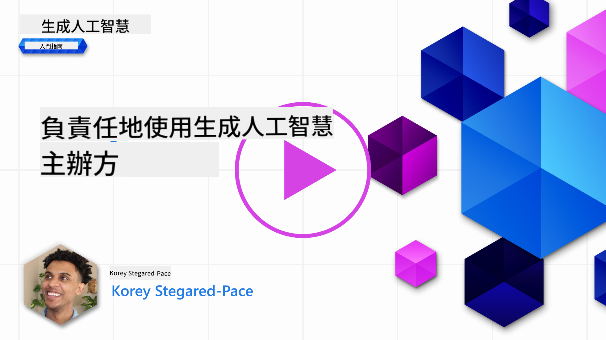
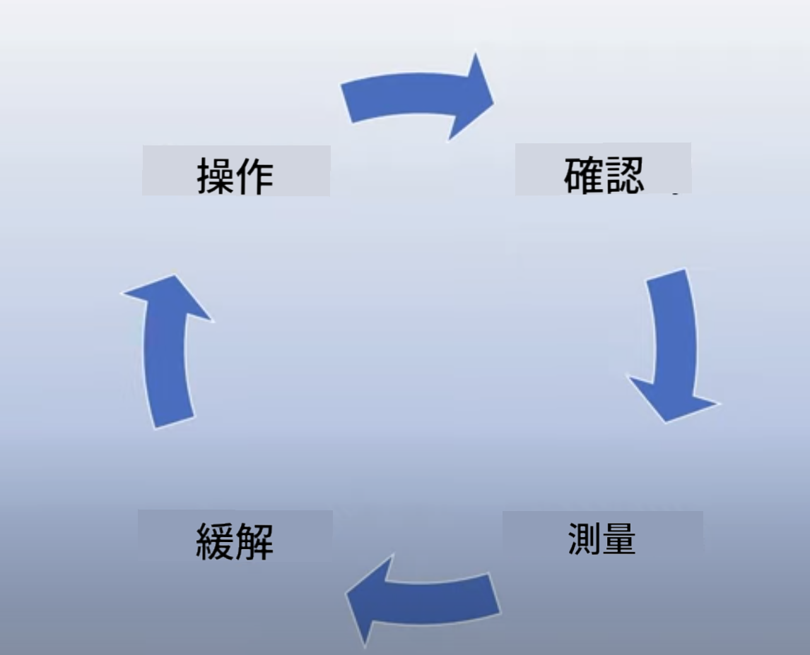
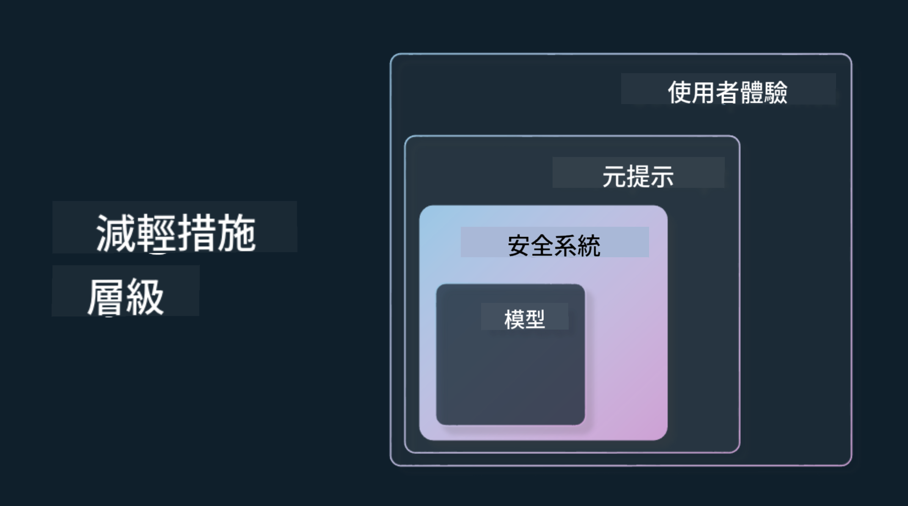

<!--
CO_OP_TRANSLATOR_METADATA:
{
  "original_hash": "13084c6321a2092841b9a081b29497ba",
  "translation_date": "2025-05-19T09:28:47+00:00",
  "source_file": "03-using-generative-ai-responsibly/README.md",
  "language_code": "tw"
}
-->
# 負責任地使用生成式AI

> _點擊上方圖片觀看本課程影片_

生成式AI讓人著迷很容易，但我們需要考慮如何負責任地使用它。你需要考慮如何確保輸出是公平的、無害的等等。本章旨在提供相關背景，告訴你應該考慮什麼，以及如何積極採取措施改善你的AI使用。

## 介紹

本課程將涵蓋：

- 為什麼在構建生成式AI應用程式時應優先考慮負責任的AI。
- 負責任AI的核心原則以及它們與生成式AI的關係。
- 如何通過策略和工具將這些負責任AI原則付諸實踐。

## 學習目標

完成本課程後，你將了解：

- 在構建生成式AI應用程式時負責任AI的重要性。
- 何時應考慮並應用負責任AI的核心原則。
- 可用於實踐負責任AI概念的工具和策略。

## 負責任AI原則

生成式AI的興奮程度從未如此高漲。這種興奮吸引了許多新的開發者、關注和資金。雖然這對於任何想要使用生成式AI構建產品和公司的人來說都是非常積極的，但我們也必須負責任地前進。

在整個課程中，我們專注於構建我們的初創公司和AI教育產品。我們將使用負責任AI的原則：公平性、包容性、可靠性/安全性、安全性與隱私、透明性和問責制。通過這些原則，我們將探索它們如何與我們在產品中使用生成式AI相關。

## 為什麼應優先考慮負責任AI

在構建產品時，以人為中心的方法，考慮用戶的最佳利益，通常能帶來最佳結果。

生成式AI的獨特之處在於其能為用戶創造有用的答案、信息、指導和內容的能力。這可以在不需要太多手動步驟的情況下完成，從而產生非常令人印象深刻的結果。沒有適當的規劃和策略，也可能會對用戶、產品和整個社會造成一些有害的結果。

讓我們來看看其中一些（但不是全部）潛在的有害結果：

### 幻覺

幻覺是一個用來描述當LLM產生的內容完全無意義或我們知道根據其他信息來源事實上是錯誤的時候。

舉個例子，我們為我們的初創公司建立了一個功能，允許學生向模型提問歷史問題。一位學生問了問題`Who was the sole survivor of Titanic?`

模型產生了一個如下的回應：

> _(來源：[Flying bisons](https://flyingbisons.com?WT.mc_id=academic-105485-koreyst))_

這是一個非常自信和詳細的答案。不幸的是，這是錯誤的。即使進行少量研究，也會發現鐵達尼號災難中有不止一位倖存者。對於剛開始研究這個主題的學生來說，這個答案可能足夠有說服力而不被質疑並被當作事實對待。這可能導致AI系統不可靠，並對我們的初創公司聲譽產生負面影響。

隨著任何給定LLM的每次迭代，我們看到在減少幻覺方面的性能改進。即使有這種改進，我們作為應用程式的構建者和用戶仍然需要保持對這些限制的認識。

### 有害內容

我們在前一節中討論了當LLM產生錯誤或無意義的回應時。另一個需要注意的風險是當模型回應有害內容時。

有害內容可以被定義為：

- 提供自我傷害或對某些群體的傷害的指導或鼓勵。
- 仇恨或貶低的內容。
- 指導計劃任何類型的攻擊或暴力行為。
- 提供如何查找非法內容或進行非法行為的指導。
- 顯示性露骨的內容。

對於我們的初創公司，我們希望確保擁有合適的工具和策略來防止這類內容被學生看到。

### 缺乏公平性

公平性被定義為“確保AI系統沒有偏見和歧視，並且公平地對待每個人。”在生成式AI的世界中，我們希望確保不排除邊緣化群體的世界觀不會被模型的輸出所加強。

這些類型的輸出不僅對於為用戶構建積極的產品體驗是有害的，還會對社會造成進一步的傷害。作為應用程式的構建者，我們在使用生成式AI構建解決方案時，應始終考慮廣泛和多樣化的用戶群體。

## 如何負責任地使用生成式AI

既然我們已經確定了負責任生成式AI的重要性，讓我們來看看可以採取的4個步驟，以負責任地構建我們的AI解決方案：

### 測量潛在的危害

在軟體測試中，我們測試用戶在應用程式上的預期行為。同樣，測試用戶最可能使用的多樣化提示集是測量潛在危害的好方法。

由於我們的初創公司正在構建一個教育產品，準備一份與教育相關的提示清單會很好。這可以涵蓋某個主題、歷史事實和有關學生生活的提示。

### 緩解潛在的危害

現在是時候找到方法來防止或限制模型及其回應造成的潛在危害。我們可以從4個不同的層面來看待這個問題：

- **模型**。選擇合適的模型來適應合適的用例。較大和更複雜的模型如GPT-4在應用於較小和更具體的用例時可能會帶來更多有害內容的風險。使用你的訓練數據進行微調也可以減少有害內容的風險。

- **安全系統**。安全系統是在服務模型的平台上減少危害的一組工具和配置。例如，Azure OpenAI服務上的內容過濾系統。系統還應該能夠檢測越獄攻擊和不需要的活動，如來自機器人的請求。

- **Metaprompt**。Metaprompts和grounding是我們可以根據某些行為和信息引導或限制模型的方法。這可以是使用系統輸入來定義模型的某些限制。此外，提供更符合系統範圍或領域的輸出。

這也可以使用檢索增強生成（RAG）等技術，讓模型僅從選擇的可信來源提取信息。本課程後面有一節專門用於[構建搜索應用程式](../08-building-search-applications/README.md?WT.mc_id=academic-105485-koreyst)

- **用戶體驗**。最終層是用戶以某種方式通過我們應用程式的界面直接與模型交互。在這種方式下，我們可以設計UI/UX來限制用戶可以發送給模型的輸入類型以及顯示給用戶的文本或圖像。在部署AI應用程式時，我們也必須透明地說明我們的生成式AI應用程式可以和不能做什麼。

我們有一整節課專門用於[設計AI應用程式的用戶體驗](../12-designing-ux-for-ai-applications/README.md?WT.mc_id=academic-105485-koreyst)

- **評估模型**。與LLM合作可能具有挑戰性，因為我們不總是能夠控制模型訓練時使用的數據。無論如何，我們應該始終評估模型的性能和輸出。測量模型的準確性、相似性、基礎性和輸出的相關性仍然很重要。這有助於為利益相關者和用戶提供透明性和信任。

### 運行負責任的生成式AI解決方案

在你的AI應用程式周圍建立運營實踐是最後一個階段。這包括與我們初創公司的其他部門如法律和安全合作，以確保我們符合所有法規政策。在上線之前，我們還希望圍繞交付、處理事件和回滾建立計劃，以防止對用戶造成任何傷害。

## 工具

雖然開發負責任AI解決方案的工作看起來很多，但這是值得付出的努力。隨著生成式AI領域的增長，更多幫助開發者高效將責任融入工作流程的工具將會成熟。例如，[Azure AI內容安全](https://learn.microsoft.com/azure/ai-services/content-safety/overview?WT.mc_id=academic-105485-koreyst)可以通過API請求幫助檢測有害內容和圖像。

## 知識檢查

為確保負責任的AI使用，你需要關心哪些事情？

1. 答案是否正確。
2. 有害使用，AI不被用於犯罪目的。
3. 確保AI沒有偏見和歧視。

A: 2和3是正確的。負責任AI幫助你考慮如何減少有害影響和偏見等。

## 🚀 挑戰

閱讀[Azure AI內容安全](https://learn.microsoft.com/azure/ai-services/content-safety/overview?WT.mc_id=academic-105485-koreyst)並看看你能採用哪些內容。

## 出色的工作，繼續學習

完成本課程後，查看我們的[生成式AI學習集合](https://aka.ms/genai-collection?WT.mc_id=academic-105485-koreyst)以繼續提升你的生成式AI知識！

前往第4課，我們將學習[提示工程基礎](../04-prompt-engineering-fundamentals/README.md?WT.mc_id=academic-105485-koreyst)！

**免責聲明**：
本文件使用AI翻譯服務[Co-op Translator](https://github.com/Azure/co-op-translator)進行翻譯。儘管我們努力確保準確性，但請注意自動翻譯可能包含錯誤或不精確之處。原始文件的母語版本應被視為權威來源。對於關鍵信息，建議使用專業人工翻譯。我們對於使用此翻譯所產生的任何誤解或誤釋不承擔責任。