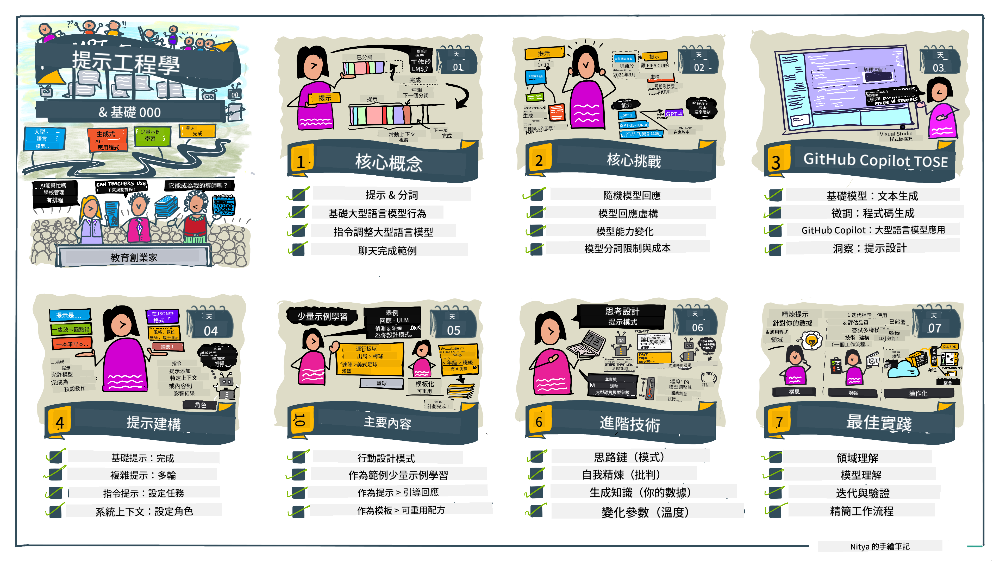
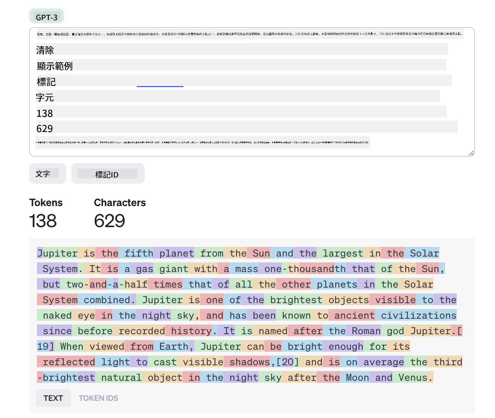
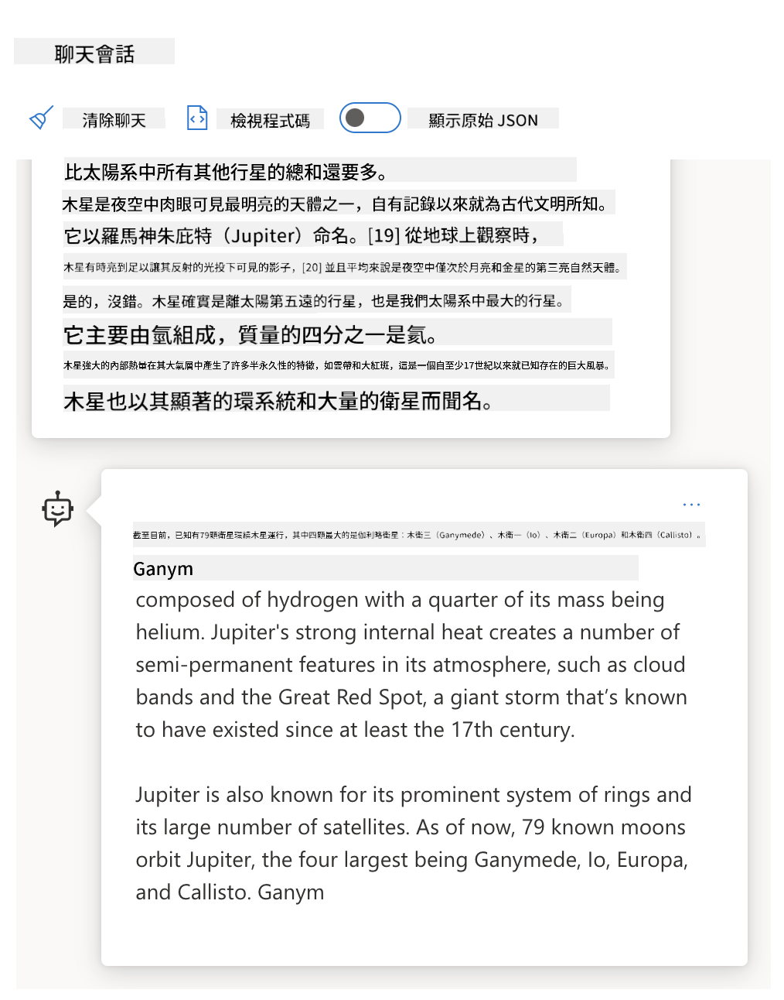
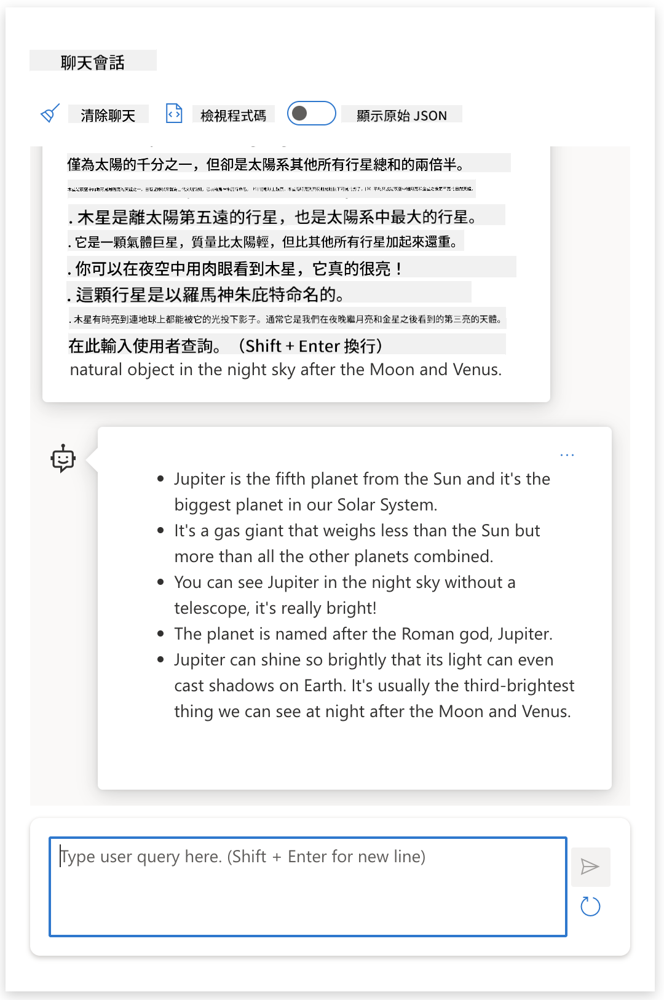
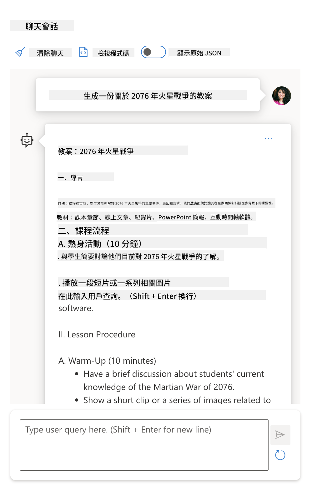
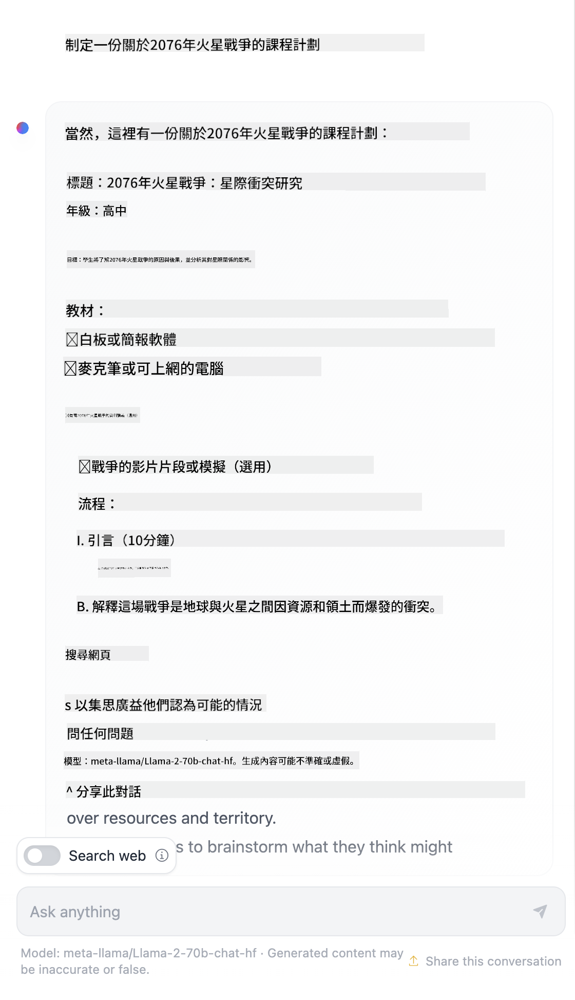

<!--
CO_OP_TRANSLATOR_METADATA:
{
  "original_hash": "dcbaaae026cb50fee071e690685b5843",
  "translation_date": "2025-08-26T14:59:35+00:00",
  "source_file": "04-prompt-engineering-fundamentals/README.md",
  "language_code": "tw"
}
-->
# 提示工程基礎

[](https://aka.ms/gen-ai-lesson4-gh?WT.mc_id=academic-105485-koreyst)

## 介紹
本單元將介紹在生成式 AI 模型中，如何撰寫有效提示的基本概念與技巧。你寫給 LLM 的提示內容也很重要。精心設計的提示能帶來更高品質的回應。但什麼是 _提示_ 和 _提示工程_？又該如何優化送給 LLM 的提示 _輸入_？這些問題，我們會在本章和下一章中一起解答。

_生成式 AI_ 能根據使用者的請求，產生全新的內容（例如文字、圖片、音訊、程式碼等）。這是透過像 OpenAI 的 GPT（"Generative Pre-trained Transformer"）系列這類 _大型語言模型_，以自然語言和程式碼訓練而成。

現在，使用者可以用聊天等熟悉的方式與這些模型互動，無需任何技術背景或訓練。這些模型是 _以提示為基礎_ 的——使用者傳送一段文字輸入（提示），AI 回傳回應（完成）。接著可以反覆「與 AI 對話」，多輪調整提示，直到回應符合預期。

「提示」已成為生成式 AI 應用的主要 _程式介面_，用來告訴模型該做什麼，並影響回應品質。「提示工程」是一個快速成長的領域，專注於 _設計與優化_ 提示，以大規模產出穩定且高品質的回應。

## 學習目標

在這堂課中，我們會學習什麼是提示工程、為什麼它很重要，以及如何針對特定模型和應用目標設計更有效的提示。我們會理解提示工程的核心概念與最佳實踐，並認識一個互動式 Jupyter Notebooks「沙盒」環境，實際觀察這些概念如何應用在真實案例上。

完成本課程後，你將能夠：

1. 解釋什麼是提示工程，以及它的重要性。
2. 說明提示的組成要素及其用途。
3. 學習提示工程的最佳實踐與技巧。
4. 將所學技巧應用於真實案例，並透過 OpenAI 端點實作。

## 關鍵詞彙

提示工程：設計與優化輸入，引導 AI 模型產生期望輸出的實踐方法。
分詞（Tokenization）：將文字轉換為模型可理解與處理的較小單位（token）的過程。
指令微調 LLM（Instruction-Tuned LLMs）：經過特定指令微調，以提升回應準確性與相關性的 LLM。

## 學習沙盒

目前，提示工程更像是一門藝術而非科學。提升直覺的最佳方式就是 _多加練習_，並採用反覆試驗的方法，結合應用領域專業知識、建議技巧與模型專屬優化。

本課程附帶的 Jupyter Notebook 提供一個 _沙盒_ 環境，讓你可以邊學邊試，或在最後的程式挑戰中練習。執行練習時，你需要：

1. **Azure OpenAI API 金鑰**——已部署 LLM 的服務端點。
2. **Python 執行環境**——可執行 Notebook。
3. **本地環境變數**——_請先完成 [SETUP](./../00-course-setup/02-setup-local.md?WT.mc_id=academic-105485-koreyst) 步驟，做好準備_。

Notebook 內建 _入門_ 練習——但也鼓勵你自行新增 _Markdown_（說明）和 _Code_（提示請求）區塊，嘗試更多範例或想法，培養設計提示的直覺。

## 圖解導覽

想在開始前先掌握本課重點？可以參考這份圖解導覽，快速了解涵蓋的主題與每個主題的重點思考。課程地圖會帶你從理解核心概念與挑戰，到學會如何用相關的提示工程技巧與最佳實踐來解決。請注意，導覽中的「進階技巧」部分，內容會在本課程的 _下一章_ 詳細說明。



## 我們的新創任務

現在，來談談 _這個主題_ 如何與我們「[將 AI 創新帶入教育](https://educationblog.microsoft.com/2023/06/collaborating-to-bring-ai-innovation-to-education?WT.mc_id=academic-105485-koreyst)」的新創使命相關。我們想打造以 AI 為核心的 _個人化學習_ 應用——那麼，想想我們的應用中，不同使用者會如何「設計」提示：

- **管理者** 可能會請 AI _分析課程資料，找出內容缺口_。AI 可以摘要結果，或用程式碼視覺化。
- **教師** 可能會請 AI _針對特定對象與主題產生教案_。AI 能以指定格式建立個人化教案。
- **學生** 可能會請 AI _輔導他們學習困難科目_。AI 能根據學生程度，提供課程、提示與範例。

這只是冰山一角。歡迎參考 [Prompts For Education](https://github.com/microsoft/prompts-for-edu/tree/main?WT.mc_id=academic-105485-koreyst)——由教育專家策劃的開源提示庫，了解更多可能性！_試著在沙盒或 OpenAI Playground 執行這些提示，看看會發生什麼事！_

<!--
LESSON TEMPLATE:
This unit should cover core concept #1.
Reinforce the concept with examples and references.

CONCEPT #1:
Prompt Engineering.
Define it and explain why it is needed.
-->

## 什麼是提示工程？

我們在本課一開始就將 **提示工程** 定義為 _設計與優化_ 文字輸入（提示），以便針對特定應用目標與模型，產生穩定且高品質回應（完成）的過程。可以將這視為兩個步驟：

- 針對特定模型與目標，_設計_ 初始提示
- 反覆 _優化_ 提示，以提升回應品質

這本質上是一個需要用戶直覺與努力的反覆試驗過程，才能獲得最佳結果。那麼，為什麼這很重要？要回答這個問題，先要理解三個概念：

- _分詞（Tokenization）_ = 模型如何「看見」提示
- _基礎 LLM_ = 基礎模型如何「處理」提示
- _指令微調 LLM_ = 模型如何看見「任務」

### 分詞（Tokenization）

LLM 將提示視為 _一連串的 token_，而不同模型（或同一模型的不同版本）可能會用不同方式將同一提示分詞。由於 LLM 是以 token（而非原始文字）訓練的，提示如何被分詞，會直接影響生成回應的品質。

想體驗分詞的運作方式，可以試試像 [OpenAI Tokenizer](https://platform.openai.com/tokenizer?WT.mc_id=academic-105485-koreyst) 這類工具。將你的提示貼上，觀察它如何被轉換成 token，特別注意空白字元與標點符號的處理。注意，這個例子展示的是舊版 LLM（GPT-3），用新版模型可能會有不同結果。



### 概念：基礎模型

當提示被分詞後，「[基礎 LLM](https://blog.gopenai.com/an-introduction-to-base-and-instruction-tuned-large-language-models-8de102c785a6?WT.mc_id=academic-105485-koreyst)」（或稱 Foundation model）的主要功能，就是預測這個序列中的下一個 token。由於 LLM 是以大量文本資料集訓練，因此對 token 之間的統計關係有很好的掌握，能有信心地做出預測。請注意，模型並不理解提示或 token 的 _意義_；它只是在模式中「補齊」下一個預測。模型會持續預測，直到用戶中斷或達到預設條件。

想看看基於提示的補全如何運作嗎？將上述提示輸入 Azure OpenAI Studio 的 [_Chat Playground_](https://oai.azure.com/playground?WT.mc_id=academic-105485-koreyst)，使用預設設定。系統會將提示視為資訊請求——你應該會看到一個符合情境的回應。

但如果用戶想看到符合特定條件或任務目標的內容呢？這時就需要 _指令微調_ 的 LLM。



### 概念：指令微調 LLM

[指令微調 LLM](https://blog.gopenai.com/an-introduction-to-base-and-instruction-tuned-large-language-models-8de102c785a6?WT.mc_id=academic-105485-koreyst) 是在基礎模型的基礎上，透過範例或輸入/輸出配對（例如多輪「訊息」）進行微調，這些配對可以包含明確的指令——AI 的回應會嘗試遵循這些指令。

這會用到像「人類回饋強化學習（RLHF）」等技術，讓模型能 _遵循指令_ 並 _從回饋中學習_，產生更適合實際應用、也更貼近用戶目標的回應。

來試試看——重複前面的提示，但這次將 _system message_ 改為以下指令作為情境：

> _請將你收到的內容摘要給二年級學生。結果請保持在一段文字，並列出 3-5 個重點。_

你會發現，現在的回應已經針對目標與格式做了調整。教師可以直接將這個回應用在課堂簡報中。



## 為什麼需要提示工程？

現在我們知道 LLM 如何處理提示，來談談 _為什麼_ 需要提示工程。原因在於，目前的 LLM 存在許多挑戰，若不花心思設計與優化提示，就很難獲得 _穩定且一致_ 的回應。例如：

1. **模型回應具有隨機性。** _同一個提示_ 在不同模型或模型版本下，可能產生不同回應。甚至在 _同一模型_ 不同時間也可能有不同結果。_提示工程技巧能幫助我們用更好的設計來減少這些變異_。

1. **模型可能會捏造內容。** 模型是用 _大量但有限_ 的資料集訓練，因此對訓練範圍外的知識一無所知。結果可能產生不正確、虛構，甚至與已知事實相矛盾的回應。_提示工程技巧能幫助用戶辨識並減少這類捏造，例如要求 AI 提供出處或推理過程_。

1. **模型能力會有差異。** 新一代模型功能更強大，但也帶來成本、複雜度等新挑戰。_提示工程能幫助我們建立最佳實踐與工作流程，抽象化差異，並以可擴展、無縫的方式適應不同模型需求_。

來實際體驗一下，在 OpenAI 或 Azure OpenAI Playground 操作：

- 用同一個提示，搭配不同 LLM 部署（如 OpenAI、Azure OpenAI、Hugging Face）——你有發現差異嗎？
- 用同一個提示，重複在 _同一_ LLM 部署（如 Azure OpenAI playground）執行——這些差異有什麼不同？

### 捏造內容範例

在本課程中，我們用 **「捏造內容」** 來描述 LLM 有時會因訓練限制或其他因素，產生事實錯誤資訊的現象。你可能也在文章或論文中看過 _「幻覺」_ 這個詞。不過，我們強烈建議用 _「捏造內容」_，避免將這種機器行為誤認為人類特質。這也呼應 [負責任 AI 指南](https://www.microsoft.com/ai/responsible-ai?WT.mc_id=academic-105485-koreyst) 的用詞，避免在某些情境下使用可能具冒犯性或不包容的詞彙。

想體驗捏造內容的情形嗎？可以設計一個提示，要求 AI 針對不存在的主題產生內容（確保訓練資料集中找不到）。例如——我試過這個提示：
# 火星戰爭 2076 年課程計畫

## 課程目標

- 了解火星戰爭的起因、過程與影響
- 探討人類在外星殖民地的衝突與合作
- 分析科技在戰爭中的角色
- 培養批判性思考與歷史分析能力

## 課程大綱

### 1. 火星戰爭的背景

- 火星殖民地的建立
- 地球與火星之間的緊張關係
- 資源爭奪與政治分歧

### 2. 戰爭爆發

- 2076 年主要事件回顧
- 重要人物與派系介紹
- 關鍵戰役與策略

### 3. 科技與戰爭

- 人工智慧、機器人與無人機的運用
- 通訊與情報技術
- 武器發展與防禦系統

### 4. 戰爭的影響

- 火星社會的改變
- 地球與火星的關係重塑
- 對未來太空探索的啟示

### 5. 小組討論與活動

- 分組討論：如果你是火星居民，會如何面對戰爭？
- 模擬談判：地球與火星的和平協議
- 創意寫作：描寫一名火星戰爭士兵的日記

## 教學資源

- 2076 年火星戰爭年表
- 相關影片與紀錄片
- 重要人物傳記
- 科技發展資料

## 評量方式

- 小組報告
- 個人心得寫作
- 課堂參與與討論

## 延伸學習

- 研究其他星球的衝突案例
- 探討太空法與國際關係
- 分析科技進步對人類社會的影響

<!--
這份課程計畫適合高中或大學歷史、社會科學、科技相關課程使用。可依據學生程度調整內容深度。
-->
網路搜尋顯示，雖然有一些虛構的火星戰爭故事（例如電視劇或小說），但沒有發生在2076年。常識也告訴我們，2076年是「未來」的年份，因此不可能與真實事件有關。

那麼，當我們用不同的 LLM 供應商執行這個提示時會發生什麼事呢？

> **回應 1**：OpenAI Playground（GPT-35）


> **回應 2**：Azure OpenAI Playground（GPT-35）



> **回應 3**：Hugging Face Chat Playground（LLama-2）



如預期，每個模型（或模型版本）都會因隨機性和能力差異而產生略有不同的回應。例如，有的模型針對國中生，有的則假設是高中生。但三個模型都產生了足以讓不知情的使用者相信事件真實存在的回應。

像 _metaprompting_ 和 _temperature configuration_ 這類提示工程技巧，確實能在一定程度上減少模型虛構內容。新的提示工程「架構」也將各種工具和技術無縫整合進提示流程，以減輕或減少這些現象。

## 案例研究：GitHub Copilot

我們用一個案例來結束這一節，看看提示工程在真實世界解決方案中的應用：[GitHub Copilot](https://github.com/features/copilot?WT.mc_id=academic-105485-koreyst)。

GitHub Copilot 是你的「AI 程式夥伴」——它能將文字提示轉換成程式碼補全，並整合進你的開發環境（例如 Visual Studio Code），讓使用體驗更流暢。根據下方系列部落格的記載，最早的版本是基於 OpenAI Codex 模型，工程師很快就意識到需要微調模型並開發更好的提示工程技巧，以提升程式碼品質。到了七月，他們[推出了比 Codex 更強大的 AI 模型](https://github.blog/2023-07-28-smarter-more-efficient-coding-github-copilot-goes-beyond-codex-with-improved-ai-model/?WT.mc_id=academic-105485-koreyst)，建議速度更快。

建議依序閱讀這些文章，跟著他們的學習歷程。

- **2023年5月** | [GitHub Copilot 更懂你的程式碼了](https://github.blog/2023-05-17-how-github-copilot-is-getting-better-at-understanding-your-code/?WT.mc_id=academic-105485-koreyst)
- **2023年5月** | [GitHub 內部：與 GitHub Copilot 背後的 LLMs 合作](https://github.blog/2023-05-17-inside-github-working-with-the-llms-behind-github-copilot/?WT.mc_id=academic-105485-koreyst)
- **2023年6月** | [如何為 GitHub Copilot 撰寫更好的提示](https://github.blog/2023-06-20-how-to-write-better-prompts-for-github-copilot/?WT.mc_id=academic-105485-koreyst)
- **2023年7月** | [GitHub Copilot 超越 Codex，AI 模型再升級](https://github.blog/2023-07-28-smarter-more-efficient-coding-github-copilot-goes-beyond-codex-with-improved-ai-model/?WT.mc_id=academic-105485-koreyst)
- **2023年7月** | [開發者的提示工程與 LLMs 指南](https://github.blog/2023-07-17-prompt-engineering-guide-generative-ai-llms/?WT.mc_id=academic-105485-koreyst)
- **2023年9月** | [如何打造企業級 LLM 應用：GitHub Copilot 的經驗](https://github.blog/2023-09-06-how-to-build-an-enterprise-llm-application-lessons-from-github-copilot/?WT.mc_id=academic-105485-koreyst)

你也可以瀏覽他們的[工程部落格](https://github.blog/category/engineering/?WT.mc_id=academic-105485-koreyst)，看看更多像[這篇](https://github.blog/2023-09-27-how-i-used-github-copilot-chat-to-build-a-reactjs-gallery-prototype/?WT.mc_id=academic-105485-koreyst)一樣，展示這些模型和技巧如何「實際應用」於真實世界的案例。

---

<!--
課程模板：
本單元應涵蓋核心概念 #2。
用範例和參考資料加強概念。

概念 #2：
提示設計。
用範例說明。
-->

## 提示建構

我們已經了解提示工程的重要性，現在來看看提示是如何「建構」的，以便評估不同技巧，設計更有效的提示。

### 基本提示

先從最基本的提示開始：只是一段文字輸入，沒有其他上下文。舉例來說，當我們將美國國歌的開頭幾個字送到 OpenAI [Completion API](https://platform.openai.com/docs/api-reference/completions?WT.mc_id=academic-105485-koreyst)，它會立刻「補全」後面的歌詞，展現基本的預測行為。

| 提示（輸入）         | 補全（輸出）                                                                                                                        |
| :------------------- | :---------------------------------------------------------------------------------------------------------------------------------- |
| Oh say can you see   | 看起來你正在輸入「The Star-Spangled Banner」的歌詞，也就是美國的國歌。完整歌詞如下…… |

### 複雜提示

現在我們在基本提示上加入上下文和指令。[Chat Completion API](https://learn.microsoft.com/azure/ai-services/openai/how-to/chatgpt?WT.mc_id=academic-105485-koreyst) 讓我們能以一組「訊息」來建構複雜提示，包括：

- 反映「使用者」輸入和「助手」回應的輸入/輸出配對。
- 系統訊息，用來設定助手的行為或個性。

請求格式如下，_tokenization_（分詞）會有效捕捉上下文和對話中的相關資訊。此時，改變系統上下文對補全品質的影響，可能和使用者輸入一樣大。

```python
response = openai.chat.completions.create(
    model="gpt-3.5-turbo",
    messages=[
        {"role": "system", "content": "You are a helpful assistant."},
        {"role": "user", "content": "Who won the world series in 2020?"},
        {"role": "assistant", "content": "The Los Angeles Dodgers won the World Series in 2020."},
        {"role": "user", "content": "Where was it played?"}
    ]
)
```

### 指令型提示

在上述範例中，使用者的提示只是簡單的文字查詢，可以被解讀為資訊請求。透過「指令型」提示，我們可以用文字更詳細地指定任務，給 AI 更明確的指引。舉例：

| 提示（輸入）                                                                                                                                                                                                                         | 補全（輸出）                                                                                                        | 指令類型            |
| :----------------------------------------------------------------------------------------------------------------------------------------------------------------------------------------------------------------------------------- | :------------------------------------------------------------------------------------------------------------------- | :------------------ |
| 請寫一段關於南北戰爭的描述                                                                                                                                                                                                           | _回傳一段簡單的文字_                                                                                                | 簡單                |
| 請寫一段關於南北戰爭的描述。請提供重要日期和事件並說明其意義                                                                                                                                                                         | _回傳一段文字，接著列出重要事件日期及說明_                                                                           | 複雜                |
| 請用一段文字描述南北戰爭。請用三個重點列出重要日期及其意義，再用三個重點列出重要歷史人物及其貢獻。請將結果以 JSON 檔案格式回傳。                                                           | _回傳更詳細的內容，並以可複製貼上的 JSON 格式呈現，可依需求驗證_                                                     | 複雜。格式化。      |

## 主要內容

在上述範例中，提示仍然相當開放，讓 LLM 自行決定其預訓練資料集中哪些內容相關。透過「主要內容」設計模式，輸入文字分為兩部分：

- 指令（動作）
- 相關內容（影響動作）

例如，指令是「請用兩句話摘要」。

| 提示（輸入）                                                                                                                                                                                                                                                                                                                                                                                                                                                                                                                                                                                                                                                                                      | 補全（輸出）                                                                                                                                                                                                                                                                             |
| :-------------------------------------------------------------------------------------------------------------------------------------------------------------------------------------------------------------------------------------------------------------------------------------------------------------------------------------------------------------------------------------------------------------------------------------------------------------------------------------------------------------------------------------------------------------------------------------------------------------------------------------------------------------------------------------------------- | :---------------------------------------------------------------------------------------------------------------------------------------------------------------------------------------------------------------------------------------------------------------------------------------------- |
| Jupiter is the fifth planet from the Sun and the largest in the Solar System. It is a gas giant with a mass one-thousandth that of the Sun, but two-and-a-half times that of all the other planets in the Solar System combined. Jupiter is one of the brightest objects visible to the naked eye in the night sky, and has been known to ancient civilizations since before recorded history. It is named after the Roman god Jupiter.[19] When viewed from Earth, Jupiter can be bright enough for its reflected light to cast visible shadows,[20] and is on average the third-brightest natural object in the night sky after the Moon and Venus. <br/> **Summarize this in 2 short sentences** | Jupiter 是太陽系中第五顆行星，也是最大的一顆，並且是夜空中最明亮的天體之一。它以羅馬神朱比特命名，是一顆氣體巨星，質量是其他所有行星總和的兩倍半。 |

主要內容段落可以用不同方式來提升指令效果：

- **範例**——不用明講要模型做什麼，而是給它幾個範例，讓它自己推斷規則。
- **提示線索**——在指令後加上「線索」，引導模型產生更相關的回應。
- **模板**——可重複使用的「配方」，有變數（placeholder），可根據不同情境填入資料。

接下來我們來看看這些技巧的實際應用。

### 使用範例

這種做法是用主要內容「餵給模型」一些期望的輸出範例，讓它自己推斷出想要的結果模式。根據範例數量，可以分為 zero-shot、one-shot、few-shot 等提示方式。

提示現在包含三個部分：

- 任務描述
- 幾個期望輸出的範例
- 新範例的開頭（隱含任務描述）

| 學習類型   | 提示（輸入）                                                                                                                                        | 補全（輸出）         |
| :--------- | :-------------------------------------------------------------------------------------------------------------------------------------------------- | :------------------- |
| Zero-shot  | "The Sun is Shining". Translate to Spanish                                                                                                          | "El Sol está brillando".    |
| One-shot   | "The Sun is Shining" => ""El Sol está brillando". <br> "It's a Cold and Windy Day" =>                                                               | "Es un día frío y ventoso". |
| Few-shot   | The player ran the bases => Baseball <br/> The player hit an ace => Tennis <br/> The player hit a six => Cricket <br/> The player made a slam-dunk => | Basketball                  |
|            |                                                                                                                                                     |                         |

可以看到，zero-shot 需要明確指令（「Translate to Spanish」），但 one-shot 範例中模型已能自行推斷。few-shot 範例則展示，增加範例數量能讓模型在沒有額外指令下更精確地推斷規則。

### 提示線索

另一種主要內容技巧是給模型「線索」而不是範例。這時我們用一小段反映期望回應格式的文字，給模型一個「起頭」，讓它順勢延續下去。

| 線索數量 | 提示（輸入）                                                                                                                                                                                                                                                                                                                                                                                                                                               | 補全（輸出）                                                                                                                                                                                                                                                                                       |
| :------- | :--------------------------------------------------------------------------------------------------------------------------------------------------------------------------------------------------------------------------------------------------------------------------------------------------------------------------------------------------------------------------------------------------------------------------------------------------------- | :------------------------------------------------------------------------------------------------------------------------------------------------------------------------------------------------------------------------------------------------------------------------------------------------ |
| 0        | Jupiter is the fifth planet from the Sun and the largest in the Solar System. It is a gas giant with a mass one-thousandth that of the Sun, but two-and-a-half times that of all the other planets in the Solar System combined. Jupiter is one of the brightest objects visible to the naked eye in the night sky, and has been known to ancient civilizations since before recorded history.

**摘要**                                       | 木星是太陽系中最大的行星，也是離太陽第五遠的行星。它是一顆氣體巨星，質量約為太陽的千分之一，但比其他所有行星加起來還重。古代文明很早就發現了木星，而且在夜空中很容易用肉眼看到。 |
| 1              | 木星是離太陽第五遠的行星，也是太陽系中最大的行星。它是一顆氣體巨星，質量約為太陽的千分之一，但比太陽系其他所有行星加起來還要重兩倍半。木星是夜空中最亮的天體之一，早在有文字記載之前，古代文明就已經認識木星。<br/>**摘要** <br/> 我們學到的是木星 | 是離太陽第五遠的行星，也是太陽系中最大的行星。它是一顆氣體巨星，質量約為太陽的千分之一，但比其他所有行星加起來還重兩倍半。它很容易用肉眼看到，並且自古以來就被人類認識。                        |
| 2              | 木星是離太陽第五遠的行星，也是太陽系中最大的行星。它是一顆氣體巨星，質量約為太陽的千分之一，但比太陽系其他所有行星加起來還要重兩倍半。木星是夜空中最亮的天體之一，早在有文字記載之前，古代文明就已經認識木星。<br/>**摘要** <br/> 我們學到的三大重點：         | 1. 木星是離太陽第五遠的行星，也是太陽系中最大的行星。<br/> 2. 它是一顆氣體巨星，質量約為太陽的千分之一...<br/> 3. 木星自古以來就能用肉眼看到 ...                                                                       |
|                |                                                                                                                                                                                                                                                                                                                                                                                                                                                              |                                                                                                                                                                                                                                                                                                           |

### 提示模板

提示模板是一種_預先定義好的提示配方_，可以儲存並重複使用，讓大規模用戶體驗更一致。最簡單的形式，就是像[OpenAI 這個範例](https://platform.openai.com/examples?WT.mc_id=academic-105485-koreyst)一樣，收集一組提示範例，包含互動提示元件（使用者和系統訊息）以及 API 請求格式，方便重複利用。

更進階的形式像[LangChain 這個範例](https://python.langchain.com/docs/concepts/prompt_templates/?WT.mc_id=academic-105485-koreyst)，它包含_佔位符_，可以用各種來源的資料（使用者輸入、系統情境、外部資料等）動態替換，生成提示。這讓我們能建立可重複使用的提示庫，程式化地大規模推動一致的用戶體驗。

最後，模板的真正價值在於能針對垂直應用領域建立並發佈_提示庫_——這時提示模板會根據特定應用情境或範例進行_最佳化_，讓回應更貼近目標用戶的需求與精確度。[Prompts For Edu](https://github.com/microsoft/prompts-for-edu?WT.mc_id=academic-105485-koreyst) 就是很好的例子，針對教育領域整理了一套提示庫，強調課程規劃、課綱設計、學生輔導等重點。

## 支援內容

如果我們把提示建構想成有一個指令（任務）和一個目標（主要內容），那麼_次要內容_就像是額外的情境，用來**影響輸出結果**。它可以是調整參數、格式指示、主題分類等，幫助模型_微調_回應，讓結果更符合用戶目標或期待。

舉例來說：假設有一份課程目錄，包含詳細的中繼資料（名稱、描述、等級、標籤、講師等）：

- 我們可以定義一個指令：「請摘要 2023 秋季課程目錄」
- 用主要內容提供幾個期望的輸出範例
- 用次要內容標示最重要的五個「標籤」

這樣，模型就能依照範例格式給出摘要——如果某個結果有多個標籤，也能優先顯示次要內容指定的五個標籤。

---

<!--
課程模板：
本單元應涵蓋核心概念 #1。
用範例和參考資料加強概念。

概念 #3：
提示工程技巧。
有哪些基本的提示工程技巧？
用練習題說明。
-->

## 提示最佳實踐

現在我們知道提示可以怎麼_建構_，接下來要思考如何_設計_提示，才能符合最佳實踐。可以分成兩個部分——正確的_心態_和合適的_技巧_。

### 提示工程心態

提示工程是一個反覆試驗的過程，請記住三個大原則：

1. **領域知識很重要。** 回應的準確性和相關性取決於應用或用戶所處的_領域_。運用你的直覺和專業知識，進一步**客製化技巧**。例如，在系統提示中定義_領域專屬的人格_，或在使用者提示中用_領域專屬模板_。提供反映領域情境的次要內容，或用_領域相關的線索和範例_引導模型產生熟悉的用法。

2. **模型理解很重要。** 我們知道模型本質上是隨機的。但不同模型的實作也會因訓練資料（預訓練知識）、功能（API 或 SDK）、優化內容（程式碼、圖片、文字等）而異。了解你使用的模型的優缺點，善用這些知識來_優先排序任務_或建立_客製化模板_，讓它發揮最大效能。

3. **反覆修正與驗證很重要。** 模型和提示工程技巧都在快速演進。身為領域專家，你可能有其他情境或標準是_你_的應用才需要的，未必適用於大眾。用提示工程工具和技巧「快速啟動」提示建構，然後反覆修正、用你的直覺和專業驗證結果。記錄心得，建立**知識庫**（如提示庫），讓其他人能以此為基礎，加速未來的迭代。

## 最佳實踐

以下是[OpenAI](https://help.openai.com/en/articles/6654000-best-practices-for-prompt-engineering-with-openai-api?WT.mc_id=academic-105485-koreyst) 和 [Azure OpenAI](https://learn.microsoft.com/azure/ai-services/openai/concepts/prompt-engineering#best-practices?WT.mc_id=academic-105485-koreyst) 專家推薦的常見最佳做法。

| 做法                              | 原因                                                                                                                                                                                                                                               |
| :-------------------------------- | :------------------------------------------------------------------------------------------------------------------------------------------------------------------------------------------------------------------------------------------------ |
| 評估最新模型。       | 新一代模型通常功能更強、品質更好——但可能成本更高。評估其影響，再決定是否要遷移。                                                                                |
| 分開指令與情境   | 看看你的模型或服務商是否有定義_分隔符_，能更清楚區分指令、主要內容和次要內容。這有助於模型更精確地分配權重。                                                         |
| 具體明確             | 詳細說明期望的情境、結果、長度、格式、風格等。這能提升回應的品質和一致性。把配方整理成可重複使用的模板。                                                          |
| 詳細描述，舉例      | 模型對「示範」方式反應更好。先用 `zero-shot`（只給指令，不給範例），再用 `few-shot`（給幾個期望的範例）微調。可用類比說明。 |
| 用線索引導完成 | 給模型一些開頭詞或片語，讓它有方向地產生回應。                                                                                                               |
| 重複強調                       | 有時需要對模型重複指令。可以在主要內容前後都給指令，或同時給指令和線索。反覆修正、驗證，找出有效方法。                                                         |
| 順序很重要                     | 呈現資訊給模型的順序會影響結果，甚至在學習範例中也會有「近期偏好」。多試幾種順序，找出最適合的。                                                               |
| 給模型「退路」           | 給模型一個_備用_回應，如果因故無法完成任務時可以用。這能降低模型產生錯誤或虛構回應的機率。                                                         |
|                                   |                                                                                                                                                                                                                                                   |

如同所有最佳實踐，請記得_實際效果會因模型、任務、領域而異_。把這些做法當作起點，反覆修正，找出最適合你的方法。隨著新模型和工具出現，持續檢視你的提示工程流程，重視流程的可擴展性和回應品質。

<!--
課程模板：
本單元如適用，應提供程式挑戰

挑戰：
連結到一份 Jupyter Notebook，指令只在註解中（程式碼區塊是空的）。

解答：
連結到 Notebook 的一份副本，已填入提示並執行，展示一個範例結果。
-->

## 作業

恭喜你！你已經完成本課程！現在是用真實範例來測試這些概念和技巧的時候了！

這次作業會用 Jupyter Notebook，讓你可以互動完成練習。你也可以自行新增 Markdown 或程式碼區塊，探索更多想法和技巧。

### 開始前，請 fork 這個 repo，然後

- （推薦）啟動 GitHub Codespaces
- （或）把 repo clone 到本機，用 Docker Desktop 執行
- （或）用你喜歡的 Notebook 執行環境開啟 Notebook。

### 接著，設定你的環境變數

- 在 repo 根目錄把 `.env.copy` 複製成 `.env`，並填入 `AZURE_OPENAI_API_KEY`、`AZURE_OPENAI_ENDPOINT` 和 `AZURE_OPENAI_DEPLOYMENT`。回到[學習沙盒區](../../../04-prompt-engineering-fundamentals/04-prompt-engineering-fundamentals)了解詳細做法。

### 然後，開啟 Jupyter Notebook

- 選擇執行核心。如果用前兩種方式，直接選 dev container 提供的預設 Python 3.10.x 核心即可。

一切準備就緒，可以開始練習了。這裡沒有_標準答案_——重點是透過反覆嘗試，建立對模型和應用領域的直覺。

_因此本課程沒有程式解答段落。Notebook 會有標題為「我的解答：」的 Markdown 區塊，展示一個範例結果供參考。_

 <!--
課程模板：
用摘要和自學資源結尾。
-->

## 知識檢查

以下哪一個提示符合合理的最佳實踐？

1. Show me an image of red car
2. Show me an image of red car of make Volvo and model XC90 parked by a cliff with the sun setting
3. Show me an image of red car of make Volvo and model XC90

A: 2，它是最好的提示，因為不只說明「要什麼」，還具體描述（不只是任何車，而是特定品牌和型號），也交代了整體情境。3 也不錯，因為描述很完整。

## 🚀 挑戰

試試看用「線索」技巧，提示：Complete the sentence "Show me an image of red car of make Volvo and "。看看模型怎麼回應，你會怎麼改進？

## 做得很好！繼續學習

想了解更多提示工程相關概念？請到[進階學習頁面](https://aka.ms/genai-collection?WT.mc_id=academic-105485-koreyst)探索更多資源。

接下來進入第 5 課，我們將探討[進階提示技巧](../05-advanced-prompts/README.md?WT.mc_id=academic-105485-koreyst)！

---

**免責聲明**：  
本文件是使用 AI 翻譯服務 [Co-op Translator](https://github.com/Azure/co-op-translator) 進行翻譯。雖然我們力求準確，但請注意，自動翻譯可能包含錯誤或不精確之處。原始語言的文件應視為具權威性的來源。對於重要資訊，建議採用專業人工翻譯。因使用本翻譯而產生的任何誤解或誤釋，我們概不負責。