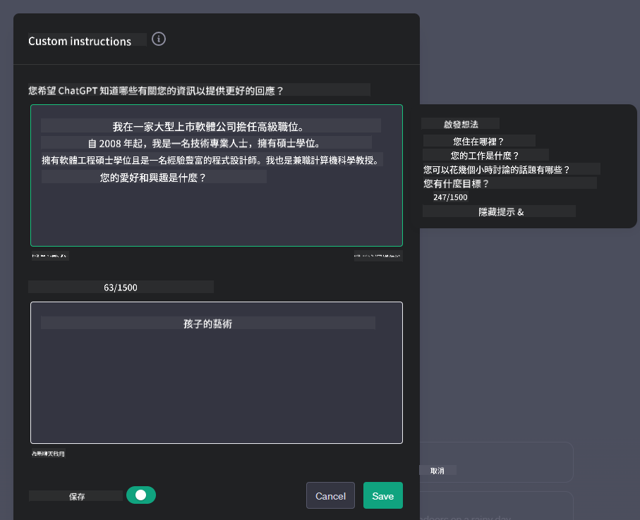
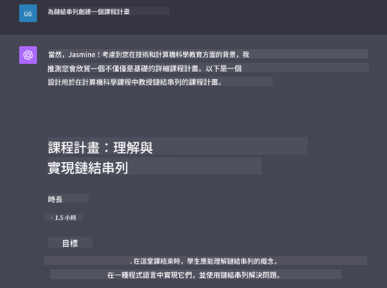

<!--
CO_OP_TRANSLATOR_METADATA:
{
  "original_hash": "ea4bbe640847aafbbba14dae4625e9af",
  "translation_date": "2025-05-19T10:16:16+00:00",
  "source_file": "07-building-chat-applications/README.md",
  "language_code": "tw"
}
-->
# 建立生成式 AI 驅動的聊天應用程式

[](https://aka.ms/gen-ai-lessons7-gh?WT.mc_id=academic-105485-koreyst)

> _(點擊上方圖片觀看本課程影片)_

現在我們已經了解如何建立文本生成應用程式，讓我們來看看聊天應用程式。

聊天應用程式已成為我們日常生活的一部分，不僅僅是提供休閒對話的工具。它們是客戶服務、技術支援，甚至是高級諮詢系統的重要組成部分。很可能不久前您就曾從聊天應用程式中獲得過幫助。隨著我們將生成式 AI 等先進技術整合到這些平台中，複雜性增加，挑戰也隨之而來。

我們需要回答的一些問題是：

- **建立應用程式**。我們如何有效地建立並無縫整合這些 AI 驅動的應用程式以滿足特定的使用案例？
- **監控**。一旦部署後，我們如何監控並確保應用程式在功能和遵循[負責任 AI 的六大原則](https://www.microsoft.com/ai/responsible-ai?WT.mc_id=academic-105485-koreyst)方面的高品質運行？

隨著我們進入由自動化和無縫人機互動定義的時代，了解生成式 AI 如何轉變聊天應用程式的範疇、深度和適應性變得至關重要。本課程將探討支持這些複雜系統的架構方面，深入研究為特定領域任務進行微調的方法論，並評估確保負責任 AI 部署的指標和考量。

## 介紹

本課程涵蓋：

- 高效構建和整合聊天應用程式的技術。
- 如何對應用程式進行定制和微調。
- 有效監控聊天應用程式的策略和考量。

## 學習目標

完成本課程後，您將能夠：

- 描述將聊天應用程式構建並整合到現有系統中的考量。
- 為特定使用案例定制聊天應用程式。
- 識別關鍵指標和考量，以有效監控和維護 AI 驅動的聊天應用程式的品質。
- 確保聊天應用程式負責任地利用 AI。

## 將生成式 AI 整合到聊天應用程式中

透過生成式 AI 提升聊天應用程式不僅僅是讓它們更智能；還涉及優化其架構、性能和用戶界面以提供優質的用戶體驗。這涉及調查架構基礎、API 整合和用戶界面考量。本節旨在為您提供一個全面的路線圖，以便您無論是將它們插入現有系統還是將其構建為獨立平台，都能夠導航這些複雜的環境。

在本節結束時，您將具備有效構建和整合聊天應用程式所需的專業知識。

### 聊天機器人還是聊天應用程式？

在我們深入研究聊天應用程式之前，讓我們比較「聊天機器人」和「AI 驅動的聊天應用程式」，它們擔任不同的角色和功能。聊天機器人的主要目的是自動化特定的對話任務，例如回答常見問題或跟踪包裹。它通常由基於規則的邏輯或複雜的 AI 算法驅動。相比之下，AI 驅動的聊天應用程式是一個更廣泛的環境，旨在促進人類用戶之間的各種形式的數字通信，例如文本、語音和視頻聊天。其定義特徵是整合了一個生成式 AI 模型，能夠模擬細緻入微的、類人對話，根據各種輸入和上下文提示生成回應。生成式 AI 驅動的聊天應用程式可以參與開放領域的討論，適應不斷變化的對話上下文，甚至生成創意或複雜的對話。

下表列出了關鍵差異和相似之處，以幫助我們理解它們在數字通信中的獨特角色。

| 聊天機器人                         | 生成式 AI 驅動的聊天應用程式           |
| ---------------------------------- | ------------------------------------ |
| 任務導向和基於規則                 | 上下文感知                           |
| 通常整合到更大的系統中             | 可能承載一個或多個聊天機器人          |
| 限於程式化功能                     | 包含生成式 AI 模型                   |
| 專門化和結構化的互動               | 能夠進行開放領域的討論               |

### 利用 SDK 和 API 的預建功能

在構建聊天應用程式時，第一步是評估現有的資源。使用 SDK 和 API 構建聊天應用程式是一種有利的策略，原因有多種。透過整合文檔齊全的 SDK 和 API，您正在策略性地為應用程式的長期成功定位，解決可擴展性和維護問題。

- **加速開發過程並減少開銷**：依賴預建功能而不是自行構建昂貴的功能，讓您可以專注於應用程式的其他方面，例如業務邏輯。
- **更好的性能**：在從頭開始構建功能時，您最終會問自己「它如何擴展？這個應用程式能否應對突然的用戶激增？」維護良好的 SDK 和 API 通常對這些問題有內建解決方案。
- **更容易的維護**：更新和改進更易於管理，因為大多數 API 和 SDK 只需在發布新版本時更新庫。
- **接觸尖端技術**：利用經過微調和在大量數據集上訓練的模型為您的應用程式提供自然語言功能。

訪問 SDK 或 API 的功能通常涉及獲得使用提供服務的許可，這通常是透過使用唯一的密鑰或身份驗證令牌。我們將使用 OpenAI Python 庫來探索這種情況。您也可以在以下的 [OpenAI 筆記本](../../../07-building-chat-applications/python/oai-assignment.ipynb) 或 [Azure OpenAI 服務筆記本](../../../07-building-chat-applications/python/aoai-assignment.ipynb) 中自行嘗試。

```python
import os
from openai import OpenAI

API_KEY = os.getenv("OPENAI_API_KEY","")

client = OpenAI(
    api_key=API_KEY
    )

chat_completion = client.chat.completions.create(model="gpt-3.5-turbo", messages=[{"role": "user", "content": "Suggest two titles for an instructional lesson on chat applications for generative AI."}])
```

上面的例子使用 GPT-3.5 Turbo 模型來完成提示，但請注意，在此之前設置了 API 密鑰。如果您沒有設置密鑰，將會收到錯誤。

## 用戶體驗 (UX)

一般的 UX 原則適用於聊天應用程式，但由於涉及機器學習組件，以下是一些特別重要的考量。

- **處理模糊性的機制**：生成式 AI 模型有時會生成模糊的答案。當用戶遇到這個問題時，允許用戶請求澄清的功能會很有幫助。
- **上下文保留**：先進的生成式 AI 模型有能力記住對話中的上下文，這可能是用戶體驗的重要資產。讓用戶能夠控制和管理上下文可以改善用戶體驗，但也引入了保留用戶敏感信息的風險。考慮信息存儲的時間，例如引入保留政策，可以在上下文需求和隱私之間取得平衡。
- **個性化**：AI 模型具備學習和適應的能力，為用戶提供個性化的體驗。透過用戶檔案等功能定制用戶體驗，不僅讓用戶感到被理解，還有助於他們尋找特定答案，創造更高效和滿意的互動。

OpenAI 的 ChatGPT 中的「自訂指令」設置就是個性化的一個例子。它允許您提供有關您的信息，這些信息可能是您的提示的重要上下文。以下是自訂指令的示例。



此「個人檔案」提示 ChatGPT 創建一個關於鏈表的課程計劃。請注意，ChatGPT 考慮到用戶可能希望根據她的經驗獲得更深入的課程計劃。



### 微軟的大型語言模型系統消息框架

[微軟提供了指導](https://learn.microsoft.com/azure/ai-services/openai/concepts/system-message#define-the-models-output-format?WT.mc_id=academic-105485-koreyst)來撰寫有效的系統消息，以生成 LLM 的回應，分為四個領域：

1. 定義模型的目標對象以及其能力和限制。
2. 定義模型的輸出格式。
3. 提供展示模型預期行為的具體例子。
4. 提供額外的行為防範措施。

### 無障礙性

無論用戶有視覺、聽覺、運動或認知障礙，一個設計良好的聊天應用程式應該對所有人可用。以下列表分解了旨在增強各種用戶障礙的無障礙功能。

- **視覺障礙的功能**：高對比度主題和可調整大小的文本，屏幕閱讀器相容性。
- **聽覺障礙的功能**：文本轉語音和語音轉文本功能，音頻通知的視覺提示。
- **運動障礙的功能**：鍵盤導航支持，語音命令。
- **認知障礙的功能**：簡化語言選項。

## 針對特定領域語言模型的定制和微調

想像一個聊天應用程式，能夠理解您公司的行話並預測其用戶群通常會有的特定查詢。有幾種值得一提的方法：

- **利用 DSL 模型**。DSL 代表特定領域語言。您可以利用所謂的 DSL 模型，訓練在特定領域以理解其概念和場景。
- **應用微調**。微調是進一步用特定數據訓練模型的過程。

## 定制：使用 DSL

利用特定領域語言模型（DSL 模型）可以通過提供專業的、上下文相關的互動來增強用戶參與度。這是一個訓練或微調以理解和生成與特定領域、行業或主題相關的文本的模型。使用 DSL 模型的選擇可以從從頭開始訓練，到透過 SDK 和 API 使用現有模型。另一個選擇是微調，這涉及採用現有的預訓練模型並將其適應於特定領域。

## 定制：應用微調

當預訓練模型在特定領域或特定任務中表現不佳時，通常會考慮微調。

例如，醫療查詢是複雜的，需要大量的上下文。當醫療專業人員診斷病人時，是基於多種因素，如生活方式或既往病史，甚至可能依賴最近的醫學期刊來驗證其診斷。在這樣細緻入微的情況下，一個通用的 AI 聊天應用程式不能成為可靠的來源。

### 情境：一個醫療應用程式

考慮一個設計用於協助醫療從業者的聊天應用程式，提供對治療指南、藥物相互作用或最新研究結果的快速參考。

一個通用模型可能足以回答基本的醫療問題或提供一般建議，但它可能在以下方面遇到困難：

- **高度具體或複雜的案例**。例如，一位神經科醫生可能會詢問應用程式：「目前治療兒童難治性癲癇的最佳實踐是什麼？」
- **缺乏最近的進展**。一個通用模型可能難以提供一個包含神經學和藥理學最新進展的當前答案。

在這些情況下，使用專業醫療數據集微調模型可以顯著提高其處理這些複雜醫療查詢的準確性和可靠性。這需要訪問一個大型且相關的數據集，該數據集代表需要解決的領域特定挑戰和問題。

## 高品質 AI 驅動聊天體驗的考量

本節概述了「高品質」聊天應用程式的標準，包括捕獲可操作的指標和遵循負責任利用 AI 技術的框架。

### 關鍵指標

為了維持應用程式的高品質性能，跟踪關鍵指標和考量至關重要。這些衡量標準不僅確保應用程式的功能性，還評估 AI 模型和用戶體驗的質量。以下是涵蓋基本、AI 和用戶體驗指標的列表。

| 指標                            | 定義                                                                                                       | 聊天開發者的考量                                                         |
| ----------------------------- | ---------------------------------------------------------------------------------------------------------- | ----------------------------------------------------------------------- |
| **正常運行時間**              | 測量應用程式運行和用戶可訪問的時間。                                                                      | 您將如何最大限度地減少停機時間？                                       |
| **響應時間**                  | 應用程式回應用戶查詢所花費的時間。                                                                        | 您如何優化查詢處理以改善響應時間？                                     |
| **精確度**                    | 真正確的預測與預測為正的總數的比率。                                                                      | 您將如何驗證模型的精確度？                                             |
| **召回率（靈敏度）**          | 真正確的預測與實際正例的比率。                                                                            | 您將如何測量和提高召回率？                                             |
| **F1 分數**                   | 平衡精確度和召回率的調和平均值。                                                                          | 您的目標 F1 分數是多少？您將如何平衡精確度和召回率？                   |
| **困惑度**                    | 測量模型預測的概率分佈與實際數據分佈的對齊程度。                                                          | 您將如何最小化困惑度？                                                 |
| **用戶滿意度指標**            | 測量用戶對應用程式的感知，通常通過調查獲得。                                                             | 您將多久收集一次用戶反饋？您將如何根據反饋進行調整？                   |
| **錯誤率**                    | 模型在理解或輸出中犯錯的比率。                                                                            | 您有什麼策略來降低錯誤率？                                             |
| **再訓練週期**                | 更新模型以整合新數據和見解的頻率。                                                                        | 您將多久再訓練一次模型？什麼會觸發再訓練週期？                         |
| **異常檢測**                  | 用於識別不符合預期行為的異常模式的工具和技術。                                                            | 您將如何應對異常？                                                     |

### 在聊天應用程式中實施負責任的 AI 實踐

微軟的負責任 AI 方法確定了應指導 AI 開發和使用的六大原則。以下是這些原則、它們的定義以及聊天開發者應考慮的事項和原因。

| 原則                     | 微軟的定義                                           | 聊天開發者的考量                                                   | 為什麼這很重要                                                                    |
| ---------------------- | ----------------------------------------------------- | ---------------------------------------------------------------- | --------------------------------------------------------------------------------- |
| 公平性                 | AI 系統應該公平對待所有人。                           | 確保聊天應用程式不會基於用戶數據進行歧視。                       | 建立用戶的信任和包容性；避免法律後果。                                            |
| 可靠性和安全性         | AI 系統應該可靠和安全地運行。                         | 實施測試和保險措施以最小化錯誤和風險。                          | 確保用戶滿意度並防止潛在危害。                                                     |
| 隱私和安全性           | AI 系統應該安全並尊重隱私。                           | 實施強加密和數據保護措施。                                       | 保護用戶敏感數據並遵守隱私法規。                                                  |
| 包容性                 | AI 系

**免責聲明**：

本文件使用 AI 翻譯服務 [Co-op Translator](https://github.com/Azure/co-op-translator) 進行翻譯。我們努力確保準確性，但請注意，自動翻譯可能包含錯誤或不準確之處。應將原文視為權威來源。對於關鍵信息，建議進行專業人工翻譯。對於使用此翻譯而引起的任何誤解或誤讀，我們概不負責。