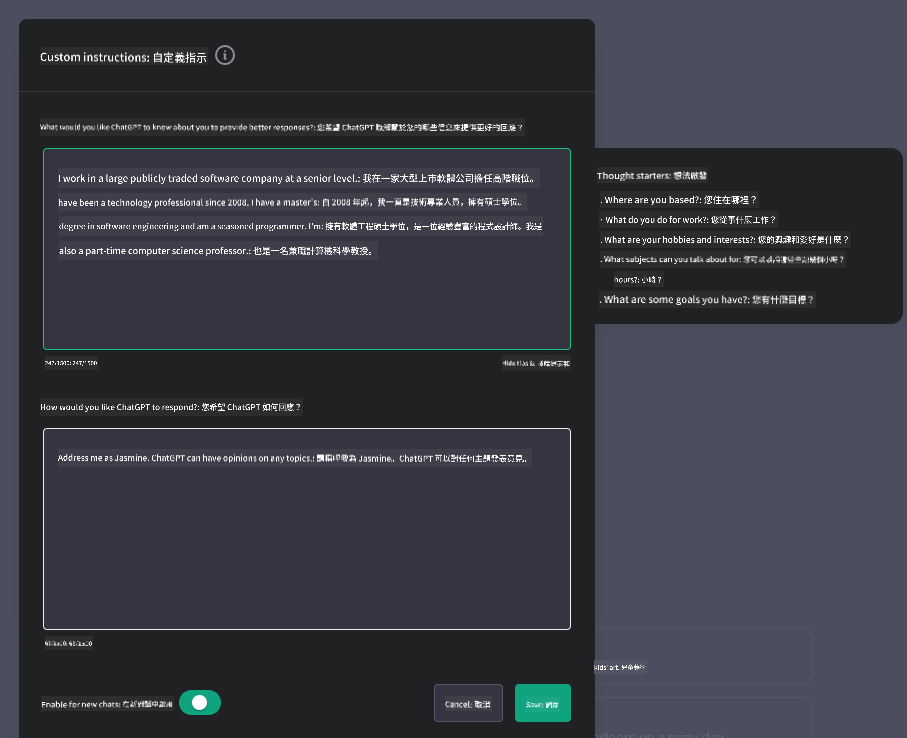
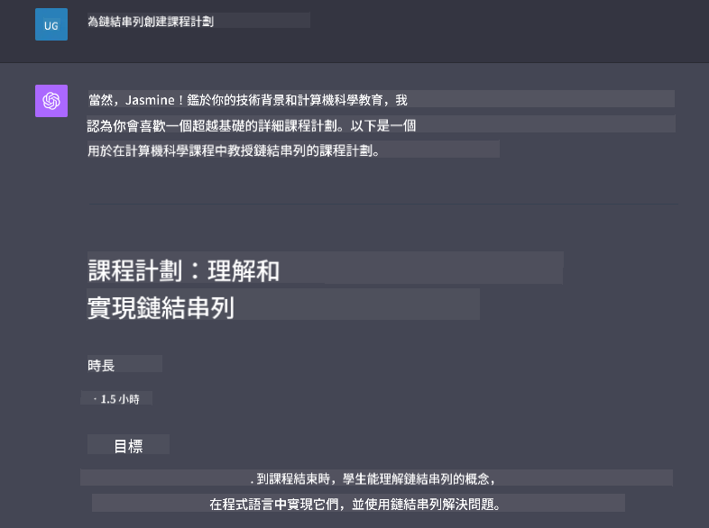

<!--
CO_OP_TRANSLATOR_METADATA:
{
  "original_hash": "a5308963a56cfbad2d73b0fa99fe84b3",
  "translation_date": "2025-10-17T23:45:47+00:00",
  "source_file": "07-building-chat-applications/README.md",
  "language_code": "tw"
}
-->
# 建立生成式 AI 驅動的聊天應用程式

[](https://youtu.be/R9V0ZY1BEQo?si=IHuU-fS9YWT8s4sA)

> _(點擊上方圖片觀看本課程影片)_

在我們了解如何建立文字生成應用程式之後，接下來讓我們來探討聊天應用程式。

聊天應用程式已經融入我們的日常生活，不僅僅是提供休閒交流的工具。它們已成為客戶服務、技術支援，甚至是高級諮詢系統的重要組成部分。您可能不久前就曾經使用過聊天應用程式獲得幫助。隨著我們在這些平台中整合更多像生成式 AI 這樣的先進技術，其複雜性和挑戰也隨之增加。

我們需要回答的一些問題包括：

- **建立應用程式**。如何有效地建立並無縫整合這些 AI 驅動的應用程式以滿足特定使用需求？
- **監控**。應用程式部署後，我們如何監控並確保其在功能和遵守[負責任 AI 的六大原則](https://www.microsoft.com/ai/responsible-ai?WT.mc_id=academic-105485-koreyst)方面保持最高品質？

隨著我們進入由自動化和無縫人機互動定義的時代，了解生成式 AI 如何改變聊天應用程式的範疇、深度和適應性變得至關重要。本課程將探討支持這些複雜系統的架構方面，深入研究針對特定領域任務進行微調的方法，並評估確保負責任 AI 部署的相關指標和考量。

## 課程介紹

本課程涵蓋：

- 高效建立和整合聊天應用程式的技術。
- 如何對應用程式進行定制和微調。
- 有效監控聊天應用程式的策略和考量。

## 學習目標

完成本課程後，您將能夠：

- 描述將聊天應用程式整合到現有系統中的考量。
- 為特定使用案例定制聊天應用程式。
- 確定關鍵指標和考量，以有效監控和維持 AI 驅動聊天應用程式的品質。
- 確保聊天應用程式負責任地利用 AI。

## 將生成式 AI 整合到聊天應用程式中

透過生成式 AI 提升聊天應用程式的功能不僅僅是讓它們變得更智能；更重要的是優化其架構、性能和使用者介面，以提供高品質的使用者體驗。這需要深入研究架構基礎、API 整合以及使用者介面的考量。本節旨在為您提供一個全面的路線圖，無論是將其整合到現有系統中，還是作為獨立平台建立，您都能應對這些複雜的挑戰。

完成本節後，您將具備高效構建和整合聊天應用程式的專業知識。

### 聊天機器人還是聊天應用程式？

在深入探討建立聊天應用程式之前，讓我們比較「聊天機器人」與「AI 驅動的聊天應用程式」，它們在角色和功能上有著明顯的區別。聊天機器人的主要目的是自動化特定的對話任務，例如回答常見問題或追蹤包裹。它通常由基於規則的邏輯或複雜的 AI 演算法驅動。而 AI 驅動的聊天應用程式則是一個更廣泛的環境，旨在促進人類使用者之間的各種形式的數位通信，例如文字、語音和視頻聊天。其核心特徵是整合了一個生成式 AI 模型，能夠模擬細緻入微的類人對話，根據多種輸入和上下文提示生成回應。生成式 AI 驅動的聊天應用程式可以進行開放領域的討論，適應不斷變化的對話上下文，甚至生成創意或複雜的對話。

下表列出了它們在數位通信中的獨特角色的主要差異和相似之處。

| 聊天機器人                           | 生成式 AI 驅動的聊天應用程式           |
| ------------------------------------- | -------------------------------------- |
| 以任務為中心且基於規則                | 具備上下文感知能力                     |
| 通常整合到更大的系統中                | 可容納一個或多個聊天機器人             |
| 限於程式化功能                        | 整合生成式 AI 模型                     |
| 專門且結構化的互動                    | 能進行開放領域的討論                   |

### 利用 SDK 和 API 的預建功能

在建立聊天應用程式時，第一步是評估現有的資源。使用 SDK 和 API 來建立聊天應用程式是一種有利的策略，原因如下。透過整合文件完善的 SDK 和 API，您可以為應用程式的長期成功奠定基礎，解決可擴展性和維護方面的問題。

- **加速開發過程並減少開銷**：依賴預建功能而非自行開發昂貴的功能，讓您可以專注於應用程式的其他重要方面，例如業務邏輯。
- **更好的性能**：自行開發功能時，您最終會問自己「如何擴展？這個應用程式是否能處理突然增加的使用者？」維護良好的 SDK 和 API 通常已內建解決這些問題的方案。
- **更容易維護**：更新和改進更容易管理，因為大多數 API 和 SDK 只需在新版本發布時更新庫。
- **接觸尖端技術**：利用已經過大量數據集微調和訓練的模型，為您的應用程式提供自然語言能力。

訪問 SDK 或 API 的功能通常需要獲得使用提供服務的許可，這通常是通過使用唯一的密鑰或身份驗證令牌來完成。我們將使用 OpenAI Python Library 來探索這一過程。您也可以在以下的 [OpenAI 筆記本](./python/oai-assignment.ipynb?WT.mc_id=academic-105485-koreyst) 或 [Azure OpenAI Services 筆記本](./python/aoai-assignment.ipynb?WT.mc_id=academic-105485-koreys) 中自行嘗試。

```python
import os
from openai import OpenAI

API_KEY = os.getenv("OPENAI_API_KEY","")

client = OpenAI(
    api_key=API_KEY
    )

chat_completion = client.chat.completions.create(model="gpt-3.5-turbo", messages=[{"role": "user", "content": "Suggest two titles for an instructional lesson on chat applications for generative AI."}])
```

上述範例使用 GPT-3.5 Turbo 模型來完成提示，但請注意在執行之前需要設置 API 密鑰。如果未設置密鑰，您將收到錯誤。

## 使用者體驗 (UX)

一般的使用者體驗原則適用於聊天應用程式，但由於涉及機器學習元件，以下是一些特別重要的額外考量。

- **解決模糊性的機制**：生成式 AI 模型有時會生成模糊的答案。提供一個功能讓使用者能要求澄清，當他們遇到這個問題時會很有幫助。
- **上下文保留**：高級生成式 AI 模型能夠記住對話中的上下文，這可能是提升使用者體驗的必要資產。讓使用者能夠控制和管理上下文可以改善使用者體驗，但也帶來保留敏感使用者資訊的風險。對於這些資訊的存儲時間進行考量，例如引入保留政策，可以在上下文需求和隱私之間取得平衡。
- **個性化**：AI 模型具有學習和適應的能力，能為使用者提供個性化的體驗。透過使用者檔案等功能來定制使用者體驗，不僅能讓使用者感到被理解，還能幫助他們更有效率地找到特定答案，從而創造更滿意的互動。

OpenAI 的 ChatGPT 中的「自定義指令」設定就是個性化的一個例子。它允許您提供關於自己的資訊，這些資訊可能是提示的重要上下文。以下是一個自定義指令的範例。



此「檔案」提示 ChatGPT 創建一個關於鏈表的課程計劃。注意 ChatGPT 根據使用者的經驗，提供了一個更深入的課程計劃。



### Microsoft 的大型語言模型系統消息框架

[Microsoft 提供了指導](https://learn.microsoft.com/azure/ai-services/openai/concepts/system-message#define-the-models-output-format?WT.mc_id=academic-105485-koreyst)，幫助撰寫有效的系統消息以生成 LLM 的回應，分為以下四個方面：

1. 定義模型的目標使用者，以及其能力和限制。
2. 定義模型的輸出格式。
3. 提供展示模型預期行為的具體範例。
4. 提供額外的行為防範措施。

### 無障礙設計

無論使用者是否有視覺、聽覺、運動或認知障礙，一個設計良好的聊天應用程式應該對所有人都可用。以下列表分解了針對各種使用者障礙的特定功能，旨在提升無障礙性。

- **針對視覺障礙的功能**：高對比主題和可調整大小的文字，支援螢幕閱讀器。
- **針對聽覺障礙的功能**：文字轉語音和語音轉文字功能，音頻通知的視覺提示。
- **針對運動障礙的功能**：支援鍵盤導航，語音指令。
- **針對認知障礙的功能**：簡化語言選項。

## 為特定領域語言模型進行定制和微調

想像一個聊天應用程式，它能理解您公司的術語並預測使用者群體常見的特定問題。有幾種值得一提的方法：

- **利用 DSL 模型**。DSL 代表特定領域語言。您可以利用所謂的 DSL 模型，該模型經過特定領域的訓練，能理解其概念和場景。
- **進行微調**。微調是指使用特定數據進一步訓練模型的過程。

## 定制：使用 DSL

利用特定領域語言模型（DSL 模型）可以通過提供專業、上下文相關的互動來提升使用者參與度。這是一種專門針對特定領域、行業或主題進行訓練或微調的模型。使用 DSL 模型的選項可以從從頭開始訓練到通過 SDK 和 API 使用現有模型。另一個選項是微調，即採用現有的預訓練模型並使其適應特定領域。

## 定制：進行微調

當預訓練模型在特定領域或特定任務中表現不足時，通常會考慮進行微調。

例如，醫學問題非常複雜，需要大量的上下文。當醫療專業人士診斷患者時，會基於多種因素，例如生活方式或既往病史，甚至可能依賴最新的醫學期刊來驗證診斷。在這些細緻的場景中，通用型 AI 聊天應用程式可能無法成為可靠的資源。

### 場景：醫療應用程式

考慮一個設計用於協助醫療從業者的聊天應用程式，提供治療指南、藥物相互作用或最新研究結果的快速參考。

通用型模型可能足以回答基本的醫學問題或提供一般建議，但可能在以下方面存在困難：

- **高度特定或複雜的案例**。例如，神經科醫生可能會問應用程式：「目前管理兒科患者藥物難治性癲癇的最佳實踐是什麼？」
- **缺乏最新進展**。通用型模型可能難以提供包含神經學和藥理學最新進展的答案。

在這些情況下，使用專門的醫學數據集進行微調，可以顯著提高模型處理這些複雜醫學問題的準確性和可靠性。這需要獲得大量相關數據集，代表需要解決的特定領域挑戰和問題。

## 高品質 AI 驅動聊天體驗的考量

本節概述了「高品質」聊天應用程式的標準，包括可操作指標的捕捉以及遵守負責任利用 AI 技術的框架。

### 關鍵指標

為了維持應用程式的高品質性能，追蹤關鍵指標和考量至關重要。這些測量不僅確保應用程式的功能性，還評估 AI 模型和使用者體驗的品質。以下列表涵蓋了基本、AI 和使用者體驗指標的考量。

| 指標                          | 定義                                                                                                             | 聊天開發者的考量                                                         |
| ----------------------------- | ---------------------------------------------------------------------------------------------------------------- | ------------------------------------------------------------------------- |
| **正常運行時間**              | 測量應用程式可操作並可供使用者訪問的時間。                                                                      | 您將如何最大限度地減少停機時間？                                         |
| **回應時間**                  | 應用程式回應使用者查詢所需的時間。                                                                              | 您如何優化查詢處理以改善回應時間？                                       |
| **精確度**                    | 真正的正確預測與正確預測總數的比例。                                                                            | 您將如何驗證模型的精確度？                                               |
| **召回率（敏感性）**          | 真正的正確預測與實際正確數量的比例。                                                                            | 您將如何測量和改善召回率？                                               |
| **F1 分數**                   | 精確度和召回率的調和平均值，平衡兩者之間的權衡。                                                               | 您的目標 F1 分數是多少？您將如何平衡精確度和召回率？                     |
| **困惑度**                    | 測量模型預測的概率分佈與實際數據分佈的匹配程度。                                                               | 您將如何最大限度地減少困惑度？                                           |
| **使用者滿意度指標**          | 測量使用者對應用程式的感知，通常通過調查收集。                                                                 | 您多久收集一次使用者反饋？您將如何根據反饋進行調整？                     |
| **錯誤率**                    | 模型在理解或輸出中犯錯的比率。                                                                                  | 您有哪些策略來降低錯誤率？                                               |
| **重新訓練週期**              | 更新模型以整合新數據和洞察的頻率。                                                                              | 您多久重新訓練一次模型？什麼情況會觸發重新訓練週期？                     |
| **異常檢測**                 | 用於識別不符合預期行為的異常模式的工具和技術。                                | 您將如何應對異常情況？                                                   |

### 在聊天應用中實施負責任的 AI 實踐

Microsoft 的負責任 AI 方法確立了六項應指導 AI 開發和使用的原則。以下是這些原則的定義，以及聊天應用開發者應考慮的事項及其重要性。

| 原則                   | Microsoft 的定義                                    | 聊天應用開發者的考量                                                  | 為什麼重要                                                                          |
| ---------------------- | --------------------------------------------------- | -------------------------------------------------------------------- | ---------------------------------------------------------------------------------- |
| 公平性                 | AI 系統應公平對待所有人。                           | 確保聊天應用不基於用戶數據進行歧視。                                 | 建立用戶信任和包容性；避免法律後果。                                               |
| 可靠性與安全性         | AI 系統應可靠且安全地運行。                         | 實施測試和故障保護以最小化錯誤和風險。                               | 確保用戶滿意度並防止潛在傷害。                                                     |
| 隱私與安全性           | AI 系統應安全並尊重隱私。                           | 實施強加密和數據保護措施。                                           | 保護敏感用戶數據並遵守隱私法規。                                                   |
| 包容性                 | AI 系統應賦能所有人並吸引人們參與。                 | 設計對多樣化受眾友好的可訪問且易於使用的 UI/UX。                     | 確保更廣泛的人群能有效使用該應用。                                                 |
| 透明性                 | AI 系統應易於理解。                                 | 提供清晰的文檔和 AI 回應的理由。                                     | 如果用戶能理解決策的生成方式，他們更可能信任系統。                                 |
| 責任性                 | 人們應對 AI 系統負責。                              | 建立清晰的審核和改進 AI 決策的流程。                                 | 在出現錯誤時能進行持續改進和糾正措施。                                             |

## 作業

請參閱[作業](../../../07-building-chat-applications/python)。它將帶您完成一系列練習，從運行您的第一個聊天提示到分類和摘要文本等。注意，這些作業提供了不同的編程語言版本！

## 幹得好！繼續學習之旅

完成本課程後，請查看我們的[生成式 AI 學習合集](https://aka.ms/genai-collection?WT.mc_id=academic-105485-koreyst)，繼續提升您的生成式 AI 知識！

前往第 8 課，了解如何開始[構建搜索應用](../08-building-search-applications/README.md?WT.mc_id=academic-105485-koreyst)！

---

**免責聲明**：  
本文件已使用 AI 翻譯服務 [Co-op Translator](https://github.com/Azure/co-op-translator) 進行翻譯。儘管我們努力確保翻譯的準確性，但請注意，自動翻譯可能包含錯誤或不準確之處。原始文件的母語版本應被視為權威來源。對於關鍵信息，建議使用專業人工翻譯。我們對因使用此翻譯而產生的任何誤解或誤釋不承擔責任。