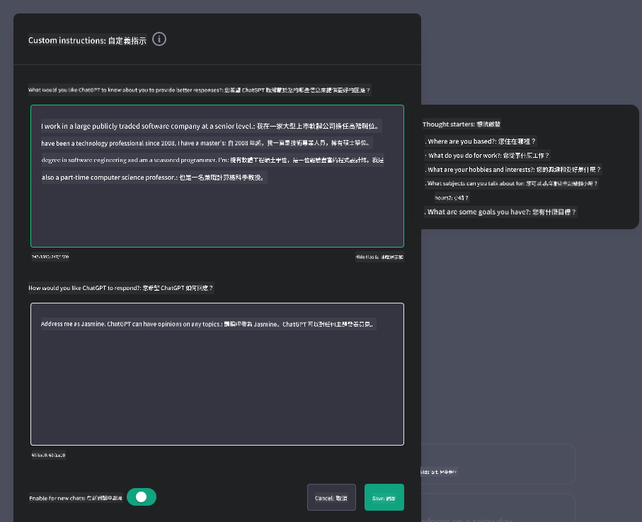
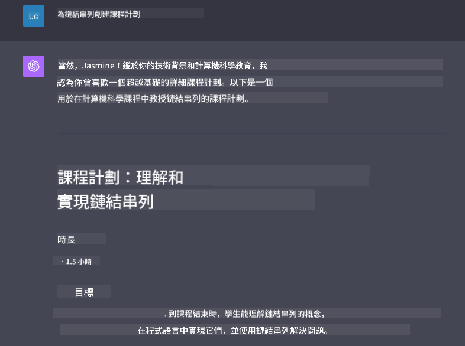

<!--
CO_OP_TRANSLATOR_METADATA:
{
  "original_hash": "ea4bbe640847aafbbba14dae4625e9af",
  "translation_date": "2025-06-25T15:13:25+00:00",
  "source_file": "07-building-chat-applications/README.md",
  "language_code": "tw"
}
-->
# 建立生成式 AI 驅動的聊天應用程式

[](https://aka.ms/gen-ai-lessons7-gh?WT.mc_id=academic-105485-koreyst)

> _(點擊上方圖片觀看此課程的影片)_

現在我們已經了解如何建立文字生成應用程式，讓我們來看看聊天應用程式。

聊天應用程式已經融入我們的日常生活中，提供的不僅僅是休閒對話的手段。它們是客戶服務、技術支持甚至是複雜諮詢系統的核心部分。您可能不久前就從聊天應用程式中獲得了一些幫助。隨著我們將生成式 AI 等更先進的技術整合到這些平台中，複雜性增加，挑戰也隨之增加。

我們需要回答的一些問題是：

- **建立應用程式**。如何有效地建立並無縫整合這些 AI 驅動的應用程式以滿足特定的使用案例？
- **監控**。一旦部署，如何監控並確保應用程式在功能和遵循[負責任 AI 的六大原則](https://www.microsoft.com/ai/responsible-ai?WT.mc_id=academic-105485-koreyst)方面運行在最高質量水平？

隨著我們進入由自動化和無縫人機互動定義的時代，了解生成式 AI 如何改變聊天應用程式的範圍、深度和適應性變得至關重要。這節課將探討支持這些複雜系統的架構方面，深入研究針對特定領域任務進行微調的方法，並評估確保負責任 AI 部署的相關指標和考量。

## 介紹

這節課涵蓋：

- 有效建立和整合聊天應用程式的技術。
- 如何對應用程式進行定制和微調。
- 有效監控聊天應用程式的策略和考量。

## 學習目標

完成本課程後，您將能夠：

- 描述將聊天應用程式整合到現有系統中的考量。
- 為特定使用案例定制聊天應用程式。
- 識別關鍵指標和考量，以有效監控和維持 AI 驅動聊天應用程式的質量。
- 確保聊天應用程式負責任地利用 AI。

## 將生成式 AI 整合到聊天應用程式中

通過生成式 AI 提升聊天應用程式不僅僅是讓它們變得更聰明；它是關於優化其架構、性能和用戶界面，以提供優質的用戶體驗。這涉及調查架構基礎、API整合和用戶界面考量。本節旨在為您提供一個全面的路線圖，以便您在這些複雜的領域中導航，無論是將它們插入現有系統還是將它們構建為獨立平台。

完成本節後，您將具備有效構建和整合聊天應用程式所需的專業知識。

### 聊天機器人或聊天應用程式？

在我們深入建立聊天應用程式之前，讓我們比較“聊天機器人”和“AI 驅動的聊天應用程式”，它們擔任不同的角色和功能。聊天機器人的主要目的是自動化特定的對話任務，例如回答常見問題或跟踪包裹。它通常由基於規則的邏輯或複雜的 AI 算法管理。相比之下，AI 驅動的聊天應用程式是一個更廣泛的環境，旨在促進人類用戶之間的各種形式的數字通信，例如文本、語音和視頻聊天。其定義特徵是整合生成式 AI 模型，模擬細緻入微的類人對話，根據多種輸入和上下文提示生成回應。生成式 AI 驅動的聊天應用程式可以參與開放域討論，適應不斷發展的對話上下文，甚至生成創造性或複雜的對話。

下表概述了關鍵差異和相似之處，以幫助我們理解它們在數字通信中的獨特角色。

| 聊天機器人                          | 生成式 AI 驅動的聊天應用程式         |
| ---------------------------------- | ---------------------------------- |
| 任務導向和基於規則                  | 上下文感知                          |
| 通常整合到更大的系統中              | 可以承載一個或多個聊天機器人        |
| 限制在編程功能                      | 整合生成式 AI 模型                  |
| 專門化和結構化互動                  | 能夠進行開放域討論                  |

### 利用 SDK 和 API 的預建功能

在建立聊天應用程式時，一個很好的第一步是評估現有的資源。使用 SDK 和 API 建立聊天應用程式是一種有利的策略，原因多種。通過整合文件齊全的 SDK 和 API，您可以策略性地將您的應用程式定位於長期成功，解決可擴展性和維護問題。

- **加快開發過程並減少開銷**：依靠預建功能而不是自己建立它們的昂貴過程，讓您可以專注於應用程式的其他方面，例如商業邏輯。
- **更好的性能**：在從頭開始建立功能時，您最終會問自己“它如何擴展？這個應用程式能否應對突然增加的用戶？”維護良好的 SDK 和 API 通常具有內建解決方案來應對這些問題。
- **更容易的維護**：更新和改進更容易管理，因為大多數 API 和 SDK 只需在發布新版本時更新庫即可。
- **獲得尖端技術**：利用經過微調和大量數據集訓練的模型，為您的應用程式提供自然語言能力。

訪問 SDK 或 API 的功能通常涉及獲得使用提供服務的許可，這通常通過使用唯一的密鑰或身份驗證令牌。我們將使用 OpenAI Python 庫來探索這看起來如何。您也可以在以下[OpenAI 筆記本](../../../07-building-chat-applications/python/oai-assignment.ipynb)或[Azure OpenAI Services 筆記本](../../../07-building-chat-applications/python/aoai-assignment.ipynb)中試用。

```python
import os
from openai import OpenAI

API_KEY = os.getenv("OPENAI_API_KEY","")

client = OpenAI(
    api_key=API_KEY
    )

chat_completion = client.chat.completions.create(model="gpt-3.5-turbo", messages=[{"role": "user", "content": "Suggest two titles for an instructional lesson on chat applications for generative AI."}])
```

上述範例使用 GPT-3.5 Turbo 模型來完成提示，但請注意在執行之前設置了 API 密鑰。如果未設置密鑰，您將收到錯誤。

## 用戶體驗 (UX)

一般的 UX 原則適用於聊天應用程式，但由於涉及機器學習組件，以下是一些特別重要的考量。

- **解決模糊性的機制**：生成式 AI 模型偶爾會生成模糊的答案。允許用戶要求澄清的功能可以在遇到此問題時提供幫助。
- **上下文保留**：高級生成式 AI 模型具有在對話中記住上下文的能力，這可能是用戶體驗的重要資產。讓用戶能夠控制和管理上下文可以改善用戶體驗，但也引入了保留敏感用戶信息的風險。考慮信息存儲的時間，例如引入保留政策，可以在上下文需求和隱私之間取得平衡。
- **個性化**：AI 模型具有學習和適應的能力，為用戶提供個性化的體驗。通過用戶資料等功能定制用戶體驗，不僅讓用戶感到被理解，還幫助他們尋找特定答案，創造更高效和令人滿意的互動。

OpenAI 的 ChatGPT 中的“自訂指令”設置是一個個性化的例子。它允許您提供關於自己的信息，這可能是提示的重要上下文。以下是自訂指令的示例。



此“個人資料”提示 ChatGPT 創建一個關於鏈表的課程計劃。注意到 ChatGPT 考慮到用戶可能希望根據她的經驗獲得更深入的課程計劃。



### Microsoft 的大型語言模型系統消息框架

[Microsoft 提供了指導](https://learn.microsoft.com/azure/ai-services/openai/concepts/system-message#define-the-models-output-format?WT.mc_id=academic-105485-koreyst)，用於撰寫有效的系統消息，以便從 LLMs 生成回應，分為四個領域：

1. 定義模型的對象以及其能力和限制。
2. 定義模型的輸出格式。
3. 提供具體範例以展示模型的預期行為。
4. 提供額外的行為護欄。

### 可及性

無論用戶有視覺、聽覺、運動或認知障礙，設計良好的聊天應用程式應該對所有人可用。以下列表分解了旨在增強各種用戶障礙可及性的特定功能。

- **視覺障礙功能**：高對比度主題和可調節文字、屏幕閱讀器兼容性。
- **聽覺障礙功能**：文字轉語音和語音轉文字功能、音頻通知的視覺提示。
- **運動障礙功能**：鍵盤導航支持、語音命令。
- **認知障礙功能**：簡化語言選項。

## 針對領域專用語言模型的定制和微調

想像一個聊天應用程式能夠理解您公司的行話並預測其用戶群體常有的特定查詢。有幾種值得提及的方法：

- **利用 DSL 模型**。DSL 代表領域專用語言。您可以利用所謂的 DSL 模型，在特定領域訓練以理解其概念和情景。
- **應用微調**。微調是使用特定數據進一步訓練您的模型的過程。

## 定制：使用 DSL

利用領域專用語言模型（DSL 模型）可以通過提供專門、上下文相關的互動來增強用戶參與度。這是一種模型，訓練或微調以理解和生成與特定領域、行業或主題相關的文本。使用 DSL 模型的選項可以從從頭開始訓練到通過 SDK 和 API 使用預先存在的模型。另一個選項是微調，這涉及採用現有的預訓練模型並使其適應特定領域。

## 定制：應用微調

當預訓練模型在專門領域或特定任務上表現不佳時，通常會考慮微調。

例如，醫療查詢複雜且需要大量上下文。當醫療專業人員診斷患者時，它基於多種因素，例如生活方式或既往病情，甚至可能依賴於最近的醫學期刊來驗證其診斷。在這種細緻的情景中，通用 AI 聊天應用程式不能成為可靠的來源。

### 情景：醫療應用程式

考慮一個旨在協助醫療人員的聊天應用程式，提供快速參考治療指南、藥物相互作用或最近的研究成果。

通用模型可能足以回答基本醫療問題或提供一般建議，但可能在以下方面表現不佳：

- **高度專門化或複雜案例**。例如，神經科醫生可能會詢問應用程式：“管理兒童患者藥物抗性癲癇的當前最佳做法是什麼？”
- **缺乏最新進展**。通用模型可能難以提供一個包含神經學和藥理學最新進展的答案。

在這些情況下，使用專門的醫療數據集微調模型可以顯著提高其處理這些複雜醫療查詢的能力和可靠性。這需要訪問大量且相關的數據集，代表需要解決的領域專門挑戰和問題。

## 高質量 AI 驅動聊天體驗的考量

本節概述了“高質量”聊天應用程式的標準，包括可操作指標的捕獲和遵循負責任利用 AI 技術的框架。

### 關鍵指標

要維持應用程式的高質量性能，追踪關鍵指標和考量至關重要。這些衡量標準不僅確保應用程式的功能，還評估 AI 模型和用戶體驗的質量。以下是涵蓋基本、AI 和用戶體驗指標的列表。

| 指標                            | 定義                                                                                                                   | 聊天開發者的考量                                                         |
| ------------------------------- | ---------------------------------------------------------------------------------------------------------------------- | ----------------------------------------------------------------------- |
| **運行時間**                    | 測量應用程式運行和可供用戶訪問的時間。                                                                                  | 您將如何最大限度地減少停機時間？                                         |
| **回應時間**                    | 應用程式回應用戶查詢所需的時間。                                                                                        | 您如何優化查詢處理以改善回應時間？                                       |
| **精確度**                      | 真正陽性預測與陽性預測總數的比率                                                                                         | 您將如何驗證模型的精確度？                                               |
| **召回率（敏感性）**            | 真正陽性預測與實際陽性數量的比率                                                                                         | 您將如何測量和改善召回率？                                               |
| **F1 分數**                     | 精確度和召回率的調和平均數，平衡兩者之間的取捨。                                                                        | 您的目標 F1 分數是多少？您將如何平衡精確度和召回率？                     |
| **困惑度**                      | 測量模型預測的概率分布與實際數據分布的吻合程度。                                                                        | 您將如何最大限度地減少困惑度？                                           |
| **用戶滿意度指標**              | 測量用戶對應用程式的感知。通常通過調查捕獲。                                                                            | 您將如何頻繁地收集用戶反饋？您將如何根據反饋進行調整？                   |
| **錯誤率**                      | 模型在理解或輸出時犯錯的比率。                                                                                           | 您有什麼策略來降低錯誤率？                                               |
| **再訓練周期**                  | 模型更新以納入新數據和見解的頻率。                                                                                       | 您將如何頻繁地再訓練模型？什麼會觸發再訓練周期？                         |
| **異常檢測**                    | 用於識別不符合預期行為的異常模式的工具和技術。                                                                           | 您將如何應對異常？                                                       |

### 在聊天應用程式中實施負責任的 AI 實踐

Microsoft 的負責任 AI 方法已確定了六個原則，應指導 AI 的開發和使用。以下是原則、其定義以及聊天開發者應考慮的事項和原因。

| 原則                    | Microsoft 的定義                              | 聊天開發者的考量                                                        | 為什麼這很重要                                                                      |
| ----------------------- | --------------------------------------------- | ---------------------------------------------------------------------- | ---------------------------------------------------------------------------------- |
| 公平性                  | AI 系統應該公平對待所有人。                  | 確保聊天應用程式不會基於用戶數據進行歧視。                              | 建立用戶信任和包容性；避免法律後果。                                              |
| 可靠性和安全性          | AI 系統應該可靠和安全地運行。                | 實施測試和故障保護以最小化錯誤和風險。                                | 確保用戶滿意度並防止潛在危害。                                                    |
| 隱私和安全              | AI 系統應該安全且尊重隱私。                  | 實施強加密和數據保護措施。                                            | 保護敏感用戶數據並遵守隱私法律。                                                  |
| 包容性                  | AI 系統應該賦能每個人並吸引人。              | 設計 UI/UX，使其對多元化受眾可及且易於使用。                           | 確保更廣泛的人群可以有效地使用應用程式。                                         

**免責聲明**：
本文件已使用 AI 翻譯服務 [Co-op Translator](https://github.com/Azure/co-op-translator) 進行翻譯。儘管我們努力確保翻譯的準確性，但請注意，自動翻譯可能包含錯誤或不準確之處。原始文件的母語版本應被視為權威來源。對於關鍵信息，建議使用專業人工翻譯。我們不對因使用此翻譯而產生的任何誤解或誤讀承擔責任。