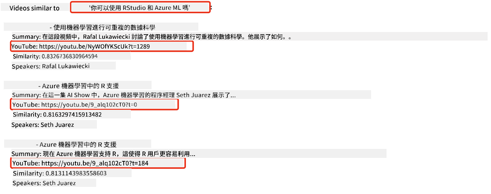
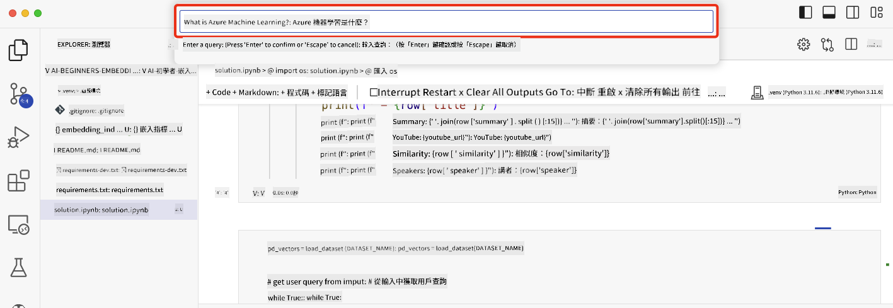

<!--
CO_OP_TRANSLATOR_METADATA:
{
  "original_hash": "d46aad0917a1a342d613e2c13d457da5",
  "translation_date": "2025-05-19T10:23:29+00:00",
  "source_file": "08-building-search-applications/README.md",
  "language_code": "tw"
}
-->
# 建立搜尋應用程式

[](https://aka.ms/gen-ai-lesson8-gh?WT.mc_id=academic-105485-koreyst)

> > _點擊上方圖片觀看本課程的影片_

大型語言模型（LLM）不僅限於聊天機器人和文本生成。透過使用嵌入技術，也可以建立搜尋應用程式。嵌入是數據的數值表示，也稱為向量，可以用於語義搜尋數據。

在這堂課中，你將為我們的教育新創公司建立一個搜尋應用程式。我們的公司是一家非營利組織，提供發展中國家的學生免費教育。我們擁有大量的 YouTube 影片，學生可以利用這些影片學習 AI。我們希望建立一個搜尋應用程式，讓學生可以透過輸入問題來搜尋 YouTube 影片。

例如，學生可能會輸入「什麼是 Jupyter Notebooks？」或「什麼是 Azure ML」，搜尋應用程式將返回與問題相關的 YouTube 影片列表，更好的是，搜尋應用程式將返回影片中回答問題的位置的連結。

## 介紹

在這堂課中，我們將涵蓋：

- 語義搜尋 vs 關鍵字搜尋
- 什麼是文本嵌入
- 創建文本嵌入索引
- 搜尋文本嵌入索引

## 學習目標

完成本課程後，你將能夠：

- 區分語義搜尋和關鍵字搜尋
- 解釋什麼是文本嵌入
- 使用嵌入創建搜尋數據的應用程式

## 為什麼要建立搜尋應用程式？

創建搜尋應用程式將幫助你了解如何使用嵌入來搜尋數據。你還將學習如何建立一個搜尋應用程式，讓學生可以快速找到資訊。

課程中包含了 Microsoft [AI Show](https://www.youtube.com/playlist?list=PLlrxD0HtieHi0mwteKBOfEeOYf0LJU4O1) YouTube 頻道的轉錄文本的嵌入索引。AI Show 是一個教授 AI 和機器學習的 YouTube 頻道。嵌入索引包含截至 2023 年 10 月的每個 YouTube 轉錄文本的嵌入。你將使用嵌入索引為我們的公司建立搜尋應用程式。搜尋應用程式會返回影片中回答問題的位置的連結。這是一個讓學生快速找到所需資訊的好方法。

以下是一個語義查詢的範例，問題是「你能用 Azure ML 使用 rstudio 嗎？」。查看 YouTube 的網址，你會看到網址包含一個時間戳，帶你到影片中回答問題的位置。



## 什麼是語義搜尋？

你可能會想知道，什麼是語義搜尋？語義搜尋是一種使用查詢中詞語的語義或意義來返回相關結果的搜尋技術。

這是一個語義搜尋的例子。假設你想買車，你可能會搜尋「我的夢想車」，語義搜尋理解你不是在`dreaming`車，而是想買你的`ideal`車。語義搜尋理解你的意圖並返回相關結果。另一種選擇是`keyword search`，它會字面上搜尋關於車的夢想，通常返回不相關的結果。

## 什麼是文本嵌入？

[文本嵌入](https://en.wikipedia.org/wiki/Word_embedding?WT.mc_id=academic-105485-koreyst) 是自然語言處理中使用的一種文本表示技術。文本嵌入是文本的語義數值表示。嵌入用於以機器容易理解的方式表示數據。有許多模型可以建立文本嵌入，在這堂課中，我們將專注於使用 OpenAI 嵌入模型生成嵌入。

這裡有一個例子，假設以下文本來自 AI Show YouTube 頻道的一集的轉錄：

```text
Today we are going to learn about Azure Machine Learning.
```

我們將文本傳遞給 OpenAI 嵌入 API，它會返回由 1536 個數字組成的嵌入，也就是一個向量。向量中的每個數字代表文本的不同方面。為了簡潔，這裡是向量的前 10 個數字。

```python
[-0.006655829958617687, 0.0026128944009542465, 0.008792596869170666, -0.02446001023054123, -0.008540431968867779, 0.022071078419685364, -0.010703742504119873, 0.003311325330287218, -0.011632772162556648, -0.02187200076878071, ...]
```

## 嵌入索引是如何創建的？

本課程的嵌入索引是通過一系列 Python 腳本創建的。你可以在本課程的 'scripts' 文件夾中的 [README](./scripts/README.md?WT.mc_id=academic-105485-koreyst) 中找到這些腳本及其說明。你不需要運行這些腳本來完成本課程，因為已經為你提供了嵌入索引。

這些腳本執行以下操作：

1. 下載 [AI Show](https://www.youtube.com/playlist?list=PLlrxD0HtieHi0mwteKBOfEeOYf0LJU4O1) 播放清單中每個 YouTube 影片的轉錄。
2. 使用 [OpenAI 功能](https://learn.microsoft.com/azure/ai-services/openai/how-to/function-calling?WT.mc_id=academic-105485-koreyst)，嘗試從 YouTube 轉錄的前三分鐘中提取演講者名稱。每個影片的演講者名稱儲存在名為 `embedding_index_3m.json` 的嵌入索引中。
3. 然後將轉錄文本分塊為**3 分鐘文本片段**。片段包括來自下一個片段的約 20 個詞的重疊，以確保片段的嵌入不被切斷，並提供更好的搜尋上下文。
4. 然後將每個文本片段傳遞給 OpenAI Chat API，將文本摘要為 60 個詞。摘要也儲存在嵌入索引 `embedding_index_3m.json` 中。
5. 最後，將片段文本傳遞給 OpenAI 嵌入 API。嵌入 API 返回一個由 1536 個數字組成的向量，代表片段的語義意義。片段和 OpenAI 嵌入向量一起儲存在嵌入索引 `embedding_index_3m.json` 中。

### 向量數據庫

為了簡化課程，嵌入索引儲存在名為 `embedding_index_3m.json` 的 JSON 文件中，並加載到 Pandas DataFrame 中。然而，在生產環境中，嵌入索引將儲存在向量數據庫中，如 [Azure Cognitive Search](https://learn.microsoft.com/training/modules/improve-search-results-vector-search?WT.mc_id=academic-105485-koreyst)、[Redis](https://cookbook.openai.com/examples/vector_databases/redis/readme?WT.mc_id=academic-105485-koreyst)、[Pinecone](https://cookbook.openai.com/examples/vector_databases/pinecone/readme?WT.mc_id=academic-105485-koreyst)、[Weaviate](https://cookbook.openai.com/examples/vector_databases/weaviate/readme?WT.mc_id=academic-105485-koreyst) 等。

## 理解餘弦相似度

我們已經了解了文本嵌入，接下來的步驟是學習如何使用文本嵌入搜尋數據，特別是使用餘弦相似度查找與給定查詢最相似的嵌入。

### 什麼是餘弦相似度？

餘弦相似度是兩個向量之間相似度的量度，你也會聽到這被稱為`nearest neighbor search`。要執行餘弦相似度搜尋，你需要使用 OpenAI 嵌入 API 為查詢文本進行 _向量化_。然後計算查詢向量與嵌入索引中每個向量的 _餘弦相似度_。記住，嵌入索引對每個 YouTube 轉錄文本片段都有一個向量。最後，根據餘弦相似度對結果進行排序，餘弦相似度最高的文本片段是與查詢最相似的。

從數學角度來看，餘弦相似度測量兩個向量在多維空間中投影的角度的餘弦值。這種測量很有用，因為如果兩個文檔由於大小而在歐幾里得距離上相距甚遠，它們仍然可能在它們之間有較小的角度，從而具有較高的餘弦相似度。更多關於餘弦相似度方程的信息，請參見 [Cosine similarity](https://en.wikipedia.org/wiki/Cosine_similarity?WT.mc_id=academic-105485-koreyst)。

## 建立你的第一個搜尋應用程式

接下來，我們將學習如何使用嵌入建立搜尋應用程式。搜尋應用程式將允許學生透過輸入問題來搜尋影片。搜尋應用程式將返回與問題相關的影片列表。搜尋應用程式還將返回影片中回答問題的位置的連結。

這個解決方案已在 Windows 11、macOS 和 Ubuntu 22.04 上使用 Python 3.10 或更高版本進行構建和測試。你可以從 [python.org](https://www.python.org/downloads/?WT.mc_id=academic-105485-koreyst) 下載 Python。

## 作業 - 建立搜尋應用程式，啟用學生

我們在本課程開始時介紹了我們的新創公司。現在是時候讓學生建立一個搜尋應用程式來進行評估。

在這個作業中，你將創建用於建立搜尋應用程式的 Azure OpenAI 服務。你將創建以下 Azure OpenAI 服務。你需要一個 Azure 訂閱才能完成這個作業。

### 啟動 Azure Cloud Shell

1. 登入 [Azure 入口網站](https://portal.azure.com/?WT.mc_id=academic-105485-koreyst)。
2. 選擇 Azure 入口網站右上角的 Cloud Shell 圖示。
3. 選擇 **Bash** 作為環境類型。

#### 創建資源群組

> 在這些指示中，我們使用位於美國東部的名為 "semantic-video-search" 的資源群組。
> 你可以更改資源群組的名稱，但在更改資源位置時，
> 請檢查[模型可用性表](https://aka.ms/oai/models?WT.mc_id=academic-105485-koreyst)。

```shell
az group create --name semantic-video-search --location eastus
```

#### 創建 Azure OpenAI 服務資源

從 Azure Cloud Shell 執行以下命令來創建 Azure OpenAI 服務資源。

```shell
az cognitiveservices account create --name semantic-video-openai --resource-group semantic-video-search \
    --location eastus --kind OpenAI --sku s0
```

#### 獲取用於此應用程式的端點和密鑰

從 Azure Cloud Shell 執行以下命令以獲取 Azure OpenAI 服務資源的端點和密鑰。

```shell
az cognitiveservices account show --name semantic-video-openai \
   --resource-group  semantic-video-search | jq -r .properties.endpoint
az cognitiveservices account keys list --name semantic-video-openai \
   --resource-group semantic-video-search | jq -r .key1
```

#### 部署 OpenAI 嵌入模型

從 Azure Cloud Shell 執行以下命令來部署 OpenAI 嵌入模型。

```shell
az cognitiveservices account deployment create \
    --name semantic-video-openai \
    --resource-group  semantic-video-search \
    --deployment-name text-embedding-ada-002 \
    --model-name text-embedding-ada-002 \
    --model-version "2"  \
    --model-format OpenAI \
    --sku-capacity 100 --sku-name "Standard"
```

## 解決方案

在 GitHub Codespaces 中打開 [solution notebook](../../../08-building-search-applications/python/aoai-solution.ipynb) 並按照 Jupyter Notebook 中的說明進行操作。

當你運行 notebook 時，系統會提示你輸入查詢。輸入框看起來像這樣：



## 做得好！繼續學習

完成本課程後，查看我們的 [生成式 AI 學習集合](https://aka.ms/genai-collection?WT.mc_id=academic-105485-koreyst)，繼續提升你的生成式 AI 知識！

前往第 9 課，我們將學習如何[建立圖像生成應用程式](../09-building-image-applications/README.md?WT.mc_id=academic-105485-koreyst)！

**免責聲明**：  
本文檔使用AI翻譯服務[Co-op Translator](https://github.com/Azure/co-op-translator)進行翻譯。我們努力確保準確性，但請注意，自動翻譯可能包含錯誤或不準確之處。應將原文檔的母語版本視為權威來源。對於關鍵信息，建議進行專業人工翻譯。對於因使用此翻譯而產生的任何誤解或誤釋，我們不承擔責任。