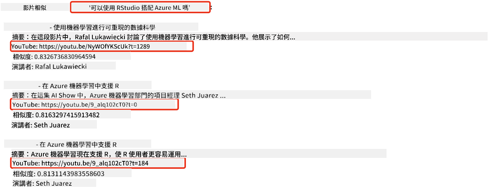
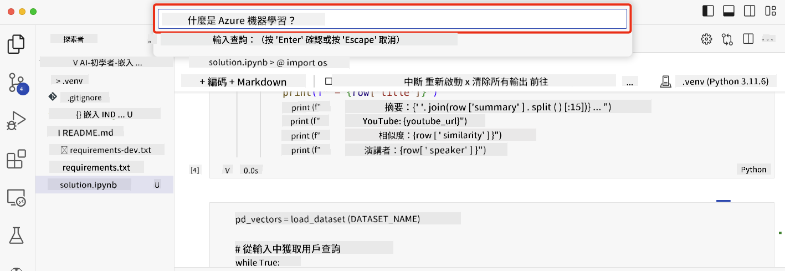

<!--
CO_OP_TRANSLATOR_METADATA:
{
  "original_hash": "d46aad0917a1a342d613e2c13d457da5",
  "translation_date": "2025-06-25T16:17:37+00:00",
  "source_file": "08-building-search-applications/README.md",
  "language_code": "tw"
}
-->
# 建立搜尋應用程式

[](https://aka.ms/gen-ai-lesson8-gh?WT.mc_id=academic-105485-koreyst)

> > _點擊上方圖片觀看本課程的影片_

大型語言模型不僅僅是聊天機器人和文本生成。也可以使用嵌入來建立搜尋應用程式。嵌入是數據的數字表示形式，也稱為向量，可以用於數據的語義搜尋。

在本課程中，您將為我們的教育創業公司建立一個搜尋應用程式。我們的創業公司是一家非營利組織，為發展中國家的學生提供免費教育。我們的創業公司擁有大量的 YouTube 影片，學生可以用來學習 AI。我們的創業公司希望建立一個搜尋應用程式，讓學生可以通過輸入問題來搜尋 YouTube 影片。

例如，學生可能會輸入「什麼是 Jupyter Notebooks？」或「什麼是 Azure ML」，搜尋應用程式將返回與問題相關的 YouTube 影片列表，更好的是，搜尋應用程式將返回影片中問題答案所在位置的連結。

## 簡介

在本課程中，我們將涵蓋：

- 語義搜尋與關鍵字搜尋。
- 什麼是文本嵌入。
- 建立文本嵌入索引。
- 搜尋文本嵌入索引。

## 學習目標

完成本課程後，您將能夠：

- 區分語義搜尋與關鍵字搜尋。
- 解釋什麼是文本嵌入。
- 使用嵌入建立應用程式來搜尋數據。

## 為什麼要建立搜尋應用程式？

建立搜尋應用程式將幫助您了解如何使用嵌入來搜尋數據。您還將學習如何建立一個搜尋應用程式，讓學生能夠快速找到信息。

本課程包括 Microsoft [AI Show](https://www.youtube.com/playlist?list=PLlrxD0HtieHi0mwteKBOfEeOYf0LJU4O1) YouTube 頻道的 YouTube 文字稿的嵌入索引。AI Show 是一個教授 AI 和機器學習的 YouTube 頻道。嵌入索引包含截至 2023 年 10 月的每個 YouTube 文字稿的嵌入。您將使用嵌入索引來為我們的創業公司建立搜尋應用程式。搜尋應用程式將返回影片中問題答案所在位置的連結。這是一個讓學生快速找到所需信息的好方法。

以下是一個語義查詢的例子，問題是「可以使用 rstudio 與 azure ml 嗎？」查看 YouTube 網址，您會看到網址包含一個時間戳，將您帶到影片中問題答案所在的位置。



## 什麼是語義搜尋？

現在您可能會想，什麼是語義搜尋？語義搜尋是一種使用查詢中詞語的語義或意義來返回相關結果的搜尋技術。

這裡有一個語義搜尋的例子。假設您想買一輛車，您可能會搜尋「我的夢想車」，語義搜尋理解您不是`dreaming`一輛車，而是想買您的`ideal`車。語義搜尋理解您的意圖並返回相關結果。相反，`keyword search`會字面上搜尋有關車的夢想，並且經常返回不相關的結果。

## 什麼是文本嵌入？

[文本嵌入](https://en.wikipedia.org/wiki/Word_embedding?WT.mc_id=academic-105485-koreyst) 是一種用於[自然語言處理](https://en.wikipedia.org/wiki/Natural_language_processing?WT.mc_id=academic-105485-koreyst)的文本表示技術。文本嵌入是文本的語義數字表示。嵌入用於以機器易於理解的方式表示數據。有許多建立文本嵌入的模型，在本課程中，我們將專注於使用 OpenAI 嵌入模型生成嵌入。

這裡有一個例子，想像以下文本來自 AI Show YouTube 頻道某一集的文字稿：

```text
Today we are going to learn about Azure Machine Learning.
```

我們將文本傳遞給 OpenAI 嵌入 API，它將返回包含 1536 個數字的嵌入，也就是向量。向量中的每個數字代表文本的不同方面。為了簡潔，這裡是向量中的前 10 個數字。

```python
[-0.006655829958617687, 0.0026128944009542465, 0.008792596869170666, -0.02446001023054123, -0.008540431968867779, 0.022071078419685364, -0.010703742504119873, 0.003311325330287218, -0.011632772162556648, -0.02187200076878071, ...]
```

## 嵌入索引是如何建立的？

本課程的嵌入索引是通過一系列 Python 腳本建立的。您可以在本課程的「scripts」文件夾中的 [README](./scripts/README.md?WT.mc_id=academic-105485-koreyst) 中找到這些腳本及其說明。您不需要運行這些腳本來完成本課程，因為嵌入索引已為您提供。

這些腳本執行以下操作：

1. 下載 [AI Show](https://www.youtube.com/playlist?list=PLlrxD0HtieHi0mwteKBOfEeOYf0LJU4O1) 播放清單中每個 YouTube 影片的文字稿。
2. 使用 [OpenAI 函數](https://learn.microsoft.com/azure/ai-services/openai/how-to/function-calling?WT.mc_id=academic-105485-koreyst)，嘗試從 YouTube 文字稿的前 3 分鐘中提取講者姓名。每個影片的講者姓名儲存在名為 `embedding_index_3m.json` 的嵌入索引中。
3. 然後將文字稿文本分塊為 **3 分鐘文本段**。該段包括大約 20 個單詞與下一段重疊，以確保該段的嵌入不被截斷，並提供更好的搜尋上下文。
4. 然後將每個文本段傳遞給 OpenAI 聊天 API，將文本總結為 60 個單詞。總結也儲存在嵌入索引 `embedding_index_3m.json` 中。
5. 最後，將段文本傳遞給 OpenAI 嵌入 API。嵌入 API 返回一個包含 1536 個數字的向量，表示該段的語義意義。該段與 OpenAI 嵌入向量一起儲存在嵌入索引 `embedding_index_3m.json` 中。

### 向量資料庫

為了簡化課程，嵌入索引儲存在名為 `embedding_index_3m.json` 的 JSON 文件中，並載入到 Pandas DataFrame 中。然而，在生產環境中，嵌入索引將儲存在向量資料庫中，例如 [Azure 認知搜尋](https://learn.microsoft.com/training/modules/improve-search-results-vector-search?WT.mc_id=academic-105485-koreyst)、[Redis](https://cookbook.openai.com/examples/vector_databases/redis/readme?WT.mc_id=academic-105485-koreyst)、[Pinecone](https://cookbook.openai.com/examples/vector_databases/pinecone/readme?WT.mc_id=academic-105485-koreyst)、[Weaviate](https://cookbook.openai.com/examples/vector_databases/weaviate/readme?WT.mc_id=academic-105485-koreyst) 等。

## 理解餘弦相似度

我們已經了解了文本嵌入，下一步是學習如何使用文本嵌入來搜尋數據，特別是使用餘弦相似度來找到與給定查詢最相似的嵌入。

### 什麼是餘弦相似度？

餘弦相似度是兩個向量之間相似度的度量，您也會聽到這被稱為 `nearest neighbor search`。要執行餘弦相似度搜尋，您需要使用 OpenAI 嵌入 API 將 _查詢_ 文本向量化。然後計算查詢向量與嵌入索引中每個向量之間的 _餘弦相似度_。記住，嵌入索引為每個 YouTube 文字稿文本段提供一個向量。最後，按餘弦相似度排序結果，與查詢最相似的文本段具有最高的餘弦相似度。

從數學角度來看，餘弦相似度測量兩個向量在多維空間中投影的角度的餘弦值。這種測量很有用，因為如果兩個文件因大小而在歐幾里得距離上相距甚遠，它們仍然可能有較小的角度，從而具有較高的餘弦相似度。關於餘弦相似度方程的更多信息，請參閱[餘弦相似度](https://en.wikipedia.org/wiki/Cosine_similarity?WT.mc_id=academic-105485-koreyst)。

## 建立您的第一個搜尋應用程式

接下來，我們將學習如何使用嵌入來建立搜尋應用程式。搜尋應用程式將允許學生通過輸入問題來搜尋影片。搜尋應用程式將返回與問題相關的影片列表。搜尋應用程式還將返回影片中問題答案所在位置的連結。

此解決方案已在 Windows 11、macOS 和 Ubuntu 22.04 上使用 Python 3.10 或更高版本進行構建和測試。您可以從 [python.org](https://www.python.org/downloads/?WT.mc_id=academic-105485-koreyst) 下載 Python。

## 作業 - 建立搜尋應用程式，以便學生使用

我們在本課程的開頭介紹了我們的創業公司。現在是時候讓學生建立他們的搜尋應用程式來進行評估了。

在本作業中，您將建立用於構建搜尋應用程式的 Azure OpenAI 服務。您將建立以下 Azure OpenAI 服務。完成此作業需要一個 Azure 訂閱。

### 啟動 Azure Cloud Shell

1. 登錄到 [Azure 入口網站](https://portal.azure.com/?WT.mc_id=academic-105485-koreyst)。
2. 選擇 Azure 入口網站右上角的 Cloud Shell 圖標。
3. 選擇 **Bash** 作為環境類型。

#### 建立資源群組

> 在這些說明中，我們使用的是位於美國東部的名為「semantic-video-search」的資源群組。
> 您可以更改資源群組的名稱，但更改資源位置時，
> 請查看[模型可用性表](https://aka.ms/oai/models?WT.mc_id=academic-105485-koreyst)。

```shell
az group create --name semantic-video-search --location eastus
```

#### 建立 Azure OpenAI 服務資源

從 Azure Cloud Shell，運行以下命令以建立 Azure OpenAI 服務資源。

```shell
az cognitiveservices account create --name semantic-video-openai --resource-group semantic-video-search \
    --location eastus --kind OpenAI --sku s0
```

#### 獲取用於此應用程式的端點和金鑰

從 Azure Cloud Shell，運行以下命令以獲取 Azure OpenAI 服務資源的端點和金鑰。

```shell
az cognitiveservices account show --name semantic-video-openai \
   --resource-group  semantic-video-search | jq -r .properties.endpoint
az cognitiveservices account keys list --name semantic-video-openai \
   --resource-group semantic-video-search | jq -r .key1
```

#### 部署 OpenAI 嵌入模型

從 Azure Cloud Shell，運行以下命令以部署 OpenAI 嵌入模型。

```shell
az cognitiveservices account deployment create \
    --name semantic-video-openai \
    --resource-group  semantic-video-search \
    --deployment-name text-embedding-ada-002 \
    --model-name text-embedding-ada-002 \
    --model-version "2"  \
    --model-format OpenAI \
    --sku-capacity 100 --sku-name "Standard"
```

## 解決方案

在 GitHub Codespaces 中打開 [解決方案筆記本](../../../08-building-search-applications/python/aoai-solution.ipynb)，並按照 Jupyter Notebook 中的說明進行操作。

運行筆記本時，系統會提示您輸入查詢。輸入框看起來像這樣：



## 做得好！繼續學習

完成本課程後，查看我們的[生成式 AI 學習集合](https://aka.ms/genai-collection?WT.mc_id=academic-105485-koreyst)，繼續提升您的生成式 AI 知識！

前往第 9 課，我們將看看如何[建立圖像生成應用程式](../09-building-image-applications/README.md?WT.mc_id=academic-105485-koreyst)！

**免責聲明**：  
本文檔是使用AI翻譯服務[Co-op Translator](https://github.com/Azure/co-op-translator)進行翻譯的。我們努力追求準確性，但請注意，自動翻譯可能包含錯誤或不準確之處。應以原始語言的文件作為權威來源。對於關鍵信息，建議進行專業人工翻譯。對於使用此翻譯而引起的任何誤解或誤釋，我們不承擔責任。