<!--
CO_OP_TRANSLATOR_METADATA:
{
  "original_hash": "846ac8e3b7dcfb697d3309fec05f0fea",
  "translation_date": "2025-10-17T23:44:11+00:00",
  "source_file": "10-building-low-code-ai-applications/README.md",
  "language_code": "tw"
}
-->
# 建立低代碼 AI 應用程式

> _(點擊上方圖片觀看本課程的影片)_

## 簡介

現在我們已經學會如何建立影像生成應用程式，接下來讓我們來談談低代碼。生成式 AI 可以應用於許多不同的領域，包括低代碼，但什麼是低代碼？我們又該如何將 AI 添加到其中？

透過使用低代碼開發平台，傳統開發者和非開發者都能更輕鬆地建立應用程式和解決方案。低代碼開發平台提供了一個可視化的開發環境，讓您可以拖放元件來建立應用程式和解決方案。這使得應用程式和解決方案的開發速度更快，所需資源更少。在本課程中，我們將深入探討如何使用低代碼以及如何透過 Power Platform 使用 AI 增強低代碼開發。

Power Platform 為組織提供了一個直觀的低代碼或無代碼環境，讓團隊能夠自行建立解決方案。這個環境簡化了建立解決方案的過程。使用 Power Platform，解決方案的開發時間可以從幾個月或幾年縮短到幾天或幾週。Power Platform 包含五個主要產品：Power Apps、Power Automate、Power BI、Power Pages 和 Copilot Studio。

本課程涵蓋：

- Power Platform 中生成式 AI 的簡介
- Copilot 的介紹及使用方法
- 使用生成式 AI 在 Power Platform 中建立應用程式和流程
- 了解 Power Platform 中的 AI Builder 模型

## 學習目標

完成本課程後，您將能夠：

- 了解 Copilot 在 Power Platform 中的運作方式。

- 為我們的教育初創公司建立一個學生作業追蹤應用程式。

- 建立一個使用 AI 從發票中提取資訊的發票處理流程。

- 在使用 GPT AI 模型生成文字時應用最佳實踐。

本課程中您將使用的工具和技術包括：

- **Power Apps**：用於建立學生作業追蹤應用程式，提供低代碼開發環境以追蹤、管理和與數據互動。

- **Dataverse**：用於存儲學生作業追蹤應用程式的數據，Dataverse 提供低代碼數據平台以存儲應用程式的數據。

- **Power Automate**：用於建立發票處理流程，提供低代碼開發環境以構建自動化的工作流程。

- **AI Builder**：用於發票處理 AI 模型，使用預建的 AI 模型來處理我們初創公司的發票。

## Power Platform 中的生成式 AI

增強低代碼開發和應用程式的生成式 AI 是 Power Platform 的一個重要焦點。目標是讓每個人都能建立 AI 驅動的應用程式、網站、儀表板並使用 AI 自動化流程，_而不需要任何數據科學專業知識_。這一目標是通過將生成式 AI 整合到 Power Platform 的低代碼開發體驗中來實現的，形式包括 Copilot 和 AI Builder。

### 它是如何運作的？

Copilot 是一個 AI 助理，讓您可以透過自然語言描述需求，並通過一系列對話步驟來建立 Power Platform 解決方案。例如，您可以指示 AI 助理說明應用程式需要使用哪些字段，它將生成應用程式及其底層數據模型；或者您可以指定如何在 Power Automate 中設置流程。

您可以在應用程式畫面中使用 Copilot 驅動的功能，讓使用者透過對話互動來發掘洞察。

AI Builder 是 Power Platform 中的一項低代碼 AI 功能，讓您可以使用 AI 模型來幫助自動化流程並預測結果。透過 AI Builder，您可以將 AI 引入到連接 Dataverse 或各種雲端數據來源（如 SharePoint、OneDrive 或 Azure）的應用程式和流程中。

Copilot 可用於所有 Power Platform 產品：Power Apps、Power Automate、Power BI、Power Pages 和 Power Virtual Agents。AI Builder 可用於 Power Apps 和 Power Automate。在本課程中，我們將重點介紹如何在 Power Apps 和 Power Automate 中使用 Copilot 和 AI Builder，為我們的教育初創公司建立解決方案。

### Power Apps 中的 Copilot

作為 Power Platform 的一部分，Power Apps 提供了一個低代碼開發環境，用於建立應用程式以追蹤、管理和與數據互動。它是一套應用程式開發服務，具有可擴展的數據平台以及連接雲端服務和內部部署數據的能力。Power Apps 允許您建立可在瀏覽器、平板電腦和手機上運行的應用程式，並可與同事共享。Power Apps 透過簡單的介面讓使用者輕鬆進行應用程式開發，讓每位商業使用者或專業開發者都能建立自訂應用程式。透過 Copilot，生成式 AI 進一步提升了應用程式開發體驗。

Power Apps 中的 Copilot AI 助理功能讓您可以描述您需要的應用程式類型以及希望應用程式追蹤、收集或顯示的資訊。Copilot 會根據您的描述生成一個響應式 Canvas 應用程式，您可以根據需求進行自訂。AI Copilot 還會生成並建議一個包含您需要的字段的 Dataverse 表格來存儲您希望追蹤的數據，並提供一些範例數據。我們稍後會在本課程中探討 Dataverse 是什麼以及如何在 Power Apps 中使用它。您可以透過對話步驟使用 AI Copilot 助理功能來自訂表格。此功能可直接從 Power Apps 主畫面使用。

### Power Automate 中的 Copilot

作為 Power Platform 的一部分，Power Automate 讓使用者能夠在應用程式和服務之間建立自動化工作流程。它幫助自動化重複性的業務流程，例如通信、數據收集和決策批准。其簡單的介面使得每個技術水平的使用者（從初學者到資深開發者）都能自動化工作任務。透過 Copilot，生成式 AI 進一步提升了工作流程開發體驗。

Power Automate 中的 Copilot AI 助理功能讓您可以描述您需要的流程類型以及希望流程執行的操作。Copilot 會根據您的描述生成流程，您可以根據需求進行自訂。AI Copilot 還會生成並建議執行您希望自動化任務所需的操作。我們稍後會在本課程中探討流程是什麼以及如何在 Power Automate 中使用它。您可以透過對話步驟使用 AI Copilot 助理功能來自訂操作。此功能可直接從 Power Automate 主畫面使用。

## 作業：使用 Copilot 為我們的初創公司管理學生作業和發票

我們的初創公司為學生提供線上課程。公司發展迅速，目前難以應對課程需求。公司聘請您作為 Power Platform 開發者，幫助他們建立一個低代碼解決方案，以幫助他們管理學生作業和發票。該解決方案應能幫助他們透過應用程式追蹤和管理學生作業，並透過工作流程自動化發票處理過程。您被要求使用生成式 AI 來開發該解決方案。

在開始使用 Copilot 時，您可以使用 [Power Platform Copilot Prompt Library](https://github.com/pnp/powerplatform-prompts?WT.mc_id=academic-109639-somelezediko) 來獲取提示。該庫包含一系列提示，您可以用來使用 Copilot 建立應用程式和流程。您也可以使用庫中的提示來了解如何向 Copilot 描述您的需求。

### 為我們的初創公司建立學生作業追蹤應用程式

我們初創公司的教育工作者在追蹤學生作業方面遇到了困難。他們一直使用電子表格來追蹤作業，但隨著學生人數的增加，管理變得越來越困難。他們要求您建立一個應用程式，幫助他們追蹤和管理學生作業。該應用程式應允許他們新增作業、查看作業、更新作業和刪除作業。應用程式還應允許教育工作者和學生查看已評分和未評分的作業。

您將按照以下步驟使用 Power Apps 中的 Copilot 建立應用程式：

1. 前往 [Power Apps](https://make.powerapps.com?WT.mc_id=academic-105485-koreyst) 主畫面。

1. 使用主畫面上的文字區域描述您想要建立的應用程式。例如，**_我想建立一個應用程式來追蹤和管理學生作業_**。點擊 **Send** 按鈕將提示發送給 AI Copilot。

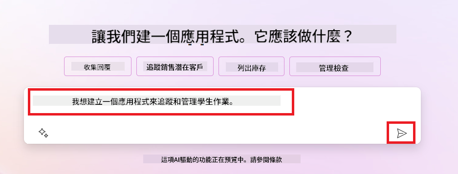

1. AI Copilot 會建議一個包含您需要的字段的 Dataverse 表格來存儲您希望追蹤的數據，並提供一些範例數據。您可以透過對話步驟使用 AI Copilot 助理功能來自訂表格。

   > **重要**：Dataverse 是 Power Platform 的底層數據平台。它是一個低代碼數據平台，用於存儲應用程式的數據。它是一項完全托管的服務，能夠安全地將數據存儲在 Microsoft Cloud 中，並在您的 Power Platform 環境中進行配置。它具有內建的數據治理功能，例如數據分類、數據來源追蹤、細粒度的訪問控制等。您可以在[這裡](https://docs.microsoft.com/powerapps/maker/data-platform/data-platform-intro?WT.mc_id=academic-109639-somelezediko)了解更多關於 Dataverse 的資訊。

   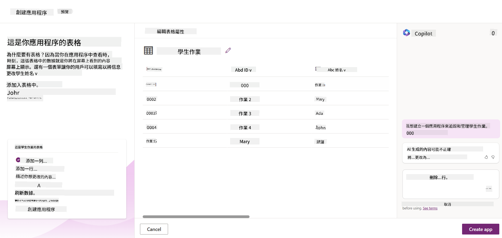

1. 教育工作者希望向提交作業的學生發送電子郵件，讓他們了解作業的進度。您可以使用 Copilot 向表格添加一個新字段來存儲學生的電子郵件。例如，您可以使用以下提示向表格添加新字段：**_我想添加一個欄位來存儲學生的電子郵件_**。點擊 **Send** 按鈕將提示發送給 AI Copilot。

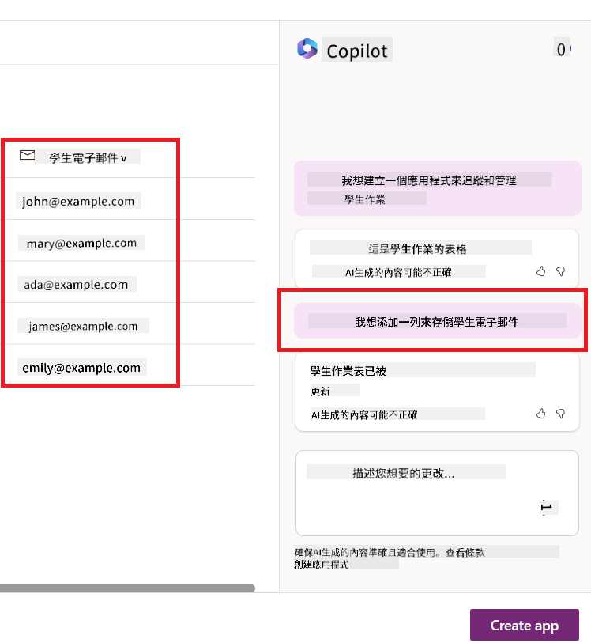

1. AI Copilot 會生成一個新字段，您可以根據需求進行自訂。

1. 完成表格後，點擊 **Create app** 按鈕以建立應用程式。

1. AI Copilot 會根據您的描述生成一個響應式 Canvas 應用程式，您可以根據需求進行自訂。

1. 為了讓教育工作者向學生發送電子郵件，您可以使用 Copilot 向應用程式添加一個新畫面。例如，您可以使用以下提示向應用程式添加新畫面：**_我想添加一個畫面來向學生發送電子郵件_**。點擊 **Send** 按鈕將提示發送給 AI Copilot。

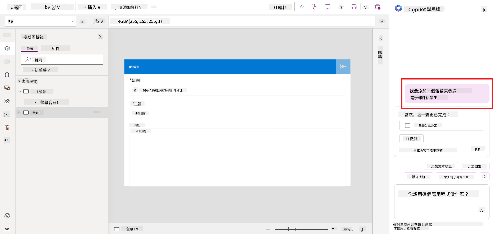

1. AI Copilot 會生成一個新畫面，您可以根據需求進行自訂。

1. 完成應用程式後，點擊 **Save** 按鈕保存應用程式。

1. 若要與教育工作者共享應用程式，點擊 **Share** 按鈕，然後再次點擊 **Share** 按鈕。您可以通過輸入教育工作者的電子郵件地址來共享應用程式。

> **您的作業**：您剛剛建立的應用程式是一個良好的開始，但仍有改進空間。使用電子郵件功能時，教育工作者只能手動輸入學生的電子郵件來發送郵件。您能否使用 Copilot 建立一個自動化流程，讓教育工作者在學生提交作業時自動向他們發送電子郵件？提示：使用正確的指令，您可以在 Power Automate 中使用 Copilot 來完成這項任務。

### 為我們的初創公司建立發票資訊表格

我們初創公司的財務團隊在追蹤發票方面遇到了困難。他們一直使用電子表格來追蹤發票，但隨著發票數量的增加，管理變得越來越困難。他們要求您建立一個表格，幫助他們存儲、追蹤和管理收到的發票資訊。該表格應用於建立一個自動化流程，提取所有發票資訊並將其存儲在表格中。該表格還應允許財務團隊查看已支付和未支付的發票。

Power Platform 擁有一個底層數據平台，稱為 Dataverse，讓您可以存儲應用程式和解決方案的數據。Dataverse 提供了一個低代碼數據平台，用於存儲應用程式的數據。它是一項完全托管的服務，能夠安全地將數據存儲在 Microsoft Cloud 中，並在您的 Power Platform 環境中進行配置。它具有內建的數據治理功能，例如數據分類、數據來源追蹤、細粒度的訪問控制等。您可以在[這裡](https://docs.microsoft.com/powerapps/maker/data-platform/data-platform-intro?WT.mc_id=academic-109639-somelezediko)了解更多關於 Dataverse 的資訊。
為什麼我們的初創公司應該使用 Dataverse？Dataverse 中的標準和自定義表提供了一個安全且基於雲端的數據存儲選項。表格可以用來存儲不同類型的數據，就像在單一 Excel 工作簿中使用多個工作表一樣。您可以使用表格來存儲特定於您的組織或業務需求的數據。我們的初創公司使用 Dataverse 的一些好處包括但不限於：

- **易於管理**：元數據和數據都存儲在雲端，因此您不必擔心它們的存儲或管理細節。您可以專注於構建您的應用程式和解決方案。

- **安全性**：Dataverse 為您的數據提供安全且基於雲端的存儲選項。您可以使用基於角色的安全性控制誰可以訪問表中的數據以及如何訪問。

- **豐富的元數據**：數據類型和關係可以直接在 Power Apps 中使用。

- **邏輯和驗證**：您可以使用業務規則、計算字段和驗證規則來強制執行業務邏輯並保持數據的準確性。

現在您已經了解了什麼是 Dataverse 以及為什麼應該使用它，接下來我們來看看如何使用 Copilot 在 Dataverse 中創建一個表格以滿足我們財務團隊的需求。

> **Note** : 您將在下一部分使用此表格來構建一個自動化流程，提取所有的發票信息並存儲到表格中。

要使用 Copilot 在 Dataverse 中創建表格，請按照以下步驟操作：

1. 進入 [Power Apps](https://make.powerapps.com?WT.mc_id=academic-105485-koreyst) 主頁。

2. 在左側導航欄中選擇 **Tables**，然後點擊 **Describe the new Table**。

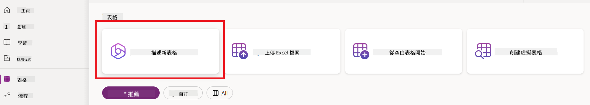

3. 在 **Describe the new Table** 頁面，使用文本框描述您想要創建的表格。例如，**_我想創建一個表格來存儲發票信息_**。點擊 **Send** 按鈕將提示發送給 AI Copilot。

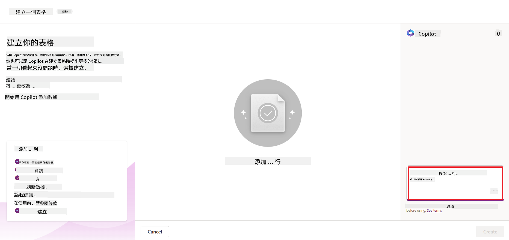

4. AI Copilot 會根據您想要跟蹤的數據建議一個 Dataverse 表格以及一些示例數據。然後，您可以使用 AI Copilot 助手功能通過對話步驟自定義表格以滿足您的需求。

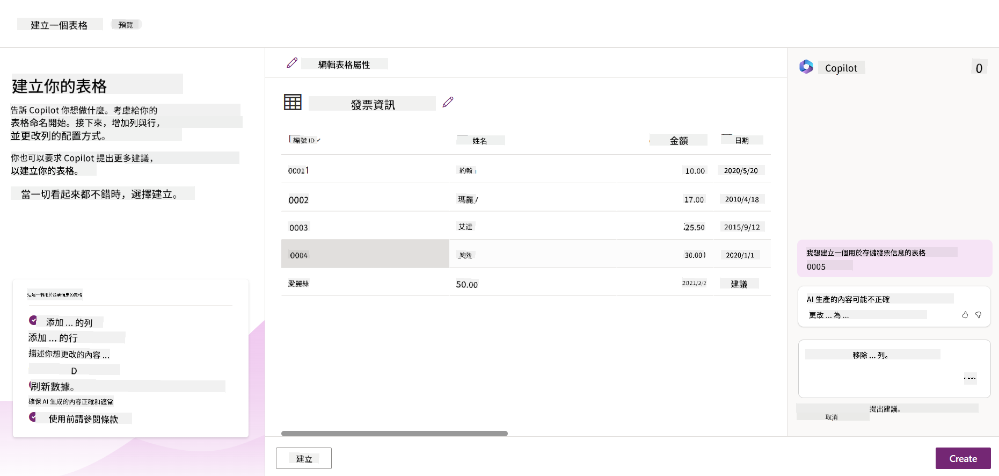

5. 財務團隊希望向供應商發送電子郵件，更新他們的發票當前狀態。您可以使用 Copilot 向表格添加一個新字段來存儲供應商的電子郵件。例如，您可以使用以下提示來添加新字段：**_我想添加一列來存儲供應商的電子郵件_**。點擊 **Send** 按鈕將提示發送給 AI Copilot。

6. AI Copilot 會生成一個新字段，然後您可以自定義該字段以滿足您的需求。

7. 完成表格後，點擊 **Create** 按鈕創建表格。

## Power Platform 中的 AI 模型與 AI Builder

AI Builder 是 Power Platform 中的一種低代碼 AI 功能，讓您可以使用 AI 模型來幫助自動化流程並預測結果。通過 AI Builder，您可以將 AI 引入到連接到 Dataverse 或各種雲端數據源（如 SharePoint、OneDrive 或 Azure）的應用程式和流程中。

## 預建 AI 模型與自定義 AI 模型

AI Builder 提供兩種類型的 AI 模型：預建 AI 模型和自定義 AI 模型。預建 AI 模型是由 Microsoft 訓練並在 Power Platform 中可用的即用型 AI 模型。這些模型幫助您為應用程式和流程添加智能功能，而無需收集數據並自行構建、訓練和發布模型。您可以使用這些模型來自動化流程並預測結果。

Power Platform 中提供的一些預建 AI 模型包括：

- **關鍵詞提取**：此模型從文本中提取關鍵詞。
- **語言檢測**：此模型檢測文本的語言。
- **情感分析**：此模型檢測文本中的正面、負面、中性或混合情感。
- **名片識別器**：此模型從名片中提取信息。
- **文本識別**：此模型從圖像中提取文本。
- **物件檢測**：此模型檢測並提取圖像中的物件。
- **文檔處理**：此模型從表單中提取信息。
- **發票處理**：此模型從發票中提取信息。

通過自定義 AI 模型，您可以將自己的模型引入 AI Builder，使其像任何 AI Builder 自定義模型一樣運作，並使用自己的數據訓練模型。您可以使用這些模型在 Power Apps 和 Power Automate 中自動化流程並預測結果。使用自定義模型時有一些限制，請閱讀更多關於這些[限制](https://learn.microsoft.com/ai-builder/byo-model#limitations?WT.mc_id=academic-105485-koreyst)。

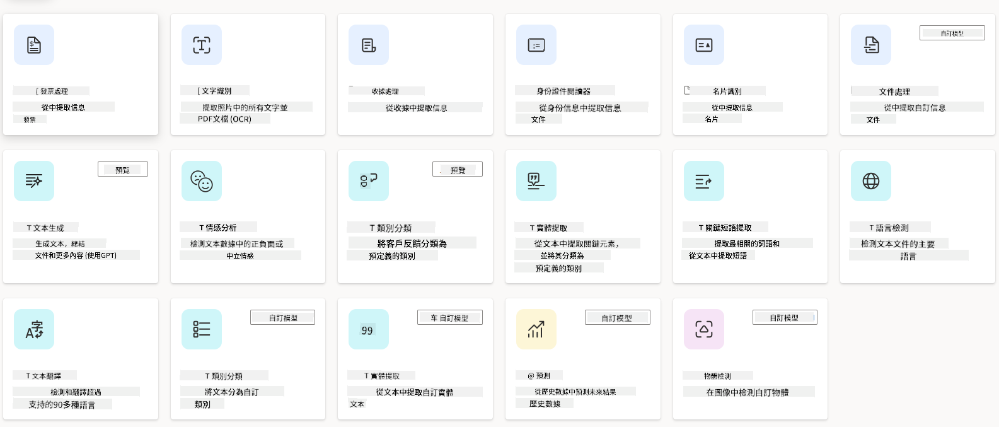

## 作業 #2 - 為我們的初創公司建立一個發票處理流程

財務團隊一直在努力處理發票。他們一直使用電子表格來跟蹤發票，但隨著發票數量的增加，管理變得越來越困難。他們要求您使用 AI 構建一個工作流程，幫助他們處理發票。該工作流程應能夠從發票中提取信息並將信息存儲到 Dataverse 表格中。工作流程還應能夠向財務團隊發送包含提取信息的電子郵件。

現在您已經了解了什麼是 AI Builder 以及為什麼應該使用它，接下來我們來看看如何使用之前提到的 AI Builder 中的發票處理 AI 模型來構建一個工作流程，幫助財務團隊處理發票。

要使用 AI Builder 中的發票處理 AI 模型構建一個幫助財務團隊處理發票的工作流程，請按照以下步驟操作：

1. 進入 [Power Automate](https://make.powerautomate.com?WT.mc_id=academic-105485-koreyst) 主頁。

2. 在主頁的文本框中描述您想要構建的工作流程。例如，**_當發票到達我的郵箱時處理發票_**。點擊 **Send** 按鈕將提示發送給 AI Copilot。

   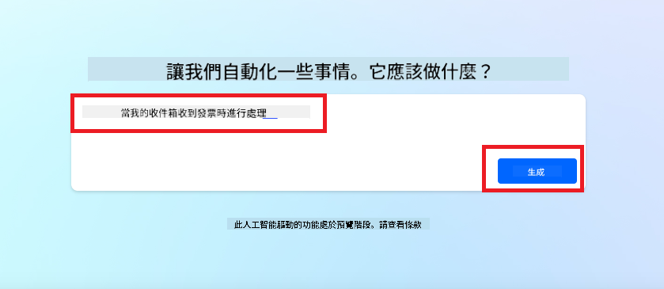

3. AI Copilot 會建議您需要執行的操作以完成您想要自動化的任務。您可以點擊 **Next** 按鈕進行下一步。

4. 在下一步中，Power Automate 會提示您設置流程所需的連接。完成後，點擊 **Create flow** 按鈕創建流程。

5. AI Copilot 會生成一個流程，然後您可以自定義該流程以滿足您的需求。

6. 更新流程的觸發器並將 **Folder** 設置為存儲發票的文件夾。例如，您可以將文件夾設置為 **Inbox**。點擊 **Show advanced options** 並將 **Only with Attachments** 設置為 **Yes**。這將確保流程僅在文件夾中收到帶附件的電子郵件時運行。

7. 從流程中移除以下操作：**HTML to text**、**Compose**、**Compose 2**、**Compose 3** 和 **Compose 4**，因為您不會使用它們。

8. 從流程中移除 **Condition** 操作，因為您不會使用它。它應該看起來像以下截圖：

   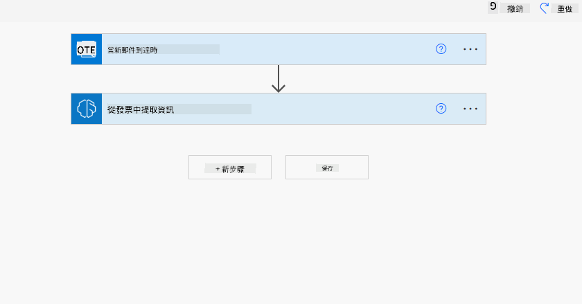

9. 點擊 **Add an action** 按鈕並搜索 **Dataverse**。選擇 **Add a new row** 操作。

10. 在 **Extract Information from invoices** 操作中，更新 **Invoice File** 指向電子郵件中的 **Attachment Content**。這將確保流程從發票附件中提取信息。

11. 選擇您之前創建的 **Table**。例如，您可以選擇 **Invoice Information** 表格。從之前的操作中選擇動態內容來填充以下字段：

    - ID
    - Amount
    - Date
    - Name
    - Status - 將 **Status** 設置為 **Pending**。
    - Supplier Email - 使用 **When a new email arrives** 觸發器中的 **From** 動態內容。

    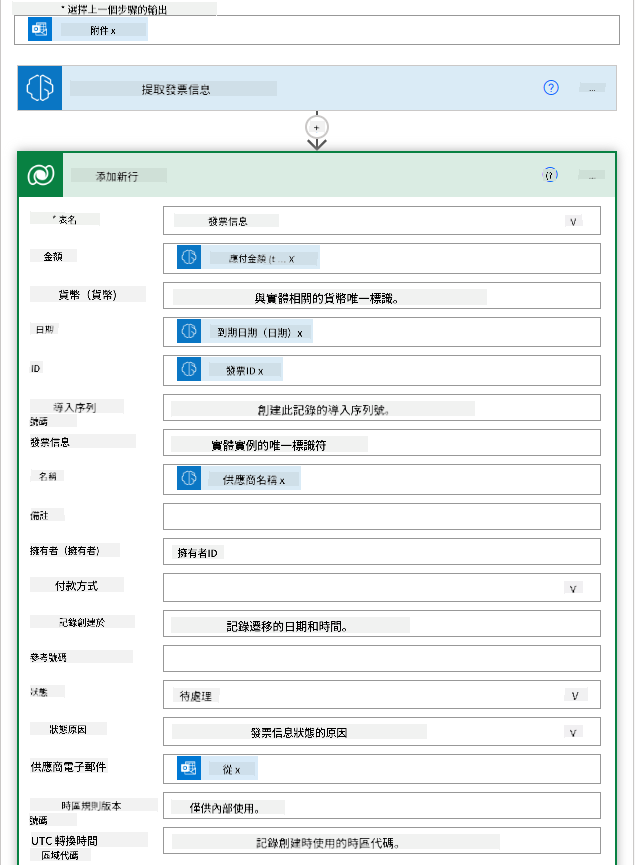

12. 完成流程後，點擊 **Save** 按鈕保存流程。然後，您可以通過向觸發器中指定的文件夾發送帶有發票的電子郵件來測試流程。

> **您的作業**：您剛剛構建的流程是一個良好的開始，現在您需要思考如何構建一個自動化流程，使我們的財務團隊能夠向供應商發送電子郵件，更新他們的發票當前狀態。提示：當發票狀態更改時，流程必須運行。

## 在 Power Automate 中使用文本生成 AI 模型

AI Builder 中的 Create Text with GPT AI 模型使您能夠基於提示生成文本，並由 Microsoft Azure OpenAI Service 提供支持。通過此功能，您可以將 GPT（生成式預訓練轉換器）技術集成到您的應用程式和流程中，以構建各種自動化流程和洞察應用程式。

GPT 模型經過大量數據的深入訓練，能夠根據提示生成與人類語言非常接近的文本。當與工作流程自動化集成時，像 GPT 這樣的 AI 模型可以用於簡化和自動化各種任務。

例如，您可以構建流程來自動生成各種用途的文本，例如：電子郵件草稿、產品描述等。您還可以使用該模型為各種應用程式生成文本，例如聊天機器人和客戶服務應用程式，幫助客戶服務代理有效且高效地回應客戶詢問。

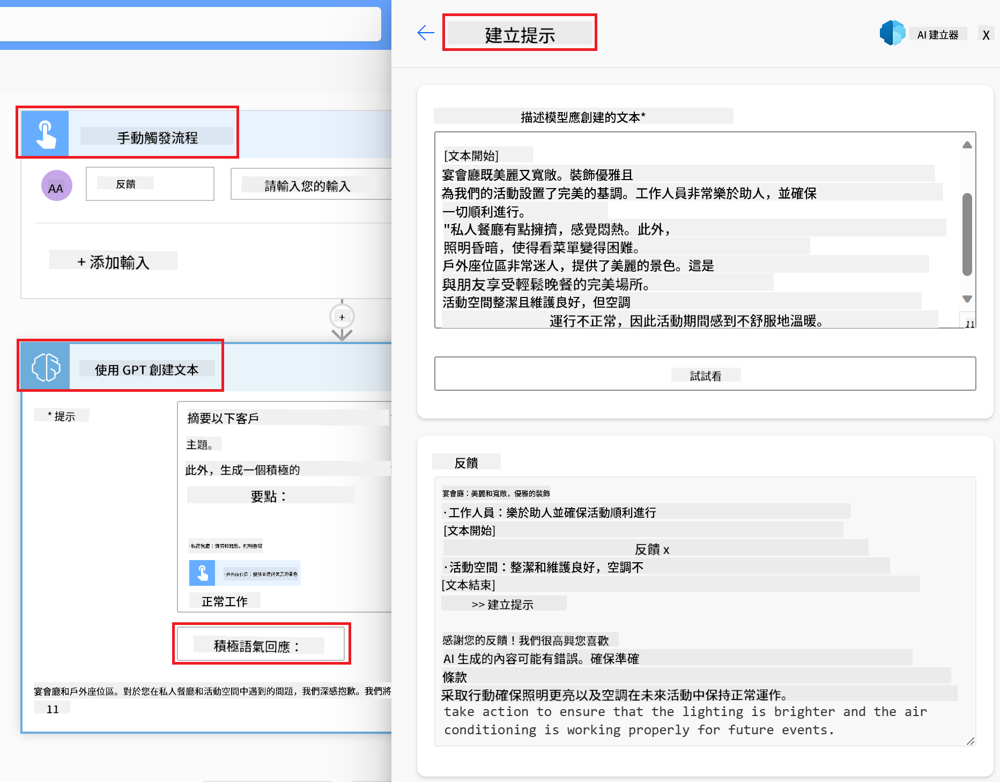

要了解如何在 Power Automate 中使用此 AI 模型，請參閱 [Add intelligence with AI Builder and GPT](https://learn.microsoft.com/training/modules/ai-builder-text-generation/?WT.mc_id=academic-109639-somelezediko) 模組。

## 出色的工作！繼續學習

完成本課程後，請查看我們的 [生成式 AI 學習集合](https://aka.ms/genai-collection?WT.mc_id=academic-105485-koreyst)，繼續提升您的生成式 AI 知識！

前往第 11 課，我們將探討如何 [整合生成式 AI 與函數調用](../11-integrating-with-function-calling/README.md?WT.mc_id=academic-105485-koreyst)！

---

**免責聲明**：  
本文件已使用 AI 翻譯服務 [Co-op Translator](https://github.com/Azure/co-op-translator) 進行翻譯。儘管我們致力於提供準確的翻譯，請注意自動翻譯可能包含錯誤或不準確之處。原始文件的母語版本應被視為權威來源。對於關鍵信息，建議使用專業人工翻譯。我們對因使用此翻譯而引起的任何誤解或誤釋不承擔責任。