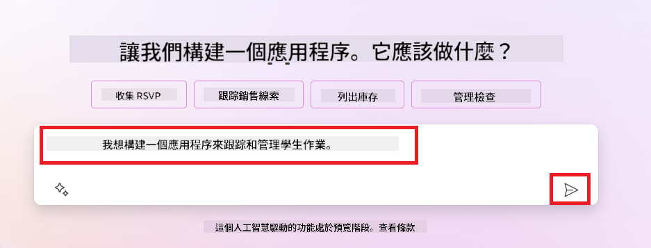
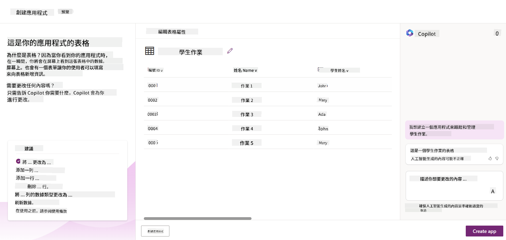
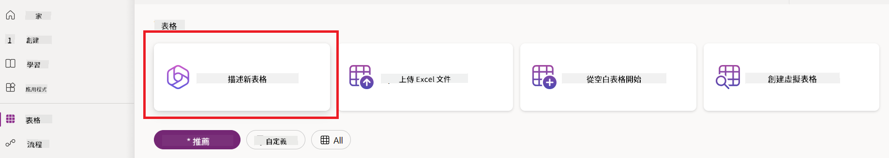
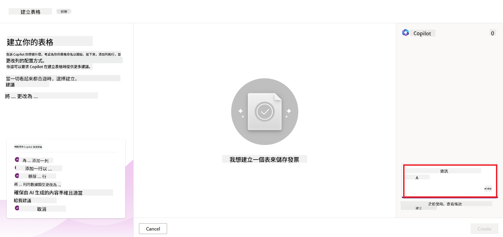

<!--
CO_OP_TRANSLATOR_METADATA:
{
  "original_hash": "f5ff3b6204a695a117d6f452403c95f7",
  "translation_date": "2025-05-19T19:51:02+00:00",
  "source_file": "10-building-low-code-ai-applications/README.md",
  "language_code": "tw"
}
-->
# 建立低代码 AI 应用程序

> _(点击上面的图片观看本课视频)_

## 介绍

在我们学习如何构建图像生成应用程序后，现在来谈谈低代码。生成式 AI 可以用于包括低代码在内的各种不同领域，但什么是低代码？我们如何将 AI 添加到其中？

通过使用低代码开发平台，传统开发人员和非开发人员构建应用程序和解决方案变得更加容易。低代码开发平台使您能够使用很少或不需要代码来构建应用程序和解决方案。这是通过提供一个可视化开发环境来实现的，该环境使您能够拖放组件以构建应用程序和解决方案。这使您能够更快、更少资源地构建应用程序和解决方案。在本课中，我们将深入探讨如何使用低代码以及如何使用 Power Platform 的 AI 增强低代码开发。

Power Platform 为组织提供了一个机会，通过直观的低代码或无代码环境来赋予他们的团队构建自己的解决方案的能力。这个环境有助于简化构建解决方案的过程。使用 Power Platform，解决方案可以在几天或几周内完成，而不是几个月或几年。Power Platform 包含五个关键产品：Power Apps、Power Automate、Power BI、Power Pages 和 Copilot Studio。

本课涵盖：

- Power Platform 中的生成式 AI 介绍
- Copilot 的介绍及其使用方法
- 使用生成式 AI 在 Power Platform 中构建应用程序和流程
- 了解 Power Platform 中的 AI Builder 的 AI 模型

## 学习目标

通过本课学习，您将能够：

- 了解 Copilot 在 Power Platform 中的工作原理。

- 为我们的教育初创公司构建一个学生作业跟踪应用程序。

- 构建一个使用 AI 从发票中提取信息的发票处理流程。

- 在使用 GPT AI 模型创建文本时应用最佳实践。

在本课中您将使用的工具和技术有：

- **Power Apps**，用于学生作业跟踪应用程序，它提供一个低代码开发环境，用于构建应用程序以跟踪、管理和交互数据。

- **Dataverse**，用于存储学生作业跟踪应用程序的数据，Dataverse 将提供一个低代码数据平台来存储应用程序的数据。

- **Power Automate**，用于发票处理流程，您将拥有一个低代码开发环境，用于构建工作流程以自动化发票处理过程。

- **AI Builder**，用于发票处理 AI 模型，您将使用预构建的 AI 模型来处理我们初创公司的发票。

## Power Platform 中的生成式 AI

增强低代码开发和应用程序与生成式 AI 是 Power Platform 的一个重点领域。目标是使每个人都能构建 AI 驱动的应用程序、网站、仪表板，并使用 AI 自动化流程，_无需任何数据科学专业知识_。这个目标是通过将生成式 AI 集成到 Power Platform 的低代码开发体验中实现的，以 Copilot 和 AI Builder 的形式。

### 这如何运作？

Copilot 是一个 AI 助手，它使您能够通过使用自然语言描述您的需求来构建 Power Platform 解决方案。您可以例如指示您的 AI 助手说明您的应用程序将使用哪些字段，它将创建应用程序和基础数据模型，或者您可以指定如何在 Power Automate 中设置流程。

您可以在应用程序屏幕中使用 Copilot 驱动的功能，以便用户通过对话交互揭示洞察。

AI Builder 是 Power Platform 中的低代码 AI 功能，它使您能够使用 AI 模型来帮助您自动化流程和预测结果。使用 AI Builder，您可以将 AI 引入到连接到 Dataverse 或各种云数据源（如 SharePoint、OneDrive 或 Azure）的应用程序和流程中。

Copilot 在所有 Power Platform 产品中可用：Power Apps、Power Automate、Power BI、Power Pages 和 Power Virtual Agents。AI Builder 在 Power Apps 和 Power Automate 中可用。在本课中，我们将重点介绍如何在 Power Apps 和 Power Automate 中使用 Copilot 和 AI Builder 为我们的教育初创公司构建解决方案。

### Power Apps 中的 Copilot

作为 Power Platform 的一部分，Power Apps 提供一个低代码开发环境，用于构建应用程序以跟踪、管理和交互数据。它是一个应用程序开发服务套件，具有可扩展的数据平台以及连接到云服务和本地数据的能力。Power Apps 允许您构建在浏览器、平板电脑和手机上运行的应用程序，并可以与同事共享。Power Apps 通过简单的界面使用户轻松进入应用程序开发，因此每个业务用户或专业开发人员都可以构建自定义应用程序。应用程序开发体验还通过 Copilot 的生成式 AI 得到增强。

Power Apps 中的 Copilot AI 助手功能使您能够描述您需要什么样的应用程序以及您希望应用程序跟踪、收集或显示什么信息。Copilot 然后根据您的描述生成一个响应式 Canvas 应用程序。您可以根据需要自定义应用程序。AI Copilot 还生成并建议一个 Dataverse 表，其中包含您需要存储要跟踪的数据的字段和一些示例数据。在本课的后面，我们将了解什么是 Dataverse 以及如何在 Power Apps 中使用它。您可以使用 AI Copilot 助手功能通过对话步骤自定义表以满足您的需求。此功能可从 Power Apps 主屏幕轻松访问。

### Power Automate 中的 Copilot

作为 Power Platform 的一部分，Power Automate 让用户可以在应用程序和服务之间创建自动化工作流程。它有助于自动化重复的业务流程，如通信、数据收集和决策审批。其简单的界面允许每个技术水平的用户（从初学者到经验丰富的开发人员）自动化工作任务。工作流程开发体验还通过 Copilot 的生成式 AI 得到增强。

Power Automate 中的 Copilot AI 助手功能使您能够描述您需要什么样的流程以及您希望流程执行什么操作。Copilot 然后根据您的描述生成一个流程。您可以根据需要自定义流程。AI Copilot 还生成并建议您需要执行任务的操作。在本课的后面，我们将了解什么是流程以及如何在 Power Automate 中使用它。您可以使用 AI Copilot 助手功能通过对话步骤自定义操作以满足您的需求。此功能可从 Power Automate 主屏幕轻松访问。

## 作业：使用 Copilot 管理我们初创公司的学生作业和发票

我们的初创公司为学生提供在线课程。初创公司迅速发展，现在难以满足课程的需求。初创公司聘请了您作为 Power Platform 开发人员，帮助他们构建一个低代码解决方案，以帮助他们管理学生作业和发票。他们的解决方案应该能够帮助他们通过应用程序跟踪和管理学生作业，并通过工作流程自动化发票处理过程。您被要求使用生成式 AI 开发解决方案。

在开始使用 Copilot 时，您可以使用 [Power Platform Copilot Prompt Library](https://github.com/pnp/powerplatform-prompts?WT.mc_id=academic-109639-somelezediko) 来开始使用提示。这个库包含一个提示列表，您可以使用这些提示与 Copilot 构建应用程序和流程。您还可以使用库中的提示来了解如何向 Copilot 描述您的需求。

### 为我们的初创公司构建学生作业跟踪应用程序

我们初创公司的教育工作者一直在努力跟踪学生作业。他们一直在使用电子表格来跟踪作业，但随着学生人数的增加，这变得难以管理。他们要求您构建一个应用程序来帮助他们跟踪和管理学生作业。该应用程序应该使他们能够添加新作业、查看作业、更新作业和删除作业。应用程序还应该使教育工作者和学生能够查看已评分和未评分的作业。

您将使用 Power Apps 中的 Copilot 按以下步骤构建应用程序：

1. 导航到 [Power Apps](https://make.powerapps.com?WT.mc_id=academic-105485-koreyst) 主屏幕。

1. 使用主屏幕上的文本区域描述您想要构建的应用程序。例如，**_我想构建一个应用程序来跟踪和管理学生作业_**。点击 **发送** 按钮将提示发送给 AI Copilot。

1. AI Copilot 将建议一个 Dataverse 表，其中包含您需要存储要跟踪的数据的字段和一些示例数据。您可以使用 AI Copilot 助手功能通过对话步骤自定义表以满足您的需求。

   > **重要**：Dataverse 是 Power Platform 的基础数据平台。它是一个低代码数据平台，用于存储应用程序的数据。它是一个完全托管的服务，在您的 Power Platform 环境中安全地存储数据。它具有内置的数据治理功能，如数据分类、数据沿袭、细粒度访问控制等。您可以在 [这里](https://docs.microsoft.com/powerapps/maker/data-platform/data-platform-intro?WT.mc_id=academic-109639-somelezediko) 了解更多关于 Dataverse 的信息。

   

1. 教育工作者希望发送电子邮件给提交作业的学生，以便让他们了解作业的进展。您可以使用 Copilot 添加一个新字段到表中以存储学生的电子邮件。例如，您可以使用以下提示向表中添加一个新字段：**_我想添加一列来存储学生电子邮件_**。点击 **发送** 按钮将提示发送给 AI Copilot。

1. AI Copilot 将生成一个新字段，您可以根据需要自定义字段。

1. 完成表后，点击 **创建应用程序** 按钮创建应用程序。

1. AI Copilot 将根据您的描述生成一个响应式 Canvas 应用程序。您可以根据需要自定义应用程序。

1. 为了让教育工作者发送电子邮件给学生，您可以使用 Copilot 向应用程序添加一个新屏幕。例如，您可以使用以下提示向应用程序添加一个新屏幕：**_我想添加一个屏幕来发送电子邮件给学生_**。点击 **发送** 按钮将提示发送给 AI Copilot。

1. AI Copilot 将生成一个新屏幕，您可以根据需要自定义屏幕。

1. 完成应用程序后，点击 **保存** 按钮保存应用程序。

1. 要与教育工作者共享应用程序，点击 **共享** 按钮，然后再次点击 **共享** 按钮。您可以通过输入他们的电子邮件地址与教育工作者共享应用程序。

> **您的作业**：您刚刚构建的应用程序是一个良好的开端，但可以改进。通过电子邮件功能，教育工作者只能手动发送电子邮件给学生，必须输入他们的电子邮件。您能否使用 Copilot 构建一个自动化流程，使教育工作者能够在学生提交作业时自动发送电子邮件给他们？您的提示是，使用正确的提示，您可以在 Power Automate 中使用 Copilot 来构建此功能。

### 为我们的初创公司构建发票信息表

我们的初创公司的财务团队一直在努力跟踪发票。他们一直在使用电子表格来跟踪发票，但随着发票数量的增加，这变得难以管理。他们要求您构建一个表来帮助他们存储、跟踪和管理他们收到的发票信息。该表应该用于构建一个自动化流程，提取所有发票信息并将其存储在表中。该表还应该使财务团队能够查看已支付和未支付的发票。

Power Platform 有一个基础数据平台叫做 Dataverse，使您能够存储应用程序和解决方案的数据。Dataverse 提供一个低代码数据平台，用于存储应用程序的数据。它是一个完全托管的服务，在您的 Power Platform 环境中安全地存储数据。它具有内置的数据治理功能，如数据分类、数据沿袭、细粒度访问控制等。您可以在 [这里](https://docs.microsoft.com/powerapps/maker/data-platform/data-platform-intro?WT.mc_id=academic-109639-somelezediko) 了解更多关于 Dataverse 的信息。

为什么我们要为初创公司使用 Dataverse？Dataverse 中的标准和自定义表提供了一个安全的云存储选项用于您的数据。表允许您存储不同类型的数据，类似于您可能在单个 Excel 工作簿中使用多个工作表。您可以使用表来存储特定于您的组织或业务需求的数据。我们的初创公司使用 Dataverse 的一些好处包括但不限于：

- **易于管理**：元数据和数据都存储在云中，因此您不必担心它们的存储或管理细节。您可以专注于构建您的应用程序和解决方案。

- **安全**：Dataverse 提供一个安全的云存储选项用于您的数据。您可以控制谁可以访问表中的数据以及他们如何访问这些数据，使用基于角色的安全性。

- **丰富的元数据**：数据类型和关系直接在 Power Apps 中使用。

- **逻辑和验证**：您可以使用业务规则、计算字段和验证规则来执行业务逻辑并保持数据准确性。

现在您知道了什么是 Dataverse 以及为什么要使用它，让我们看看如何使用 Copilot 在 Dataverse 中创建一个表以满足我们财务团队的需求。

> **注意**：您将在下一部分使用此表构建一个自动化流程，提取所有发票信息并将其存储在表中。
要使用 Copilot 在 Dataverse 中创建一个表，请按照以下步骤操作： 1. 导航到 [Power Apps](https://make.powerapps.com?WT.mc_id=academic-105485-koreyst) 主屏幕。 2. 在左侧导航栏上，选择 **表**，然后点击 **描述新表**。  1. 在 **描述新表** 屏幕上，使用文本区域描述您想要创建的表。例如，**_我想创建一个表来存储发票信息_**。点击 **发送** 按钮将提示发送给 AI Copilot。  1. AI Copilot 将建议一个 Dataverse 表，其中包含您需要存储要跟踪的数据的字段和一些示例数据。您可以使用 AI Copilot 助手功能通过对话步骤自定义表以满足您的需求。  1. 财务团队希望发送电子邮件给供应商，以便让他们了解发票的当前状态。您可以使用 Copilot 向表中添加一个新字段来存储供应商的电子邮件。例如，您可以使用以下提示向表中添加一个新字段：**_我想添加一列来存储供应商电子邮件_**。点击 **发送** 按钮将提示发送给 AI Copilot。 1. AI Copilot 将生成一个新字段，您可以根据需要自定义字段。 1. 完成表后，点击 **创建** 按钮创建表。

## Power Platform 中的 AI Builder 的 AI 模型

AI Builder 是 Power Platform 中的低代码 AI 功能，它使您能够使用 AI 模型来帮助您自动化流程和预测结果。使用 AI Builder，您可以将 AI 引入到连接到 Dataverse 或各种云数据源（如 SharePoint、OneDrive 或 Azure）的应用程序和流程中。

## 预构建 AI 模型与自定义 AI 模型

AI Builder 提供两种类型的 AI 模型：预构建 AI 模型和自定义 AI 模型。预构建 AI 模型是由 Microsoft 训练并在 Power Platform 中提供的现成可用的 AI 模型。这些模型帮助您在无需收集数据然后构建、训练和发布自己的模型的情况下，为您的应用程序和流程添加智能。您可以使用这些模型来自动化流程和预测结果。Power Platform 中提供的一些预构建 AI 模型包括：

- **关键短语提取**：此模型从文本中提取关键短语。
- **语言检测**：此模型检测文本的语言。
- **情感分析**：此模型能檢測文本中的正面、負面、中性或混合情感。  
- **名片讀取器**：此模型能從名片中提取資訊。  
- **文字識別**：此模型能從圖像中提取文字。  
- **物件檢測**：此模型能檢測並提取圖像中的物件。  
- **文件處理**：此模型能從表單中提取資訊。  
- **發票處理**：此模型能從發票中提取資訊。

透過自訂 AI 模型，您可以將自己的模型引入 AI Builder，使其能像任何 AI Builder 自訂模型一樣運作，允許您使用自己的資料訓練模型。您可以使用這些模型來自動化流程和預測 Power Apps 和 Power Automate 中的結果。使用自訂模型時會有一些限制。請閱讀這些[限制](https://learn.microsoft.com/ai-builder/byo-model#limitations?WT.mc_id=academic-105485-koreyst)。

## 作業 #2 - 為我們的創業公司建立一個發票處理流程

財務團隊一直在努力處理發票。他們一直使用電子表格來跟蹤發票，但隨著發票數量的增加，這已經變得難以管理。他們要求您建立一個工作流程，幫助他們使用 AI 處理發票。該工作流程應允許他們從發票中提取資訊並將其存儲在 Dataverse 表中。該工作流程還應允許他們將提取的資訊通過電子郵件發送給財務團隊。

現在您已經知道什麼是 AI Builder 以及為什麼應該使用它，我們來看看如何使用先前介紹的 AI Builder 中的發票處理 AI 模型來建立一個幫助財務團隊處理發票的工作流程。

要使用 AI Builder 中的發票處理 AI 模型建立一個幫助財務團隊處理發票的工作流程，請按照以下步驟進行：

1. 前往 [Power Automate](https://make.powerautomate.com?WT.mc_id=academic-105485-koreyst) 主頁。
2. 使用主頁上的文本區域描述您想要建立的工作流程。例如，**_當發票到達我的信箱時處理發票_**。點擊 **發送** 按鈕將提示發送給 AI Copilot。
3. AI Copilot 會建議您需要執行的操作來完成您想要自動化的任務。您可以點擊 **下一步** 按鈕進行下一步。
4. 在下一步中，Power Automate 會提示您設置流所需的連接。完成後，點擊 **建立流** 按鈕來創建流。
5. AI Copilot 會生成一個流，然後您可以自訂流以滿足您的需求。
6. 更新流的觸發器，將 **資料夾** 設置為存儲發票的資料夾。例如，您可以將資料夾設置為 **收件箱**。點擊 **顯示高級選項** 並將 **僅限附件** 設置為 **是**。這將確保流僅在收到帶附件的電子郵件時運行。
7. 從流中移除以下操作：**HTML 到文本**、**撰寫**、**撰寫 2**、**撰寫 3** 和 **撰寫 4**，因為您不會使用它們。
8. 從流中移除 **條件** 操作，因為您不會使用它。應如下圖所示：
9. 點擊 **新增動作** 按鈕並搜索 **Dataverse**。選擇 **新增一行** 動作。
10. 在 **從發票中提取資訊** 操作中，更新 **發票文件** 以指向電子郵件中的 **附件內容**。這將確保流從發票附件中提取資訊。
11. 選擇您之前建立的 **表**。例如，您可以選擇 **發票資訊** 表。選擇來自前一動作的動態內容以填寫以下欄位：
    - ID
    - 金額
    - 日期
    - 名稱
    - 狀態
    - 將 **狀態** 設置為 **待處理**。
    - 供應商電子郵件
    - 使用 **當新電子郵件到達時** 觸發器中的 **來自** 動態內容。
12. 完成流後，點擊 **保存** 按鈕來保存流。然後您可以通過向您在觸發器中指定的資料夾發送帶發票的電子郵件來測試流。

> **您的作業**：您剛建立的流是一個良好的開始，現在您需要考慮如何建立一個自動化流程，使我們的財務團隊能夠向供應商發送電子郵件，以更新他們當前發票的狀態。您的提示：當發票狀態變更時，流必須運行。

## 在 Power Automate 中使用文本生成 AI 模型

AI Builder 中的使用 GPT AI 模型生成文本功能使您可以根據提示生成文本，並由 Microsoft Azure OpenAI 服務提供支持。通過此功能，您可以將 GPT（生成預訓練轉換器）技術整合到您的應用和流程中，以建立各種自動化流程和有洞察力的應用。

GPT 模型經過大量數據的廣泛訓練，能夠在提供提示時生成與人類語言非常相似的文本。當與工作流程自動化相結合時，像 GPT 這樣的 AI 模型可以用來簡化和自動化各種任務。

例如，您可以建立流程來自動生成各種用例的文本，如：電子郵件草稿、產品描述等。您還可以使用模型為各種應用生成文本，如聊天機器人和客戶服務應用，這些應用使客戶服務代理能夠有效地回應客戶查詢。

要學習如何在 Power Automate 中使用此 AI 模型，請參閱 [使用 AI Builder 和 GPT 添加智能](https://learn.microsoft.com/training/modules/ai-builder-text-generation/?WT.mc_id=academic-109639-somelezediko) 模組。

## 幹得好！繼續學習

完成本課後，請查看我們的 [生成式 AI 學習集合](https://aka.ms/genai-collection?WT.mc_id=academic-105485-koreyst)，以繼續提升您的生成式 AI 知識！

前往第 11 課，我們將探討如何 [將生成式 AI 與功能調用整合](../11-integrating-with-function-calling/README.md?WT.mc_id=academic-105485-koreyst)！

**免責聲明**：

本文件已使用AI翻譯服務[Co-op Translator](https://github.com/Azure/co-op-translator)進行翻譯。我們努力追求準確性，但請注意，自動翻譯可能包含錯誤或不準確之處。應以原始語言的文件作為權威來源。對於關鍵信息，建議尋求專業人工翻譯。我們對因使用此翻譯而引起的任何誤解或誤讀不承擔責任。