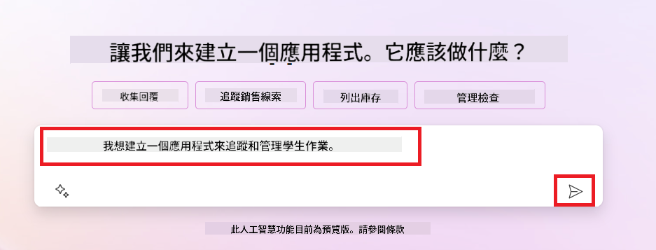
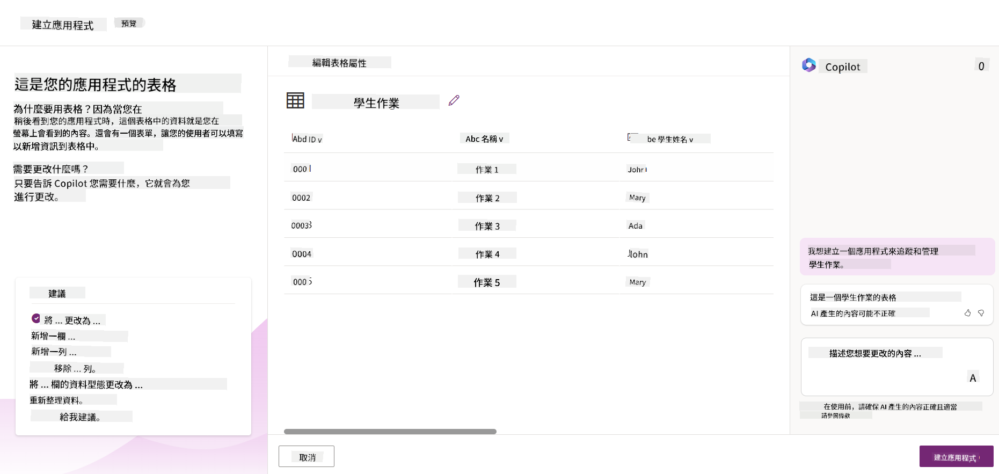
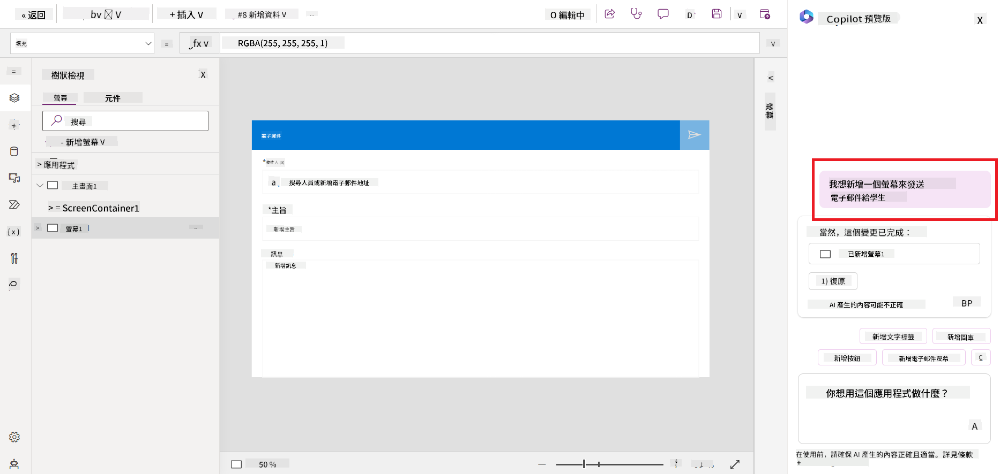
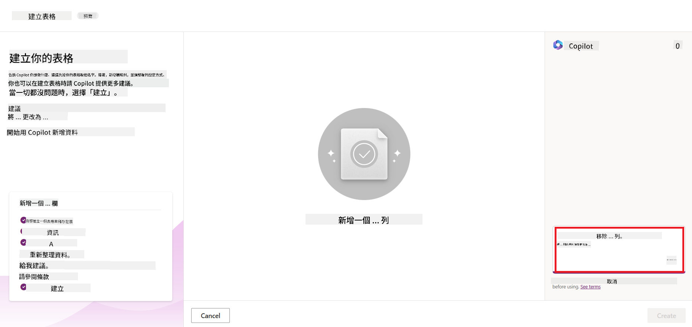
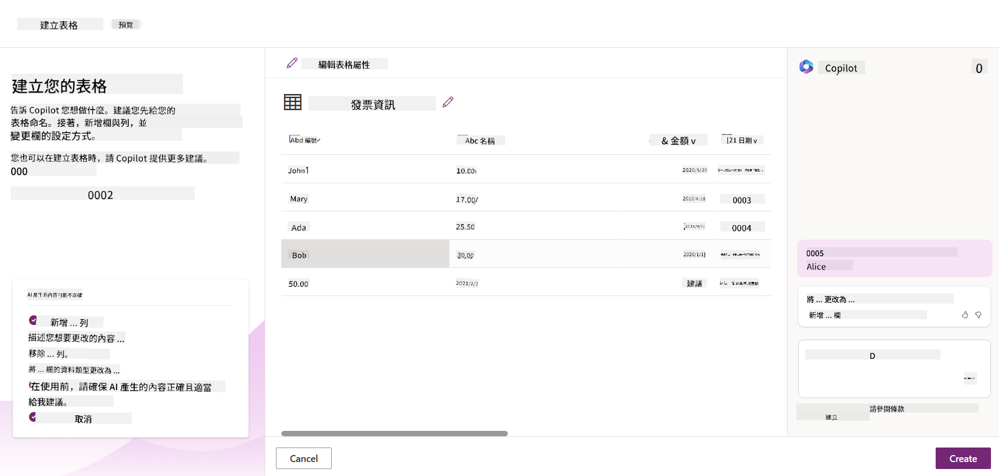
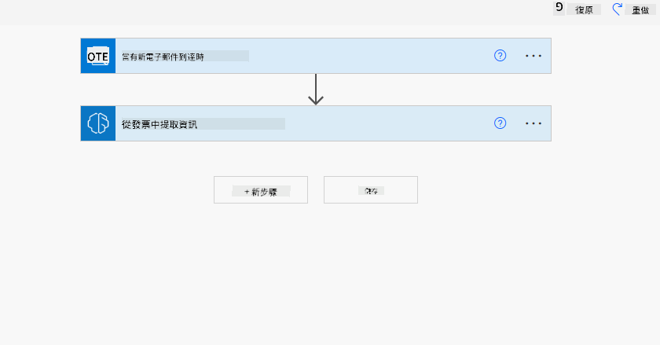
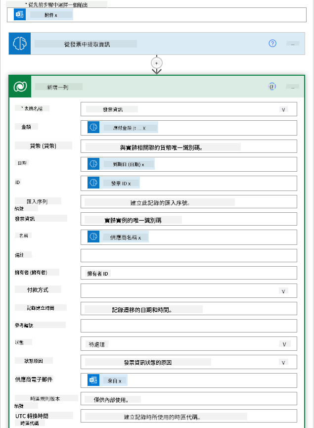
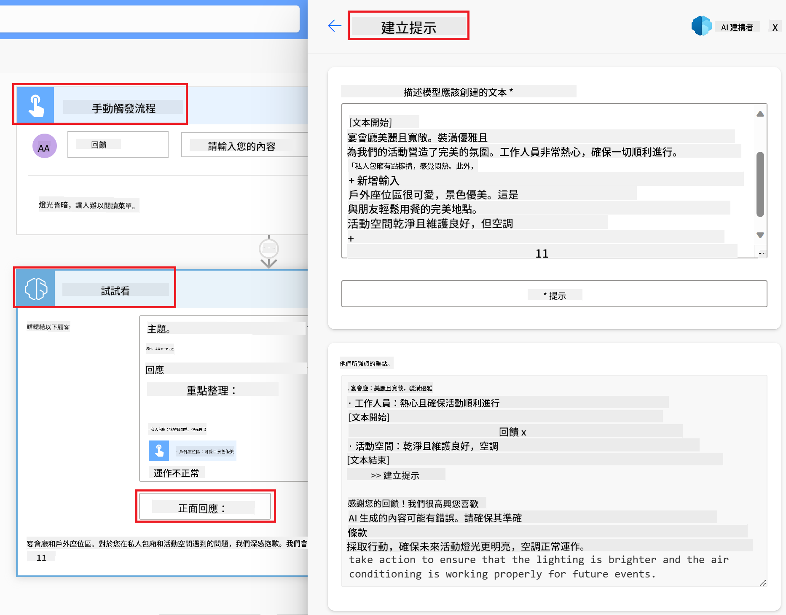

<!--
CO_OP_TRANSLATOR_METADATA:
{
  "original_hash": "f5ff3b6204a695a117d6f452403c95f7",
  "translation_date": "2025-07-09T13:46:38+00:00",
  "source_file": "10-building-low-code-ai-applications/README.md",
  "language_code": "tw"
}
-->
# 建立低程式碼 AI 應用程式

> _(點擊上方圖片觀看本課程影片)_

## 介紹

現在我們已經學會如何建立影像生成應用程式，接下來來談談低程式碼。生成式 AI 可以應用在多個領域，包括低程式碼，但什麼是低程式碼？我們又該如何將 AI 加入其中？

透過低程式碼開發平台，傳統開發者和非開發者都能更輕鬆地建立應用程式和解決方案。低程式碼開發平台讓你幾乎不需撰寫程式碼就能建立應用程式和解決方案。這是透過提供視覺化開發環境，讓你拖放元件來建構應用程式和解決方案來達成的。這樣能讓你更快且用更少資源完成開發。在本課程中，我們將深入探討如何使用低程式碼，以及如何利用 Power Platform 透過 AI 強化低程式碼開發。

Power Platform 提供組織一個機會，讓團隊能透過直覺的低程式碼或無程式碼環境自行建立解決方案。這個環境簡化了解決方案的建立流程。使用 Power Platform，解決方案可以在幾天或幾週內完成，而非數月或數年。Power Platform 包含五個主要產品：Power Apps、Power Automate、Power BI、Power Pages 以及 Copilot Studio。

本課程涵蓋：

- Power Platform 中生成式 AI 的介紹
- Copilot 介紹及使用方法
- 使用生成式 AI 在 Power Platform 建立應用程式與流程
- 了解 Power Platform 中 AI Builder 的 AI 模型

## 學習目標

完成本課程後，你將能夠：

- 了解 Copilot 在 Power Platform 中的運作方式。

- 為我們的教育新創公司建立學生作業追蹤應用程式。

- 建立使用 AI 從發票中擷取資訊的發票處理流程。

- 在使用 Create Text with GPT AI 模型時，應用最佳實務。

本課程中你將使用的工具與技術包括：

- **Power Apps**：用於建立學生作業追蹤應用程式，提供低程式碼開發環境，方便建立用於追蹤、管理及互動資料的應用程式。

- **Dataverse**：用於儲存學生作業追蹤應用程式的資料，提供低程式碼資料平台來存放應用程式資料。

- **Power Automate**：用於建立發票處理流程，提供低程式碼開發環境來建立自動化工作流程。

- **AI Builder**：用於發票處理的 AI 模型，使用預建的 AI 模型來處理我們新創公司的發票。

## Power Platform 中的生成式 AI

利用生成式 AI 強化低程式碼開發與應用是 Power Platform 的重要焦點。目標是讓每個人都能建立具 AI 功能的應用程式、網站、儀表板，並用 AI 自動化流程，_不需要任何資料科學專業知識_。這個目標是透過將生成式 AI 整合到 Power Platform 的低程式碼開發體驗中，以 Copilot 和 AI Builder 的形式實現。

### 這是如何運作的？

Copilot 是一個 AI 助手，讓你透過自然語言的對話步驟描述需求，來建立 Power Platform 解決方案。舉例來說，你可以指示 AI 助手說明應用程式需要使用哪些欄位，它就會建立應用程式和底層資料模型，或者你可以指定如何在 Power Automate 中設定流程。

你也可以在應用程式畫面中使用 Copilot 驅動的功能，讓使用者透過對話互動來發掘洞見。

AI Builder 是 Power Platform 中的低程式碼 AI 功能，讓你使用 AI 模型來協助自動化流程和預測結果。透過 AI Builder，你可以將 AI 帶入連接 Dataverse 或其他雲端資料來源（如 SharePoint、OneDrive 或 Azure）的應用程式和流程中。

Copilot 可用於所有 Power Platform 產品：Power Apps、Power Automate、Power BI、Power Pages 和 Power Virtual Agents。AI Builder 則可用於 Power Apps 和 Power Automate。本課程將聚焦於如何在 Power Apps 和 Power Automate 中使用 Copilot 和 AI Builder，為我們的教育新創公司建立解決方案。

### Power Apps 中的 Copilot

作為 Power Platform 的一部分，Power Apps 提供低程式碼開發環境，用於建立追蹤、管理及互動資料的應用程式。它是一套應用程式開發服務，擁有可擴充的資料平台，並能連接雲端服務及內部部署資料。Power Apps 允許你建立可在瀏覽器、平板和手機上執行的應用程式，並能與同事分享。Power Apps 以簡單介面降低使用門檻，讓每位商務使用者或專業開發者都能建立自訂應用程式。透過 Copilot，生成式 AI 也提升了應用程式開發體驗。

Power Apps 中的 Copilot AI 助手功能讓你描述需要什麼樣的應用程式，以及想追蹤、收集或顯示哪些資訊。Copilot 會根據你的描述產生一個響應式 Canvas 應用程式。你可以接著自訂應用程式以符合需求。AI Copilot 也會產生並建議一個 Dataverse 資料表，包含你需要儲存追蹤資料的欄位及一些範例資料。本課程稍後會介紹 Dataverse 是什麼，以及如何在 Power Apps 中使用它。你也可以透過 AI Copilot 的對話步驟功能，進一步自訂資料表。此功能可直接從 Power Apps 首頁使用。

### Power Automate 中的 Copilot

作為 Power Platform 的一部分，Power Automate 讓使用者建立應用程式與服務間的自動化工作流程。它協助自動化重複的商務流程，如溝通、資料收集和決策核准。簡單的介面讓各種技術程度的使用者（從初學者到資深開發者）都能自動化工作任務。生成式 AI 透過 Copilot 也提升了工作流程開發體驗。

Power Automate 中的 Copilot AI 助手功能讓你描述需要什麼樣的流程，以及希望流程執行哪些動作。Copilot 會根據你的描述產生一個流程。你可以接著自訂流程以符合需求。AI Copilot 也會產生並建議你完成自動化任務所需的動作。本課程稍後會介紹流程是什麼，以及如何在 Power Automate 中使用它們。你也可以透過 AI Copilot 的對話步驟功能，進一步自訂動作。此功能可直接從 Power Automate 首頁使用。

## 作業：使用 Copilot 管理我們新創公司的學生作業與發票

我們的新創公司提供線上課程給學生。公司快速成長，現在難以應付課程需求。公司聘請你擔任 Power Platform 開發者，協助建立低程式碼解決方案，幫助管理學生作業和發票。解決方案應能透過應用程式追蹤和管理學生作業，並透過工作流程自動化發票處理。你被要求使用生成式 AI 來開發此解決方案。

開始使用 Copilot 時，你可以利用 [Power Platform Copilot Prompt Library](https://github.com/pnp/powerplatform-prompts?WT.mc_id=academic-109639-somelezediko) 取得提示範例。此庫包含一系列可用於 Copilot 建立應用程式和流程的提示。你也可以參考這些提示，了解如何向 Copilot 描述需求。

### 為我們的新創公司建立學生作業追蹤應用程式

我們公司的教育人員一直難以追蹤學生作業。他們過去使用試算表追蹤作業，但隨著學生數量增加，管理變得困難。他們請你建立一款應用程式，幫助追蹤和管理學生作業。應用程式應允許新增作業、查看作業、更新作業和刪除作業。應用程式也應讓教育人員和學生查看已評分和未評分的作業。

你將使用 Power Apps 中的 Copilot 按照以下步驟建立應用程式：

1. 前往 [Power Apps](https://make.powerapps.com?WT.mc_id=academic-105485-koreyst) 首頁。

1. 在首頁的文字區域描述你想建立的應用程式。例如，**_我想建立一款用來追蹤和管理學生作業的應用程式_**。點擊 **Send** 按鈕將提示發送給 AI Copilot。

1. AI Copilot 會建議一個 Dataverse 資料表，包含你需要儲存追蹤資料的欄位及一些範例資料。你可以透過 AI Copilot 的對話步驟功能，自訂資料表以符合需求。

   > **重要**：Dataverse 是 Power Platform 的底層資料平台。它是一個低程式碼資料平台，用於儲存應用程式資料。Dataverse 是一項完全託管的服務，安全地將資料存放在 Microsoft 雲端，並在你的 Power Platform 環境中配置。它內建資料治理功能，如資料分類、資料血緣、細粒度存取控制等。你可以在[這裡](https://docs.microsoft.com/powerapps/maker/data-platform/data-platform-intro?WT.mc_id=academic-109639-somelezediko)了解更多關於 Dataverse 的資訊。

   

1. 教育人員想要寄送電子郵件給已提交作業的學生，讓他們了解作業進度。你可以使用 Copilot 新增欄位來儲存學生電子郵件。例如，你可以使用以下提示新增欄位：**_我想新增一個欄位來儲存學生電子郵件_**。點擊 **Send** 按鈕將提示發送給 AI Copilot。

1. AI Copilot 會產生新欄位，你可以接著自訂欄位以符合需求。

1. 完成資料表後，點擊 **Create app** 按鈕建立應用程式。

1. AI Copilot 會根據你的描述產生一款響應式 Canvas 應用程式。你可以接著自訂應用程式以符合需求。

1. 為了讓教育人員能寄送電子郵件給學生，你可以使用 Copilot 新增一個畫面。例如，你可以使用以下提示新增畫面：**_我想新增一個畫面用來寄送電子郵件給學生_**。點擊 **Send** 按鈕將提示發送給 AI Copilot。

1. AI Copilot 會產生新畫面，你可以接著自訂畫面以符合需求。

1. 完成應用程式後，點擊 **Save** 按鈕儲存應用程式。

1. 若要與教育人員分享應用程式，點擊 **Share** 按鈕，接著再點擊一次 **Share**。你可以輸入他們的電子郵件地址來分享應用程式。

> **你的作業**：你剛建立的應用程式是一個良好的起點，但仍有改進空間。使用電子郵件功能時，教育人員只能手動輸入學生電子郵件來寄信。你能否利用 Copilot 建立一個自動化流程，讓教育人員在學生提交作業時自動寄送電子郵件？提示是：使用正確的提示，你可以在 Power Automate 中利用 Copilot 來建立此自動化流程。

### 為我們的新創公司建立發票資訊資料表

我們新創公司的財務團隊一直難以追蹤發票。他們過去使用試算表追蹤發票，但隨著發票數量增加，管理變得困難。他們請你建立一個資料表，幫助儲存、追蹤和管理收到的發票資訊。此資料表將用於建立自動化流程，擷取所有發票資訊並存入資料表。資料表也應讓財務團隊查看已付款和未付款的發票。

Power Platform 有一個底層資料平台叫做 Dataverse，讓你能儲存應用程式和解決方案的資料。Dataverse 提供低程式碼資料平台來存放應用程式資料。它是一項完全託管的服務，安全地將資料存放在 Microsoft 雲端，並在你的 Power Platform 環境中配置。它內建資料治理功能，如資料分類、資料血緣、細粒度存取控制等。你可以在[這裡](https://docs.microsoft.com/powerapps/maker/data-platform/data-platform-intro?WT.mc_id=academic-109639-somelezediko)了解更多關於 Dataverse 的資訊。

為什麼我們的新創公司要使用 Dataverse？Dataverse 中的標準和自訂資料表提供安全且基於雲端的資料儲存選項。資料表讓你能儲存不同類型的資料，類似於在 Excel 活頁簿中使用多個工作表。你可以使用資料表來儲存特定於組織或業務需求的資料。我們的新創公司使用 Dataverse 可獲得的好處包括但不限於：
- **易於管理**：元資料和資料皆儲存在雲端，您不必擔心它們的儲存或管理細節，可以專注於開發您的應用程式和解決方案。

- **安全**：Dataverse 提供安全且基於雲端的資料儲存選項。您可以透過角色基礎安全性控制誰能存取資料表中的資料，以及他們如何存取。

- **豐富的元資料**：資料類型和關聯可直接在 Power Apps 中使用。

- **邏輯與驗證**：您可以使用商業規則、計算欄位和驗證規則來強制執行商業邏輯並維護資料的準確性。

現在您已了解 Dataverse 是什麼以及為什麼要使用它，接下來讓我們看看如何使用 Copilot 在 Dataverse 中建立一個符合財務團隊需求的資料表。

> **Note** ：您將在下一節使用此資料表來建立一個自動化流程，該流程會擷取所有發票資訊並將其儲存在資料表中。

使用 Copilot 在 Dataverse 中建立資料表，請依照以下步驟：

1. 前往 [Power Apps](https://make.powerapps.com?WT.mc_id=academic-105485-koreyst) 首頁。

2. 在左側導覽列中選擇 **Tables**，然後點擊 **Describe the new Table**。

3. 在 **Describe the new Table** 頁面，使用文字區描述您想建立的資料表。例如，**_我想建立一個用來儲存發票資訊的資料表_**。點擊 **Send** 按鈕將提示發送給 AI Copilot。

4. AI Copilot 會建議一個 Dataverse 資料表，包含您需要追蹤資料的欄位及一些範例資料。您可以透過 AI Copilot 的對話式輔助功能，依步驟自訂資料表以符合需求。

5. 財務團隊希望能寄信給供應商，更新他們發票的目前狀態。您可以使用 Copilot 新增欄位來儲存供應商電子郵件。例如，您可以使用以下提示新增欄位：**_我想新增一個欄位來儲存供應商電子郵件_**。點擊 **Send** 按鈕將提示發送給 AI Copilot。

6. AI Copilot 會產生新欄位，您可以再依需求自訂該欄位。

7. 完成資料表設定後，點擊 **Create** 按鈕建立資料表。

## Power Platform 中的 AI 模型與 AI Builder

AI Builder 是 Power Platform 中的低程式碼 AI 功能，讓您能使用 AI 模型來協助自動化流程及預測結果。透過 AI Builder，您可以將 AI 整合到連接 Dataverse 或其他雲端資料來源（如 SharePoint、OneDrive 或 Azure）的應用程式和流程中。

## 預建 AI 模型與自訂 AI 模型

AI Builder 提供兩種 AI 模型：預建 AI 模型與自訂 AI 模型。預建 AI 模型是由 Microsoft 訓練並在 Power Platform 中可直接使用的模型，幫助您在不需自行收集資料、建立、訓練及發佈模型的情況下，為應用程式和流程加入智慧功能。您可以使用這些模型來自動化流程及預測結果。

Power Platform 中部分可用的預建 AI 模型包括：

- **關鍵詞擷取**：從文字中擷取關鍵詞。
- **語言偵測**：偵測文字的語言。
- **情感分析**：判斷文字的正面、負面、中立或混合情感。
- **名片辨識**：從名片中擷取資訊。
- **文字辨識**：從圖片中擷取文字。
- **物件偵測**：偵測並擷取圖片中的物件。
- **文件處理**：從表單中擷取資訊。
- **發票處理**：從發票中擷取資訊。

使用自訂 AI 模型，您可以將自己的模型帶入 AI Builder，使其像其他 AI Builder 自訂模型一樣運作，並使用您自己的資料來訓練模型。您可以在 Power Apps 和 Power Automate 中使用這些模型來自動化流程及預測結果。使用自訂模型時會有一些限制，詳細內容請參閱[限制說明](https://learn.microsoft.com/ai-builder/byo-model#limitations?WT.mc_id=academic-105485-koreyst)。

## 作業 #2 - 為我們的創業公司建立發票處理流程

財務團隊一直在努力處理發票，他們過去使用試算表追蹤發票，但隨著發票數量增加，管理變得困難。他們請您建立一個工作流程，利用 AI 協助處理發票。該流程應能擷取發票資訊並將其儲存在 Dataverse 資料表中，並能將擷取的資訊寄送給財務團隊。

現在您已了解 AI Builder 是什麼以及為什麼要使用它，接下來讓我們看看如何使用先前介紹的發票處理 AI 模型，建立一個幫助財務團隊處理發票的工作流程。

使用 AI Builder 中的發票處理 AI 模型建立工作流程，請依照以下步驟：

1. 前往 [Power Automate](https://make.powerautomate.com?WT.mc_id=academic-105485-koreyst) 首頁。

2. 在首頁的文字區描述您想建立的工作流程。例如，**_當發票到達我的信箱時進行處理_**。點擊 **Send** 按鈕將提示發送給 AI Copilot。

   

3. AI Copilot 會建議您完成任務所需的動作，您可以點擊 **Next** 按鈕繼續下一步。

4. 下一步，Power Automate 會提示您設定流程所需的連接。完成後，點擊 **Create flow** 按鈕建立流程。

5. AI Copilot 會產生流程，您可以再依需求自訂流程。

6. 更新流程觸發條件，將 **Folder** 設定為存放發票的資料夾。例如，設定為 **Inbox**。點擊 **Show advanced options**，將 **Only with Attachments** 設為 **Yes**，確保流程只在收到附有附件的郵件時執行。

7. 從流程中移除以下動作：**HTML to text**、**Compose**、**Compose 2**、**Compose 3** 和 **Compose 4**，因為您不會使用它們。

8. 移除流程中的 **Condition** 動作，因為您不會使用它。流程應該看起來像下方截圖：

   

9. 點擊 **Add an action** 按鈕，搜尋 **Dataverse**，選擇 **Add a new row** 動作。

10. 在 **Extract Information from invoices** 動作中，將 **Invoice File** 設定為郵件中的 **Attachment Content**，確保流程能從發票附件中擷取資訊。

11. 選擇您先前建立的資料表，例如 **Invoice Information**。使用前一個動作的動態內容填入以下欄位：

    - ID
    - Amount
    - Date
    - Name
    - Status - 將 **Status** 設為 **Pending**。
    - Supplier Email - 使用 **When a new email arrives** 觸發器中的 **From** 動態內容。

    

12. 完成流程後，點擊 **Save** 按鈕儲存流程。您可以透過寄送含發票的郵件到觸發器指定的資料夾來測試流程。

> **您的作業**：您剛建立的流程是一個良好的開始，接下來請思考如何建立一個自動化流程，讓財務團隊能寄信給供應商，更新他們發票的目前狀態。提示：流程必須在發票狀態變更時執行。

## 在 Power Automate 中使用文字生成 AI 模型

AI Builder 中的 Create Text with GPT AI 模型能根據提示產生文字，並由 Microsoft Azure OpenAI 服務提供技術支援。透過此功能，您可以將 GPT（生成式預訓練轉換器）技術整合到您的應用程式和流程中，打造各種自動化流程和智慧應用。

GPT 模型經過大量資料的訓練，能在接收到提示時產生接近人類語言的文字。結合工作流程自動化，像 GPT 這樣的 AI 模型可用來簡化並自動化多種任務。

舉例來說，您可以建立流程自動產生各種用途的文字，例如電子郵件草稿、產品描述等。您也可以用此模型為聊天機器人和客服應用程式產生文字，協助客服人員有效且迅速地回應客戶詢問。

想了解如何在 Power Automate 中使用此 AI 模型，請參考[使用 AI Builder 和 GPT 增強智慧](https://learn.microsoft.com/training/modules/ai-builder-text-generation/?WT.mc_id=academic-109639-somelezediko)課程。

## 做得很好！繼續學習

完成本課程後，請參考我們的[生成式 AI 學習資源集](https://aka.ms/genai-collection?WT.mc_id=academic-105485-koreyst)，持續提升您的生成式 AI 知識！

接著前往第 11 課，我們將探討如何[整合生成式 AI 與函式呼叫](../11-integrating-with-function-calling/README.md?WT.mc_id=academic-105485-koreyst)！

**免責聲明**：  
本文件係使用 AI 翻譯服務 [Co-op Translator](https://github.com/Azure/co-op-translator) 進行翻譯。雖然我們致力於確保翻譯的準確性，但請注意，自動翻譯可能包含錯誤或不準確之處。原始文件的母語版本應視為權威來源。對於重要資訊，建議採用專業人工翻譯。我們不對因使用本翻譯而產生的任何誤解或誤譯負責。