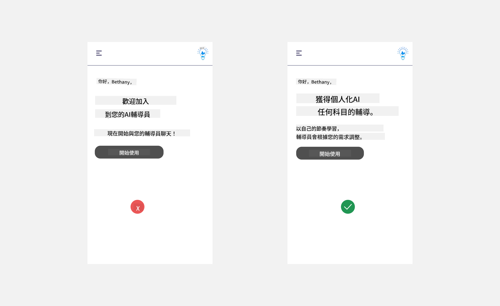
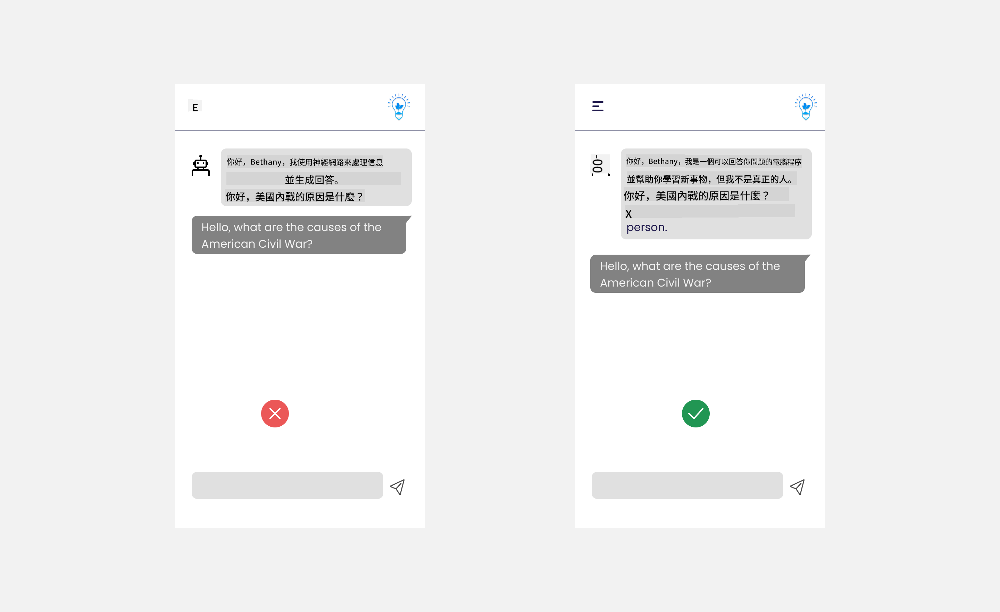
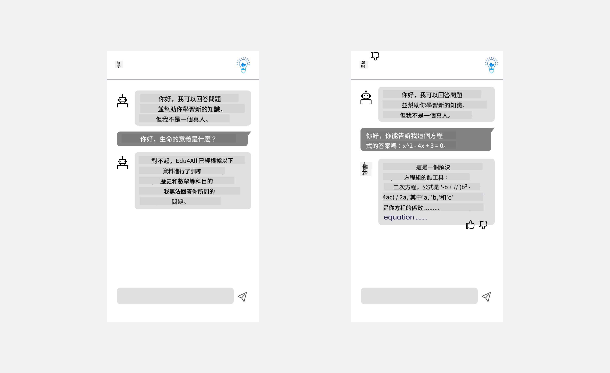

<!--
CO_OP_TRANSLATOR_METADATA:
{
  "original_hash": "ec385b41ee50579025d50cc03bfb3a25",
  "translation_date": "2025-05-19T21:46:35+00:00",
  "source_file": "12-designing-ux-for-ai-applications/README.md",
  "language_code": "tw"
}
-->
# 為 AI 應用設計 UX

> _(點擊上面的圖片觀看本課程的視頻)_

使用者體驗是建構應用程式時非常重要的一環。使用者需要能夠有效地使用你的應用程式來完成任務。效率固然重要，但你也需要設計應用程式，使其能被所有人使用，以達到 _可及性_。本章將重點探討這個領域，希望你最終能設計出一個人們能且願意使用的應用程式。

## 介紹

使用者體驗是指使用者如何與特定產品或服務互動和使用，無論是系統、工具還是設計。在開發 AI 應用程式時，開發者不僅要確保使用者體驗有效，還要符合倫理。在本課程中，我們將介紹如何建構滿足使用者需求的人工智慧 (AI) 應用程式。

課程將涵蓋以下領域：

- 使用者體驗介紹及了解使用者需求
- 為信任和透明度設計 AI 應用程式
- 為協作和反饋設計 AI 應用程式

## 學習目標

完成本課程後，你將能夠：

- 理解如何建構滿足使用者需求的 AI 應用程式。
- 設計促進信任和協作的 AI 應用程式。

### 先修條件

花點時間深入了解 [使用者體驗和設計思維。](https://learn.microsoft.com/training/modules/ux-design?WT.mc_id=academic-105485-koreyst)

## 使用者體驗介紹及了解使用者需求

在我們的虛構教育初創公司中，我們有兩個主要使用者，教師和學生。這兩種使用者都有獨特的需求。以使用者為中心的設計會優先考慮使用者，確保產品對其預期使用者是相關且有益的。

應用程式應該是 **有用、可靠、可及且愉悅** 的，以提供良好的使用者體驗。

### 可用性

有用意味著應用程式具有符合其預期目的的功能，例如自動化評分過程或生成複習用的閃卡。自動化評分過程的應用程式應能夠根據預定義的標準準確且高效地為學生作業分配分數。同樣，生成複習閃卡的應用程式應能夠根據其數據創建相關且多樣化的問題。

### 可靠性

可靠意味著應用程式能夠一致且無錯誤地執行其任務。然而，AI 就像人類一樣並不完美，可能容易出錯。應用程式可能會遇到需要人為干預或修正的錯誤或意外情況。如何處理錯誤？在本課程的最後一部分，我們將介紹如何設計 AI 系統和應用程式以進行協作和反饋。

### 可及性

可及意味著將使用者體驗延伸至各種能力的使用者，包括那些有障礙的使用者，確保沒有人被排除在外。遵循可及性指南和原則，AI 解決方案變得更具包容性、可用性和對所有使用者更有益。

### 愉悅

愉悅意味著應用程式使用起來令人愉快。吸引人的使用者體驗可以對使用者產生正面影響，鼓勵他們回到應用程式並增加商業收入。

並不是每個挑戰都能用 AI 解決。AI 的出現是為了增強你的使用者體驗，無論是自動化手動任務，還是個性化使用者體驗。

## 為信任和透明度設計 AI 應用程式

建立信任在設計 AI 應用程式時至關重要。信任確保使用者相信應用程式能完成工作，持續提供結果，且結果是使用者所需的。這方面的一個風險是缺乏信任和過度信任。缺乏信任發生在使用者對 AI 系統幾乎或完全沒有信任時，這會導致使用者拒絕你的應用程式。過度信任則發生在使用者高估 AI 系統的能力，導致使用者過度信任 AI 系統。例如，在過度信任的情況下，自動化評分系統可能會導致教師不仔細檢查一些作業，以確保評分系統運行良好。這可能會導致學生的成績不公平或不準確，或錯失反饋和改進的機會。

確保信任在設計中居於核心的兩種方法是可解釋性和控制。

### 可解釋性

當 AI 幫助決策，例如向未來世代傳授知識時，讓教師和家長了解 AI 決策的過程至關重要。這就是可解釋性 - 理解 AI 應用程式如何做出決策。為可解釋性設計包括添加 AI 應用程式可以做什麼的示例細節。例如，系統可以使用："使用 AI 縮短你的筆記，讓複習更輕鬆"，而不是 "開始使用 AI 教師"。

另一個例子是 AI 如何使用使用者和個人數據。例如，具有學生角色的使用者可能會因其角色而受到限制。AI 可能無法揭示問題的答案，但可以幫助引導使用者思考如何解決問題。

可解釋性的最後一個關鍵部分是簡化解釋。學生和教師可能不是 AI 專家，因此應簡化並易於理解應用程式能或不能做什麼的解釋。

### 控制

生成式 AI 創造了 AI 與使用者之間的協作，例如使用者可以修改提示以獲得不同的結果。此外，一旦生成輸出，使用者應能夠修改結果，讓他們感受到控制。例如，使用 Bing 時，你可以根據格式、語氣和長度調整你的提示。此外，你可以對輸出進行更改並修改輸出，如下所示：

Bing 的另一個功能允許使用者控制應用程式的功能是能選擇加入或退出 AI 使用的數據。對於學校應用程式，學生可能希望使用自己的筆記以及教師的資源作為複習材料。

> 在設計 AI 應用程式時，意圖是關鍵，確保使用者不會過度信任並設置不切實際的期望。實現這一點的一種方法是在提示和結果之間創造摩擦。提醒使用者，這是 AI 而不是一個人類

## 為協作和反饋設計 AI 應用程式

如前所述，生成式 AI 創造了使用者與 AI 之間的協作。大多數互動都是使用者輸入提示，AI 生成輸出。如果輸出不正確怎麼辦？應用程式如何處理錯誤？AI 是指責使用者還是花時間解釋錯誤？

AI 應用程式應能接收和提供反饋。這不僅幫助 AI 系統改進，也建立了與使用者的信任。設計中應包含反饋循環，示例可以是對輸出的簡單點贊或不喜歡。

另一種處理方式是清楚地傳達系統的能力和限制。當使用者犯錯要求超出 AI 能力的東西時，應有一種方式來處理，如下所示。

系統錯誤是應用程式中常見的，使用者可能需要超出 AI 範圍的信息或應用程式可能對使用者能生成摘要的問題/主題數量有限制。例如，AI 應用程式使用有限科目數據訓練，例如歷史和數學，可能無法處理地理相關的問題。為了解決這一問題，AI 系統可以給出這樣的回答："抱歉，我們的產品已用以下科目數據訓練.....，我無法回答你提出的問題。"

AI 應用程式並不完美，因此可能會犯錯。在設計你的應用程式時，你應確保創造出能讓使用者反饋和錯誤處理的空間，以簡單且易於解釋的方式進行。

## 作業

考慮你已建構的任何 AI 應用程式，考慮在你的應用程式中實施以下步驟：

- **愉悅：** 考慮如何讓你的應用程式更愉悅。你是否在各處添加了解釋？你是否鼓勵使用者探索？你如何措辭你的錯誤信息？

- **可用性：** 建立一個網頁應用程式。確保你的應用程式能夠通過鼠標和鍵盤進行導航。

- **信任和透明度：** 不要完全信任 AI 及其輸出，考慮如何將人類加入流程以驗證輸出。此外，考慮並實施其他方法來實現信任和透明度。

- **控制：** 讓使用者控制他們提供給應用程式的數據。實施一種方式讓使用者能選擇加入和退出 AI 應用程式中的數據收集。

## 繼續你的學習！

完成本課程後，查看我們的 [生成式 AI 學習集合](https://aka.ms/genai-collection?WT.mc_id=academic-105485-koreyst) 以繼續提升你的生成式 AI 知識！

前往第 13 課，我們將探討如何 [保護 AI 應用程式](../13-securing-ai-applications/README.md?WT.mc_id=academic-105485-koreyst)！

**免責聲明**：
本文檔使用 AI 翻譯服務 [Co-op Translator](https://github.com/Azure/co-op-translator) 進行翻譯。儘管我們力求準確，但請注意，自動翻譯可能包含錯誤或不準確之處。應將原始語言的文件視為權威來源。對於關鍵信息，建議尋求專業人工翻譯。我們對因使用此翻譯而產生的任何誤解或誤讀不承擔責任。