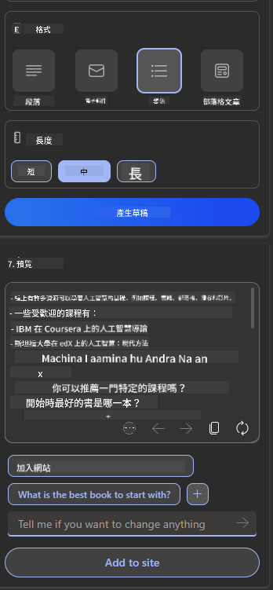

<!--
CO_OP_TRANSLATOR_METADATA:
{
  "original_hash": "78bbeed50fd4dc9fdee931f5daf98cb3",
  "translation_date": "2025-10-17T23:40:10+00:00",
  "source_file": "12-designing-ux-for-ai-applications/README.md",
  "language_code": "tw"
}
-->
# 為 AI 應用設計使用者體驗

> _(點擊上方圖片觀看本課程的影片)_

使用者體驗是建構應用程式時非常重要的一環。使用者需要能夠高效地使用您的應用程式來完成任務。高效固然重要，但您也需要設計出每個人都能使用的應用程式，使其具有_可及性_。本章節將聚焦於這個領域，希望最終您能設計出人們能夠且願意使用的應用程式。

## 簡介

使用者體驗是指使用者如何與特定產品或服務（無論是系統、工具或設計）互動並使用它。在開發 AI 應用程式時，開發者不僅需要確保使用者體驗的有效性，還需要考慮其倫理性。在本課程中，我們將探討如何建構能夠滿足使用者需求的人工智慧（AI）應用程式。

本課程將涵蓋以下領域：

- 使用者體驗簡介及理解使用者需求
- 為信任與透明性設計 AI 應用程式
- 為協作與回饋設計 AI 應用程式

## 學習目標

完成本課程後，您將能夠：

- 理解如何建構符合使用者需求的 AI 應用程式。
- 設計促進信任與協作的 AI 應用程式。

### 先修要求

花些時間閱讀更多關於[使用者體驗與設計思維](https://learn.microsoft.com/training/modules/ux-design?WT.mc_id=academic-105485-koreyst)。

## 使用者體驗簡介及理解使用者需求

在我們虛構的教育新創公司中，我們有兩個主要使用者：教師和學生。這兩類使用者各自有其獨特的需求。以使用者為中心的設計優先考慮使用者，確保產品對目標使用者而言是相關且有益的。

應用程式應該是**有用、可靠、可及且愉悅**的，以提供良好的使用者體驗。

### 可用性

有用意味著應用程式的功能符合其預期用途，例如自動化評分過程或生成複習用的抽認卡。一個自動化評分的應用程式應能根據預定的標準準確且高效地為學生的作業打分。同樣地，一個生成複習抽認卡的應用程式應能根據其數據創建相關且多樣化的問題。

### 可靠性

可靠意味著應用程式能夠一致且無錯誤地執行其任務。然而，AI 和人類一樣並不完美，可能會出現錯誤。應用程式可能會遇到需要人工介入或修正的錯誤或意外情況。如何處理這些錯誤？在本課程的最後部分，我們將探討如何設計 AI 系統和應用程式以促進協作與回饋。

### 可及性

可及性意味著將使用者體驗擴展到具有不同能力的使用者，包括殘障人士，確保沒有人被排除在外。通過遵循可及性指南和原則，AI 解決方案變得更加包容、可用且對所有使用者都有益。

### 愉悅性

愉悅性意味著應用程式使用起來令人愉快。一個吸引人的使用者體驗可以對使用者產生積極影響，鼓勵他們再次使用該應用程式並增加業務收入。

並非每個挑戰都能通過 AI 解決。AI 的作用是增強您的使用者體驗，例如自動化手動任務或個性化使用者體驗。

## 為信任與透明性設計 AI 應用程式

在設計 AI 應用程式時，建立信任至關重要。信任確保使用者相信應用程式能完成工作，持續提供結果，並且結果符合使用者需求。這方面的風險在於不信任和過度信任。不信任發生在使用者對 AI 系統幾乎沒有或完全沒有信任，導致使用者拒絕使用您的應用程式。過度信任則發生在使用者高估了 AI 系統的能力，導致使用者過度信任 AI 系統。例如，在自動化評分系統中，過度信任可能導致教師不檢查部分試卷以確保評分系統的運作是否正確。這可能導致學生的分數不公平或不準確，或者錯失提供回饋和改進的機會。

確保信任成為設計核心的兩種方法是可解釋性和控制。

### 可解釋性

當 AI 幫助做出決策，例如向下一代傳授知識時，教師和家長了解 AI 決策的方式至關重要。這就是可解釋性——理解 AI 應用程式如何做出決策。為可解釋性設計包括添加詳細信息，突出顯示 AI 如何得出結果。使用者必須知道結果是由 AI 而非人類生成的。例如，與其說「現在開始與您的導師聊天」，不如說「使用 AI 導師，根據您的需求進行調整，幫助您以自己的節奏學習。」

另一個例子是 AI 如何使用使用者和個人數據。例如，一個具有學生角色的使用者可能會因其角色而受到限制。AI 可能無法直接揭示問題的答案，但可以幫助引導使用者思考如何解決問題。

可解釋性的另一個重要部分是簡化解釋。學生和教師可能不是 AI 專家，因此應用程式的功能和限制的解釋應該簡單易懂。

### 控制

生成式 AI 創造了 AI 與使用者之間的協作，例如使用者可以修改提示以獲得不同的結果。此外，一旦生成了結果，使用者應能夠修改結果，讓他們感到有控制感。例如，在使用 Bing 時，您可以根據格式、語氣和長度調整您的提示。此外，您可以對生成的結果進行修改，如下所示：

Bing 的另一個功能是允許使用者控制應用程式使用的數據。例如，學校應用程式中的學生可能希望使用自己的筆記以及教師的資源作為複習材料。

> 在設計 AI 應用程式時，刻意性是關鍵，確保使用者不會過度信任，對其能力設置不切實際的期望。一種方法是在提示和結果之間創造摩擦，提醒使用者這是 AI 而不是另一個人。

## 為協作與回饋設計 AI 應用程式

如前所述，生成式 AI 創造了使用者與 AI 之間的協作。大多數互動是使用者輸入提示，AI 生成結果。如果結果不正確怎麼辦？應用程式如何處理錯誤？如果出現錯誤，AI 是責怪使用者還是花時間解釋錯誤？

AI 應用程式應該內建接收和提供回饋的功能。這不僅有助於 AI 系統改進，還能建立使用者的信任。設計中應包含回饋循環，例如簡單的對結果的「讚」或「踩」。

另一種處理方式是清楚地傳達系統的功能和限制。如果使用者犯錯，要求超出 AI 能力範圍的內容，應該有一種方式來處理，如下所示。

系統錯誤在應用程式中很常見，使用者可能需要超出 AI 範圍的信息幫助，或者應用程式可能對使用者生成摘要的問題/主題數量有限。例如，一個僅用有限科目（例如歷史和數學）數據訓練的 AI 應用程式可能無法處理地理相關的問題。為了減輕這種情況，AI 系統可以給出如下回應：「抱歉，我們的產品僅用以下科目數據進行訓練......，我無法回答您提出的問題。」

AI 應用程式並不完美，因此不可避免地會犯錯。在設計您的應用程式時，您應確保為使用者回饋和錯誤處理創造空間，並以簡單且易於理解的方式進行。

## 作業

檢視您迄今為止開發的任何 AI 應用程式，考慮在您的應用程式中實施以下步驟：

- **愉悅性：** 考慮如何讓您的應用程式更具愉悅性。您是否在每個地方都添加了解釋？您是否鼓勵使用者探索？您的錯誤訊息是如何措辭的？

- **可用性：** 建立一個網頁應用程式。確保您的應用程式既可以用滑鼠也可以用鍵盤操作。

- **信任與透明性：** 不要完全信任 AI 及其結果，考慮如何在過程中加入人為驗證結果。此外，考慮並實施其他方法來實現信任與透明性。

- **控制：** 讓使用者控制他們提供給應用程式的數據。實施一種方式，讓使用者可以選擇是否參與或退出 AI 應用程式的數據收集。

<!-- ## [課後測驗](../../../12-designing-ux-for-ai-applications/quiz-url) -->

## 繼續學習！

完成本課程後，請查看我們的[生成式 AI 學習系列](https://aka.ms/genai-collection?WT.mc_id=academic-105485-koreyst)，繼續提升您的生成式 AI 知識！

前往第 13 課，我們將探討[如何保護 AI 應用程式](../13-securing-ai-applications/README.md?WT.mc_id=academic-105485-koreyst)！

---

**免責聲明**：  
本文件已使用 AI 翻譯服務 [Co-op Translator](https://github.com/Azure/co-op-translator) 進行翻譯。儘管我們努力確保翻譯的準確性，但請注意，自動翻譯可能包含錯誤或不準確之處。原始文件的母語版本應被視為權威來源。對於關鍵信息，建議使用專業人工翻譯。我們對因使用此翻譯而產生的任何誤解或誤釋不承擔責任。