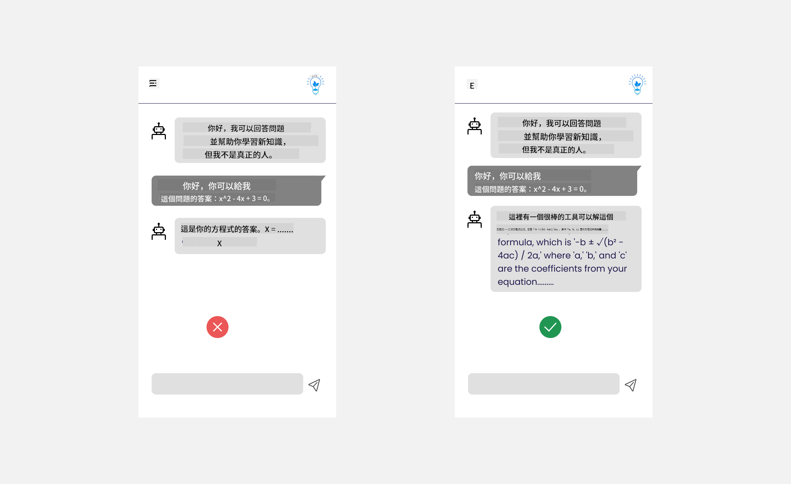
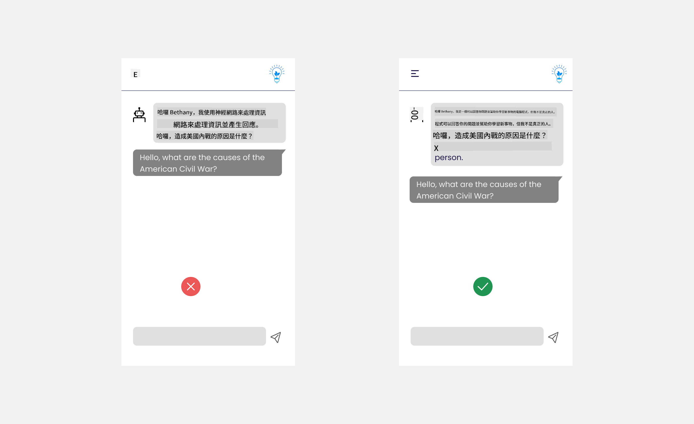

<!--
CO_OP_TRANSLATOR_METADATA:
{
  "original_hash": "747668e4c53d067369f06e9ec2e6313e",
  "translation_date": "2025-08-26T15:03:06+00:00",
  "source_file": "12-designing-ux-for-ai-applications/README.md",
  "language_code": "tw"
}
-->
# 為 AI 應用設計使用者體驗

> _(點擊上方圖片觀看本課程影片)_

使用者體驗是開發應用程式時非常重要的一環。使用者需要能夠有效率地使用你的應用程式來完成任務。除了效率之外，你還需要設計讓每個人都能使用的應用程式，也就是讓它們具有_無障礙性_。本章將聚焦於這個主題，希望你最終能設計出大家都能且願意使用的應用程式。

## 前言

使用者體驗指的是使用者如何與特定產品或服務互動與使用，無論是系統、工具還是設計。在開發 AI 應用時，開發者不僅要確保使用者體驗有效，也要兼顧道德。本課程將介紹如何打造能夠回應使用者需求的人工智慧（AI）應用。

本課程將涵蓋以下主題：

- 使用者體驗簡介與理解使用者需求
- 為信任與透明度設計 AI 應用
- 為協作與回饋設計 AI 應用

## 學習目標

完成本課程後，你將能夠：

- 理解如何打造符合使用者需求的 AI 應用。
- 設計能促進信任與協作的 AI 應用。

### 先備知識

花點時間閱讀更多關於[使用者體驗與設計思維](https://learn.microsoft.com/training/modules/ux-design?WT.mc_id=academic-105485-koreyst)。

## 使用者體驗簡介與理解使用者需求

在我們虛構的教育新創公司中，有兩個主要使用者：老師與學生。這兩種使用者各自有不同的需求。以使用者為中心的設計會優先考慮使用者，確保產品對目標對象來說是有意義且有幫助的。

應用程式應該要**有用、可靠、無障礙且令人愉悅**，才能帶來良好的使用者體驗。

### 易用性

有用代表應用程式的功能符合其預期用途，例如自動批改作業或產生複習用的抽認卡。一個自動批改作業的應用程式，應該能根據預設標準，準確且有效率地為學生作業評分。同樣地，產生複習抽認卡的應用程式，應該能根據資料產生相關且多元的題目。

### 可靠性

可靠代表應用程式能夠穩定且無誤地執行任務。然而，AI 和人類一樣並不完美，也可能出錯。應用程式可能會遇到錯誤或突發狀況，需要人工介入或修正。你會如何處理錯誤呢？在本課程最後一節，我們會介紹 AI 系統與應用如何設計協作與回饋機制。

### 無障礙性

無障礙代表將使用者體驗擴展到各種能力的使用者，包括身心障礙者，確保沒有人被排除在外。遵循無障礙設計原則與指引，能讓 AI 解決方案更具包容性、可用性與普及性。

### 愉悅性

令人愉悅代表應用程式使用起來讓人感到開心。吸引人的使用者體驗能帶來正面影響，鼓勵使用者回流，進而提升業務收益。

不是每個挑戰都能用 AI 解決。AI 的角色是強化你的使用者體驗，無論是自動化繁瑣工作，還是個人化使用者體驗。

## 為信任與透明度設計 AI 應用

在設計 AI 應用時，建立信任至關重要。信任能讓使用者相信應用程式能完成工作、穩定產出結果，且結果符合需求。這方面的風險在於不信任與過度信任。不信任是指使用者對 AI 系統缺乏信心，導致拒絕使用你的應用。過度信任則是使用者高估 AI 系統的能力，過度依賴 AI。例如，自動批改系統若被過度信任，老師可能就不會再檢查部分作業，無法確保評分系統運作正常。這可能導致學生分數不公或不準確，或錯失回饋與改進的機會。

確保信任成為設計核心的兩個方法是可解釋性與控制權。

### 可解釋性

當 AI 協助做出決策，例如傳授知識給下一代時，老師與家長必須了解 AI 如何做出決策。這就是可解釋性——理解 AI 應用如何做出決定。設計可解釋性時，應加入細節，說明 AI 如何產生結果。使用者必須知道這是 AI 產生的結果，而非人類。例如，不要說「現在就開始與你的家教聊天」，而是說「使用能根據你需求調整、幫助你以自己步調學習的 AI 家教」。

另一個例子是 AI 如何使用使用者與個人資料。例如，學生這個角色可能會有某些限制。AI 可能無法直接給出答案，但可以引導使用者思考如何解決問題。

可解釋性的另一個重點是簡化說明。學生與老師未必是 AI 專家，因此應用程式的功能與限制說明應該簡單易懂。

### 控制權

生成式 AI 創造了 AI 與使用者之間的協作，例如使用者可以修改提示詞以獲得不同結果。此外，當結果產生後，使用者應能修改結果，讓他們有掌控感。例如，在使用 Bing 時，你可以根據格式、語氣和長度調整提示詞，也可以對結果進行修改，如下圖所示：

Bing 另一個讓使用者掌控應用程式的功能，是可以選擇是否讓 AI 使用自己的資料。對於學校應用來說，學生可能希望同時使用自己的筆記和老師的資源作為複習材料。

> 在設計 AI 應用時，必須有意識地避免讓使用者過度信任，對 AI 能力產生不切實際的期待。可以透過在提示詞與結果之間設計一些摩擦，提醒使用者這是 AI，不是人類。

## 為協作與回饋設計 AI 應用

如前所述，生成式 AI 創造了使用者與 AI 之間的協作。大多數互動是使用者輸入提示詞，AI 產生結果。如果結果不正確怎麼辦？應用程式遇到錯誤時如何處理？AI 會責怪使用者，還是會花時間解釋錯誤？

AI 應用應該內建接收與提供回饋的機制。這不僅有助於 AI 系統改進，也能建立使用者信任。設計時應加入回饋循環，例如在結果旁邊加上簡單的讚或倒讚按鈕。

另一種做法是清楚溝通系統的能力與限制。當使用者提出超出 AI 能力範圍的請求時，也應有相應的處理方式，如下圖所示。

系統錯誤在應用程式中很常見，像是使用者需要查詢 AI 無法涵蓋的資訊，或應用程式對使用者能產生摘要的題數/科目有限制。例如，一個只訓練過歷史與數學資料的 AI 應用，可能無法處理地理相關問題。為了避免這種情況，AI 系統可以回應：「很抱歉，我們的產品僅訓練於以下科目......，無法回答你提出的問題。」

AI 應用並不完美，因此難免會犯錯。設計應用時，應確保有讓使用者回饋與錯誤處理的空間，並且方式要簡單且容易理解。

## 作業

請針對你目前開發的任何 AI 應用，思考並實作以下步驟：

- **愉悅性：** 思考如何讓你的應用更令人愉悅。你是否在各處加上說明？你是否鼓勵使用者探索？你的錯誤訊息怎麼寫的？

- **易用性：** 如果是網頁應用，請確保你的應用可以用滑鼠和鍵盤操作。

- **信任與透明度：** 不要完全信任 AI 及其結果，思考如何加入人工驗證流程。同時思考並實作其他建立信任與透明度的方法。

- **控制權：** 讓使用者能掌控他們提供給應用的資料。實作讓使用者選擇是否參與 AI 應用資料收集的方式。

## 持續學習！

完成本課程後，歡迎參考我們的 [生成式 AI 學習資源](https://aka.ms/genai-collection?WT.mc_id=academic-105485-koreyst)，持續提升你的生成式 AI 知識！

接下來請前往第 13 課，我們將探討如何[保護 AI 應用的安全](../13-securing-ai-applications/README.md?WT.mc_id=academic-105485-koreyst)！

---

**免責聲明**：  
本文件是使用 AI 翻譯服務 [Co-op Translator](https://github.com/Azure/co-op-translator) 進行翻譯。雖然我們力求準確，但請注意自動翻譯可能會包含錯誤或不精確之處。原始語言的文件應視為具權威性的來源。對於重要資訊，建議採用專業人工翻譯。我們不對因使用本翻譯而產生的任何誤解或誤釋承擔責任。