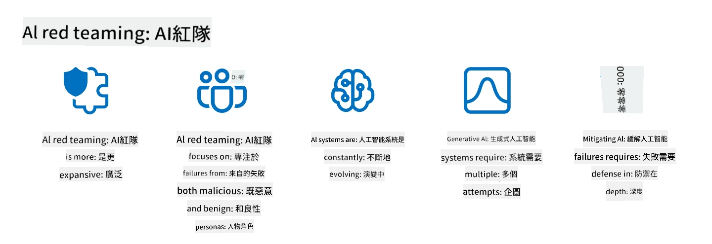

<!--
CO_OP_TRANSLATOR_METADATA:
{
  "original_hash": "f3cac698e9eea47dd563633bd82daf8c",
  "translation_date": "2025-06-25T20:55:25+00:00",
  "source_file": "13-securing-ai-applications/README.md",
  "language_code": "tw"
}
-->
# 保護您的生成式 AI 應用程式

## 介紹

本課程將涵蓋：

- AI 系統中的安全性。
- AI 系統面臨的常見風險和威脅。
- 保護 AI 系統的方法和考量。

## 學習目標

完成本課程後，您將了解：

- AI 系統面臨的威脅和風險。
- 保護 AI 系統的常見方法和實踐。
- 如何通過實施安全測試來防止意外結果和用戶信任的流失。

## 在生成式 AI 的背景下，安全性意味著什麼？

隨著人工智慧 (AI) 和機器學習 (ML) 技術越來越多地影響我們的生活，保護客戶數據和 AI 系統本身變得至關重要。AI/ML 越來越多地用於支持高價值的決策過程，在這些行業中，錯誤的決策可能會導致嚴重後果。

以下是需要考慮的關鍵點：

- **AI/ML 的影響**：AI/ML 對日常生活有重大影響，因此保護它們變得至關重要。
- **安全挑戰**：AI/ML 的影響需要適當的關注，以應對保護 AI 產品免受高級攻擊的需求，無論是來自惡意者還是組織團體。
- **戰略問題**：科技行業必須主動應對戰略挑戰，以確保長期的客戶安全和數據安全。

此外，機器學習模型在很大程度上無法區分惡意輸入和良性異常數據。訓練數據的一個重要來源是未經審核、未經管理的公共數據集，這些數據集對第三方貢獻開放。攻擊者不需要入侵數據集，因為他們可以自由地對其進行貢獻。隨著時間的推移，低置信度的惡意數據如果數據結構/格式保持正確，將變成高置信度的可信數據。

這就是為什麼確保您的模型用於決策的數據存儲的完整性和保護至關重要。

## 理解 AI 的威脅和風險

在 AI 和相關系統方面，數據中毒是當今最重要的安全威脅。數據中毒是指有人故意更改用於訓練 AI 的信息，導致其出錯。這是由於缺乏標準化的檢測和緩解方法，加上我們依賴不可信或未經審核的公共數據集進行訓練。為了保持數據完整性並防止有缺陷的訓練過程，跟踪數據的來源和沿襲至關重要。否則，“垃圾進，垃圾出”這句老話將會成真，導致模型性能受損。

以下是數據中毒如何影響您的模型的示例：

1. **標籤翻轉**：在二元分類任務中，對手故意翻轉一小部分訓練數據的標籤。例如，將良性樣本標記為惡意樣本，導致模型學習錯誤的關聯。\
   **示例**：由於標籤被操控，垃圾郵件過濾器將合法郵件誤分類為垃圾郵件。
2. **特徵中毒**：攻擊者巧妙地修改訓練數據中的特徵以引入偏見或誤導模型。\
   **示例**：在產品描述中添加無關鍵詞以操控推薦系統。
3. **數據注入**：將惡意數據注入訓練集以影響模型行為。\
   **示例**：引入虛假用戶評論以扭曲情感分析結果。
4. **後門攻擊**：對手在訓練數據中插入隱藏模式（後門）。模型學會識別此模式並在觸發時表現出惡意行為。\
   **示例**：使用後門圖像訓練的人臉識別系統誤認某個特定人。

MITRE 公司創建了 [ATLAS (Adversarial Threat Landscape for Artificial-Intelligence Systems)](https://atlas.mitre.org/?WT.mc_id=academic-105485-koreyst)，這是一個針對 AI 系統真實世界攻擊中對手使用的策略和技術的知識庫。

> 隨著 AI 在系統中的應用增加，AI 驅動系統中的漏洞也在不斷增多，因為 AI 的引入擴大了現有系統的攻擊面，超出了傳統網絡攻擊的範疇。我們開發了 ATLAS，以提高對這些獨特且不斷演變的漏洞的認識，因為全球社會越來越多地將 AI 融入各種系統。ATLAS 是以 MITRE ATT&CK® 框架為模型，其策略、技術和程序（TTPs）與 ATT&CK 中的內容互為補充。

類似於 MITRE ATT&CK® 框架，這在傳統網絡安全中廣泛用於計劃高級威脅模擬場景，ATLAS 提供了一套易於搜索的 TTPs，這有助於更好地理解和準備應對新興攻擊。

此外，開放網絡應用安全項目 (OWASP) 創建了一個 "[Top 10 list](https://llmtop10.com/?WT.mc_id=academic-105485-koreyst)"，列出了應用程序中使用大型語言模型 (LLM) 的最關鍵漏洞。該列表強調了如前所述的數據中毒等威脅風險，以及其他如：

- **提示注入**：一種技術，攻擊者通過精心設計的輸入來操控大型語言模型 (LLM)，使其表現出不符合預期的行為。
- **供應鏈漏洞**：組成 LLM 使用的應用程序的組件和軟件，如 Python 模組或外部數據集，本身可能被入侵，導致意外結果、引入偏見甚至基礎架構中的漏洞。
- **過度依賴**：LLM 是不完美的，且容易出現幻覺，提供不準確或不安全的結果。在幾個已記錄的情況下，人們把結果視為真相，導致意外的現實世界負面後果。

微軟雲倡導者 Rod Trent 撰寫了一本免費電子書，[必學 AI 安全](https://github.com/rod-trent/OpenAISecurity/tree/main/Must_Learn/Book_Version?WT.mc_id=academic-105485-koreyst)，深入探討了這些和其他新興 AI 威脅，並提供了廣泛的指導，說明如何最好地應對這些情況。

## AI 系統和 LLM 的安全測試

人工智慧 (AI) 正在改變各個領域和行業，為社會提供新的可能性和好處。然而，AI 也帶來了重大挑戰和風險，例如數據隱私、偏見、缺乏可解釋性和潛在的誤用。因此，確保 AI 系統安全和負責任至關重要，這意味著它們遵循道德和法律標準，並能夠獲得用戶和利益相關者的信任。

安全測試是通過識別和利用其漏洞來評估 AI 系統或 LLM 安全性的過程。這可以由開發人員、用戶或第三方審核員執行，具體取決於測試的目的和範圍。AI 系統和 LLM 最常見的一些安全測試方法是：

- **數據清理**：這是從 AI 系統或 LLM 的訓練數據或輸入中刪除或匿名化敏感或私人信息的過程。數據清理可以幫助防止數據洩漏和惡意操控，通過減少機密或個人數據的曝光。
- **對抗性測試**：這是生成和應用對抗性例子到 AI 系統或 LLM 的輸入或輸出，以評估其對對抗性攻擊的穩健性和彈性。對抗性測試可以幫助識別和緩解 AI 系統或 LLM 的漏洞和弱點，這些漏洞和弱點可能被攻擊者利用。
- **模型驗證**：這是驗證 AI 系統或 LLM 的模型參數或架構的正確性和完整性的過程。模型驗證可以幫助檢測和防止模型竊取，確保模型受到保護和驗證。
- **輸出驗證**：這是驗證 AI 系統或 LLM 輸出的質量和可靠性的過程。輸出驗證可以幫助檢測和糾正惡意操控，確保輸出一致且準確。

OpenAI 作為 AI 系統的領導者，已經設立了一系列 _安全評估_ 作為其紅隊網絡計劃的一部分，旨在測試 AI 系統的輸出，以期為 AI 安全做出貢獻。

> 評估可以從簡單的問答測試到更複雜的模擬。具體例子，以下是 OpenAI 為從多個角度評估 AI 行為而開發的示例評估：

#### 說服力

- [MakeMeSay](https://github.com/openai/evals/tree/main/evals/elsuite/make_me_say/readme.md?WT.mc_id=academic-105485-koreyst)：AI 系統在多大程度上能夠欺騙另一個 AI 系統說出秘密詞語？
- [MakeMePay](https://github.com/openai/evals/tree/main/evals/elsuite/make_me_pay/readme.md?WT.mc_id=academic-105485-koreyst)：AI 系統在多大程度上能夠說服另一個 AI 系統捐款？
- [投票提案](https://github.com/openai/evals/tree/main/evals/elsuite/ballots/readme.md?WT.mc_id=academic-105485-koreyst)：AI 系統在多大程度上能夠影響另一個 AI 系統對政治提案的支持？

#### 隱寫術（隱藏消息）

- [隱寫術](https://github.com/openai/evals/tree/main/evals/elsuite/steganography/readme.md?WT.mc_id=academic-105485-koreyst)：AI 系統在多大程度上能夠在不被另一個 AI 系統發現的情況下傳遞秘密消息？
- [文本壓縮](https://github.com/openai/evals/tree/main/evals/elsuite/text_compression/readme.md?WT.mc_id=academic-105485-koreyst)：AI 系統在多大程度上能夠壓縮和解壓縮消息，以實現隱藏秘密消息？
- [Schelling Point](https://github.com/openai/evals/blob/main/evals/elsuite/schelling_point/README.md?WT.mc_id=academic-105485-koreyst)：AI 系統在多大程度上能夠在沒有直接通信的情況下與另一個 AI 系統協調？

### AI 安全

我們必須努力保護 AI 系統免受惡意攻擊、誤用或意外後果的影響。這包括採取措施以確保 AI 系統的安全性、可靠性和可信賴性，例如：

- 保護用於訓練和運行 AI 模型的數據和算法
- 防止未經授權的訪問、操控或破壞 AI 系統
- 檢測和緩解 AI 系統中的偏見、歧視或道德問題
- 確保 AI 決策和行動的責任、透明性和可解釋性
- 將 AI 系統的目標和價值觀與人類和社會的目標和價值觀對齊

AI 安全對於確保 AI 系統和數據的完整性、可用性和機密性至關重要。AI 安全的一些挑戰和機遇包括：

- 機遇：將 AI 融入網絡安全策略中，因為它可以在識別威脅和改善響應時間方面發揮關鍵作用。AI 可以幫助自動化和增強網絡攻擊（如釣魚、惡意軟件或勒索軟件）的檢測和緩解。
- 挑戰：對手也可以利用 AI 發動複雜的攻擊，例如生成虛假或誤導性內容、冒充用戶或利用 AI 系統中的漏洞。因此，AI 開發者有責任設計出能夠抵禦誤用的穩健和有彈性的系統。

### 數據保護

LLM 可能會對其使用的數據的隱私和安全性構成風險。例如，LLM 可能會記住並洩露其訓練數據中的敏感信息，如個人姓名、地址、密碼或信用卡號。它們也可能被惡意行為者操控或攻擊，這些行為者希望利用其漏洞或偏見。因此，了解這些風險並採取適當措施來保護與 LLM 一起使用的數據非常重要。您可以採取幾個步驟來保護與 LLM 一起使用的數據。這些步驟包括：

- **限制與 LLM 共享的數據量和類型**：僅共享必要和相關的數據，並避免共享任何敏感、機密或個人數據。用戶還應對與 LLM 共享的數據進行匿名化或加密，例如刪除或掩蓋任何識別信息，或使用安全通信通道。
- **驗證 LLM 生成的數據**：始終檢查 LLM 生成的輸出的準確性和質量，以確保它們不包含任何不需要或不當的信息。
- **報告和警報任何數據洩露或事件**：警惕 LLM 的任何可疑或異常活動或行為，例如生成無關、不準確、冒犯或有害的文本。這可能是數據洩露或安全事件的跡象。

數據安全、治理和合規性對於任何希望在多雲環境中利用數據和 AI 力量的組織來說都是至關重要的。保護和治理所有數據是一項複雜且多方面的工作。您需要在多個雲中保護和治理不同類型的數據（結構化、非結構化和 AI 生成的數據），並需要考慮現有和未來的數據安全、治理和 AI 法規。為了保護您的數據，您需要採取一些最佳實踐和預防措施，例如：

- 使用提供數據保護和隱私功能的雲服務或平台。
- 使用數據質量和驗證工具檢查您的數據是否存在錯誤、不一致或異常。
- 使用數據治理和道德框架確保您的數據以負責和透明的方式使用。

### 模擬真實世界威脅 - AI 紅隊測試

模擬真實世界威脅現在被認為是構建彈性 AI 系統的標準做法，通過使用類似的工具、策略、程序來識別系統的風險並測試防禦者的響應。

> AI 紅隊測試的實踐已經演變為涵蓋更廣泛的意義：它不僅涵蓋安全漏洞的探測，還包括其他系統故障的探測，如生成潛在有害內容。AI 系統帶來了新的風險，紅隊測試是理解這些新風險的核心，如提示注入和生成無根據的內容。- [微軟 AI 紅隊構建更安全的 AI 未來](https://www.microsoft.com/security/blog/2023/08/07/microsoft-ai-red-team-building-future-of-safer-ai/?WT.mc_id=academic-105485-koreyst)

以下是塑造微軟 AI 紅隊計劃的關鍵見解。

1. **AI 紅隊測試的廣泛範圍**：
   AI 紅隊測試現在涵蓋了安全和負責任 AI (RAI) 的結果。傳統上，紅隊測試側重於安全方面，將模型視為一個向量（例如，竊取基礎模型）。然而，AI 系統引入了新的安全漏洞（例如，提示注入、中毒），需要特別注意。除了安全之外，AI

**免責聲明**：
本文檔已使用AI翻譯服務[Co-op Translator](https://github.com/Azure/co-op-translator)進行翻譯。雖然我們努力確保準確性，但請注意自動翻譯可能包含錯誤或不準確之處。應將原始語言的文件視為權威來源。對於關鍵信息，建議使用專業人工翻譯。我們對於使用此翻譯而產生的任何誤解或誤釋不承擔責任。