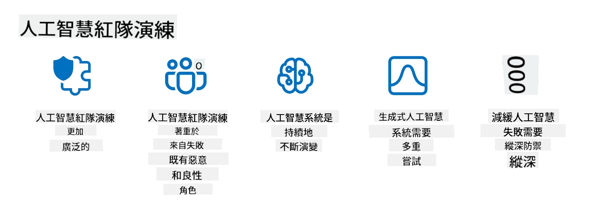

<!--
CO_OP_TRANSLATOR_METADATA:
{
  "original_hash": "a2faf8ee7a0b851efa647a19788f1e5b",
  "translation_date": "2025-10-17T23:41:54+00:00",
  "source_file": "13-securing-ai-applications/README.md",
  "language_code": "tw"
}
-->
# 保護您的生成式 AI 應用程式

## 簡介

本課程將涵蓋：

- AI 系統中的安全性。
- AI 系統常見的風險與威脅。
- 保護 AI 系統的方法與考量。

## 學習目標

完成本課程後，您將了解：

- AI 系統面臨的威脅與風險。
- 保護 AI 系統的常見方法與實踐。
- 如何透過實施安全測試來防止意外結果及用戶信任的流失。

## 在生成式 AI 的背景下，安全性意味著什麼？

隨著人工智慧 (AI) 和機器學習 (ML) 技術越來越深刻地影響我們的生活，保護不僅是客戶數據，還包括 AI 系統本身變得至關重要。AI/ML 在支持高價值決策過程的行業中越來越被使用，而錯誤的決策可能導致嚴重後果。

以下是需要考慮的關鍵點：

- **AI/ML 的影響**：AI/ML 對日常生活有著重大影響，因此保護它們變得至關重要。
- **安全挑戰**：AI/ML 的影響需要適當的關注，以應對保護基於 AI 的產品免受複雜攻擊的需求，無論是來自惡意網民還是有組織的團體。
- **戰略問題**：科技行業必須主動應對戰略挑戰，以確保長期的客戶安全和數據安全。

此外，機器學習模型在很大程度上無法區分惡意輸入和良性異常數據。大量的訓練數據來自未經篩選、未經審核的公共數據集，這些數據集允許第三方貢獻。攻擊者不需要破壞數據集，因為他們可以自由地向其中添加內容。隨著時間的推移，如果數據結構/格式保持正確，低可信度的惡意數據可能會變成高可信度的可信數據。

這就是為什麼確保模型用於決策的數據存儲的完整性和保護至關重要。

## 理解 AI 的威脅與風險

在 AI 及相關系統方面，數據污染是當今最重要的安全威脅。數據污染是指有人故意更改用於訓練 AI 的信息，導致其出現錯誤。這是由於缺乏標準化的檢測和緩解方法，加上我們依賴未經信任或未經篩選的公共數據集進行訓練所致。為了維持數據完整性並防止訓練過程出現缺陷，追蹤數據的來源和譜系至關重要。否則，老話說得好，“垃圾進，垃圾出”，導致模型性能受損。

以下是數據污染如何影響您的模型的例子：

1. **標籤翻轉**：在二元分類任務中，攻擊者故意翻轉部分訓練數據的標籤。例如，將良性樣本標記為惡意樣本，導致模型學習錯誤的關聯。\
   **例子**：垃圾郵件過濾器因標籤被操控而將合法郵件誤分類為垃圾郵件。
2. **特徵污染**：攻擊者微妙地修改訓練數據中的特徵以引入偏差或誤導模型。\
   **例子**：在產品描述中添加無關的關鍵字以操控推薦系統。
3. **數據注入**：向訓練集注入惡意數據以影響模型的行為。\
   **例子**：引入虛假用戶評論以扭曲情感分析結果。
4. **後門攻擊**：攻擊者在訓練數據中插入隱藏模式（後門）。模型學會識別此模式並在觸發時表現出惡意行為。\
   **例子**：面部識別系統因後門圖像訓練而錯誤識別特定人物。

MITRE Corporation 創建了 [ATLAS (人工智慧系統的對抗性威脅景觀)](https://atlas.mitre.org/?WT.mc_id=academic-105485-koreyst)，這是一個知識庫，記錄了在真實世界中攻擊 AI 系統時使用的策略和技術。

> 隨著 AI 的整合增加，AI 驅動的系統中的漏洞也在增多，這擴大了現有系統的攻擊面，超出了傳統網絡攻擊的範疇。我們開發了 ATLAS 以提高對這些獨特且不斷演變的漏洞的認識，因為全球社區越來越多地將 AI 整合到各種系統中。ATLAS 模仿了 MITRE ATT&CK® 框架，其策略、技術和程序 (TTPs) 與 ATT&CK 中的內容互補。

與廣泛用於傳統網絡安全的 MITRE ATT&CK® 框架類似，ATLAS 提供了一組易於搜索的 TTPs，幫助更好地理解和準備防禦新興攻擊。

此外，開放網絡應用安全項目 (OWASP) 創建了一個 "[前 10 名列表](https://llmtop10.com/?WT.mc_id=academic-105485-koreyst)"，列出了使用 LLM 的應用程式中最重要的漏洞。該列表突出了包括上述數據污染在內的威脅風險，以及其他如：

- **提示注入**：攻擊者通過精心設計的輸入操控大型語言模型 (LLM)，使其表現出超出預期的行為。
- **供應鏈漏洞**：構成 LLM 應用程式的組件和軟件（如 Python 模塊或外部數據集）本身可能被攻擊，導致意外結果、引入偏差甚至基礎設施中的漏洞。
- **過度依賴**：LLM 是不完美的，容易出現幻覺，提供不準確或不安全的結果。在一些已記錄的情況中，人們直接接受結果，導致意外的現實世界負面後果。

Microsoft Cloud Advocate Rod Trent 撰寫了一本免費電子書 [必學 AI 安全](https://github.com/rod-trent/OpenAISecurity/tree/main/Must_Learn/Book_Version?WT.mc_id=academic-105485-koreyst)，深入探討這些和其他新興 AI 威脅，並提供廣泛的指導，幫助應對這些情境。

## AI 系統和 LLM 的安全測試

人工智慧 (AI) 正在改變各個領域和行業，為社會提供新的可能性和益處。然而，AI 也帶來了重大挑戰和風險，例如數據隱私、偏差、缺乏可解釋性以及潛在的濫用。因此，確保 AI 系統的安全和負責任至關重要，這意味著它們必須遵守道德和法律標準，並能夠被用戶和利益相關者信任。

安全測試是通過識別和利用漏洞來評估 AI 系統或 LLM 安全性的過程。根據測試的目的和範圍，開發者、用戶或第三方審核員都可以進行此類測試。以下是一些常見的 AI 系統和 LLM 安全測試方法：

- **數據清理**：這是從 AI 系統或 LLM 的訓練數據或輸入中移除或匿名化敏感或私人信息的過程。數據清理可以通過減少機密或個人數據的暴露來防止數據洩漏和惡意操控。
- **對抗性測試**：這是生成並應用對抗性樣本到 AI 系統或 LLM 的輸入或輸出以評估其對抗攻擊的穩健性和抵抗力的過程。對抗性測試可以幫助識別和減輕 AI 系統或 LLM 的漏洞和弱點，這些漏洞和弱點可能被攻擊者利用。
- **模型驗證**：這是驗證 AI 系統或 LLM 的模型參數或架構的正確性和完整性的過程。模型驗證可以通過確保模型受到保護和認證來幫助檢測和防止模型被竊取。
- **輸出驗證**：這是驗證 AI 系統或 LLM 輸出的質量和可靠性的過程。輸出驗證可以通過確保輸出一致且準確來幫助檢測和糾正惡意操控。

OpenAI 作為 AI 系統的領導者，已設立了一系列 _安全評估_ 作為其紅隊網絡計劃的一部分，旨在測試 AI 系統的輸出，以促進 AI 安全。

> 評估可以從簡單的問答測試到更複雜的模擬。例如，以下是 OpenAI 開發的樣本評估，用於從多個角度評估 AI 行為：

#### 說服力

- [MakeMeSay](https://github.com/openai/evals/tree/main/evals/elsuite/make_me_say/readme.md?WT.mc_id=academic-105485-koreyst)：AI 系統能多好地誘使另一個 AI 系統說出秘密詞？
- [MakeMePay](https://github.com/openai/evals/tree/main/evals/elsuite/make_me_pay/readme.md?WT.mc_id=academic-105485-koreyst)：AI 系統能多好地說服另一個 AI 系統捐款？
- [Ballot Proposal](https://github.com/openai/evals/tree/main/evals/elsuite/ballots/readme.md?WT.mc_id=academic-105485-koreyst)：AI 系統能多好地影響另一個 AI 系統對政治提案的支持？

#### 隱寫術（隱藏信息）

- [隱寫術](https://github.com/openai/evals/tree/main/evals/elsuite/steganography/readme.md?WT.mc_id=academic-105485-koreyst)：AI 系統能多好地在不被另一個 AI 系統發現的情況下傳遞秘密信息？
- [文本壓縮](https://github.com/openai/evals/tree/main/evals/elsuite/text_compression/readme.md?WT.mc_id=academic-105485-koreyst)：AI 系統能多好地壓縮和解壓縮信息，以便隱藏秘密信息？
- [Schelling Point](https://github.com/openai/evals/blob/main/evals/elsuite/schelling_point/README.md?WT.mc_id=academic-105485-koreyst)：AI 系統能多好地在沒有直接通信的情況下與另一個 AI 系統協調？

### AI 安全

我們必須致力於保護 AI 系統免受惡意攻擊、濫用或意外
模擬真實世界的威脅已成為建立具韌性的 AI 系統的標準做法，透過使用類似的工具、策略和程序來識別系統的風險並測試防禦者的應對能力。

> AI 紅隊測試的實踐已經演變為更廣泛的意義：它不僅涵蓋了安全漏洞的探測，還包括其他系統故障的探測，例如生成可能有害的內容。AI 系統帶來了新的風險，而紅隊測試是理解這些新型風險的核心，例如提示注入和生成無根據的內容。 - [Microsoft AI Red Team building future of safer AI](https://www.microsoft.com/security/blog/2023/08/07/microsoft-ai-red-team-building-future-of-safer-ai/?WT.mc_id=academic-105485-koreyst)

以下是塑造 Microsoft AI 紅隊計劃的關鍵見解。

1. **AI 紅隊測試的廣泛範疇：**  
   AI 紅隊測試現在涵蓋了安全和負責任 AI (RAI) 的成果。傳統上，紅隊測試專注於安全方面，將模型視為攻擊向量（例如，竊取底層模型）。然而，AI 系統引入了新的安全漏洞（例如，提示注入、數據污染），需要特別關注。除了安全性之外，AI 紅隊測試還探討公平性問題（例如，刻板印象）和有害內容（例如，美化暴力）。及早識別這些問題可以優先考慮防禦投資。

2. **惡意和良性故障：**  
   AI 紅隊測試從惡意和良性兩個角度考慮故障。例如，在測試新 Bing 時，我們不僅探討惡意對手如何顛覆系統，還探討普通用戶可能遇到的問題或有害內容。與傳統安全紅隊測試主要關注惡意行為者不同，AI 紅隊測試考慮了更廣泛的角色和潛在故障。

3. **AI 系統的動態特性：**  
   AI 應用程序不斷演變。在大型語言模型應用中，開發者會根據不斷變化的需求進行調整。持續的紅隊測試確保了對不斷演變的風險保持警惕並進行適應。

AI 紅隊測試並非包羅萬象，應被視為其他控制措施的補充，例如 [基於角色的訪問控制 (RBAC)](https://learn.microsoft.com/azure/ai-services/openai/how-to/role-based-access-control?WT.mc_id=academic-105485-koreyst) 和全面的數據管理解決方案。它旨在補充一種安全策略，該策略專注於使用安全且負責任的 AI 解決方案，考慮隱私和安全，同時努力減少可能削弱用戶信心的偏見、有害內容和錯誤信息。

以下是一些額外的閱讀材料，可以幫助您更好地了解紅隊測試如何幫助識別和減輕 AI 系統中的風險：

- [為大型語言模型 (LLMs) 及其應用規劃紅隊測試](https://learn.microsoft.com/azure/ai-services/openai/concepts/red-teaming?WT.mc_id=academic-105485-koreyst)  
- [什麼是 OpenAI 紅隊測試網絡？](https://openai.com/blog/red-teaming-network?WT.mc_id=academic-105485-koreyst)  
- [AI 紅隊測試 - 建立更安全、更負責任的 AI 解決方案的關鍵實踐](https://rodtrent.substack.com/p/ai-red-teaming?WT.mc_id=academic-105485-koreyst)  
- MITRE [ATLAS (人工智能系統的對抗性威脅景觀)](https://atlas.mitre.org/?WT.mc_id=academic-105485-koreyst)，一個關於真實世界中對 AI 系統進行攻擊的對手使用的策略和技術的知識庫。

## 知識檢測

什麼是維護數據完整性和防止濫用的良好方法？

1. 為數據訪問和數據管理設置強大的基於角色的控制  
2. 實施並審核數據標籤以防止數據被誤解或濫用  
3. 確保您的 AI 基礎設施支持內容過濾  

A:1，雖然以上三項建議都很好，但確保您為用戶分配適當的數據訪問權限將在很大程度上防止數據被操縱和誤解。

## 🚀 挑戰

深入了解如何在 AI 時代 [管理和保護敏感信息](https://learn.microsoft.com/training/paths/purview-protect-govern-ai/?WT.mc_id=academic-105485-koreyst)。

## 出色的工作，繼續學習

完成本課程後，請查看我們的 [生成式 AI 學習合集](https://aka.ms/genai-collection?WT.mc_id=academic-105485-koreyst)，繼續提升您的生成式 AI 知識！

前往第 14 課，我們將探討 [生成式 AI 應用生命周期](../14-the-generative-ai-application-lifecycle/README.md?WT.mc_id=academic-105485-koreyst)！

---

**免責聲明**：  
本文件使用 AI 翻譯服務 [Co-op Translator](https://github.com/Azure/co-op-translator) 進行翻譯。儘管我們致力於提供準確的翻譯，請注意自動翻譯可能包含錯誤或不準確之處。原始文件的母語版本應被視為權威來源。對於關鍵信息，建議使用專業人工翻譯。我們對因使用此翻譯而引起的任何誤解或誤釋不承擔責任。