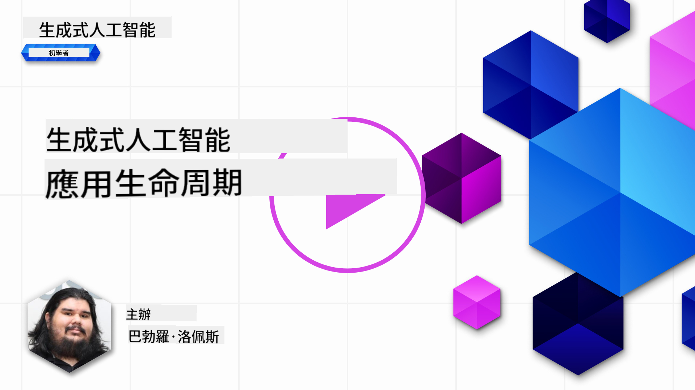
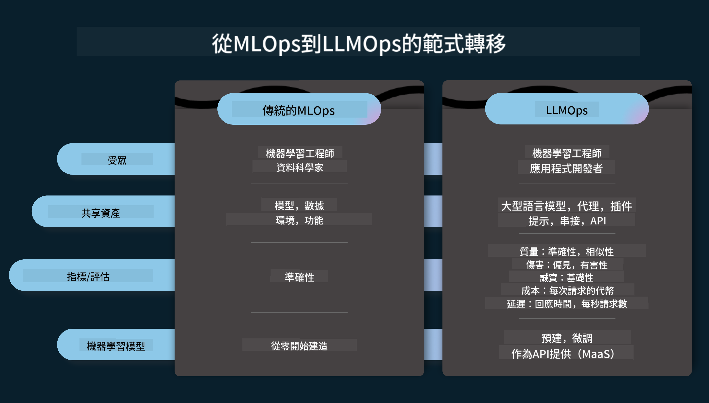
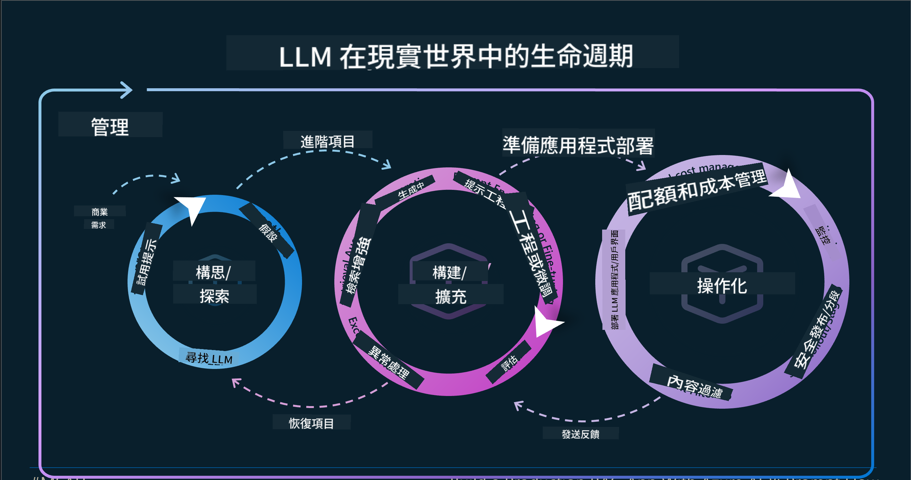
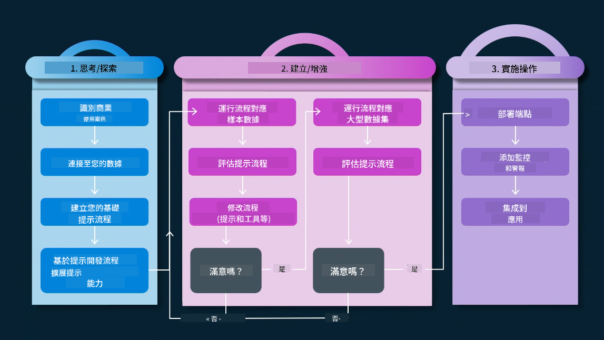
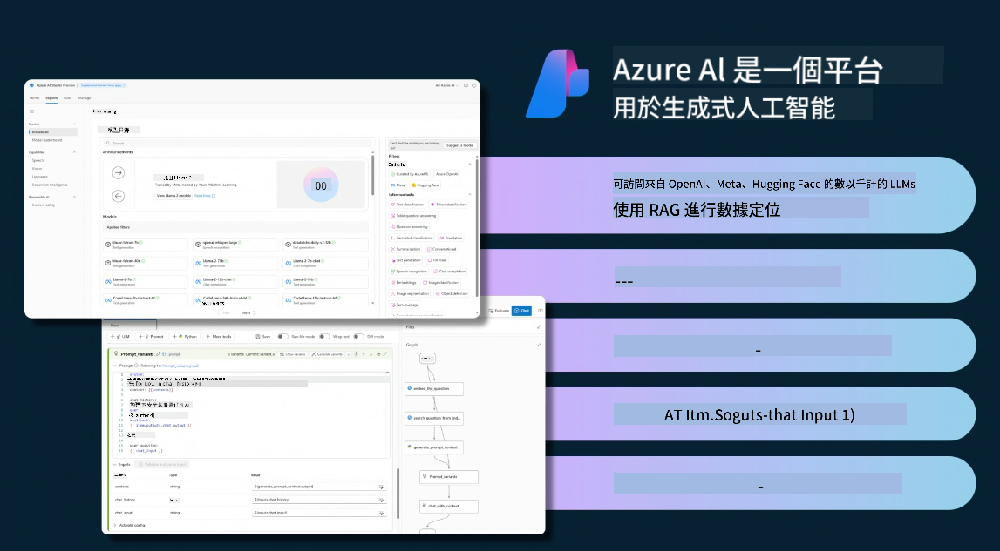
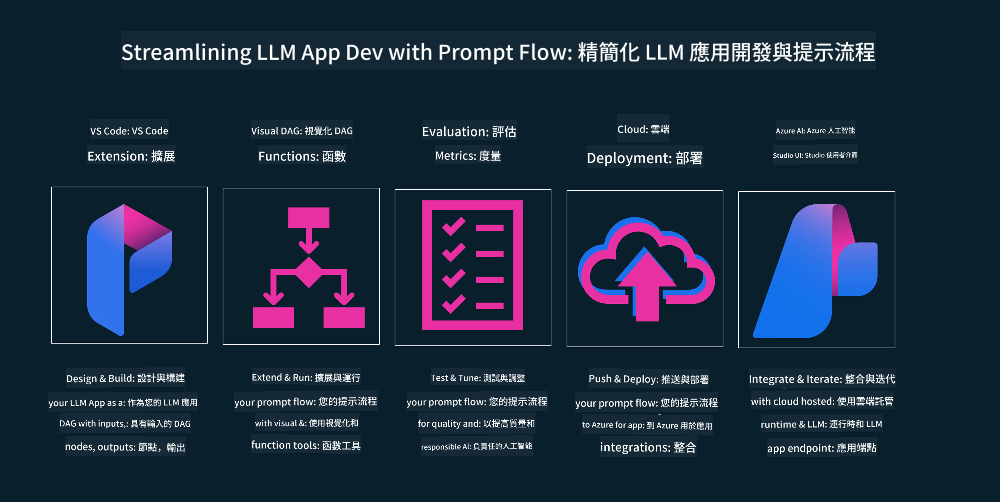

<!--
CO_OP_TRANSLATOR_METADATA:
{
  "original_hash": "27a5347a5022d5ef0a72ab029b03526a",
  "translation_date": "2025-07-09T15:49:15+00:00",
  "source_file": "14-the-generative-ai-application-lifecycle/README.md",
  "language_code": "tw"
}
-->

# 生成式 AI 應用程式生命週期

對所有 AI 應用程式來說，一個重要的問題是 AI 功能的相關性。由於 AI 是一個快速演進的領域，為了確保您的應用程式持續具備相關性、可靠性與穩健性，您需要持續監控、評估並改進它。這正是生成式 AI 生命週期的用武之地。

生成式 AI 生命週期是一個指引您開發、部署及維護生成式 AI 應用程式的框架。它幫助您明確目標、衡量效能、識別挑戰並實施解決方案。同時，也協助您使應用程式符合您領域及利害關係人的倫理與法律標準。透過遵循生成式 AI 生命週期，您能確保應用程式持續提供價值並滿足使用者需求。

## 介紹

在本章節中，您將會：

- 了解從 MLOps 到 LLMOps 的範式轉變
- LLM 生命週期
- 生命週期工具
- 生命週期的度量與評估

## 了解從 MLOps 到 LLMOps 的範式轉變

LLM 是人工智慧工具庫中的新利器，它們在分析與生成任務上非常強大，適用於各種應用程式，但這股力量也帶來了我們在整合 AI 與傳統機器學習任務時的挑戰。

因此，我們需要一個新的範式，以動態且正確的激勵方式來適應這項工具。我們可以將舊有的 AI 應用程式稱為「ML 應用程式」，而較新的 AI 應用程式則稱為「GenAI 應用程式」或簡稱「AI 應用程式」，反映當時主流的技術與方法。這在多方面改變了我們的敘事，請參考以下比較。

請注意，在 LLMOps 中，我們更關注應用程式開發者，將整合視為關鍵點，採用「模型即服務」的方式，並從以下幾個面向思考度量指標：

- 品質：回應品質
- 風險：負責任的 AI
- 誠實度：回應的依據性（合理嗎？正確嗎？）
- 成本：解決方案預算
- 延遲：平均回應時間（以 token 計）

## LLM 生命週期

首先，為了理解生命週期及其變化，請參考下方資訊圖表。

如您所見，這與傳統 MLOps 的生命週期不同。LLM 有許多新需求，例如提示工程、提升品質的不同技術（微調、RAG、元提示）、負責任 AI 的不同評估與責任，以及新的評估指標（品質、風險、誠實度、成本與延遲）。

舉例來說，看看我們如何進行構思。利用提示工程來嘗試不同的 LLM，探索可能性，測試假設是否成立。

請注意，這不是線性的流程，而是整合的迴圈，反覆且有一個總體循環。

我們如何探索這些步驟？讓我們深入了解如何建立生命週期。

這看起來可能有點複雜，先聚焦於三個主要步驟。

1. 構思／探索：根據業務需求進行探索。原型設計，建立 [PromptFlow](https://microsoft.github.io/promptflow/index.html?WT.mc_id=academic-105485-koreyst) 並測試是否足夠支持假設。
2. 建置／增強：實作階段，開始評估較大規模資料集，實施技術如微調與 RAG，檢驗解決方案的穩健性。若不理想，重新實作、加入新步驟或重組資料可能有幫助。測試流程與規模後，確認符合指標，即可進入下一階段。
3. 運營化：整合階段，加入監控與警示系統，部署並整合至應用程式。

接著，有一個涵蓋整體的管理循環，專注於安全、合規與治理。

恭喜，您的 AI 應用程式已準備就緒並可投入運作。想親自體驗，請參考 [Contoso Chat Demo](https://nitya.github.io/contoso-chat/?WT.mc_id=academic-105485-koreys)。

那麼，我們可以使用哪些工具呢？

## 生命週期工具

在工具方面，Microsoft 提供了 [Azure AI Platform](https://azure.microsoft.com/solutions/ai/?WT.mc_id=academic-105485-koreys) 與 [PromptFlow](https://microsoft.github.io/promptflow/index.html?WT.mc_id=academic-105485-koreyst)，讓您的生命週期實作更簡單且隨時可用。

[Azure AI Platform](https://azure.microsoft.com/solutions/ai/?WT.mc_id=academic-105485-koreys) 讓您使用 [AI Studio](https://ai.azure.com/?WT.mc_id=academic-105485-koreys)。AI Studio 是一個網頁入口，讓您探索模型、範例與工具，管理資源、UI 開發流程，以及提供 SDK/CLI 選項以支援以程式碼為先的開發。

Azure AI 允許您使用多種資源，管理您的運營、服務、專案、向量搜尋與資料庫需求。

從概念驗證（POC）到大規模應用，使用 PromptFlow：

- 從 VS Code 設計與建置應用程式，結合視覺與功能工具
- 輕鬆測試並微調您的應用程式，確保 AI 品質
- 利用 Azure AI Studio 進行整合與迭代，快速推送與部署

## 太棒了！繼續學習吧！

很棒，現在進一步了解如何結構應用程式，並運用這些概念於 [Contoso Chat App](https://nitya.github.io/contoso-chat/?WT.mc_id=academic-105485-koreyst)，看看 Cloud Advocacy 如何在示範中加入這些概念。更多內容，請參考我們的 [Ignite 專題講座！](https://www.youtube.com/watch?v=DdOylyrTOWg)

接著，請查看第 15 課，了解 [Retrieval Augmented Generation 與向量資料庫](../15-rag-and-vector-databases/README.md?WT.mc_id=academic-105485-koreyst) 如何影響生成式 AI，並打造更具吸引力的應用程式！

**免責聲明**：  
本文件係使用 AI 翻譯服務 [Co-op Translator](https://github.com/Azure/co-op-translator) 進行翻譯。雖然我們力求準確，但請注意，自動翻譯可能包含錯誤或不準確之處。原始文件的母語版本應視為權威來源。對於重要資訊，建議採用專業人工翻譯。我們不對因使用本翻譯而產生的任何誤解或誤譯負責。