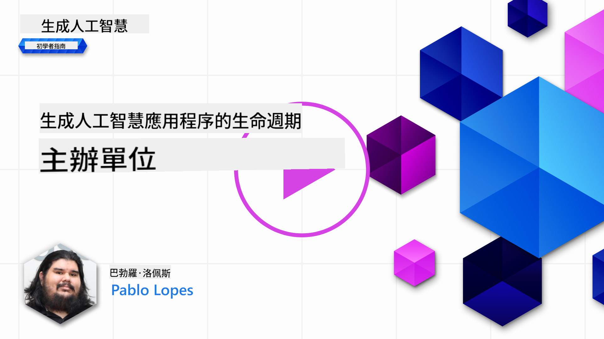
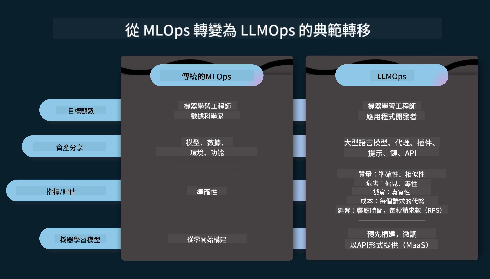
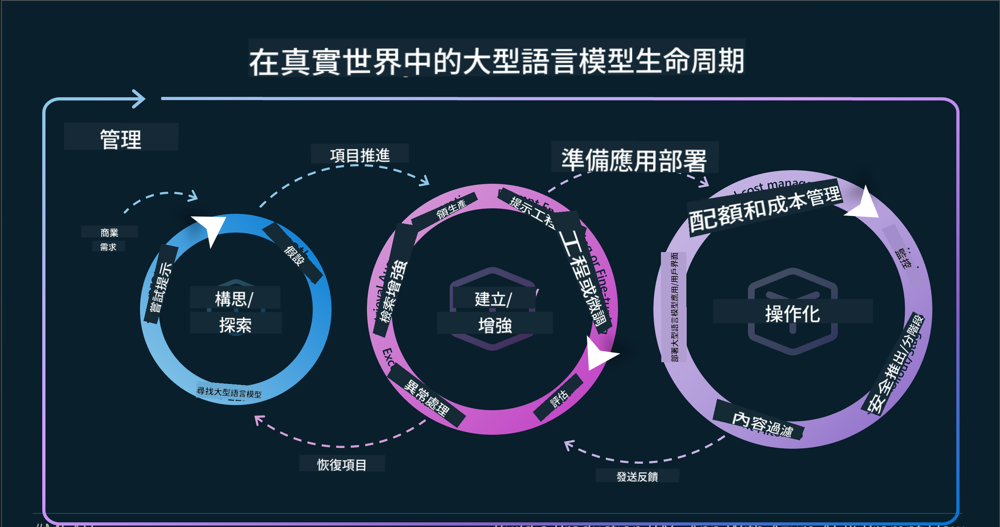
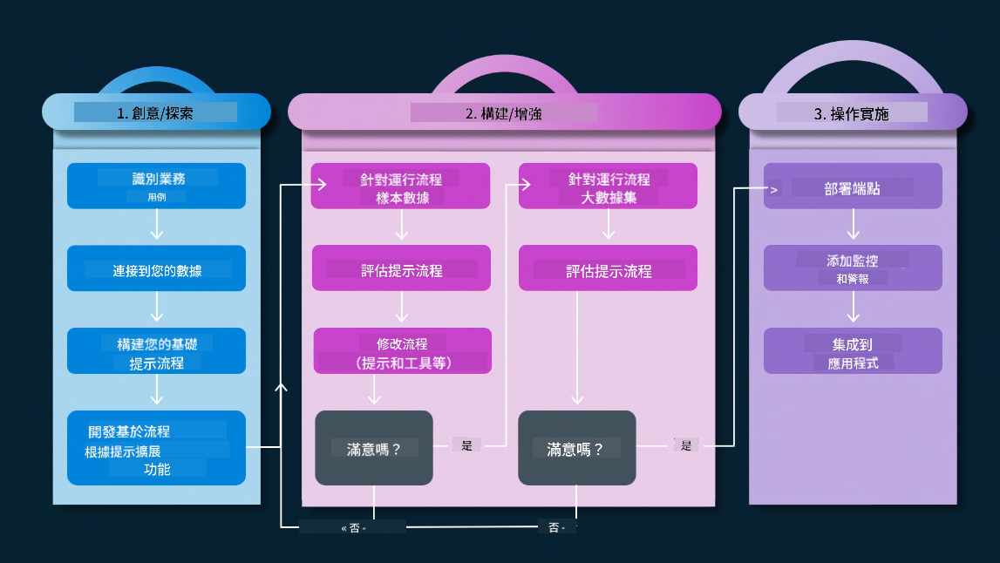
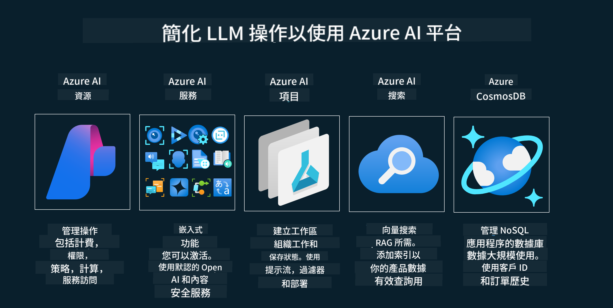
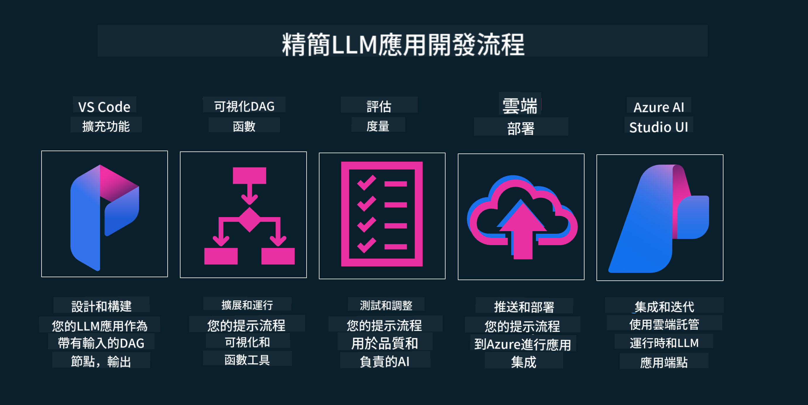

<!--
CO_OP_TRANSLATOR_METADATA:
{
  "original_hash": "27a5347a5022d5ef0a72ab029b03526a",
  "translation_date": "2025-05-19T23:21:52+00:00",
  "source_file": "14-the-generative-ai-application-lifecycle/README.md",
  "language_code": "tw"
}
-->

# 生成式 AI 應用程式生命週期

對於所有 AI 應用程式來說，一個重要的問題是 AI 功能的相關性，因為 AI 是一個快速演變的領域。為了確保您的應用程式保持相關性、可靠性和穩健性，您需要不斷地監控、評估和改進它。這就是生成式 AI 生命週期的作用。

生成式 AI 生命週期是一個框架，指導您開發、部署和維護生成式 AI 應用程式的各個階段。它幫助您定義目標、衡量績效、識別挑戰並實施解決方案。它還幫助您將應用程式與您領域和利益相關者的倫理和法律標準對齊。透過遵循生成式 AI 生命週期，您可以確保您的應用程式始終提供價值並滿足用戶需求。

## 介紹

在本章中，您將：

- 理解從 MLOps 到 LLMOps 的範式轉變
- LLM 生命週期
- 生命週期工具
- 生命週期指標和評估

## 理解從 MLOps 到 LLMOps 的範式轉變

LLM 是人工智慧武器庫中的新工具，它們在應用程式的分析和生成任務中具有強大的能力。然而，這種能力在如何簡化 AI 和傳統機器學習任務方面帶來了一些後果。

因此，我們需要一個新的範式，以動態地適應這個工具，並具有正確的激勵措施。我們可以將舊的 AI 應用程式分類為“ML 應用程式”，而將新的 AI 應用程式分類為“GenAI 應用程式”或簡稱為“AI 應用程式”，以反映當時使用的主流技術和技術。這在多個方面改變了我們的敘述，請看以下比較。

注意在 LLMOps 中，我們更加關注應用程式開發者，將整合作為關鍵點，使用“模型即服務”並考慮以下指標。

- 質量：響應質量
- 危害：負責任的 AI
- 誠實：響應的合理性（有意義嗎？正確嗎？）
- 成本：解決方案預算
- 延遲：令牌響應的平均時間

## LLM 生命週期

首先，為了理解生命週期和修改，讓我們注意下圖。

如您所見，這與 MLOps 的常規生命週期不同。LLM 有許多新的要求，如提示工程、改進質量的不同技術（微調、RAG、元提示）、負責任 AI 的不同評估和責任，最後是新的評估指標（質量、危害、誠實、成本和延遲）。

例如，看看我們如何構思。使用提示工程來實驗各種 LLM，以探索可能性，測試他們的假設是否正確。

注意這不是線性的，而是集成循環的，迭代的，並且具有一個總體循環。

我們如何探索這些步驟？讓我們詳細說明如何構建一個生命週期。

這看起來可能有點複雜，讓我們先專注於三個大步驟。

1. 構思/探索：探索，在這裡我們可以根據業務需求進行探索。原型設計，創建一個 [PromptFlow](https://microsoft.github.io/promptflow/index.html?WT.mc_id=academic-105485-koreyst) 並測試它是否對我們的假設足夠有效。
2. 構建/增強：實施，現在，我們開始評估更大的數據集，實施技術，如微調和 RAG，以檢查我們解決方案的穩健性。如果不行，重新實施它，添加新步驟到我們的流程或重組數據，可能會有所幫助。在測試我們的流程和規模後，如果它工作並檢查我們的指標，它就準備好進入下一步。
3. 運行：整合，現在將監控和警報系統添加到我們的系統中，部署和應用程式整合到我們的應用程式中。

然後，我們有一個總體的管理循環，專注於安全性、合規性和治理。

恭喜，現在您的 AI 應用程式已準備好運行和操作。想要實際操作體驗，請查看 [Contoso 聊天演示。](https://nitya.github.io/contoso-chat/?WT.mc_id=academic-105485-koreys)

現在，我們可以使用哪些工具？

## 生命週期工具

對於工具，Microsoft 提供 [Azure AI 平台](https://azure.microsoft.com/solutions/ai/?WT.mc_id=academic-105485-koreys) 和 [PromptFlow](https://microsoft.github.io/promptflow/index.html?WT.mc_id=academic-105485-koreyst) 以便於您的循環實施和準備。

[Azure AI 平台](https://azure.microsoft.com/solutions/ai/?WT.mc_id=academic-105485-koreys)，允許您使用 [AI Studio](https://ai.azure.com/?WT.mc_id=academic-105485-koreys)。AI Studio 是一個網頁入口，允許您探索模型、範例和工具。管理您的資源、UI 開發流程和 SDK/CLI 選項以進行代碼優先開發。

Azure AI，允許您使用多種資源，來管理您的操作、服務、項目、向量搜索和數據庫需求。

從概念驗證（POC）到大型應用程式，使用 PromptFlow 構建：

- 從 VS Code 設計和構建應用程式，使用視覺和功能工具
- 測試和微調您的應用程式以獲得高質量的 AI，輕鬆完成。
- 使用 Azure AI Studio 與雲整合和迭代，推送和部署以快速整合。

## 太棒了！繼續學習！

太好了，現在學習更多關於我們如何構建應用程式以使用這些概念的內容，請查看 [Contoso 聊天應用程式](https://nitya.github.io/contoso-chat/?WT.mc_id=academic-105485-koreyst)，以了解雲倡導如何在演示中加入這些概念。想要更多內容，請查看我們的 [Ignite 分會場！
](https://www.youtube.com/watch?v=DdOylyrTOWg)

現在，查看第 15 課，了解 [檢索增強生成和向量數據庫](../15-rag-and-vector-databases/README.md?WT.mc_id=academic-105485-koreyst) 如何影響生成式 AI 並製作更具吸引力的應用程式！

**免責聲明**：  
本文件是使用AI翻譯服務[Co-op Translator](https://github.com/Azure/co-op-translator)進行翻譯的。儘管我們努力確保準確性，但請注意，自動翻譯可能包含錯誤或不準確之處。應以原語言的文件作為權威來源。對於關鍵信息，建議尋求專業人工翻譯。我們對使用此翻譯引起的任何誤解或誤讀不承擔責任。