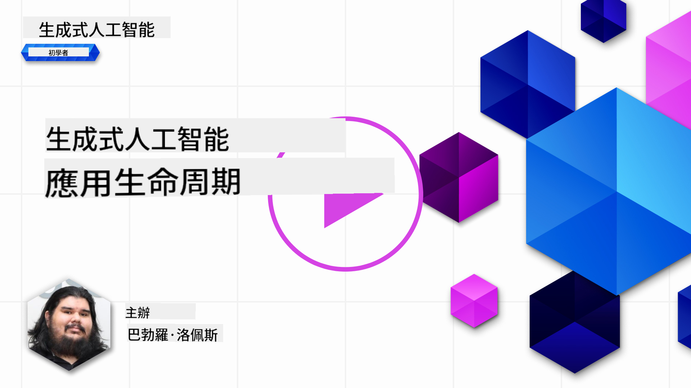
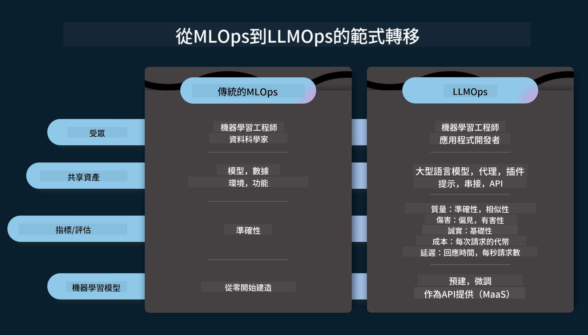
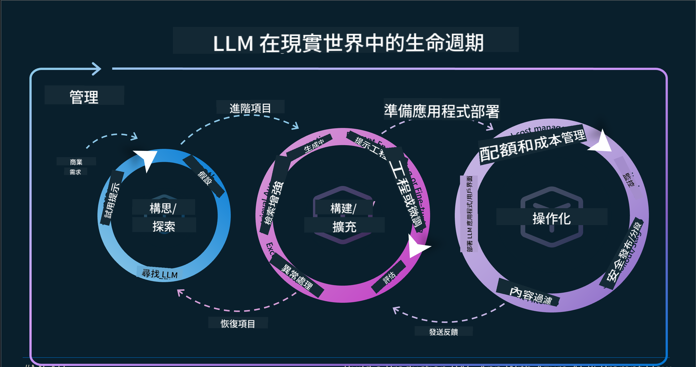
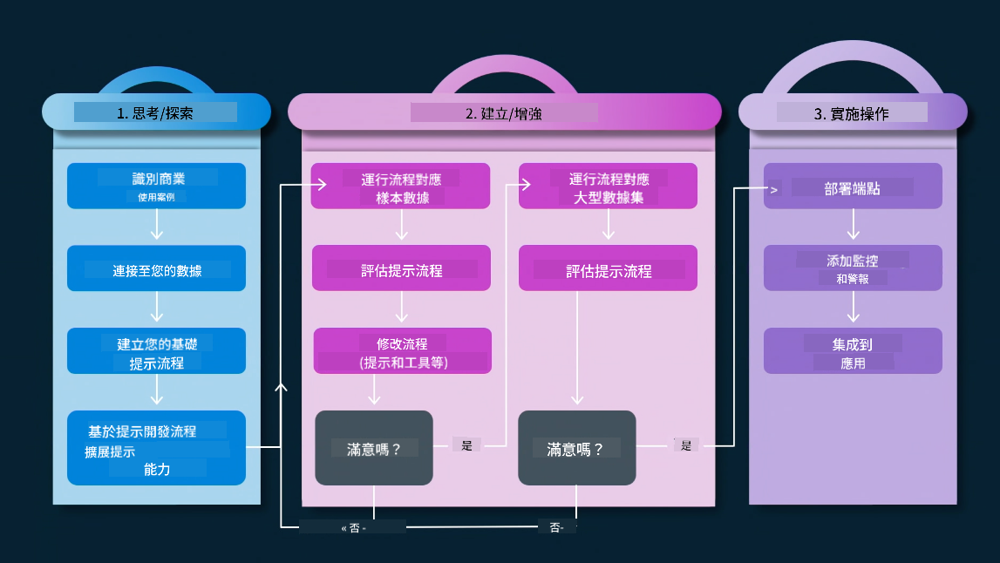
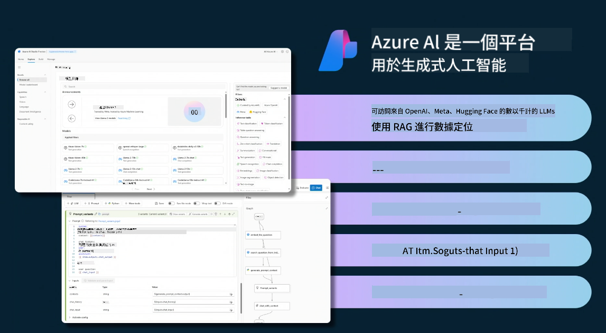
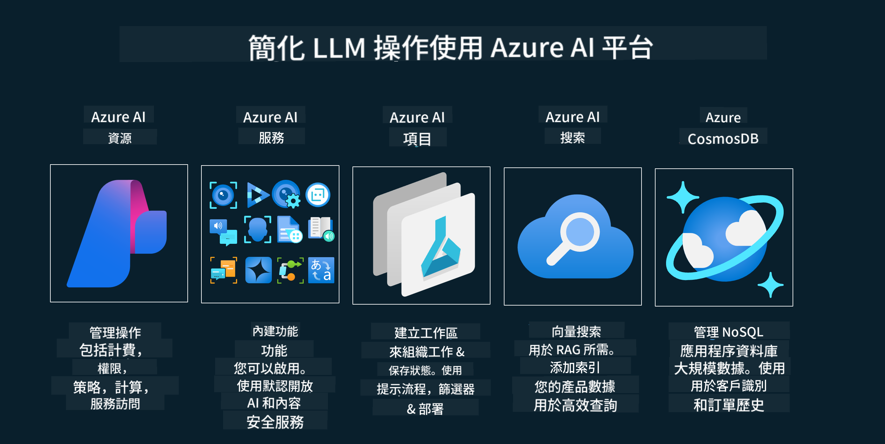
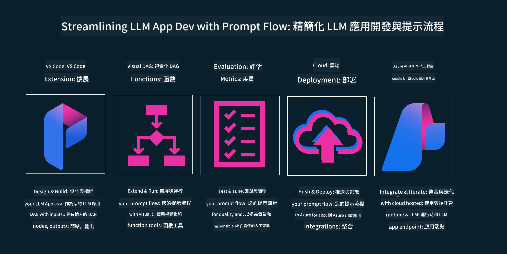

<!--
CO_OP_TRANSLATOR_METADATA:
{
  "original_hash": "27a5347a5022d5ef0a72ab029b03526a",
  "translation_date": "2025-06-25T21:57:35+00:00",
  "source_file": "14-the-generative-ai-application-lifecycle/README.md",
  "language_code": "tw"
}
-->

# 生成式 AI 應用程序生命週期

對於所有 AI 應用程序來說，一個重要的問題是 AI 功能的相關性。由於 AI 是一個快速發展的領域，為了確保您的應用程序保持相關性、可靠性和穩健性，您需要持續監控、評估和改進。這就是生成式 AI 生命週期的作用。

生成式 AI 生命週期是一個框架，引導您完成開發、部署和維護生成式 AI 應用程序的各個階段。它幫助您確定目標、衡量性能、識別挑戰並實施解決方案。它還幫助您將應用程序與您領域和利益相關者的倫理和法律標準對齊。通過遵循生成式 AI 生命週期，您可以確保您的應用程序始終提供價值並滿足用戶需求。

## 介紹

在本章中，您將：

- 理解從 MLOps 到 LLMOps 的範式轉變
- LLM 生命週期
- 生命週期工具
- 生命週期度量和評估

## 理解從 MLOps 到 LLMOps 的範式轉變

LLM 是人工智慧武器庫中的一個新工具，它在應用程序的分析和生成任務中具有極大的威力，然而這種威力對我們精簡 AI 和傳統機器學習任務的方式有一些影響。

因此，我們需要一個新的範式來動態適應這個工具，並提供正確的激勵。我們可以將舊的 AI 應用程序歸類為 "ML 應用程序"，而將新的 AI 應用程序歸類為 "GenAI 應用程序" 或簡稱為 "AI 應用程序"，以反映當時使用的主流技術和技術。這在多方面改變了我們的敘述，請看以下比較。

注意在 LLMOps 中，我們更加關注應用程序開發人員，將整合作為關鍵點，使用 "Models-as-a-Service" 並考慮以下指標點。

- 質量：回應質量
- 傷害：負責任的 AI
- 誠實：回應的基礎（有意義嗎？正確嗎？）
- 成本：解決方案預算
- 延遲：令牌回應的平均時間

## LLM 生命週期

首先，為了理解生命週期和修改，讓我們注意下一個資訊圖表。

如您所見，這與 MLOps 的常規生命週期不同。LLM 有許多新的需求，如提示、改進質量的不同技術（微調、RAG、元提示）、負責任 AI 的不同評估和責任，最後是新的評估指標（質量、傷害、誠實、成本和延遲）。

例如，看看我們如何構思。使用提示工程來試驗各種 LLM，以探索可能性以測試其假設是否正確。

注意這不是線性的，而是整合的迴圈，迭代的並具有一個總體週期。

我們如何探索這些步驟？讓我們詳細說明如何構建生命週期。

這可能看起來有點複雜，讓我們先專注於三個大步驟。

1. 構思/探索：探索，在這裡我們可以根據業務需求進行探索。原型設計，創建一個 [PromptFlow](https://microsoft.github.io/promptflow/index.html?WT.mc_id=academic-105485-koreyst) 並測試其是否足夠高效以滿足我們的假設。
2. 構建/增強：實施，現在，我們開始評估更大的數據集，實施技術，如微調和 RAG，以檢查解決方案的穩健性。如果不行，重新實施它，添加新步驟到我們的流程或重構數據可能會有所幫助。在測試我們的流程和規模後，如果它有效並檢查我們的指標，它就準備好進入下一步。
3. 操作化：整合，現在將監控和警報系統添加到我們的系統，部署和應用程序整合到我們的應用程序。

然後，我們有一個總體管理週期，專注於安全性、合規性和治理。

恭喜，現在您的 AI 應用程序已準備好運行並投入運營。想要親身體驗，請查看 [Contoso Chat Demo.](https://nitya.github.io/contoso-chat/?WT.mc_id=academic-105485-koreys)

現在，我們可以使用哪些工具？

## 生命週期工具

對於工具，Microsoft 提供 [Azure AI Platform](https://azure.microsoft.com/solutions/ai/?WT.mc_id=academic-105485-koreys) 和 [PromptFlow](https://microsoft.github.io/promptflow/index.html?WT.mc_id=academic-105485-koreyst)，使您的週期易於實施並隨時準備就緒。

[Azure AI Platform](https://azure.microsoft.com/solutions/ai/?WT.mc_id=academic-105485-koreys)，允許您使用 [AI Studio](https://ai.azure.com/?WT.mc_id=academic-105485-koreys)。AI Studio 是一個網頁入口，允許您探索模型、樣本和工具。管理您的資源、UI 開發流程和 SDK/CLI 選項，以進行代碼優先開發。

Azure AI，允許您使用多個資源，來管理您的操作、服務、項目、向量搜索和數據庫需求。

從概念驗證（POC）到大規模應用程序，使用 PromptFlow 構建：

- 從 VS Code 設計和構建應用程序，具有視覺和功能工具
- 測試和微調您的應用程序以獲得高質量的 AI，輕鬆實現。
- 使用 Azure AI Studio 與雲整合和迭代，快速整合推送和部署。

## 太好了！繼續學習！

太棒了，現在了解更多關於我們如何結構化應用程序以使用 [Contoso Chat App](https://nitya.github.io/contoso-chat/?WT.mc_id=academic-105485-koreyst) 的概念，查看 Cloud Advocacy 如何在演示中添加這些概念。更多內容，請查看我們的 [Ignite 突破會議！
](https://www.youtube.com/watch?v=DdOylyrTOWg)

現在，查看第 15 課，了解 [檢索增強生成和向量數據庫](../15-rag-and-vector-databases/README.md?WT.mc_id=academic-105485-koreyst) 如何影響生成式 AI 並創建更具吸引力的應用程序！

**免責聲明**：  
本文件使用 AI 翻譯服務 [Co-op Translator](https://github.com/Azure/co-op-translator) 進行翻譯。我們努力確保準確性，但請注意，自動翻譯可能包含錯誤或不準確之處。原始語言的文件應被視為權威來源。對於關鍵信息，建議使用專業人工翻譯。對於因使用本翻譯而產生的任何誤解或誤讀，我們不承擔任何責任。