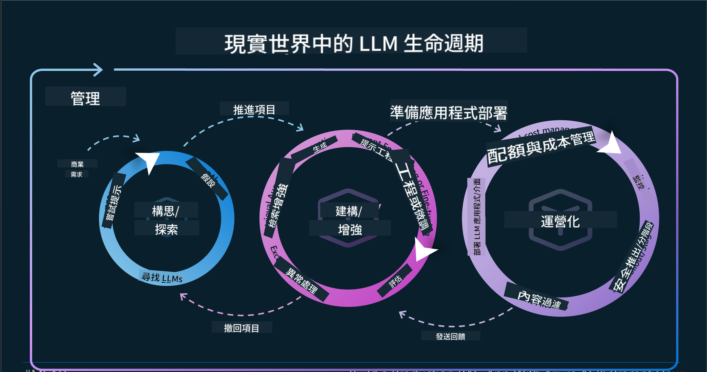
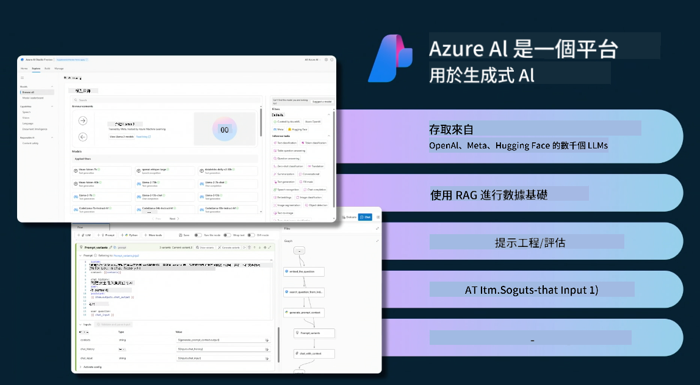
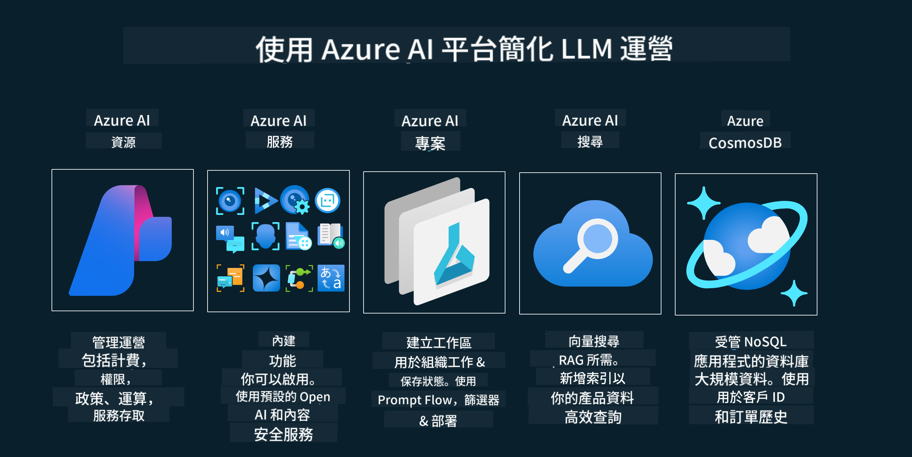
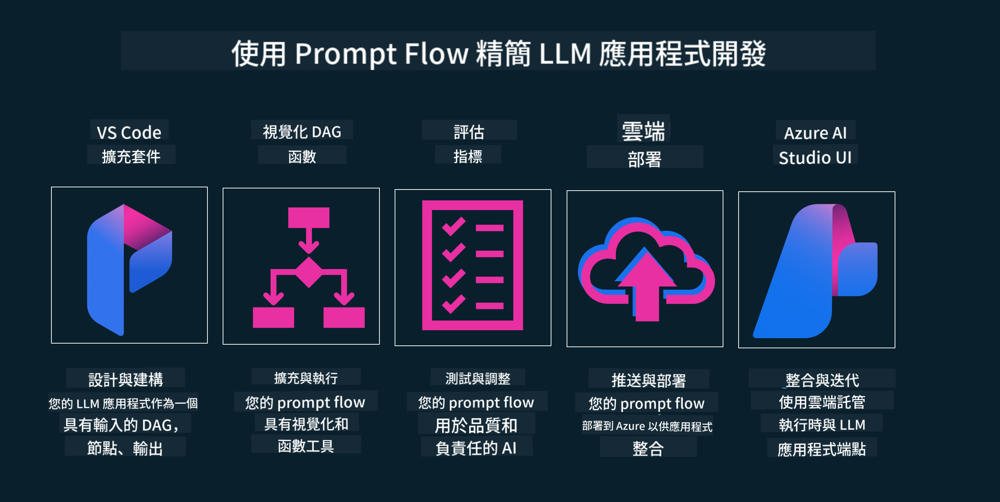

<!--
CO_OP_TRANSLATOR_METADATA:
{
  "original_hash": "b9d32511b27373a1b21b5789d4fda057",
  "translation_date": "2025-10-17T23:45:15+00:00",
  "source_file": "14-the-generative-ai-application-lifecycle/README.md",
  "language_code": "tw"
}
-->

# 生成式 AI 應用生命周期

對於所有 AI 應用程式來說，一個重要的問題是 AI 功能的相關性。由於 AI 是一個快速發展的領域，為了確保您的應用程式保持相關性、可靠性和穩健性，您需要持續監控、評估和改進。這就是生成式 AI 生命周期的作用所在。

生成式 AI 生命周期是一個框架，指導您完成開發、部署和維護生成式 AI 應用程式的各個階段。它幫助您定義目標、衡量性能、識別挑戰並實施解決方案。它還幫助您使應用程式與您領域和利益相關者的道德和法律標準保持一致。通過遵循生成式 AI 生命周期，您可以確保您的應用程式始終提供價值並滿足用戶需求。

## 介紹

在本章中，您將了解：

- 從 MLOps 到 LLMOps 的範式轉變
- LLM 生命周期
- 生命周期工具
- 生命周期的度量和評估

## 理解從 MLOps 到 LLMOps 的範式轉變

LLM 是人工智慧工具庫中的一個新工具，它在應用程式的分析和生成任務中具有極大的威力。然而，這種威力對我們如何簡化 AI 和傳統機器學習任務有一些影響。

因此，我們需要一個新的範式來動態適應這一工具，並設置正確的激勵措施。我們可以將舊的 AI 應用程式分類為 "ML 應用程式"，而新的 AI 應用程式則分類為 "GenAI 應用程式" 或簡稱 "AI 應用程式"，反映當時主流的技術和方法。這在多方面改變了我們的敘述，請看以下比較。

注意，在 LLMOps 中，我們更關注應用程式開發者，將整合作為關鍵點，使用 "模型即服務"，並考慮以下指標：

- 質量：回應質量
- 傷害：負責任的 AI
- 誠實：回應的基礎性（是否合理？是否正確？）
- 成本：解決方案預算
- 延遲：每個 token 回應的平均時間

## LLM 生命周期

首先，為了理解生命周期及其修改，讓我們注意以下資訊圖表。

如您所見，這與 MLOps 的常規生命周期不同。LLM 有許多新的需求，例如提示工程、提高質量的不同技術（微調、RAG、Meta-Prompts）、負責任的 AI 的不同評估和責任，以及新的評估指標（質量、傷害、誠實、成本和延遲）。

例如，看看我們如何進行構思。使用提示工程來試驗各種 LLM，探索可能性並測試其假設是否正確。

請注意，這不是線性的，而是整合的循環，迭代並具有總體周期。

我們如何探索這些步驟？讓我們詳細了解如何構建生命周期。

這可能看起來有點複雜，讓我們先專注於三個主要步驟。

1. 構思/探索：探索，在這裡我們可以根據業務需求進行探索。原型設計，創建 [PromptFlow](https://microsoft.github.io/promptflow/index.html?WT.mc_id=academic-105485-koreyst) 並測試其是否足夠高效以支持我們的假設。
2. 建立/增強：實施，現在，我們開始評估更大的數據集，實施技術，例如微調和 RAG，以檢查解決方案的穩健性。如果不夠穩健，重新實施，添加新步驟到流程或重構數據可能會有所幫助。在測試流程和規模後，如果有效並檢查指標，就可以進入下一步。
3. 操作化：整合，現在添加監控和警報系統到系統中，部署並將應用程式整合到我們的應用程式中。

然後，我們有管理的總體周期，專注於安全性、合規性和治理。

恭喜，現在您的 AI 應用程式已準備好運行並操作。想要實際操作體驗，請查看 [Contoso Chat Demo.](https://nitya.github.io/contoso-chat/?WT.mc_id=academic-105485-koreys)

那麼，我們可以使用哪些工具？

## 生命周期工具

在工具方面，Microsoft 提供了 [Azure AI 平台](https://azure.microsoft.com/solutions/ai/?WT.mc_id=academic-105485-koreys) 和 [PromptFlow](https://microsoft.github.io/promptflow/index.html?WT.mc_id=academic-105485-koreyst)，使您的生命周期易於實施並準備就緒。

[Azure AI 平台](https://azure.microsoft.com/solutions/ai/?WT.mc_id=academic-105485-koreys) 允許您使用 [AI Studio](https://ai.azure.com/?WT.mc_id=academic-105485-koreys)。AI Studio 是一個網頁入口，允許您探索模型、範例和工具，管理您的資源，進行 UI 開發流程以及提供 SDK/CLI 選項以進行代碼優先開發。

Azure AI 允許您使用多種資源來管理您的操作、服務、項目、向量搜索和數據庫需求。

從概念驗證（POC）到大規模應用程式，使用 PromptFlow 構建：

- 使用 VS Code 的視覺化和功能工具設計和構建應用程式
- 輕鬆測試和微調您的應用程式以獲得高質量的 AI
- 使用 Azure AI Studio 與雲端整合和迭代，快速推送和部署以進行整合

## 太棒了！繼續學習！

太棒了，現在了解更多關於我們如何結構化應用程式以使用這些概念，請查看 [Contoso Chat App](https://nitya.github.io/contoso-chat/?WT.mc_id=academic-105485-koreyst)，了解雲端倡導如何在演示中添加這些概念。更多內容，請查看我們的 [Ignite 分組會議！](https://www.youtube.com/watch?v=DdOylyrTOWg)

現在，查看第 15 課，了解 [檢索增強生成和向量數據庫](../15-rag-and-vector-databases/README.md?WT.mc_id=academic-105485-koreyst) 如何影響生成式 AI 並創建更具吸引力的應用程式！

---

**免責聲明**：  
本文件已使用 AI 翻譯服務 [Co-op Translator](https://github.com/Azure/co-op-translator) 進行翻譯。儘管我們致力於提供準確的翻譯，但請注意，自動翻譯可能包含錯誤或不準確之處。原始文件的母語版本應被視為權威來源。對於關鍵資訊，建議使用專業人工翻譯。我們對因使用此翻譯而引起的任何誤解或誤釋不承擔責任。