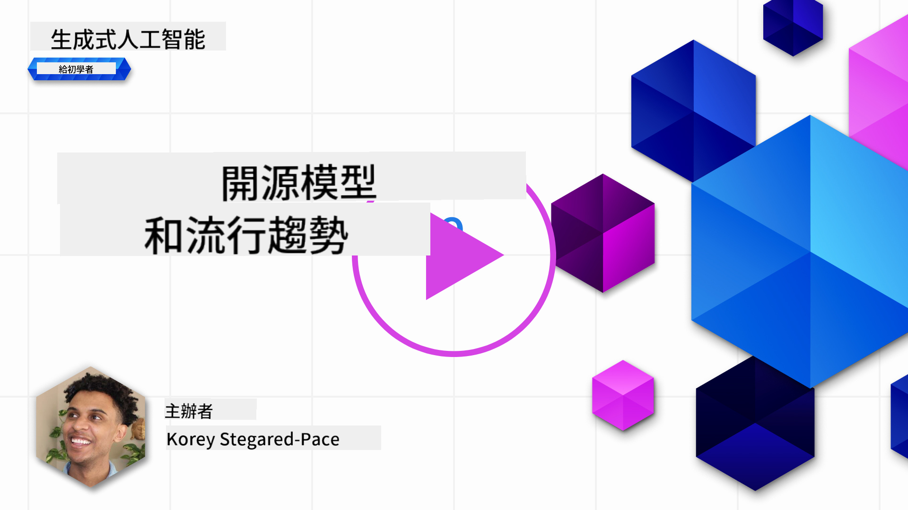
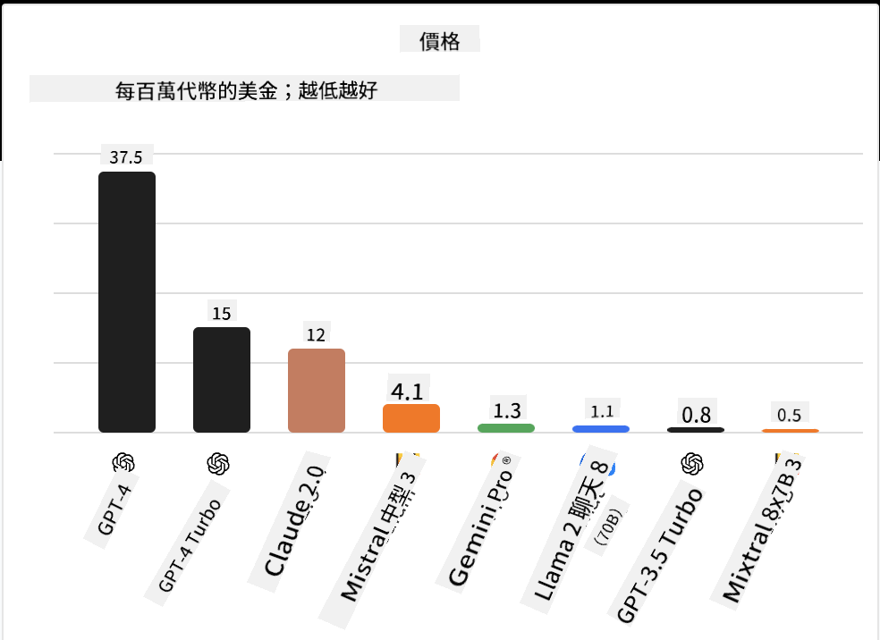
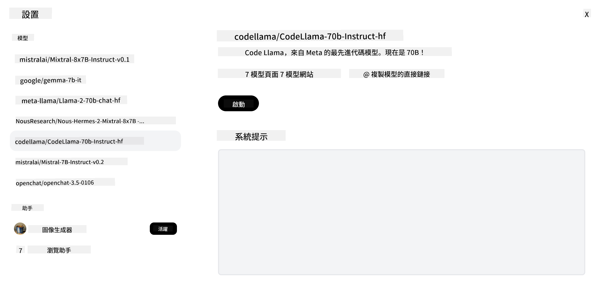
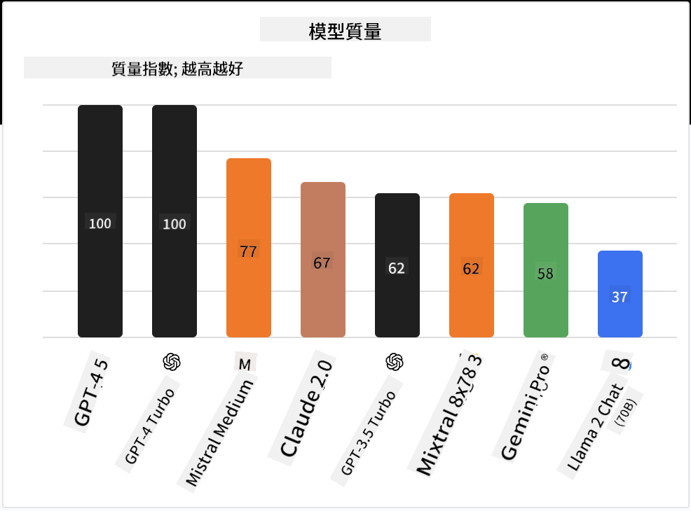

<!--
CO_OP_TRANSLATOR_METADATA:
{
  "original_hash": "0bba96e53ab841d99db731892a51fab8",
  "translation_date": "2025-05-20T06:49:20+00:00",
  "source_file": "16-open-source-models/README.md",
  "language_code": "tw"
}
-->

## 介紹

開源 LLM 的世界充滿刺激且不斷演變。本課程旨在深入了解開源模型。如果您想了解專有模型與開源模型的比較，請參閱["探索和比較不同 LLM"課程](../02-exploring-and-comparing-different-llms/README.md?WT.mc_id=academic-105485-koreyst)。本課程還將涵蓋微調的主題，但更詳細的解釋可以在["微調 LLM"課程](../18-fine-tuning/README.md?WT.mc_id=academic-105485-koreyst)中找到。

## 學習目標

- 獲得對開源模型的理解
- 了解使用開源模型的好處
- 探索 Hugging Face 和 Azure AI Studio 上的開源模型

## 什麼是開源模型？

開源軟體在各個領域的技術增長中發揮了關鍵作用。開源倡議 (OSI) 已定義了[10 個軟體標準](https://web.archive.org/web/20241126001143/https://opensource.org/osd?WT.mc_id=academic-105485-koreyst)，以將軟體歸類為開源。源代碼必須在 OSI 批准的許可下公開共享。

雖然 LLM 的開發與軟體開發有相似之處，但過程並不完全相同。這在社群中引發了關於 LLM 背景下開源定義的廣泛討論。要使模型符合傳統的開源定義，以下信息應公開可用：

- 用於訓練模型的數據集。
- 作為訓練一部分的完整模型權重。
- 評估代碼。
- 微調代碼。
- 完整的模型權重和訓練指標。

目前只有少數模型符合這些標準。[由 Allen Institute for Artificial Intelligence (AllenAI) 創建的 OLMo 模型](https://huggingface.co/allenai/OLMo-7B?WT.mc_id=academic-105485-koreyst)是符合此類別的模型之一。

在本課程中，我們將這些模型稱為"開放模型"，因為在撰寫本文時，它們可能不符合上述標準。

## 開放模型的優勢

**高度可定制** - 由於開放模型是與詳細的訓練信息一起發布的，研究人員和開發人員可以修改模型的內部結構。這使得可以創建高度專門化的模型，針對特定任務或研究領域進行微調。這方面的一些例子包括代碼生成、數學運算和生物學。

**成本** - 使用和部署這些模型的每個 token 的成本低於專有模型。在構建生成 AI 應用程序時，應根據您的用例來考慮性能與價格的比較。

  
來源：Artificial Analysis

**靈活性** - 使用開放模型使您可以在使用不同模型或結合它們時保持靈活性。一個例子是 [HuggingChat Assistants](https://huggingface.co/chat?WT.mc_id=academic-105485-koreyst)，用戶可以在用戶界面中直接選擇正在使用的模型：

## 探索不同的開放模型

### Llama 2

[LLama2](https://huggingface.co/meta-llama?WT.mc_id=academic-105485-koreyst)，由 Meta 開發，是一個針對聊天應用優化的開放模型。這是由於其微調方法，其中包括大量對話和人類反饋。通過這種方法，模型產生的結果更符合人類期望，從而提供更好的用戶體驗。

Llama 的一些微調版本包括[日本 Llama](https://huggingface.co/elyza/ELYZA-japanese-Llama-2-7b?WT.mc_id=academic-105485-koreyst)，專門針對日語，[Llama Pro](https://huggingface.co/TencentARC/LLaMA-Pro-8B?WT.mc_id=academic-105485-koreyst)，這是基礎模型的增強版本。

### Mistral

[Mistral](https://huggingface.co/mistralai?WT.mc_id=academic-105485-koreyst) 是一個專注於高性能和效率的開放模型。它使用專家混合的方法，將一組專門的專家模型結合成一個系統，根據輸入選擇某些模型使用。這使得計算更有效，因為模型僅處理它們專門的輸入。

Mistral 的一些微調版本包括[BioMistral](https://huggingface.co/BioMistral/BioMistral-7B?text=Mon+nom+est+Thomas+et+mon+principal?WT.mc_id=academic-105485-koreyst)，專注於醫療領域，[OpenMath Mistral](https://huggingface.co/nvidia/OpenMath-Mistral-7B-v0.1-hf?WT.mc_id=academic-105485-koreyst)，進行數學運算。

### Falcon

[Falcon](https://huggingface.co/tiiuae?WT.mc_id=academic-105485-koreyst) 是由科技創新研究所 (TII) 創建的 LLM。Falcon-40B 在 400 億參數上進行了訓練，已被證明比 GPT-3 在計算預算較少的情況下表現更好。這是由於其使用 FlashAttention 演算法和多查詢注意力，能夠在推理時減少記憶需求。由於推理時間減少，Falcon-40B 適用於聊天應用。

Falcon 的一些微調版本包括[OpenAssistant](https://huggingface.co/OpenAssistant/falcon-40b-sft-top1-560?WT.mc_id=academic-105485-koreyst)，基於開放模型構建的助手，[GPT4ALL](https://huggingface.co/nomic-ai/gpt4all-falcon?WT.mc_id=academic-105485-koreyst)，性能比基礎模型更高。

## 如何選擇

選擇開放模型沒有唯一的答案。可以從使用 Azure AI Studio 的任務過濾功能開始。這將幫助您了解模型已被訓練的任務類型。Hugging Face 還維護了一個 LLM 排行榜，顯示根據某些指標的最佳模型。

在尋求比較不同類型的 LLM 時，[Artificial Analysis](https://artificialanalysis.ai/?WT.mc_id=academic-105485-koreyst) 是另一個很好的資源：

  
來源：Artificial Analysis

如果正在處理特定用例，尋找專注於相同領域的微調版本可能會有效。嘗試多個開放模型以查看它們如何根據您和用戶的期望表現也是一個好做法。

## 下一步

開放模型的最佳部分是您可以快速開始使用它們。查看 [Azure AI Studio 模型目錄](https://ai.azure.com?WT.mc_id=academic-105485-koreyst)，其中包含我們在此討論的這些模型的特定 Hugging Face 集合。

## 學習不止於此，繼續探索之旅

完成本課程後，查看我們的[生成 AI 學習集合](https://aka.ms/genai-collection?WT.mc_id=academic-105485-koreyst)，繼續提升您的生成 AI 知識！

**免責聲明**：
本文件使用 AI 翻譯服務 [Co-op Translator](https://github.com/Azure/co-op-translator) 進行翻譯。我們努力確保準確性，但請注意，自動翻譯可能包含錯誤或不準確之處。應以原語言的文件為權威來源。對於關鍵信息，建議尋求專業人工翻譯。我們對使用此翻譯可能引起的任何誤解或誤釋不承擔責任。