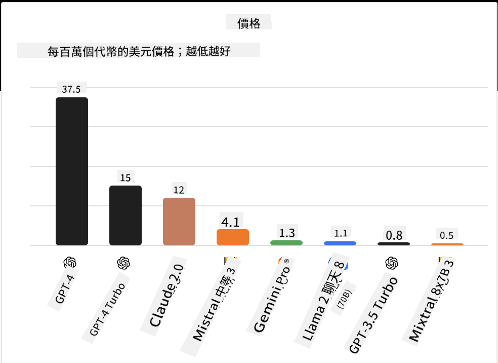
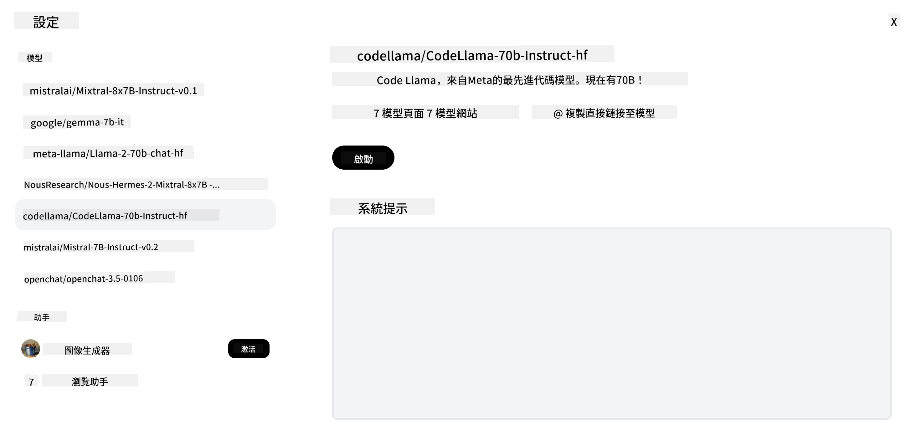
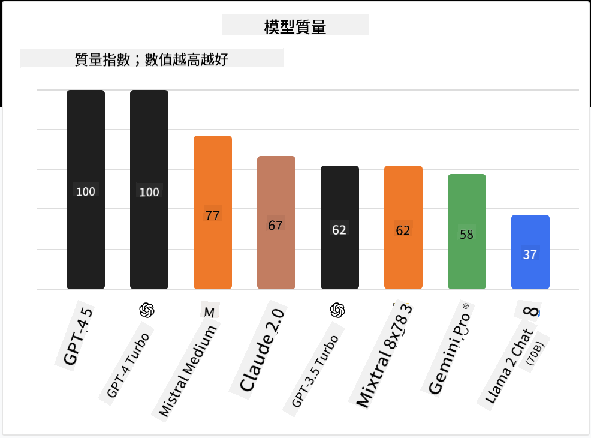

<!--
CO_OP_TRANSLATOR_METADATA:
{
  "original_hash": "0bba96e53ab841d99db731892a51fab8",
  "translation_date": "2025-06-25T23:51:03+00:00",
  "source_file": "16-open-source-models/README.md",
  "language_code": "tw"
}
-->

## 介紹

開源大型語言模型（LLM）的世界令人興奮且不斷發展。本課旨在深入了解開源模型。如果您想了解專有模型與開源模型的比較，請參閱["探索和比較不同的LLM"課程](../02-exploring-and-comparing-different-llms/README.md?WT.mc_id=academic-105485-koreyst)。本課還將涵蓋微調的主題，但更詳細的解釋可以在["微調LLM"課程](../18-fine-tuning/README.md?WT.mc_id=academic-105485-koreyst)中找到。

## 學習目標

- 理解開源模型
- 了解使用開源模型的好處
- 探索Hugging Face和Azure AI Studio上的開源模型

## 什麼是開源模型？

開源軟體在各個領域的技術增長中扮演了關鍵角色。開源倡議（OSI）定義了[軟體的10個標準](https://web.archive.org/web/20241126001143/https://opensource.org/osd?WT.mc_id=academic-105485-koreyst)以被分類為開源。源代碼必須在OSI批准的許可下公開共享。

雖然LLM的開發與軟體開發有相似的元素，但過程並不完全相同。這引發了社群中關於在LLM背景下開源定義的許多討論。為了使模型符合傳統的開源定義，以下資訊應公開：

- 用於訓練模型的數據集。
- 作為訓練一部分的完整模型權重。
- 評估代碼。
- 微調代碼。
- 完整的模型權重和訓練指標。

目前只有少數模型符合這些標準。由艾倫人工智能研究所（AllenAI）創建的[OLMo模型](https://huggingface.co/allenai/OLMo-7B?WT.mc_id=academic-105485-koreyst)就是其中之一。

在本課中，我們將繼續將這些模型稱為"開放模型"，因為在撰寫本文時它們可能不符合上述標準。

## 開放模型的好處

**高度可定制** - 由於開放模型發布了詳細的訓練資訊，研究人員和開發人員可以修改模型的內部結構。這使得可以創建針對特定任務或研究領域進行微調的高度專業化模型。一些例子包括代碼生成、數學運算和生物學。

**成本** - 使用和部署這些模型的每個token的成本低於專有模型。在構建生成式AI應用時，應考慮性能與價格的比較。

  
來源：人工分析

**靈活性** - 使用開放模型可以在使用不同模型或結合它們方面保持靈活。這方面的一個例子是[HuggingChat Assistants](https://huggingface.co/chat?WT.mc_id=academic-105485-koreyst)，用戶可以在用戶界面中直接選擇正在使用的模型：

## 探索不同的開放模型

### Llama 2

由Meta開發的[LLama2](https://huggingface.co/meta-llama?WT.mc_id=academic-105485-koreyst)是一個針對基於聊天應用進行優化的開放模型。這是由於其微調方法，包括大量對話和人類反饋。通過這種方法，模型產生的結果更符合人類期望，提供更好的用戶體驗。

Llama的一些微調版本的例子包括專注於日語的[Japanese Llama](https://huggingface.co/elyza/ELYZA-japanese-Llama-2-7b?WT.mc_id=academic-105485-koreyst)和增強的基礎模型[Llama Pro](https://huggingface.co/TencentARC/LLaMA-Pro-8B?WT.mc_id=academic-105485-koreyst)。

### Mistral

[Mistral](https://huggingface.co/mistralai?WT.mc_id=academic-105485-koreyst)是一個注重高性能和效率的開放模型。它使用專家混合的方法，將一組專業的專家模型組合成一個系統，根據輸入選擇某些模型進行使用。這使得計算更有效，因為模型只處理它們專門的輸入。

Mistral的一些微調版本的例子包括專注於醫學領域的[BioMistral](https://huggingface.co/BioMistral/BioMistral-7B?text=Mon+nom+est+Thomas+et+mon+principal?WT.mc_id=academic-105485-koreyst)和進行數學計算的[OpenMath Mistral](https://huggingface.co/nvidia/OpenMath-Mistral-7B-v0.1-hf?WT.mc_id=academic-105485-koreyst)。

### Falcon

[Falcon](https://huggingface.co/tiiuae?WT.mc_id=academic-105485-koreyst)是由技術創新研究所（**TII**）創建的LLM。Falcon-40B在400億個參數上進行了訓練，表現優於GPT-3，計算預算較少。這是由於其使用FlashAttention算法和多查詢注意力，能夠在推理時減少內存需求。隨著推理時間的減少，Falcon-40B適用於聊天應用。

Falcon的一些微調版本的例子包括基於開放模型構建的助手[OpenAssistant](https://huggingface.co/OpenAssistant/falcon-40b-sft-top1-560?WT.mc_id=academic-105485-koreyst)和提供比基礎模型更高性能的[GPT4ALL](https://huggingface.co/nomic-ai/gpt4all-falcon?WT.mc_id=academic-105485-koreyst)。

## 如何選擇

選擇開放模型沒有唯一的答案。一個好的起點是使用Azure AI Studio的按任務篩選功能。這將幫助您了解模型已被訓練的任務類型。Hugging Face還維護了一個LLM排行榜，顯示基於某些指標的最佳表現模型。

當希望比較不同類型的LLM時，[Artificial Analysis](https://artificialanalysis.ai/?WT.mc_id=academic-105485-koreyst)是另一個很好的資源：

  
來源：人工分析

如果正在處理特定的使用案例，尋找專注於相同領域的微調版本可能會有效。嘗試多個開放模型，看看它們如何根據您和您的用戶的期望表現，也是個好習慣。

## 下一步

開放模型的最佳部分是您可以快速開始使用它們。查看[Azure AI Studio模型目錄](https://ai.azure.com?WT.mc_id=academic-105485-koreyst)，其中包含我們在此處討論的Hugging Face專輯。

## 學習不止於此，繼續探索之旅

完成本課後，查看我們的[生成式AI學習專輯](https://aka.ms/genai-collection?WT.mc_id=academic-105485-koreyst)，繼續提升您的生成式AI知識！

**免責聲明**：
本文檔已使用 AI 翻譯服務 [Co-op Translator](https://github.com/Azure/co-op-translator) 進行翻譯。儘管我們努力確保準確性，但請注意，自動翻譯可能包含錯誤或不準確之處。應將原始文件的本地語言版本視為權威來源。對於關鍵信息，建議尋求專業人工翻譯。我們不對因使用此翻譯而引起的任何誤解或誤釋承擔責任。