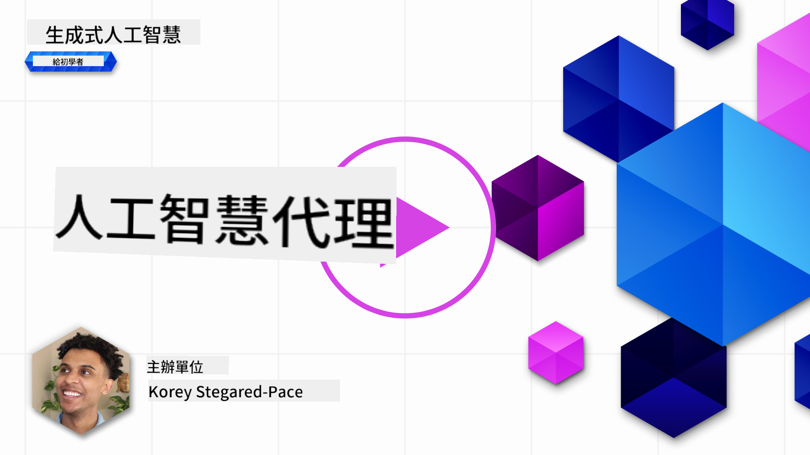
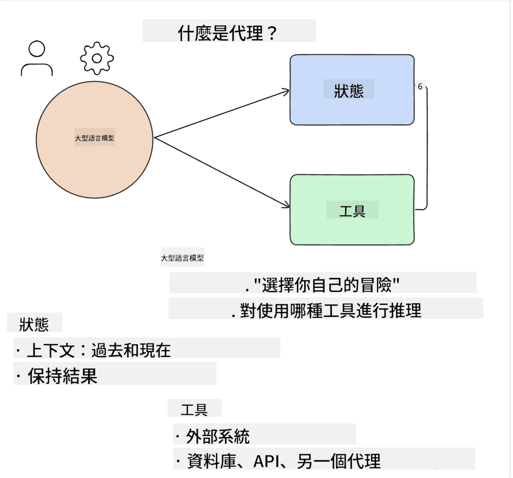
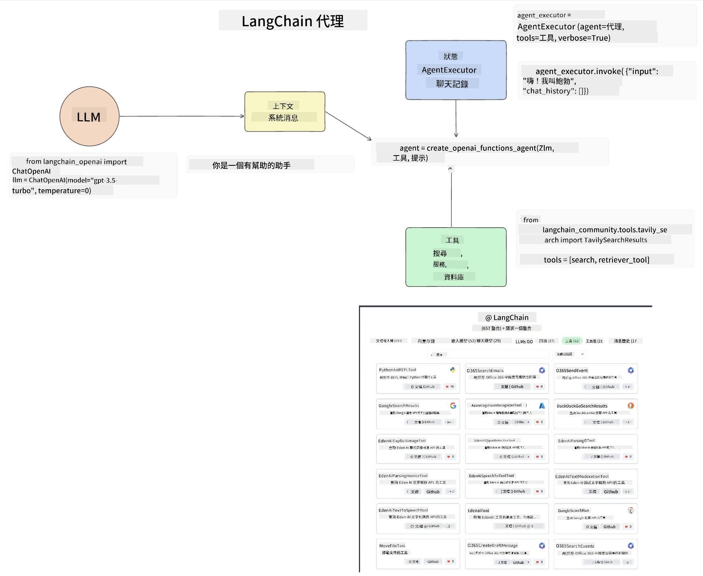
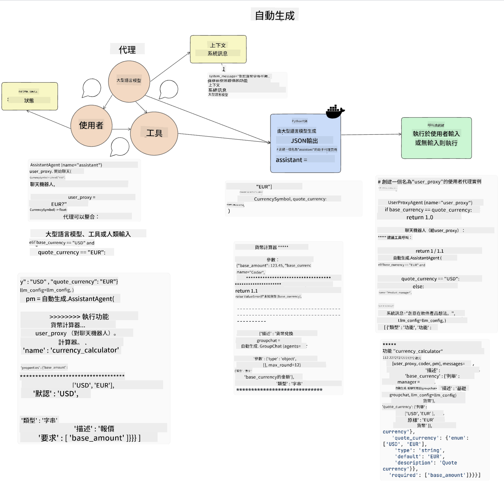
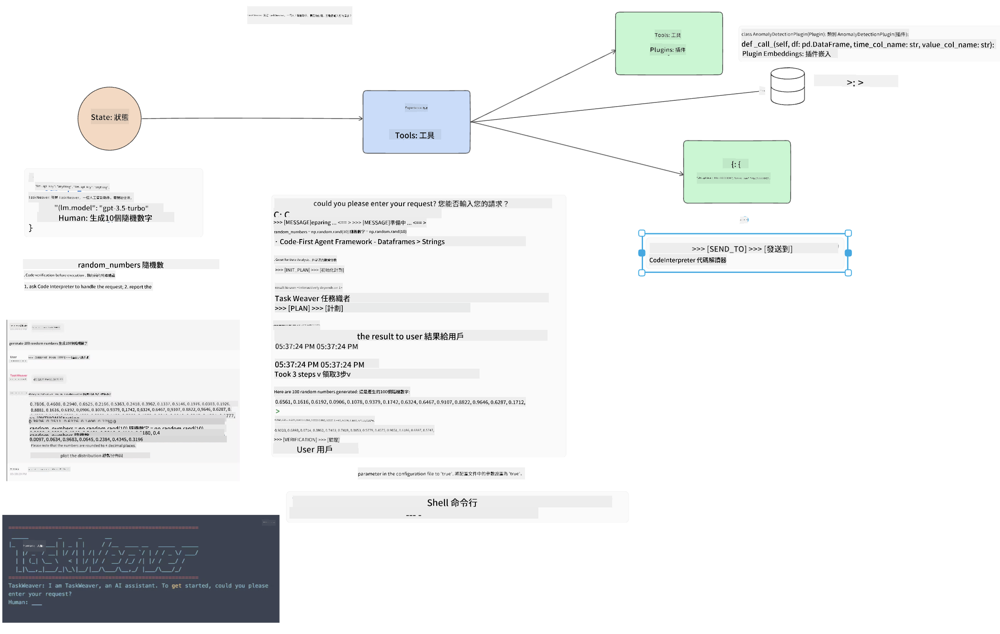
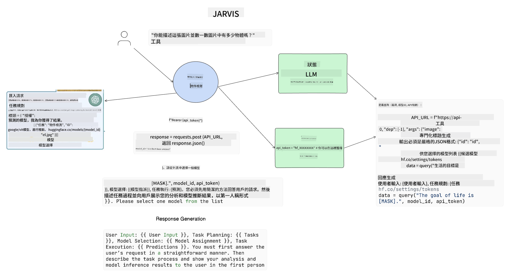

<!--
CO_OP_TRANSLATOR_METADATA:
{
  "original_hash": "11f03c81f190d9cbafd0f977dcbede6c",
  "translation_date": "2025-06-26T00:11:35+00:00",
  "source_file": "17-ai-agents/README.md",
  "language_code": "tw"
}
-->
[](https://aka.ms/gen-ai-lesson17-gh?WT.mc_id=academic-105485-koreyst)

## 介紹

AI代理是生成式AI中的一項令人興奮的發展，讓大型語言模型（LLM）從助手演變為能夠採取行動的代理。AI代理框架使開發者能夠創建應用程式，讓LLM能夠訪問工具和狀態管理。這些框架還提高了可見性，使用戶和開發者能夠監控LLM所計劃的行動，從而改善體驗管理。

本課程將涵蓋以下領域：

- 理解AI代理是什麼 - AI代理究竟是什麼？
- 探索四種不同的AI代理框架 - 它們有什麼獨特之處？
- 將這些AI代理應用於不同的使用案例 - 什麼時候應該使用AI代理？

## 學習目標

學完本課程後，您將能夠：

- 解釋AI代理是什麼以及如何使用它們。
- 了解一些流行的AI代理框架之間的差異，以及它們的不同之處。
- 理解AI代理如何運作，以便用它們來構建應用程式。

## AI代理是什麼？

AI代理是生成式AI領域中非常令人興奮的一個領域。隨著這種興奮，有時會出現術語及其應用的混淆。為了保持簡單並涵蓋大多數指稱AI代理的工具，我們將使用以下定義：

AI代理允許大型語言模型（LLM）通過提供**狀態**和**工具**來執行任務。



讓我們來定義這些術語：

**大型語言模型** - 這些是本課程中提到的模型，如GPT-3.5、GPT-4、Llama-2等。

**狀態** - 這指的是LLM工作的上下文。LLM使用其過去行動的上下文和當前上下文，引導其決策以進行後續行動。AI代理框架使開發者更容易維護這個上下文。

**工具** - 為了完成用戶要求的任務以及LLM計劃的任務，LLM需要訪問工具。一些工具的例子可以是資料庫、API、外部應用程式甚至是另一個LLM！

這些定義希望能在我們研究它們的實現方式時給您一個良好的基礎。讓我們探索幾個不同的AI代理框架：

## LangChain代理

[LangChain代理](https://python.langchain.com/docs/how_to/#agents?WT.mc_id=academic-105485-koreyst)是我們提供的定義的一種實現。

為了管理**狀態**，它使用了一個內建的函數叫做`AgentExecutor`。這個函數接受定義的`agent`和可用的`tools`。

`Agent Executor`還存儲聊天歷史，以提供聊天的上下文。



LangChain提供了一個[工具目錄](https://integrations.langchain.com/tools?WT.mc_id=academic-105485-koreyst)，可以導入到您的應用程式中，讓LLM可以訪問。這些工具是由社群和LangChain團隊製作的。

然後您可以定義這些工具並將它們傳遞給`Agent Executor`。

可見性是談論AI代理時另一個重要方面。應用程式開發者理解LLM使用哪個工具以及為什麼使用這個工具是很重要的。為此，LangChain團隊開發了LangSmith。

## AutoGen

我們將討論的下一個AI代理框架是[AutoGen](https://microsoft.github.io/autogen/?WT.mc_id=academic-105485-koreyst)。AutoGen的主要重點是對話。代理既是**可對話的**又是**可定制的**。

**可對話的 -** LLM可以啟動並繼續與另一個LLM的對話，以完成任務。這是通過創建`AssistantAgents`並給予它們特定的系統消息來完成的。

```python

autogen.AssistantAgent( name="Coder", llm_config=llm_config, ) pm = autogen.AssistantAgent( name="Product_manager", system_message="Creative in software product ideas.", llm_config=llm_config, )

```

**可定制的** - 代理不僅可以定義為LLM，也可以是用戶或工具。作為開發者，您可以定義一個`UserProxyAgent`，負責與用戶交互以獲得完成任務的反饋。這個反饋可以繼續執行任務或停止它。

```python
user_proxy = UserProxyAgent(name="user_proxy")
```

### 狀態和工具

為了改變和管理狀態，助手代理生成Python代碼來完成任務。

以下是過程的示例：



#### LLM定義有系統消息

```python
system_message="For weather related tasks, only use the functions you have been provided with. Reply TERMINATE when the task is done."
```

這些系統消息指導這個特定的LLM哪些函數與其任務相關。請記住，使用AutoGen，您可以有多個定義的AssistantAgents，具有不同的系統消息。

#### 聊天由用戶啟動

```python
user_proxy.initiate_chat( chatbot, message="I am planning a trip to NYC next week, can you help me pick out what to wear? ", )

```

來自user_proxy（人類）的這個消息將啟動代理探索其應執行的可能函數的過程。

#### 函數被執行

```bash
chatbot (to user_proxy):

***** Suggested tool Call: get_weather ***** Arguments: {"location":"New York City, NY","time_periond:"7","temperature_unit":"Celsius"} ******************************************************** --------------------------------------------------------------------------------

>>>>>>>> EXECUTING FUNCTION get_weather... user_proxy (to chatbot): ***** Response from calling function "get_weather" ***** 112.22727272727272 EUR ****************************************************************

```

一旦初始聊天被處理，代理將發送建議的工具來調用。在這種情況下，它是一個名為`get_weather`. Depending on your configuration, this function can be automatically executed and read by the Agent or can be executed based on user input.

You can find a list of [AutoGen code samples](https://microsoft.github.io/autogen/docs/Examples/?WT.mc_id=academic-105485-koreyst) to further explore how to get started building.

## Taskweaver

The next agent framework we will explore is [Taskweaver](https://microsoft.github.io/TaskWeaver/?WT.mc_id=academic-105485-koreyst). It is known as a "code-first" agent because instead of working strictly with `strings` , it can work with DataFrames in Python. This becomes extremely useful for data analysis and generation tasks. This can be things like creating graphs and charts or generating random numbers.

### State and Tools

To manage the state of the conversation, TaskWeaver uses the concept of a `Planner`. The `Planner` is a LLM that takes the request from the users and maps out the tasks that need to be completed to fulfill this request.

To complete the tasks the `Planner` is exposed to the collection of tools called `Plugins`的函數。這可以是Python類或一般代碼解釋器。這些插件被存儲為嵌入，以便LLM能夠更好地搜索正確的插件。



以下是處理異常檢測的插件示例：

```python
class AnomalyDetectionPlugin(Plugin): def __call__(self, df: pd.DataFrame, time_col_name: str, value_col_name: str):
```

代碼在執行前被驗證。在Taskweaver中管理上下文的另一個功能是`experience`. Experience allows for the context of a conversation to be stored over to the long term in a YAML file. This can be configured so that the LLM improves over time on certain tasks given that it is exposed to prior conversations.

## JARVIS

The last agent framework we will explore is [JARVIS](https://github.com/microsoft/JARVIS?tab=readme-ov-file?WT.mc_id=academic-105485-koreyst). What makes JARVIS unique is that it uses an LLM to manage the `state`的對話和`tools`是其他AI模型。每個AI模型都是專門的模型，執行特定的任務，如物體檢測、轉錄或圖像標註。



LLM作為一個通用模型，接收用戶的請求並識別完成任務所需的特定任務和任何參數/數據。

```python
[{"task": "object-detection", "id": 0, "dep": [-1], "args": {"image": "e1.jpg" }}]
```

然後，LLM以專門的AI模型可以解釋的方式格式化請求，例如JSON。一旦AI模型根據任務返回其預測，LLM接收響應。

如果完成任務需要多個模型，它還將解釋這些模型的響應，然後將它們結合在一起生成給用戶的響應。

下面的示例顯示了當用戶請求圖片中的物體描述和計數時，這將如何工作：

## 作業

要繼續學習AI代理，您可以使用AutoGen構建：

- 一個模擬教育初創公司不同部門商務會議的應用程式。
- 創建系統消息，引導LLM理解不同的角色和優先事項，並使用戶能夠推銷新產品理念。
- 然後，LLM應生成每個部門的後續問題，以完善和改進推銷和產品理念。

## 學習不止於此，繼續旅程

完成本課程後，請查看我們的[生成式AI學習合集](https://aka.ms/genai-collection?WT.mc_id=academic-105485-koreyst)，以繼續提升您的生成式AI知識！

**免責聲明**：  
此文件是使用AI翻譯服務[Co-op Translator](https://github.com/Azure/co-op-translator)翻譯的。我們努力確保準確性，但請注意，自動翻譯可能包含錯誤或不準確之處。應以原語言的文件作為權威來源。對於關鍵資訊，建議尋求專業人工翻譯。我們對使用此翻譯而引起的任何誤解或誤釋不承擔責任。