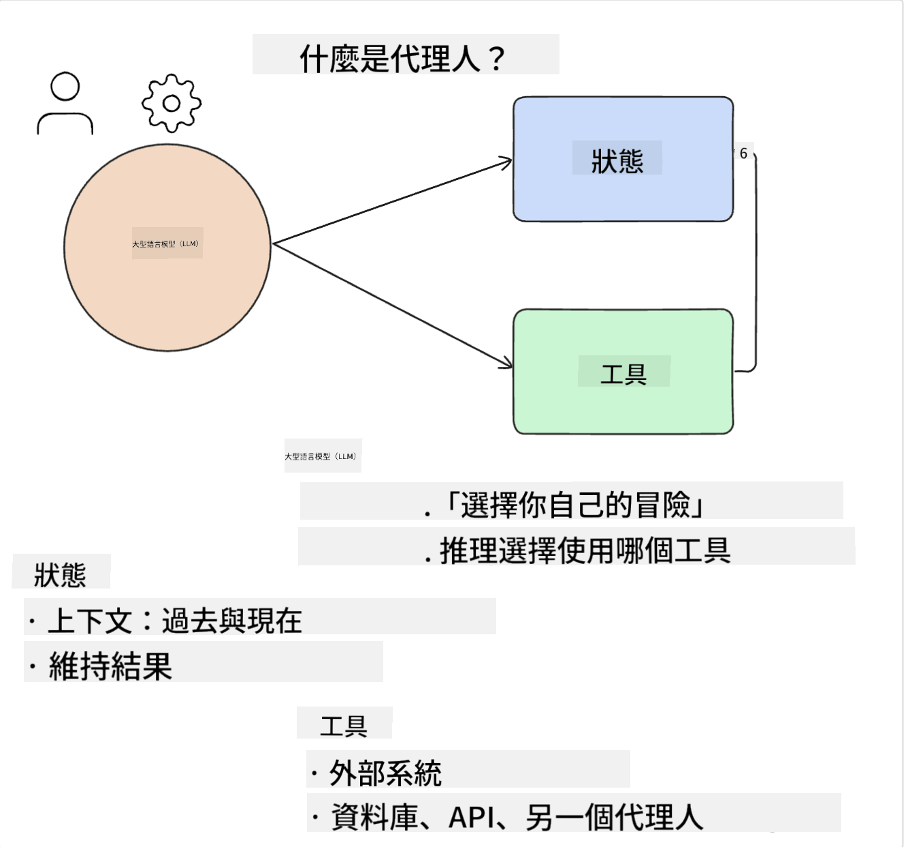
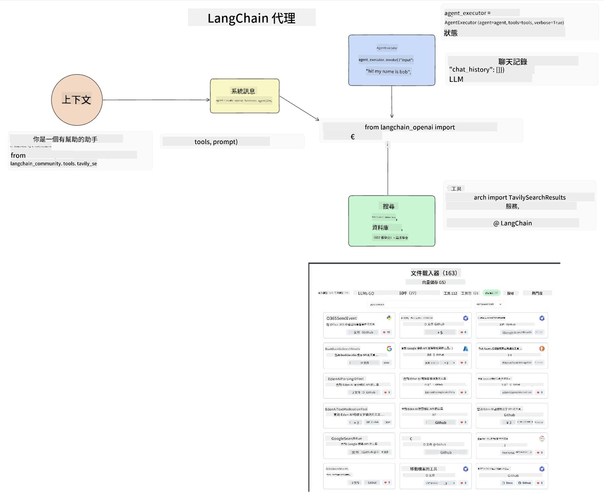
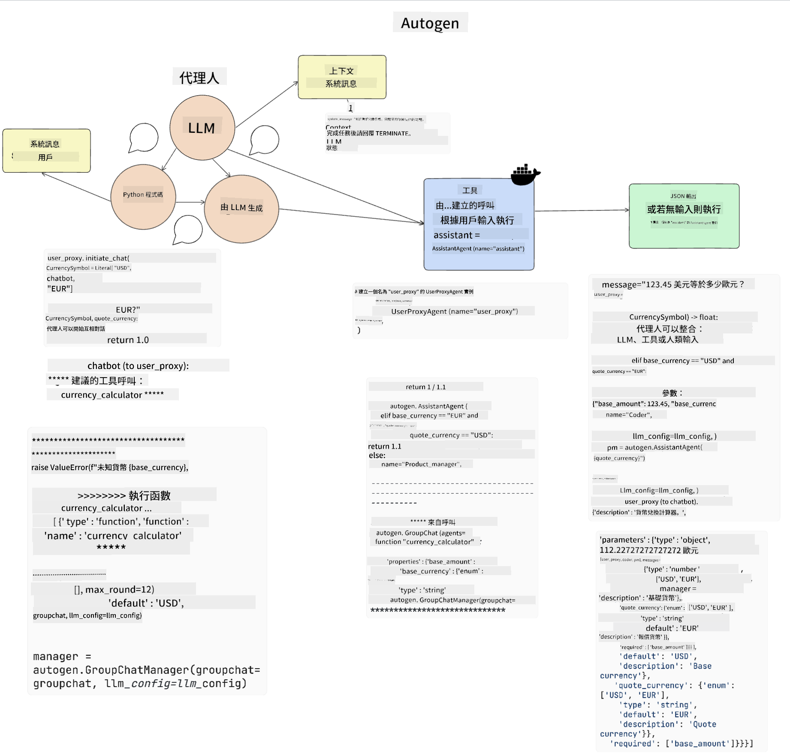
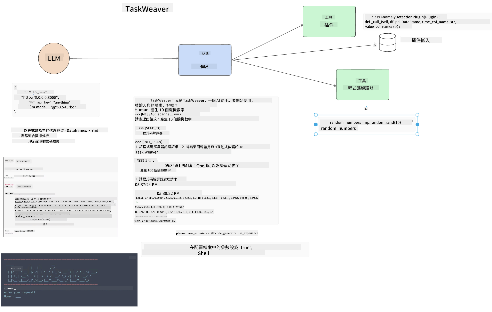
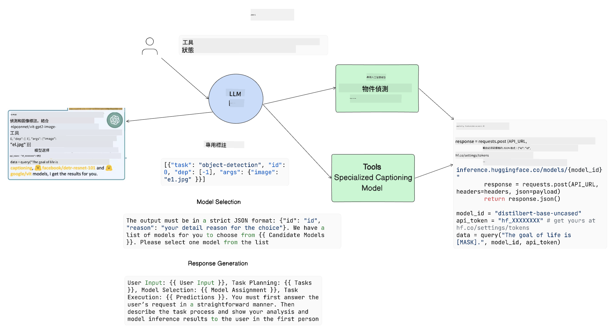

<!--
CO_OP_TRANSLATOR_METADATA:
{
  "original_hash": "11f03c81f190d9cbafd0f977dcbede6c",
  "translation_date": "2025-07-09T17:20:46+00:00",
  "source_file": "17-ai-agents/README.md",
  "language_code": "tw"
}
-->
[](https://aka.ms/gen-ai-lesson17-gh?WT.mc_id=academic-105485-koreyst)

## 介紹

AI Agents 是生成式 AI 領域中令人振奮的發展，讓大型語言模型（LLMs）從助理進化成能夠採取行動的代理人。AI Agent 框架讓開發者能夠打造應用程式，賦予 LLMs 使用工具和狀態管理的能力。這些框架也提升了可視性，讓使用者和開發者能監控 LLMs 計劃的行動，從而改善體驗管理。

本課程將涵蓋以下主題：

- 了解什麼是 AI Agent — AI Agent 究竟是什麼？
- 探索四種不同的 AI Agent 框架 — 它們有何獨特之處？
- 將這些 AI Agents 應用於不同的使用案例 — 什麼時候該使用 AI Agents？

## 學習目標

完成本課程後，你將能夠：

- 解釋什麼是 AI Agents 以及它們的應用方式。
- 了解幾個熱門 AI Agent 框架的差異及其不同之處。
- 理解 AI Agents 的運作原理，進而構建相關應用。

## 什麼是 AI Agents？

AI Agents 是生成式 AI 領域中非常令人興奮的領域。隨著熱度提升，有時也會造成術語和應用上的混淆。為了簡化並涵蓋大多數稱為 AI Agents 的工具，我們將採用以下定義：

AI Agents 讓大型語言模型（LLMs）能夠透過獲取**狀態**和**工具**來執行任務。



讓我們定義這些術語：

**大型語言模型** — 指本課程中提及的模型，如 GPT-3.5、GPT-4、Llama-2 等。

**狀態** — 指 LLM 正在運作的上下文。LLM 利用過去行動的上下文和當前情境，來指導後續行動的決策。AI Agent 框架讓開發者更容易維護這個上下文。

**工具** — 為了完成使用者請求且 LLM 已規劃的任務，LLM 需要使用工具。工具的例子包括資料庫、API、外部應用程式，甚至是另一個 LLM！

這些定義將幫助你在接下來了解它們如何被實作時有良好的基礎。接下來讓我們探索幾個不同的 AI Agent 框架：

## LangChain Agents

[LangChain Agents](https://python.langchain.com/docs/how_to/#agents?WT.mc_id=academic-105485-koreyst) 是上述定義的實作範例。

為了管理**狀態**，它使用一個內建函式 `AgentExecutor`。此函式接受已定義的 `agent` 和可用的 `tools`。

`AgentExecutor` 也會儲存聊天歷史，以提供聊天的上下文。



LangChain 提供一個[工具目錄](https://integrations.langchain.com/tools?WT.mc_id=academic-105485-koreyst)，可以匯入你的應用程式，讓 LLM 獲得存取權。這些工具由社群和 LangChain 團隊共同打造。

你可以定義這些工具並傳遞給 `AgentExecutor`。

在談論 AI Agents 時，可視性也是一個重要面向。應用程式開發者需要了解 LLM 正在使用哪個工具以及原因。為此，LangChain 團隊開發了 LangSmith。

## AutoGen

接下來要介紹的 AI Agent 框架是 [AutoGen](https://microsoft.github.io/autogen/?WT.mc_id=academic-105485-koreyst)。AutoGen 的主要焦點是對話。Agents 既是**可對話的**，也是**可自訂的**。

**可對話的** — LLMs 可以與另一個 LLM 開始並持續對話，以完成任務。這是透過建立 `AssistantAgents` 並給予特定的系統訊息來實現。

```python

autogen.AssistantAgent( name="Coder", llm_config=llm_config, ) pm = autogen.AssistantAgent( name="Product_manager", system_message="Creative in software product ideas.", llm_config=llm_config, )

```

**可自訂的** — Agents 不僅可以定義為 LLM，也可以是使用者或工具。作為開發者，你可以定義一個 `UserProxyAgent`，負責與使用者互動以取得完成任務的回饋。這些回饋可以用來繼續執行任務或停止任務。

```python
user_proxy = UserProxyAgent(name="user_proxy")
```

### 狀態與工具

為了變更和管理狀態，助理 Agent 會產生 Python 程式碼來完成任務。

以下是流程範例：



#### 以系統訊息定義 LLM

```python
system_message="For weather related tasks, only use the functions you have been provided with. Reply TERMINATE when the task is done."
```

此系統訊息指示特定 LLM 哪些函式與其任務相關。記得，使用 AutoGen 你可以定義多個具有不同系統訊息的 AssistantAgents。

#### 聊天由使用者發起

```python
user_proxy.initiate_chat( chatbot, message="I am planning a trip to NYC next week, can you help me pick out what to wear? ", )

```

這則來自 user_proxy（人類）的訊息會啟動 Agent 探索應該執行的可能函式。

#### 函式執行

```bash
chatbot (to user_proxy):

***** Suggested tool Call: get_weather ***** Arguments: {"location":"New York City, NY","time_periond:"7","temperature_unit":"Celsius"} ******************************************************** --------------------------------------------------------------------------------

>>>>>>>> EXECUTING FUNCTION get_weather... user_proxy (to chatbot): ***** Response from calling function "get_weather" ***** 112.22727272727272 EUR ****************************************************************

```

初始聊天處理後，Agent 會送出建議呼叫的工具。在此例中，是名為 `get_weather` 的函式。根據你的設定，此函式可以自動執行並由 Agent 讀取，或根據使用者輸入執行。

你可以參考[AutoGen 程式碼範例](https://microsoft.github.io/autogen/docs/Examples/?WT.mc_id=academic-105485-koreyst)來進一步了解如何開始構建。

## Taskweaver

接下來要探索的代理框架是 [Taskweaver](https://microsoft.github.io/TaskWeaver/?WT.mc_id=academic-105485-koreyst)。它被稱為「以程式碼為先」的代理，因為它不僅處理 `strings`，還能處理 Python 的 DataFrames。這對資料分析和生成任務非常有用，例如製作圖表或產生隨機數字。

### 狀態與工具

TaskWeaver 使用 `Planner` 的概念來管理對話狀態。`Planner` 是一個 LLM，負責接收使用者請求並規劃完成該請求所需的任務。

為了完成任務，`Planner` 可使用稱為 `Plugins` 的工具集合。這些可以是 Python 類別或通用程式碼解譯器。這些插件會以嵌入向量形式儲存，讓 LLM 更容易搜尋正確的插件。



以下是一個用於異常偵測的插件範例：

```python
class AnomalyDetectionPlugin(Plugin): def __call__(self, df: pd.DataFrame, time_col_name: str, value_col_name: str):
```

程式碼會在執行前進行驗證。Taskweaver 管理上下文的另一個功能是 `experience`。Experience 允許將對話上下文長期儲存在 YAML 檔案中。這可設定讓 LLM 隨著接觸過去對話而在特定任務上逐漸進步。

## JARVIS

最後要介紹的代理框架是 [JARVIS](https://github.com/microsoft/JARVIS?tab=readme-ov-file?WT.mc_id=academic-105485-koreyst)。JARVIS 的獨特之處在於它使用 LLM 來管理對話的 `state`，而 `tools` 則是其他 AI 模型。每個 AI 模型都是專門執行特定任務的模型，例如物件偵測、轉錄或圖片說明。



作為通用模型的 LLM 接收使用者請求，識別具體任務及完成任務所需的參數/資料。

```python
[{"task": "object-detection", "id": 0, "dep": [-1], "args": {"image": "e1.jpg" }}]
```

LLM 接著將請求格式化成專門 AI 模型能理解的格式，如 JSON。當 AI 模型根據任務回傳預測結果後，LLM 會接收回應。

若任務需要多個模型協作，LLM 也會解讀這些模型的回應，然後整合產生回覆給使用者。

以下範例展示當使用者請求描述及計算圖片中物件數量時的運作方式：

## 作業

為了持續學習 AI Agents，你可以使用 AutoGen 建立：

- 一個模擬教育新創公司不同部門商務會議的應用程式。
- 建立系統訊息，引導 LLM 理解不同角色和優先事項，並讓使用者推銷新產品構想。
- LLM 接著應該從各部門產生後續問題，以精煉並改進推銷和產品構想。

## 學習不止於此，繼續前行

完成本課程後，請參考我們的[生成式 AI 學習合集](https://aka.ms/genai-collection?WT.mc_id=academic-105485-koreyst)，持續提升你的生成式 AI 知識！

**免責聲明**：  
本文件係使用 AI 翻譯服務 [Co-op Translator](https://github.com/Azure/co-op-translator) 進行翻譯。雖然我們致力於確保翻譯的準確性，但請注意，自動翻譯可能包含錯誤或不準確之處。原始文件的母語版本應視為權威來源。對於重要資訊，建議採用專業人工翻譯。我們不對因使用本翻譯而產生的任何誤解或誤釋負責。