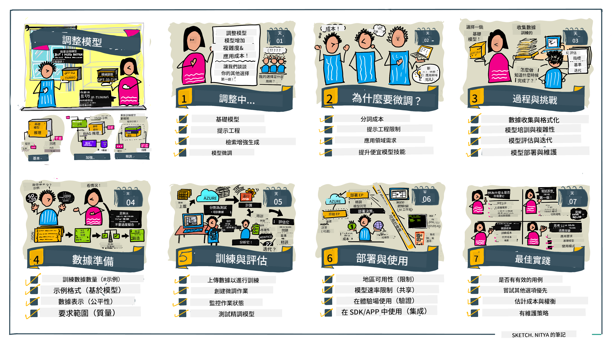

<!--
CO_OP_TRANSLATOR_METADATA:
{
  "original_hash": "68664f7e754a892ae1d8d5e2b7bd2081",
  "translation_date": "2025-05-20T07:39:50+00:00",
  "source_file": "18-fine-tuning/README.md",
  "language_code": "tw"
}
-->

# 微調你的大型語言模型

使用大型語言模型來構建生成式 AI 應用程式會帶來新的挑戰。關鍵問題是確保模型為特定用戶請求生成的內容的回應質量（準確性和相關性）。在之前的課程中，我們討論了像是提示工程和檢索增強生成這樣的技術，這些技術試圖通過_修改現有模型的提示輸入_來解決問題。

在今天的課程中，我們討論第三種技術，**微調**，這種技術試圖通過使用額外數據_重新訓練模型本身_來解決挑戰。讓我們深入了解細節。

## 學習目標

本課程介紹了預訓練語言模型的微調概念，探索了這種方法的優勢和挑戰，並提供了何時以及如何使用微調來提高生成式 AI 模型性能的指導。

在本課結束時，你應該能夠回答以下問題：

- 什麼是語言模型的微調？
- 微調在何時以及為何有用？
- 我如何微調預訓練模型？
- 微調的限制是什麼？

準備好了嗎？讓我們開始吧。

## 圖解指南

想在深入了解之前獲得我們將要討論的內容的全貌嗎？查看這個圖解指南，描述了本課的學習旅程——從學習微調的核心概念和動機，到理解執行微調任務的過程和最佳實踐。這是一個值得探索的迷人話題，因此別忘了查看[資源](./RESOURCES.md?WT.mc_id=academic-105485-koreyst)頁面，獲取支持自學旅程的額外鏈接！

## 什麼是語言模型的微調？

從定義上來說，大型語言模型是從包括互聯網在內的多種來源獲取的大量文本中_預訓練_的。正如我們在之前的課程中所學到的，我們需要像_提示工程_和_檢索增強生成_這樣的技術來提高模型對用戶問題（“提示”）的回應質量。

一種流行的提示工程技術涉及通過提供_指令_（明確指導）或_給予幾個示例_（隱式指導）來給模型更多指導，這被稱為_少樣本學習_，但它有兩個限制：

- 模型的token限制可能會限制你能給出的示例數量，從而限制效果。
- 模型的token成本可能會使每個提示添加示例變得昂貴，並限制靈活性。

微調是機器學習系統中的一種常見做法，我們採用預訓練模型並使用新數據重新訓練它以提高其在特定任務上的性能。在語言模型的上下文中，我們可以使用_針對特定任務或應用領域的精選示例集_來微調預訓練模型，從而創建一個可能對該特定任務或領域更準確和相關的**自定義模型**。微調的一個附帶好處是，它還可以減少少樣本學習所需的示例數量，從而降低token使用和相關成本。

## 什麼時候以及為什麼我們應該微調模型？

在_這個_上下文中，當我們談論微調時，我們指的是**監督式**微調，其中重新訓練是通過**添加新數據**來完成的，這些數據不屬於原始訓練數據集。這與無監督微調方法不同，後者是用原始數據重新訓練模型，但使用不同的超參數。

需要記住的關鍵是微調是一種需要一定專業知識才能獲得所需結果的高級技術。如果操作不當，可能無法提供預期的改進，甚至可能降低模型在目標領域的性能。

所以，在學習“如何”微調語言模型之前，你需要知道“為什麼”你應該走這條路，以及“何時”開始微調過程。從問自己這些問題開始：

- **用例**：你的微調_用例_是什麼？你想改進當前預訓練模型的哪個方面？
- **替代方案**：你是否嘗試過_其他技術_來實現預期結果？使用它們來創建基線以供比較。
  - 提示工程：嘗試使用相關提示回應示例的少樣本提示技術。評估回應的質量。
  - 檢索增強生成：嘗試使用從數據中檢索的查詢結果增強提示。評估回應的質量。
- **成本**：你是否識別了微調的成本？
  - 可調性 - 預訓練模型是否可用於微調？
  - 努力 - 用於準備訓練數據、評估和完善模型的努力。
  - 計算 - 用於運行微調任務和部署微調模型的計算成本
  - 數據 - 獲取足夠質量的示例以產生微調影響
- **收益**：你是否確認了微調的收益？
  - 質量 - 微調模型是否優於基線？
  - 成本 - 是否通過簡化提示來減少token使用？
  - 可擴展性 - 你能否將基礎模型重新用於新領域？

通過回答這些問題，你應該能夠決定微調是否是你的用例的正確方法。理想情況下，只有當收益超過成本時，這種方法才是有效的。一旦你決定繼續，就該考慮_如何_微調預訓練模型。

想獲得更多有關決策過程的見解？觀看[是否微調](https://www.youtube.com/watch?v=0Jo-z-MFxJs)

## 我們如何微調預訓練模型？

要微調預訓練模型，你需要：

- 一個要微調的預訓練模型
- 用於微調的數據集
- 運行微調任務的訓練環境
- 部署微調模型的託管環境

## 微調實踐

以下資源提供逐步教程，通過選定模型和精選數據集的真實示例來指導你。要完成這些教程，你需要在特定提供者上擁有一個帳戶，並獲得相關模型和數據集的訪問權限。

| 提供者       | 教程                                                                                                                                                                            | 描述                                                                                                                                                                                                                                                                                                                                                                                                                                  |
| ------------ | ------------------------------------------------------------------------------------------------------------------------------------------------------------------------------- | ------------------------------------------------------------------------------------------------------------------------------------------------------------------------------------------------------------------------------------------------------------------------------------------------------------------------------------------------------------------------------------------------------------------------------------- |
| OpenAI       | [如何微調聊天模型](https://github.com/openai/openai-cookbook/blob/main/examples/How_to_finetune_chat_models.ipynb?WT.mc_id=academic-105485-koreyst)                              | 學習如何微調`gpt-35-turbo`以適應特定領域（“食譜助手”），通過準備訓練數據、運行微調任務以及使用微調後的模型進行推理。                                                                                                                                                                                                                                                                                                                  |
| Azure OpenAI | [GPT 3.5 Turbo 微調教程](https://learn.microsoft.com/azure/ai-services/openai/tutorials/fine-tune?tabs=python-new%2Ccommand-line?WT.mc_id=academic-105485-koreyst)               | 學習如何在**Azure**上微調`gpt-35-turbo-0613`模型，通過採取步驟創建和上傳訓練數據，運行微調任務。部署並使用新模型。                                                                                                                                                                                                                                                                                                                        |
| Hugging Face | [使用 Hugging Face 微調 LLMs](https://www.philschmid.de/fine-tune-llms-in-2024-with-trl?WT.mc_id=academic-105485-koreyst)                                                       | 這篇博客文章指導你如何使用 [transformers](https://huggingface.co/docs/transformers/index?WT.mc_id=academic-105485-koreyst) 庫和 [Transformer Reinforcement Learning (TRL)](https://huggingface.co/docs/trl/index?WT.mc_id=academic-105485-koreyst]) 以及 Hugging Face 上的開放[數據集](https://huggingface.co/docs/datasets/index?WT.mc_id=academic-105485-koreyst)微調開放 LLM（例如：`CodeLlama 7B`）。 |
|              |                                                                                                                                                                                 |                                                                                                                                                                                                                                                                                                                                                                                                                                       |
| 🤗 AutoTrain | [使用 AutoTrain 微調 LLMs](https://github.com/huggingface/autotrain-advanced/?WT.mc_id=academic-105485-koreyst)                                                                  | AutoTrain（或 AutoTrain Advanced）是 Hugging Face 開發的 python 庫，允許針對許多不同任務進行微調，包括 LLM 微調。AutoTrain 是一個無代碼解決方案，可以在自己的雲端、Hugging Face Spaces 或本地進行微調。它支持基於網頁的 GUI、CLI 和通過 yaml 配置文件進行的訓練。                                                                                                                                                 |
|              |                                                                                                                                                                                 |                                                                                                                                                                                                                                                                                                                                                                                                                                       |

## 作業

選擇上述教程之一並完成它們。我們可能會在本庫中複製這些教程的版本以供參考。請直接使用原始來源以獲取最新版本。

## 做得好！繼續學習。

完成本課後，查看我們的[生成式 AI 學習集合](https://aka.ms/genai-collection?WT.mc_id=academic-105485-koreyst)，繼續提升你的生成式 AI 知識！

恭喜！！你已完成本課程 v2 系列的最後一課！不要停止學習和構建。**查看[資源](RESOURCES.md?WT.mc_id=academic-105485-koreyst)頁面，獲取有關此主題的其他建議列表。

我們的 v1 系列課程也已更新了更多的作業和概念。所以花點時間刷新你的知識——並請[分享你的問題和反饋](https://github.com/microsoft/generative-ai-for-beginners/issues?WT.mc_id=academic-105485-koreyst)，以幫助我們為社區改進這些課程。

**免責聲明**：
本文件使用AI翻譯服務[Co-op Translator](https://github.com/Azure/co-op-translator)進行翻譯。我們努力確保翻譯的準確性，但請注意，自動翻譯可能包含錯誤或不準確之處。應以原語言的文件作為權威來源。對於關鍵信息，建議進行專業人工翻譯。我們對因使用此翻譯而引起的任何誤解或錯誤解釋不承擔責任。