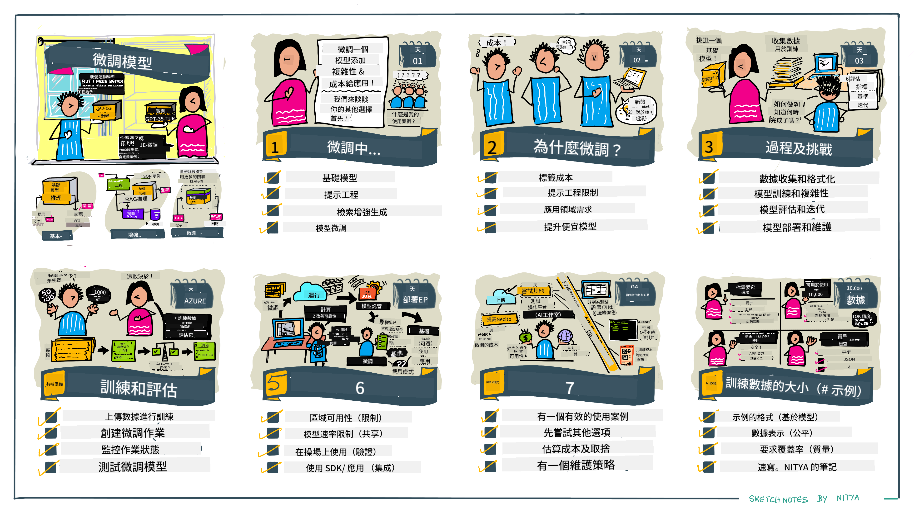

<!--
CO_OP_TRANSLATOR_METADATA:
{
  "original_hash": "68664f7e754a892ae1d8d5e2b7bd2081",
  "translation_date": "2025-06-26T00:34:12+00:00",
  "source_file": "18-fine-tuning/README.md",
  "language_code": "tw"
}
-->

# 微調你的大型語言模型

使用大型語言模型來建立生成式 AI 應用程式會帶來新的挑戰。關鍵問題是確保模型為給定的用戶請求生成的內容的回應質量（準確性和相關性）。在之前的課程中，我們討論了像提示工程和檢索增強生成這樣的技術，試圖通過_修改現有模型的提示輸入_來解決問題。

在今天的課程中，我們將討論第三種技術，**微調**，它試圖通過_用額外的數據重新訓練模型本身_來解決這一挑戰。讓我們深入了解細節。

## 學習目標

本課介紹了預訓練語言模型的微調概念，探討了這種方法的優勢和挑戰，並提供了何時以及如何使用微調來提高生成式 AI 模型性能的指導。

在本課結束時，你應該能夠回答以下問題：

- 語言模型的微調是什麼？
- 微調何時以及為何有用？
- 我如何微調一個預訓練的模型？
- 微調的局限性是什麼？

準備好了嗎？讓我們開始吧。

## 圖解指南

想在深入之前了解我們將涵蓋的內容的全貌嗎？查看這個圖解指南，描述了本課的學習過程——從學習微調的核心概念和動機，到理解執行微調任務的過程和最佳實踐。這是一個探索的迷人話題，所以不要忘記查看[資源](./RESOURCES.md?WT.mc_id=academic-105485-koreyst)頁面，獲得支持你自學之旅的更多鏈接！

## 語言模型的微調是什麼？

根據定義，大型語言模型是從包括互聯網在內的多種來源獲取的大量文本中_預訓練_的。正如我們在之前的課程中所學，我們需要像_提示工程_和_檢索增強生成_這樣的技術來提高模型對用戶問題（“提示”）的回應質量。

一種流行的提示工程技術是通過提供_指令_（明確指導）或_給出一些例子_（隱含指導）來給模型更多的指導，這被稱為_少樣本學習_，但它有兩個限制：

- 模型的標記限制可能會限制你能提供的例子數量，並限制效果。
- 模型的標記成本可能會使為每個提示添加例子變得昂貴，並限制靈活性。

微調是機器學習系統中的一種常見做法，我們採用一個預訓練的模型，並用新的數據重新訓練它，以提高其在特定任務上的性能。在語言模型的背景下，我們可以用_為給定任務或應用領域精選的一組例子_來微調預訓練模型，以創建一個**自定義模型**，可能在該特定任務或領域中更準確和相關。微調的一個附帶好處是，它還可以減少少樣本學習所需的例子數量——從而減少標記使用和相關成本。

## 我們何時以及為什麼應該微調模型？

在_這個_背景下，當我們談論微調時，我們指的是**監督式**微調，其中重新訓練是通過**添加新數據**來完成的，這些數據不屬於原始訓練數據集。這與無監督微調方法不同，後者是在原始數據上重新訓練模型，但使用不同的超參數。

需要記住的關鍵是，微調是一種高級技術，需要一定程度的專業知識才能獲得預期的結果。如果操作不當，它可能不會提供預期的改進，甚至可能降低模型在你目標領域的性能。

因此，在學習“如何”微調語言模型之前，你需要知道“為什麼”應該採取這條路徑，以及“何時”開始微調過程。首先問自己這些問題：

- **用例**：你的微調_用例_是什麼？你希望改進當前預訓練模型的哪個方面？
- **替代方案**：你是否嘗試過_其他技術_來達到預期的結果？使用它們來創建比較的基準。
  - 提示工程：嘗試使用相關提示回應的例子進行少樣本提示技術。評估回應質量。
  - 檢索增強生成：嘗試用從數據中檢索的查詢結果增強提示。評估回應質量。
- **成本**：你是否確定了微調的成本？
  - 可調性——預訓練模型是否可以進行微調？
  - 努力——準備訓練數據、評估和改進模型的努力。
  - 計算——運行微調作業和部署微調模型的計算成本。
  - 數據——獲得足夠質量的例子來影響微調效果。
- **收益**：你是否確認了微調的收益？
  - 質量——微調模型是否優於基準？
  - 成本——通過簡化提示是否減少了標記使用？
  - 可擴展性——你能否將基礎模型重新用於新領域？

通過回答這些問題，你應該能夠決定微調是否適合你的用例。理想情況下，只有當收益超過成本時，這種方法才是有效的。一旦你決定繼續，就該考慮_如何_微調預訓練模型。

想獲得更多關於決策過程的見解嗎？觀看[是否微調](https://www.youtube.com/watch?v=0Jo-z-MFxJs)

## 我們如何微調一個預訓練的模型？

要微調一個預訓練的模型，你需要：

- 一個需要微調的預訓練模型
- 一個用於微調的數據集
- 一個運行微調作業的訓練環境
- 一個部署微調模型的託管環境

## 微調實踐

以下資源提供了逐步教程，帶你完成使用精選數據集的特定模型的真實示例。要完成這些教程，你需要在特定提供商處擁有一個帳戶，並獲得相關模型和數據集的訪問權限。

| 提供者       | 教程                                                                                                                                                                           | 描述                                                                                                                                                                                                                                                                                                                                                                                                                               |
| ------------ | ---------------------------------------------------------------------------------------------------------------------------------------------------------------------------- | ---------------------------------------------------------------------------------------------------------------------------------------------------------------------------------------------------------------------------------------------------------------------------------------------------------------------------------------------------------------------------------------------------------------------------------- |
| OpenAI       | [如何微調聊天模型](https://github.com/openai/openai-cookbook/blob/main/examples/How_to_finetune_chat_models.ipynb?WT.mc_id=academic-105485-koreyst)                          | 學習如何微調一個`gpt-35-turbo`以適應特定領域（“食譜助手”），包括準備訓練數據、運行微調作業以及使用微調後的模型進行推理。                                                                                                                                                                                                                                                                                                               |
| Azure OpenAI | [GPT 3.5 Turbo 微調教程](https://learn.microsoft.com/azure/ai-services/openai/tutorials/fine-tune?tabs=python-new%2Ccommand-line?WT.mc_id=academic-105485-koreyst)            | 學習如何在**Azure**上微調一個`gpt-35-turbo-0613`模型，通過創建和上傳訓練數據、運行微調作業，部署並使用新模型。                                                                                                                                                                                                                                                                                                                          |
| Hugging Face | [使用 Hugging Face 微調 LLM](https://www.philschmid.de/fine-tune-llms-in-2024-with-trl?WT.mc_id=academic-105485-koreyst)                                                     | 本博客文章帶你微調一個_開放 LLM_（例如：`CodeLlama 7B`），使用[transformers](https://huggingface.co/docs/transformers/index?WT.mc_id=academic-105485-koreyst)庫和[Transformer Reinforcement Learning (TRL)](https://huggingface.co/docs/trl/index?WT.mc_id=academic-105485-koreyst])，在 Hugging Face 上使用開放[數據集](https://huggingface.co/docs/datasets/index?WT.mc_id=academic-105485-koreyst)。                                      |
|              |                                                                                                                                                                              |                                                                                                                                                                                                                                                                                                                                                                                                                                    |
| 🤗 AutoTrain | [使用 AutoTrain 微調 LLM](https://github.com/huggingface/autotrain-advanced/?WT.mc_id=academic-105485-koreyst)                                                               | AutoTrain（或 AutoTrain Advanced）是由 Hugging Face 開發的 Python 庫，允許對包括 LLM 微調在內的多種任務進行微調。AutoTrain 是一種無代碼解決方案，可以在自己的雲、Hugging Face Spaces 或本地進行微調。它支持基於網頁的 GUI、CLI 和通過 yaml 配置文件進行訓練。                                                                                                                                                    |
|              |                                                                                                                                                                              |                                                                                                                                                                                                                                                                                                                                                                                                                                    |

## 作業

選擇上面的一個教程並完成它們。我們可能會在本資料庫中複製這些教程的 Jupyter Notebooks 版本僅供參考。請直接使用原始來源以獲取最新版本。

## 幹得好！繼續你的學習。

完成本課後，查看我們的[生成式 AI 學習合集](https://aka.ms/genai-collection?WT.mc_id=academic-105485-koreyst)以繼續提升你的生成式 AI 知識！

恭喜你！！你已經完成了本課程 v2 系列的最後一課！不要停止學習和構建。**查看[資源](RESOURCES.md?WT.mc_id=academic-105485-koreyst)頁面，獲取僅針對該主題的更多建議。

我們的 v1 系列課程也已更新了更多的作業和概念。花點時間刷新你的知識——並請[分享你的問題和反饋](https://github.com/microsoft/generative-ai-for-beginners/issues?WT.mc_id=academic-105485-koreyst)，以幫助我們改進這些課程以服務社群。

**免責聲明**：  
本文檔使用 AI 翻譯服務 [Co-op Translator](https://github.com/Azure/co-op-translator) 進行翻譯。我們努力確保準確性，但請注意，自動翻譯可能包含錯誤或不準確之處。應將原文檔視為權威來源。對於關鍵信息，建議使用專業人工翻譯。我們對因使用此翻譯而引起的任何誤解或誤釋不承擔責任。