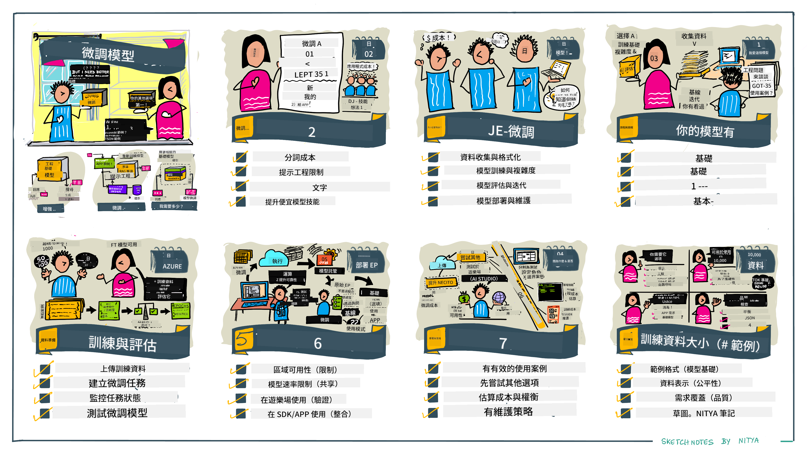

<!--
CO_OP_TRANSLATOR_METADATA:
{
  "original_hash": "807f0d9fc1747e796433534e1be6a98a",
  "translation_date": "2025-10-17T23:45:29+00:00",
  "source_file": "18-fine-tuning/README.md",
  "language_code": "tw"
}
-->

# 微調您的大型語言模型 (LLM)

使用大型語言模型來構建生成式 AI 應用程式會面臨一些新的挑戰。一個關鍵問題是如何確保模型生成的內容在回應使用者請求時的質量（準確性和相關性）。在之前的課程中，我們討論了像提示工程和檢索增強生成這樣的技術，這些技術試圖通過**修改現有模型的提示輸入**來解決這個問題。

在今天的課程中，我們將討論第三種技術，**微調**，它試圖通過**重新訓練模型本身**並添加額外的數據來解決這一挑戰。讓我們深入了解細節。

## 學習目標

本課程介紹了微調預訓練語言模型的概念，探討了這種方法的優勢和挑戰，並提供了何時以及如何使用微調來提高生成式 AI 模型性能的指導。

完成本課程後，您應該能回答以下問題：

- 什麼是語言模型的微調？
- 什麼時候以及為什麼微調是有用的？
- 我如何微調一個預訓練模型？
- 微調的局限性是什麼？

準備好了嗎？讓我們開始吧。

## 圖解指南

想在深入學習之前了解我們將涵蓋的內容的大致概況嗎？查看這份圖解指南，它描述了本課程的學習旅程——從學習微調的核心概念和動機，到理解執行微調任務的過程和最佳實踐。這是一個值得探索的有趣主題，別忘了查看[資源](./RESOURCES.md?WT.mc_id=academic-105485-koreyst)頁面，獲取支持您自主學習旅程的額外連結！

## 什麼是語言模型的微調？

根據定義，大型語言模型是基於從多種來源（包括互聯網）獲取的大量文本進行**預訓練**的。正如我們在之前的課程中所學，我們需要像**提示工程**和**檢索增強生成**這樣的技術來提高模型對使用者問題（“提示”）的回應質量。

一種流行的提示工程技術是通過提供**指令**（明確指導）或**提供一些範例**（隱含指導）來給模型更多的指導，告訴它回應中需要什麼。這被稱為**少樣本學習**，但它有兩個局限性：

- 模型的 token 限制可能會限制您能提供的範例數量，從而影響效果。
- 模型的 token 成本可能會使每次提示添加範例變得昂貴，並限制靈活性。

微調是機器學習系統中的一種常見做法，我們可以通過重新訓練預訓練模型並添加新數據來提高其在特定任務上的性能。在語言模型的背景下，我們可以通過**為特定任務或應用領域準備一組範例**來微調預訓練模型，從而創建一個**自訂模型**，使其在該特定任務或領域上更準確和相關。微調的一個附加好處是，它還可以減少少樣本學習所需的範例數量——降低 token 使用量和相關成本。

## 什麼時候以及為什麼需要微調模型？

在**這個**背景下，當我們談論微調時，我們指的是**監督式**微調，其中通過添加原始訓練數據集中未包含的新數據來進行重新訓練。這與非監督式微調方法不同，後者是在原始數據上重新訓練模型，但使用不同的超參數。

需要記住的關鍵是，微調是一種需要一定專業知識才能獲得預期結果的高級技術。如果操作不當，可能無法提供預期的改進，甚至可能降低模型在目標領域的性能。

因此，在學習“如何”微調語言模型之前，您需要知道“為什麼”要採取這種方法，以及“什麼時候”開始微調過程。首先問自己以下問題：

- **使用案例**：您的微調**使用案例**是什麼？您希望改進當前預訓練模型的哪個方面？
- **替代方案**：您是否嘗試過**其他技術**來實現所需結果？使用它們來創建基準進行比較。
  - 提示工程：嘗試少樣本提示技術，提供相關提示回應的範例。評估回應質量。
  - 檢索增強生成：嘗試通過搜索您的數據來增強提示並檢索結果。評估回應質量。
- **成本**：您是否已經確定了微調的成本？
  - 可調性——預訓練模型是否可進行微調？
  - 努力——準備訓練數據、評估和改進模型所需的工作量。
  - 計算——運行微調任務和部署微調模型所需的計算資源。
  - 數據——是否有足夠的高質量範例來影響微調效果。
- **效益**：您是否確認了微調的效益？
  - 質量——微調後的模型是否超越了基準？
  - 成本——是否通過簡化提示降低了 token 使用量？
  - 可擴展性——是否可以將基礎模型重新用於新領域？

通過回答這些問題，您應該能夠判斷微調是否適合您的使用案例。理想情況下，只有當效益超過成本時，這種方法才是有效的。一旦您決定採取行動，就可以開始思考**如何**微調預訓練模型。

想了解更多關於決策過程的見解？觀看[是否需要進行微調](https://www.youtube.com/watch?v=0Jo-z-MFxJs)

## 我們如何微調預訓練模型？

要微調預訓練模型，您需要具備：

- 一個可進行微調的預訓練模型
- 用於微調的數據集
- 運行微調任務的訓練環境
- 部署微調模型的託管環境

## 微調實踐

以下資源提供了逐步教程，通過選定模型和精心準備的數據集，帶您完成一個真實的示例。要完成這些教程，您需要在特定提供商處擁有帳戶，並獲得相關模型和數據集的訪問權限。

| 提供商       | 教程                                                                                                                                                                       | 描述                                                                                                                                                                                                                                                                                                                                                                                                                        |
| ------------ | -------------------------------------------------------------------------------------------------------------------------------------------------------------------------- | ---------------------------------------------------------------------------------------------------------------------------------------------------------------------------------------------------------------------------------------------------------------------------------------------------------------------------------------------------------------------------------------------------------------------------------- |
| OpenAI       | [如何微調聊天模型](https://github.com/openai/openai-cookbook/blob/main/examples/How_to_finetune_chat_models.ipynb?WT.mc_id=academic-105485-koreyst)                | 學習如何微調 `gpt-35-turbo` 用於特定領域（例如“食譜助手”），包括準備訓練數據、運行微調任務以及使用微調後的模型進行推理。                                                                                                                                                                                                                                              |
| Azure OpenAI | [GPT 3.5 Turbo 微調教程](https://learn.microsoft.com/azure/ai-services/openai/tutorials/fine-tune?tabs=python-new%2Ccommand-line?WT.mc_id=academic-105485-koreyst) | 學習如何在 **Azure** 上微調 `gpt-35-turbo-0613` 模型，包括創建和上傳訓練數據、運行微調任務、部署和使用新模型。                                                                                                                                                                                                                                                                 |
| Hugging Face | [使用 Hugging Face 微調 LLM](https://www.philschmid.de/fine-tune-llms-in-2024-with-trl?WT.mc_id=academic-105485-koreyst)                                               | 這篇博客文章帶您微調一個**開源 LLM**（例如 `CodeLlama 7B`），使用 [transformers](https://huggingface.co/docs/transformers/index?WT.mc_id=academic-105485-koreyst) 庫和 [Transformer Reinforcement Learning (TRL)](https://huggingface.co/docs/trl/index?WT.mc_id=academic-105485-koreyst])，以及 Hugging Face 上的開源 [datasets](https://huggingface.co/docs/datasets/index?WT.mc_id=academic-105485-koreyst)。 |
|              |                                                                                                                                                                                |                                                                                                                                                                                                                                                                                                                                                                                                                                    |
| 🤗 AutoTrain | [使用 AutoTrain 微調 LLM](https://github.com/huggingface/autotrain-advanced/?WT.mc_id=academic-105485-koreyst)                                                         | AutoTrain（或 AutoTrain Advanced）是由 Hugging Face 開發的一個 Python 庫，支持包括 LLM 微調在內的多種任務的微調。AutoTrain 是一個無需編碼的解決方案，微調可以在您自己的雲端、Hugging Face Spaces 或本地完成。它支持基於網頁的 GUI、CLI 和通過 yaml 配置文件進行的訓練。                                                                               |
|              |                                                                                                                                                                                |                                                                                                                                                                                                                                                                                                                                                                                                                                    |

## 作業

選擇上述教程之一並完成學習。**我們可能會在此存儲庫的 Jupyter Notebook 中複製這些教程的版本僅供參考。請直接使用原始資源以獲取最新版本**。

## 幹得好！繼續學習。

完成本課程後，查看我們的[生成式 AI 學習集合](https://aka.ms/genai-collection?WT.mc_id=academic-105485-koreyst)，繼續提升您的生成式 AI 知識！

恭喜您！您已完成本課程 v2 系列的最後一課！不要停止學習和構建。**查看[資源](RESOURCES.md?WT.mc_id=academic-105485-koreyst)頁面，獲取更多關於此主題的建議列表。**

我們的 v1 系列課程也已更新，增加了更多作業和概念。花點時間刷新您的知識——並請[分享您的問題和反饋](https://github.com/microsoft/generative-ai-for-beginners/issues?WT.mc_id=academic-105485-koreyst)，幫助我們改進這些課程，造福社群。

---

**免責聲明**：  
本文件已使用 AI 翻譯服務 [Co-op Translator](https://github.com/Azure/co-op-translator) 進行翻譯。儘管我們努力確保翻譯的準確性，但請注意，機器翻譯可能包含錯誤或不準確之處。原始文件的母語版本應被視為權威來源。對於關鍵信息，建議使用專業人工翻譯。我們對因使用此翻譯而引起的任何誤解或誤釋不承擔責任。