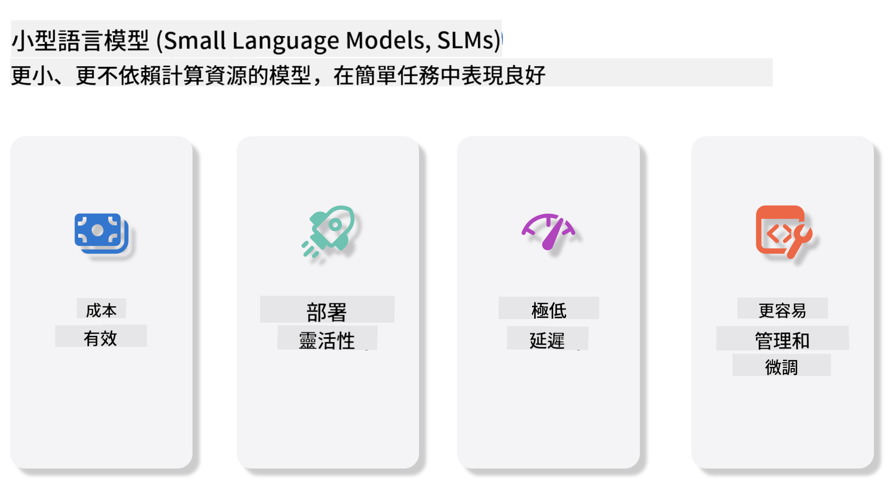
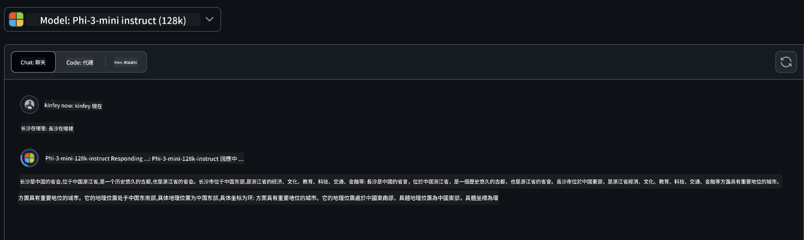
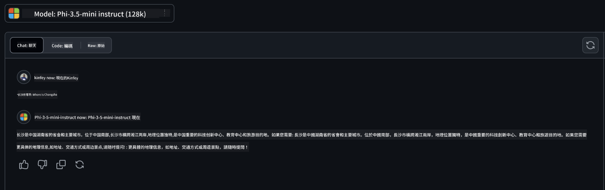

<!--
CO_OP_TRANSLATOR_METADATA:
{
  "original_hash": "124ad36cfe96f74038811b6e2bb93e9d",
  "translation_date": "2025-05-20T09:18:53+00:00",
  "source_file": "19-slm/README.md",
  "language_code": "tw"
}
-->
# 簡介：初學者的生成式AI小型語言模型

生成式AI是一個令人著迷的人工智慧領域，專注於創建能夠生成新內容的系統。這些內容可以從文本和圖像到音樂，甚至是整個虛擬環境。生成式AI最令人興奮的應用之一是在語言模型的領域。

## 什麼是小型語言模型？

小型語言模型（SLM）是大型語言模型（LLM）的縮小版本，利用LLM的許多架構原則和技術，同時顯示出顯著減少的計算佔用。SLM是設計用來生成類人文本的語言模型子集。與它們更大的對應物（如GPT-4）不同，SLM更緊湊和高效，適合於計算資源有限的應用。儘管它們的尺寸較小，但它們仍然可以執行各種任務。通常，SLM是通過壓縮或蒸餾LLM構建的，旨在保留原始模型功能和語言能力的大部分。這種模型尺寸的減少降低了整體複雜性，使SLM在內存使用和計算需求方面更高效。儘管有這些優化，SLM仍然可以執行廣泛的自然語言處理（NLP）任務：
- 文本生成：創建連貫且上下文相關的句子或段落。
- 文本完成：根據給定提示預測和完成句子。
- 翻譯：將文本從一種語言轉換為另一種語言。
- 摘要：將長篇文本濃縮為更短、更易消化的摘要。

儘管與它們更大的對應物相比在性能或理解深度上有所妥協。

## 小型語言模型如何運作？

SLM是在大量文本數據上訓練的。在訓練過程中，它們學習語言的模式和結構，使它們能夠生成語法正確且上下文適當的文本。訓練過程包括：
- 數據收集：從各種來源收集大量文本數據。
- 預處理：清理和組織數據以適合訓練。
- 訓練：使用機器學習算法教模型理解和生成文本。
- 微調：調整模型以提高其在特定任務上的性能。

SLM的開發與在資源受限環境（如移動設備或邊緣計算平台）中部署模型的日益增長的需求相一致，這些環境中，由於資源需求過大，完整的LLM可能不切實際。通過專注於效率，SLM在性能和可訪問性之間取得平衡，使其在各個領域的應用更為廣泛。



## 學習目標

在本課程中，我們希望介紹SLM的知識，並將其與Microsoft Phi-3結合，以學習文本內容、視覺和MoE的不同場景。到本課程結束時，您應該能夠回答以下問題：
- 什麼是SLM
- SLM和LLM的區別是什麼
- 什麼是Microsoft Phi-3/3.5系列
- 如何推斷Microsoft Phi-3/3.5系列

準備好了嗎？讓我們開始吧。

## 大型語言模型（LLM）和小型語言模型（SLM）之間的區別

LLM和SLM都建立在概率機器學習的基本原則上，在其架構設計、訓練方法、數據生成過程和模型評估技術上採用類似的方法。然而，有幾個關鍵因素區分了這兩種類型的模型。

## 小型語言模型的應用

SLM有廣泛的應用，包括：
- 聊天機器人：以對話方式提供客戶支持並與用戶互動。
- 內容創建：通過生成想法甚至撰寫整篇文章來協助作家。
- 教育：幫助學生完成寫作作業或學習新語言。
- 可訪問性：創建為殘障人士設計的工具，如文本轉語音系統。

**規模**

LLM和SLM之間的主要區別在於模型的規模。LLM，如ChatGPT（GPT-4），可以包含估計1.76萬億參數，而開源SLM如Mistral 7B的設計參數數量要少得多——大約7億。這種差異主要是由於模型架構和訓練過程的不同。例如，ChatGPT在編碼器-解碼器框架中使用自注意力機制，而Mistral 7B使用滑動窗口注意力，這使得在僅解碼器模型中更高效的訓練成為可能。這種架構差異對這些模型的複雜性和性能有深遠影響。

**理解**

SLM通常針對特定領域的性能進行優化，使其高度專業化，但在提供跨多個知識領域的廣泛上下文理解方面可能受到限制。相比之下，LLM旨在在更全面的層面上模擬類人智能。LLM在大量多樣化的數據集上進行訓練，旨在在各個領域中表現良好，提供更大的多功能性和適應性。因此，LLM更適合於更廣泛的下游任務，如自然語言處理和編程。

**計算**

LLM的訓練和部署是資源密集型過程，通常需要大量的計算基礎設施，包括大規模GPU集群。例如，從頭開始訓練像ChatGPT這樣的模型可能需要數千個GPU的長時間使用。相比之下，SLM，由於其較小的參數數量，在計算資源方面更易於訪問。像Mistral 7B這樣的模型可以在配備中等GPU能力的本地機器上進行訓練和運行，儘管訓練仍需要多個GPU的幾個小時。

**偏見**

偏見是LLM中已知的問題，主要是由於訓練數據的性質。這些模型通常依賴於來自互聯網的原始公開數據，這可能會低估或誤代表某些群體，引入錯誤的標籤，或反映受方言、地理變化和語法規則影響的語言偏見。此外，LLM架構的複雜性可能會無意中加劇偏見，若不經過仔細的微調，這些偏見可能會被忽視。另一方面，由於SLM是在更受限、特定領域的數據集上訓練的，它們本質上對這些偏見的敏感性較低，儘管它們並非完全免疫。

**推理**

SLM的減小尺寸使其在推理速度方面具有顯著優勢，允許它們在本地硬件上高效地生成輸出，而不需要廣泛的並行處理。相比之下，由於其尺寸和複雜性，LLM通常需要大量的並行計算資源以實現可接受的推理時間。多個並發用戶的存在進一步減慢了LLM的響應時間，尤其是在大規模部署時。

總之，儘管LLM和SLM在機器學習的基礎上有共同的基礎，但它們在模型尺寸、資源需求、上下文理解、偏見敏感性和推理速度方面有顯著差異。這些區別反映了它們各自對不同用例的適用性，LLM更具多功能性但資源密集，而SLM則在降低計算需求的情況下提供更具領域特定的效率。

***注意：在本章中，我們將以Microsoft Phi-3 / 3.5為例介紹SLM。***

## 介紹Phi-3 / Phi-3.5系列

Phi-3 / 3.5系列主要針對文本、視覺和Agent（MoE）應用場景：

### Phi-3 / 3.5 Instruct

主要用於文本生成、聊天完成和內容信息提取等。

**Phi-3-mini**

3.8B語言模型可在Microsoft Azure AI Studio、Hugging Face和Ollama上獲得。Phi-3模型在關鍵基準上顯著超越相同和更大尺寸的語言模型（見下方基準數字，數字越高越好）。Phi-3-mini超越了尺寸是其兩倍的模型，而Phi-3-small和Phi-3-medium超越了更大的模型，包括GPT-3.5。

**Phi-3-small & medium**

Phi-3-small僅有7B參數，在各種語言、推理、編碼和數學基準上擊敗了GPT-3.5T。擁有14B參數的Phi-3-medium延續了這一趨勢，超越了Gemini 1.0 Pro。

**Phi-3.5-mini**

我們可以將其視為Phi-3-mini的升級版。雖然參數保持不變，但它提高了支持多語言的能力（支持20多種語言：阿拉伯語、中文、捷克語、丹麥語、荷蘭語、英語、芬蘭語、法語、德語、希伯來語、匈牙利語、意大利語、日語、韓語、挪威語、波蘭語、葡萄牙語、俄語、西班牙語、瑞典語、泰語、土耳其語、烏克蘭語）並增加了對長上下文的更強支持。Phi-3.5-mini擁有3.8B參數，超越了相同尺寸的語言模型，並與尺寸是其兩倍的模型相媲美。

### Phi-3 / 3.5 Vision

我們可以將Phi-3/3.5的Instruct模型視為Phi的理解能力，而Vision則賦予Phi理解世界的眼睛。

**Phi-3-Vision**

Phi-3-vision僅有4.2B參數，在一般視覺推理任務、OCR和表格和圖表理解任務上超越了更大的模型，如Claude-3 Haiku和Gemini 1.0 Pro V。

**Phi-3.5-Vision**

Phi-3.5-Vision也是Phi-3-Vision的升級版，增加了對多張圖像的支持。你可以將其視為視覺的改進，不僅可以看到圖片，還可以看到視頻。Phi-3.5-vision在OCR、表格和圖表理解任務上超越了更大的模型，如Claude-3.5 Sonnet和Gemini 1.5 Flash，並在一般視覺知識推理任務上相當。支持多幀輸入，即對多個輸入圖像進行推理。

### Phi-3.5-MoE

***專家混合（MoE）***使模型可以在預訓練時使用更少的計算，這意味著你可以在與密集模型相同的計算預算下大幅擴展模型或數據集大小。特別是，MoE模型應該能夠在預訓練過程中更快地達到與其密集對應物相同的質量。Phi-3.5-MoE由16個3.8B專家模塊組成。Phi-3.5-MoE僅用6.6B活躍參數實現了與更大模型相似的推理、語言理解和數學水平。

我們可以根據不同場景使用Phi-3/3.5系列模型。與LLM不同，你可以在邊緣設備上部署Phi-3/3.5-mini或Phi-3/3.5-Vision。

## 如何使用Phi-3/3.5系列模型

我們希望在不同場景中使用Phi-3/3.5。接下來，我們將基於不同場景使用Phi-3/3.5。


### 推理差異

雲端API

**GitHub模型**

GitHub
模型是最直接的方式。您可以通过 GitHub Models 快速访问 Phi-3/3.5-Instruct 模型。结合 Azure AI Inference SDK / OpenAI SDK，您可以通过代码访问 API 完成 Phi-3/3.5-Instruct 调用。您还可以通过 Playground 测试不同效果。

- 示例：Phi-3-mini 和 Phi-3.5-mini 在中文场景中的效果比较  

**Azure AI Studio**

或者如果我们想使用视觉和 MoE 模型，可以使用 Azure AI Studio 完成调用。如果您感兴趣，可以阅读 Phi-3 Cookbook 了解如何通过 Azure AI Studio 调用 Phi-3/3.5 Instruct、Vision、MoE [点击此链接](https://github.com/microsoft/Phi-3CookBook/blob/main/md/02.QuickStart/AzureAIStudio_QuickStart.md?WT.mc_id=academic-105485-koreyst)

**NVIDIA NIM**

除了 Azure 和 GitHub 提供的基于云的模型目录解决方案，您还可以使用 [Nivida NIM](https://developer.nvidia.com/nim?WT.mc_id=academic-105485-koreyst) 完成相关调用。您可以访问 NIVIDA NIM 完成 Phi-3/3.5 家族的 API 调用。NVIDIA NIM（NVIDIA Inference Microservices）是一组加速推理微服务，旨在帮助开发人员在各种环境中高效部署 AI 模型，包括云、数据中心和工作站。以下是 NVIDIA NIM 的一些关键功能：

- **部署简便性：** NIM 允许通过单个命令部署 AI 模型，使其易于集成到现有工作流程中。
- **优化性能：** 它利用 NVIDIA 预优化的推理引擎，如 TensorRT 和 TensorRT-LLM，确保低延迟和高吞吐量。
- **可扩展性：** NIM 支持 Kubernetes 上的自动扩展，使其能够有效处理不同的工作负载。
- **安全性和控制：** 组织可以通过在自己的托管基础设施上自托管 NIM 微服务来维护对其数据和应用程序的控制。
- **标准 API：** NIM 提供行业标准的 API，使其易于构建和集成 AI 应用程序，如聊天机器人、AI 助手等。

NIM 是 NVIDIA AI Enterprise 的一部分，旨在简化 AI 模型的部署和运营化，确保它们在 NVIDIA GPU 上高效运行。

- 示例：使用 Nividia NIM 调用 Phi-3.5-Vision-API [[点击此链接](../../../19-slm/python/Phi-3-Vision-Nividia-NIM.ipynb)]

### 本地环境中推理 Phi-3/3.5

与 Phi-3 或任何语言模型（如 GPT-3）相关的推理，指的是根据接收到的输入生成响应或预测的过程。当您向 Phi-3 提供提示或问题时，它使用其训练的神经网络通过分析其训练数据中的模式和关系来推断最可能和最相关的响应。

**Hugging Face Transformer**

Hugging Face Transformers 是一个为自然语言处理（NLP）和其他机器学习任务设计的强大库。以下是一些关于它的关键点：

1. **预训练模型：** 它提供数千个可用于各种任务的预训练模型，如文本分类、命名实体识别、问答、摘要、翻译和文本生成。
2. **框架互操作性：** 该库支持多个深度学习框架，包括 PyTorch、TensorFlow 和 JAX。这允许您在一个框架中训练模型并在另一个框架中使用它。
3. **多模态能力：** 除了 NLP，Hugging Face Transformers 还支持计算机视觉（如图像分类、目标检测）和音频处理（如语音识别、音频分类）任务。
4. **易于使用：** 该库提供 API 和工具来轻松下载和微调模型，使其对初学者和专家都易于访问。
5. **社区和资源：** Hugging Face 拥有一个活跃的社区和广泛的文档、教程和指南，帮助用户入门并充分利用该库。

[官方文档](https://huggingface.co/docs/transformers/index?WT.mc_id=academic-105485-koreyst) 或他们的 [GitHub 仓库](https://github.com/huggingface/transformers?WT.mc_id=academic-105485-koreyst)。

这是最常用的方法，但它也需要 GPU 加速。毕竟，视觉和 MoE 等场景需要大量计算，如果不进行量化，在 CPU 上将非常有限。

- 示例：使用 Transformer 调用 Phi-3.5-Instuct [点击此链接](../../../19-slm/python/phi35-instruct-demo.ipynb)
- 示例：使用 Transformer 调用 Phi-3.5-Vision[点击此链接](../../../19-slm/python/phi35-vision-demo.ipynb)
- 示例：使用 Transformer 调用 Phi-3.5-MoE[点击此链接](../../../19-slm/python/phi35_moe_demo.ipynb)

**Ollama**

[Ollama](https://ollama.com/?WT.mc_id=academic-105485-koreyst) 是一个旨在让大型语言模型（LLMs）在本地机器上更易运行的平台。它支持多种模型，如 Llama 3.1、Phi 3、Mistral 和 Gemma 2 等。该平台通过将模型权重、配置和数据打包成一个包，简化了过程，使用户更容易定制和创建自己的模型。Ollama 可用于 macOS、Linux 和 Windows。如果您希望在不依赖云服务的情况下实验或部署 LLMs，这是一个很好的工具。Ollama 是最直接的方法，您只需执行以下语句。

```bash

ollama run phi3.5

```

**ONNX Runtime for GenAI**

[ONNX Runtime](https://github.com/microsoft/onnxruntime-genai?WT.mc_id=academic-105485-koreyst) 是一个跨平台的推理和训练机器学习加速器。ONNX Runtime for Generative AI (GENAI) 是一个强大的工具，帮助您在各种平台上高效运行生成 AI 模型。

## 什么是 ONNX Runtime?

ONNX Runtime 是一个开源项目，支持 ONNX 格式的机器学习模型的高性能推理。它支持来自深度学习框架（如 PyTorch 和 TensorFlow/Keras）以及经典机器学习库（如 scikit-learn、LightGBM、XGBoost 等）的模型。ONNX Runtime 兼容不同的硬件、驱动和操作系统，并通过在适用的情况下利用硬件加速器以及图形优化和转换提供最佳性能。

## 什么是生成 AI？

生成 AI 指的是能够根据其训练数据生成新内容（如文本、图像或音乐）的 AI 系统。示例包括语言模型（如 GPT-3）和图像生成模型（如 Stable Diffusion）。ONNX Runtime for GenAI 库为 ONNX 模型提供生成 AI 循环，包括使用 ONNX Runtime 进行推理、logits 处理、搜索和采样，以及 KV 缓存管理。

## ONNX Runtime for GENAI

ONNX Runtime for GENAI 扩展了 ONNX Runtime 的功能，以支持生成 AI 模型。以下是一些关键功能：

- **广泛的平台支持：** 它适用于各种平台，包括 Windows、Linux、macOS、Android 和 iOS。
- **模型支持：** 它支持许多流行的生成 AI 模型，如 LLaMA、GPT-Neo、BLOOM 等。
- **性能优化：** 它包括对不同硬件加速器（如 NVIDIA GPU、AMD GPU 等）的优化。
- **易于使用：** 它提供 API 以便于集成到应用程序中，允许您使用最少的代码生成文本、图像和其他内容。

用户可以调用高级 generate() 方法，或在循环中运行模型的每次迭代，一次生成一个标记，并可选择在循环内更新生成参数。ONNX runtime 还支持贪婪/束搜索和 TopP、TopK 采样以生成标记序列，并内置 logits 处理，如重复惩罚。您还可以轻松添加自定义评分。

## 入门

要开始使用 ONNX Runtime for GENAI，您可以按照以下步骤进行：

### 安装 ONNX Runtime:

```Python
pip install onnxruntime
```

### 安装生成 AI 扩展:

```Python
pip install onnxruntime-genai
```

### 运行模型:

这里是一个简单的 Python 示例：

```Python
import onnxruntime_genai as og

model = og.Model('path_to_your_model.onnx')

tokenizer = og.Tokenizer(model)

input_text = "Hello, how are you?"

input_tokens = tokenizer.encode(input_text)

output_tokens = model.generate(input_tokens)

output_text = tokenizer.decode(output_tokens)

print(output_text) 
```

### 示例：使用 ONNX Runtime GenAI 调用 Phi-3.5-Vision

```python

import onnxruntime_genai as og

model_path = './Your Phi-3.5-vision-instruct ONNX Path'

img_path = './Your Image Path'

model = og.Model(model_path)

processor = model.create_multimodal_processor()

tokenizer_stream = processor.create_stream()

text = "Your Prompt"

prompt = "<|user|>\n"

prompt += "<|image_1|>\n"

prompt += f"{text}<|end|>\n"

prompt += "<|assistant|>\n"

image = og.Images.open(img_path)

inputs = processor(prompt, images=image)

params = og.GeneratorParams(model)

params.set_inputs(inputs)

params.set_search_options(max_length=3072)

generator = og.Generator(model, params)

while not generator.is_done():

    generator.compute_logits()
    
    generator.generate_next_token()

    new_token = generator.get_next_tokens()[0]
    
    code += tokenizer_stream.decode(new_token)
    
    print(tokenizer_stream.decode(new_token), end='', flush=True)

```

**其他**

除了 ONNX Runtime 和 Ollama 参考方法，我们还可以根据不同厂商提供的模型参考方法完成定量模型的参考。例如 Apple MLX 框架与 Apple Metal、Qualcomm QNN 与 NPU、Intel OpenVINO 与 CPU/GPU 等。您还可以从 [Phi-3 Cookbook](https://github.com/microsoft/phi-3cookbook?WT.mc_id=academic-105485-koreyst) 获取更多内容。

## 更多

我们已经了解了 Phi-3/3.5 家族的基础知识，但要了解更多关于 SLM 的信息，我们需要更多的知识。您可以在 Phi-3 Cookbook 中找到答案。如果您想了解更多，请访问 [Phi-3 Cookbook](https://github.com/microsoft/phi-3cookbook?WT.mc_id=academic-105485-koreyst)。

**免責聲明**：

本文件使用AI翻譯服務[Co-op Translator](https://github.com/Azure/co-op-translator)進行翻譯。我們力求準確，但請注意，自動翻譯可能包含錯誤或不準確之處。應以原語言的原始文件作為權威來源。對於關鍵信息，建議進行專業人工翻譯。對於因使用此翻譯而產生的任何誤解或誤讀，我們不承擔責任。