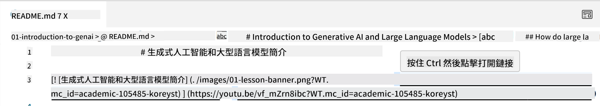
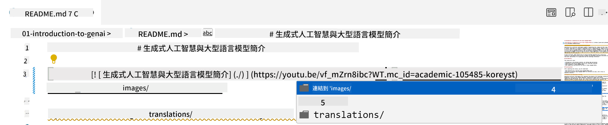
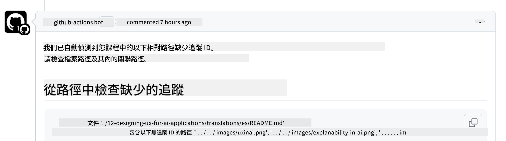
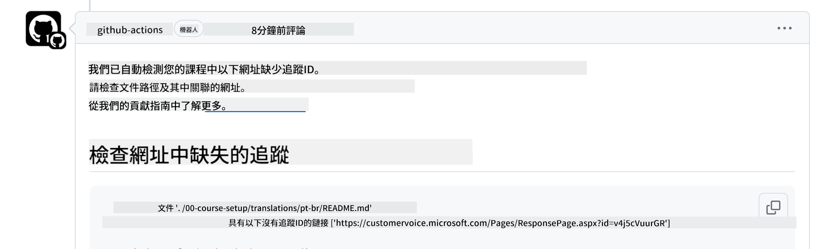

<!--
CO_OP_TRANSLATOR_METADATA:
{
  "original_hash": "57c41f2af71001a2cff9d8eb797cb843",
  "translation_date": "2025-05-19T08:41:44+00:00",
  "source_file": "CONTRIBUTING.md",
  "language_code": "tw"
}
-->
# 貢獻

此專案歡迎貢獻和建議。大多數的貢獻需要您同意貢獻者授權協議 (CLA)，聲明您擁有權利並實際授予我們使用您貢獻的權利。詳情請訪問<https://cla.microsoft.com>。

> 重要：在翻譯此 repo 中的文本時，請確保不使用機器翻譯。我們將通過社群驗證翻譯，因此請僅在您精通的語言中自願翻譯。

當您提交拉取請求時，CLA 機器人會自動判斷您是否需要提供 CLA 並適當地標記 PR（例如，標籤、評論）。只需按照機器人提供的指示操作即可。您只需在所有使用我們 CLA 的存儲庫中執行一次。

## 行為準則

此專案採用了[Microsoft 開源行為準則](https://opensource.microsoft.com/codeofconduct/?WT.mc_id=academic-105485-koreyst)。更多資訊請閱讀[行為準則 FAQ](https://opensource.microsoft.com/codeofconduct/faq/?WT.mc_id=academic-105485-koreyst)或聯絡 [opencode@microsoft.com](mailto:opencode@microsoft.com) 提出任何額外的問題或評論。

## 有問題或疑慮？

請不要在 GitHub 上開啟一般支持問題的 issue，因為 GitHub 列表應用於功能請求和錯誤報告。這樣我們可以更容易地追蹤實際的問題或錯誤，並將一般討論與實際代碼分開。

## 錯字、問題、錯誤和貢獻

每當您提交任何更改到 Generative AI for Beginners 存儲庫時，請遵循以下建議。

* 在進行修改之前，請始終將存儲庫 fork 到您自己的帳戶
* 不要將多個更改合併到一個拉取請求中。例如，請使用單獨的 PR 提交任何錯誤修正和文件更新
* 如果您的拉取請求顯示合併衝突，請確保更新您的本地 main 以反映主存儲庫中的內容，然後再進行修改
* 如果您提交翻譯，請為所有翻譯的文件創建一個 PR，因為我們不接受內容的部分翻譯
* 如果您提交錯字或文件修正，可以在合適的情況下將修改合併到單個 PR

## 撰寫的一般指導

- 確保所有的 URL 用方括號包裹，後面跟著括號，括號內外沒有多餘的空格 ``。
- 確保任何相對鏈接（即指向存儲庫中其他文件和文件夾的鏈接）以 `./` 開頭，指向當前工作目錄中的文件或文件夾，或以 `../` 開頭，指向父工作目錄中的文件或文件夾。
- 確保任何相對鏈接（即指向存儲庫中其他文件和文件夾的鏈接）在末尾有追蹤 ID（即 `?` 或 `&`，然後是 `wt.mc_id=` 或 `WT.mc_id=`）。
- 確保以下域名的任何 URL _github.com, microsoft.com, visualstudio.com, aka.ms, 和 azure.com_ 在末尾有追蹤 ID（即 `?` 或 `&`，然後是 `wt.mc_id=` 或 `WT.mc_id=`）。
- 確保您的鏈接中沒有國家特定的語言區域（即 `/en-us/` 或 `/en/`）。
- 確保所有圖片都存儲在 `./images` 文件夾中。
- 確保圖片使用英文字符、數字和連字命名。

## GitHub 工作流程

當您提交拉取請求時，將觸發四個不同的工作流程以驗證之前的規則。
只需按照此處列出的指示操作即可通過工作流程檢查。

- [檢查損壞的相對路徑](../..)
- [檢查路徑是否有追蹤](../..)
- [檢查 URL 是否有追蹤](../..)
- [檢查 URL 沒有區域](../..)

### 檢查損壞的相對路徑

此工作流程確保您文件中的任何相對路徑都能正常工作。
此存儲庫部署到 GitHub 頁面，因此在輸入將所有內容連接在一起的鏈接時需要非常小心，以免將任何人引導到錯誤的地方。

要確保您的鏈接正常工作，只需使用 VS code 檢查即可。

例如，當您將滑鼠懸停在文件中的任何鏈接上時，系統會提示您按 **ctrl + click** 來跟隨鏈接。

如果您點擊鏈接並且本地不工作，那麼它肯定會觸發工作流程並且不會在 GitHub 上工作。

要解決此問題，請嘗試在 VS code 的幫助下輸入鏈接。

當您輸入 `./` 或 `../` 時，VS code 會提示您根據輸入選擇可用選項。

通過點擊所需的文件或文件夾來跟隨路徑，您將確保您的路徑沒有損壞。

一旦添加正確的相對路徑，保存並推送您的更改，工作流程將再次觸發以驗證您的更改。
如果您通過檢查，那麼您就可以繼續。

### 檢查路徑是否有追蹤

此工作流程確保任何相對路徑都有追蹤。
此存儲庫部署到 GitHub 頁面，因此我們需要追蹤不同文件和文件夾之間的移動。

要確保您的相對路徑中有追蹤，只需檢查以下文字 `?wt.mc_id=` 在路徑末尾。
如果它被附加到您的相對路徑，您就能通過此檢查。

如果沒有，您可能會收到以下錯誤。

要解決此問題，請嘗試打開工作流程突出顯示的文件路徑並在相對路徑末尾添加追蹤 ID。

一旦您添加了追蹤 ID，保存並推送您的更改，工作流程將再次觸發以驗證您的更改。
如果您通過檢查，那麼您就可以繼續。

### 檢查 URL 是否有追蹤

此工作流程確保任何網絡 URL 都有追蹤。
此存儲庫對所有人開放，因此您需要確保追蹤訪問以了解流量來自何處。

要確保您的 URL 中有追蹤，只需檢查以下文字 `?wt.mc_id=` 在 URL 末尾。
如果它被附加到您的 URL，您就能通過此檢查。

如果沒有，您可能會收到以下錯誤。

要解決此問題，請嘗試打開工作流程突出顯示的文件路徑並在 URL 末尾添加追蹤 ID。

一旦您添加了追蹤 ID，保存並推送您的更改，工作流程將再次觸發以驗證您的更改。
如果您通過檢查，那麼您就可以繼續。

### 檢查 URL 沒有區域

此工作流程確保任何網絡 URL 中沒有國家特定的區域。
此存儲庫對全球的每個人都開放，因此您需要確保不要在 URL 中包含您國家的區域。

要確保您的 URL 中沒有國家區域，只需檢查以下文字 `/en-us/` 或 `/en/` 或 URL 中的任何其他語言區域。
如果它不存在於您的 URL 中，那麼您就能通過此檢查。

如果沒有，您可能會收到以下錯誤。

要解決此問題，請嘗試打開工作流程突出顯示的文件路徑並從 URL 中移除國家區域。

一旦您移除了國家區域，保存並推送您的更改，工作流程將再次觸發以驗證您的更改。
如果您通過檢查，那麼您就可以繼續。

恭喜！我們將盡快回饋您的貢獻意見。

**免責聲明**：
本文檔使用 AI 翻譯服務 [Co-op Translator](https://github.com/Azure/co-op-translator) 進行翻譯。儘管我們努力確保準確性，但請注意自動翻譯可能包含錯誤或不準確之處。應將原始語言的文件視為權威來源。對於重要信息，建議尋求專業人工翻譯。我們對使用此翻譯可能引起的任何誤解或誤釋不承擔責任。