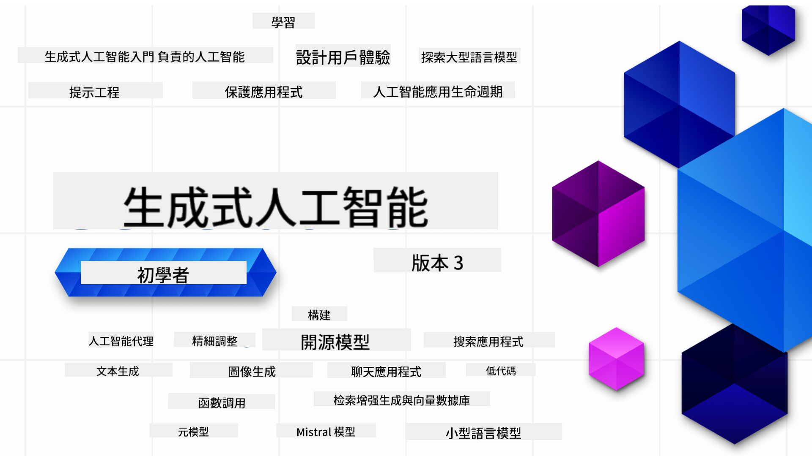

<!--
CO_OP_TRANSLATOR_METADATA:
{
  "original_hash": "c2ee25895ebbfa1a52868bb6eab686fc",
  "translation_date": "2025-05-19T10:54:51+00:00",
  "source_file": "README.md",
  "language_code": "tw"
}
-->

### 21堂課教你從零開始建立生成式 AI 應用程式

### 🌐 多語言支援

#### 透過 GitHub Action 支援（自動更新且始終保持最新）
[法文](../fr/README.md) | [西班牙文](../es/README.md) | [德文](../de/README.md) | [俄文](../ru/README.md) | [阿拉伯文](../ar/README.md) | [波斯文（法爾西文）](../fa/README.md) | [烏爾都文](../ur/README.md) | [中文（簡體）](../zh/README.md) | [中文（繁體，澳門）](../mo/README.md) | [中文（繁體，香港）](../hk/README.md) | [中文（繁體，台灣）](./README.md) | [日文](../ja/README.md) | [韓文](../ko/README.md) | [印地文](../hi/README.md) | [孟加拉文](../bn/README.md) | [馬拉地文](../mr/README.md) | [尼泊爾文](../ne/README.md) | [旁遮普文（古魯穆奇文）](../pa/README.md) | [葡萄牙文（葡萄牙）](../pt/README.md) | [葡萄牙文（巴西）](../br/README.md) | [意大利文](../it/README.md) | [波蘭文](../pl/README.md) | [土耳其文](../tr/README.md) | [希臘文](../el/README.md) | [泰文](../th/README.md) | [瑞典文](../sv/README.md) | [丹麥文](../da/README.md) | [挪威文](../no/README.md) | [芬蘭文](../fi/README.md) | [荷蘭文](../nl/README.md) | [希伯來文](../he/README.md) | [越南文](../vi/README.md) | [印尼文](../id/README.md) | [馬來文](../ms/README.md) | [塔加洛文（菲律賓文）](../tl/README.md) | [斯瓦希里文](../sw/README.md) | [匈牙利文](../hu/README.md) | [捷克文](../cs/README.md) | [斯洛伐克文](../sk/README.md) | [羅馬尼亞文](../ro/README.md) | [保加利亞文](../bg/README.md) | [塞爾維亞文（西里爾文）](../sr/README.md) | [克羅地亞文](../hr/README.md) | [斯洛維尼亞文](../sl/README.md)
# 初學者的生成式 AI (版本 3) - 一門課程

透過 Microsoft Cloud Advocates 的 21 課完整課程，學習建立生成式 AI 應用的基本原理。

## 🌱 開始

這門課程共有 21 課。每課都有自己的主題，因此您可以從任何地方開始學習！

課程標記為「學習」課程，解釋生成式 AI 的概念；或「建構」課程，解釋概念並提供 **Python** 和 **TypeScript** 的程式碼範例（若可能）。

.NET 開發者請查看 [初學者的生成式 AI (.NET Edition)](https://github.com/microsoft/Generative-AI-for-beginners-dotnet?WT.mc_id=academic-105485-koreyst)!

每課還包括「持續學習」部分，提供額外的學習工具。

## 您需要什麼
### 要執行本課程的程式碼，您可以使用：
 - [Azure OpenAI Service](https://aka.ms/genai-beginners/azure-open-ai?WT.mc_id=academic-105485-koreyst) - **課程:** "aoai-assignment"
 - [GitHub Marketplace Model Catalog](https://aka.ms/genai-beginners/gh-models?WT.mc_id=academic-105485-koreyst) - **課程:** "githubmodels"
 - [OpenAI API](https://aka.ms/genai-beginners/open-ai?WT.mc_id=academic-105485-koreyst) - **課程:** "oai-assignment" 
   
- 基本的 Python 或 TypeScript 知識是有幫助的 - \*絕對初學者請查看這些 [Python](https://aka.ms/genai-beginners/python?WT.mc_id=academic-105485-koreyst) 和 [TypeScript](https://aka.ms/genai-beginners/typescript?WT.mc_id=academic-105485-koreyst) 課程
- 一個 GitHub 帳戶以 [fork 整個 repo](https://aka.ms/genai-beginners/github?WT.mc_id=academic-105485-koreyst) 到您自己的 GitHub 帳戶

我們創建了一個 **[課程設置](./00-course-setup/README.md?WT.mc_id=academic-105485-koreyst)** 課程，幫助您設置開發環境。

別忘了 [star (🌟) 這個 repo](https://docs.github.com/en/get-started/exploring-projects-on-github/saving-repositories-with-stars?WT.mc_id=academic-105485-koreyst) 以便以後更容易找到它。

## 🧠 準備部署？

如果您正在尋找更高級的程式碼範例，請查看我們的 [生成式 AI 程式碼範例集](https://aka.ms/genai-beg-code?WT.mc_id=academic-105485-koreyst)，包括 **Python** 和 **TypeScript**。

## 🗣️ 與其他學習者交流，獲得支持

加入我們的 [官方 Azure AI Foundry Discord 伺服器](https://aka.ms/genai-discord?WT.mc_id=academic-105485-koreyst)，結識並與其他正在參加這門課程的學習者交流，獲得支持。

在我們的 [Azure AI Foundry Developer Forum](https://aka.ms/azureaifoundry/forum) 上提出問題或分享產品反饋。

## 🚀 建立新創公司？

註冊 [Microsoft for Startups Founders Hub](https://aka.ms/genai-foundershub?WT.mc_id=academic-105485-koreyst)，獲得 **免費的 OpenAI 點數** 和高達 **$150k 的 Azure 點數，以透過 Azure OpenAI Services 存取 OpenAI 模型**。

## 🙏 想幫忙？

您有建議或發現拼寫或程式碼錯誤嗎？[提出問題](https://github.com/microsoft/generative-ai-for-beginners/issues?WT.mc_id=academic-105485-koreyst) 或 [創建 pull request](https://github.com/microsoft/generative-ai-for-beginners/pulls?WT.mc_id=academic-105485-koreyst)

## 📂 每課包括：

- 主題的簡短影片介紹
- 位於 README 中的書面課程
- 支援 Azure OpenAI 和 OpenAI API 的 Python 和 TypeScript 程式碼範例
- 連結到額外的資源以繼續您的學習

## 🗃️ 課程

| #   | **課程連結**                                                                                                                              | **描述**                                                                                 | **影片**                                                                   | **額外學習**                                                             |
| --- | -------------------------------------------------------------------------------------------------------------------------------------------- | ----------------------------------------------------------------------------------------------- | --------------------------------------------------------------------------- | ------------------------------------------------------------------------------ |
| 00  | [課程設置](./00-course-setup/README.md?WT.mc_id=academic-105485-koreyst)                                                                 | **學習:** 如何設置您的開發環境                                            | 影片即將推出                                                                 | [了解更多](https://aka.ms/genai-collection?WT.mc_id=academic-105485-koreyst) |
| 01  | [生成式 AI 和 LLMs 介紹](./01-introduction-to-genai/README.md?WT.mc_id=academic-105485-koreyst)                              | **學習:** 了解生成式 AI 是什麼以及大型語言模型 (LLMs) 如何運作       | [影片](https://aka.ms/gen-ai-lesson-1-gh?WT.mc_id=academic-105485-koreyst) | [了解更多](https://aka.ms/genai-collection?WT.mc_id=academic-105485-koreyst) |
| 02  | [探索和比較不同的 LLMs](./02-exploring-and-comparing-different-llms/README.md?WT.mc_id=academic-105485-koreyst)             | **學習:** 如何選擇適合您使用情境的模型                                      | [影片](https://aka.ms/gen-ai-lesson2-gh?WT.mc_id=academic-105485-koreyst)  | [了解更多](https://aka.ms/genai-collection?WT.mc_id=academic-105485-koreyst) |
| 03  | [負責任地使用生成式 AI](./03-using-generative-ai-responsibly/README.md?WT.mc_id=academic-105485-koreyst)                           | **學習:** 如何負責任地建立生成式 AI 應用                                  | [影片](https://aka.ms/gen-ai-lesson3-gh?WT.mc_id=academic-105485-koreyst)  | [了解更多](https://aka.ms/genai-collection?WT.mc_id=academic-105485-koreyst) |
| 04  | [了解提示工程基本原理](./04-prompt-engineering-fundamentals/README.md?WT.mc_id=academic-105485-koreyst)             | **學習:** 實作提示工程最佳實踐                                           | [影片](https://aka.ms/gen-ai-lesson4-gh?WT.mc_id=academic-105485-koreyst)  | [了解更多](https://aka.ms/genai-collection?WT.mc_id=academic-105485-koreyst) |
| 05  | [創建高級提示](./05-advanced-prompts/README.md?WT.mc_id=academic-105485-koreyst)                                                | **學習：** 如何應用提示工程技術來改善提示的結果。 | [影片](https://aka.ms/gen-ai-lesson5-gh?WT.mc_id=academic-105485-koreyst)  | [了解更多](https://aka.ms/genai-collection?WT.mc_id=academic-105485-koreyst) |
| 06  | [構建文本生成應用](./06-text-generation-apps/README.md?WT.mc_id=academic-105485-koreyst)                                | **構建：** 使用 Azure OpenAI / OpenAI API 創建文本生成應用                                | [影片](https://aka.ms/gen-ai-lesson6-gh?WT.mc_id=academic-105485-koreyst)  | [了解更多](https://aka.ms/genai-collection?WT.mc_id=academic-105485-koreyst) |
| 07  | [構建聊天應用](./07-building-chat-applications/README.md?WT.mc_id=academic-105485-koreyst)                                     | **構建：** 高效構建和整合聊天應用的技術。               | [影片](https://aka.ms/gen-ai-lessons7-gh?WT.mc_id=academic-105485-koreyst) | [了解更多](https://aka.ms/genai-collection?WT.mc_id=academic-105485-koreyst) |
| 08  | [構建搜索應用向量數據庫](./08-building-search-applications/README.md?WT.mc_id=academic-105485-koreyst)                        | **構建：** 使用嵌入技術進行數據搜索的應用。                        | [影片](https://aka.ms/gen-ai-lesson8-gh?WT.mc_id=academic-105485-koreyst)  | [了解更多](https://aka.ms/genai-collection?WT.mc_id=academic-105485-koreyst) |
| 09  | [構建圖像生成應用](./09-building-image-applications/README.md?WT.mc_id=academic-105485-koreyst)                        | **構建：** 圖像生成應用                                                       | [影片](https://aka.ms/gen-ai-lesson9-gh?WT.mc_id=academic-105485-koreyst)  | [了解更多](https://aka.ms/genai-collection?WT.mc_id=academic-105485-koreyst) |
| 10  | [構建低代碼 AI 應用](./10-building-low-code-ai-applications/README.md?WT.mc_id=academic-105485-koreyst)                       | **構建：** 使用低代碼工具創建生成式 AI 應用                                     | [影片](https://aka.ms/gen-ai-lesson10-gh?WT.mc_id=academic-105485-koreyst) | [了解更多](https://aka.ms/genai-collection?WT.mc_id=academic-105485-koreyst) |
| 11  | [通過函數調用整合外部應用](./11-integrating-with-function-calling/README.md?WT.mc_id=academic-105485-koreyst) | **構建：** 了解函數調用及其在應用中的使用案例                          | [影片](https://aka.ms/gen-ai-lesson11-gh?WT.mc_id=academic-105485-koreyst) | [了解更多](https://aka.ms/genai-collection?WT.mc_id=academic-105485-koreyst) |
| 12  | [為 AI 應用設計 UX](./12-designing-ux-for-ai-applications/README.md?WT.mc_id=academic-105485-koreyst)                         | **學習：** 如何在開發生成式 AI 應用時應用 UX 設計原則         | [影片](https://aka.ms/gen-ai-lesson12-gh?WT.mc_id=academic-105485-koreyst) | [了解更多](https://aka.ms/genai-collection?WT.mc_id=academic-105485-koreyst) |
| 13  | [保護您的生成式 AI 應用](./13-securing-ai-applications/README.md?WT.mc_id=academic-105485-koreyst)                         | **學習：** AI 系統面臨的威脅和風險及其保護方法。             | [影片](https://aka.ms/gen-ai-lesson13-gh?WT.mc_id=academic-105485-koreyst) | [了解更多](https://aka.ms/genai-collection?WT.mc_id=academic-105485-koreyst) |
| 14  | [生成式 AI 應用生命周期](./14-the-generative-ai-application-lifecycle/README.md?WT.mc_id=academic-105485-koreyst)           | **學習：** 管理 LLM 生命周期和 LLMOps 的工具和指標                         | [影片](https://aka.ms/gen-ai-lesson14-gh?WT.mc_id=academic-105485-koreyst) | [了解更多](https://aka.ms/genai-collection?WT.mc_id=academic-105485-koreyst) |
| 15  | [檢索增強生成 (RAG) 和向量數據庫](./15-rag-and-vector-databases/README.md?WT.mc_id=academic-105485-koreyst)        | **構建：** 使用 RAG 框架從向量數據庫中檢索嵌入的應用程序  | [影片](https://aka.ms/gen-ai-lesson15-gh?WT.mc_id=academic-105485-koreyst) | [了解更多](https://aka.ms/genai-collection?WT.mc_id=academic-105485-koreyst) |
| 16  | [開源模型和 Hugging Face](./16-open-source-models/README.md?WT.mc_id=academic-105485-koreyst)                                    | **構建：** 使用 Hugging Face 上可用的開源模型的應用程序                    | [影片](https://aka.ms/gen-ai-lesson16-gh?WT.mc_id=academic-105485-koreyst) | [了解更多](https://aka.ms/genai-collection?WT.mc_id=academic-105485-koreyst) |
| 17  | [AI 代理](./17-ai-agents/README.md?WT.mc_id=academic-105485-koreyst)                                                                       | **構建：** 使用 AI 代理框架的應用程序                                           | [影片](https://aka.ms/gen-ai-lesson17-gh?WT.mc_id=academic-105485-koreyst) | [了解更多](https://aka.ms/genai-collection?WT.mc_id=academic-105485-koreyst) |
| 18  | [微調 LLMs](./18-fine-tuning/README.md?WT.mc_id=academic-105485-koreyst)                                                              | **學習：** 微調 LLMs 的內容、原因和方法                                            | [影片](https://aka.ms/gen-ai-lesson18-gh?WT.mc_id=academic-105485-koreyst) | [了解更多](https://aka.ms/genai-collection?WT.mc_id=academic-105485-koreyst) |
| 19  | [使用 SLMs 構建](./19-slm/README.md?WT.mc_id=academic-105485-koreyst)                                                              | **學習：** 使用小型語言模型構建的優勢                                            | 影片即將推出 | [了解更多](https://aka.ms/genai-collection?WT.mc_id=academic-105485-koreyst) |
| 20  | [使用 Mistral 模型構建](./20-mistral/README.md?WT.mc_id=academic-105485-koreyst)                                                              | **學習：** Mistral 家族模型的特點和差異                                           | 影片即將推出 | [了解更多](https://aka.ms/genai-collection?WT.mc_id=academic-105485-koreyst) |
| 21  | [使用 Meta 模型構建](./21-meta/README.md?WT.mc_id=academic-105485-koreyst)                                                              | **學習：** Meta 家族模型的特點和差異                                           | 影片即將推出 | [了解更多](https://aka.ms/genai-collection?WT.mc_id=academic-105485-koreyst) |

### 🌟 特別感謝

特別感謝 [**John Aziz**](https://www.linkedin.com/in/john0isaac/) 創建所有 GitHub Actions 和工作流程

[**Bernhard Merkle**](https://www.linkedin.com/in/bernhard-merkle-738b73/) 為每一課提供重要貢獻，以改善學習者和代碼體驗。

## 🎒 其他課程

我們的團隊還製作其他課程！請查看：

- [**新** AI 代理入門](https://github.com/microsoft/ai-agents-for-beginners?WT.mc_id=academic-105485-koreyst)
- [**新** 使用 .NET 的生成式 AI 入門](https://github.com/microsoft/Generative-AI-for-beginners-dotnet?WT.mc_id=academic-105485-koreyst)
- [**新** 使用 JavaScript 的生成式 AI 入門](https://aka.ms/genai-js-course?WT.mc_id=academic-105485-koreyst)
- [機器學習入門](https://aka.ms/ml-beginners?WT.mc_id=academic-105485-koreyst)
- [數據科學入門](https://aka.ms/datascience-beginners?WT.mc_id=academic-105485-koreyst)
- [AI 入門](https://aka.ms/ai-beginners?WT.mc_id=academic-105485-koreyst)
- [網絡安全入門](https://github.com/microsoft/Security-101??WT.mc_id=academic-96948-sayoung)
- [網頁開發入門](https://aka.ms/webdev-beginners?WT.mc_id=academic-105485-koreyst)
- [物聯網入門](https://aka.ms/iot-beginners?WT.mc_id=academic-105485-koreyst)
- [XR 開發入門](https://github.com/microsoft/xr-development-for-beginners?WT.mc_id=academic-105485-koreyst)
- [精通 GitHub Copilot 的 AI 配對編程](https://aka.ms/GitHubCopilotAI?WT.mc_id=academic-105485-koreyst)
- [精通 GitHub Copilot 為 C#/.NET 開發者設計](https://github.com/microsoft/mastering-github-copilot-for-dotnet-csharp-developers?WT.mc_id=academic-105485-koreyst)
- [選擇你自己的 Copilot 冒險](https://github.com/microsoft/CopilotAdventures?WT.mc_id=academic-105485-koreyst)

**免責聲明**：
本文檔已使用AI翻譯服務[Co-op Translator](https://github.com/Azure/co-op-translator)進行翻譯。我們努力確保準確性，但請注意，自動翻譯可能包含錯誤或不準確之處。原始文件的母語版本應被視為權威來源。對於關鍵信息，建議使用專業人工翻譯。對於因使用此翻譯而產生的任何誤解或誤釋，我們不承擔責任。