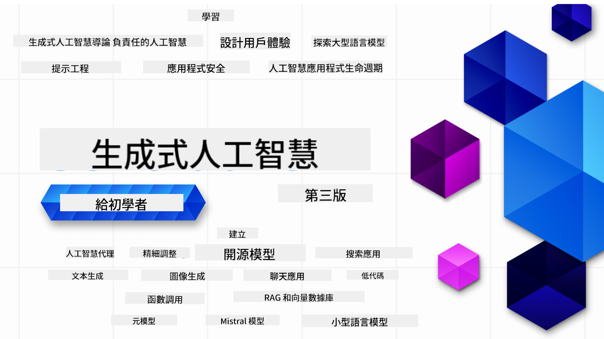

<!--
CO_OP_TRANSLATOR_METADATA:
{
  "original_hash": "4d022651f0c17151c68255e41a68e4ed",
  "translation_date": "2025-12-21T11:08:51+00:00",
  "source_file": "README.md",
  "language_code": "tw"
}
-->

### 21 節課程教你開始建立生成式 AI 應用所需的一切

### 🌐 多語言支援

#### 透過 GitHub Action 支援（自動化且隨時更新）

<!-- CO-OP TRANSLATOR LANGUAGES TABLE START -->
[阿拉伯語](../ar/README.md) | [孟加拉語](../bn/README.md) | [保加利亞語](../bg/README.md) | [緬甸語（緬甸）](../my/README.md) | [中文（簡體）](../zh/README.md) | [中文（繁體，香港）](../hk/README.md) | [中文（繁體，澳門）](../mo/README.md) | [中文（繁體，台灣）](./README.md) | [克羅埃西亞語](../hr/README.md) | [捷克語](../cs/README.md) | [丹麥語](../da/README.md) | [荷蘭語](../nl/README.md) | [愛沙尼亞語](../et/README.md) | [芬蘭語](../fi/README.md) | [法語](../fr/README.md) | [德語](../de/README.md) | [希臘語](../el/README.md) | [希伯來語](../he/README.md) | [印地語](../hi/README.md) | [匈牙利語](../hu/README.md) | [印尼語](../id/README.md) | [義大利語](../it/README.md) | [日語](../ja/README.md) | [卡納達語](../kn/README.md) | [韓語](../ko/README.md) | [立陶宛語](../lt/README.md) | [馬來語](../ms/README.md) | [馬拉雅拉姆語](../ml/README.md) | [馬拉地語](../mr/README.md) | [尼泊爾語](../ne/README.md) | [尼日利亞皮欽語](../pcm/README.md) | [挪威語](../no/README.md) | [波斯語（法爾西）](../fa/README.md) | [波蘭語](../pl/README.md) | [葡萄牙語（巴西）](../br/README.md) | [葡萄牙語（葡萄牙）](../pt/README.md) | [旁遮普語（Gurmukhi）](../pa/README.md) | [羅馬尼亞語](../ro/README.md) | [俄語](../ru/README.md) | [塞爾維亞語（西里爾字母）](../sr/README.md) | [斯洛伐克語](../sk/README.md) | [斯洛維尼亞語](../sl/README.md) | [西班牙語](../es/README.md) | [斯瓦希里語](../sw/README.md) | [瑞典語](../sv/README.md) | [他加祿語（菲律賓）](../tl/README.md) | [泰米爾語](../ta/README.md) | [泰盧固語](../te/README.md) | [泰語](../th/README.md) | [土耳其語](../tr/README.md) | [烏克蘭語](../uk/README.md) | [烏爾都語](../ur/README.md) | [越南語](../vi/README.md)
<!-- CO-OP TRANSLATOR LANGUAGES TABLE END -->

# 生成式 AI 初學者指南（版本 3）- 課程

透過 Microsoft Cloud Advocates 的 21 節綜合課程，學習建立生成式 AI 應用的基礎知識。

## 🌱 開始使用

本課程共有 21 節課程。每節課涵蓋不同主題，所以您可以從任何一節開始學習！

課程會標記為「Learn」課程（解釋生成式 AI 概念）或「Build」課程（在可能的情況下解釋概念並提供 **Python** 和 **TypeScript** 的程式範例）。

對於 .NET 開發者請參閱 [生成式 AI 初學者指南（.NET 版）](https://github.com/microsoft/Generative-AI-for-beginners-dotnet?WT.mc_id=academic-105485-koreyst)!

每堂課也都包含「Keep Learning」單元，內有額外的學習工具。

## 您需要什麼
### 要執行本課程的程式碼，您可以使用下列其中一項： 
 - [Azure OpenAI 服務](https://aka.ms/genai-beginners/azure-open-ai?WT.mc_id=academic-105485-koreyst) - **課程：** "aoai-assignment"
 - [GitHub Marketplace 模型目錄](https://aka.ms/genai-beginners/gh-models?WT.mc_id=academic-105485-koreyst) - **課程：** "githubmodels"
 - [OpenAI API](https://aka.ms/genai-beginners/open-ai?WT.mc_id=academic-105485-koreyst) - **課程：** "oai-assignment" 
   
- 基本的 Python 或 TypeScript 知識會有幫助 - \*對於完全初學者，請參閱這些 [Python](https://aka.ms/genai-beginners/python?WT.mc_id=academic-105485-koreyst) 和 [TypeScript](https://aka.ms/genai-beginners/typescript?WT.mc_id=academic-105485-koreyst) 課程
- 一個 GitHub 帳戶，用來將 [整個 repo fork 到你的 GitHub 帳戶](https://aka.ms/genai-beginners/github?WT.mc_id=academic-105485-koreyst)

我們已建立一個 **[課程設定](./00-course-setup/README.md?WT.mc_id=academic-105485-koreyst)** 單元來協助您設定開發環境。

別忘了 [標星 (🌟) 這個 repo](https://docs.github.com/en/get-started/exploring-projects-on-github/saving-repositories-with-stars?WT.mc_id=academic-105485-koreyst)，以便日後更容易找到。

## 🧠 準備部署了嗎？

如果您在尋找更進階的程式範例，請參閱我們的 [生成式 AI 程式碼範例集合](https://aka.ms/genai-beg-code?WT.mc_id=academic-105485-koreyst)，內含 **Python** 與 **TypeScript** 範例。

## 🗣️ 與其他學員交流、獲得支援

加入我們的 [官方 Azure AI Foundry Discord 伺服器](https://aka.ms/genai-discord?WT.mc_id=academic-105485-koreyst)，與其他正在修習本課程的學員交流並取得支援。

在我們的 Github 上於 [Azure AI Foundry 開發者論壇](https://aka.ms/azureaifoundry/forum) 提問或分享產品回饋。

## 🚀 想創業嗎？

瀏覽 [Microsoft for Startups](https://www.microsoft.com/startups) 以了解如何開始使用 Azure 積分建立您的產品。

## 🙏 想要幫忙嗎？

您有建議或發現拼字或程式碼錯誤嗎？[提出 issue](https://github.com/microsoft/generative-ai-for-beginners/issues?WT.mc_id=academic-105485-koreyst) 或 [建立 Pull Request](https://github.com/microsoft/generative-ai-for-beginners/pulls?WT.mc_id=academic-105485-koreyst)

## 📂 每堂課包含：

- 一段主題的短影片介紹
- 位於 README 的書面課程
- 支援 Azure OpenAI 與 OpenAI API 的 Python 和 TypeScript 範例程式碼
- 繼續學習的額外資源連結

## 🗃️ 課程列表

| #   | **課程連結**                                                                                                                              | **說明**                                                                                 | **影片**                                                                   | **額外學習資源**                                                             |
| --- | -------------------------------------------------------------------------------------------------------------------------------------------- | ----------------------------------------------------------------------------------------------- | --------------------------------------------------------------------------- | ------------------------------------------------------------------------------ |
| 00  | [課程設定](./00-course-setup/README.md?WT.mc_id=academic-105485-koreyst)                                                                 | **Learn:** 如何設定您的開發環境                                            | Video Coming Soon                                                                 | [了解更多](https://aka.ms/genai-collection?WT.mc_id=academic-105485-koreyst) |
| 01  | [生成式 AI 與大型語言模型入門](./01-introduction-to-genai/README.md?WT.mc_id=academic-105485-koreyst)                              | **Learn:** 了解什麼是生成式 AI 以及大型語言模型（LLMs）如何運作       | [影片](https://aka.ms/gen-ai-lesson-1-gh?WT.mc_id=academic-105485-koreyst) | [了解更多](https://aka.ms/genai-collection?WT.mc_id=academic-105485-koreyst) |
| 02  | [探索並比較不同的 LLMs](./02-exploring-and-comparing-different-llms/README.md?WT.mc_id=academic-105485-koreyst)             | **Learn:** 如何為您的使用情境選擇合適的模型                                      | [影片](https://aka.ms/gen-ai-lesson2-gh?WT.mc_id=academic-105485-koreyst)  | [了解更多](https://aka.ms/genai-collection?WT.mc_id=academic-105485-koreyst) |
| 03  | [負責任地使用生成式 AI](./03-using-generative-ai-responsibly/README.md?WT.mc_id=academic-105485-koreyst)                           | **Learn:** 如何以負責任的方式建立生成式 AI 應用                                  | [影片](https://aka.ms/gen-ai-lesson3-gh?WT.mc_id=academic-105485-koreyst)  | [了解更多](https://aka.ms/genai-collection?WT.mc_id=academic-105485-koreyst) |
| 04  | [提示工程基礎概念](./04-prompt-engineering-fundamentals/README.md?WT.mc_id=academic-105485-koreyst)             | **Learn:** 實作提示工程的最佳做法                                           | [影片](https://aka.ms/gen-ai-lesson4-gh?WT.mc_id=academic-105485-koreyst)  | [了解更多](https://aka.ms/genai-collection?WT.mc_id=academic-105485-koreyst) |
| 05  | [建立進階提示](./05-advanced-prompts/README.md?WT.mc_id=academic-105485-koreyst)                                                | **學習：** 如何應用提示工程技術以提升提示的結果。 | [影片](https://aka.ms/gen-ai-lesson5-gh?WT.mc_id=academic-105485-koreyst)  | [了解更多](https://aka.ms/genai-collection?WT.mc_id=academic-105485-koreyst) |
| 06  | [建立文字產生應用程式](./06-text-generation-apps/README.md?WT.mc_id=academic-105485-koreyst)                                | **實作：** 使用 Azure OpenAI / OpenAI API 建立文字產生應用程式                                | [影片](https://aka.ms/gen-ai-lesson6-gh?WT.mc_id=academic-105485-koreyst)  | [了解更多](https://aka.ms/genai-collection?WT.mc_id=academic-105485-koreyst) |
| 07  | [建立聊天應用程式](./07-building-chat-applications/README.md?WT.mc_id=academic-105485-koreyst)                                     | **實作：** 有效構建與整合聊天應用程式的技術。               | [影片](https://aka.ms/gen-ai-lessons7-gh?WT.mc_id=academic-105485-koreyst) | [了解更多](https://aka.ms/genai-collection?WT.mc_id=academic-105485-koreyst) |
| 08  | [建立搜尋應用程式與向量資料庫](./08-building-search-applications/README.md?WT.mc_id=academic-105485-koreyst)                        | **實作：** 一個使用 Embeddings 搜尋資料的搜尋應用程式。                        | [影片](https://aka.ms/gen-ai-lesson8-gh?WT.mc_id=academic-105485-koreyst)  | [了解更多](https://aka.ms/genai-collection?WT.mc_id=academic-105485-koreyst) |
| 09  | [建立影像生成應用程式](./09-building-image-applications/README.md?WT.mc_id=academic-105485-koreyst)                        | **實作：** 一個影像生成應用程式                                                       | [影片](https://aka.ms/gen-ai-lesson9-gh?WT.mc_id=academic-105485-koreyst)  | [了解更多](https://aka.ms/genai-collection?WT.mc_id=academic-105485-koreyst) |
| 10  | [建立低程式碼 AI 應用程式](./10-building-low-code-ai-applications/README.md?WT.mc_id=academic-105485-koreyst)                       | **實作：** 使用低程式碼工具建立一個生成式 AI 應用程式                                     | [影片](https://aka.ms/gen-ai-lesson10-gh?WT.mc_id=academic-105485-koreyst) | [了解更多](https://aka.ms/genai-collection?WT.mc_id=academic-105485-koreyst) |
| 11  | [整合外部應用程式與函式呼叫](./11-integrating-with-function-calling/README.md?WT.mc_id=academic-105485-koreyst) | **實作：** 什麼是函式呼叫及其在應用程式中的使用案例                          | [影片](https://aka.ms/gen-ai-lesson11-gh?WT.mc_id=academic-105485-koreyst) | [了解更多](https://aka.ms/genai-collection?WT.mc_id=academic-105485-koreyst) |
| 12  | [為 AI 應用程式設計使用者體驗](./12-designing-ux-for-ai-applications/README.md?WT.mc_id=academic-105485-koreyst)                         | **學習：** 在開發生成式 AI 應用程式時如何套用 UX 設計原則         | [影片](https://aka.ms/gen-ai-lesson12-gh?WT.mc_id=academic-105485-koreyst) | [了解更多](https://aka.ms/genai-collection?WT.mc_id=academic-105485-koreyst) |
| 13  | [保護您的生成式 AI 應用程式](./13-securing-ai-applications/README.md?WT.mc_id=academic-105485-koreyst)                         | **學習：** AI 系統的威脅與風險及保護這些系統的方法。             | [影片](https://aka.ms/gen-ai-lesson13-gh?WT.mc_id=academic-105485-koreyst) | [了解更多](https://aka.ms/genai-collection?WT.mc_id=academic-105485-koreyst) |
| 14  | [生成式 AI 應用程式的生命週期](./14-the-generative-ai-application-lifecycle/README.md?WT.mc_id=academic-105485-koreyst)           | **學習：** 管理 LLM 生命週期與 LLMOps 的工具與指標                         | [影片](https://aka.ms/gen-ai-lesson14-gh?WT.mc_id=academic-105485-koreyst) | [了解更多](https://aka.ms/genai-collection?WT.mc_id=academic-105485-koreyst) |
| 15  | [檢索擴充生成 (RAG) 與向量資料庫](./15-rag-and-vector-databases/README.md?WT.mc_id=academic-105485-koreyst)        | **實作：** 使用 RAG 架構從向量資料庫擷取嵌入向量的應用程式  | [影片](https://aka.ms/gen-ai-lesson15-gh?WT.mc_id=academic-105485-koreyst) | [了解更多](https://aka.ms/genai-collection?WT.mc_id=academic-105485-koreyst) |
| 16  | [開放原始碼模型與 Hugging Face](./16-open-source-models/README.md?WT.mc_id=academic-105485-koreyst)                                    | **實作：** 使用 Hugging Face 上可用的開放原始碼模型建立應用程式                    | [影片](https://aka.ms/gen-ai-lesson16-gh?WT.mc_id=academic-105485-koreyst) | [了解更多](https://aka.ms/genai-collection?WT.mc_id=academic-105485-koreyst) |
| 17  | [AI 代理](./17-ai-agents/README.md?WT.mc_id=academic-105485-koreyst)                                                                       | **實作：** 使用 AI Agent 框架建立應用程式                                           | [影片](https://aka.ms/gen-ai-lesson17-gh?WT.mc_id=academic-105485-koreyst) | [了解更多](https://aka.ms/genai-collection?WT.mc_id=academic-105485-koreyst) |
| 18  | [微調大型語言模型 (LLMs)](./18-fine-tuning/README.md?WT.mc_id=academic-105485-koreyst)                                                              | **學習：** 微調 LLM 的內容、原因與方法                                            | [影片](https://aka.ms/gen-ai-lesson18-gh?WT.mc_id=academic-105485-koreyst) | [了解更多](https://aka.ms/genai-collection?WT.mc_id=academic-105485-koreyst) |
| 19  | [使用小型語言模型 (SLMs) 建置](./19-slm/README.md?WT.mc_id=academic-105485-koreyst)                                                              | **學習：** 使用小型語言模型建置的好處                                            | 影片即將推出 | [了解更多](https://aka.ms/genai-collection?WT.mc_id=academic-105485-koreyst) |
| 20  | [使用 Mistral 系列模型 建置](./20-mistral/README.md?WT.mc_id=academic-105485-koreyst)                                                              | **學習：** Mistral 家族模型的特性與差異                                           | 影片即將推出 | [了解更多](https://aka.ms/genai-collection?WT.mc_id=academic-105485-koreyst) |
| 21  | [使用 Meta 系列模型 建置](./21-meta/README.md?WT.mc_id=academic-105485-koreyst)                                                              | **學習：** Meta 家族模型的特性與差異                                           | 影片即將推出 | [了解更多](https://aka.ms/genai-collection?WT.mc_id=academic-105485-koreyst) |

### 🌟 特別感謝

特別感謝 [**John Aziz**](https://www.linkedin.com/in/john0isaac/) 創建所有的 GitHub Actions 與工作流程

[**Bernhard Merkle**](https://www.linkedin.com/in/bernhard-merkle-738b73/) 感謝在每個課程中做出關鍵貢獻，以改善學習者與程式碼的體驗。 

## 🎒 其他課程

我們團隊還製作其他課程！看看：

<!-- CO-OP TRANSLATOR OTHER COURSES START -->
### LangChain

---

### Azure / Edge / MCP / 代理

---
 
### 生成式 AI 系列

[-9333EA?style=for-the-badge&labelColor=E5E7EB&color=9333EA)](https://github.com/microsoft/Generative-AI-for-beginners-dotnet?WT.mc_id=academic-105485-koreyst)
[-C084FC?style=for-the-badge&labelColor=E5E7EB&color=C084FC)](https://github.com/microsoft/generative-ai-for-beginners-java?WT.mc_id=academic-105485-koreyst)
[-E879F9?style=for-the-badge&labelColor=E5E7EB&color=E879F9)](https://github.com/microsoft/generative-ai-with-javascript?WT.mc_id=academic-105485-koreyst)

---
 
### 核心學習

---
 
### Copilot 系列

<!-- CO-OP TRANSLATOR OTHER COURSES END -->

## 尋求幫助

如果你在建立 AI 應用時遇到困難或有任何問題。加入其他學習者和經驗豐富的開發者，參與有關 MCP 的討論。這是一個支持性的社群，歡迎發問並自由分享知識。

如果在開發過程中有產品回饋或遇到錯誤，請造訪：

---

<!-- CO-OP TRANSLATOR DISCLAIMER START -->
免責聲明：
本文件已使用 AI 翻譯服務「Co-op Translator」(https://github.com/Azure/co-op-translator) 進行翻譯。雖然我們力求準確，但請注意自動翻譯可能包含錯誤或不準確之處。原始文件的原文應視為具權威性的來源。對於重要資訊，建議採用專業人工翻譯。我們不對因使用本翻譯而產生的任何誤解或誤譯負責。
<!-- CO-OP TRANSLATOR DISCLAIMER END -->