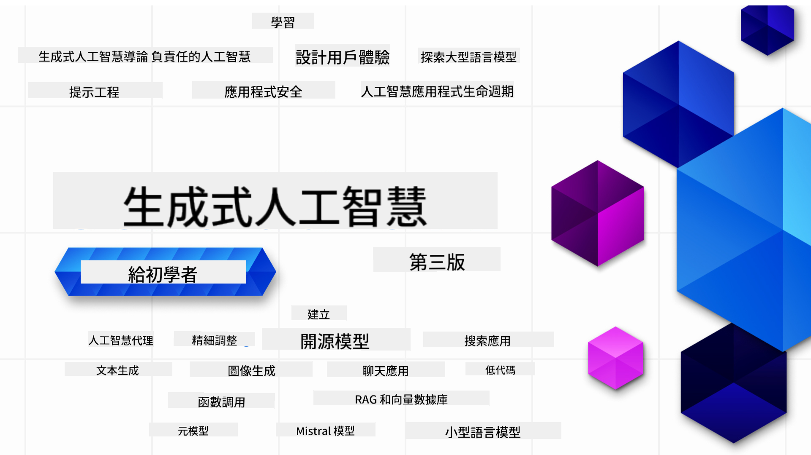

<!--
CO_OP_TRANSLATOR_METADATA:
{
  "original_hash": "6e3f4c8a4f323b8eab1cf11ded304b0f",
  "translation_date": "2025-06-25T07:41:37+00:00",
  "source_file": "README.md",
  "language_code": "tw"
}
-->

### 21堂課教你一切需要知道的內容，以開始建立生成式AI應用程式

### 🌐 多語言支援

#### 透過GitHub Action支持（自動化且始終保持最新）

# 初學者生成式 AI (第三版) - 一門課程

透過微軟雲端倡導者的21堂課程，學習構建生成式 AI 應用的基本原理。

## 🌱 開始學習

本課程共有21堂課。每堂課涵蓋其獨立的主題，您可以隨意選擇開始的地方！

課程分為兩類：「學習」課程解釋生成式 AI 概念，或「建構」課程解釋概念並提供 **Python** 和 **TypeScript** 的程式範例（若可能）。

對於 .NET 開發者，請查看 [初學者生成式 AI (.NET 版)](https://github.com/microsoft/Generative-AI-for-beginners-dotnet?WT.mc_id=academic-105485-koreyst)!

每堂課還包含「持續學習」部分，提供額外的學習工具。

## 所需條件
### 要執行本課程的程式碼，您可以使用：
- [Azure OpenAI 服務](https://aka.ms/genai-beginners/azure-open-ai?WT.mc_id=academic-105485-koreyst) - **課程:** "aoai-assignment"
- [GitHub Marketplace 模型目錄](https://aka.ms/genai-beginners/gh-models?WT.mc_id=academic-105485-koreyst) - **課程:** "githubmodels"
- [OpenAI API](https://aka.ms/genai-beginners/open-ai?WT.mc_id=academic-105485-koreyst) - **課程:** "oai-assignment"

- 基本的 Python 或 TypeScript 知識是有幫助的 - \*對於完全初學者，請查看這些 [Python](https://aka.ms/genai-beginners/python?WT.mc_id=academic-105485-koreyst) 和 [TypeScript](https://aka.ms/genai-beginners/typescript?WT.mc_id=academic-105485-koreyst) 課程
- 一個 GitHub 帳戶來 [fork 整個 repo](https://aka.ms/genai-beginners/github?WT.mc_id=academic-105485-koreyst) 到您自己的 GitHub 帳戶

我們已創建了一個 **[課程設置](./00-course-setup/README.md?WT.mc_id=academic-105485-koreyst)** 課程來幫助您設置開發環境。

別忘了 [star (🌟) 這個 repo](https://docs.github.com/en/get-started/exploring-projects-on-github/saving-repositories-with-stars?WT.mc_id=academic-105485-koreyst)，以便稍後更容易找到。

## 🧠 準備部署？

如果您在尋找更高級的程式碼範例，請查看我們的 [生成式 AI 程式碼範例集](https://aka.ms/genai-beg-code?WT.mc_id=academic-105485-koreyst)，其中包含 **Python** 和 **TypeScript**。

## 🗣️ 與其他學習者交流，獲得支持

加入我們的 [官方 Azure AI Foundry Discord 伺服器](https://aka.ms/genai-discord?WT.mc_id=academic-105485-koreyst)，與其他學習者交流並獲得支持。

在我們的 [Azure AI Foundry 開發者論壇](https://aka.ms/azureaifoundry/forum) 上提問或分享產品反饋。

## 🚀 創建新創公司？

註冊 [Microsoft for Startups Founders Hub](https://aka.ms/genai-foundershub?WT.mc_id=academic-105485-koreyst)，以獲得 **免費 OpenAI 點數** 和最多 **$150k 的 Azure 點數來通過 Azure OpenAI 服務訪問 OpenAI 模型**。

## 🙏 想要幫助？

您有建議或發現拼寫或程式錯誤嗎？[提出問題](https://github.com/microsoft/generative-ai-for-beginners/issues?WT.mc_id=academic-105485-koreyst) 或 [創建拉取請求](https://github.com/microsoft/generative-ai-for-beginners/pulls?WT.mc_id=academic-105485-koreyst)

## 📂 每堂課包括：

- 主題的簡短視頻介紹
- 位於 README 中的書面課程
- 支持 Azure OpenAI 和 OpenAI API 的 Python 和 TypeScript 程式碼範例
- 連結至額外資源以繼續學習

## 🗃️ 課程

| #   | **課程連結**                                                                                                                              | **描述**                                                                                 | **視頻**                                                                   | **額外學習**                                                             |
| --- | -------------------------------------------------------------------------------------------------------------------------------------------- | ----------------------------------------------------------------------------------------------- | --------------------------------------------------------------------------- | ------------------------------------------------------------------------------ |
| 00  | [課程設置](./00-course-setup/README.md?WT.mc_id=academic-105485-koreyst)                                                                 | **學習:** 如何設置您的開發環境                                            | 即將推出視頻                                                                 | [了解更多](https://aka.ms/genai-collection?WT.mc_id=academic-105485-koreyst) |
| 01  | [生成式 AI 和 LLMs 介紹](./01-introduction-to-genai/README.md?WT.mc_id=academic-105485-koreyst)                              | **學習:** 理解生成式 AI 是什麼以及大型語言模型 (LLMs) 如何運作       | [視頻](https://aka.ms/gen-ai-lesson-1-gh?WT.mc_id=academic-105485-koreyst) | [了解更多](https://aka.ms/genai-collection?WT.mc_id=academic-105485-koreyst) |
| 02  | [探索和比較不同的 LLMs](./02-exploring-and-comparing-different-llms/README.md?WT.mc_id=academic-105485-koreyst)             | **學習:** 如何選擇適合您使用案例的模型                                      | [視頻](https://aka.ms/gen-ai-lesson2-gh?WT.mc_id=academic-105485-koreyst)  | [了解更多](https://aka.ms/genai-collection?WT.mc_id=academic-105485-koreyst) |
| 03  | [負責任地使用生成式 AI](./03-using-generative-ai-responsibly/README.md?WT.mc_id=academic-105485-koreyst)                           | **學習:** 如何負責任地構建生成式 AI 應用                                  | [視頻](https://aka.ms/gen-ai-lesson3-gh?WT.mc_id=academic-105485-koreyst)  | [了解更多](https://aka.ms/genai-collection?WT.mc_id=academic-105485-koreyst) |
| 04  | [理解提示工程的基本原理](./04-prompt-engineering-fundamentals/README.md?WT.mc_id=academic-105485-koreyst)             | **學習:** 實作提示工程最佳實踐                                           | [視頻](https://aka.ms/gen-ai-lesson4-gh?WT.mc_id=academic-105485-koreyst)  | [了解更多](https://aka.ms/genai-collection?WT.mc_id=academic-105485-koreyst) |
| 05  | [創建高級提示](./05-advanced-prompts/README.md?WT.mc_id=academic-105485-koreyst)                                                | **學習:** 如何應用提示工程技術以改善提示的結果。 | [影片](https://aka.ms/gen-ai-lesson5-gh?WT.mc_id=academic-105485-koreyst)  | [了解更多](https://aka.ms/genai-collection?WT.mc_id=academic-105485-koreyst) |
| 06  | [建立文本生成應用程式](./06-text-generation-apps/README.md?WT.mc_id=academic-105485-koreyst)                                | **構建:** 使用 Azure OpenAI / OpenAI API 建立文本生成應用程式                                | [影片](https://aka.ms/gen-ai-lesson6-gh?WT.mc_id=academic-105485-koreyst)  | [了解更多](https://aka.ms/genai-collection?WT.mc_id=academic-105485-koreyst) |
| 07  | [建立聊天應用程式](./07-building-chat-applications/README.md?WT.mc_id=academic-105485-koreyst)                                     | **構建:** 有效建立和整合聊天應用程式的技術。               | [影片](https://aka.ms/gen-ai-lessons7-gh?WT.mc_id=academic-105485-koreyst) | [了解更多](https://aka.ms/genai-collection?WT.mc_id=academic-105485-koreyst) |
| 08  | [建立搜尋應用程式向量資料庫](./08-building-search-applications/README.md?WT.mc_id=academic-105485-koreyst)                        | **構建:** 使用嵌入技術進行資料搜尋的應用程式                        | [影片](https://aka.ms/gen-ai-lesson8-gh?WT.mc_id=academic-105485-koreyst)  | [了解更多](https://aka.ms/genai-collection?WT.mc_id=academic-105485-koreyst) |
| 09  | [建立圖像生成應用程式](./09-building-image-applications/README.md?WT.mc_id=academic-105485-koreyst)                        | **構建:** 圖像生成應用程式                                                       | [影片](https://aka.ms/gen-ai-lesson9-gh?WT.mc_id=academic-105485-koreyst)  | [了解更多](https://aka.ms/genai-collection?WT.mc_id=academic-105485-koreyst) |
| 10  | [建立低代碼 AI 應用程式](./10-building-low-code-ai-applications/README.md?WT.mc_id=academic-105485-koreyst)                       | **構建:** 使用低代碼工具建立生成式 AI 應用程式                                     | [影片](https://aka.ms/gen-ai-lesson10-gh?WT.mc_id=academic-105485-koreyst) | [了解更多](https://aka.ms/genai-collection?WT.mc_id=academic-105485-koreyst) |
| 11  | [整合外部應用程式與函數調用](./11-integrating-with-function-calling/README.md?WT.mc_id=academic-105485-koreyst) | **構建:** 什麼是函數調用及其在應用程式中的使用案例                          | [影片](https://aka.ms/gen-ai-lesson11-gh?WT.mc_id=academic-105485-koreyst) | [了解更多](https://aka.ms/genai-collection?WT.mc_id=academic-105485-koreyst) |
| 12  | [設計 AI 應用程式的使用者體驗](./12-designing-ux-for-ai-applications/README.md?WT.mc_id=academic-105485-koreyst)                         | **學習:** 如何在開發生成式 AI 應用程式時應用使用者體驗設計原則         | [影片](https://aka.ms/gen-ai-lesson12-gh?WT.mc_id=academic-105485-koreyst) | [了解更多](https://aka.ms/genai-collection?WT.mc_id=academic-105485-koreyst) |
| 13  | [保護您的生成式 AI 應用程式](./13-securing-ai-applications/README.md?WT.mc_id=academic-105485-koreyst)                         | **學習:** AI 系統的威脅和風險以及保護這些系統的方法。             | [影片](https://aka.ms/gen-ai-lesson13-gh?WT.mc_id=academic-105485-koreyst) | [了解更多](https://aka.ms/genai-collection?WT.mc_id=academic-105485-koreyst) |
| 14  | [生成式 AI 應用程式的生命周期](./14-the-generative-ai-application-lifecycle/README.md?WT.mc_id=academic-105485-koreyst)           | **學習:** 管理 LLM 生命周期和 LLMOps 的工具和指標                         | [影片](https://aka.ms/gen-ai-lesson14-gh?WT.mc_id=academic-105485-koreyst) | [了解更多](https://aka.ms/genai-collection?WT.mc_id=academic-105485-koreyst) |
| 15  | [檢索增強生成（RAG）和向量資料庫](./15-rag-and-vector-databases/README.md?WT.mc_id=academic-105485-koreyst)        | **構建：** 使用RAG框架從向量資料庫中檢索嵌入的應用程式  | [影片](https://aka.ms/gen-ai-lesson15-gh?WT.mc_id=academic-105485-koreyst) | [了解更多](https://aka.ms/genai-collection?WT.mc_id=academic-105485-koreyst) |
| 16  | [開源模型和Hugging Face](./16-open-source-models/README.md?WT.mc_id=academic-105485-koreyst)                                    | **構建：** 使用Hugging Face上的開源模型的應用程式                    | [影片](https://aka.ms/gen-ai-lesson16-gh?WT.mc_id=academic-105485-koreyst) | [了解更多](https://aka.ms/genai-collection?WT.mc_id=academic-105485-koreyst) |
| 17  | [AI代理](./17-ai-agents/README.md?WT.mc_id=academic-105485-koreyst)                                                                       | **構建：** 使用AI代理框架的應用程式                                           | [影片](https://aka.ms/gen-ai-lesson17-gh?WT.mc_id=academic-105485-koreyst) | [了解更多](https://aka.ms/genai-collection?WT.mc_id=academic-105485-koreyst) |
| 18  | [微調大型語言模型](./18-fine-tuning/README.md?WT.mc_id=academic-105485-koreyst)                                                              | **學習：** 微調大型語言模型的內容、原因和方法                                            | [影片](https://aka.ms/gen-ai-lesson18-gh?WT.mc_id=academic-105485-koreyst) | [了解更多](https://aka.ms/genai-collection?WT.mc_id=academic-105485-koreyst) |
| 19  | [使用小型語言模型構建](./19-slm/README.md?WT.mc_id=academic-105485-koreyst)                                                              | **學習：** 使用小型語言模型構建的好處                                            | 影片即將推出 | [了解更多](https://aka.ms/genai-collection?WT.mc_id=academic-105485-koreyst) |
| 20  | [使用Mistral模型構建](./20-mistral/README.md?WT.mc_id=academic-105485-koreyst)                                                              | **學習：** Mistral系列模型的特點和差異                                           | 影片即將推出 | [了解更多](https://aka.ms/genai-collection?WT.mc_id=academic-105485-koreyst) |
| 21  | [使用Meta模型構建](./21-meta/README.md?WT.mc_id=academic-105485-koreyst)                                                              | **學習：** Meta系列模型的特點和差異                                           | 影片即將推出 | [了解更多](https://aka.ms/genai-collection?WT.mc_id=academic-105485-koreyst) |

### 🌟 特別感謝

特別感謝 [**John Aziz**](https://www.linkedin.com/in/john0isaac/) 創建了所有的GitHub Actions和工作流程

[**Bernhard Merkle**](https://www.linkedin.com/in/bernhard-merkle-738b73/) 為每一課做出關鍵貢獻，以改善學習者和代碼的體驗。

## 🎒 其他課程

我們的團隊還製作了其他課程！看看：

- [**新** 模型上下文協議初學者](https://github.com/microsoft/mcp-for-beginners?WT.mc_id=academic-105485-koreyst)
- [AI代理初學者](https://github.com/microsoft/ai-agents-for-beginners?WT.mc_id=academic-105485-koreyst)
- [使用.NET的生成式AI初學者](https://github.com/microsoft/Generative-AI-for-beginners-dotnet?WT.mc_id=academic-105485-koreyst)
- [使用JavaScript的生成式AI初學者](https://aka.ms/genai-js-course?WT.mc_id=academic-105485-koreyst)
- [機器學習初學者](https://aka.ms/ml-beginners?WT.mc_id=academic-105485-koreyst)
- [數據科學初學者](https://aka.ms/datascience-beginners?WT.mc_id=academic-105485-koreyst)
- [AI初學者](https://aka.ms/ai-beginners?WT.mc_id=academic-105485-koreyst)
- [網路安全初學者](https://github.com/microsoft/Security-101??WT.mc_id=academic-96948-sayoung)
- [網頁開發初學者](https://aka.ms/webdev-beginners?WT.mc_id=academic-105485-koreyst)
- [物聯網初學者](https://aka.ms/iot-beginners?WT.mc_id=academic-105485-koreyst)
- [初學者的 XR 開發](https://github.com/microsoft/xr-development-for-beginners?WT.mc_id=academic-105485-koreyst)
- [精通 GitHub Copilot 的 AI 配對編程](https://aka.ms/GitHubCopilotAI?WT.mc_id=academic-105485-koreyst)
- [精通 GitHub Copilot 的 C#/.NET 開發](https://github.com/microsoft/mastering-github-copilot-for-dotnet-csharp-developers?WT.mc_id=academic-105485-koreyst)
- [選擇您自己的 Copilot 冒險](https://github.com/microsoft/CopilotAdventures?WT.mc_id=academic-105485-koreyst)

**免責聲明**：
本文檔已使用 AI 翻譯服務 [Co-op Translator](https://github.com/Azure/co-op-translator) 進行翻譯。儘管我們努力追求準確性，但請注意自動翻譯可能包含錯誤或不準確之處。應將原始文件的本地語言版本視為權威來源。對於重要信息，建議尋求專業人工翻譯。我們不對因使用此翻譯而產生的任何誤解或誤釋承擔責任。